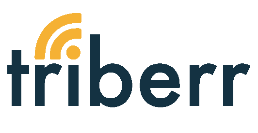
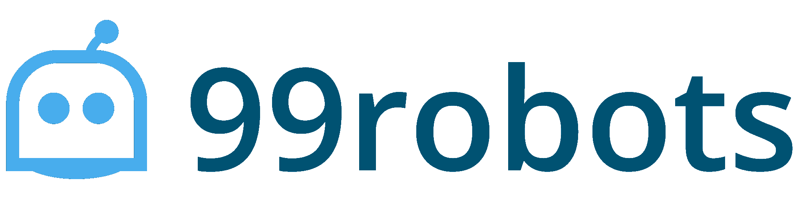

# 金斯塔·金并:查理·帕特尔访谈

> 原文：<https://kinsta.com/blog/interview-with-charlie-patel/>

你可以在 LinkedIn 或 T2 的 Twitter 上找到查理。这是我们最近对他的采访，作为我们[金斯塔·金并](https://kinsta.com/?post_type=post&s=kingpin)系列的一部分。

Q1:你的背景是什么，&你最初是如何加入 WordPress 的？

我的职业生涯始于金融服务行业的执行顾问，通常是混合业务和技术团队。我在企业界工作了 10 年，为摩根大通、埃森哲、房利美、房地美和 GE Capital 等公司领导了预算从 100 万到 5 亿美元的大型金融系统项目。

在我二十出头的时候，我有一种创业的渴望，这让我创办了一家咨询和人事公司。它做得相当好，让我得以在世界各地广泛旅行，并投资于其他公司。最终，我和其他人合作了各种风险投资，从体育设施到特许经营再到互联网创业。作为一名连续创业者，我目前正在杂耍几家公司，包括[99 Robots](https://99robots.com)——一家数字营销和 WP 开发机构、[Triberr](http://triberr.com)—一家内容影响力营销 SaaS 公司、[juice tank](http://juicetank.com)—一家创业孵化器。

[T2】](http://triberr.com/)

我参与 WordPress 完全是出于需要。坦白地说，我厌倦了付钱给别人建立网站。2008 年，我和我的合伙人开了一家主题店，让我沉浸在 [WordPress 生态系统](https://kinsta.com/learn/wordpress-history/)中。如今，我们的代理公司主要专注于 WordPress 的开发，为营销人员和出版商开发[插件。](https://kinsta.com/learn/content-marketing/)

Q2:读者应该知道关于 99 机器人的什么，&什么样的客户是合适的？

我们的团队由营销人员和开发人员组成，因此我们非常满足客户的需求。我们的团队中有管理数百万美元广告预算的人，也有开发开源和高端产品的开发人员，这些产品被数千个网站使用。我们是一个小团队，比大得多的机构能在更短的时间内完成更多的工作。

[T2】](https://99robots.com/)

对于我们的数字营销服务，我们的客户有大有小，涵盖金融机构、房地产、家庭服务、消费产品和个人品牌(教练、作者、信息产品等)等行业。).

对于我们的 WordPress 开发服务，我们的客户范围从[大型在线报纸和杂志](https://kinsta.com/blog/wordpress-site-examples/)到企业品牌。

我们所有客户的共同点是，他们最大的收入渠道是他们的网站。因此，我们不必教育他们为什么投资营销和技术很重要。

**Q3:读者应该了解 JuiceTank 的哪些方面，哪些类型的客户是合适的？**

JuiceTank 是一家由三部分组成的公司，提供以下服务:

*   创业孵化器
*   合作空间
*   咨询服务

我们每年会看到大约 500 个创业项目，要么投资，要么和少数几个达成交易。

[T2】](http://juicetank.com)

JuiceTank 的理想选择是拥有强大团队的初创公司，该团队在各自的市场上拥有良好的业绩或独特的优势，并拥有某种形式的吸引力，如收入、用户或客户。然而，我们的共同工作空间对任何寻求开放、充满活力和协作的工作环境的人开放，不管我们是否投资。

**Q4:你在建立自己的公司时遇到了哪些挑战？**

我将列出我们面临的最大挑战，以及我们将采取哪些措施来应对这些挑战:

**收入高峰和低谷**—代理公司的生活充满了财务上的起伏。当你不知道自己下个月、下个月或今年能赚多少钱时，经营一家企业是很困难的。因此，我们有意识地试图专注于基于预聘的项目，而不是一次性交易。这不仅适用于营销服务，也适用于我们的网站开发和支持包。此外，我们利用空闲时间开发 [WordPress 插件](https://99robots.com/products)或 SaaS 产品，带来额外的经常性收入。

**说不**——和许多广告公司一样，找到足够多的客户至关重要。然而，计算参与的成本很重要，因为一些项目或客户可能很快成为财务或时间负债。我们现在坚持对不符合我们财务指标、公司目标或利益的项目说'**'不'**。

## 注册订阅时事通讯

### 想知道我们是怎么让流量增长超过 1000%的吗？

加入 20，000 多名获得我们每周时事通讯和内部消息的人的行列吧！

[Subscribe Now](#newsletter)

**太宽泛**–事实上，大多数机构都在努力应对这一挑战，因为他们提供了太多的服务。有罪！虽然我们已经取消了某些产品，但我希望进一步缩小我们的服务范围。专注！

**Q5:在成长的过程中有没有什么让你惊喜的事情？**

有一件事，大多数机构所有者直到发生时才意识到，那就是伙伴关系的力量。事实上，我们有一个内部计划，在年底前创建更多的代理和推荐合作伙伴关系。我们 50%以上的客户来自推荐。总成本=零☺

如果我不得不从头再来一遍，我会在追求或花费在内容、社交或集客营销上之前先从这个开始。

既然你经营 Juice Tank，你对那些希望筹集资金的人有什么建议？

根据我多年来的观察，这里有 3 个建议:

**提示 1——收入、用户和/或客户——选择一个！**

我为我们的空间制作了一张海报，上面写着:

> “这与想法无关，而是让想法成真。”

Struggling with downtime and WordPress problems? Kinsta is the hosting solution designed to save you time! [Check out our features](https://kinsta.com/features/)

投资者不太关心创意，但大多数筹集资金的创始人只关注创意。

每个人都有一个思想库。不幸的是，几乎没有人对他们采取行动。作为一名投资者，我寻找的是 T2 执行 T3 想法的能力。换句话说，让我看看你有能力**做到以下任何一点**:

*   创收–展示团队的财务能力
*   创造用户——伟大的应用？向我展示你已经在不倾家荡产的情况下获得了用户，并且用户群实际上是有价值的。
*   创造客户——证明有人愿意倾听并付费

不要开始筹集资金，直到你有一个或多个以上的元素牵引。

**提示 2:了解你的数学知识**

[很多创始人筹集资金](https://kinsta.com/blog/vc-route/)却不知道自己的数字。当你筹集资金时，你必须对你的业务和行业有财务上的了解。缺乏以下问题的可靠答案会直接导致交易失败:

*   你要价多少？
*   你是怎么算出这个数目的？
*   你每月花费多少？(即燃烧速率)
*   X 美元的投资能给你买多少时间？
*   作为投资者，我如何获得 10 倍的投资回报率？
*   为什么投资 X 美元在你的公司，而不是你的竞争对手？

令人惊讶的是，超过 50%的初创公司无法对这类问题提供实质性的、有数据支持的回答。

**提示 3:避免筹集资金**

我发现一些筹集资金的公司实际上并不需要筹集资金。事实上，他们中的许多人会更好地聘请行业专家或花同样多的时间获得更多的客户。筹集资金成了公司一个或多个领导的全职工作。所以如果可以避免，就把时间花在别的地方。如果你无法超越目前的职位来扩展你的团队或业务，那么融资就更有意义。

当你离开笔记本电脑时，你喜欢做什么？你去过哪些国家？

巧合的是，我是在飞往加拿大蒙特利尔的途中回复的。我有幸有机会去过 70 多个国家。无论是在缅甸背包旅行，还是在新西兰蹦极，或者在约旦或巴西观光，当今世界是一个小地方。

旅行的时候，我尽量远离笔记本电脑。不过，我承认这很难。如果让我重新来过，我会少去几个国家，但会花更多的时间沉浸在当地的风景中，和当地人交朋友，学习语言。这就是我对旅行的想法。

接下来我们应该采访谁，为什么？

我对 [Freemius](https://freemius.com/) 的人印象深刻。他们在做有创意的事情，并真正完成产品开发和内容营销。给[沃瓦·费尔德曼](https://kinsta.com/blog/interview-with-vova-feldman/)或者[科比·本·伊塔马尔](https://twitter.com/Caparico)喊一声。

* * *

让你所有的[应用程序](https://kinsta.com/application-hosting/)、[数据库](https://kinsta.com/database-hosting/)和 [WordPress 网站](https://kinsta.com/wordpress-hosting/)在线并在一个屋檐下。我们功能丰富的高性能云平台包括:

*   在 MyKinsta 仪表盘中轻松设置和管理
*   24/7 专家支持
*   最好的谷歌云平台硬件和网络，由 Kubernetes 提供最大的可扩展性
*   面向速度和安全性的企业级 Cloudflare 集成
*   全球受众覆盖全球多达 35 个数据中心和 275 多个 pop

在第一个月使用托管的[应用程序或托管](https://kinsta.com/application-hosting/)的[数据库，您可以享受 20 美元的优惠，亲自测试一下。探索我们的](https://kinsta.com/database-hosting/)[计划](https://kinsta.com/plans/)或[与销售人员交谈](https://kinsta.com/contact-us/)以找到最适合您的方式。