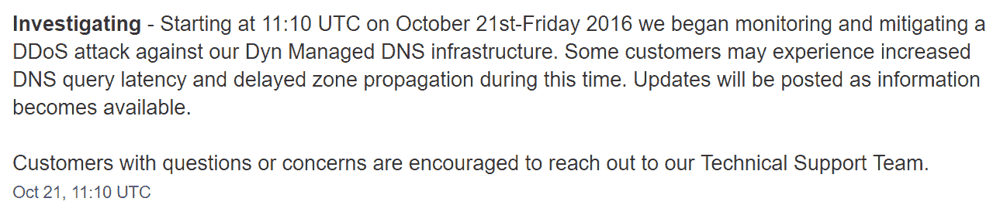

# 为什么高级 DNS 不再是可选的

> 原文：<https://kinsta.com/blog/premium-dns/>

你可能听说过“高级域名系统”这个词，也许你根本没想过。大多数人知道使用高级 DNS 提供商可以帮助他们，但不主动实施，或者可能不知道如何实施。

2016 年 10 月 21 日，历史上最大的 [DDoS 攻击](https://kinsta.com/blog/what-is-a-ddos-attack/)发生，搞垮了 PayPal、Spotify、Twitter、Reddit、易贝等大公司。有些人甚至称之为互联网的 [DNS 末日](http://blog.catchpoint.com/2016/10/23/dyn-dns-outage/)。今天我们想深入探讨一个优质的 DNS 提供商如何在这些情况下帮助你，如果设置正确的话，并防止你的 WordPress 站点宕机。

*   [什么是 DNS？](#what-is-dns)
*   [影响整个互联网的 DNS 攻击](#dns-attack-entire-internet)
*   [高级 DNS 提供商的优势](#premium-dns-benefits)
*   [如何使用 Kinsta 设置高级域名系统](#set-up-premium-dns-kinsta)

## 什么是 DNS？

DNS(域名系统)是互联网的主干。你可以把它想象成万维网的电话簿。你访问的每个网站和域名都被映射到一个 IP 地址。

当您在地址栏中键入 Google.com 时，您的 ISP 会执行 DNS 查询，请求与该域名相关联的[域名服务器](https://kinsta.com/knowledgebase/what-is-a-nameserver/)。然后，到 IP 地址的映射由服务器在后台完成，这样您就可以使用域名来访问它。如果没有域名系统，你将不得不输入类似 216.58.217.206 这样的东西来进入谷歌。那岂不是很有趣！

How DNS works

当您注册您的域名时，域名注册商通常会提供免费的 DNS 服务。比如 NameCheap、 [GoDaddy](https://kinsta.com/godaddy-alternative/) 、Google Domains 等。所有这些都为您提供了设置域名服务器和将您的域名路由到您的 web 主机的 IP 地址的能力。谷歌域名可能是域名注册商提供的最好的免费 DNS 服务，因为它有一个非常大的基础设施。其他几家受欢迎的免费 DNS 提供商包括 [Cloudflare](https://www.cloudflare.com/dns) 和[飓风电气互联网服务](http://dns.he.net/)。查看这 10 家免费 DNS 提供商的列表，寻找其他选择。

然而，如果你对你的业务和网站**很认真，我们强烈建议你选择一家高级 DNS 提供商**，我们将在下面详细介绍。
T3】

## 影响整个互联网的 DNS 攻击

2016 年 10 月 21 日，对很多公司来说，最糟糕的事情发生了。一场大规模的[分布式拒绝服务](https://kinsta.com/blog/ddos-attack/) (DDoS)攻击针对一家流行的高级 DNS 提供商 Dyn 爆发，并设法开始使服务和网站离线。

> 需要在这里大声喊出来。Kinsta 太神奇了，我用它做我的个人网站。支持是迅速和杰出的，他们的服务器是 WordPress 最快的。
> 
> <footer class="wp-block-kinsta-client-quote__footer">
> 
> 
> 
> <cite class="wp-block-kinsta-client-quote__cite">Phillip Stemann</cite></footer>

[View plans](https://kinsta.com/plans/)

基本上发生的事情是，他们设法关闭了 Dyn 的域名服务器，正如我们上面解释的那样，没有这些服务器 [DNS 查找](https://kinsta.com/blog/dns-poisoning/#the-process-of-a-dns-lookup)就会开始失败。Dyn 开始在他们的官方[状态页面](https://www.dynstatus.com/incidents/nlr4yrr162t8)上报告此事，并设法在持续约 11 小时的整个攻击过程中提供一致的更新。

Dyn DNS DDoS attack status

> 我们将继续针对托管 DNS 网络缓解 DDoS 攻击。欲了解更多信息，请访问我们的状态页面。
> 
> —Dyn(@ Dyn)[2016 年 10 月 21 日](https://twitter.com/Dyn/status/789503406842998784?ref_src=twsrc%5Etfw)