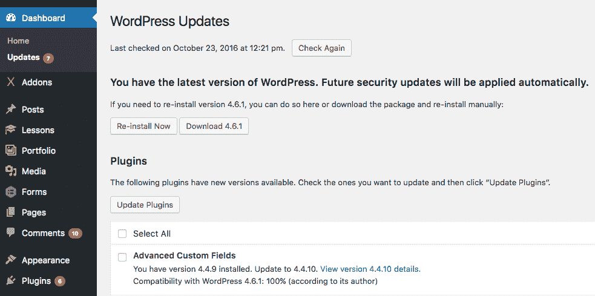
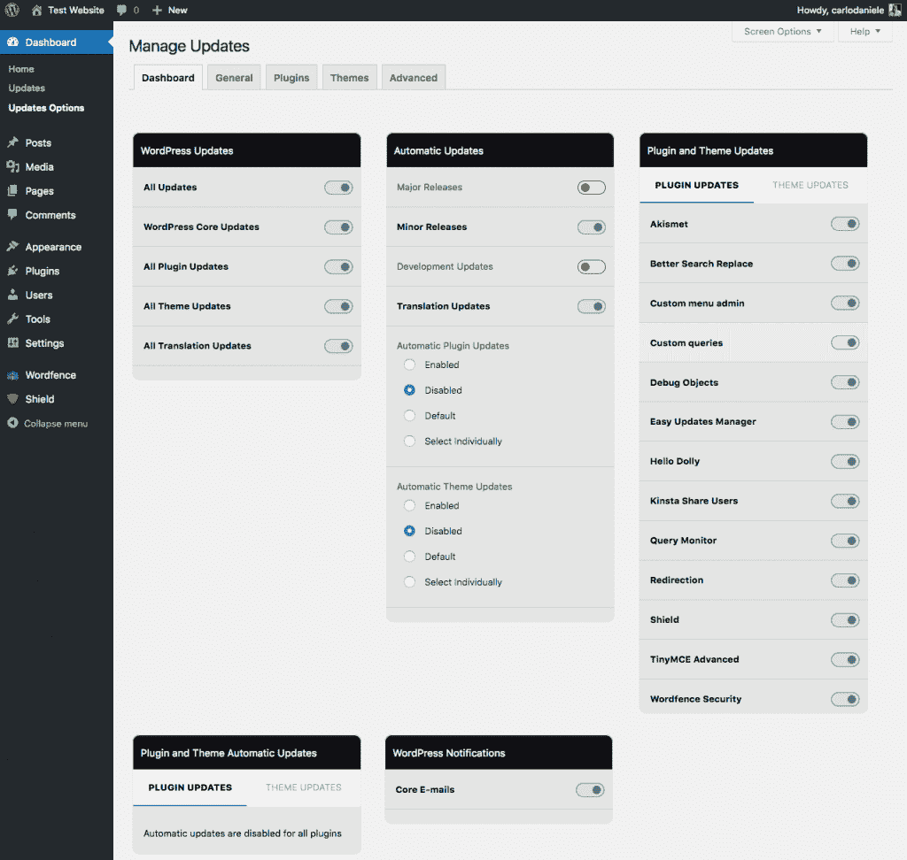
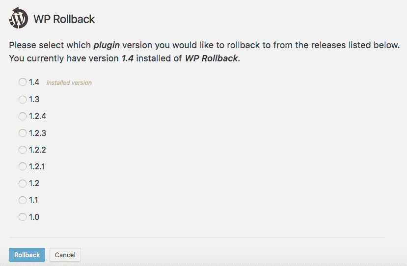

# 深入了解 WordPress 自动更新

> 原文：<https://kinsta.com/blog/wordpress-automatic-updates/>

说到[安全](https://kinsta.com/blog/wordpress-security/)，我们知道定期更新 WordPress 安装(核心、主题和插件)有多重要，以及升级过程需要多长时间，尤其是当我们已经安装了大量插件的时候。通常建议遵循以下步骤:

1.  备份文件和数据库表
2.  禁用插件
3.  更新
4.  逐个启用插件
5.  查看网站

对于单个网站来说，这可能是一项单调乏味的任务，当我们要更新五个、十个或更多的网站时，这可能是一项烦人而复杂的工作。

为了提高安装的安全性并使网站管理更容易，WordPress 3.7 引入了自动更新。默认情况下，次要版本(即维护和安全版本)和翻译文件启用了这一很酷的功能，但也可以定制任何类型的更新。因此，在这篇文章中，我们将看看如何在发布新版本的 WordPress 核心、主题或插件时自动升级。让我们深入 WordPress 自动更新！



WordPress automatic updates


### 自动更新索引

*   [WordPress 自动更新](#wordpress-automatic-updates)
*   [通过 wp-config.php 控制后台更新](#background-updates-wp-config)
*   [通过 API 过滤器控制后台更新](#background-updates-api-filters)
*   [结果、通知和调试邮件](#emails)
*   [何时以及为何禁用 WordPress 自动更新](#disable-wordpress-automatic-updates)
*   [用插件控制 WordPress 自动更新](#automatic-updates-plugins)
*   [高级插件自动更新&主题](#automatic-updates-premium-plugins-themes)

## WordPress 自动更新

有四种类型的更新和自动更新:

1.  **核心更新**
2.  **插件更新**
3.  **主题更新**
4.  **翻译文件更新**

核心更新分为三个子类型:


> Kinsta 把我宠坏了，所以我现在要求每个供应商都提供这样的服务。我们还试图通过我们的 SaaS 工具支持达到这一水平。
> 
> <footer class="wp-block-kinsta-client-quote__footer">
> 
> 
> 
> <cite class="wp-block-kinsta-client-quote__cite">Suganthan Mohanadasan from @Suganthanmn</cite></footer>

[View plans](https://kinsta.com/plans/)

1.  **核心开发**(仅适用于开发安装)
2.  **次要核心更新**(维护和安全)–在稳定安装中默认启用
3.  **主要核心更新**

WordPress 提供了两个*wp-config.php*常量和大量 API 过滤器，允许你自动更新这些类型的程序。
T3】

## 通过 wp-config.php 控制后台更新

WordPress 提供了几个*wp-config.php*常量，允许我们控制自动更新。将`AUTOMATIC_UPDATER_DISABLED`设置为 true 将禁用任何类型的自动升级:

```
define( 'AUTOMATIC_UPDATER_DISABLED', true );
```

WP_AUTO_UPDATE_CORE 允许我们控制核心更新(次要、主要和开发版本)。该常数可定义如下:

```
# Disables all core updates:
define( 'WP_AUTO_UPDATE_CORE', false );

# Enables all core updates, including minor and major:
define( 'WP_AUTO_UPDATE_CORE', true );

# Enables minor updates:
define( 'WP_AUTO_UPDATE_CORE', 'minor' ); 
```

在开发安装中`WP_AUTO_UPDATE_CORE`默认为真。在稳定安装中，它默认为 minor。

为了完整起见，我应该提到一个额外的常量，可以定义它来禁用自动更新。然而，将其值设置为 true 将禁止任何文件编辑，甚至主题和插件安装以及手动更新。

```
define( 'DISALLOW_FILE_MODS', true );
```

相反，您可能更喜欢定义`DISALLOW_FILE_EDITS`常量，这将禁用文件编辑器，但保持安装和更新功能的安全。

相关教程:[wp-config.php 文件——如何配置 WordPress](https://kinsta.com/blog/wp-config-php/)
的深度观点

## 通过 API 过滤器控制后台更新

配置常数提供了启用或禁用自动更新的一般方法。但是 WordPress 提供了许多过滤器，可以对任何类型的更新进行更深入的控制。

> 注意:过滤器应该在插件内部使用，“必须使用插件”是后台更新的一个很好的选项。mu 插件驻留在一个特定的文件夹中，在 */wp-content* 中，并由 WordPress 自动启用。这些插件不会出现在 WordPress 插件屏幕上，所以它们不会被站点管理员意外禁用或删除。更深入的观点，请参考[法典文件](https://codex.wordpress.org/Must_Use_Plugins)

首先，通过 automatic_updater_disabled 过滤器返回 true 与在*wp-config.php*中将`AUTOMATIC_UPDATER_DISABLED`常量定义为 true 具有相同的效果:

```
add_filter( 'automatic_updater_disabled', '__return_true' );
```

我们可以通过`auto_update_$type`过滤器控制任何更新类型，过滤器根据`$type` ( `'core'`、`'plugin'`、`'theme'`或`'translation'`)的值启用或禁用更新。

因此，我们可以通过`auto_update_core`过滤器返回 true 来自动化所有核心更新:

```
add_filter( 'auto_update_core', '__return_true' );
```

在以下示例中，我们启用了主题、插件和翻译的自动更新:

```
add_filter( 'auto_update_theme', '__return_true' );
add_filter( 'auto_update_plugin', '__return_true' );
add_filter( 'auto_update_translation', '__return_true' );
```

在上面的例子中，我们刚刚启用了自动更新。但是这些过滤器让我们可以更好地控制更新。在下面的例子中，我们自动更新了两个特定的插件:

```
function cb_auto_update_plugins ( $update, $item ) {
	$plugins = array ( 'hello', 'akismet' );
	if ( in_array( $item->slug, $plugins ) ) {
		// update plugin
		return true; 
	} else {
		// use default settings
		return $update; 
	}
}
add_filter( 'auto_update_plugin', 'cb_auto_update_plugins', 10, 2 ); 
```

回调函数保留两个参数:

## 注册订阅时事通讯


### 想知道我们是怎么让流量增长超过 1000%的吗？

加入 20，000 多名获得我们每周时事通讯和内部消息的人的行列吧！

[Subscribe Now](#newsletter)

1.  `$update`:boolean，设置是否更新；
2.  `$item`:更新要约对象。

该函数检查要更新的项目是否在`$plugins`数组中，然后相应地返回 true 或 false。

最后，我们可以通过以下过滤器返回`true`或`false`来区分开发、小更新和大更新:

```
add_filter( 'allow_dev_auto_core_updates', '__return_false' );
add_filter( 'allow_minor_auto_core_updates', '__return_true' );
add_filter( 'allow_major_auto_core_updates', '__return_true' ); 
```

我们知道更新偶尔会失败。在最坏的情况下，网站可能会在更新失败后关闭。但幸运的是，我们可以要求 WordPress 在任何更新(或尝试)后用电子邮件通知我们。

## 结果、通知和调试电子邮件

根据更新过程的结果，WordPress 会向管理员发送一封不同的电子邮件:

*   **在自动核心更新后发送结果电子邮件**；
*   当 WordPress 无法运行自动更新时，会发送一封通知邮件;
*   在 WordPress 的开发版本中发送一封调试邮件。

每当自动更新成功或失败时，WordPress 都会发送一封结果或通知电子邮件，主题如下:

*   **你的站点已经更新到 WordPress XXX** (案例成功)
*   WordPress XXX 可用。请更新！([更新失败](https://kinsta.com/knowledgebase/wordpress-updating-failed/)，需要手动更新:案例失败)
*   **紧急:你的网站可能会因为更新失败而关闭** ( [更新失败](https://kinsta.com/knowledgebase/wordpress-updating-failed/)，WordPress 可能会关闭:紧急情况)

`auto_core_update_send_email`过滤器控制结果和通知电子邮件。通过返回`false`可以禁用这些电子邮件，如下所示:

```
apply_filters( 'auto_core_update_send_email', '__return_false' );
```

特别是如果你计划将自动更新扩展到主要的核心和/或主题和插件版本，你可能更喜欢让结果和通知电子邮件保持启用，或者根据结果或更新类型自定义它们。在下面的例子中，如果成功，WordPress 不会发送结果邮件:

Struggling with downtime and WordPress problems? Kinsta is the hosting solution designed to save you time! [Check out our features](https://kinsta.com/features/)

```
function cb_auto_core_update_send_email ( $send, $type, $core_update, $result ) {
	if ( !empty( $type ) && $type == 'success' ) {
		// don't send email
		return false; 
	}
		// use default settings
		return $send; 
	}
}
add_filter( 'auto_core_update_send_email', 'cb_auto_core_update_send_email', 10, 4 ); 
```

回调函数保留以下参数:

*   `$send`是一个布尔值，它决定是否发送结果或通知电子邮件；
*   `$type`是设置要发送的电子邮件类型的字符串(成功、失败或关键)；
*   `$core_update`是更新要约对象；
*   `$result`是核心更新的结果(可以是 WP_Error)。

默认情况下，当从 WordPress.org 收到的更新提供设置了特定标志并且安装无法更新时，管理员会收到通知。每次发布只会发送一次通知电子邮件。`send_core_update_notification_email`过滤器允许在是否以及何时发送这种通知方面有一定的决定权。按如下方式应用过滤器:

```
apply_filters( 'send_core_update_notification_email', '__return_true' );
```

最后，`automatic_updates_send_debug_email`过滤器控制调试电子邮件，它提供了关于所执行的更新的有用日志信息。默认情况下，这些电子邮件由开发安装发送。返回 false 将阻止 WordPress 发送调试电子邮件，而返回 true 将启用这些电子邮件，即使在稳定安装中:

```
apply_filters( 'automatic_updates_send_debug_email', '__return_true' );
```

## 何时以及为什么禁用 WordPress 自动更新

自动更新过程对许多用户来说是一个很好的功能，因为他们可以节省大量的时间和工作。
但是，即使看起来[自动更新真的很安全](https://make.wordpress.org/core/2013/10/25/the-definitive-guide-to-disabling-auto-updates-in-wordpress-3-7/)，我们也应该问问自己，启用所有这些功能是否总是一个好主意。

偶尔，我们可能会遇到主题和插件不兼容的问题，这可能会中断一些功能，甚至使网站崩溃。如果网站依赖于大量的插件，手动更新会更安全，至少对于插件来说是这样。一个接一个的过程使我们能够快速发现自动化难以发现的问题。

此外，如果你是一名开发者，你应该小心为你的主题和插件选择名字，即使你不打算发布它们。当运行更新时，WordPress 会在插件目录中查找你的插件的新版本，如果找到同名的插件，就会覆盖你的文件。所以，如果你想为主题和插件启用后台更新，一定要为你的脚本设置唯一的名字。

是的，这对开发者来说是很多好东西。但是非开发人员用户如何管理自动更新呢？

## 用插件控制 WordPress 自动更新

如果你不是开发者，你可以使用插件来控制 WordPress 自动更新。

[简易更新管理器](https://wordpress.org/plugins/stops-core-theme-and-plugin-updates/)允许管理员用户控制单站点和[多站点安装的 WordPress 更新](https://kinsta.com/blog/wordpress-multisite/)。该插件允许管理所有类型的 WordPress 更新，主题和插件可以单独选择自动更新。其他功能涉及通知电子邮件、用户阻止和记录插件更新。



Easy Updates Manager


在不兼容的情况下，可能有必要快速恢复到先前版本的主题或插件。WP 回滚允许你从插件界面[恢复任何已安装的主题和插件的前一版本](https://kinsta.com/blog/restore-wordpress-from-backup/)。只需点击回滚链接，插件将显示所有可用版本的列表。
不幸的是，如果你的网站瘫痪了，WP 回滚将没有任何帮助，所以不要忘记备份并仔细阅读在线文档。



WP Rollback


最后，如果你需要对你的 WordPress 安装中的自动更新进行兼容性测试，[后台更新测试器](https://wordpress.org/plugins/background-update-tester/)会提供你需要的信息。

## 高级插件和主题的自动更新

作为高级 WordPress 插件或主题的开发者，你有责任将自动更新机制集成到你的产品中，以提供用户期望的 WordPress 产品的无缝更新体验。这已经成为今天的市场标准(有充分的理由)。你可以自己托管高级产品并开发一个更新机制，或者利用像 [Freemius](https://freemius.com/wordpress/automatic-software-updates/) 、 [Kernl](https://kernl.us/) 或 [WP Updates](http://wp-updates.com/) 这样的平台，它们提供一个安全的存储库和自动更新，即开即用。

## 摘要

WordPress 自动更新是一个伟大的功能，可以节省我们很多时间和工作，并允许我们保持我们的网站定期更新。但是您会启用各种更新吗？请在下面的评论中告诉我们。

* * *

让你所有的[应用程序](https://kinsta.com/application-hosting/)、[数据库](https://kinsta.com/database-hosting/)和 [WordPress 网站](https://kinsta.com/wordpress-hosting/)在线并在一个屋檐下。我们功能丰富的高性能云平台包括:

*   在 MyKinsta 仪表盘中轻松设置和管理
*   24/7 专家支持
*   最好的谷歌云平台硬件和网络，由 Kubernetes 提供最大的可扩展性
*   面向速度和安全性的企业级 Cloudflare 集成
*   全球受众覆盖全球多达 35 个数据中心和 275 多个 pop

在第一个月使用托管的[应用程序或托管](https://kinsta.com/application-hosting/)的[数据库，您可以享受 20 美元的优惠，亲自测试一下。探索我们的](https://kinsta.com/database-hosting/)[计划](https://kinsta.com/plans/)或[与销售人员交谈](https://kinsta.com/contact-us/)以找到最适合您的方式。