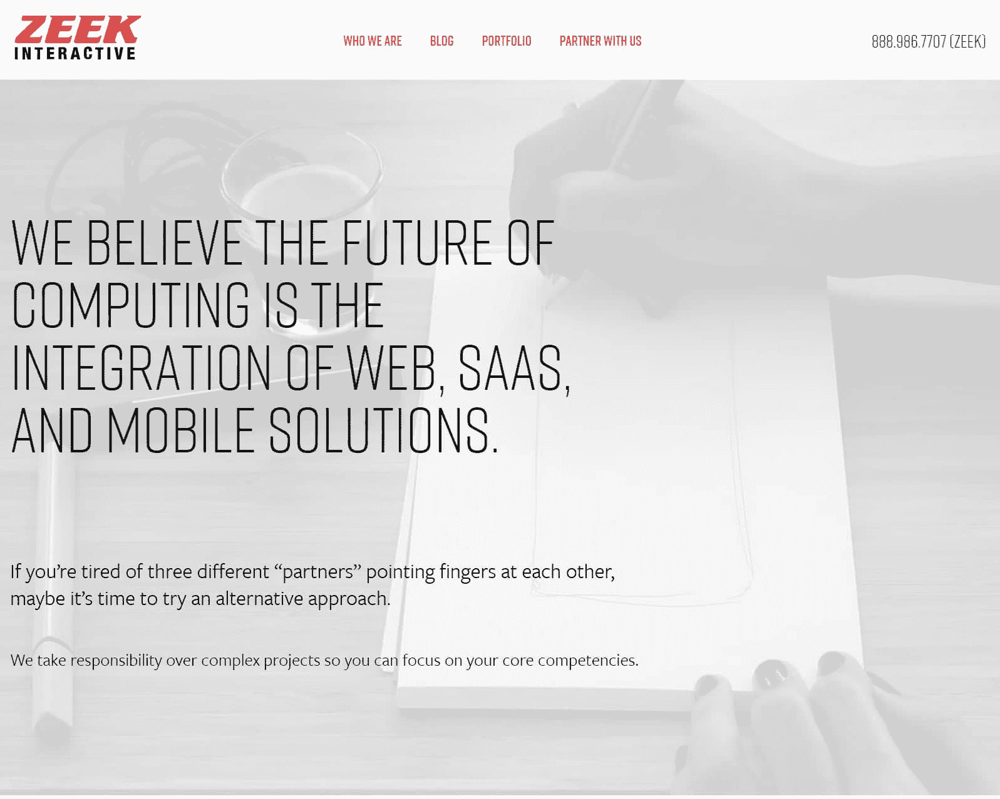

# 金斯塔·金并:史蒂夫·曾古特访谈

> 原文：<https://kinsta.com/blog/interview-with-steve-zehngut/>

你可以在 LinkedIn 或 T2 的 Twitter 上找到史蒂夫。这是我们最近对他的采访，作为我们[金斯塔·金并](https://kinsta.com/?post_type=post&s=kingpin)系列的一部分。

Q1:你的背景是什么，&你最初是如何加入 WordPress 的？

20 多年前，我创办了 Zeek Interactive 公司来开发互动游戏。在那 20 年里，Zeek 从事 Shockwave、Flash、CD-ROM，最后是 web 和移动领域的工作。一旦我们开始创建网站，WordPress 成为 CMS 的明显选择。我们启动了 Orange County WordPress meetup，以寻找其他本地开发人员来弥补我们的工作量，它已经发展成为一个强大的社区，人们可以提高现有技能，并向其他人传授新技能。

**Q2:读者应该知道关于 Zeek 互动公司的什么，&什么样的客户是合适的？**

我们的客户不仅仅想要一个网站。他们希望战略与之相匹配。这些公司的业务就是他们的网站；这是他们创收的方式。因此，我们帮助他们做到这一点，同时也帮助他们进行应用和移动开发，以便他们拥有所需的一切。

[T2】](http://zeek.com/)

**Q3:在建立代理机构的过程中，你遇到了哪些挑战？**

我认为很多公司都是从设计或开发方面的优秀人才起步的。只有过了一段时间，你才会意识到这种差异不在于开发或设计人才，而在于对客户的管理和他们的经验。毫无疑问，建立我们的项目和客户管理规范需要一些工作，这样我们才能让客户年复一年地回来。

**Q4:在成长的过程中有没有什么让你惊喜的事情？**

旋转。这些年来，我们的关键支点相当顺利，但进入未知领域总是一个挑战。我们的关键支点来自客户的需求。我发现，当你通过专攻一个领域来建立客户的信任时，他们会要求另一个领域的服务，即使这不是你的核心能力。

当我们在 2000 年左右成长为一个全面服务的网络开发者时，我们当时的专长是 Shockwave 游戏。我们正在建立小型网站，作为补充我们工作的行项目，然后一个客户要求我们建立一个完整的网站。我们雇佣了优秀的人才来完成这项工作，于是一项新的服务诞生了。当我们专注于 WordPress，然后扩展到移动开发时，类似的支点也发生了。

问 Zeek 的未来是什么样的？

我们相信计算的未来将是整合的——网站、SaaS 和移动应用程序将协同工作，提供有凝聚力的价值。因此，为此，我们正在塑造我们的机构，以便能够实现这一价值主张。

帮助运营橘子郡世界夏令营是什么感觉？

我们在 OC 有一个令人惊叹的 [WordCamp，它反映了我们强大的社区。这是一个时间承诺，但听到与会者说他们学到了很多东西，或者他们遇到了新的工作伙伴，或者结交了新朋友，这一切都是值得的。这是回馈 WordPress 社区的重要方式，我们很荣幸能够这样做。](https://2016.oc.wordcamp.org/)

当你离开笔记本电脑时，你喜欢做什么？

我花时间和我的孩子在一起。我喜欢旅行。我也花了很多时间构思新的业务和产品创意。锦标赛扑克对我来说是一件大事。

接下来我们应该采访谁，为什么？

布兰登鸠。[杰夫·津恩](https://twitter.com/jeffreyzinn)。大卫·马戈斯基。莎拉·韦福尔德。这些人是 OC WordPress 社区的关键成员，他们帮助我们将社区建设成今天的样子。Brandon 和 Jeff 领导 OC WordPress 开发者聚会，Sarah 领导 OC WordPress 设计聚会。布兰登、杰夫和大卫已经将单词营 OC 建成了世界上最好的单词营之一。

[T2】](http://www.meetup.com/OC-Wordpress-Group/)

* * *

让你所有的[应用程序](https://kinsta.com/application-hosting/)、[数据库](https://kinsta.com/database-hosting/)和 [WordPress 网站](https://kinsta.com/wordpress-hosting/)在线并在一个屋檐下。我们功能丰富的高性能云平台包括:

*   在 MyKinsta 仪表盘中轻松设置和管理
*   24/7 专家支持
*   最好的谷歌云平台硬件和网络，由 Kubernetes 提供最大的可扩展性
*   面向速度和安全性的企业级 Cloudflare 集成
*   全球受众覆盖全球多达 35 个数据中心和 275 多个 pop

在第一个月使用托管的[应用程序或托管](https://kinsta.com/application-hosting/)的[数据库，您可以享受 20 美元的优惠，亲自测试一下。探索我们的](https://kinsta.com/database-hosting/)[计划](https://kinsta.com/plans/)或[与销售人员交谈](https://kinsta.com/contact-us/)以找到最适合您的方式。