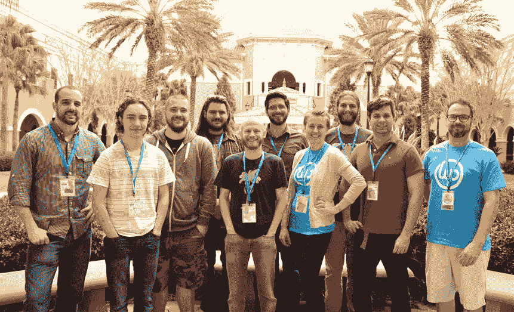

# 金斯塔·金并:梅森·詹姆斯访谈

> 原文：<https://kinsta.com/blog/interview-with-mason-james/>

你可以在 LinkedIn 或者 T2 的 Twitter 上找到梅森。这是我们最近对他的采访，作为我们[金斯塔·金并](https://kinsta.com/?post_type=post&s=kingpin)系列的一部分。

Q1:你的背景是什么，&你最初是如何加入 WordPress 的？

虽然我真正的大学学位是教育学，但我职业生涯的最初几年是在视频制作中度过的。最终，当地客户也想在网上观看视频，这导致了完整网站的建立。这要追溯到 2008-2009 年。我曾经玩过一点 WordPress，并被一家当地的网络公司雇佣来建立一个房地产网站。这很令人兴奋，在令人难以置信的 WordPress 社区的帮助下，我能够将 PSD 切片并创建一个工作 WordPress 主题。

当我意识到我可以自己制作一些东西，并且没有我在视频制作中习惯的昂贵设备的开销时，我就着了迷。我开始从事自由职业，建立网站，并开始在我得到帮助的社区和专业论坛中提供帮助。2009 年，我在一家插件开发店找到了一份支持代表的工作，并最终将团队扩大到 12 人。与此同时，我看到了中小型企业的需求，以及他们经常因为没有可靠的资源来管理他们站点上的软件而陷入困境。2012 年，我开始 [WP 代客](https://www.valet.io/)，并于 2013 年 1 月开始全职工作。

Q2:关于代客服务，读者应该知道些什么，&什么样的客户是合适的？

我们和两种不同类型的客户相处得很好。第一类是中小型公司，网站对他们的业务至关重要。他们的网站有助于增加收入，并且需要安全、稳定和快速，他们需要能够为他们优先做出智能技术决策的人。

第二种类型是大型公司中的营销公司，他们需要定期的“代码极客”来管理他们的网站性能。这包括像保持网站更新这样的事情，但也包括定期的开发任务，因为它们在主题、品牌和与第三方软件的集成上迭代。

**Q3:在建立代理机构的过程中，你遇到了哪些挑战？**

全部都是。嗯，可能不是所有的人，但我们肯定面对了很多！我有时告诉人们，如果他们想建立一家成功的公司，开一家必胜客会更容易。他们会告诉你需要点什么配料，多长时间点一次，你的馅饼要多少钱，以及如何雇佣和支付员工。(*注意*:可能不止这些，但从外部来看，认为特许经营是一个“按数字绘制”的场景是很有趣的)关键是，从零开始建立一个机构——或任何类型的服务公司——是非常具有挑战性的，对我来说，最大的挑战之一是发现成功和失败的基准。

**Q4:在成长的过程中有没有什么让你惊喜的事情？**

令人惊讶的是，让合适的人在合适的环境中工作对于公司的整体健康来说是多么的有价值。尽管我已经了解了财务稳定和盈利公司的衡量标准，但仍然是团队中的人让一切变得有价值并最终决定我们的成功。

## 注册订阅时事通讯

### 想知道我们是怎么让流量增长超过 1000%的吗？

加入 20，000 多名获得我们每周时事通讯和内部消息的人的行列吧！

[Subscribe Now](#newsletter)

Source: [Valet team](https://www.valet.io/our-story/#our-story)

我也不断发现我们是我们最大的竞争对手。作为一家公司，我们面临的一些压力和障碍是我们自己造成的。我们永远追求卓越。有时候，这种追求会导致不合理或不可能的期望。这将开始产生很多压力，事实上，当我们稍微深入一点，我们会发现不是我们的客户把期望放在我们身上，而是我们为自己创造的。走出我们自己的泡沫，从不同的角度看待这些挑战，帮助我们学会平衡期望以及如何衡量成功。

代客泊车的未来是什么样的？

我们专注于网站绩效管理。也就是说，帮助我们的客户了解哪些活动给他们带来了最大的成功，并以一种既可量化又易于处理的方式呈现这些信息。这意味着我们正在照顾网站的许多实际开发/技术需求，并使其符合他们的业务目标。

我们有一个测试计划，我们一直在雷达下提供，以帮助那些想要这些见解的人，但更多的是自助方法。我们将很快发布公告，并希望它对代理商和最终用户都有价值！

**Q6:坦帕地区的 WP 社区是什么样的？**

他们绝对是 WordPress 社区中最棒的一些人。WP 社区在整个佛罗里达州都很强大，今年在迈阿密、奥兰多、坦帕和杰克逊维尔举办了令人惊叹的活动。真正让我惊讶的是(几周前我在坦帕世界夏令营上亲身体验了一下)所有的组织者都努力工作，大多数时候都没有感谢，以帮助每个社区取得成功。与有远见、尊重和谦逊的人在一起是令人鼓舞的。

当地社区有一群已经使用开源技术几十年的中坚分子，也有正在创建他们第一个博客的新成员。当地的活动是加入这种混合的好地方。

当你离开笔记本电脑时，你喜欢做什么？

嗯，即使我因为工作离开了我的笔记本电脑，我可能还是会和一些技术上的东西联系在一起。最近，我对家庭自动化非常感兴趣——尤其是树莓 Pi 上的 DIY 和开源项目。我也对可再生能源和机器能够自动处理日常生活中的日常任务的其他方式非常着迷。如果我不直接与技术打交道，我可能会在咖啡店或餐馆里热情地讨论这项技术对我们个人或我们的社会/文化规范的影响——几乎总是一个书呆子。

接下来我们应该采访谁，为什么？

[蚂蚁米勒](https://twitter.com/meeware)来自[人类制造的](https://hmn.md/)。他从 WordPress 社区之外获得了大量宝贵的经验和观点，对我们当前面临的问题有着令人难以置信的思考，并且愿意挖掘解决方案。

* * *

让你所有的[应用程序](https://kinsta.com/application-hosting/)、[数据库](https://kinsta.com/database-hosting/)和 [WordPress 网站](https://kinsta.com/wordpress-hosting/)在线并在一个屋檐下。我们功能丰富的高性能云平台包括:

*   在 MyKinsta 仪表盘中轻松设置和管理
*   24/7 专家支持
*   最好的谷歌云平台硬件和网络，由 Kubernetes 提供最大的可扩展性
*   面向速度和安全性的企业级 Cloudflare 集成
*   全球受众覆盖全球多达 35 个数据中心和 275 多个 pop

在第一个月使用托管的[应用程序或托管](https://kinsta.com/application-hosting/)的[数据库，您可以享受 20 美元的优惠，亲自测试一下。探索我们的](https://kinsta.com/database-hosting/)[计划](https://kinsta.com/plans/)或[与销售人员交谈](https://kinsta.com/contact-us/)以找到最适合您的方式。