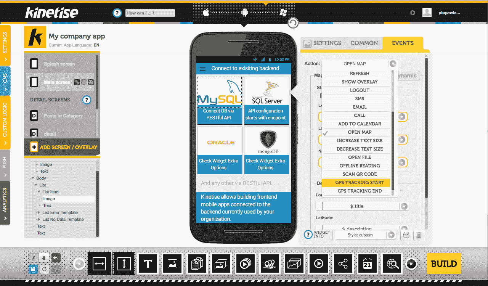

# 金斯塔·金并:彼得·帕夫拉克访谈

> 原文：<https://kinsta.com/blog/interview-with-piotr-pawlak/>

你也可以在 LinkedIn 上找到他。这是我们最近对他的采访，作为我们[金斯塔·金并](https://kinsta.com/?post_type=post&s=kingpin)系列的一部分。

Q1:是什么激发了你创作 Kinetise 的灵感？

嗯，我们看到了自动化我们一直在做的事情的需要，这意味着开发移动应用程序。因为预算问题，很多潜在客户来了又回来。我们知道我们需要找到一种方法，以合理的价格为这些人提供他们的应用程序。

Q2:在开发这个产品的过程中，你遇到了哪些挑战？

我们还有多少时间？；)说真的，我们每天都会遇到障碍。项目变得如此复杂和庞大，以至于添加每个新特性都会对系统的其他部分产生影响。我认为保持一致性是最大的挑战。

**Q3:在发布这个产品的过程中，有什么让你感到意外的事情吗？**

当然了。最初，我们发现很难向人们解释我们创造了什么。我们有一个拖放工具，即使非编码人员也可以使用它来创建一个非常定制的移动应用程序。你只需要一个网络浏览器。不需要安装 Xcode 或者 Android Studio 之类的东西。Kinetise 的概念与应用程序的典型构建方式大相径庭。

**Q4:如何让 WordPress 用户从 Kinetise 中受益？**

WordPress 用户可以开发自己的应用程序，并免费发布一个 Android 版本。零。没什么。一分钱都没有。如果不知道如何编写 Android 应用程序。太棒了，不是吗？

[T2】](https://kinsta.com/wp-content/uploads/2016/08/kinetise-dashboard.png)

有没有读者可能熟悉的使用它的公司？

比如 ING 银行。或者一些美国的 WordPress 博客，如:www.everythingcountry.com 或 www.sole.lgbt。是的，有许多公司和个人使用 Kinetise 开发应用程序。

问 6:对于那些希望开发成功的移动应用程序的人，你有什么建议？

试试有效的方法。首先创造你的 MVP，不要害羞，把它给别人。你应该这样开始并获得他们的反馈。

你受到了一些很大的压力。你对那些寻求保险的人有什么建议？

那部分很难。但你需要有一个伟大的产品，并在坚持和耐心之间找到一个好的平衡。它在一条细线上行走。

问题 Kinetise 的未来是什么样的？

我们认为光明:)每个人都想开发 app，但只有不到 0.1%的人口能做到。我们的时代就是现在！

* * *

让你所有的[应用程序](https://kinsta.com/application-hosting/)、[数据库](https://kinsta.com/database-hosting/)和 [WordPress 网站](https://kinsta.com/wordpress-hosting/)在线并在一个屋檐下。我们功能丰富的高性能云平台包括:

*   在 MyKinsta 仪表盘中轻松设置和管理
*   24/7 专家支持
*   最好的谷歌云平台硬件和网络，由 Kubernetes 提供最大的可扩展性
*   面向速度和安全性的企业级 Cloudflare 集成
*   全球受众覆盖全球多达 35 个数据中心和 275 多个 pop

在第一个月使用托管的[应用程序或托管](https://kinsta.com/application-hosting/)的[数据库，您可以享受 20 美元的优惠，亲自测试一下。探索我们的](https://kinsta.com/database-hosting/)[计划](https://kinsta.com/plans/)或[与销售人员交谈](https://kinsta.com/contact-us/)以找到最适合您的方式。