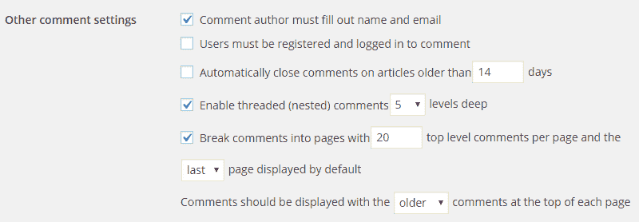
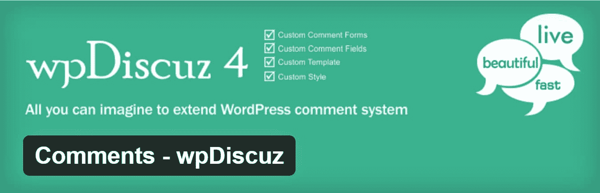

# 如何加快 WordPress 评论的速度

> 原文：<https://kinsta.com/blog/wordpress-comments/>

你有没有注意到你最受欢迎的博客文章——那些引发大量评论的文章——加载时间要长一些？虽然看着 WordPress 评论滚滚而来很不错，但是如果你的评论系统没有仔细配置，它真的会降低你网站的速度。

想想让评论发挥作用的资源:

*   查询数据库以提取现有的评论，
*   为每个新评论创建数据库条目，
*   访问者的浏览器接收和处理评论和评论元数据，
*   请求、下载和加载外部资源，例如 Gravatars，并且
*   在许多情况下，必须下载和处理大量的 JavaScript 和 jQuery 资源，才能让评论系统按照预期的方式工作。

因此，一个繁忙的评论区会给 web 服务器增加很大的负载，增加页面的整体大小，增加所需的 HTTP 请求的数量，并为浏览器增加额外的 JavaScript 资源。无论你是使用原生 WordPress 评论还是插入第三方[评论系统](https://kinsta.com/blog/wordpress-comment-plugins/)，如 Disqus 或脸书评论，评论都会拖累你网站的速度，你应该优先优化你网站评论部分的性能。顺便说一句。如果你在垃圾评论方面有困难，请务必阅读我们的详细指南，主题是[如何阻止垃圾评论](https://kinsta.com/blog/wordpress-spam-comments/)。

*   [修复加载缓慢评论的策略](#fix-slow-loading-comments)
*   [优化原生 WordPress 评论](#optimizing-native-wordpress-comments)
*   [使用第三方评论系统](#third-party-commenting-system)
*   [懒惰加载注释](#lazy-load-comments)

## 修复加载缓慢的注释的策略

如果你发现评论区降低了你最受欢迎的博客文章的加载速度，你可以做一些事情:

*   彻底禁用评论。这肯定会解决问题。然而，只有当你的评论区没有增加任何价值时，你才应该考虑它。如果你的评论区太忙以至于拖慢了你的网站，它可能增加了足够的价值，以至于你不想扼杀它。查看我们关于如何[在 WordPress](https://kinsta.com/blog/wordpress-disable-comments/) 中禁用评论的完整教程。
*   **优化原生 WordPress 评论。如果你正在使用原生的 WordPress 评论系统，你可以做一些事情来加速它。**
*   **使用第三方评论系统。**如果你的网站托管在一个廉价、资源匮乏的共享服务器上，那么使用[第三方评论系统](https://kinsta.com/blog/wordpress-comment-plugins/)可能会提高有大量评论的页面的速度。然而，如果你的主机是 Kinsta 或其他高质量的网络主机，切换到第三方主机对你网站的加载速度没有太大帮助，实际上可能会降低速度。
*   **懒加载评论。**无论你使用的是 WordPress 原生评论还是像 Disqus 这样的第三方评论系统，都要找到一种惰性加载评论的方法，这样它们就不会降低初始页面渲染的速度。

让我们分别考虑每一种策略，这样你就能找出哪种策略最适合你的网站。

## 优化原生 WordPress 评论

你可以做两件事来加速已经加载了大量原生评论的网页:限制最初加载的评论数量，使用本地托管的头像。让我们依次看看每个选项。

### 限制显示的评论数量

默认情况下，WordPress 被设置为在初始页面加载时加载你所有的评论。然而，加载数十甚至数百条评论，每条评论都包含一个独特的头像，这真的会使你的页面变大，并产生大量额外的 HTTP 请求。

您可以很容易地减少初始页面加载时加载的注释数量。

*   去 WordPress 管理区的**设置>讨论**。
*   寻找**其他评论设置**部分。
*   选择**旁边的复选框，使用**将注释分成页面，并添加您希望在初始页面加载时显示的注释数量的值。
*   滚动到页面底部点击按钮**保存更改**。

Comment settings in WordPress admin

完成这些步骤后，您指定的评论数量将在初始页面加载时显示。

### 使用本地托管的头像或在您的 CDN 上

WordPress 内置了对 [Gravatar](http://en.gravatar.com/) 的支持。这意味着任何拥有 Gravatar 账户的用户，当他们使用原生 WordPress 评论系统在博客上发表评论时，他们的自定义图像将被添加为头像。这给评论部分增加了一个很好的个性化元素，但是代价也很大。当加载 WordPress 评论时，每个唯一的 Gravatar 都需要一个 HTTP 请求。因此，如果一个页面加载了来自 50 个不同评论者的评论，则需要 50 个 HTTP 请求来下载所有这些 Gravatars。你可以想象，这会对页面速度产生相当大的影响。

如果您认为 Gravatars 不值得增加 HTTP 请求，您有两个选择。首先，你可以完全禁用头像，方法是进入**设置>讨论**，找到**头像**部分，取消勾选**显示头像**。

如果你不想采取如此激烈的措施，另一个选择是改用本地托管的头像。为此，安装 [WP 用户头像](https://wordpress.org/plugins/wp-user-avatar/)插件。一旦安装完成，进入**头像>设置**，选择复选框**禁用 Gravatar，只使用本地头像**。如果你不喜欢 WP 用户头像中包含的默认头像，在这个关于使用本地托管头像的教程中有一个干净的神秘用户头像，你可以上传并用作默认头像。

请记住，在做了这个改变后，所有的评论都将使用默认头像显示，除非用户在你的网站注册并上传了自定义头像。

你最后的选择是[将你的 Gravatars 加载到你自己的 CDN](https://woorkup.com/load-gravatars-from-cdn/) 上。这是我们在 Kinsta 博客上采用的方法。🤓

## 使用第三方评论系统

有各种各样的原因让你可能对切换到第三方评论系统感兴趣。首先，要考虑服务器负载。创建和加载注释是一个资源密集型过程。如果你的博客评论区真的很忙，那么把这项工作交给第三方评论系统会减轻你网站服务器的负担。

## 注册订阅时事通讯

### 想知道我们是怎么让流量增长超过 1000%的吗？

加入 20，000 多名获得我们每周时事通讯和内部消息的人的行列吧！

[Subscribe Now](#newsletter)

此外，第三方系统比原生的 WordPress 评论系统提供了更好的用户体验。他们还可以鼓励更多的访问者发表评论，因为已经拥有第三方系统帐户的访问者可以立即发表评论，而无需注册或提供详细信息。

在某些情况下，所有这些好处都会实现。然而，这并不是普遍适用的。

不是每个人都喜欢第三方评论系统，其他人[担心数据](http://chrislema.com/killed-disqus-commenting/)在幕后被收集。此外，[第三方评论系统比原生 WordPress 评论更快的想法在理论上听起来不错，但现实中事情通常不会这样发展。](https://mattgadient.com/2014/01/26/disqus-vs-wordpress-default-comments-speed-and-page-load/)

如果你决定使用第三方评论系统，那么就这样做，因为你喜欢使用这种特殊系统的体验，并且你确信你的站点访问者会和你一样喜欢它。不要为了感觉到的性能改进而转向第三方评论，这可能更多是理论上的而不是实际的。如果您确实跳到了第三方系统，那么一定要考虑实现下一个策略:延迟加载。

## 惰性加载注释

无论你使用的是原生的 WordPress 评论还是第三方系统，延迟加载评论是一种几乎肯定会加快页面加载时间的技术。惰性加载的评论系统从初始页面呈现中移除，当访问者到达页面中的某个点时，通过 JavaScript 或通过单击类似“查看评论”的按钮来加载。

如果实现延迟加载听起来有点难以实现，那是因为它确实如此。谢天谢地，你不用去琢磨。你可以使用一些插件来延迟加载你选择的评论系统。

### 惰性加载原生 WordPress 评论

WordPress 核心没有内置延迟加载评论的功能。然而，我们推荐的一个很棒的轻量级免费解决方案是[评论插件](https://wordpress.org/plugins/lazy-load-for-comments/)。

Lazy Load for Comments WordPress plugin

这个插件可以从 WordPress 插件目录中获得。所以你可以直接从 WordPress 管理区安装它。这将通过延迟加载所有的 WordPress gravatars 来减少 HTTP 请求的数量。配置起来非常简单。只需安装并在讨论设置下，有两个选项。默认情况下，它被设置为“在滚动中”，这可能是大多数人更喜欢的。你也可以将其设置为“点击”,这将在评论加载之前为访问者创建一个点击按钮。

Struggling with downtime and WordPress problems? Kinsta is the hosting solution designed to save you time! [Check out our features](https://kinsta.com/features/)

On Scroll or On Click

延迟加载本地注释的另一个选择是使用 [wpDiscuz](https://wordpress.org/plugins/wpdiscuz/) 插件。

wpDiscuz WordPress plugin

这个插件可以从 WordPress 插件目录中获得。所以你可以直接从 WordPress 管理区安装它。

*   转到**插件>添加新的**。
*   搜索“wpDiscuz”，并选择**立即安装**按钮。
*   一旦插件安装完毕，进入**评论>设置**。
*   向下滚动，直到看到显示**注释加载/分页类型**的行，并选择单选按钮**在滚动时惰性加载注释**。
*   接下来，进入**设置>讨论**。
*   在**其他评论设置**部分，减少文字**后面方框中的数字，用**将评论分成页面。
*   使用小于 10 的小数字，并保存更改。
*   注意不要选中该行旁边的复选框。如果你选中这个框，默认的评论分页将会覆盖 wpDiscuz 实现的延迟加载特性。

现在，当你访问任何超过十条评论的页面时，只会加载前十条评论。当您到达评论部分的底部时，其他评论将会自动加载。

### 惰性负载问题

如果你真的使用 Disqus，那么延迟加载 Disqus 注释是非常关键的。如果你不这样做，Disqus 可能会成为你的网站加载速度的真正障碍。然而，与原生 WordPress 评论相比，[延迟加载 Disqus 评论实际上可以加速你的网站。](https://woorkup.com/native-wordpress-comments-disqus/)

Disqus Conditional Load plugin

Disqus 条件加载是一个免费的插件，你可以用它在你的网站上延迟加载 Disqus。如果你以前从未使用过 Disqus，你首先需要[注册一个账户，并在 Disqus](https://disqus.com/profile/signup/) 中添加一个新站点。一旦你建立了你的 Disqus 网站，通过进入**插件>添加新的**，搜索“Disqus 条件加载”，并选择**立即安装**来安装 Disqus 条件加载。

一旦安装完成，进入**评论> Disqus** 并选择**升级**来配置您的[数据库](https://kinsta.com/knowledgebase/wordpress-database/)以使用 Disqus。在下面的屏幕上，使用您的 Disqus 用户名和密码登录 Disqus。在下一个屏幕中，选择您几分钟前添加的 Disqus 站点，然后选择**下一步**按钮。完成最后一步后，Disqus 将被安装在你的网站上，并被配置为当读者到达你博客的评论区时延迟加载。

事实上，我们在 Kinsta 博客上使用这个插件，并强烈推荐它。除了延迟加载所有的图像(头像)，它还可以让你禁用计数脚本，如果你不使用它。所以你的 WordPress 站点上少了一个 JavaScript 调用。

### 懒加载脸书评论

上面提到的 Disqus 条件加载插件的开发者也创建了一个免费插件，可以在你的 WordPress 站点上延迟加载脸书评论。众所周知，脸书的脚本会使网站陷入困境，即使脚本是异步加载的。

Lazy Facebook Comments plugin

懒惰的脸书评论是一个免费的插件，你可以通过滚动或者点击按钮来加载评论。这可以确保您只在需要的时候加载脸书脚本。您还可以调整评论的数量、配色方案、语言、宽度、排序顺序等。

## 摘要

评论是大多数博客的核心功能，但是一个迅速发展的评论区真的会降低你网站的加载速度。你可以通过优化原生的 WordPress 评论和延迟加载评论来将它们从初始页面加载中移除，从而加速评论和你的 WordPress 网站。

* * *

让你所有的[应用程序](https://kinsta.com/application-hosting/)、[数据库](https://kinsta.com/database-hosting/)和 [WordPress 网站](https://kinsta.com/wordpress-hosting/)在线并在一个屋檐下。我们功能丰富的高性能云平台包括:

*   在 MyKinsta 仪表盘中轻松设置和管理
*   24/7 专家支持
*   最好的谷歌云平台硬件和网络，由 Kubernetes 提供最大的可扩展性
*   面向速度和安全性的企业级 Cloudflare 集成
*   全球受众覆盖全球多达 35 个数据中心和 275 多个 pop

在第一个月使用托管的[应用程序或托管](https://kinsta.com/application-hosting/)的[数据库，您可以享受 20 美元的优惠，亲自测试一下。探索我们的](https://kinsta.com/database-hosting/)[计划](https://kinsta.com/plans/)或[与销售人员交谈](https://kinsta.com/contact-us/)以找到最适合您的方式。