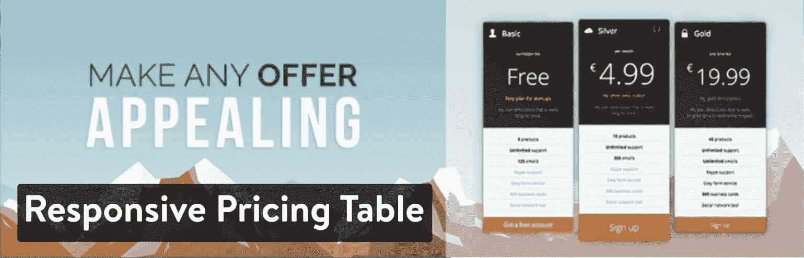
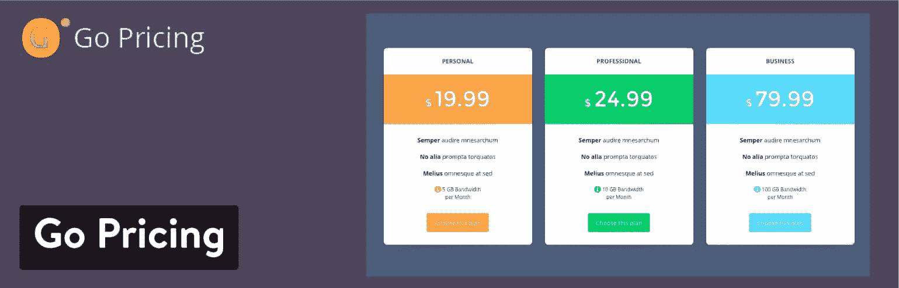
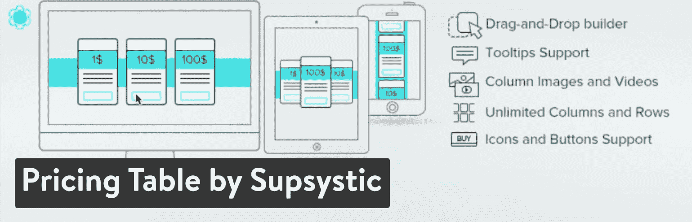
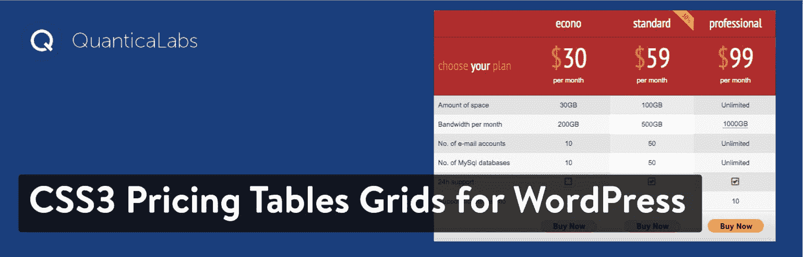
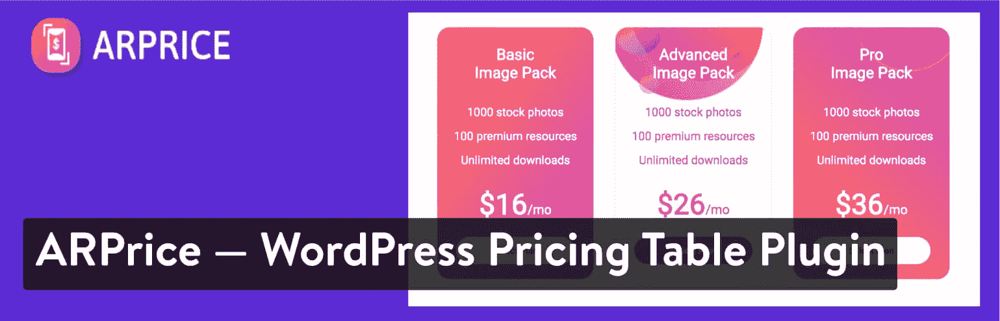
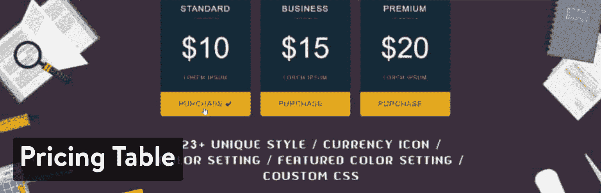
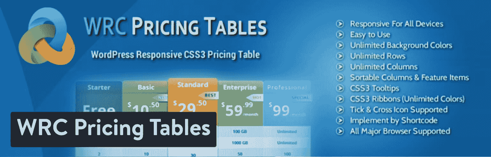
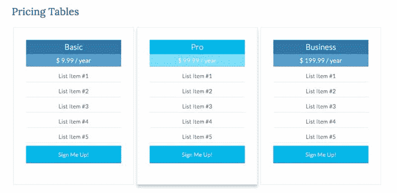

# 最好的 WordPress 价格表插件比较

> 原文：<https://kinsta.com/blog/pricing-table-wordpress/>

你的网站上有[价目表吗？这些价格可能是草坪护理等服务的价格，也可能是软件包的价格。从科技界到瑜伽馆，大多数公司都可以使用](https://kinsta.com/blog/how-to-price-a-product-wordpress/)[价格表](https://kinsta.com/blog/wordpress-pricing-table-plugins/)来更好地展示他们提供的产品。主要的方法是通过查看**最好的 WordPress 价格表插件**，然后在你的网站上实现一个。

### 但这回避了一个问题，为什么定价表如此重要？

这个问题的答案似乎是显而易见的(你想提高转化率，对不对？)但是理解定价表背后的原因是很好的。为什么定价表插件比常规的项目列表、段落甚至图片更能有效地促进销售？

*   价格表可以让你对你的服务或套餐有一个清晰的轮廓和比较。
*   最重要的功能显示在价格表中，清除混乱，并留到另一页。
*   价格表上有清晰的行动按钮，向人们展示如何继续购买。
*   大多数定价表使用套餐/计划名称，使客户更容易理解。
*   您可以通过使用更大的字体或图形来强调某些单词、计划或功能。
*   阅读基于图形的价格表要比阅读只有文本的价格表有趣得多。
*   你可以提高紧急转换(即。“时间快用完了”)或免费试用。
*   价格表在网页上只占很少的空间，所以你可以添加额外的信息，比如为你的销售人员提供一个 [FAQ](https://kinsta.com/blog/wordpress-faq-plugins/) 或者一个聊天框。

[Having a sleek looking prices page can make your services pop and increase conversions. Check out these handy WordPress pricing table plugins. 🛒Click to Tweet](https://twitter.com/intent/tweet?url=https%3A%2F%2Fbit.ly%2F2YSMHqT&via=kinsta&text=Having+a+sleek+looking+prices+page+can+make+your+services+pop+and+increase+conversions.+Check+out+these+handy+WordPress+pricing+table+plugins.+%F0%9F%9B%92&hashtags=WordPress%2Cecommerce)

## 在 WordPress 价格表插件中寻找什么

现在我们知道了 WordPress 价格表插件的好处，让我们来看看你应该想要的一些特性:


> Kinsta 把我宠坏了，所以我现在要求每个供应商都提供这样的服务。我们还试图通过我们的 SaaS 工具支持达到这一水平。
> 
> <footer class="wp-block-kinsta-client-quote__footer">
> 
> 
> 
> <cite class="wp-block-kinsta-client-quote__cite">Suganthan Mohanadasan from @Suganthanmn</cite></footer>

[View plans](https://kinsta.com/plans/)

*   **免费和高级选项**–我最喜欢的定价表插件给你一个标准表，让你的定价看起来不错。之后，带有额外功能的高级版本应该不会超级贵。
*   **与顶级页面构建器的集成**–一些页面构建器甚至自带定价表。一些比较流行的页面生成器包括 [Divi Builder、Elementor](https://kinsta.com/blog/divi-vs-elementor/) 和 WPBakery。
*   **用于在几秒钟内启动定价表的皮肤或主题。**我们也希望看到颜色、字体和图标的定制工具。
*   **用于显示某些计划**上的标记的设置，例如“最佳价值”或“最受欢迎”的计划。
*   **多种货币选项**全球通用。
*   **支持每个定价方案上的可定制大按钮**。
*   一个拖放构建器也是很好的选择。
*   **我们也希望看到对 CSS 和 HTML 的访问，**因为更高级的开发人员会想要复杂的调整机会。

我们可以在价格表上浏览几十个有意义的功能，但这是从基本要素开始的良好开端。

## 最好的 WordPress 价格表插件比较(以及如何编写自己的代码)

1.  [WP Darko 的响应定价表](#1-responsive-pricing-table-by-wp-darko)
2.  [去定价](#2-go-pricing)
3.  [价格表 WordPress 插件-简易价格表](#3-pricing-tables-wordpress-plugin--easy-pricing-tables)
4.  [sup systems 定价表](#4-pricing-table-by-supsystic)
5.  [CSS3 Responsive WordPress 价格比较表](#5-css3-responsive-wordpress-compare-pricing-tables)
6.  [ARP rice-Responsive WordPress 定价表插件](#6-arprice--responsive-wordpress-pricing-table-plugin)
7.  [定价表–价目表、价格表、简易定价表](#8-pricing-table--price-list-price-table-easy-pricing-table)
8.  [WRC 定价表](#9-wrc-pricing-tables)
9.  [如何在 WordPress 中从头开始建立一个定价表](#build-pricing-table-in-wordpress-from-scratch)

当谈到定价表插件和 WordPress 网站时，有很多可用的选项。一些最好的可以免费使用，而另一些是没有任何免费选项的高级。也就是说，下面的所有插件都值得在这个列表中占有一席之地，其中一些插件具有独特的功能，对于一些特定的行业或公司来说非常棒。

### 1.WP Darko 的响应定价表

[响应式价格表](https://wordpress.org/plugins/dk-pricr-responsive-pricing-table/)是制作价格表的更加用户友好、功能丰富的插件之一。它提供了一个优秀的免费版本，对你包含多少计划或如何为你的网站制作表格没有限制。然而，你可以[升级到高级版本](https://wpdarko.com/items/responsive-pricing-table-pro/)来获得更好的功能，例如皮肤和一个“均衡器”，使所有的列高度完全相同。

[](https://wordpress.org/plugins/dk-pricr-responsive-pricing-table/)

Responsive Pricing Table WordPress Plugin


您构建的价格表由简单的字段和后端按钮完成。例如，您可以使用的一些内置字段包括定价、描述、计划标题和图标框。一些自定义按钮允许链接到 Stripe 和 PayPal 等地方，而自定义 CSS 类肯定会帮助高级开发人员。

#### 费用

有一个免费的计划。

你可以在一个网站上花 19 美元获得**高级插件，或者花 49 美元获得无限制的网站**。

Darko 开发人员出售其他插件，所以你可以以 79 美元的价格获得所有插件。这可能对一些公司有用。

#### 使响应式价格表成为最佳选择的特性

*   免费计划为各种小型企业提供了必要的工具，因为您可以获得无限的表格和计划。
*   溢价定价也相当低。
*   皮肤看起来很现代，开箱即可高度定制，有大量的按钮和字体可以调整。
*   图标和其他视觉效果是可访问的。
*   您可以在定价计划中包含任意多的功能。
*   行动号召按钮可以链接到 PayPal 等第三方支付系统。
*   各种各样的货币符号可用于接触不同的国家。
*   您可以展示推荐计划的徽章。
*   定期计划(每月或每年)可以用特殊设置显示。

### 2.开始定价

[Go Pricing](https://codecanyon.net/item/go-pricing-wordpress-responsive-pricing-tables/3725820) 应用没有免费版本，但它在 CodeCanyon 市场上拥有数千份销售和一些好评。更不用说，只需 27 美元就能获得市场上最好的定价表插件之一。

[](https://codecanyon.net/item/go-pricing-wordpress-responsive-pricing-tables/3725820)

Go Pricing – WordPress Responsive Pricing Tables


是什么让 Go 定价插件如此特别？首先，它有令人难以置信的光滑的价格计划，现代的颜色和大量的留白，所以它看起来不杂乱。您还可以从大量的主题集合中进行选择，其中一些主题是专为某些行业设计的。我们还喜欢这个插件集成了几个页面生成器，并且有短代码来确保没有人必须是编码高手才能制作价格表。

#### 费用

27 美元的一次性费用，可选择将支持延长至一年，费用为 8.25 美元。

#### 使 Go 定价成为最佳选择的功能

*   在可视化编辑器中，价格表的每个部分都被分解成各自的部分。这包括标题、正文和按钮区域。
*   超过 250 个演示表会在你购买插件后给你。这应该能让大多数公司在几分钟内拿到一个模板并推出一个定价页面。
*   页面生成器集成支持拖放元素。Go Pricing 与 Beaver Builder、Elementor 和 WPBakery 配合得很好。
*   价格表的制作过程对所有经验水平的人来说都很容易。该插件有一个很棒的后端界面，有短代码、导入和设置选项。
*   包括动画，使你的定价表更有吸引力。
*   使用 2000 多种字体图标，让您的表格更加直观。
*   为那些想超越基本特性的人提供了一个定制的 CSS 模块。
*   添加独特的功能，如媒体元素、PayPal 按钮和谷歌地图。

### 3.价格表 WordPress 插件-简易价格表

如果你对干净的比较和没有花里胡哨的价格表感兴趣，那么[价格表 WordPress 插件](https://wordpress.org/plugins/easy-pricing-tables/)看起来是一个不错的选择。它有免费版和[高级版](https://fatcatapps.com/easypricingtables/)，从一个网站每年 29 美元开始，到无限网站每年 99 美元。一些高级功能开始变得非常酷，包括 WooCommerce 插件和谷歌分析集成。

[](https://wordpress.org/plugins/easy-pricing-tables/)

Pricing Tables WordPress Plugin – Easy Pricing Tables


高级版本的其他一些集成包括简单的数字下载、Stripe 和一个价格切换插件。此外，您可以从 10 个预设设计开始设计过程。如前所述，这是一个更简单的定价表插件，所以我们喜欢那些不想要动画和图形等元素的人。

#### 费用

核心插件是免费的。

高级插件一个站点每年 29 美元，五个站点每年 59 美元，无限站点每年 99 美元。

#### 使简易价格表成为最佳选择的功能

*   价格表的设计简洁明了，看起来很现代，没有任何不必要的效果。
*   您可以调整价格表上几乎每个项目的颜色和其他元素。这包括栏、按钮和字体。
*   所有的价格表都是由后端的一个简单的可视字段列表构成的。设置的格式就是价格表在前端的样子。
*   您可以指定一个或多个计划优先于其他计划。
*   您可以拖放列来重新排序它们。
*   提供了一个自定义 CSS 模块，用于对您的价格表进行更高级的自定义。
*   即使是免费版本也支持无限数量的定价表行。
*   一些高级版本对 WooCommerce、Google Analytics 和 Stripe 进行了很好的集成。

### 4.按系统分类的价格表

众所周知，Supsystic 开发团队为照片库、弹出窗口、数据表等制作了各种插件。但是我们正在看一个[价格表插件](https://wordpress.org/plugins/pricing-table-by-supsystic/)，它是一个免费的解决方案，有相当多的功能供你使用。事实上，该插件的免费版本具有预置模板、悬停动画和按钮定制的功能。您甚至可以轻松地导入和导出表格信息。

[](https://wordpress.org/plugins/pricing-table-by-supsystic/)

Pricing Table by Supsystic


我们也喜欢[高级插件的外观，](https://supsystic.com/plugins/pricing-table/)看到它如何从一个网站 39 美元开始，你会收到一大包高级模板和角色限制。总的来说，我认为这是最好的价格表插件之一，可以使用核心的免费插件，跳过付费版本。然而，高级模板是非常酷的，他们不会花费你太多。

#### 费用

提供免费计划。

在一个网站上以 39 美元的价格升级到高级版。五个站点的支持费用为 69 美元。或者 149 美元在无限的网站上。

#### 使 Supsystic 价格表成为最佳选择的特性

*   Supsystic 的价格表插件是免费版本中最完整的价格表解决方案。你在高级插件中得到的唯一升级是一些更好的模板。
*   所有的定价表看起来都很漂亮，有响应的元素和明亮的颜色。
*   免费版的模板很棒，高级版的模板也很神奇。
*   选择一个向人们展示特殊交易的开关——比如提前一年付款或今天购买。
*   用视觉图标突出你的一些计划。
*   使用短代码、颜色滑块和可视化构建等工具，确保在创建过程中不接触任何代码。
*   该插件有悬停动画，使你的计划更吸引游客。
*   还支持图像和视频，以便您可以展示您的业务的某些功能或部分。
*   拖放构建器位于你的 WordPress 仪表盘的后端。

### 5.CSS3 Responsive WordPress 比较价格表

20 美元的价格， [CSS3 响应式定价表插件](https://codecanyon.net/item/css3-responsive-wordpress-compare-pricing-tables/629172)是一个令人难以置信的价值。它只在 CodeCanyon 市场上出售，但你应该记住，没有免费版本可用。也就是说，大多数人不会介意花 20 美元买一个评级很高的[审查定价插件](https://kinsta.com/blog/best-wordpress-review-plugins/)。总的来说，插件有一些漂亮的模板供你开始使用。你可以改变周围的颜色和字体，同时也突出你提供的一些最好的计划。

## 注册订阅时事通讯


### 想知道我们是怎么让流量增长超过 1000%的吗？

加入 20，000 多名获得我们每周时事通讯和内部消息的人的行列吧！

[Subscribe Now](#newsletter)

[](https://codecanyon.net/item/css3-responsive-wordpress-compare-pricing-tables/629172)

CSS3 Responsive WordPress Compare Pricing Tables


这个列表中的大多数价格表都是有响应的，但在我的手机和平板电脑上测试后，这个看起来特别好。开发人员似乎也乐于创造新的特性并以更新的形式发布。例如，在撰写本文时，我目前看到了三个主要的特性发布——滑动列、响应模式以及数据导入和导出。

#### 费用

所有功能 20 美元。

您可以支付 5.63 美元将您的客户支持延长至一年。不提供免费插件。

#### 使 CSS3 定价表格成为最佳选择的特性

*   定价是我们在定价插件中看到的最好的功能。
*   大量的定制工具允许数千个独特的定价表。这包括 20 个颜色版本、60 个色带、42 个十字图标和两种表格样式。
*   创建无限数量的行和列。
*   利用 CSS 和 HTML 模块进行额外的定制。
*   您可以选择调整所有列和行的宽度和高度。
*   [多站点兼容性](https://kinsta.com/blog/wordpress-multisite/)。
*   帮助您在网站上的任何地方实施价格表的短码。
*   数据导入和导出工具，以便您可以将数据移动到另一个表或从电子表格导入。
*   图标支持包括视觉效果，如复选标记和 x。
*   动画和媒体支持，用于添加更多视觉效果，让您的计划脱颖而出。

### 6.ARPrice 响应式 WordPress 定价表插件

ARPrice 插件也在 CodeCanyon 网站上出售，但价格为 23 美元。我们开始注意到，许多公司和个人支付这些超低价格来获得他们需要的所有功能可能会更好——而不是使用缺乏一些功能的免费插件。不管怎样，这个价格表插件拥有这个列表中最好的视觉效果，因为它支持多种类型的媒体项目，比如背景图片和图标。

[](https://codecanyon.net/item/arprice-pricing-table-plugin-for-wordpress/10049883)

ARPrice – WordPress Pricing Table Plugin


后端设计器是一个可视化的编辑器，它可以准确地显示出你的在线价格表。然后，您可以选择您的定价计划是基于年度、月度还是许多其他可用的时间选项。您可以通过选择一个模板来开始这个过程，然后您可以进入并导入数据，改变周围的效果，并选择您的字体。总的来说，ARPrice 插件提供了一个漂亮的用户界面，前端效果更好。

#### 费用

**23 美元的一次性费用**，6.75 美元的费用可将您的支持延长至一年。

#### 使 artprice 成为最佳选择的特性

*   对于一个高级插件来说，这是相当实惠的。
*   插件提供了 300 多个价格表模板供您下载。
*   定制工具非常出色，有无限的颜色选项、完全响应的模板、切换定价按钮和超过 3000 个图标。
*   动画效果一定会让你的定价表更有吸引力。
*   有一个 CSS 模块和 CSS 指导系统用于高级定制。
*   你会收到一些与谷歌地图等第三方程序的独特集成。
*   实时模板编辑器提供了一个漂亮的可视化界面，用于调整列、标题和背景等项目。
*   还有一个额外的“团队展示”功能，基本上采用相同的专栏格式，允许你在网站上分享你的员工的信息。
*   WordPress 价格表插件兼容最流行的页面生成器，如 Elementor、Gutenberg 和 WPBakery。

### 7.价格表–价格表、价格表、简易价格表

[定价表-价格列表插件](https://wordpress.org/plugins/abc-pricing-table/)来自 WP Life 的人们。这是一个较新的、但备受推崇的解决方案。免费版有漂亮的定制选项，包括插件附带的一些模板。提供了动画，您可以插入图标和功能列表等项目。在列表上放置“立即购买”按钮，并为“热门”或“流行”商品添加标签。

[](https://wordpress.org/plugins/abc-pricing-table/)

Pricing Table – Price list, Price Table, Easy Pricing Table


这个插件的[高级版本](https://awplife.com/wordpress-plugins/pricing-table-wordpress-plugin/)给了你所有相同的特性，以及额外的 19 个模板。只要 9.99 美元，所以如果你找到适合你的品牌的模板，就去用吧。

你的慢速网页对你的销售数字有负面影响吗？利用 Kinsta 的性能优化架构，销售更多产品！[查看我们的托管计划](https://kinsta.com/plans/?in-article-cta)

#### 费用

免费版和 9.99 美元的高级版。

#### 使价格表成为最佳选择的功能

*   您将获得免费版本的所有优秀特性。升级的唯一原因是如果你想要一个不在免费插件中的模板。
*   免费版中包含了一些好看的价格表模板。也可以多 20 左右升级。
*   插件附带的所有表都被认为是完全响应的。
*   图标允许您创建更具视觉吸引力的表格。
*   短码有助于将您的表格放在网站的任何位置。
*   只需点击一个按钮，就可以在您的网站上添加或删除价格表。
*   定制选项包括无限制的颜色、按钮颜色、标题颜色等等。
*   自定义 CSS 样式可以在仪表板中完成。
*   设计区域并不是一个完全可视化的生成器，但是它设置了多个列来模拟以前的表格。

### 8.WRC 定价表

WRC 价格表插件是免费提供的，但是你可以选择花 10 美元升级。高级版更高级一点，有 500 多个额外的模板，一个 PayPal 集成，以及在月计划和年计划之间切换的定价切换。额外收费计划还附带了一些其他功能，因此价格如此之低，绝对值得考虑。

[](https://wordpress.org/plugins/wrc-pricing-tables/)

WRC Pricing Tables


这个免费插件非常适合构建简单的价格表，你可以创建无限数量的行和列。所有的设计都是在拖放编辑器的帮助下完成的。我们最喜欢 WRC 定价表插件的一点是，你可以使用颜色选择器，它可以根据你的颜色生成一个随机的表格设计。

#### 费用

免费。保险费 10 美元。

#### 使 WRC 定价表成为最佳选择的特性

*   WRC 定价表插件在免费版本中有很好的特性，一个完整的高级解决方案只需 10 美元(一次性费用)。
*   当你需要在你的 WordPress 网站上的任何地方放置你的价格表时，插件提供了简码。例如，从技术上来说，短代码可以出现在任何页面、帖子甚至潜在的小部件上。
*   令人敬畏的字体图标给你的设计增加了一些视觉冲击力。
*   该插件还支持谷歌字体。
*   PayPal 按钮集成确保您可以从客户那里收款。
*   插件附带了相当多的模板。
*   您可以添加无限数量的行和列，同时还可以复制定价表并保存它们以备后用。
*   高级开发人员有机会使用自定义 CSS 来改进他们的表格。

## 哪个 WordPress 定价表插件最适合你？

上面列出的插件都已经准备好让你测试了。不过，我也可以提供一些额外的建议，让你觉得简单一点。

*   **如果你想要一个拥有大多数功能的免费计划，你需要**–选择 WP Darko 的[响应式价格表](https://wordpress.org/plugins/dk-pricr-responsive-pricing-table/)或 Supsystic 的[价格表](https://wordpress.org/plugins/pricing-table-by-supsystic/)。
*   如果你想要一大堆漂亮的表格模板——考虑一下 [Go 定价](https://codecanyon.net/item/go-pricing-wordpress-responsive-pricing-tables/3725820)插件或者 [ARPrice](https://codecanyon.net/item/arprice-pricing-table-plugin-for-wordpress/10049883) 插件。
*   为了一个简单、干净、没有花里胡哨的表格——想想[定价表 WordPress 插件——简易定价表](https://wordpress.org/plugins/easy-pricing-tables/)。
*   **为了从一个高级插件中获得最大价值和最多功能**——考虑 [CSS3 响应式 WordPress 比较价格表](https://codecanyon.net/item/css3-responsive-wordpress-compare-pricing-tables/629172)。

这个列表中的所有其他价格表插件也有它们的优点。然而，这些是我最喜欢的。

但是，如果您对使用插件不感兴趣，而是想编写自己的价格表，该怎么办呢？

下面是怎么做的！

## 如何在 WordPress 中从头开始建立一个定价表

从头开始构建一个价格表是用 HTML 代码完成的，它将为我们提供表的结构，然后用 CSS 对其进行样式化。

首先，登录你的 WordPress 网站，导航到[仪表盘](https://kinsta.com/knowledgebase/wordpress-admin/)，点击 Pages → Add New。您还可以将代码添加到您希望显示价格表的现有页面中。

一旦 WordPress 编辑器加载，切换到文本模式并粘贴以下代码:

```
<div class="pricing-table">
<div class="one-third first">
<ul>
       <li class="header">Basic</li>
       <li class="grey-blue">$ 9.99 / year</li>
<li>List Item #1</li>
<li>List Item #2</li>
<li>List Item #3</li>
              <li>List Item #4</li>
              <li>List Item #5</li>
</ul>
<a class="pricing-button" href="#">Sign Me Up!</a>
</div>
<div class="middle one-third">
<ul> 
       <li class="header-blue">Pro</li>
       <li class="light-blue">$ 99.99 / year</li>
<li>List Item #1</li>
<li>List Item #2</li>
<li>List Item #3</li>
               <li>List Item #4</li>
               <li>List Item #5</li>
</ul>
<a class="pricing-button" href="#">Sign Me Up!</a> 
</div>
<div class="one-third">
<ul>
       <li class="header">Business</li>
       <li class="grey-blue">$ 199.99 / year</li>
<li>List Item #1</li>
<li>List Item #2</li>
<li>List Item #3</li>
               <li>List Item #4</li>
               <li>List Item #5</li>
</ul>
<a class="pricing-button" href="#">Sign Me Up!</a> 
</div>
</div> 
```

代码相当简单:首先，我们创建一个 div 来保存我们的价格表代码，并使用 CSS 样式化它们变得容易。然后，因为我们创建了三个表，所以每个表都包含在三分之一的列中。最后一部分是表格本身，添加了标题和价格点类，这将使它们在表格中脱颖而出。

在点击“发布”或“更新”之前，请确保将[pre]

*   and[/pre]标签之间的文本替换为您自己的文本，并将链接添加到您的付款表单中链接的 href 部分之后。

一旦您替换了所有信息，如果您创建了一个新页面，请单击 Publish，如果您将表格添加到了一个现有页面，请单击 Update。

如果你现在看你的页面，你会注意到价格表看起来非常简单。让我们给它添加一些样式。

如果你正在使用一个[子主题](https://kinsta.com/blog/wordpress-child-theme/)，你应该添加下面的代码到你的子主题的样式表中，或者添加到定制的 CSS 编辑器中。

代码的第一部分[将确保我们的定价表显示在列中，如果您想要或需要显示三个以上的表，这些类将允许您轻松地替换它们:](http://twitter.github.io/bootstrap/assets/css/bootstrap-responsive.css)

```
/* ## Column Classes
--------------------------------------------- */
.five-sixths,
.four-sixths,
.one-fourth,
.one-half,
.one-sixth,
.one-third,
.three-fourths,
.three-sixths,
.two-fourths,
.two-sixths,
.two-thirds {
float: left;
margin-left: 2.564102564102564%;
}
.one-half,
.three-sixths,
.two-fourths {
width: 48.717948717948715%;
}

.one-third,
.two-sixths {
width: 31.623931623931625%;
}
.four-sixths,
.two-thirds {
width: 65.81196581196582%;
}

.one-fourth {
width: 23.076923076923077%;
}
.three-fourths {
width: 74.35897435897436%;
}
.one-sixth {
width: 14.52991452991453%;
}
.five-sixths {
width: 82.90598290598291%;

}
.first {
clear: both;
margin-left: 0;
} 
```

代码的第二部分将给出表格的实际样式。

```
/* ## Pricing Table
 --------------------------------------------- */

.pricing-table {
 line-height: 1;
 }
 li.header {
 background-color: #2f79a9;
 color: #fff !important;
 font-size: 25px;
 border-bottom: 1px solid #2f79a9 !important;
 margin-bottom: 0 !important;
 }
 li.grey-blue {
 background-color: #569dcc;
 color: #fff !important;
 font-size: 20px;
 }

li.header-blue {
 background-color: #00b9eb;
 color: #fff !important;
 border-bottom: 1px solid #00b9eb !important;
 font-size: 25px;
 margin-bottom: 0 !important;
 }
 li.light-blue {
 background-color: #72dffd;
 color: #fff !important;
 font-size: 20px;
 }

.middle {
 box-shadow: 0 8px 12px 0 rgba(0,0,0,0.2)
 }
 .pricing-table .one-third {
 background-color: #fff;
 margin: 20px 5px;
 padding: 40px;
 width: 32.33%;
 }

.pricing-table .one-third:nth-child(3n+1),
 .pricing-table .one-third:nth-child(3n+2),
 .pricing-table .one-third:nth-child(3n) {
 border: 1px solid #ddd;
 }

.pricing-table .one-third ul {
 margin: 0;
 }

.pricing-table ul li {
 border-bottom: 1px solid #ddd;
 color: #333;
 margin-bottom: 10px;
 padding: 10px;
 text-align: center;
 list-style-type: none;
 }

.pricing-table a.pricing-button {
 background-color: #00b9eb;
 border: 3px solid #00b9eb;
 color: #fff;
 display: block;
 text-align: center;
 padding: 16px 24px;
 }

.pricing-table a.pricing-button:hover {
 background-color: #000;
 border: 3px solid #000;
 color: #fff;
 }

/* Pricing Table - Media Queries for Mobile Devices
 --------------------------------------------- */

@media only screen and (max-width: 1140px) {
 .pricing-table .one-third {
 width: 32%;
 }
 }

@media only screen and (max-width: 800px) {
 .pricing-table .one-third {
 width: 100%;
 }
 }

@media only screen and (max-width: 568px) {
 .pricing-table .one-third {
 width: 100%;
 }
 }

@media only screen and (max-width: 480px) {
 .pricing-table .one-third {
 width: 100%;
 }
 }

@media only screen and (max-width: 420px) {
 .pricing-table .one-third {
 width: 100%;
 margin: 20px 0;
 }
 } 
```

我们为定价表添加了一些简单、基本的样式，并对标题和价格进行了不同的样式设计，以使它们更加突出。我们还在中间的桌子周围添加了一个方框阴影，以突出显示特定的包。最后，我们添加了一些媒体查询，以确保这些表能够响应。



What your pricing table should look like when all is said and done.


一旦你粘贴了两个 CSS 片段，继续点击更新文件。现在看一下你的页面，确保所有内容都按照你想要的方式显示。

如果你对价格表有任何疑问，或者你对其他人有任何建议，请在评论中告诉我们！

* * *

让你所有的[应用程序](https://kinsta.com/application-hosting/)、[数据库](https://kinsta.com/database-hosting/)和 [WordPress 网站](https://kinsta.com/wordpress-hosting/)在线并在一个屋檐下。我们功能丰富的高性能云平台包括:

*   在 MyKinsta 仪表盘中轻松设置和管理
*   24/7 专家支持
*   最好的谷歌云平台硬件和网络，由 Kubernetes 提供最大的可扩展性
*   面向速度和安全性的企业级 Cloudflare 集成
*   全球受众覆盖全球多达 35 个数据中心和 275 多个 pop

在第一个月使用托管的[应用程序或托管](https://kinsta.com/application-hosting/)的[数据库，您可以享受 20 美元的优惠，亲自测试一下。探索我们的](https://kinsta.com/database-hosting/)[计划](https://kinsta.com/plans/)或[与销售人员交谈](https://kinsta.com/contact-us/)以找到最适合您的方式。