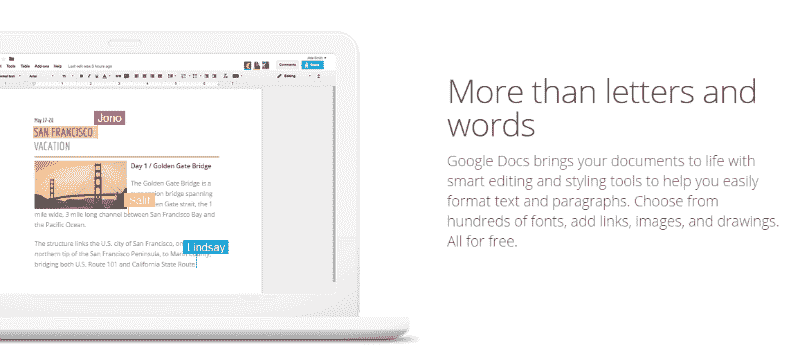
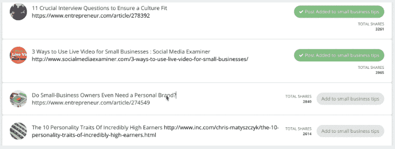
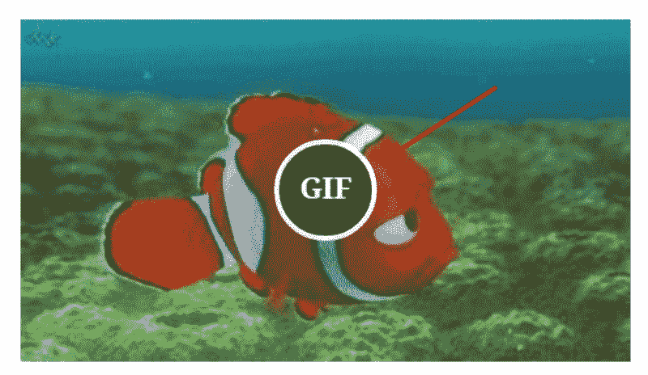
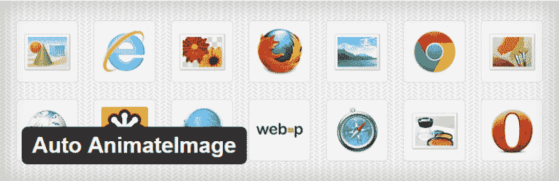

# 如何在你的网站上使用它们

> 原文：<https://kinsta.com/blog/wordpress-gifs/>

*在你的博客文章中使用多媒体内容可以带来更多的分享、更多的反向链接、更多的转化，以及更多你想要实现的其他东西。*

 *读者会看到你的努力，他们会通过分享或喜欢你的帖子来回报你。不要忘记用户变得相当挑剔。人们的注意力范围日益缩小，仅靠文字很难抓住和保持用户的注意力。

这就是为什么在你的网站上使用[图片](https://kinsta.com/blog/free-images-for-wordpress/)、[视频](https://kinsta.com/blog/embed-youtube-video-wordpress/)和动画 gif 是一个好主意。WordPress GIFs 怎么样？今天，我们将讨论在 WordPress 中使用 gif 的好处，以及如何快速方便地将它们添加到你的帖子中。

*   [使用 gif 的好处](#gif-benefits)
*   [WordPress gif-如何使用它们](#wordpress-gifs)
*   [如何将 gif 添加到 WordPress](#add-gifs-to-wordpress)

## 使用 gif 的好处

gif 很棒，原因有很多。首先，它们是页面上的移动元素，因此与单独的静态图像或文本相比，它们会立即抓住访问者的注意力。

GIF 动画也可以比视频效果更好。它们加载速度更快，占用的带宽更少，并且可以循环播放以获得即时(和持续)的兴趣。你知道当你滚动你的新闻提要时，脸书的视频是如何自动开始播放的吗？这难道不是一种有效的吸引注意力的技巧吗？

GIF 动画的工作方式大致相同。当有人登陆你的网站时，它们会立刻吸引眼球。

使用 gif 还可以提高你的跳出率和 T2 将访问者转化为订户或顾客的几率。不要忘记，像谷歌这样的搜索引擎更喜欢使用大量多媒体内容的网站和博客，如图像和视频[以及文本](https://kinsta.com/blog/content-length/)。只是不要忘记在 alt 标签中使用相关的关键字！

## 如何使用它们

当你想到 gif 时，你会想到什么？可能是你最近看过的那些搞笑的迷因或者动画之一吧？

虽然这些很搞笑，但这不是在你的网站或博客上使用 gif 的唯一方式。

*   如果你正在写一篇关于应用程序、软件或在线工具的“如何做”或评论文章，gif 尤其有用。你可以用 gif 来解释一个过程或者给出指示。
*   gif 可以帮助你为登陆页面创建杀手级的内容。例如，进入 [Google Docs](https://www.google.com/docs/about/) 页面，看看 gif 是如何用来解释这些特性的。

*   gif 将帮助你在你的目标受众中引发正确的情绪。借助 gif 突出易用性可以获得更好的转化。

这里有一个[的例子](https://choosejarvis.com/)。

这是一个社交媒体管理工具。动画 gif 用来说明在这个工具的帮助下查找和安排引人入胜的内容是多么容易。

*   说到登录页面或转换…你也可以使用 GIF 动画作为行动号召。
*   你可以使用 gif 来展示你的 WordPress 电子商务商店中的产品。有点像你在珠宝店看到的那些旋转展示台。
*   在社交媒体网站上分享帖子时，您也可以使用相同的 GIF。会提高你获得赞和分享的几率。

## 如何将 gif 添加到 WordPress

现在你已经知道并确信了它的好处，让我们看看如何在 WordPress 中添加动画 gif。幸运的是，向 WordPress 添加 gif 一点也不困难。

## 注册订阅时事通讯

### 想知道我们是怎么让流量增长超过 1000%的吗？

加入 20，000 多名获得我们每周时事通讯和内部消息的人的行列吧！

[Subscribe Now](#newsletter)

有一些插件可以让你快速方便地上传和嵌入 gif，就像你上传图片或视频一样。让我们来看看一些最好的 GIF WordPress 插件:

### [吉非派压力](https://wordpress.org/plugins/giphypress/)

安装这个插件将会在你的文本编辑器中添加一个“Giphy”按钮。当你创建一个新的页面或文章时，点击这个按钮使用标签查找相关的 GIF。一旦你找到了合适的 GIF，点击“嵌入到文章中”, GIF 就会被添加到你的文章中。就这么简单。

### [WP GIF 播放器](https://wordpress.org/plugins/wp-gif-player/)

在单个帖子或页面上添加大量 gif 有时会导致加载速度变慢。WP GIF 播放器可以帮你处理这个问题。一旦安装，该插件确保所有的 gif 文件不会同时被加载和播放。它将在所有动画上添加一个 GIF 按钮，允许访问者随意播放和停止。

### [自动设置特色图像](https://wordpress.org/plugins/autoset-featured-image/)

如果你想使用动画 GIF 作为特色图片，试试这个插件。GIF 需要是你文章中的第一张图片，因为这个插件会选择它能找到的第一张图片，并把它作为特色图片。

### [GIF 动画预览](https://wordpress.org/plugins/gif-animation-preview/)

这个插件允许你使用文章中的 GIF 作为预览图片。它可以是你的媒体库中的本地 GIF，也可以是来自其他网站的嵌入 Gif，由你决定。

### [自动动画图像](https://wordpress.org/plugins/auto-animateimage/)

上传一系列的图片，用这个插件组合起来，变成一个动画。您可以根据需要设置许多选项，如动画延迟、倒带、暂停或重复计数。如你所见，在你的 WordPress 博客上添加 gif 和动画图片非常简单。你所需要的只是一点点专业知识和合适的工具，你就可以开始了。

当然，您也可以使用 Giphy 等网站上的默认嵌入选项。

[通过 GIPHY](http://giphy.com/gifs/thumbs-up-keanu-reeves-j5QcmXoFWl4Q0)

如何看待在 WordPress 中使用 gif？你试用过这些插件吗？下面分享一下你的想法。

* * *

让你所有的[应用程序](https://kinsta.com/application-hosting/)、[数据库](https://kinsta.com/database-hosting/)和 [WordPress 网站](https://kinsta.com/wordpress-hosting/)在线并在一个屋檐下。我们功能丰富的高性能云平台包括:

*   在 MyKinsta 仪表盘中轻松设置和管理
*   24/7 专家支持
*   最好的谷歌云平台硬件和网络，由 Kubernetes 提供最大的可扩展性
*   面向速度和安全性的企业级 Cloudflare 集成
*   全球受众覆盖全球多达 35 个数据中心和 275 多个 pop

在第一个月使用托管的[应用程序或托管](https://kinsta.com/application-hosting/)的[数据库，您可以享受 20 美元的优惠，亲自测试一下。探索我们的](https://kinsta.com/database-hosting/)[计划](https://kinsta.com/plans/)或[与销售人员交谈](https://kinsta.com/contact-us/)以找到最适合您的方式。*