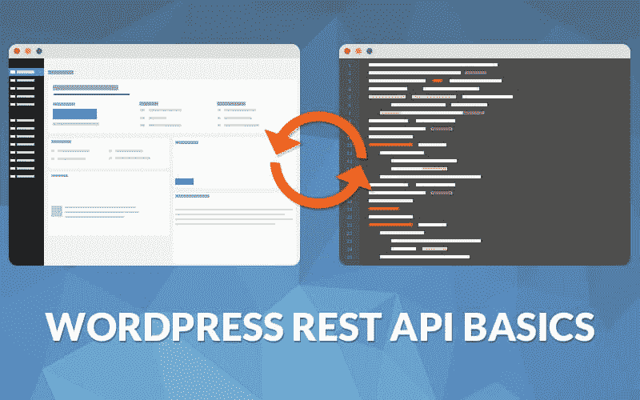

# GraphQL 带来的 WordPress 革命

> 原文：<https://kinsta.com/blog/wordpress-revolution-with-graphql/>

软件开发的世界变化很快。我们听到的关于 WordPress 最常见的抱怨之一是它对现代开发者来说不够“性感”——毕竟它已经有十多年的历史了。不管怎样，它为 25%的网络提供动力是有原因的:它在开发者中很有名，有一个[巨大的社区](https://kinsta.com/learn/wordpress-communities/)，一个[巨大的主题和插件生态系统](https://kinsta.com/learn/wordpress-history/)，你基本上可以[用它做任何你喜欢的事情](https://kinsta.com/blog/why-use-wordpress/)——博客、公司网站、社交媒体门户、电子商务网站等等。

随着最近官方 REST API 的加入，开发者可以将 WordPress 的后端从前端分离出来。开发纯 JavaScript 应用程序的可能性现在已经成为现实，这些应用程序依靠 WordPress 通过其 [REST API](https://kinsta.com/blog/wordpress-rest-api/) 接口提供后端业务逻辑和数据存储。

未来几年最好的例子之一就是 *Calypso* ，这是一个经过重新思考的管理界面，现在位于 WordPress.com 和一些自托管网站的后面，但是安装还不是那么容易。 *Calypso* 是一个基于 React 的应用程序，它通过 *[JetPack 的](https://kinsta.com/knowledgebase/wordpress-jetpack/) API* 与 WordPress 后端通信，因为 WP 的核心 REST API 还没有达到函数覆盖率的百分比。

Rest API 很棒，但是 GraphQL 更好。

有一个新手很可能会让世界上所有的 REST APIs 都失业。它被称为 **GraphQL** (这里有[的更多细节阅读官方公告帖子](https://facebook.github.io/react/blog/2015/05/01/graphql-introduction.html))，它是对 REST 的[直接替换。](https://medium.com/chute-engineering/graphql-in-the-age-of-rest-apis-b10f2bf09bba#.78m73jdlx)

GraphQL 代表了一种新的思想，使得数据的客户或消费者可以声明性地指定每个元素所需的数据。这意味着，例如，您可以将 GraphQL 规范附加到 React 组件，并告诉服务器您将需要哪种类型的数据以及确切的格式，不多也不少。

有了 REST APIs，您就有了一组预定义的端点，当被查询时，这些端点将总是向您发送与您(作为前端开发人员)必须在客户端操作的答案完全相同的答案，直到您获得想要使用的元素和格式。而 GQL 恰恰相反，它让前端开发人员的生活变得更加轻松！

这导致更少的数据传输，更精简的代码，最重要的是，更快的网络体验，尤其是在带宽仍然是个问题的移动设备上。

如果你和我们一样对这项新技术感到兴奋，那太棒了，因为我们认为这是创建应用程序的真正革命性的方法！

GraphQL 很棒，但是它对 WordPress 开发者有什么好处呢？如果你一直在关注 WordPress 的开发，那么最近它正在向 JavaScript 开发转移并且有一个非常有趣的项目由华盛顿特区 nclud 的高级 web 开发人员 **Ramsay Lanier** 发起，叫做 [WordExpress](https://github.com/ramsaylanier/WordpressExpress) 。我们联系了 Ramsay，他同意就这个激动人心的话题接受我们的采访:

你能告诉我们一些关于你自己的情况吗？

我是华盛顿特区一家名为 [nclud](http://nclud.com/) 的创意数字机构的高级交互开发人员。虽然我认为自己是一个完整的 javascript 开发人员，但我主要从事表示层的 javascript 工作。在我的业余时间，当我不开发愚蠢的基于表情符号的应用程序时，我试图成为两个非常年轻的女儿的好父亲。我试图让他们对 STEM 感兴趣，但他们仍然很年轻——尽管永远不会太早！

你每天都和 WordPress 一起工作，你的工作重点是什么？

在 nclud，我们设计和构建高度互动的网站和应用程序。我们使用各种内容管理系统，尽管我们主要使用 WordPress，因为我们的客户发现 WordPress 的编辑流程很简单。作为一名高级开发人员，我负责构建的所有方面——从自定义 PHP 主题到疯狂的基于画布的动画。

你是如何想到 WordExpress 的，它是什么？

WordExpress 是我在 WordPress 开发中用 Javascript 代替 PHP 的尝试。它在后端使用 Node.js 和 Express 构建，在前端使用 React。在这两者之间，有一个 GraphQL 服务器连接到一个 WordPress 数据库。

这个项目的主要原因是因为我希望能够使用 React 组件和 CSS 模块开发 WordPress 站点。CSS 模块非常棒，因为它们允许你专门为每个组件创建本地范围的 CSS。为了从 WordPress 数据库中获取数据，我最初尝试使用 WordPress API。我很快发现它对我想做的事情有很大的限制，并且我最终不得不编写一堆自定义的 REST 端点。此外，GraphQL 和 Relay 仍然很新，我想找个借口来学习它。

GraphQL 和 Relay 确实是这个项目的关键。

使用 REST API 和 GraphQL/Relay 的主要区别是什么？

使用 REST API，您可以从服务器创建一个请求，将其发送到客户机，并让客户机解析数据以获得它想要的东西。通常，您必须调用多个端点来获得您需要的整个数据集。虽然 REST 彻底改变了我们进行 web 开发的方式，但它肯定也有缺点。

脸书对 REST 的回答是 GraphQL。GraphQL 是一种非常强大的数据库查询语言，能够描述复杂的关系数据。它允许客户端确定它需要的确切数据集，并且只需要从客户端到服务器来回一次。它的数据库也不可知！

Relay 为 React 组件提供了数据获取功能，并且是专门为 GraphQL 设计的。使用 GraphQL/Relay 设置，组件通过定义 GraphQL“片段”来确定自己的数据需求。在应用程序呈现之前，Relay 遍历具有片段的组件，并构建一个(通常很大)查询，然后将该查询发送到服务器。它非常快速和高效。使用中继，您还可以获得客户端数据缓存。例如，当你登陆一个 blogroll 页面时，来自每篇博客文章的所有数据都将被获取并存储在客户端缓存中，所以当你进入一篇博客文章然后返回 blogroll 页面时，服务器不必再次获取任何数据——它已经在那里了！

## 注册订阅时事通讯

### 想知道我们是怎么让流量增长超过 1000%的吗？

加入 20，000 多名获得我们每周时事通讯和内部消息的人的行列吧！

[Subscribe Now](#newsletter)[WordExpress is my attempt at replacing PHP with JS in WordPress development. Its built using Node.js and Express on the back-end, and React on the front-end.Click to Tweet](https://twitter.com/intent/tweet?url=https%3A%2F%2Fkinsta.com%2Fblog%2Fwordpress-revolution-with-graphql%2F&via=kinsta&text=WordExpress+is+my+attempt+at+replacing+PHP+with+JS+in+WordPress+development.+Its+built+using+Node.js+and+Express+on+the+back-end%2C+and+React+on+the+front-end.)

根据你的经验，你认为 GQL/Relay 比使用 REST API(用 WordPress)更好吗？

绝对好。它需要不同的设计方法，但效率更高。

关于 WordExpress 的初步反馈如何？人的思想是什么？

太棒了！我心血来潮开始做这件事，只是想看看我能走多远。我真的不认为它会得到太多关注——但是这个项目已经在 Github 上获得了 800 多颗星。不过，我确实有很多问题——最大的问题可能是这个项目如何改变 WordPress 开发的管理方面。我的回答是:没有。它仍然使用久经考验的 WordPress 管理面板。

我认为仍然有很大一部分人并不真正理解 WordExpress 是如何工作的，或者它想要完成什么。我仍在撰写一系列文章，详细解释这个项目。我已经写了一篇介绍性文章解释“为什么”,还有两篇文章详细介绍 GraphQL 和 Sequelize 是如何工作的。接下来还有更多。

**您目前在实施这种新方法时遇到的最大问题是什么？**

最大的批评是 WordExpress 不能与大多数 WordPress 插件兼容。这是真的——你使用的任何影响前端的插件都不会工作。你仍然可以使用影响后端的插件，比如[高级定制字段](https://kinsta.com/blog/advanced-custom-fields/)，或者 WP-Types(我使用的)。但是好处是，因为它是使用 Node 构建的，所以您可以使用任何您想要的 NPM 包，所以这是一种权衡。

Struggling with downtime and WordPress problems? Kinsta is the hosting solution designed to save you time! [Check out our features](https://kinsta.com/features/)

此外，服务器端渲染目前不工作，这是一个大问题。现在，你得不到任何 SEO，因为 HTML 是动态渲染的——我正在积极地让服务器端渲染与 Relay 和 GraphQL 一起工作，它非常接近。GraphQL/Relay 社区已经做了一些很好的工作来支持这一点。

你有计划使用新技术来改进 wp-admin 吗？(我指的是类似 Calypso 的项目。)

目前没有——我还没有和卡里普索一起玩过。总的来说，我对 WordPress 的管理体验非常满意。为了让前端开发体验达到我想要的效果，还有很多事情需要解决，所以我现在专注于此。

如果有人想捐款，他们怎样才能找到你？

Twitter 是直接联系我的最好方式。如果你想提交[拉动请求](https://github.com/ramsaylanier/WordPressExpress)——我全力支持！我积极回顾公关和 GitHub 的问题，所以我保证他们不会逗留。

Ramsay，感谢你抽出时间接受采访！

在 Kinsta，我们认为 **GraphQL 代表了 web 和应用程序开发新时代的曙光**,我们将在未来几年看到利用这些令人敬畏的技术的真正革命性的解决方案。

如果你想了解更多关于 GraphQL 的内容，我们在下面提供了一些资源，如果你想添加更多内容，请在下面发表评论或给我们发消息！

## **文档**

*   **[GraphQL 规范](http://spec.graphql.org/)**
*   **[接力入门](http://facebook.github.io/relay/docs/getting-started.html)**

## **课程/课程**

*   [**让我们学习 GraphQL**](https://learngraphql.com/)

## 录像

*   [**探索 GraphQL**](http://www.youtube.com/watch?v=WQLzZf34FJ8) 作者:李·拜伦，脸书(React Europe 2015)
*   [**Relay——React**](http://www.youtube.com/watch?v=IrgHurBjQbg)的应用框架，作者:Joseph Savona，脸书(React Europe 2015)

## **相关文章:**

**[WordPress REST API Basics](https://kinsta.com/blog/wordpress-rest-api/)**WordPress has been gradually moving away from being just a blogging for years now. The final nail…

* * *

让你所有的[应用程序](https://kinsta.com/application-hosting/)、[数据库](https://kinsta.com/database-hosting/)和 [WordPress 网站](https://kinsta.com/wordpress-hosting/)在线并在一个屋檐下。我们功能丰富的高性能云平台包括:

*   在 MyKinsta 仪表盘中轻松设置和管理
*   24/7 专家支持
*   最好的谷歌云平台硬件和网络，由 Kubernetes 提供最大的可扩展性
*   面向速度和安全性的企业级 Cloudflare 集成
*   全球受众覆盖全球多达 35 个数据中心和 275 多个 pop

在第一个月使用托管的[应用程序或托管](https://kinsta.com/application-hosting/)的[数据库，您可以享受 20 美元的优惠，亲自测试一下。探索我们的](https://kinsta.com/database-hosting/)[计划](https://kinsta.com/plans/)或[与销售人员交谈](https://kinsta.com/contact-us/)以找到最适合您的方式。