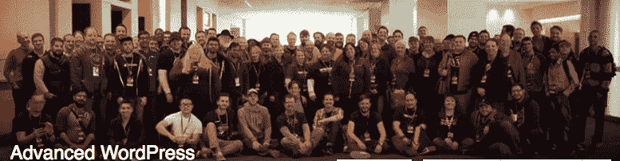

# 金斯塔·金并:马特·克伦威尔访谈

> 原文：<https://kinsta.com/blog/interview-with-matt-cromwell/>

你也可以在推特上找到他。这是我们最近对他的采访，作为我们[金斯塔·金并](https://kinsta.com/?post_type=post&s=kingpin)系列的一部分。

Q1:你有什么背景，你是如何开始涉足 WordPress 的？

我有音乐教育、神学和美国宗教史的学位。我总是被教育和终身学习所吸引，尤其是和别人一起。我最终用 WordPress 做了很多事情，就像其他人一样:教堂。作为一个信仰为基础的非营利组织的年轻人，意味着当教会决定他们需要一个网站时，他们会找我。我在 90 年代末自学了 HTML/CSS，并沉迷于 CSS Zen Garden 和 List Apart。

然后我偶然发现了这个人人都在谈论的东西:库布里克。我觉得它很棒，但它是建立在一个叫做 WordPress 的奇怪东西上的。所以我深入调查了一下。从那以后，几乎在我生活或工作的任何地方，我都开始帮助网站。

但直到 2011 年，我才开始想我可以建立一些网站来创收。我的朋友亚当·麦克莱恩需要一些客户的帮助，我决定全职建立网站。从那以后，我加入了 AdvancedWP 脸书团队，最初被 FooPlugin 聘为支持专家，然后进入我现在的职位，在 WordImpress 担任支持和社区负责人。

Q2:word impress 与其他插件/主题商店有什么不同？

我们试图在我们的产品和服务中找到所有正确元素的恰当平衡。一些商店确实擅长编码，但是严重缺乏支持和/或营销。这些商店最终成为很少有人真正使用或了解的优秀产品。其他商店都是建立在廉价劳动力上的营销。这些产品无处不在，但不一定按照“WordPress 的方式”编码，或者有问题，或者就是很糟糕。

对我们来说，我们努力让高质量的代码得到很好的支持，我们给它打上品牌，并很好地营销它。所有重要部分的组合。但是大家都说“优质代码”。对我们来说，我们知道这是好代码，因为我们通过更广泛的 WordPress 社区，通过我们的客户支持，通过我们对 Give 的 85 个五星评论得到了验证。这就是为什么所有的事情都很重要。这就像一个制衡系统。支持是代码质量的反馈环。当产品真的很好时，营销就更容易了。如果没有我们的支持，我们的营销看起来是肤浅和虚假的。

一些商店可能凭直觉知道这一点，但我认为我们是通过我们的经验以及我们在所有工作中为实现这一点所付出的努力而知道的。

**Q3:Give 插件是怎么来的？**

Devin Walker——WordImpress 的创始人和首席开发者——和我一起在 word impress 工作之前，都曾作为自由职业者为非营利机构工作过。他和我都知道 WordPress 的在线捐款是一件非常头疼的事情。你不想要像 WooCommerce 和 EDD 那样的捐赠系统。你也不仅仅想要一个不允许你有力地管理你的捐赠者的表格。

我上台后不久，Devin 和我说:“让我们在 WordPress 中解决一个真正大的问题”，并同意在线捐款。我们还想在大型产品上巩固我们的产品开发方法。因此，Give 很快成为我们的旗舰产品，它也成为我们所有新产品发布的路线图，以及我们如何评估产品发布的成败。

Q4:什么是高级 WordPress？

AdvancedWP 脸书组最初是 Michael Bastos 的创意，他是圣地亚哥本地的全栈开发人员。他知道在圣地亚哥(以及其他任何地方)有一群技术高超的 WordPress 开发者，他们需要一个地方来“交流”和互惠互利。他开始了我们的本地聚会，称之为 AdvancedWP，并创建了脸书群，成为该群人的全天候公共空间(注意，该群不再是“公共的”)。我这里有集团[的详细历史。](http://www.cloudways.com/blog/advanced-wordpress-community/)

问 5:你希望在一家托管 WordPress 的公司里找到什么？

## 注册订阅时事通讯

### 想知道我们是怎么让流量增长超过 1000%的吗？

加入 20，000 多名获得我们每周时事通讯和内部消息的人的行列吧！

[Subscribe Now](#newsletter)

完全披露:我们是媒体圣殿的 WordPress 社区顾问，它有自己的管理 WordPress 产品。

我对托管的看法是——不管是否托管——它应该是不可见的。主机应该为你做 24/7 的工作，而你根本不用去想它。

对于托管，许多开发人员都在寻找几个主要的优先事项:

1.  快速建立新网站的能力
2.  速度和安全性
3.  [暂存环境](https://kinsta.com/help/staging-environment/)

这些也是我主要关心的问题。如今，对于所有围绕着"[管理 WordPress hosting](https://kinsta.com/blog/managed-wordpress-hosting/) "的 hubub 来说，代理商和自由职业者的需求仍然是众所周知和直接的。当然，让一个主持人变得优秀的不仅仅是很好地满足这些需求，而是当一个小问题突然出现时，主持人可以立即专业地介入，解决问题，并很快再次隐身。

问题 WordPress 可以改进的地方是什么，如何改进？

老实说，我并不担心 WordPress 会有太多的改进。当然，我希望看到 WordPress 抛弃向后兼容性，让 Core 成为这个星球上最快、最精简的东西。当然，我认为 REST API 和 Fields API 是几年前就应该出现的。但最终，WordPress 推动经济发展不是因为这些核心功能，而是因为围绕这个项目的巨大社区。对我来说，最重要的改进不在于代码，而在于改善 Automattic、核心团队和基金会之间的关系和反馈循环。

Struggling with downtime and WordPress problems? Kinsta is the hosting solution designed to save you time! [Check out our features](https://kinsta.com/features/)

圣地亚哥的 WordPress 社区是什么样的？

我爱圣地亚哥和这个 WordPress 社区。我们都是这里的朋友，我们喜欢出去逛逛，聊聊天，互相学习。因为我现在是我们聚会的主要组织者，我把我们当地的社区和其他社区做了一些比较。你看过拉合尔的 Meetup 数字吗！？你知道奥斯汀有七个聚会吗！？显然，无论我们在圣地亚哥有多少有影响力的人和市场领导者，总有成长和改进的空间。

所以现在，我主要关注的是用一些新鲜血液来增强和发展我们的本地聚会。我们刚刚开始在那里获得一些良好的势头，我真的期待我们的圣地亚哥社区在 2016 年取得伟大的成就。

在你看来，WordPress 社区这些年来有什么变化？

它呈指数增长。它变得真正全球化了。但它也变得更加破碎了。WordPress 作为一个开源项目和社区的成功将它推向了每一个有互联网的地方。看到 WordPress 在世界各地的发展真是令人震惊——我绝对喜欢它！

但我之前提到了社区和领导层之间的裂痕。对我来说，这是一个真正的问题。REST API“drama”只是这种脱节的最新反映。开发者热爱 WordPress，并在物质和经济上投资于它的未来。所以当他们说“我们需要一个 REST API”是因为他们喜欢 WordPress。但是当这种反馈被推后而没有任何解释时，裂痕就扩大了。

就个人而言，我相信当马特·莫楞威格说 REST API(在这里阅读我们的 [REST API 基础文章](https://kinsta.com/blog/wordpress-rest-api/))需要做 wp-admin 做的所有事情以便做好准备时，他说的是为了项目的利益。但是我不明白为什么这对这个项目有好处——我想其他人也不明白。如果是这样的话，我希望 Mullenweg 能把他的情况说清楚。有些人可能仍然不同意这一点，但至少，他们会理解，理解会减少而不是扩大裂痕。

Q9:你 2016 年的主要业务目标是什么？

你的意思是我必须选择一个？我们计划今年实现大幅增长。对我个人来说，这意味着扩大我的支持团队，这意味着我的许多意识形态立场和支持经验必须开始与团队一起扩展。因此，我的目标是认真对待并以一种优秀的方式发展这个支持团队，并使其与我们的产品相适应。

Q10:我们下一步应该考虑面试谁，为什么？

Valet.io. Mason 的 Mason James 建立了一个令人惊叹的高质量 WordPress 开发者和问题解决者团队。他有如此高的员工满意度和客户满意度——这真的令人印象深刻。他也有哲学上的领导。他致力于扁平化的领导结构，用敏捷的方法解决客户的问题。他执行所有这些。当然，采访梅森·詹姆斯。

* * *

让你所有的[应用程序](https://kinsta.com/application-hosting/)、[数据库](https://kinsta.com/database-hosting/)和 [WordPress 网站](https://kinsta.com/wordpress-hosting/)在线并在一个屋檐下。我们功能丰富的高性能云平台包括:

*   在 MyKinsta 仪表盘中轻松设置和管理
*   24/7 专家支持
*   最好的谷歌云平台硬件和网络，由 Kubernetes 提供最大的可扩展性
*   面向速度和安全性的企业级 Cloudflare 集成
*   全球受众覆盖全球多达 35 个数据中心和 275 多个 pop

在第一个月使用托管的[应用程序或托管](https://kinsta.com/application-hosting/)的[数据库，您可以享受 20 美元的优惠，亲自测试一下。探索我们的](https://kinsta.com/database-hosting/)[计划](https://kinsta.com/plans/)或[与销售人员交谈](https://kinsta.com/contact-us/)以找到最适合您的方式。