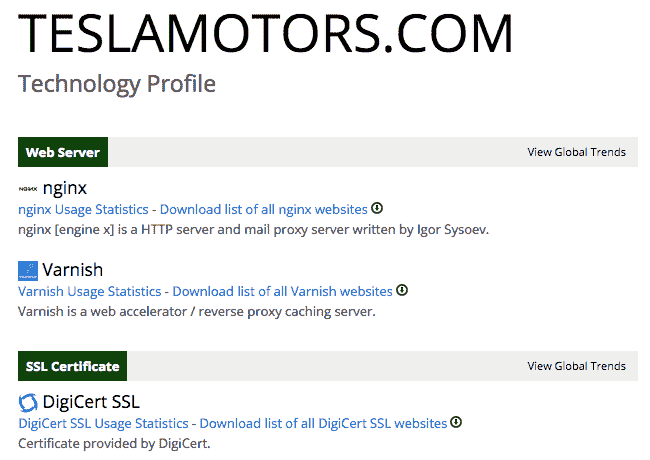

# 如何使用 BuiltWith 生成业务线索

> 原文：<https://kinsta.com/blog/generate-business-leads-using-builtwith/>

简单来说，它是一个技术查找工具，可以用于多种目的。假设你已经创建了自己的电动汽车公司，并想与埃隆·马斯克和特斯拉竞争(祝你好运)。你很有抱负，并且知道特斯拉的网站流量为他们的汽车销售带来了很多线索。如果您可以查看他们的网站托管在哪里，以及他们用来获取和转换线索的任何营销和分析软件，这不是很好吗？

### 使用 BuiltWith 生成业务线索

有了 BuiltWith，你就可以做到这一点。一旦你开始使用这个工具，它就会变得非常迷人。例如，当我们[在 TeslaMotors.com 上运行查询](http://builtwith.com/teslamotors.com)时，我们会找到很多有用的信息。例如，他们正在使用 Neustar 提供的名为 UltraDNS 的 DNS 服务。他们使用 Nginx 和清漆的混合物。他们托管在 QTS 上，Akamai 是他们的 CDN，并且喜欢 [JavaScript 库](https://kinsta.com/blog/javascript-libraries/)。在营销方面，我们可以看到他们正在使用 Drupal、[、谷歌分析](https://kinsta.com/blog/how-to-use-google-analytics/)、Salesforce、Marketo、Optimizely 和 Eloqua(现在是甲骨文的一部分)。

现在，重要的是真正做好你的功课，并对此有所保留。他们托管 QTS 是因为他们是世界上最好的提供商，还是因为他们得到了巨大的折扣？他们用 Eloqua 是因为热爱还是因为马斯克和埃里森是朋友？

他们使用 Drupal 是因为他们认为它比 WordPress 好，还是因为一些广告公司说服了他们？在很大程度上，我们永远不会知道。但至少，我们知道他们确实在用什么，即使我们不知道为什么。

现在，大多数人可能会想，他们会对最接近的 3-5 个竞争对手使用这个工具，这是一个很好的开始。然而，仅仅用它来做这件事是短视的。跳出框框思考。查找那些营销做得很好的公司，即使他们不在你的垂直领域，看看他们在用什么。你可能会对你的发现感到惊讶，你可能会开始使用你的竞争对手甚至不知道的工具。

到目前为止，我们已经讨论了该工具的发现方面，但是让我们深入研究一下他们的付费产品。假设你已经建立了一个比 Neustar 的 UltraDNS 更好的 [DNS 服务](https://kinsta.com/blog/premium-dns/)，并且想让他们所有的客户都知道它。嗯，BuiltWith 有一个使用他们服务的 [230，000 个站点的列表](http://trends.builtwith.com/ns/UltraDNS-neustar)，你可以通过付费订阅购买。

你会得到电子邮件地址和域名，然后你可以用它们来创建一个推广活动。或者假设你想知道所有使用特定 [WordPress 插件](https://kinsta.com/knowledgebase/wordpress-plugin/)的网站。是的，你也可以这样做。也许你的主题补充了那个特定的插件，或者你有一个插件以更优雅的方式实现了同样的目标。

现在你们中的一些人可能会想，“天哪，这意味着人们可能能够找到我所有客户的列表”。您的假设是正确的，有人可能会为此目的使用该工具。但是就像其他事情一样，你总是会成为偷猎的目标，最好的防御就是良好的进攻。

这意味着做你应该已经在做的事情，创造一个伟大的产品或服务，让你的客户非常高兴，他们会删除你的竞争对手发给他们的电子邮件，无论他们是从 BuiltWith 还是从其他地方获得信息。

* * *

让你所有的[应用程序](https://kinsta.com/application-hosting/)、[数据库](https://kinsta.com/database-hosting/)和 [WordPress 网站](https://kinsta.com/wordpress-hosting/)在线并在一个屋檐下。我们功能丰富的高性能云平台包括:

*   在 MyKinsta 仪表盘中轻松设置和管理
*   24/7 专家支持
*   最好的谷歌云平台硬件和网络，由 Kubernetes 提供最大的可扩展性
*   面向速度和安全性的企业级 Cloudflare 集成
*   全球受众覆盖全球多达 35 个数据中心和 275 多个 pop

在第一个月使用托管的[应用程序或托管](https://kinsta.com/application-hosting/)的[数据库，您可以享受 20 美元的优惠，亲自测试一下。探索我们的](https://kinsta.com/database-hosting/)[计划](https://kinsta.com/plans/)或[与销售人员交谈](https://kinsta.com/contact-us/)以找到最适合您的方式。