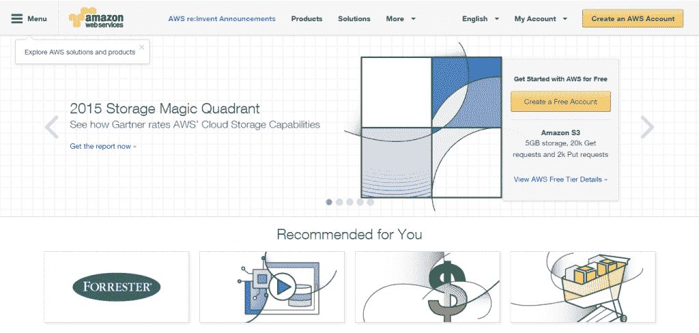

# 为什么你可能需要一个 WordPress 开发团队

> 原文：<https://kinsta.com/blog/wordpress-devops/>

在软件发布的间隙，维护团队将接管以确保一切顺利运行，直到下一次更新发生。这一切都非常古怪，是软件基础设施的过时模型。

这一点在 WordPress (WP)网站上表现得最为真实。由于平台更新的不变性质，以及所有的插件和主题，它改变了开发人员使用更新模型的方式。

最大的变化是开发者运营(DevOps)模式的兴起。

自从开发者运营的出现，定期更新的想法就被抛到了脑后。开发人员和 IT 运营部门合并在一起，根据需要不断更新系统，而不是定期进行更新。

[现在上百万的网站中有 32%运行在 WordPress](https://kinsta.com/learn/wordpress-history/) 上，随着采用的增长，特别是在[企业](https://kinsta.com/blog/wordpress-enterprise/)中，WordPress 的 DevOps 将成为必须。

*   [什么是 WordPress DevOps？](#what-is-wordpress-devops)
*   [何时雇佣 WordPress DevOps 团队](#hire-wordpress-devops-team)
*   我的 WordPress DevOps 团队应该做什么？

## 什么是 WordPress DevOps？

DevOps 这个术语太新了，它仍在被定义中。然而，最常见的定义是*“持续改进、功能发布和更新应用程序或网站，以确保功能顺畅，不会停机或中断。”*T3】

考虑一个像纽约大学这样的大型企业用户。WordPress 的多站点安装有超过 2000 个博客安装，它需要的不仅仅是偶尔点击“更新”按钮来维护。

还要考虑到，如果 NYU 的博客网络瘫痪，这种影响可能会影响成千上万的学生、教授和教员，他们的日常活动都依赖于这个网站。

在保持系统可靠性的同时增加新功能需要规划并遵守严格的标准。当我们提到 WordPress 的 DevOps 时，我们最经常谈论的是这些标准的实现，从测试到新代码发布的频率以及代码应该如何构造。

仅插件库中就有超过 40，000 种功能，更不用说[季度核心更新](https://kinsta.com/blog/wordpress-automatic-updates/)和贵公司网站不断发展的需求，WordPress 的 DevOps 是必须的。

## 何时雇佣 WordPress DevOps 团队

你应该在什么时候考虑为你的企业雇佣一名开发工程师或团队？需要等到有 2000 个站点吗？

一般来说，大多数需要 DevOps 的公司都有三个特定的需求。

**首先，网站对任务或收入至关重要。**T3】

拿工艺品和古董电子商务网站 [Etsy](http://etsy.com) 来说。该网站在 2014 年创造了超过[2 亿美元](http://www.statista.com/statistics/409371/etsy-annual-revenue/) 的收入，去年每天仍有超过 [50 次](http://www.infoq.com/news/2014/03/etsy-deploy-50-times-a-day) 变更部署到网站。

当你分解 Etsy 对他们的网站所做的 18000 多项更改时，你会意识到这些日常的小更改是如何在一年中完全改变网站的外观和感觉的。

## 注册订阅时事通讯

### 想知道我们是怎么让流量增长超过 1000%的吗？

加入 20，000 多名获得我们每周时事通讯和内部消息的人的行列吧！

[Subscribe Now](#newsletter)

相比之下，普通的小企业除了写几篇博客，可能每一两年就要进行一次重大变革。在小企业更换一次网站的时间里，像 Etsy 这样的网站可能会重新设计他们的网站十几次甚至更多。

如果你的网站希望扩大规模和范围，那么你需要一个开发团队来保护你的在线收入基础。通常，当一个公司结束在一个一致的基础上为网站修复和添加功能时，他们会意识到一个好的 DevOps 团队的重要性。

**其次，开发运维有助于即将到来的复杂、关键或大型基础设施的关键部署。**

以亚马逊的 AWS 服务为例。他们有一个庞大的 DevOps 团队，以确保他们每天对网站所做的更改得到准确实施。

亚马逊网络服务助力 [全球成千上万的网站](http://www.forbes.com/sites/benkepes/2014/11/25/scale-beyond-comprehension-some-aws-numbers/) 。2014 年全年，他们只有 [2.41 小时的停机时间](http://www.networkworld.com/article/2866950/cloud-computing/which-cloud-providers-had-the-best-uptime-last-year.html) 。这意味着系统 99.9974%的时间都在运行。

DevOps 的强大之处在于，你能够对一个庞大的网站网络进行持续的改变，而不会出现去年大规模发布和更新时的所有小故障。

**第三，您目前没有对多个项目或供应商(或两者)的内部监督！)**

传统的发布习惯于将开发人员从 IT 维护中孤立出来。然而，没有一个中心枢纽，多个项目同时进行是没有意义的。

通过将两者结合在一起，企业可以通过拥有两个独立的团队来降低成本。有点像公司的内部合并。此外，由一个团队负责网站的整体更新和维护，您在更新过程中的摩擦会更少。

## 我的 WordPress DevOps 团队应该做什么？

在雇佣或签约开发团队之前，考虑一下你需要从他们那里得到什么。正如本文前面所讨论的，你的 DevOps 团队确保你当前的 WordPress 站点能够顺利运行，但是他们不仅仅是开发者。

他们致力于更新你的 WordPress 网站，添加新代码，修复关键错误，批准第三方代码，测试和部署新功能。

确保你有一个清晰的目标和里程碑列表，当你希望你的开发团队达到这些目标时。像 New Relic 这样的实施和[监控工具是任何 DevOps 团队成功的关键，因为正是这些工具关闭了反馈回路，让您的组织知道网站做得如何。](https://kinsta.com/blog/wordpress-performance-new-relic/)

您对开发团队的期望结果

你还记得 Twitter 404 错误吗？随着这些错误的增长，它在最初几年一直困扰着这个网站。在那个时候， *[推特失败鲸鱼](http://www.webmonkey.com/2010/06/twitter-fail-whale-rendered-in-pure-css/)* 是一个常见的短语，因为社交网络几乎每天都发生故障。

然后像变魔术一样，它停了。网站中断，*失败的鲸鱼*，以及使用一个总是在你点击发布时就崩溃的网站的烦恼。这就是 DevOps 的力量。

使用 DevOps 意味着永远不用担心特性和稳定性之间的冲突。一个好的 DevOps 团队能够并且将会确保强大的特性发布和稳定的基础设施。

正在为你的 [Kinsta](https://kinsta.com) 托管的 WordPress 站点寻找 DevOps 吗？

如果你正在考虑在你的 kin sta[Google Cloud powered infra structure](https://kinsta.com/blog/google-cloud-hosting/)之上建立一个 WordPress DevOps 团队，请告诉我。我很乐意回答你的任何问题。

* * *

让你所有的[应用程序](https://kinsta.com/application-hosting/)、[数据库](https://kinsta.com/database-hosting/)和 [WordPress 网站](https://kinsta.com/wordpress-hosting/)在线并在一个屋檐下。我们功能丰富的高性能云平台包括:

*   在 MyKinsta 仪表盘中轻松设置和管理
*   24/7 专家支持
*   最好的谷歌云平台硬件和网络，由 Kubernetes 提供最大的可扩展性
*   面向速度和安全性的企业级 Cloudflare 集成
*   全球受众覆盖全球多达 35 个数据中心和 275 多个 pop

在第一个月使用托管的[应用程序或托管](https://kinsta.com/application-hosting/)的[数据库，您可以享受 20 美元的优惠，亲自测试一下。探索我们的](https://kinsta.com/database-hosting/)[计划](https://kinsta.com/plans/)或[与销售人员交谈](https://kinsta.com/contact-us/)以找到最适合您的方式。