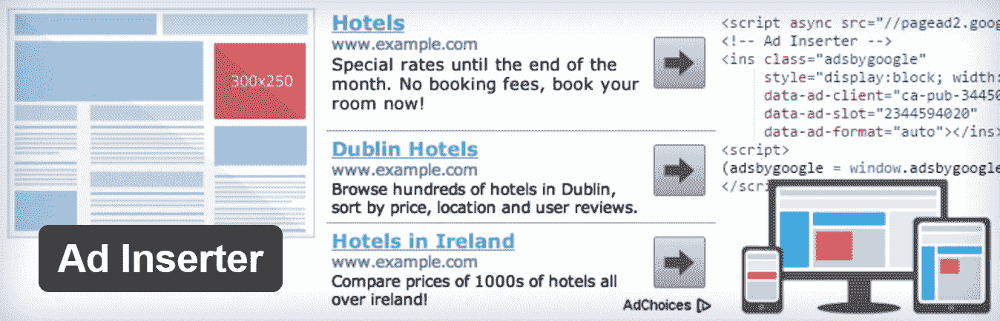
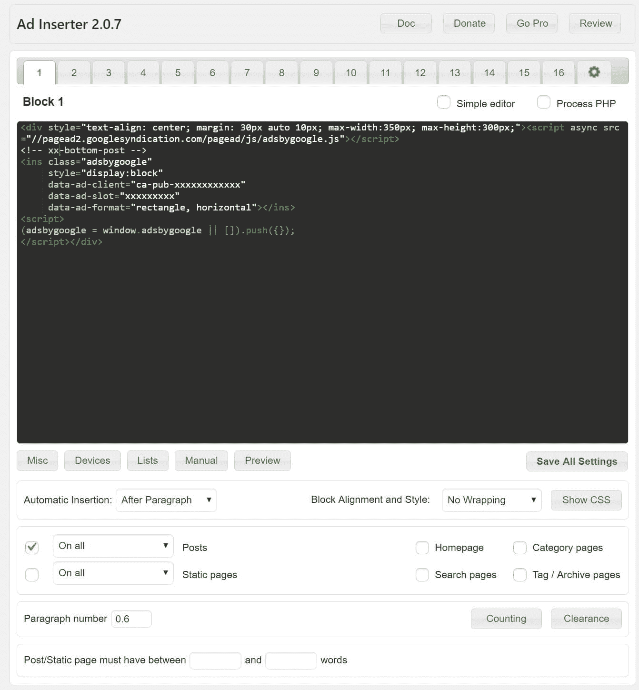
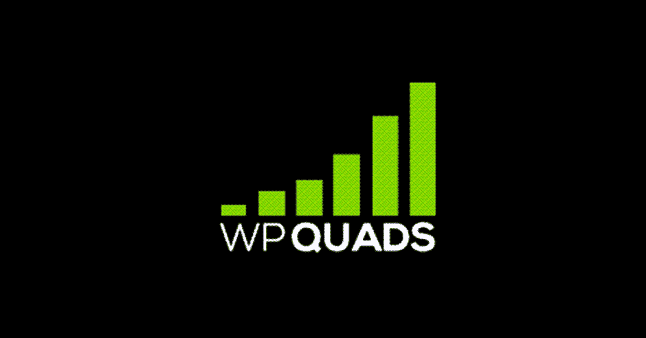
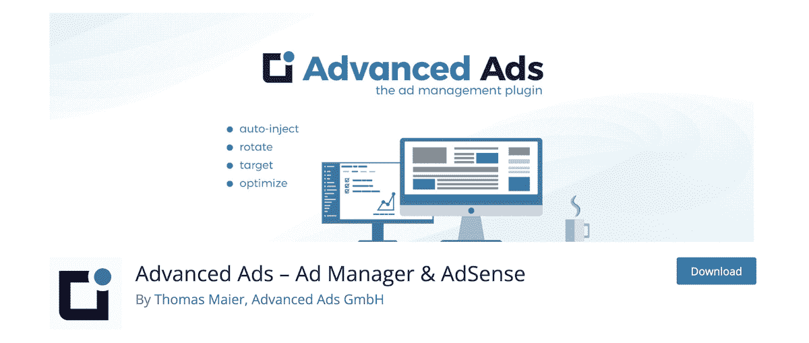

# 增加博客收入的 6 个最佳 WordPress 广告插件

> 原文：<https://kinsta.com/blog/wordpress-advertising-plugin/>

许多博客和大流量网站依赖广告作为主要收入来源。这可能包括 [Google AdSense](https://kinsta.com/blog/how-to-add-google-adsense-to-wordpress/) 、 [AdSense 替代品](https://kinsta.com/blog/adsense-alternatives/#21-buysellads)、联盟广告或直接广告销售。许多人遇到的一个问题是，广告是一种难以维持和管理的货币化策略。摆弄你的 AdSense 代码和你的 WordPress 主题很快会成为许多人的噩梦。你有没有试过跟踪你在网站上销售的[横幅？](https://kinsta.com/blog/banner-ad-sizes/)

幸运的是，如果你在你的 WordPress 网站上设置了一个专业的广告管理插件，你可以很容易地解决这些问题。别忘了优化你的移动广告。根据 WordStream 的[研究，移动广告的点击率比桌面广告高 40%。以下是 6 个最好的 WordPress 广告插件的详细比较，它们可以通过提供一个全面的更好的广告管理解决方案来帮助你提高你的博客收入。
T3】](http://www.wordstream.com/blog/ws/2016/09/15/mobile-advertising-statistics)

## 2022 年最佳 WordPress 广告插件

*   [广告插入器](#ad-inserter)
*   [旋转](#adrotate)
*   [WP QUADS 广告插件](#adsense-plugin-wp-quads)
*   [高级广告](#advanced-ads)
*   [Ads Pro 插件](#ads-pro-plugin)
*   [WP-插入](#wp-insert)

### 1。广告插入器

如果你正在寻找一个可靠的、开发良好的 WordPress 广告插件，我们强烈推荐从[广告插入器](https://wordpress.org/plugins/ad-inserter/)开始。它目前有 40，000 多个活跃安装，五星评级中有 4.9 个。这可能是资源库中维护得最好的插件之一，开发者 Igor 在支持论坛上非常活跃。

Ad Inserter WordPress plugin

广告插件允许你在 WordPress 中插入广告或 HTML/Javascript/PHP 代码。它可以用于所有不同种类的广告，从 Adsense 到[附属广告](https://kinsta.com/affiliates/)。插件有免费版和高级版。甚至是亚马逊推荐的[。](https://affiliate-program.amazon.com/help/topic/t405)

这个插件的一个伟大之处在于它可以让你在文章的任何地方插入广告。你可以在文章内容之前/之后这样做，甚至可以按你的内容的百分比(或段落数)来做。也许你想在免费的三个段落之后做一个广告，这个可以做到。这都是自动设置的，没有短码，你可以乱用。如果你不想让某个广告出现，也很容易排除特定的页面并发布。

Ad Inserter plugin settings

免费版的附加功能包括:

> 需要在这里大声喊出来。Kinsta 太神奇了，我用它做我的个人网站。支持是迅速和杰出的，他们的服务器是 WordPress 最快的。
> 
> <footer class="wp-block-kinsta-client-quote__footer">
> 
> 
> 
> <cite class="wp-block-kinsta-client-quote__cite">Phillip Stemann</cite></footer>

[View plans](https://kinsta.com/plans/)

*   16 个代码块
*   语法突出显示编辑器
*   使用可视化 CSS 编辑器进行代码预览
*   手动插入: [widgets](https://kinsta.com/blog/wordpress-widgets/) ，shortcodes，PHP 函数调用
*   块对齐和样式:左对齐、居中、右对齐、左浮动、右浮动、自定义 CSS、无换行(保持广告代码不变，否则由 div 换行)
*   间隙选项，以避免在图像或标题附近插入
*   PHP 代码处理
*   服务器端和客户端设备检测(3 个自定义视窗)
*   黑/白名单类别、标签、帖子 id、URL、URL 参数、推荐人

### 2。旋转

在选择 WordPress 广告插件时，AdRotate 是最古老和最受欢迎的选择之一。它拥有高达 50，000+的活跃安装量，五星评级为 4.3 分，自 2014 年初中期以来一直存在。

AdRotate plugin

AdRotate 是一个漂亮的广告管理器插件，具有几乎所有的功能。简单的管理允许您直接从仪表板上编辑您的广告显示。您可以瞬间添加、配置、删除和预览多个横幅。您可以将广告设置为只向从特定位置访问您网站的访问者显示。还有一个免费和高级版本的插件。

您可以安排每个广告在一段指定的时间后过期，或者在一定数量的展示或点击后过期。你也可以选择在广告即将过期时被插件通知，可以是电子邮件，也可以是(这是最酷的地方！)或者在你的 iOS/Android 设备上推送广告临近到期的通知。如果你在你的博客上出售广告空间，广告商甚至可以从他们的仪表板上直接给你发电子邮件。

AdRotate 提供广泛的广告跟踪——很容易看出哪些广告表现最好，哪些广告表现不佳。CTR(点击率)，每日/每月统计，以及更多也是可见的，一切都可以在 CSV 导出。它最独特的功能之一是能够检测到访问者何时启用了[广告拦截器](https://kinsta.com/blog/ad-blockers/)，然后相应地显示一条小消息(例如，“您启用了广告拦截器，为了充分利用该网站，我们建议您将其关闭。”).广告也可以通过短代码、小工具或者你的主题的 PHP 来显示。

其他功能包括:

*   与 Google AdSense、DFP 和大多数其他推荐/广告服务器一起工作
*   动态群组广告的自动化 Javascript 循环
*   让您的广告客户添加/编辑/管理他们自己的广告并与您联系
*   销售广告时，接受仪表板上的 Paypal 付款
*   移动广告(区分平板电脑和手机)
*   伪装来自广告拦截器的广告，使它们不会被删除
*   易于使用的统计数据，因此您可以跟踪每个广告的表现
*   回应广告
*   在页面或帖子中放置随机或选定的横幅
*   每个横幅位置有多个组
*   在网格、列或行中一次显示多个广告
*   过期后自动禁用广告
*   使用短代码、小工具或 PHP 在你的网站上投放广告

目前，AdRotate 与 Nginx FastCGI 页面缓存不完全兼容。由于不兼容，您可能会发现广告不会自动旋转或改变，直到 [Kinsta 页面缓存被清除](https://kinsta.com/blog/wordpress-clear-cache/)。

### 3。WP 四元组的广告插件

WP Quads 的[广告插件是已经停产的 Quick AdSense 广告插件的一个分支，该插件曾经是知识库中下载量最大的广告插件。它是用一个坚实的代码基础从零开始重写的，并由制作](https://wordpress.org/plugins/quick-adsense-reloaded/) [MashShare](https://www.mashshare.net/) 社交媒体共享插件的同一个团队提供支持。它目前有 20，000 多个活跃安装，五星评级为 4.9 分。

## 注册订阅时事通讯

### 想知道我们是怎么让流量增长超过 1000%的吗？

加入 20，000 多名获得我们每周时事通讯和内部消息的人的行列吧！

[Subscribe Now](#newsletter)

Ads plugin by WP QUADS

如果你需要简单地让 AdSense 在你的网站上快速运行，这可能是一个很好的解决方案。如果你还在使用旧的快速 AdSense 插件，它有一个“快速导入”功能，所以你可以很容易地迁移过去。最新的功能之一是它支持谷歌广告。就像上面的插件一样，这也有一个免费和高级版本。该团队还关注性能，这很好理解，它没有外部脚本依赖。一些附加功能包括:

*   在一篇文章中的任何地方专门或随机插入谷歌广告
*   支持任何广告代码；不仅限于 Google Adsense
*   一页最多显示 10 个广告
*   侧边栏小工具上最多支持 10 个广告代码
*   支持多达 10 个广告代码，用于帖子中的特定位置和随机化
*   在广告中使用短代码

### 4。高级广告

[Advanced Ads](https://wordpress.org/plugins/advanced-ads/) 是出版商为出版商制作的简单广告管理器。基于开发者每月投放数百万条广告的经验，他构建了这个广告插件，作为一个强大但轻量级的解决方案，不仅可以在 WordPress 中管理和插入横幅，还可以测试和优化它们。它目前有超过 100，000 个活跃安装，五星评级为 4.9。

Advanced Ads plugin

这个插件已经存在很长时间了，开发者在支持论坛上非常活跃。就像上面提到的其他插件一样，这也有一个免费版本，然后是高级插件。该插件支持所有格式，如广告轮换，广告注入和广告部件。一些附加功能包括:

*   管理和显示无限的广告
*   安排广告、复制广告和设置到期时间
*   来自任何广告网络或附属广告的广告代码
*   [Google AMP](https://kinsta.com/blog/google-amp/) 高级附加软件支持
*   在内容的任何地方插入广告
*   粘性广告、弹出广告等…也可以作为额外的附加产品

### 5。Ads Pro 插件

[Ads Pro 插件](https://codecanyon.net/item/ads-pro-plugin-multipurpose-wordpress-advertising-manager/10275010)是 Codecanyon 上的一个高级插件，可以帮助你管理、销售和展示你的广告空间。如果你熟悉 BuySellAds marketplace，这可以让你在自己的网站上建立自己的 BSA，跳过第三方。这真的很棒！它已经卖出了 2400 多本，获得了 4.4 分的五星评级。

Struggling with downtime and WordPress problems? Kinsta is the hosting solution designed to save you time! [Check out our features](https://kinsta.com/features/)

Ads Pro plugin

该插件支持一个模板和网格系统，在你的网站上显示真正匹配和用户友好的广告。并且 **100%没有广告拦截器**。显示您的横幅，包括谷歌广告横幅在 20 多种方式！一些附加功能包括:

*   地理定位(国家、州/省、城市或邮政编码)
*   安排你的广告并控制它们的延迟
*   在特定设备(手机、平板电脑或台式机)上显示广告的选项
*   类别和标签上的过滤器
*   在内容之前/内部/之后显示广告的挂钩
*   X 秒后显示/关闭广告的选项
*   封顶选项，每个用户/会话只显示 X 次广告
*   以 20 多种不同的方式显示您的广告(侧边栏、浮动、视频、背景、边角剥离、网格、悬停等)
*   巨大的后端管理器(轻松管理您的广告)
*   25 个以上随时可用的响应性和用户友好的广告模板
*   用 3 种不同的模式销售广告:CPC，CPM，CPD
*   支持 PayPal 和 Stripe、WooCommerce 等等

如果你正在寻找一个可以让你管理自己的广告销售和客户的 WordPress 广告插件，这是一个必备的插件！

### 6。WP-插入

WP-Insert 插件是另一个 WordPress 广告插件，可以让你管理你的广告，并针对 Google AdSense 进行了优化。它是由 SmartLogix Technologies 的团队开发的。它目前有 30，000 多个活跃安装，五星评级为 4.5 分。

WP-Insert plugin

作为“终极 WordPress 插件”, WP-Insert 有很多值得努力的地方。因此，它有很多优势。正如插件的标语所说，WP-Insert 做的不仅仅是到处放广告。它还可以管理[谷歌分析](https://kinsta.com/blog/how-to-use-google-analytics/)(或任何其他第三方)跟踪代码，显示法律声明，并在您的主题编辑器中突出显示代码。

然而，为了这篇文章，我们将只关注与我们最相关的功能:广告管理。WP-Insert 支持使用多个广告网络。这意味着，你可以运行多个广告网络(如雅虎！、AdBrite、AdSense、Chitika 等)，而不违反任何网络的条款和条件。多达三个不同网络的广告可以同时显示。

该插件提供了令人难以置信的 20 个广告部件来定制你的安排。您可以配置和安排每个小部件。此外，您甚至可以将广告代码直接插入到您的主题代码中(博客仍然可以从仪表板控制插件)。内置广告也是一种选择；将它们显示在内容的上方、下方、中间或左侧/右侧。横幅在短代码的帮助下显示。最令人印象深刻的是控制广告何时、何地以及如何显示的一系列规则。你甚至可以地理定位广告:显示一个美国的访问者 AdSense 广告，显示一个德国的访问者 AdBrite，或者你想做的。

总而言之，这是一个壮观的插件，一口气提供了许多解决方案。

## 摘要

正如你所看到的，在 WordPress 中有很多很棒的解决方案可以让广告管理变得更容易。事实上，上面的很多插件都是完全免费的。您还可以使用额外的高级功能来扩展它们，如 Google AMP 支持和地理定位。因此，你应该没有借口开始测试更好的广告位置， [A/B 测试](https://kinsta.com/blog/wordpress-ab-testing-tools/)，并优化移动广告。你有没有我们错过的最喜欢的 WordPress 广告插件？如果是这样，请在下面的评论中告诉我们。

* * *

让你所有的[应用程序](https://kinsta.com/application-hosting/)、[数据库](https://kinsta.com/database-hosting/)和 [WordPress 网站](https://kinsta.com/wordpress-hosting/)在线并在一个屋檐下。我们功能丰富的高性能云平台包括:

*   在 MyKinsta 仪表盘中轻松设置和管理
*   24/7 专家支持
*   最好的谷歌云平台硬件和网络，由 Kubernetes 提供最大的可扩展性
*   面向速度和安全性的企业级 Cloudflare 集成
*   全球受众覆盖全球多达 35 个数据中心和 275 多个 pop

在第一个月使用托管的[应用程序或托管](https://kinsta.com/application-hosting/)的[数据库，您可以享受 20 美元的优惠，亲自测试一下。探索我们的](https://kinsta.com/database-hosting/)[计划](https://kinsta.com/plans/)或[与销售人员交谈](https://kinsta.com/contact-us/)以找到最适合您的方式。