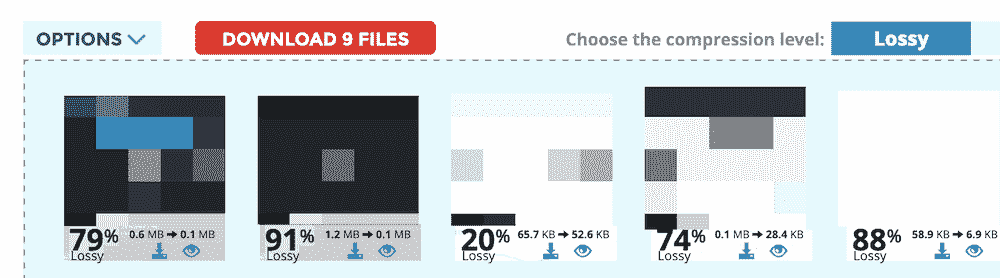
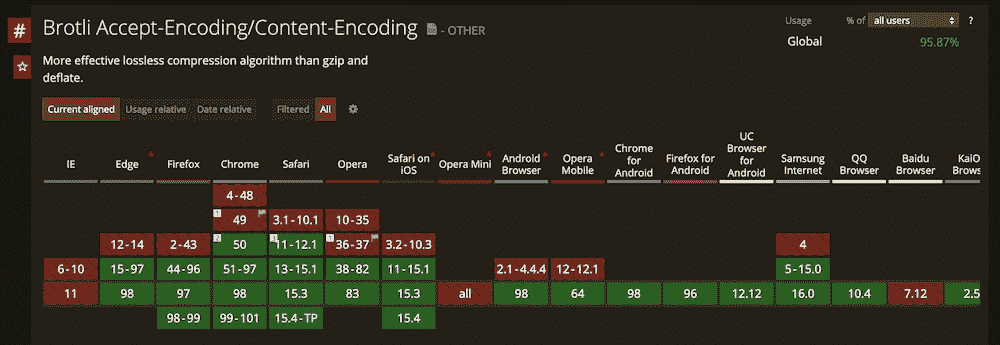
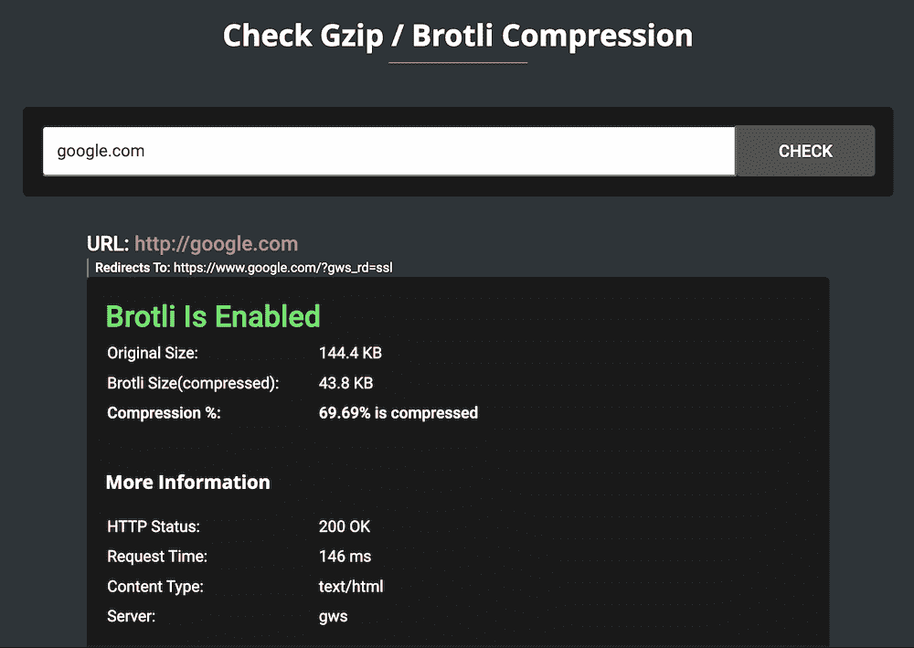
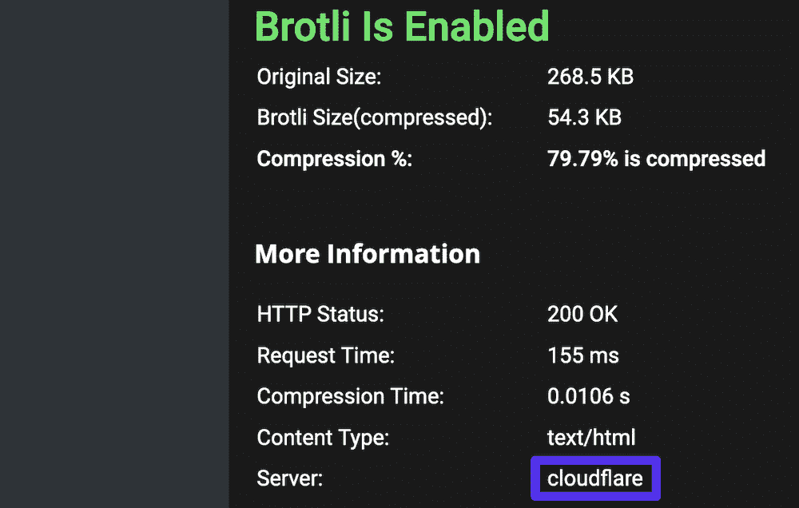
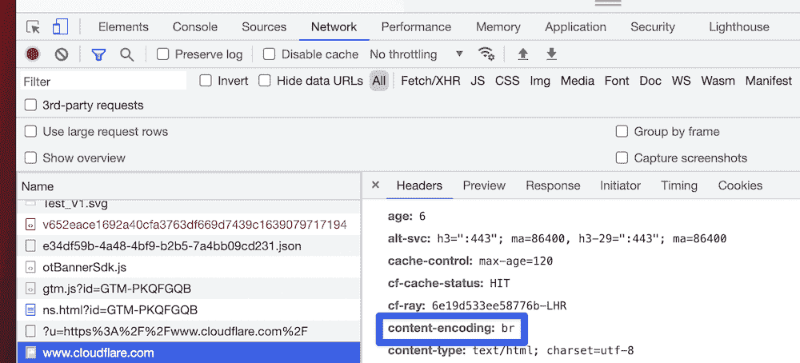
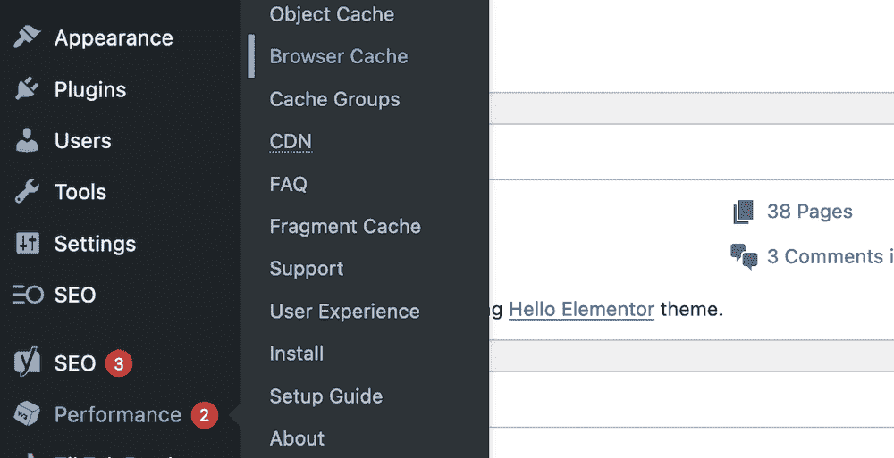
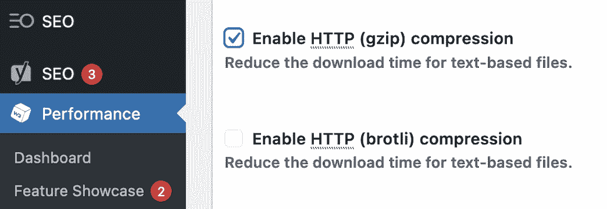

# Brotli 压缩:GZIP 压缩的快速替代方案

> 原文:# t0]https://kinta . com/blog/Bromley-compression/

速度对任何网站都很重要。在 web 对快速加载时间的追求中，我们有许多不同的技术来帮助我们。一种方法是在不影响网站功能的情况下，尽量减少网站使用的底层代码。GZIP 压缩是做到这一点的一种方法，但是 Brotli 压缩是一种替代的羽翼未丰的方法，值得关注。

这是一个由谷歌开发的解决方案，看起来比 GZIP 压缩提供了更多的好处(也是一个替代方案)。本文中的细节将详细介绍该技术提供了什么，但是 Brotli 压缩快速而高效——这符合您研究它所需的所有条件。

### 查看我们的[Brotli 压缩视频指南](https://www.youtube.com/watch?v=nP9U6kHvT5s)


在本教程中，我们将研究 Brotli 压缩，并向您展示如何检查您的站点是否使用它，以及如果需要，如何启用它。首先，我们将把 Brotli 放在压缩算法空间中，并讨论为什么您会希望使用它而不是其他解决方案。

## 网络数据压缩

在其最基本的形式中，数据压缩获取网站或应用程序的代码，并最小化文件大小。这给了你更轻的文件在网络上移动，并且[减少了加载和渲染一个网站的时间](https://kinsta.com/blog/third-party-performance/)。你会发现有很多方法可以压缩数据，这取决于你使用的文件类型。


一种常见的方法是“缩小”这是一个算法从你的站点代码中去除一些多余元素的地方。这个想法是，缩进、注释、空白等方面会增加文件大小，从而增加加载时间。

[Ready to look into Brotli compression and see how to enable it on your own site? 💪 The answers are here 💥Click to Tweet](https://twitter.com/intent/tweet?url=https%3A%2F%2Fkinsta.com%2Fblog%2Fbrotli-compression%2F&via=kinsta&text=Ready+to+look+into+Brotli+compression+and+see+how+to+enable+it+on+your+own+site%3F+%F0%9F%92%AA+The+answers+are+here+%F0%9F%92%A5&hashtags=Brotli%2CSiteSpeed)

在大多数情况下，删除这些元素不会影响用户体验(UX)。然而，对于必须编译和呈现代码的计算机来说,*确实让事情变得更加简单。例如，以这套代码为例:*

```
define( 'WP_INSTALLING', true );

/** Sets up the WordPress Environment. */
require __DIR__ . '/wp-load.php';
require __DIR__ . '/wp-blog-header.php';
if ( ! is_multisite() ) {
  wp_redirect( wp_registration_url() );
  die();
}

$valid_error_codes = array( 'already_active', 'blog_taken' );
```

上面的代码使用了像空格和回车这样的元素来使其可读，但是计算机不需要这些来理解核心代码。更重要的是，这些空白和换行符会占用宝贵的空间，移除它们可以提高性能。

如果您最小化这段代码，它看起来完全不同:

```
define( 'WP_INSTALLING', true ); /** Sets up the WordPress Environment. *
/ require __DIR__ . '/wp-load.php';
require __DIR__ . '/wp-blog-header.php';
if ( ! is_multisite() ) {
  wp_redirect( wp_registration_url() );
  die();
}

$valid_error_codes = array( 'already_active', 'blog_taken' );
```

然而，这段代码的基本功能仍然是一样的。

你会发现其他文件类型也有压缩数据的方法。例如，图像通常需要大量压缩来缩小尺寸，而不会对图像本身造成太大影响:



An example of an optimized image.


[GZIP 压缩](https://kinsta.com/blog/enable-gzip-compression/)是一种最小化文件包大小的标准方法——比如 ZIP 或 Linux `.tar`包。但到目前为止，还没有真正的替代方案。我们稍后将更多地讨论为什么应该存在替代方案，但首先让我们向您介绍 GZIP 的“竞争对手”

## 布罗特利压缩

简而言之，Brotli 是一种数据压缩算法。然而，如果这就是我们要说的全部，就没有理由去调查它。

它提供“无损”压缩，由谷歌在麻省理工学院许可下开发。该公司经常处于网络发展技术的最前沿，所以 Brotli 希望采用 GZIP 的做法，并对其进行改进，为用户和网站提供更好的体验也就不足为奇了。

Brotli 压缩使用与 GZIP 压缩相同的核心基础技术，即:

*   [LZ77 算法](https://cs.stanford.edu/people/eroberts/courses/soco/projects/data-compression/lossless/lz77/index.htm)
*   [霍夫曼编码](https://iq.opengenus.org/huffman-encoding/)和解码

事实上，如果将这两种技术结合起来，就可以得到作为 GZIP 和布罗特利压缩基础的`DEFLATE`格式。在我们关于 [GZIP 压缩](https://kinsta.com/blog/enable-gzip-compression/#what-is-gzip-compression)的帖子中，我们深入探讨了这个问题。

简而言之，作为`DEFLATE`过程的一部分，未压缩文件通过 LZ77 和霍夫曼算法将它们压缩成 Brotli 格式。从那里，一个`INFLATE`进程将在必要时再次解压缩文件。

尽管 Brotli 目前是 GZIP 的主要竞争者，但还有其他类似的技术也在使用`DEFLATE`。下一节，我们将讨论是什么让 Brotli 脱颖而出。

## 布罗特利压缩与 GZIP 压缩

如上所述，布罗特利和 GZIP 都使用`DEFLATE`方法来压缩(和解压缩)数据。这可能会让许多人感到困惑，因为这本身并不能保证切换。

然而，谷歌正在`DEFLATE`的基础上提供增强的技术，并将数据压缩到更大、更快的标准。

### Brotli 如何使用字典改进数据压缩

数据压缩格式的一个技术方面是 Brotli 压缩使用数据字典中现有的已知语言和文本来使用其算法的方式。

开发人员将使用键值对字典来存储数据，因为它高效、灵活且可伸缩。下面是 PHP 字典(称为“数组”)的样子:

```
$cats = get_categories(
  array(
    'taxonomy' => 'link_category',
    'hierarchical' => 0,
    'include' => $link_cat,
  )
);
```

GZIP 不用字典，而布罗特利用两个 T1。

#### 布罗特利静态词典

第一个是通用代码术语的静态(即预定义)字典，用作 HTML、CSS 和 JavaScript 文本的参考。

六种不同的语言中有超过 13，000 个单词，Brotli 将使用这些作为代码中各点的参考。这不是一个精确的类比，但这类似于一个 [WordPress 钩子](https://kinsta.com/blog/wordpress-hooks/)引用一个更大的代码套件的方式。

因此，编码器不必一个字节一个字节地筛选代码。相反，它可以对引用进行操作，从字典中提取定义，然后继续下一个定义。

您还会发现字典中有真实世界的短语，以及不经常压缩的代码。这有助于一些标签如`<HTML>`和参数如`type="text/javascript"`进行一些压缩，给你一些更大的增益。

字典中还有一些“转换”:部分的、不完整的和其他类型的短语，它们带有新的前缀、后缀或大小写，成为一个全新的单词，例如，“Work”转换为“Working”或“html”转换为“HTML”

#### 布罗特利动态词典

动态字典在源代码中解析内容和代码，这对于较小的设备很好，但是对于较大的文件就不太好了。它也被称为“滑动窗口”，大小可达 16 MB。这是压缩算法“缓存”一些最新数据以便引用的地方。它是超动态的，因为它不断变化。

如果将它与大约 32 KB 的 GZIPs 滑动窗口进行比较，您会发现实时解析和压缩的范围非常大。事实上，大多数典型的实践使用大约 4 MB 的 Brotli 滑动窗口，这与竞争算法相比仍然很大。

### 布罗特利压缩与 GZIP 压缩:性能和支持

说到纯用户数量，GZIP 压缩仍然是第一名。然而，Brotli 压缩每天都有更多的用途。这部分是由于主流浏览器的广泛采用；基于 Chromium 的浏览器的兴起也有所帮助。

### 查看我们的视频指南 [Brotli 压缩与 GZIP 压缩的对比](https://www.youtube.com/watch?v=Uiyu3uo4OAE)


[我可以使用……](https://caniuse.com/brotli)网站记录了浏览器采用的技术，并提供了各种历史。该网站指出，目前超过 95%的浏览器使用 Brotli 压缩，包括所有主要版本。



The Can I Use… website showing Brotli adoption.


在我们的 GZIP 压缩文章中，我们[提到了一个基准测试](https://kinsta.com/blog/enable-gzip-compression/#how-good-is-gzip-compression),在该测试中，Brotli 与竞争算法相比具有更好的压缩率，但在压缩和解压缩时间方面落后于竞争算法:


A compression performance comparison between a number of different algorithms (Source: OpenCPU).


然而， [Squash 基准测试](https://quixdb.github.io/squash-benchmark/)展示了一个不同的故事——一个更加微妙的故事。真正的收获是，总的来说，Brotli 比 GZIP 更灵活，压缩比普遍更高。

以下是壁球基准测试结果的总结:

*   Brotli 在每个压缩级别上都有更好的压缩比(即它生成更小的压缩文件)。
*   虽然 GZIP 在大多数时候确实在速度上击败了布罗特利，但你压缩的程度会影响到你将看到的结果。

Paul Calvano 的分析给出了进一步的细节，但关键是 Brotli 需要更多的 CPU 能力来提供更大的文件压缩系数。这在最高和最低压缩级别都有显示。 [Cloudflare 的基准测试](https://blog.cloudflare.com/results-experimenting-brotli/)证实了这一点:文件更小，压缩速度更接近。

另外，考虑到一些测试工具[比如 Pingdom](https://kinsta.com/blog/pingdom-speed-test/) 和一些[内容交付网络(CDNs)](https://kinsta.com/blog/wordpress-cdn/) 还不支持 Brotli。这可能会扭曲其他人收集的关于 Brotli 运营方式的数据。如果您运行测试，您会看到“假阴性”:忽略您使用的文件压缩的较高页面速度数字。

## 注册订阅时事通讯


### 想知道我们是怎么让流量增长超过 1000%的吗？

加入 20，000 多名获得我们每周时事通讯和内部消息的人的行列吧！

[Subscribe Now](#newsletter)

### Brotli 压缩的优势

到目前为止，有很多关于 Brotli 压缩的信息需要考虑。然而，我们可以总结出你需要知道的关于为什么你应该选择布罗特利而不是 GZIP 的信息:

1.  它采用了与 GZIP 相同的技术，并用现代方法进行了改进。
2.  Brotli 基于字典的解析意味着它可以将更多的文件压缩到更深的层次。
3.  虽然与 GZIP 相比，Brotli 需要更多的计算能力，但这意味着文件更小。
4.  在大多数网络主机使用的压缩级别——中等级别，如四级或五级——brot Li 表现得比 GZIP 更好，而且毫不费力。
5.  您会发现 Brotli 几乎支持所有浏览器，如果不是您熟悉的一些基准工具的话。
6.  Brotli 免费使用，开源。如果你使用 Brotli 兼容的 CDN，[比如 Cloudflare](https://kinsta.com/cloudflare-integration/) ，这是一个优势。

值得注意的是 [Cloudflare 在其所有服务器上使用 Brotli 压缩](https://support.cloudflare.com/hc/en-us/articles/200168396-What-will-Cloudflare-compress-)。事实上，它使用了 Brotli 的修改和优化版本，在速度和文件交付方面为您提供了进一步的收益。

 因为 [Kinsta 在所有计划中都提供了 Cloudflare 集成](https://kinsta.com/knowledgebase/cloudflare-integration/)，所以默认情况下每个托管站点都使用 Brotli。这也是为什么 Kinsta 是 T2 市场领先的 T3 和最好的主机服务提供商之一的原因之一。

## 如何检查你的网站是否使用 Brotli 压缩

因为 Brotli 压缩还不是标准的(尽管它已经快实现了)，您可能想知道您的站点是否使用它。有几种方法可以解决这个问题。

### 1.使用在线工具

检查你的网站是否使用 Brotli 压缩的最简单的方法是通过一个在线工具。虽然有几个可供选择，但你会想要一个使用起来既快速又简单的东西，它还会给你一堆关于你的设置的信息。

[速度的礼物](https://www.giftofspeed.com/gzip-test/)是我们检查 Brotli 压缩的选择。



The Gift of Speed website.


它将决定你的网站是否使用 GZIP，Brotli，或根本没有压缩，并提供一些其他指标来帮助你决定下一步该做什么。这些指标提供了重要的见解，因为您不仅仅想要考虑您站点的服务器是否使用了正确的压缩“风格”。

网站由许多元素组成，甚至还有第三方库和依赖项。您可能会选择使用 CDN 为他们提供服务，如果是这样，这也需要使用 Brotli 压缩来获得最佳性能。

如果您使用 Gift Of Speed 来测试单个资产，那么您可以查看一下服务器价值，看看它是如何服务的。



The Gift Of Speed results page for a Cloudflare asset.


所有 Kinsta 站点都使用基于 Cloudflare 的 [Kinsta CDN](https://kinsta.com/help/kinsta-cdn/) 。因此，每个站点也将在整个链和服务器架构中使用 Brotli 压缩。

### 2.使用浏览器的开发工具进行检查

大多数开发者都知道[浏览器提供了一些奇妙的工具](https://kinsta.com/blog/inspect-element/)来帮助你进行各种与网络相关的调查和故障排除。您可以快速检查您的站点(或特定资产)是否使用 Brotli 压缩。

对于所有主流浏览器，如 Brave、Edge、Firefox 或 Chrome，您可以前往**网络** > **所有**屏幕。

首先，您不会看到任何与内容标题相关的内容——您需要从左侧选择一个资产或请求。如果您继续查看并向下滚动列表，您会看到一个面板打开，默认为**标题**信息。

Struggling with downtime and WordPress problems? Kinsta is the hosting solution designed to save you time! [Check out our features](https://kinsta.com/features/)

在这里，向下滚动输出，直到看到`content-encoding: br`行:



Brave’s dev tools, showing that Brotli compression is enabled for the site.


简而言之:如果你看到`content-encoding: br`，这告诉你 Brotli 在那个站点上是活跃的。

## 如何为您的站点启用 Brotli 压缩

在最后几节中，我们将向您展示为您的站点启用 Brotli 压缩的多种不同方法。第一个是我们推荐给大多数不使用 Kinsta 的 WordPress 站点的方法——最后一个是我们推荐给每个阅读第一个方法的*站点的方法！*

### 1.使用 WordPress 插件

几乎每个 WordPress 站点都会使用至少一个插件——通常更多取决于站点需要的功能。[缓存是插件的一个用例](https://kinsta.com/blog/wordpress-caching-plugins/),还有很多。然而，并不是所有的都允许您启用 Brotli 压缩，所以您需要明智地选择，并准备好切换您的首选解决方案。

在您对站点进行任何更改之前，记得[做一个完整的备份](https://kinsta.com/blog/backup-wordpress-site/)，以防以后需要恢复。对于这种方法，我们将使用 [W3 总缓存](https://wordpress.org/plugins/w3-total-cache/)，因为[可以直接找到正确的设置](https://kinsta.com/blog/w3-total-cache/)。

你需要前往 WordPress 内的**性能** > **浏览器缓存**页面:



The W3 Total Cache “Browser Cache: link.


该屏幕显示两种设置。您想要选择的是**启用 HTTP (brotli)压缩**:



Enabling Brotli compression within W3 Total Cache.


然而，这并不适合所有的网站和情况。例如，Kinsta 优化了其服务器，以实现快速、高性能、可靠的托管。因此，有一些你不需要的插件，还有一些甚至被[禁止在 Kinsta 网站上使用](https://kinsta.com/knowledgebase/banned-plugins/)。

在这些情况下，您将需要采取另一种方法。

### 2.在服务器上启用 Brotli

当谈到选择服务器类型时，Nginx 和 Apache 之间的竞争由来已久，目前前者是赢家。无论如何，这两种服务器类型都可以启用 Brotli 压缩，并且每种服务器都有不同的方法。

在研究手动方法之前，您应该知道一些先决条件:

*   您需要了解如何[访问您的特定服务器的配置文件](https://kinsta.com/help/configuration-changes-without-htaccess/)。
*   命令行知识将是有益的，尤其是在 Apache 服务器方面。要运行任何命令，您需要成为拥有`sudo`权限的 root 用户。
*   您可能需要一个[文本编辑器](https://kinsta.com/blog/best-text-editors/)，但是对于像这样的快速修改，您应该没问题。
*   在某些情况下，您需要您的登录凭证作为服务器本身上的[安全外壳(SSH)用户](https://kinsta.com/blog/how-to-use-ssh/)。您可以在您的主机控制面板中找到这些，或者联系支持人员询问。

如果您对手动方法有任何疑问，我们建议您考虑另一种选择，或者向您的主机寻求帮助。无论如何，我们将从 Nginx 开始，依次简要概述每个服务器的流程。

#### Nginx

要在 [Nginx 服务器](https://kinsta.com/knowledgebase/what-is-nginx/)上启用 Brotli 压缩，首先需要找到`nginx.conf`文件。它将是少数几个地点之一:

*   `/usr/local/nginx/conf`
*   `/etc/nginx`
*   `/usr/local/etc/nginx`

打开文件后，在底部添加以下内容:

```
brotli on;
brotli_static on;
brotli_comp_level 9; # You can change this from 1–11\. 4–9 offers good performance balance.
brotli_types text/plain text/css application/javascript application/json image/svg+xml application/xml+rss;
```

这个套件将打开 Brotli 并使用它来服务静态文件。`brotli_comp_level`设置是一个您可以根据您的使用情况和需求进行更改的设置。较高的数字提供了更好的压缩平衡与较低的网站性能。

#### 街头流氓

因为 Apache 在配置方面非常灵活，所以您可以轻松地启用 Brotli 压缩。

为此，请按照下列步骤操作:

1.  使用命令提示符或终端应用程序，以 root `sudo`用户的身份登录到您的服务器。
2.  运行`a2enmod brotli`命令打开压缩。
3.  在 Apache VirtualHost 或您的服务器配置中，添加`AddOutputFilterByType BROTLI_COMPRESS text/html text/plain text/xml text/css text/javascript application/javascript`行来设置您想要压缩的正确文件类型。

虽然 Apache 不支持静态压缩，但是您可以使用`BrotliCompressionQuality LEVEL-NUMBER` 行来更改 Brotli 压缩的级别。但是，您需要将“级别编号”占位符替换为 1-11 之间的数字。

### 3.使用支持的 Web 主机

为您的站点启用 Brotli 压缩的最直接的方法是确保您的主机默认这样做。由于与 Cloudflare 的 CDN 集成，Kinsta 将 Brotli 压缩作为标准配置。


Cloudflare’s CDN page.


 在所有计划中， [Kinsta CDN](https://kinsta.com/help/kinsta-cdn/) 由 [Cloudflare 的基础设施](https://kinsta.com/feature-updates/kinsta-cdn-cloudflare/)提供支持，因此每个站点都使用 Brotli 压缩，而无需您启用它。

您需要检查您选择的主机是否提供 Brotli 压缩，以及需要配置到什么级别。为了运行最高效、最稳定、最安全的网站，[良好的托管是必不可少的](https://kinsta.com/blog/cheap-wordpress-hosting/)。

[Learn how to check if your site uses Brotli compression, how to enable it (if you need to!) and explore why you’d want to use it over other solutions. 🚀Click to Tweet](https://twitter.com/intent/tweet?url=https%3A%2F%2Fkinsta.com%2Fblog%2Fbrotli-compression%2F&via=kinsta&text=Learn+how+to+check+if+your+site+uses+Brotli+compression%2C+how+to+enable+it+%28if+you+need+to%21%29+and+explore+why+you%E2%80%99d+want+to+use+it+over+other+solutions.+%F0%9F%9A%80&hashtags=Brotli%2CSiteSpeed)

## 摘要

数据压缩是开发和使用现代网络的必要组成部分。由于你用来拼凑一个网站的文件类型丰富而复杂，文件大小可能会激增。它们都需要某种形式的压缩。

到目前为止，典型的方法一直是 GZIP，但现在有了一个新成员。

Brotli compression 将其技术建立在与 GZIP 相同的基础上，但包括一些性能增强的好处。正如我们所讨论的，它使用上下文映射来更快地处理压缩请求，并使用一个使用动态填充的字典。这比 GZIP 所能提供的要大得多，也让移动用户从压缩中受益。

好消息是，由于我们的[独特的 Cloudflare 集成](https://kinsta.com/help/kinsta-cdn/)，每个 Kinsta 站点都可以从 Brotli 压缩中受益。这意味着你的 Kinsta 托管的网站比使用 GZIP 的竞争对手更快，在较小的设备上可以快速加载。

*你对 Brotli 压缩有什么疑问吗？欢迎在下面的评论区提问！*

* * *

让你所有的[应用程序](https://kinsta.com/application-hosting/)、[数据库](https://kinsta.com/database-hosting/)和 [WordPress 网站](https://kinsta.com/wordpress-hosting/)在线并在一个屋檐下。我们功能丰富的高性能云平台包括:

*   在 MyKinsta 仪表盘中轻松设置和管理
*   24/7 专家支持
*   最好的谷歌云平台硬件和网络，由 Kubernetes 提供最大的可扩展性
*   面向速度和安全性的企业级 Cloudflare 集成
*   全球受众覆盖全球多达 35 个数据中心和 275 多个 pop

在第一个月使用托管的[应用程序或托管](https://kinsta.com/application-hosting/)的[数据库，您可以享受 20 美元的优惠，亲自测试一下。探索我们的](https://kinsta.com/database-hosting/)[计划](https://kinsta.com/plans/)或[与销售人员交谈](https://kinsta.com/contact-us/)以找到最适合您的方式。