# 22 个 Gmail 插件和扩展，提高您的电子邮件工作效率

> 原文:# t0]https://kinta . com/blog/Gmail-add-ons/

美国工人平均每周花 28%的时间阅读、回复和发送电子邮件。如果你和普通员工一样，你每周会花超过 10 个小时查看你的电子邮件收件箱。并不是所有的这些时间都是直接有效的，因为很大一部分时间可能都花在了试图弄清楚哪些任务应该优先处理上。

由于 Gmail 是一个强大的工具，有很多方法可以提高你的电子邮件效率并减少时间。

在本帖中，我们将仔细看看能帮助你实现这一目标的最好的 Gmail 插件和 Gmail 扩展。

准备好了吗？我们开始吧！

## Google Workspace market place vs Chrome 网络商店

在深入实际列表之前，我们先解释一下术语。

有两个地方可以扩展 Gmail 的功能:Google Workspace Marketplace 和 Chrome 网络商店。

[谷歌工作区市场](https://workspace.google.com/marketplace)提供直接与后端[谷歌工作区应用](https://kinsta.com/blog/google-workspace/)集成的附加组件。它们与服务器端的应用程序整合在一起，比如 Docs(你甚至可以[将其导入 WordPress](https://kinsta.com/blog/google-docs-to-wordpress/) )、Sheets 或 Gmail。您可以在这里找到 Gmail 插件。

> 需要在这里大声喊出来。Kinsta 太神奇了，我用它做我的个人网站。支持是迅速和杰出的，他们的服务器是 WordPress 最快的。
> 
> <footer class="wp-block-kinsta-client-quote__footer">
> 
> 
> 
> <cite class="wp-block-kinsta-client-quote__cite">Phillip Stemann</cite></footer>

[View plans](https://kinsta.com/plans/)

另一方面，Chrome 网络商店提供了扩展谷歌 Chrome 网络浏览器功能的扩展。从[广告拦截器](https://kinsta.com/blog/ad-blockers/)，待办事项列表，到 Gmail 相关工具和应用。在这里，你会发现，除其他外，Gmail 扩展。

## 什么是 Gmail 扩展？

Gmail 扩展是 Google Chrome 的一个扩展，它会直接影响您的 Gmail 仪表板/帐户的布局/功能。正如你刚刚看到的，你可以在 Chrome 网上商店中找到许多可用的扩展。

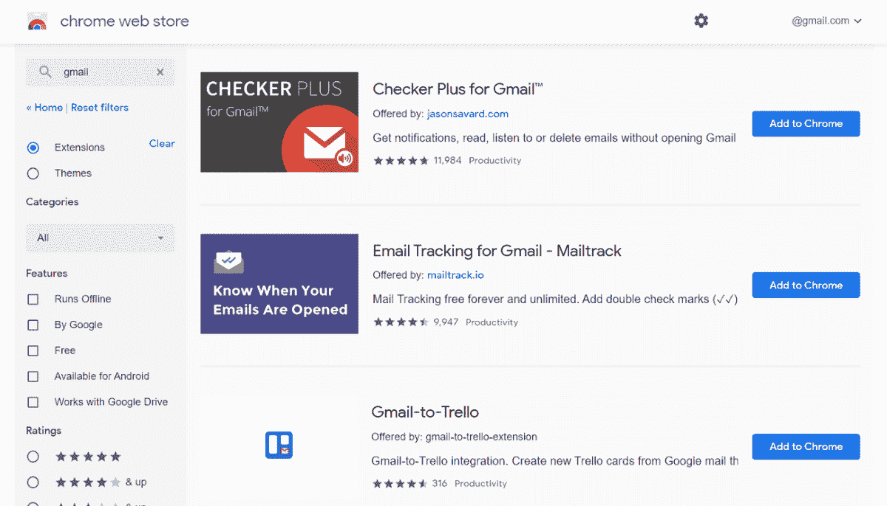

Gmail search in Chrome Web Store

其他的只能通过开发该应用的公司的网站获得。

### 如何添加 Gmail 扩展？

添加 Gmail 扩展就像在网络商店中找到你想要的扩展并点击“添加到 Chrome”按钮一样简单。

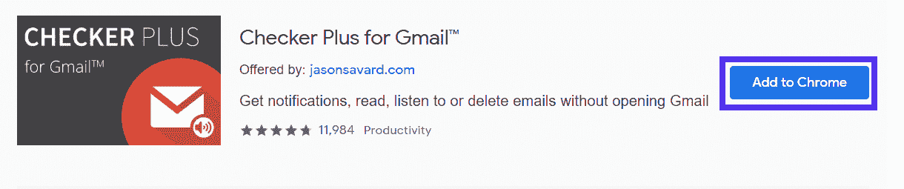

Add to Chrome button

然后在出现提示时单击“添加扩展”按钮进行确认。

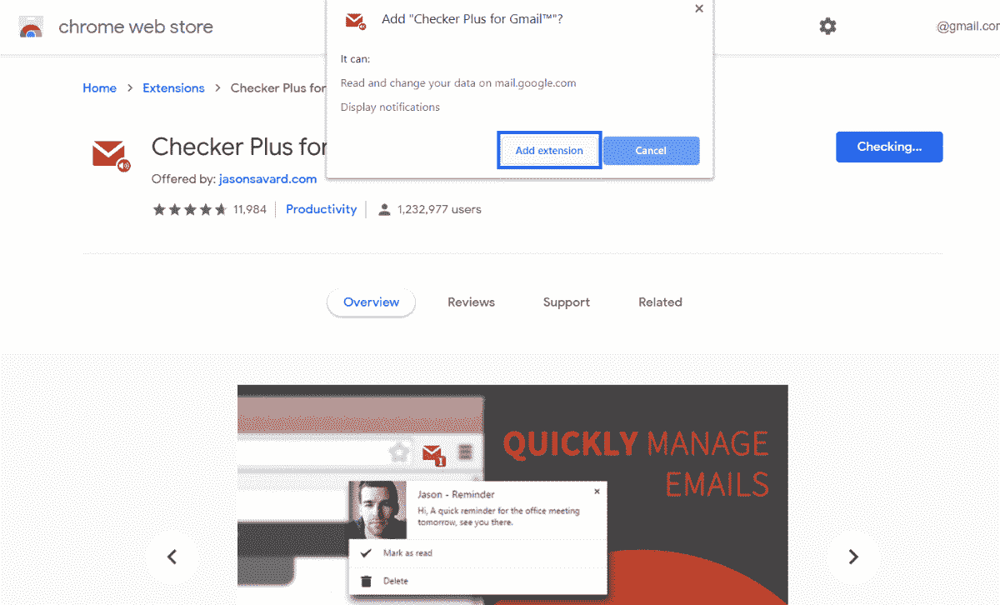

Extension install confirmation prompt

您现在已经成功地将 Gmail 扩展添加到您的 Chrome 浏览器中。你应该可以看到它出现在你的工具栏的右上角。

### 如何删除 Gmail 扩展？

您可以在管理所有扩展的同一界面中管理所有与 Gmail 相关的 Chrome 扩展:在扩展仪表板中。

在地址栏中输入“chrome://extensions/”并按回车键或打开菜单，悬停“更多工具”并选择“扩展”。

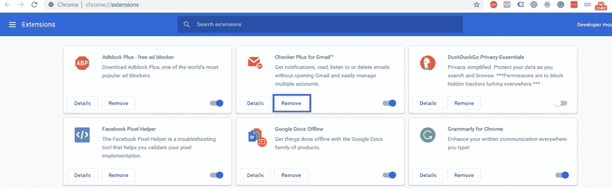

Google Chrome extension options

从这里，你所要做的就是点击“删除”，你可以删除任何你不再需要的扩展。

### Gmail 扩展安全吗？

由于谷歌没有发布所有的 Chrome 扩展，他们没有声称对任何安全问题负责或拥有所有权。因为它们是第三方应用程序，所以可能存在的任何风险都由您承担。

这并不意味着所有的扩展都是不安全的，但这意味着您在安装一个扩展时应该谨慎一些。在 2018 年的后门丑闻之后，谷歌决定升级游戏，[对其扩展开发者提出了更严格的要求。](https://www.wired.com/story/google-chrome-extensions-security-changes/)

例如，扩展不再要求访问不相关的个人数据。通常你不想成为第一个尝试新扩展的人。寻找具有积极真实的人类反馈的已建立的扩展。寻找合法公司或公开存在的开发者发布的扩展。

如果有人不愿意要求扩展的所有权，他们可能会担心未来的影响。

## 什么是 Gmail 插件？

Gmail 附加组件与扩展类似，都是为了扩展 Gmail 的功能而创建的。扩展和附加组件的区别在于，附加组件安装在你的 Google Workspace 应用中，而不是浏览器中。

记住:附加组件可以在 Google Workspace Marketplace 中找到。

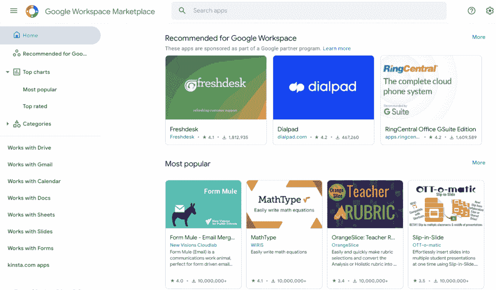

### 如何添加 Gmail 插件？

要添加 Gmail 插件，请转到 Google Workspace Marketplace 并单击您要安装的插件。它会把你带到那个特定应用的页面。

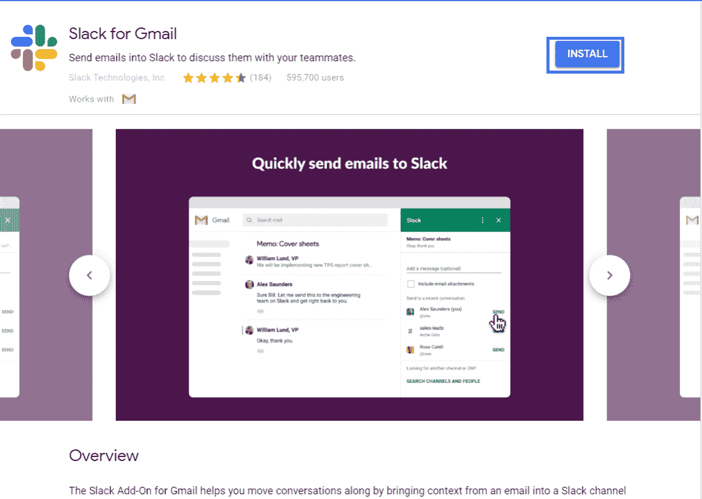

Click the install button to add Add-on to Gmail

从这里，你需要做的就是点击安装。然后确认它，并验证您的谷歌帐户凭证。

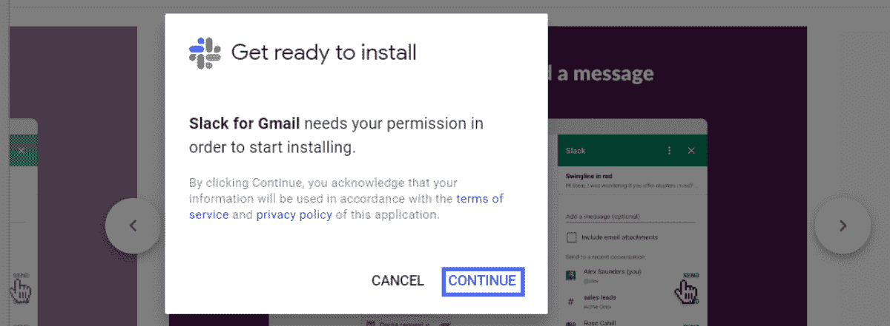

Gmail add-on Installation confirmation prompt

最后，单击“允许”按钮。

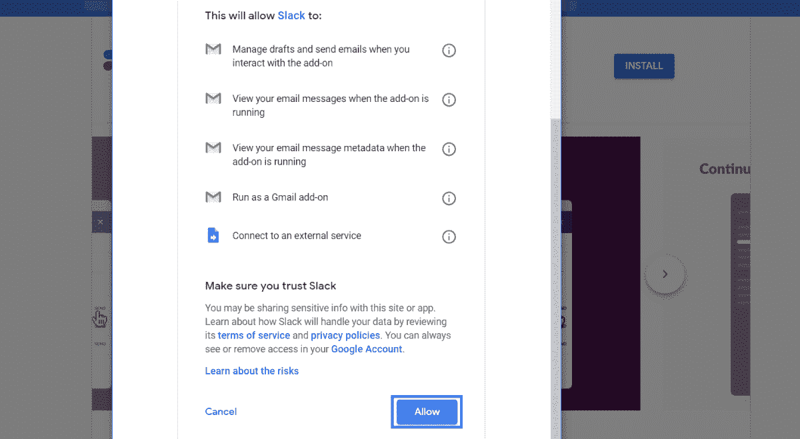

Granting permission to your Gmail add-on

简单吧？只需几次点击和一次登录，您就可以在收件箱中添加额外的功能。

### 如何删除 Gmail 插件？

您可以从 Google Workspace Marketplace 的[“管理应用程序”部分](https://gsuite.google.com/marketplace/myapps)管理您所有的 Google Workspace 插件，也就是您的 Gmail 插件。

要删除一个，悬停菜单按钮，然后选择“卸载”

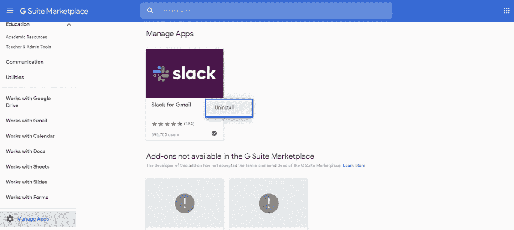

Google Workspace Marketplace “Manage Apps” section

这次是轻轻一点。至少可以说这不是一个非常复杂的过程。

现在我们已经了解了 Gmail 插件和扩展的所有细节，让我们来看看我们认为最强大的插件和扩展吧！

## 22 个最佳 Gmail 插件和扩展，提高您的工作效率

我们在 Kinsta 的团队已经聚在一起，并比较了笔记，我们已经得到了 20 多个我们喜欢的 Google 插件和扩展。

### 1.格梅利斯

Gmelius

Gmelius 是 Gmail 的扩展，相当于一把瑞士军刀。它可以做任何其他扩展可以做的事情，至少也是一样。一些人可能会担心，要将它作为成熟的[项目管理和协作工具](https://kinsta.com/blog/wordpress-project-management-plugins/)，你需要付费订阅。A plus 订阅费用为每月 9 美元，但您可以尝试免费试用。

#### 主要特征

*   电子邮件模板。
*   电子邮件跟踪。
*   电子邮件自动化和流程。
*   共享收件箱。

#### 对...有用

*   需要快速工作和[远程协作的初创公司和团队](https://kinsta.com/blog/working-remotely/)。
*   用电子邮件做大量工作的自由职业者。
*   依赖冷邮件的销售人员。

### 2.Gmail 的右侧收件箱

Right Inbox for Gmail

【Gmail 右侧收件箱允许您在收件箱中设置提醒和任务。您还可以安排稍后发送电子邮件，甚至创建自动跟进。它还允许你创建、保存和粘贴各种不同的[电子邮件签名](https://kinsta.com/blog/email-signature/)。

每月最多 10 封邮件免费。除此之外，无限电子邮件的订阅费用为每月 7.95 美元。

#### 主要特征

*   设置提醒，在特定时间回复邮件。
*   安排稍后发送电子邮件。
*   创建自动跟进。
*   保存并粘贴大量签名。

#### 对...有用

*   严重依赖电子邮件进行交流的专业人士。
*   销售人员。

### 3.回旋镖

Boomerang for Gmail

回旋镖是另一个伟大的 Gmail 扩展。这是一个电子邮件拓展生产力工具，并不试图成为任何不是它的东西(查看我们的指南[如何找到任何人的电子邮件地址](https://kinsta.com/blog/find-email-address/))。

迄今为止最酷的功能是帮助你写更好的电子邮件的人工智能。Boomerang 每月最多可免费发送 10 封电子邮件，无限量计划每月 4.99 美元起。

#### 主要特征

*   群发邮件。
*   各种情况下的电子邮件模板。
*   人工智能辅助电子邮件写作。

#### 对...有用

*   在工作中依赖冷邮件的销售人员和 SEO。
*   需要写专业、提示邮件的客户经理。

### 4.缩放 Gmail

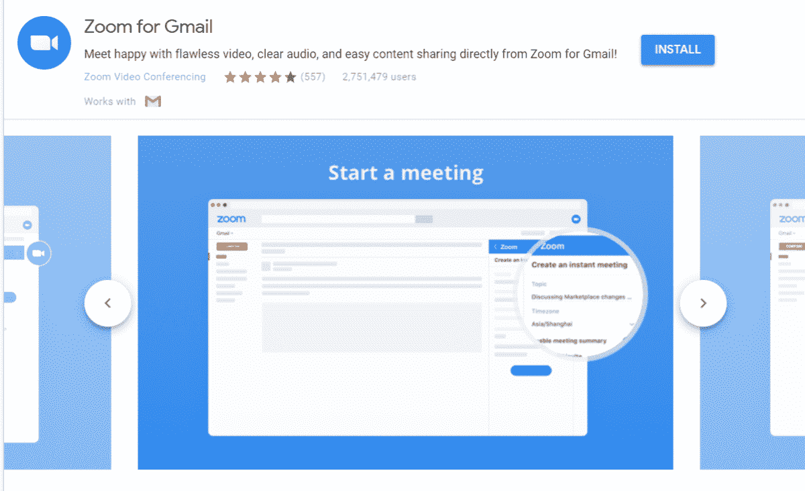

Zoom for Gmail add-on

[Zoom for Gmail](https://gsuite.google.com/marketplace/app/zoom_for_gmail/585972765488) 是一个附加组件，可以让您在 Gmail 界面中开始缩放会议。您还可以从收件箱中查看即将召开的电话、会议、网络研讨会和会议的日程安排。它需要缩放帐户才能工作。

#### 主要特征

*   Gmail 中高质量、可靠的视频会议。
*   查看您的日程表，了解即将到来的 Zoom 电话。
*   从收件箱中即时与同事进行视频通话。

#### 对...有用

*   喜欢通过视频通话而不是基于文本的电子邮件进行协作的人。
*   需要跟踪 Zoom 网络研讨会和会议的员工。

### 5.Gmail 的 Slack

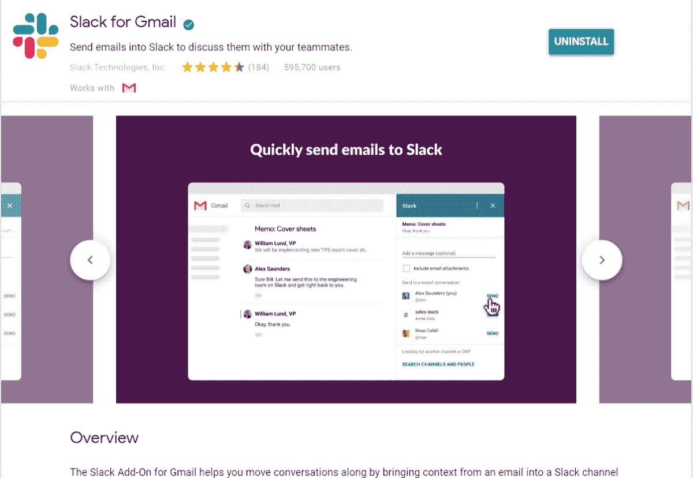

Slack for Gmail add-on

你是否卡在两个时代的内部沟通之间？你和只使用 Slack 的同事和只使用 Gmail 的同事打交道吗？

如果是的话，这就是适合你的 Gmail 插件。Gmail 的 Slack】名副其实。它使你能够发送电子邮件给 Slack。您还可以包含附件，这些附件将自动上传到正确的频道/私人消息中。能够在不离开收件箱的情况下快速发送消息是一个救命稻草。

#### 主要特征

*   从您的 [Gmail 收件箱](https://kinsta.com/blog/gmail-search-operators/)中向 Slack 发送邮件。

#### 对...有用

*   那些严重依赖 Slack 和电子邮件进行工作交流的人。

你是一个懒散的用户吗？一定要看看这个:[如何在 2020 年使用 Slack(奖金:18 个鲜为人知的黑客来完成更多工作)](https://kinsta.com/blog/how-to-use-slack/)。

在 Slack 和微软团队之间无法抉择？在这里阅读我们的比较: [Slack vs Teams](https://kinsta.com/blog/microsoft-teams-vs-slack/)

### 6.Gmail 文档设计

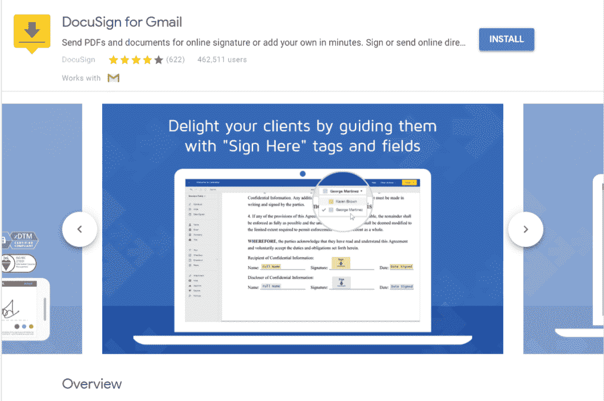

DocuSign for Gmail add-on

你是否在咨询、营销、法律或任何其他行业工作，在这些行业中，你需要不断地发送文件以获得签署？

你是否厌倦了人们花费宝贵的时间手动打印、签署和扫描你的文档？ [DocuSign for Gmail](https://chrome.google.com/webstore/detail/docusign-%E2%80%93-electronic-sig/blkboeaihdlecgdjjgkcabbacndbjibc) 允许您直接从收件箱发送可签名的文档。

您还可以选择多个模板并发送提醒。请注意，您需要一个 DocuSign 帐户才能使用此扩展，计划起价为每月 10 美元。

#### 主要特征

*   从 Gmail 内向您的客户发送可签名的文档。
*   从 Chrome 中访问文档模板。
*   签名是独一无二的，具有法律约束力。
*   所有数据都安全地加密在他们的服务器上。
*   无需离开收件箱即可发送提醒。

#### 对...有用

*   那些受雇于咨询或法律行业的人。
*   每天多次处理合同(如自由开发人员)或其他法律文件的人。

### 7.Gmail 邮件跟踪

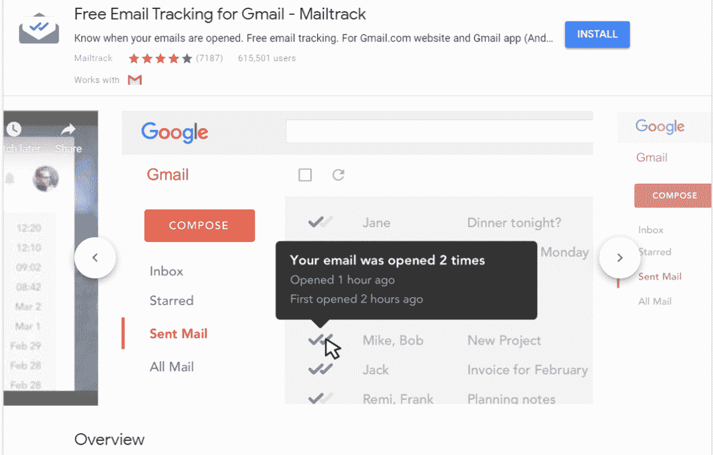

Mailtrack for Gmail extension

你有没有想过一封邮件发出后会发生什么？ [Mailtrack for Gmail](https://chrome.google.com/webstore/detail/email-tracking-for-gmail/ndnaehgpjlnokgebbaldlmgkapkpjkkb?hl=en) 使用了一个兼容 Gmail 的跟踪脚本，可以显示它是否被打开过。这对那些在面对客户或潜在客户的岗位上工作的人是有益的。

这种 Gmail 扩展为您提供实时通知，您甚至可以在自定义仪表板中查看所有活动的明细。扩展是 100%免费和无限制的。

#### 主要特征

*   跟踪您的电子邮件是否被打开。
*   每当有人打开您的电子邮件时，都会收到实时通知。
*   查看您跟踪的邮件的最近活动明细。

#### 对...有用

*   主要使用电子邮件的销售人员。
*   SEO 和 [B2B 营销人员](https://kinsta.com/blog/b2b-lead-generation/)。
*   客户经理。
*   客户成功代理。

### 8.Gmail 智能表

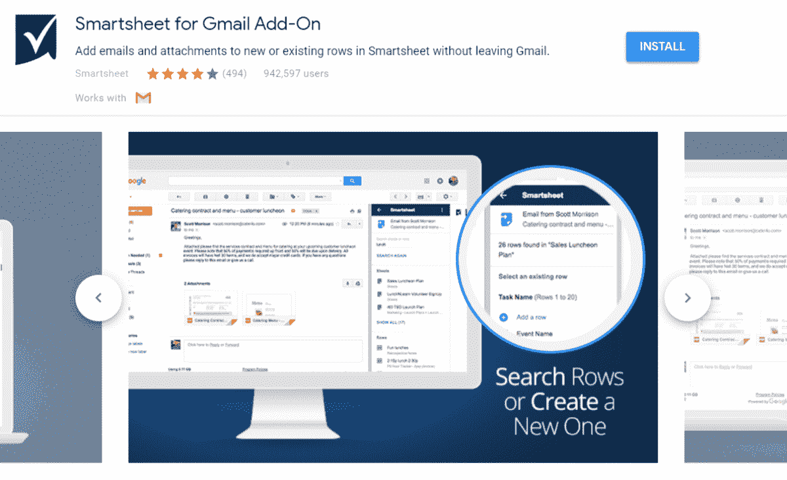

Smartsheet for Gmail add-on

如果您的企业使用 Smartsheet，这个附加组件将帮助您在收件箱中完成工作。Gmail 插件的 [Smartsheet 让您无需离开 Gmail 即可搜索和创建行。](https://gsuite.google.com/marketplace/app/smartsheet_for_gmail_addon/760724917556)

#### 主要特征

*   撰写电子邮件时搜索智能表行。
*   阅读邮件后，使用任务/待办事项/见解创建新行。

#### 对...有用

*   智能工作表用户。

### 9.Evernote

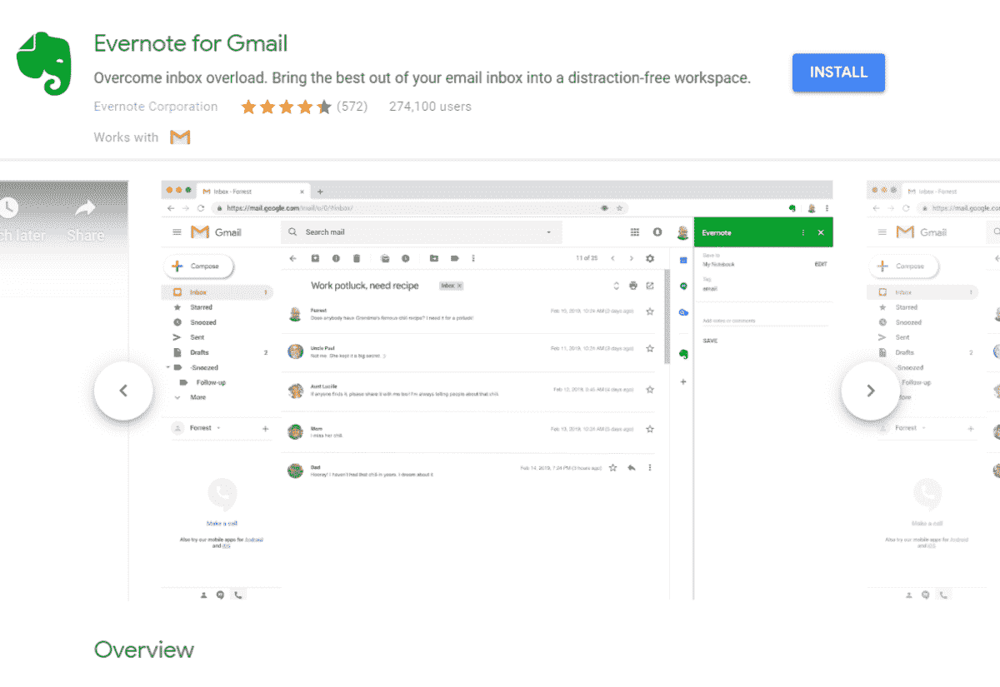

Evernote for Gmail add-on

你已经在使用和喜爱 Evernote 了吗？如果你还不知道他们的 Gmail 插件，你将会收获更多。

## 注册订阅时事通讯

### 想知道我们是怎么让流量增长超过 1000%的吗？

加入 20，000 多名获得我们每周时事通讯和内部消息的人的行列吧！

[Subscribe Now](#newsletter)

有了它，你可以轻松地保存整个电子邮件对话，或单封电子邮件，只需点击几下。不幸的是，和桌面应用程序一样，这里没有拖放功能。你需要一个 Evernote 帐户来使用这个插件。

免费账户包含了你在内容保存系统中所希望的大部分功能。

#### 主要特征

*   将全部或部分电子邮件保存到您的 Evernote 帐户。
*   从仪表板中更新待办事项列表。

#### 对...有用

*   Evernote 用户。
*   通过电子邮件获得大量有价值信息/反馈的销售人员、营销人员或创意人员。

### 10.Trello for Gmail

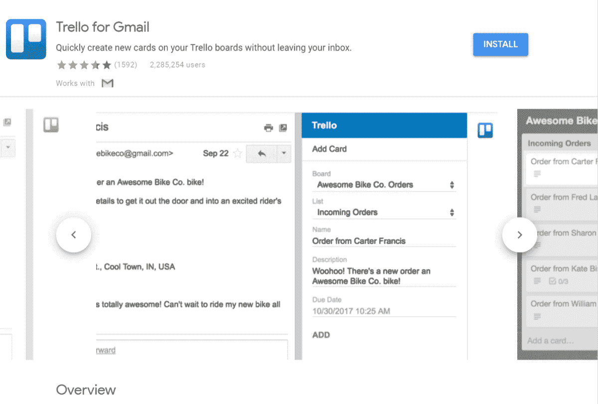

Trello for Gmail add-on

Trello for Gmail 是一个简单的 Gmail 插件，专注于一件事:让你不用离开收件箱就可以在你的板上快速创建新卡片。您可以将其分配到不同的公告板/列表，并设置截止日期。

要使用该插件，您需要成为 Trello 用户。有一个适合小企业的免费计划。

#### 主要特征

*   从您的 Gmail 收件箱中创建新卡片。
*   卡片上有完整的截止日期、清单和描述。
*   自动将电子邮件内容添加到卡片描述中。

#### 对...有用

*   特雷罗的超级用户。

### 11.Gmail 体位法

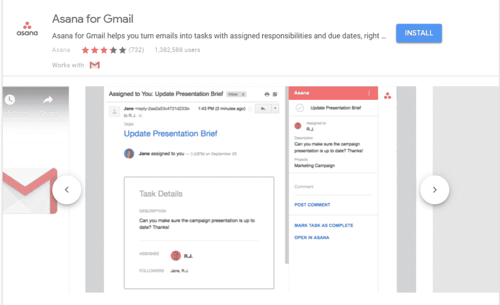

Asana for Gmail add-on

用于 Gmail 的 Asana 与上面的 Trello 插件做同样的事情，但是是针对 Asana 用户的。此外，您还可以在收件箱中搜索项目/团队/任务。

#### 主要特征

*   添加和分配新的体式卡，并注明到期日期。
*   自动将电子邮件内容添加到卡片描述中。

#### 对...有用

*   Asana 用户。

建议阅读:[特雷罗 vs 阿萨纳](https://kinsta.com/blog/trello-vs-asana/)。
T3】

### 12.Wrike for Gmail

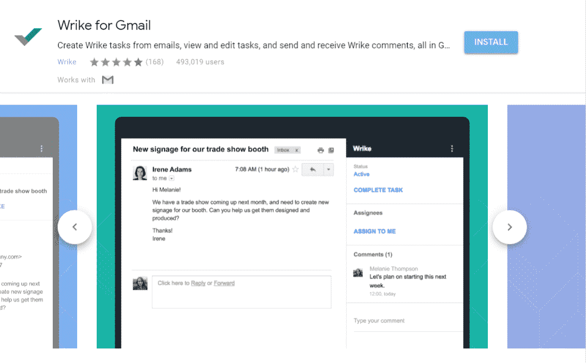

Wrike for Gmail add-on

类似于上面的两个 Gmail 插件，只不过这次是针对 [Wrike 用户](https://www.wrike.com/apps/email-integration/wrike-for-gmail/)的。不仅仅是允许你创建新的任务，这个插件与 Wrike 完全同步。因此，您可以在收件箱中查看与电子邮件相关的任务，查看 Wrike 的个人资料图片等。

你必须是 Wrike 用户才能使用这个插件。有一个最多 5 个用户的基本免费计划，但专业许可证的起价为 9.80 美元/月。

#### 主要特征

*   从收件箱中创建任务。
*   任务会自动在描述中包含电子邮件内容。
*   查看与特定电子邮件相关的任务。
*   跟踪和报告来自电子邮件的工作。

#### 对...有用

*   Wrike 用户。

### 13.Checker Plus

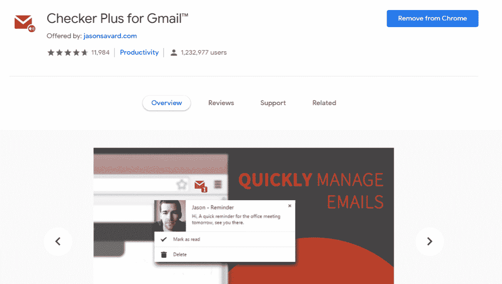

Checker Plus for Gmail

你需要在电子邮件到达收件箱的第一时间收到通知吗？如果我告诉你，你再也不用打开 Gmail 标签页了，会怎么样？使用 Gmail 的 [Checker Plus，您可以到达那个“应许之地”。](https://chrome.google.com/webstore/detail/checker-plus-for-gmail/oeopbcgkkoapgobdbedcemjljbihmemj?hl=en)

这个 Gmail 扩展会自动检查新邮件，并在新邮件到达时通知您。你可以选择阅读邮件、存档或立即删除。

厌倦了体验你的 WordPress 网站的问题？通过 Kinsta 获得最好、最快的主机支持！[查看我们的计划](https://kinsta.com/plans/?in-article-cta)

#### 主要特征

*   不用打开 Gmail 就能收到新邮件通知。
*   在完成其他任务的同时，浏览、阅读和归档电子邮件。

#### 对...有用

*   快节奏环境中的员工。

### 14.Gmail 的 MeisterTask

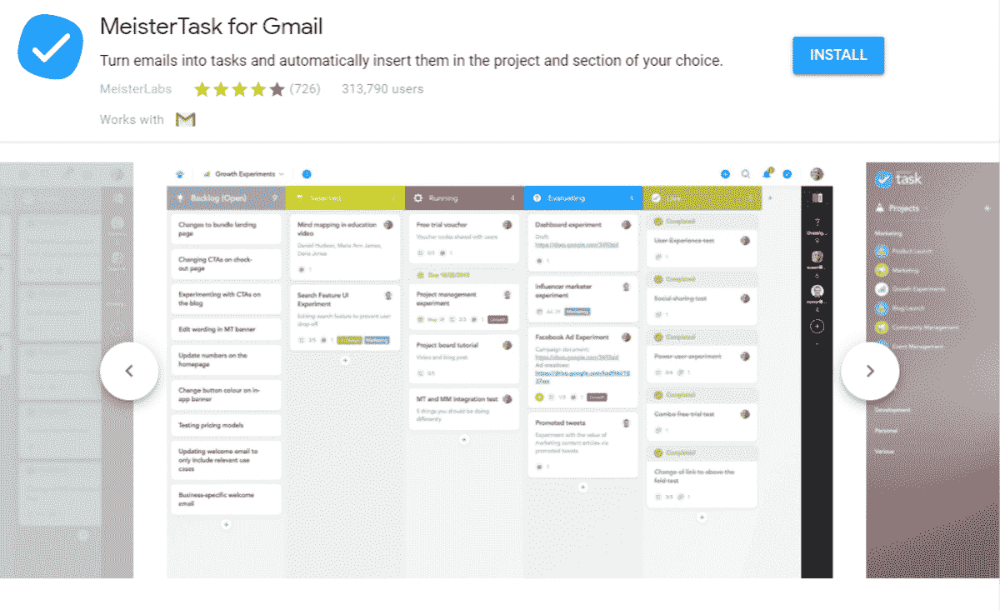

MeisterTask for Gmail add-on

对于那些将收件箱作为任务管理工具的人来说，另一个很好的选择是 Gmail 的 MeisterTask，它将你的收件箱与你的 Meister 账户连接起来。您可以在收件箱中创建新任务，并轻松访问任务板。

请注意，该 Gmail 插件需要一个 MeisterTask 帐户。他们提供一个免费的“基本”计划，有无限的任务、项目和合作者。付费计划的起价为每个用户每月 7.50 美元，它提供了无限的集成、自动化和更好的报告。

#### 主要特征

*   从收件箱中创建新任务。
*   管理项目板

#### 对...有用

*   MeisterTask 用户

### 15.准备好使用 Gmail 时的收件箱

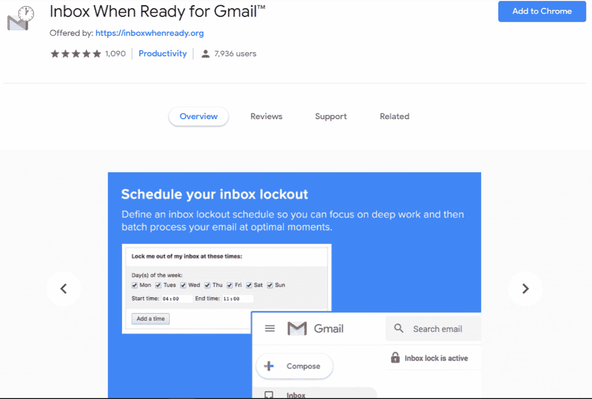

Inbox When Ready Gmail extension

[收件箱准备就绪](https://chrome.google.com/webstore/detail/inbox-when-ready-for-gmai/cdedhgmbfjhobfnphaoihdfmnjidcpim?q=gmail)做一件事，而且做得很好。它锁定你的收件箱一段时间。它让你专注于写邮件或阅读你已经收到的重要邮件。

免费计划在激活时会留下电子邮件签名。专业计划费用为每月 4 美元，按年计费。

#### 主要特征

*   锁定收件箱，这样就不会显示新邮件，也不会收到通知。
*   提前安排锁定时间。
*   在设定的时间后自动隐藏收件箱。
*   为你查看收件箱的次数设定预算。

#### 对...有用

*   那些容易分心的人。
*   致力于深度工作的员工。

### 16.简单的 Gmail 笔记

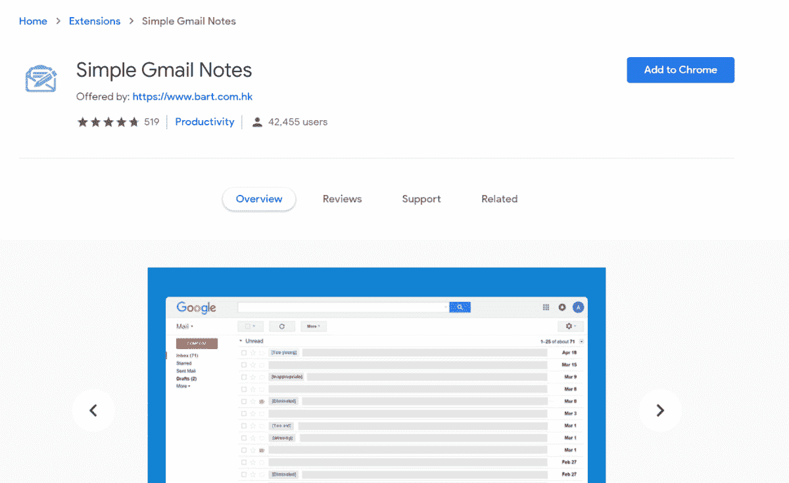

Simple Gmail notes Gmail extension

简单的 Gmail 笔记是一个名副其实的 Gmail 扩展:它允许你在邮件中添加简单的笔记。它可以通过提供有用的信息在最佳时间跟进，或者只是给你一些背景信息，帮助你快速找到返回特定电子邮件的方法。它是 100%免费和开源的。

#### 主要特征

*   向收件箱中的电子邮件添加注释。
*   把这些笔记保存到你自己的谷歌硬盘上。
*   支持[多个 Gmail 账户](https://kinsta.com/blog/multiple-gmail-accounts/)。

#### 对...有用

*   有组织的人。
*   销售、营销和服务专业人员。

### 17.Gmail 的 Giphy

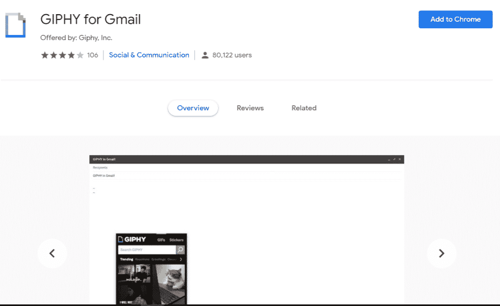

Giphy for Gmail extension

现在是 2022 年，gif 已经侵入了所有可能的在线交流媒介。为什么你要把它藏在你的邮件里？谢天谢地，Gmail 扩展的 Giphy 是完全免费的。

#### 主要特征

*   皮斯吉格斯。
*   搞笑 gif。
*   吓人的 gif。
*   悲伤的 gif。

#### 对...有用

*   Gif 爱好者。

### 18.FlowCrypt Gmail 加密

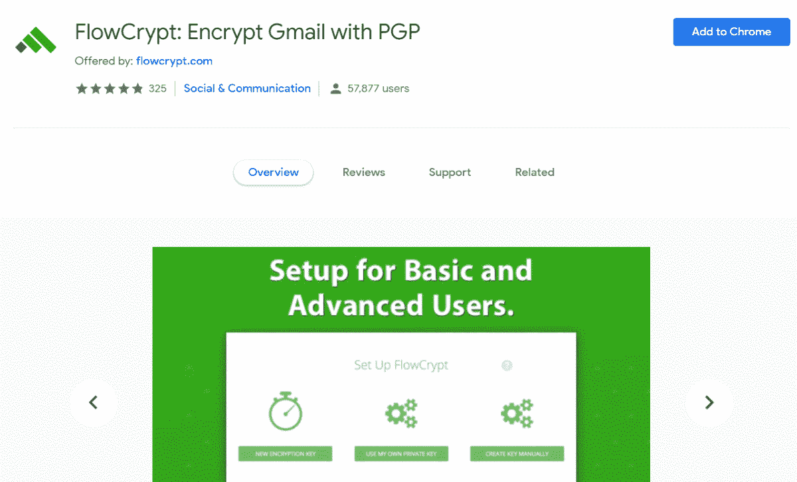

FlowCrypt Gmail extension

虽然 Gmail 有一个内置的功能来发送[机密邮件](https://support.google.com/mail/answer/7674059?co=GENIE.Platform%3DDesktop&hl=en)，但可能会有这样的情况，单独的选项似乎不够安全，你想加密你的邮件。或者，您可能担心邮件被拦截和阅读。

使用 [FlowCrypt Gmail 扩展](https://chrome.google.com/webstore/detail/flowcrypt-encrypt-gmail-w/bnjglocicdkmhmoohhfkfkbbkejdhdgc?hl=en)，您可以使用 PGP 加密来加密您发送的所有电子邮件。

#### 主要特征

*   用 PGP 加密你的电子邮件。

#### 对...有用

*   需要通过电子邮件发送敏感信息的人。
*   网络安全爱好者。

### 19.为 Gmail 数字化

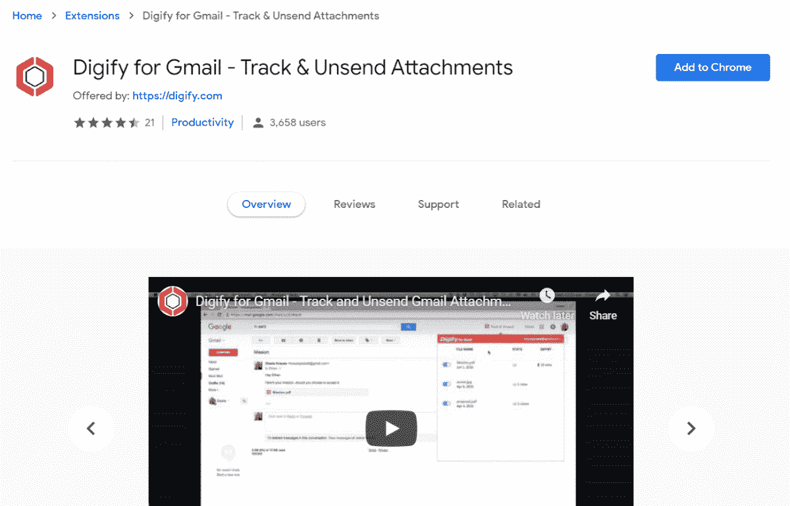

Digify for Gmail extension

Digify for Gmail 是一个 Gmail 扩展，可以让你跟踪、取消发送附件，并设置自毁程序。如果您每天都要发送重要或敏感的文档，这是您的最佳选择。您不需要 Digify 帐户即可使用此扩展。

#### 主要特征

*   跟踪附件以查看谁访问了它们。
*   取消发送给错误的人的附件。
*   将附件编程为自毁(想想 Snapchat)。

#### 对...有用

*   自由职业者和专业人士，他们想让别人预览他们的作品，但不想窃取。

### 20.语法上

Grammarly extension

Chrome 的语法将帮助你在 Gmail 中实时纠正你的[语法和拼写错误](https://kinsta.com/blog/grammar-checker-tools/)。它还会建议不基于严格语法规则的改进。你可以通过免费的语法帐户使用它。

#### 主要特征

*   纠正你的语法和拼写错误。
*   建议改进句子的方法。

#### 对...有用

*   任何写邮件的人。

### 21.Gmail 多转发

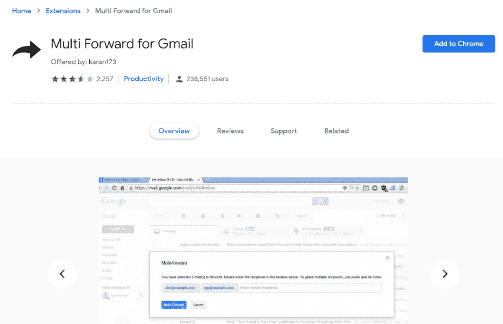

Multi Forward for Gmail

如果你公司的主要沟通渠道是(静止的)电子邮件，那么[多转发 Gmail 扩展](https://chrome.google.com/webstore/detail/multi-forward-for-gmail/jjmdplljmniahpamcmabdnahmjdlikpm?hl=en)就是你梦想中的 Gmail 扩展。轻松地将收到的电子邮件一次转发给多个联系人。它是完全免费的，不需要注册就可以使用。

#### 主要特征

*   一次向多人转发电子邮件。

#### 对...有用

*   需要转发大量邮件的人。

### 22.Sortd Gmail 插件

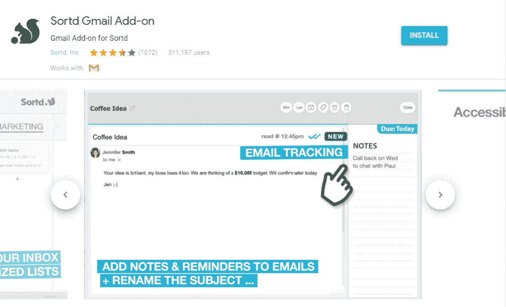

Sortd Gmail add-on

[Sortd Gmail 插件](https://gsuite.google.com/marketplace/app/sortd_gmail_addon/197764131182)将您的 Sortd 帐户与您的 Gmail 连接起来。它允许你将电子邮件转换成任务，还可以给电子邮件添加注释和提醒。它还提供拖放式电子邮件组织。

您需要一个 Sortd 帐户才能使用此加载项。有一个免费的计划，有一些限制。

#### 主要特征

*   给邮件添加注释和提醒。
*   拖放电子邮件组织。
*   看板。
*   标记要跟进的电子邮件。
*   重命名重要邮件的主题行，让它们更加突出。
*   将电子邮件转化为任务。

#### 对...有用

*   Sortd 用户。

[US workers throw away 28% of their time dealing with emails 🗑! That's why you need to enhance your Gmail productivity starting today with these best 20+ power-ups 👨‍💻⚡️Click to Tweet](https://twitter.com/intent/tweet?url=https%3A%2F%2Fkinsta.com%2Fblog%2Fgmail-add-ons%2F&via=kinsta&text=US+workers+throw+away+28%25+of+their+time+dealing+with+emails+%F0%9F%97%91%21+That%27s+why+you+need+to+enhance+your+Gmail+productivity+starting+today+with+these+best+20%2B+power-ups+%F0%9F%91%A8%E2%80%8D%F0%9F%92%BB%E2%9A%A1%EF%B8%8F&hashtags=gmail%2Cproductivity)

## 摘要

Gmail 插件和扩展是第三方应用程序，为您提供了大量不同的选项。我们最喜欢的是那些能够帮助我们更有效率、更快完成更多工作的工具(如果你使用 Chrome，你可能也想看看这个:[提高 WordPress 用户效率的最佳 Chrome 扩展](https://kinsta.com/blog/best-chrome-extensions/))。

并非我们在这里介绍的所有 Gmail 插件和扩展都会改变你的游戏规则。但是，任何可以帮助我们更好地组织收件箱的东西，比如 Sortd、MeisterTask 或 Simple Gmail Notes，以及帮助你改善后续工作的东西，比如 Boomerang 和 Mailtrack，都值得一试。

为什么？因为如果他们能帮你从一封邮件或一项任务中节省哪怕 20/30 秒的时间，你就能算出你每月能“赚回”多少时间。回答:很多！

现在，轮到你了:你最喜欢的 Gmail 插件和 Gmail 扩展是什么？什么是你离不开的？

* * *

让你所有的[应用程序](https://kinsta.com/application-hosting/)、[数据库](https://kinsta.com/database-hosting/)和 [WordPress 网站](https://kinsta.com/wordpress-hosting/)在线并在一个屋檐下。我们功能丰富的高性能云平台包括:

*   在 MyKinsta 仪表盘中轻松设置和管理
*   24/7 专家支持
*   最好的谷歌云平台硬件和网络，由 Kubernetes 提供最大的可扩展性
*   面向速度和安全性的企业级 Cloudflare 集成
*   全球受众覆盖全球多达 35 个数据中心和 275 多个 pop

在第一个月使用托管的[应用程序或托管](https://kinsta.com/application-hosting/)的[数据库，您可以享受 20 美元的优惠，亲自测试一下。探索我们的](https://kinsta.com/database-hosting/)[计划](https://kinsta.com/plans/)或[与销售人员交谈](https://kinsta.com/contact-us/)以找到最适合您的方式。