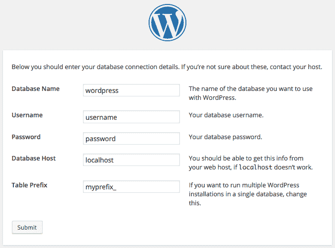
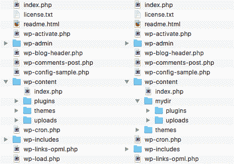
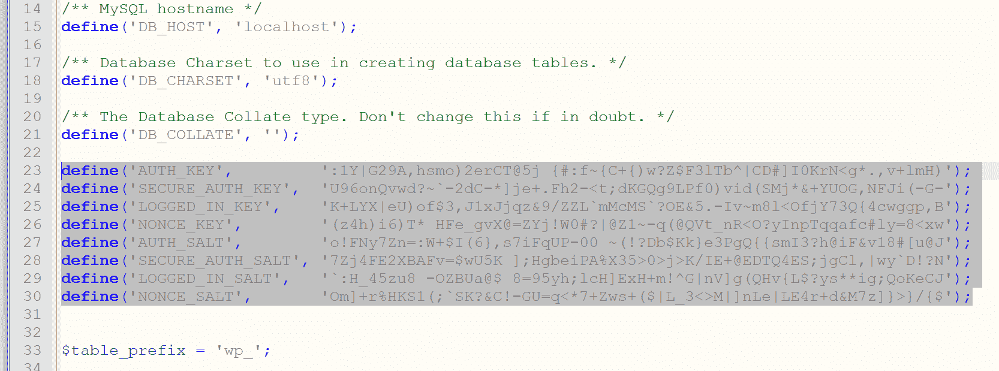
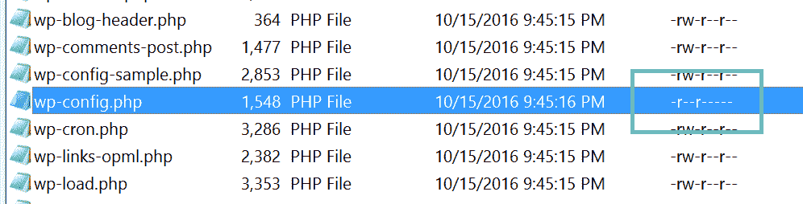

# wp-config.php 文件——关于如何配置 WordPress 的深度观点

> 原文:# t0]https://kinta . com/blog/WP-config-PHP/

WordPress 安装中最重要的文件之一是配置文件。它位于根目录中，包含常量定义和 PHP 指令，使 WordPress 按照您想要的方式工作。
**wp-config.php**文件存储数据，如数据库连接细节、表前缀、特定目录的路径和许多与我们将在本文中深入探讨的特定特性相关的设置。

*   [基本 wp-config.php 文件](#wp-config-php-file)
*   [超过基本配置:编辑文件系统](#editing-file-system)
*   [面向开发者的特性:调试模式和保存查询](#debug-mode-saving-queries)
*   [内容相关设置](#content-related-settings)
*   [允许的内存大小](#allowed-memory-size)
*   [自动更新](#automatic-updates)
*   [安全设置](#security-settings)
*   [其他高级设置](#other-advanced-settings)
*   [封锁 wp-config.php](#lockdown-wpconfig-php)

## 基本的 wp-config.php 文件

当你第一次[安装 WordPress](https://kinsta.com/blog/install-wordpress-locally/) 时，你被要求输入所需的信息，比如数据库细节和表格前缀。有时你的主机会[为你设置 WordPress】，你不需要手动运行设置。但是当您手动运行 5 分钟的安装时，您将被要求输入存储在 wp-config 中的一些最相关的数据。](https://kinsta.com/help/new-site/)



When you run the set-up, you will be required to input data that is stored in the wp-config.php file


下面是一个基本的*wp-config.php*文件:

```
// ** MySQL settings - You can get this info from your web host ** //
/** The name of the database for WordPress */
define('DB_NAME', 'database_name_here');

/** MySQL database username */
define('DB_USER', 'username_here');

/** MySQL database password */
define('DB_PASSWORD', 'password_here');

/** MySQL hostname */
define('DB_HOST', 'localhost');

/** Database Charset to use in creating database tables. */
define('DB_CHARSET', 'utf8');

/** The Database Collate type. Don't change this if in doubt. */
define('DB_COLLATE', '');

define('AUTH_KEY',		'put your unique phrase here');
define('SECURE_AUTH_KEY',	'put your unique phrase here');
define('LOGGED_IN_KEY',		'put your unique phrase here');
define('NONCE_KEY',		'put your unique phrase here');
define('AUTH_SALT',		'put your unique phrase here');
define('SECURE_AUTH_SALT',	'put your unique phrase here');
define('LOGGED_IN_SALT',	'put your unique phrase here');
define('NONCE_SALT',		'put your unique phrase here');

$table_prefix  = 'wp_';

/* That's all, stop editing! Happy blogging. */
```

通常，这个文件是在你运行设置时自动生成的，但是有时候 WordPress 没有权限写入安装文件夹。在这种情况下，您应该创建一个空的*wp-config.php*文件，复制并粘贴来自*wp-config-sample.php*的内容，并将正确的值设置为所有定义的常量。当你完成后，上传你的文件到根文件夹并运行 WordPress。

注意:常量定义和 PHP 指令以特定的顺序出现，我们永远不应该改变。我们永远不应该在下面的注释行中添加内容:

```
/* That's all, stop editing! Happy blogging. */
```

首先，是您应该已经从您的主机收到的数据库常量的定义:


> Kinsta 把我宠坏了，所以我现在要求每个供应商都提供这样的服务。我们还试图通过我们的 SaaS 工具支持达到这一水平。
> 
> <footer class="wp-block-kinsta-client-quote__footer">
> 
> 
> 
> <cite class="wp-block-kinsta-client-quote__cite">Suganthan Mohanadasan from @Suganthanmn</cite></footer>

[View plans](https://kinsta.com/plans/)

*   `DB_NAME`
*   `DB_USER`
*   `DB_PASSWORD`
*   `DB_HOST`
*   `DB_CHARSET`
*   `DB_COLLATE`

根据数据库的详细信息，八个安全密钥将使网站更加安全，免受黑客攻击。当你运行安装程序时，WordPress 会自动生成安全和盐密钥，但是你可以随时更改它们，添加任意字符串。为了更好的安全性，考虑使用[在线生成器](https://api.wordpress.org/secret-key/1.1/salt/)。

变量存储所有 WordPress 表格的前缀。不幸的是，任何人都知道它的默认值，这可能会打开 [WordPress 数据库](https://kinsta.com/knowledgebase/wordpress-database/)的一个漏洞，这个漏洞可以通过在运行设置时为`$table_prefix`设置一个自定义值来轻松修复。要在工作网站中更改表格前缀，你应该对数据库运行几次查询，然后手动编辑 wp-config.php 文件。如果你没有访问数据库的权限，或者你没有构建定制查询所需的知识，那么你可以安装一个插件，比如 [Change Table Prefix](https://wordpress.org/plugins/change-table-prefix/) ，它将重命名数据库表和字段名，并更新配置文件，而没有风险。

**注意**:备份 WordPress 文件和数据库是一个好习惯，即使你会用插件改变表格前缀。

到目前为止，分析仅限于基本配置。但是我们有许多常量可以定义来启用特性、定制和保护安装。


## 基本配置:编辑文件系统

WordPress 文件系统为用户和黑客所熟知。为此，您可以考虑通过将特定文件夹移动到任意位置并在 wp-config 文件中设置相应的 URL 和路径来改变内置的文件结构。首先，我们可以通过定义两个常量来移动内容文件夹。第一个设置完整的目录路径:

```
define( 'WP_CONTENT_DIR', dirname(__FILE__) . '/site/wp-content' );
```

第二个设置新的目录 URL:

```
define( 'WP_CONTENT_URL', 'http://example.com/site/wp-content' );
```

我们可以通过定义以下常量来移动插件文件夹:

```
define( 'WP_PLUGIN_DIR', dirname(__FILE__) . '/wp-content/mydir/plugins' );
define( 'WP_PLUGIN_URL', 'http://example.com/wp-content/mydir/plugins' );
```

同样，我们可以通过设置新的目录路径来移动上传文件夹:

```
define( 'UPLOADS', 'wp-content/mydir/uploads' );
```

> 注意:所有路径都是相对于`ABSPATH`的，不应该包含前导斜杠。

完成后，整理文件夹并重新加载 WordPress。



The image shows the built-in file structure compared to a customized structure


不能从 wp-config 文件中移动 */wp-content/themes* 文件夹，但是我们可以在一个插件或者一个主题的函数文件中注册一个新的[主题目录](https://codex.wordpress.org/register_theme_directory)。


## 面向开发人员的特性:调试模式和保存查询

如果你是开发者，你可以强制 WordPress 显示错误和警告，这将有助于你调试主题和插件。[要启用调试模式](https://kinsta.com/blog/wordpress-debug/)，只需将`WP_DEBUG`值设置为真，如下所示:

```
define( 'WP_DEBUG', true );
```

`WP_DEBUG`默认设置为 false。如果需要禁用调试模式，可以删除定义，或者将常量的值设置为 false。当你在一个实时网站上工作时，你应该禁用调试模式。错误和警告永远不应该显示给站点浏览者，因为它会给黑客提供有价值的信息。但是如果无论如何都要调试呢？
在这种情况下，你可以强制 WordPress 将错误和警告保存在 *debug.log* 文件中，放在 */wp-content* 文件夹中。要启用此功能，请将以下代码复制并粘贴到您的*wp-config.php*文件中:

```
define( 'WP_DEBUG', true );
define( 'WP_DEBUG_LOG', true );
define( 'WP_DEBUG_DISPLAY', false );
@ini_set( 'display_errors', 0 );
```

为了让这个特性工作，我们首先需要启用调试模式。然后，将`WP_DEBUG_LOG`设置为 true，我们强制 WordPress 将消息存储到 debug.log 文件中，而将`WP_DEBUG_DISPLAY`设置为 false，我们将它们从屏幕上隐藏起来。最后，我们将 PHP 变量`display_errors`的值设置为 0，这样错误信息就不会显示在屏幕上。wp-config 永远不会从缓存中加载。因此，这是一个覆盖 php.ini 设置的好地方。

> 注意:这是一个很好的功能，你可以利用它来注册 WordPress 不会打印在屏幕上的消息。例如，当`publish_post`动作被触发时，WordPress 加载一个保存数据的脚本，然后将用户重定向到文章编辑页面。在这种情况下，您可以登记信息，但不能将其打印在屏幕上。

另一个调试常量决定了要加载的脚本和样式的版本。如果要加载未压缩版本，将`SCRIPT_DEBUG`设置为 true:

```
define( 'SCRIPT_DEBUG', true );
```

如果你的主题或插件显示了从数据库中检索到的数据，你可能需要存储查询细节以备后用。常量迫使 WordPress 将查询信息存储到数组中。这些详细信息将在页脚模板中添加以下代码后打印出来:

```
if ( current_user_can( 'administrator' ) ) {
        global $wpdb;
        echo '<pre>';
        print_r( $wpdb->queries );
        echo '</pre>';
}
```

关于这个特性的更深入的分析，请参考[如何在 WordPress](https://kinsta.com/blog/wp-query/) 中构建高效的查询。

## 内容相关设置

当你的网站成长起来后，你可能想减少文章修改的次数。默认情况下，WordPress 每 60 秒自动保存一次修订。我们可以通过在 wp-config 中设置一个自定义间隔来更改这个值，如下所示:

```
define( 'AUTOSAVE_INTERVAL', 160 );
```

当然，您也可以缩短自动保存间隔。每次我们保存编辑内容时，WordPress 都会在文章表中添加一行，这样我们就可以恢复文章和页面的先前版本。这是一个有用的功能，当我们的网站变大时，它可能会变成一个问题。幸运的是，我们可以减少要存储的文章修订的最大数量，或者完全禁用该功能。
如果您想要禁用发布修订，请定义以下常量:

```
define( 'WP_POST_REVISIONS', false );
```

如果您想限制修订的最大数量，可以添加下面一行:

```
define( 'WP_POST_REVISIONS', 10 );
```

默认情况下，WordPress 会将垃圾帖子、页面、附件和评论保存 30 天，然后永久删除。我们可以用下面的常数来改变这个值:

## 注册订阅时事通讯


### 想知道我们是怎么让流量增长超过 1000%的吗？

加入 20，000 多名获得我们每周时事通讯和内部消息的人的行列吧！

[Subscribe Now](#newsletter)

```
define( 'EMPTY_TRASH_DAYS', 10 );
```

我们甚至可以禁用 trash，将其值设置为 0，但是考虑到 WordPress 将不再允许你恢复内容。


## 允许的内存大小

有时您可能会收到如下消息:

**致命错误:已耗尽 xxx 字节的允许内存大小…**

最大内存大小取决于服务器配置。如果你不能访问 php.ini 文件，[你可以通过设置 wp-config 文件中的`WP_MEMORY_LIMIT`常量来增加 WordPress](https://kinsta.com/knowledgebase/wordpress-memory-limit/) 的内存限制。默认情况下，WordPress 试图为 PHP 分配 40Mb 用于单个站点，为[多站点安装](https://kinsta.com/blog/wordpress-multisite/)分配 64MB。当然，如果 PHP 分配的内存大于 40Mb(或 64Mb)，WordPress 将采用最大值。
也就是说，您可以使用以下代码行设置一个自定义值:

```
define( 'WP_MEMORY_LIMIT', '128M' );
```

如果需要，您也可以使用以下语句设置最大内存限制:

`define( 'WP_MAX_MEMORY_LIMIT', '256M' );`

建议阅读:[如何在 WordPress](https://kinsta.com/knowledgebase/php-memory-limit/) 中提高 PHP 内存限制。

## 自动更新

从 3.7 版本开始，WordPress 支持[自动更新](https://kinsta.com/blog/wordpress-automatic-updates/)安全版本。这是一个重要的功能，允许网站管理员[保持他们的网站始终安全](https://kinsta.com/blog/wordpress-security/)。
您可以通过定义以下常量来禁用所有自动更新:

```
define( 'AUTOMATIC_UPDATER_DISABLED', true );
```

也许禁用安全更新不是一个好主意，但这是你的选择。
默认情况下，自动更新不适用于主要版本，但是您可以启用任何核心更新，如下定义`WP_AUTO_UPDATE_CORE`:

```
# Disables all core updates:
define( 'WP_AUTO_UPDATE_CORE', false );

# Enables all core updates, including minor and major:
define( 'WP_AUTO_UPDATE_CORE', true );
```

默认值为`minor`:

Struggling with downtime and WordPress problems? Kinsta is the hosting solution designed to save you time! [Check out our features](https://kinsta.com/features/)

```
define( 'WP_AUTO_UPDATE_CORE', 'minor' );
```

另一个常量禁用自动更新(以及对任何文件的任何更新或更改)。如果你设置`DISALLOW_FILE_MODS`为真，所有的文件编辑将被禁用，甚至主题和插件的安装和更新。因此，不建议使用它。

## 安全设置

我们可以使用 wp-config 文件来增加网站的安全性。除了上面提到的对文件结构的修改，我们还可以锁定一些可能导致不必要的漏洞的特性。首先，我们可以禁用管理面板中提供的文件编辑器。以下常量将隐藏外观编辑器屏幕:

```
define( 'DISALLOW_FILE_EDIT', true );
```

> 注意:考虑到如果这个常量被定义为 true，一些插件可能无法正常工作。


disallow_file_edit


一个安全特性是通过 SSL 进行管理。如果你已经购买了一个 [SSL 证书](https://kinsta.com/help/how-to-install-ssl-certificate/)，并且对其进行了正确的配置，你可以强制 WordPress 在任何登录和管理会话中通过 SSL 传输数据。使用以下常量:

```
define( 'FORCE_SSL_ADMIN', true );
```

如果您需要更多关于通过 SSL 管理[的信息，请查阅 Codex。](https://codex.wordpress.org/Administration_Over_SSL)

其他两个常量允许阻止外部请求并列出许可的主机。

```
define( 'WP_HTTP_BLOCK_EXTERNAL', true );
define( 'WP_ACCESSIBLE_HOSTS', 'example.com,*.anotherexample.com' );
```

在本例中，我们首先禁用了来自外部主机的所有访问，然后列出了允许的主机，用逗号分隔(允许使用通配符)。

## 其他高级设置

`WP_CACHE`设置为 true 包括*WP-content/advanced-cache . PHP*脚本。只有当你安装了一个永久缓存插件时，这个常量才有效。

`CUSTOM_USER_TABLE`和`CUSTOM_USER_META_TABLE`用于设置除默认 wp_users 和 wp_usermeta 表以外的自定义用户表。这些常量启用了一个有用的功能，允许站点用户使用一个帐户访问多个网站。要使该功能发挥作用，所有安装都应该共享同一个数据库。

从 2.9 版本开始，WordPress 支持自动数据库优化。由于这个特性，设置`WP_ALLOW_REPAIR`为真，WordPress 将自动修复损坏的数据库。

每次你编辑一个图像，WordPress 都会创建一组新的图像。如果您恢复原始图像，所有生成的集将保留在服务器上。您可以通过将`IMAGE_EDIT_OVERWRITE`设置为 true 来覆盖此行为，这样，当您恢复原始图像时，所有编辑都将从服务器中删除。

## 封锁 wp-config.php

现在我们知道为什么 wp-config.php 是最重要的 WordPress 文件之一了。那么，我们为什么不对黑客隐藏呢？首先我们可以把 wp-config 移动到 WordPress 根文件夹上面一层(**就一层**)。但是，这种技术有点争议，所以我建议采用其他解决方案来保护文件。如果你的网站运行在 [Apache Web 服务器](https://kinsta.com/knowledgebase/what-is-apache/)上，你可以添加以下指令到[。htaccess 文件](https://kinsta.com/knowledgebase/wordpress-htaccess-file/):

```
<files wp-config.php>
order allow,deny
deny from all
</files>
```

如果[网站运行在 Nginx](https://kinsta.com/knowledgebase/what-is-nginx/) 上，您可以将以下指令添加到配置文件中:

```
location ~* wp-config.php { deny all; }
```

> 注意:这些说明只能在设置完成后添加。

如果你的网站经历了多次迁移，或者你是从别人那里购买的，建议你创建一套新的 WordPress 安全密钥。这些密钥是一组随机变量，用于提高存储在用户 cookies 中的信息的加密。自从 WordPress 2.7 以来，已经有 4 个不同的密钥: **AUTH_KEY** ， **SECURE_AUTH_KEY** ， **LOGGED_IN_KEY** ，以及 **NONCE_KEY。**

默认情况下，它们是为您随机生成的。但是 WordPress 实际上有一个免费工具，你可以用它来[生成新的随机密钥](https://api.wordpress.org/secret-key/1.1/salt/)。然后，您可以简单地更新您当前的密钥，这些密钥存储在您的 wp-config.php 文件中。



WordPress security keys


阅读更多关于安全密钥的信息。

最后，您应该仔细检查并确保您的权限在您的 wp-config.php 文件上得到加强。WordPress 站点根目录下的文件通常会被设置为 644，这意味着文件的所有者可以读写文件，文件所有者组中的用户可以读取文件，其他人也可以读取文件。根据 [WordPress 文档](https://codex.wordpress.org/Changing_File_Permissions)，wp-config.php 文件的权限应该设置为 440 或 400，以防止服务器上的其他用户读取它。你可以用你的 [FTP 客户端](https://kinsta.com/blog/best-ftp-clients/)很容易地改变这一点。



wp-config.php permissions


## 摘要

在这篇文章中，我列出了很多我们可以在 wp-config 文件中定义的 WordPress 常量。这些常数中有一些是常用的，它们的功能很容易理解。其他常量支持需要深入了解 WordPress 和站点管理的高级功能。

我已经列出了最常见的特性，留下一些高级特性，我们可以在以后的帖子中讨论。如果你想探索这里没有列出的特性和常量，请在下面的评论中随意展开对话，我们将深入探讨。

* * *

让你所有的[应用程序](https://kinsta.com/application-hosting/)、[数据库](https://kinsta.com/database-hosting/)和 [WordPress 网站](https://kinsta.com/wordpress-hosting/)在线并在一个屋檐下。我们功能丰富的高性能云平台包括:

*   在 MyKinsta 仪表盘中轻松设置和管理
*   24/7 专家支持
*   最好的谷歌云平台硬件和网络，由 Kubernetes 提供最大的可扩展性
*   面向速度和安全性的企业级 Cloudflare 集成
*   全球受众覆盖全球多达 35 个数据中心和 275 多个 pop

在第一个月使用托管的[应用程序或托管](https://kinsta.com/application-hosting/)的[数据库，您可以享受 20 美元的优惠，亲自测试一下。探索我们的](https://kinsta.com/database-hosting/)[计划](https://kinsta.com/plans/)或[与销售人员交谈](https://kinsta.com/contact-us/)以找到最适合您的方式。