# 用 WP 页面生成器建立网站的 10 个理由

> 原文:# t0]https://kinta . com/blog/WP-page-builder/

人们对创建网站的追求轻而易举地把我们带到了一个网站开发的新时代。在那里，随着强大的页面构建工具的出现，创建网站变得更加有趣(特别是对于非开发人员)。当你尝试在 WordPress 上建立网站时，你可以使用大量的工具和插件。今天我们将探索一个新的工具， [WP 页面生成器](https://www.themeum.com/product/wp-pagebuilder/)。如果你厌倦了老的页面生成器插件，这是一个你应该尝试的插件。

WP Page Builder 拥有许多设计元素、插件、功能，如设备特定的响应控件、导出/导入选项、填充调整，以及最重要的拖放实时前端编辑系统，它拥有一切功能来支持一个成熟的网站。这是一个**一体化的 WordPress 插件，可以满足你的网站建设需求**。

这是一个免费的 WordPress 页面生成器插件，可以帮助你像专业人士一样创建漂亮的网站。

## WP 页面生成器有什么特别之处？

想知道是什么让 WP 页面生成器如此特别？我会说，什么不会？它是由 Themeum 的团队开发的，该团队自 2013 年以来一直在创建 WordPress 主题。如上所述，该插件是一个完整的基本站点构建元素包，具有你期望从页面构建器插件中获得的所有现代功能。让我们看看 WP 页面生成器包含的所有有趣的特性。

## 1.拖放网站建设

WP 页面生成器提供了一个拖放网站建设系统。您可以轻松地向任何页面添加文本、按钮、图标或其他元素。你只需要拖动特定的附加组件，放在你想要的地方。一切都发生在你的眼前，你可以完全控制一切。

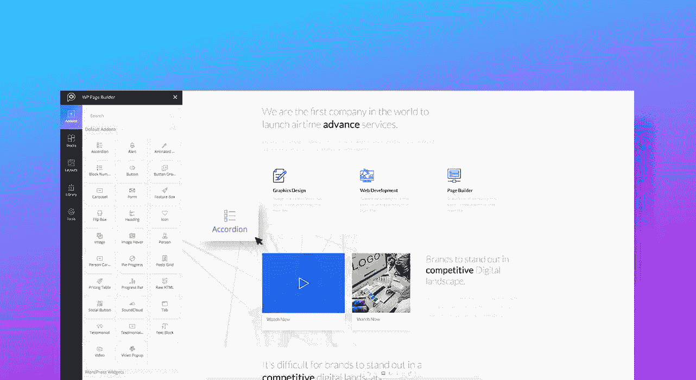

Drag & drop website building

## 2.更快、实时的前端编辑

这个插件非常快，非常直观。它也是非常轻量级的，比所有其他类似的工具花费更少的时间来创建一个令人惊叹的功能性网站。它将改变你在 WordPress 上建立网站的方式。里面已经有很多现成的元素了。你只需要知道如何使用它们。该工具采用最新技术构建，可帮助您在几分钟内准备好您的网站。

如果你不知道如何写代码，但你想建立网站，WP 页面生成器是适合你的工具。不需要编写代码来为您的网页添加任何功能或设计。WP 页面生成器丰富的站点构建元素和拖放功能可以帮你完成这项工作。

创建一个新页面，然后用 WP 页面生成器编辑它非常简单。您可以在创建页面时选择页面的布局。一旦选定，只需点击“用 WP 页面生成器编辑”就可以了。您可以选择列数，并开始在其上拖动元素。

享受一个新的网站建设的经验与国家的艺术资源在里面。在一个现代和令人愉快的用户界面上创建漂亮的网页。

## 3.30 多个附加组件和计数

使用文本、图像、图标、按钮等元素开发您的网站。在 WP 页面生成器中有大量的插件来完全装备和装饰你的网站。将附加组件拖放到网页上，然后按照您想要的方式修改它们的外观。

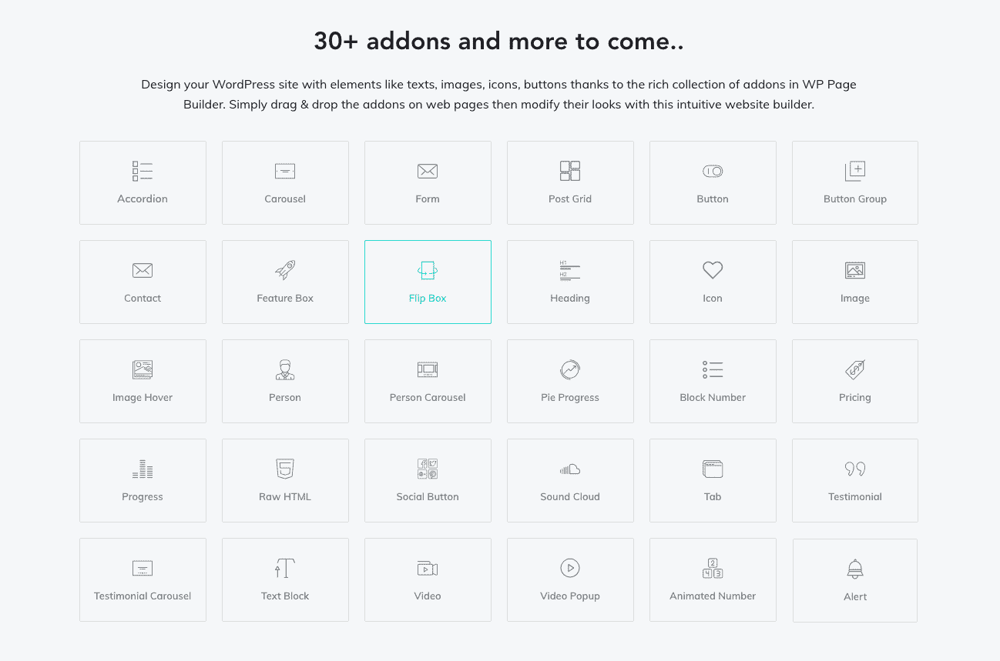

WP Page Builder add-ons

以下是一些令人惊叹的附加组件:

*   **表单:**轻松创建 web 表单。它为您提供了一种方便的方式来根据您的需要设计表单的样式。表单加载项本身能够设置任何类型的表单，而无需安装任何插件。此外，你可以管理表单插件和[启用 reCAPTCHA](https://kinsta.com/blog/wordpress-captcha/) 只需简单的点击。如果您愿意，还可以添加[联系表 7](https://kinsta.com/blog/contact-form-7/) 。
*   Carousel :在免费的页面生成器插件中很难找到像 Carousel 这样的高级插件，但是 WP 页面生成器可以让你创建令人惊叹的英雄[滑块](https://kinsta.com/blog/wordpress-slider/)而无需付费。
*   **帖子网格:**在网格中显示博客帖子，定义帖子的数量和样式。
*   **功能框:**使用功能框插件在您的网站上显示产品的功能。
*   **Accordion:** 你的站点需要任何折叠文本内容吗？使用 WP 页面生成器的 Accordion 附加组件，按照您想要的方式修改样式。
*   **人物转盘:**除了单独展示个人资料和评价，您还可以在转盘中展示它们。人员轮播和证明轮播附加组件将为您做到这一点。
*   **价格表:**对于您提供的服务或销售的产品，您可能需要价格表。使用 WP 页面生成器中的定价表插件轻松设置定价表。
*   翻转框:有一个带有徽标、标题、文本和按钮的翻转框，改变翻转选项和样式，使其看起来像你想要的样子。
*   pie progress :用 Pie Progress 插件在你的站点上放置一个 Pie Progress 元素。
*   评价:在网站的任何地方展示人们对你的企业的看法。
*   **动画数字**:使用这个插件来显示动画数字，以便更好地展示统计数据。
*   **社交按钮**:使用网站上不同的按钮链接到社交媒体档案。
*   **SoundCloud** :添加来自 SoundCloud 的音频位。

## 4.特定于设备的响应控制

您可以决定您的网站在不同尺寸的设备上的外观。WP Page Builder 中的[设备特定响应](https://kinsta.com/blog/responsive-web-design/)控制系统让您可以轻松调整和优化台式机、平板电脑和手机的网页。

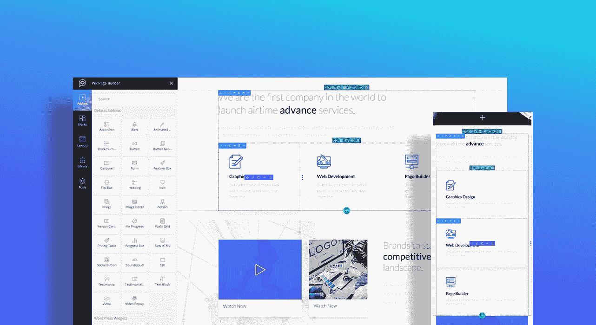

WP Page Builder responsive

仅用一个单位(像素)制作网页的过程并不能使页面生成器变得智能。WP 页面生成器引入了多个响应单元。除了像素，您还可以用 rem 和百分比单位来确定响应断点。您可以更改元素大小，甚至显示/隐藏特定设备的特定元素。

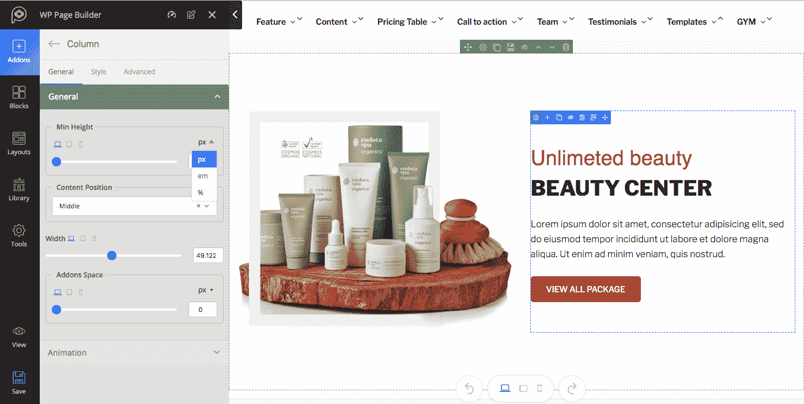

WP Page Builder responsive breakpoints

## 5.大量预制的布局

无论你想建立什么类型的网站，WP 页面生成器中广泛的预设计模板都可以满足你。选择最符合您的目标的任何布局，用您的内容定制它们，并在几分钟内启动一个完整的网站。

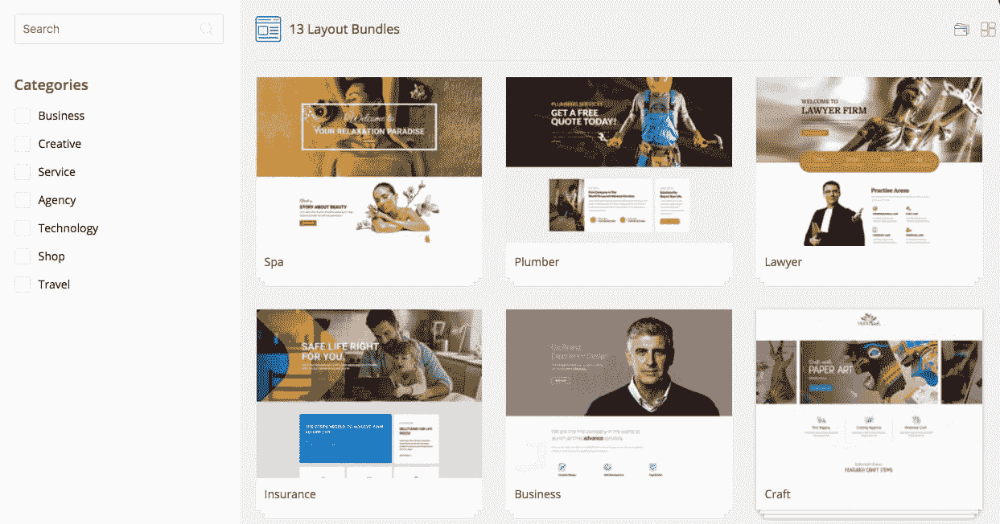

WP Page Builder premade layouts

这些现成的布局以布局包的形式出现。最受欢迎的布局包有:

1.  **商务:**为任何类型的商务网站而建。需要[展示投资组合](https://kinsta.com/blog/portfolio-website/)、简介和服务的公司或商业公司可以充分利用这个布局包。该包中的可用页面包括:主页、关于、团队、[投资组合](https://kinsta.com/blog/wordpress-portfolio-plugins/)、定价、联系人和服务。
2.  **保险**:非常适合任何提供保险服务的金融相关公司、企业或机构。该软件包带有三个内置页面，即:主页，关于和服务。
3.  **Spa** :专为美容院、美容院、美发美甲店、理发店，以及所有其他类似的商业网站而制作。目前，水疗套餐有三个页面:主页、优惠和套餐。
4.  **水管工**:针对不同的服务，如水管工、油漆工、木工、杂工、家政、家庭清洁和维修工具网站。这些页面包括:主页、关于和服务。
5.  **建筑**:为家居装饰、建筑设计和其他相关公司建造。内置页面包括:主页、关于和服务。
6.  **律师**:为律师、个人、律师事务所提供法律相关服务。可用页面包括:主页、关于、通知、联系人和服务。
7.  **沙龙**:适用于任何发廊、美甲店、理发店等相关商业网站。预制页面包括:主页、关于和风格展示。
8.  第三方页面布局:你可以在 WP 页面生成器的布局部分获得额外的页面布局。构建一个插件来保存你的页面布局。安装并激活插件以便能够使用它们。用你自己的页面布局制作网页现在已经成为现实。

WP 页面生成器中还有许多其他专业级页面布局。不同的类别更容易选择合适的布局。最棒的是，大多数都是完全免费的。

## 6.现成的预先设计的积木

WP 页面生成器提供了许多现成的设计模块，让你的网站开发过程更快更容易。

你可以拖放任何页面上的块，它得到的设计。整个过程一眨眼就完成了。像页面上的所有其他部分一样，您也可以修改块的外观。每个区块上都有一个“查看区块”按钮，可以查看它们在直播网站上的样子。

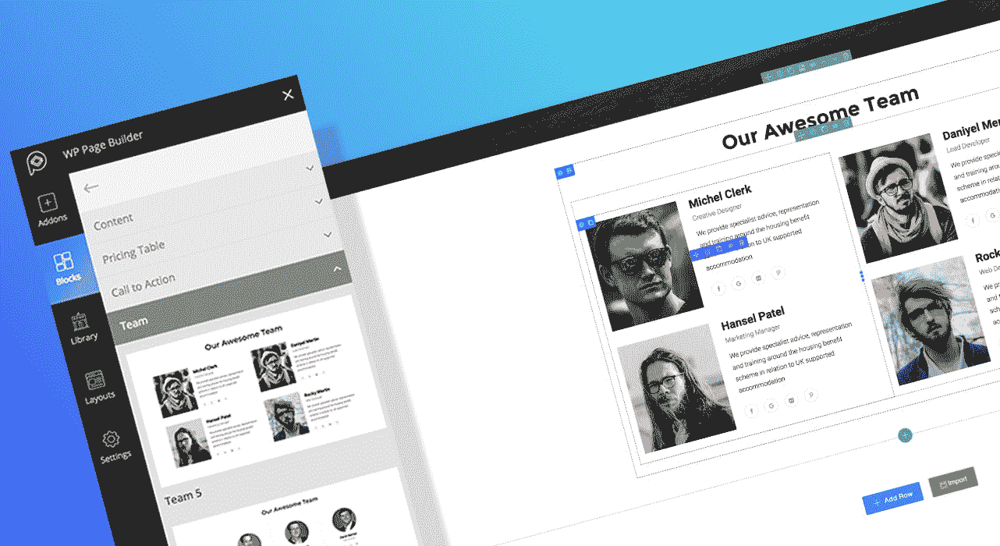

WP Page Builder blocks

这些积木有不同的种类。使用正确的关键字找到它们。可用的类别有:

**特色**:使用这些板块展示你的公司、产品和服务的特色。有许多不同的设计可供选择。选择一个与你的设计相匹配的。

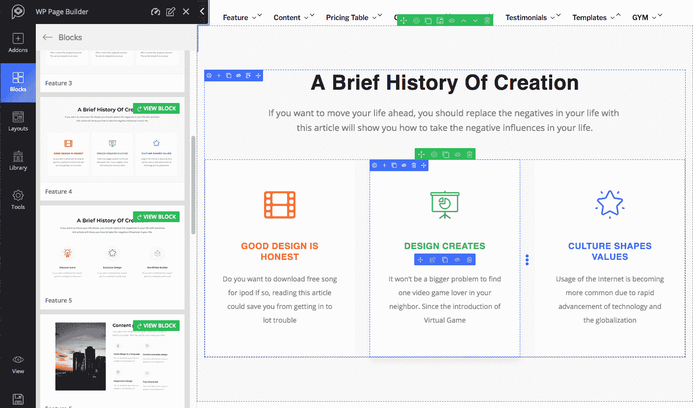

WP Page Builder feature blocks

**评价**:需要在你的网站上分享客户反馈？在这种情况下，WP 页面生成器的推荐模块就派上了用场。你可以选择你想要的设计，包括这些变化:亮，暗，幻灯片，网格风格。

**团队:**利用 WP 页面生成器的 ready 元素，以专业的方式展示你的团队成员。可用的块有多种设计变化，具有不同的效果和行为。每个区块都有不同风格的团队成员的名字、称号和社交链接。

WP Page Builder team block

**行动号召**:想让你的访问者在网站上采取某些行动吗？使用动作块调用。你可以用不同的视觉效果和文字设计一个行动号召按钮，来激励访问者点击它们。

## 注册订阅时事通讯

### 想知道我们是怎么让流量增长超过 1000%的吗？

加入 20，000 多名获得我们每周时事通讯和内部消息的人的行列吧！

[Subscribe Now](#newsletter)

**价格表**:有你的产品和服务的价格表吗？。这些模块有多个内置的定价表和功能。其中一些还可以让你突出显示定价计划。

内容:设计精美的内容部分在 WP 页面生成器中是现成的。为你的网站使用任何你喜欢的内容块。

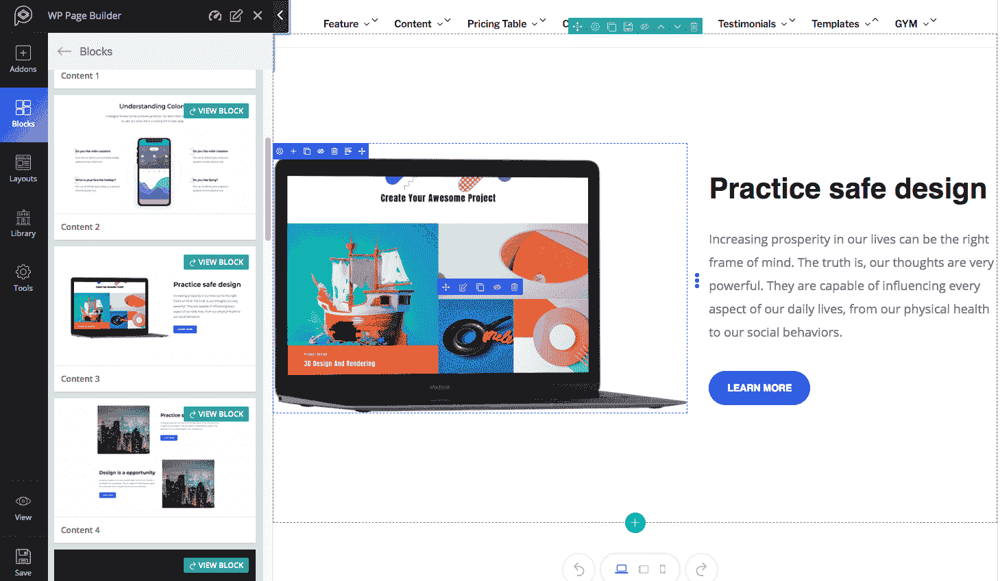

WP Page Builder content block

第三方模块:如果你想在所有这些内置模块之外使用你自己选择的模块，你当然可以用 WP 页面生成器来实现。该工具支持第三方块。

还有更多的模块即将推出，WP 页面生成器背后的团队非常热衷于改进它。

## 7.大量的基本图标

在建立一个网站时，图标起着举足轻重的作用。除了设计，你还需要它们来突出或区分你的内容。WP 页面生成器有丰富的字体图标集合来满足这种需求。

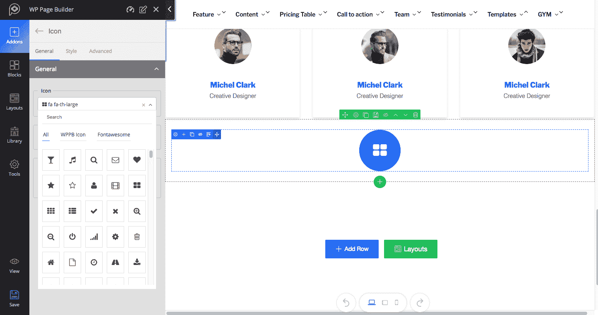

WP Page Builder icon fonts

*   字体牛逼:这个 WordPress page composer 工具里面有 670 多个字体牛逼的图标。你可以很容易地在你网站的任何内容上使用它们。
*   除了字体图标，你还可以在你的网页上使用 340+ WPPB 线条图标。

WP 页面生成器可以让你编辑网站的字体和颜色。

## 8.本着用户友好的理念构建

任何了解 WordPress 的人都应该很容易使用 WP 页面生成器。这个插件在一个很像默认 WordPress 生态系统的奇妙界面上带来了一个非常多才多艺的用户体验。这个工具甚至对于那些第一次使用 WordPress 的人来说也是毫不费力的。

考虑到所有层次的 WordPress 用户，WP 页面构建器插件已经建立了全包功能。它是由专业人士启发和开发的，但它是为所有人打造的。

[WP Page Builder is inspired and developed by pros, but it's built for everyone. 👍Click to Tweet](https://twitter.com/intent/tweet?url=https%3A%2F%2Fkinsta.com%2Fblog%2Fwp-page-builder%2F&via=kinsta&text=WP+Page+Builder+is+inspired+and+developed+by+pros%2C+but+it%27s+built+for+everyone.+%F0%9F%91%8D&hashtags=WordPress%2Cwebdesign)

## 9.库来保存您自己的块

您可以轻松地在网站的不同页面上重复使用以前设计的部分。WP 页面生成器中的库系统允许您存储自己的设计块。只需将它们保存在库中一次，然后您可以根据需要多次重用它们。

Struggling with downtime and WordPress problems? Kinsta is the hosting solution designed to save you time! [Check out our features](https://kinsta.com/features/)

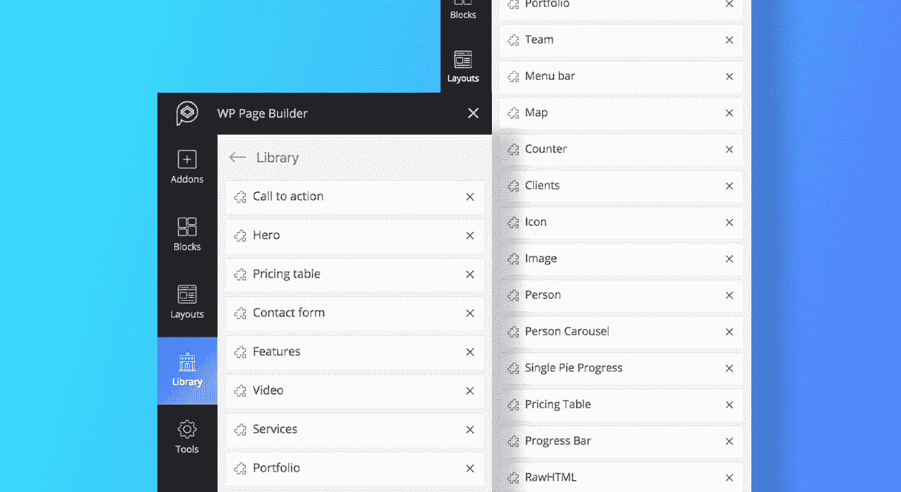

WP Page Builder library

这是你自己的图书馆。在一行中创建内容部分后，将鼠标悬停在该行上，然后单击“保存行”图标。给它起个名字，然后点击“保存”按钮。该行将保存在库的底部。是的，就这么简单。

## 10.简单灵活的构建机制

WP 页面生成器提供了各种各样的功能，你可以使用它来轻松快速地开发一个网站。站点上的元素提供编辑、复制、删除和其他定制选项，同时在编辑模式下悬停在它们上面。以下是这个页面生成器提供的一些令人兴奋的开发优势。

*   **创建多个行列结构**

使用 WP 页面生成器，只需点击一下鼠标，即可创建一行并确定其中的列数。点击“添加行”，弹出一个显示列数的面板。轻松选择您想要的号码。就是这样！

*   **一键复制任意元素**

一旦创建了一个部分，不管是列还是行，都不必再创建了。只需点击一下就可以复制。在定制选项面板上找到“复制”图标，然后单击它。从字面上看，你可以复制页面上的任何内容。

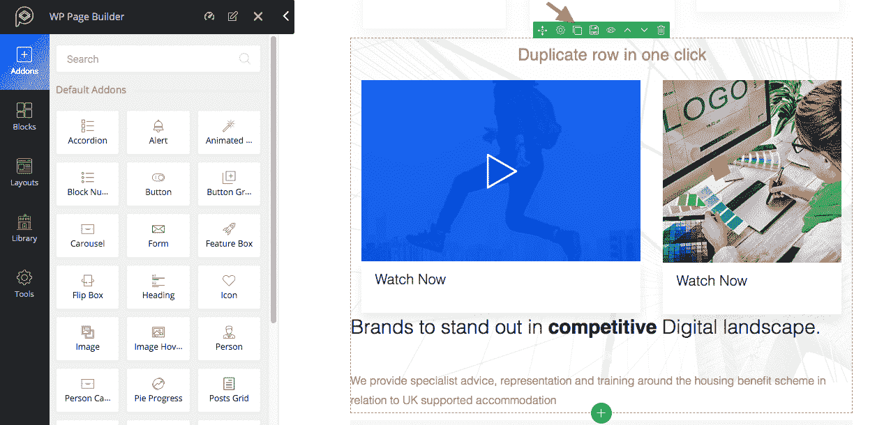

WP Page Builder duplicate element

*   **控制列水平间距(装订线)**

使用 WP 页面生成器的栏间距，调整栏间距要容易得多。无论一行中有多少列，都可以很容易地确定它们之间的间距。拖移左侧边栏上的装订线，根据它们的高度和宽度调整栏的水平间距。

*   **导出、导入和清除页面内容**

WP 页面生成器允许你导出你用它创建的页面。您也可以从外部导入页面。在左侧边栏有一个名为“工具”的菜单，可以让你用三个不同的子工具导出、导入和清除页面内容。

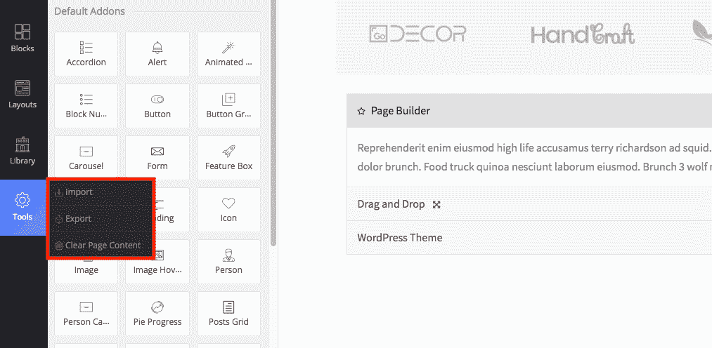

WP Page Builder import and export

*   **通过拖动进行灵活的填充调整**

想灵活设置内容填充？你可以随便玩玩。通过拖动设置填充。填充单位也以像素(px)显示。默认情况下，所有的元素(插件、块、页面模板、行和列)都有一些填充，但是你可以很容易地调整它。

*   **无限撤销/重做选项**

误删了东西也没关系。有无限的撤消/重做选项来恢复这些操作。所以，不用担心。“撤消”和“重做”按钮位于页面底部。当用 WP 页面生成器编辑任何页面时，你总是有这些按钮来执行操作。

*   **添加自定义 CSS**

想超越 WP 页面生成器现有的定制选项？是的，你有这样做的自由。有一个系统可以为页面上的任何元素添加自定义 CSS。你只需要进入高级样式选项，然后添加 CSS。如果需要，还可以调用 ids & classes 并定义所有元素的 z 索引。

### WordPress 小部件支持

尽管有如此先进的元素在里面，你可能想要在建立你的站点的时候使用 WordPress 小部件。默认小部件显示在附加组件之后。这些可以在页面的任何地方使用。像附加组件一样，小部件也可以被拖放。

### 开发人员支持(制作您自己的附加组件)

除了 30 多个插件让你可以用多种多样的页面元素来构建网站之外，想用自己的插件来实现任何额外功能/设计的开发者当然可以这么做。开发者可以很容易地将他们的自定义块和布局添加到 WP 页面生成器中。你可以访问插件的[开发者文档](https://github.com/themeum/WP-Page-Builder)获取指导方针。

## 摘要

有了安装在 WordPress 网站上的 WP 页面生成器，你就可以创建任何网站，而不用担心响应速度或编写任何代码。这个过程完全是拖放式的。您过去可能使用过其他页面生成器，但是我鼓励您尝试一下这个！如果你是 Kinsta 的客户，把它安装在你的[暂存站点](https://kinsta.com/help/staging-environment/)上，然后到处玩，不用担心弄坏任何东西。你可以[从 WordPress 知识库免费下载](https://wordpress.org/plugins/wp-pagebuilder/)。

你用过 WP 页面生成器吗？如果是，你的想法是什么？请在下面的评论中留下它们。

* * *

让你所有的[应用程序](https://kinsta.com/application-hosting/)、[数据库](https://kinsta.com/database-hosting/)和 [WordPress 网站](https://kinsta.com/wordpress-hosting/)在线并在一个屋檐下。我们功能丰富的高性能云平台包括:

*   在 MyKinsta 仪表盘中轻松设置和管理
*   24/7 专家支持
*   最好的谷歌云平台硬件和网络，由 Kubernetes 提供最大的可扩展性
*   面向速度和安全性的企业级 Cloudflare 集成
*   全球受众覆盖全球多达 35 个数据中心和 275 多个 pop

在第一个月使用托管的[应用程序或托管](https://kinsta.com/application-hosting/)的[数据库，您可以享受 20 美元的优惠，亲自测试一下。探索我们的](https://kinsta.com/database-hosting/)[计划](https://kinsta.com/plans/)或[与销售人员交谈](https://kinsta.com/contact-us/)以找到最适合您的方式。