# 如何手动或用插件添加分页

> 原文:# t0]https://kinta . com/blog/WordPress-page/

寻找控制 WordPress 分页的方法？

调整站点的分页可以帮助您创建一个更加用户友好、易于导航的网站。然而，许多 WordPress 主题不提供详细的分页选项，这意味着你能做的改变是有限的。

谢天谢地，有一些简单的方法来调整 WordPress 分页。更高级的用户可以依赖自定义代码，而普通用户可以找到几个高质量的分页插件。

在这篇文章中，我们将涵盖你需要知道的关于 WordPress 分页的一切。

让我们开始吧！

T3】

### 查看我们的视频指南到 WordPress 分页


## 什么是 WordPress 分页？

WordPress 分页是将你的网站的博客文章列表或其他内容分成单独页面的过程。


> Kinsta 把我宠坏了，所以我现在要求每个供应商都提供这样的服务。我们还试图通过我们的 SaaS 工具支持达到这一水平。
> 
> <footer class="wp-block-kinsta-client-quote__footer">
> 
> 
> 
> <cite class="wp-block-kinsta-client-quote__cite">Suganthan Mohanadasan from @Suganthanmn</cite></footer>

[View plans](https://kinsta.com/plans/)

例如，如果您有 100 篇博客文章，您可以配置您的分页设置以在每页上显示 10 篇博客文章，这将把您的博客文章列表分成 10 页，每页 10 篇文章。

然后访问者可以使用“下一页”或“上一页”按钮在列出你的文章的页面之间导航。或者，在某些情况下，访问者会看到一个带编号的页面列表，这样他们就可以跳转到特定的页面。例如，在默认的 Twenty Twenty-One 主题中，分页是这样的:

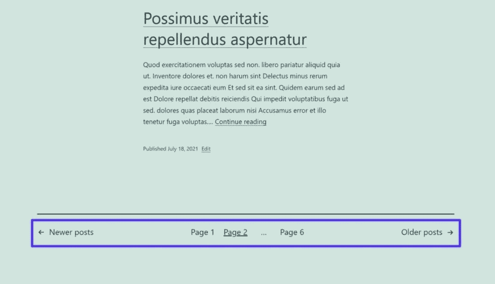

WordPress pagination example in the default Twenty Twenty-One theme.


你也可以将一篇 WordPress 文章分成多个页面，如果你发布了[长格式的内容](https://kinsta.com/blog/long-form-articles/)，这会很有帮助。

通过一些代码片段或插件，您还可以更好地控制分页在您的网站上的工作方式，这是我们将在本文后面讨论的主题。

[寻找一种控制 WordPress 分页的方法？👀从这里开始🚀 点击推文](https://twitter.com/intent/tweet?url=https%3A%2F%2Fkinsta.com%2Fblog%2Fwordpress-pagination%2F&via=kinsta&text=Searching+for+a+way+to+control+WordPress+pagination%3F+%F0%9F%91%80+Start+here+%F0%9F%9A%80&hashtags=WPTips%2CWordPress)


## 为什么使用 WordPress 分页？

你应该关心 WordPress 分页有三个主要原因:

1.  改进的导航和用户体验
2.  更好的性能
3.  改进的搜索引擎优化抓取能力

让我们过一遍。

### 改进的导航和用户体验

改进 WordPress 分页的最大好处是它让你的访问者更容易浏览你的网站，这为他们创造了更好的体验。

许多 WordPress 主题只显示有限的分页选项，使得访问者很难导航到不同的页面。

例如，当访问者阅读帖子的第一页时，下面是 Twenty Twenty One 主题中的默认分页选项。

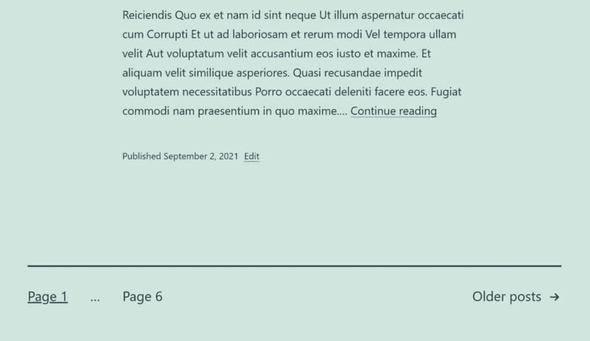

The Twenty Twenty-One theme provides limited pagination options on the first page.


访问者可以导航到最后一页(本例中的第 6 页*)或下一页(点击“旧帖子”*)，但他们不能直接导航到第 3、4 或 5 页。**

 *相比之下，Kinsta 博客提供了多个分页链接，帮助访问者找到正确的位置。

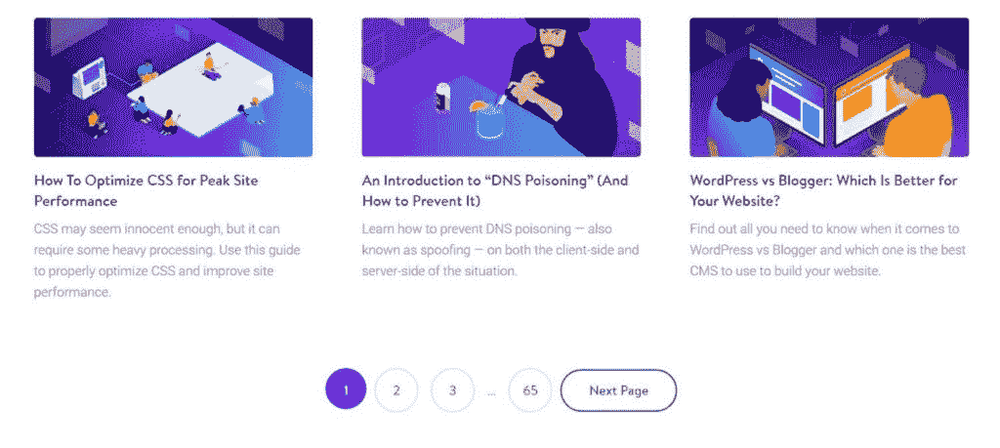

The Kinsta blog provides more pagination options for easier navigation.


当访问者导航到更深的页面时，他们会获得更多的选项，这有助于他们根据需要快速向前或向后跳转到不同的页面。

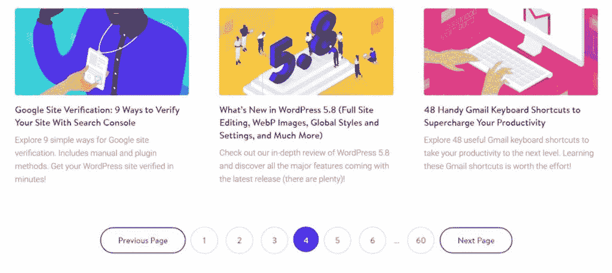

Users get more pagination options as they navigate to deeper pages.


### 更好的性能

使用分页也可以是一种策略，通过限制你的站点需要在每个页面上加载的数据量来提高你的 WordPress 站点的性能。

例如，假设你有 50 篇博文。如果你试图在你的主博客页面上加载全部 50 篇博客文章，你的博客页面可能会加载很慢，因为数据太多了。

但是，如果使用分页将列表分成 5 页，每页 10 篇文章，那么每一页的加载速度会快得多，因为它只需要加载五分之一的数据。

### 改进的搜索引擎优化抓取能力

使用分页还可以让谷歌机器人等搜索引擎机器人更容易通过提供更多的导航链接来抓取你的网站。

这是一个微小的差别，但是你可以做的任何调整来提高你的网站的抓取能力对 SEO 来说总是一件好事。
T3】

## 如何手动控制 WordPress 分页

虽然我们将在下一节讨论一些方便的 WordPress 分页插件，但是你也可以使用一些内置的功能来使用 WordPress 分页。或者，根据您的知识水平，您也可以使用自定义代码来调整分页[。](https://kinsta.com/knowledgebase/edit-wordpress-code/)

让我们以默认的 Twenty Twenty-One 主题为例，讨论一下使用分页的内置选项。

### 控制每页显示多少内容项

默认情况下，WordPress 每页显示 10 篇文章。所以，如果你有 25 篇文章，你总共会有 3 页。前 2 页将显示 10 篇文章，最后一页将显示剩余的 5 篇文章。

如果你想调整这个数字，你可以去**设置>读取**并编辑**博客页面显示最多**的值。

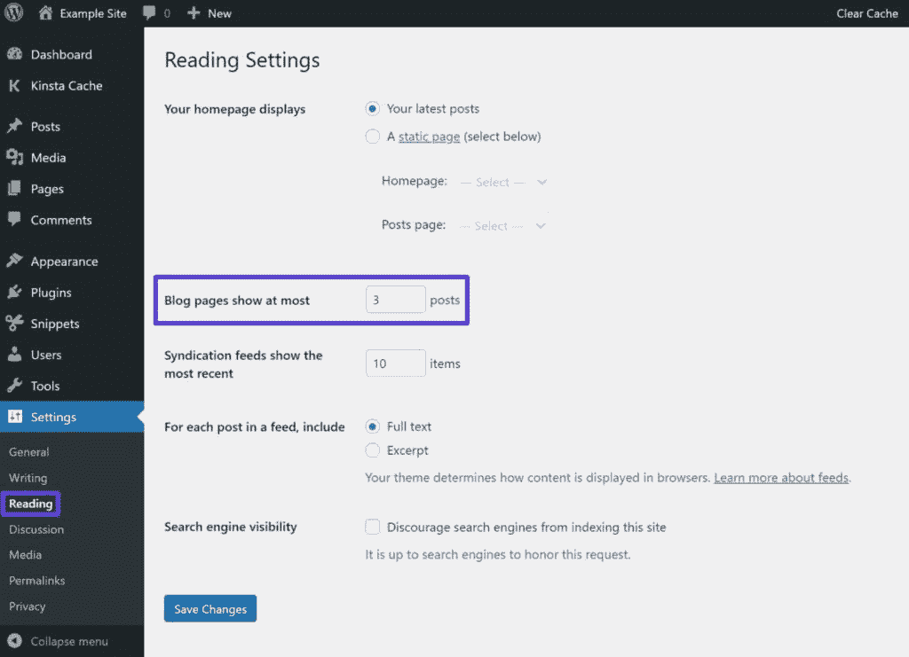

How to change how many posts WordPress displays per page.


### 将一篇 WordPress 文章或页面分成多个页面

到目前为止，我们主要关注于将你的博客列表页面分成多个页面。然而，WordPress 也允许你将单个的文章或页面分成不同的页面，这在某些情况下可能会有帮助。

如果你使用的是 WordPress 块编辑器(又名 Gutenberg) ，你可以使用**分页符**块选择添加分页符的位置。

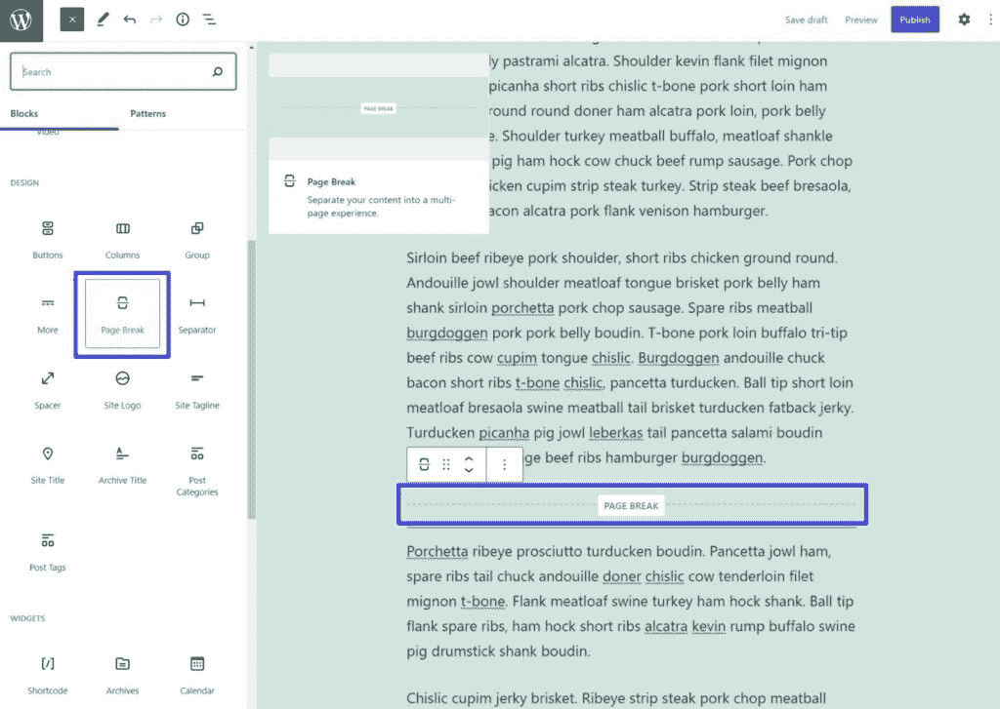

How to add page breaks with the Page Break block.


如果您正在使用经典的 TinyMCE 编辑器，您可以使用以下两种方法之一来选择添加分页符的位置:

1.  将鼠标光标放在编辑器的**可视**选项卡中您想要添加分页符的位置。然后使用下面的键盘快捷键: **Alt + Shift + P** 。
2.  通过将下面的代码片段粘贴到编辑器的**文本**选项卡中，手动放置分页符:`<!--nextpage-->`。

### 使用 PHP 和 CSS 调整 WordPress 分页行为

如果你不是一个非常专业的人，这种方法可能不适合你。您可能想直接跳到分页插件。

然而，如果你愿意对你的站点做一些小的代码调整，你可以使用 PHP 和 CSS 来调整你的主题的分页。

因为你将[编辑你的主题的模板文件](https://kinsta.com/blog/how-to-customize-wordpress-theme/)，你必须使用一个 WordPress 子主题。否则，您的更改将在下次更新主题时被覆盖。我们有一个[关于如何设置儿童主题的详细指南](https://kinsta.com/blog/wordpress-child-theme/)。

我们还建议[在进行任何更改之前备份您的站点](https://kinsta.com/blog/backup-wordpress-site/)。

如果你想手动给任何 WordPress 主题添加分页，你可以使用[_ posts _ pagination 函数](https://developer.wordpress.org/reference/functions/the_posts_pagination/)。例如，下面的代码片段:

```
the_posts_pagination( array(
'mid_size' => 2,
'prev_text' => __( 'Previous Page', 'textdomain' ),
'next_text' => __( 'Next Page', 'textdomain' ),
) );
```

您可以将这个代码片段直接添加到您希望分页出现的子主题的模板文件中。

下面，我们保留了默认的 221 分页，并使用代码片段添加了我们自己的分页来查看不同之处。“第 1 页”分页是主题的默认分页，“1”、“2”、“3”分页来自我们的自定义代码。


An example of the default pagination as well as custom pagination.


下面是代码中的样子——您可以看到原始的分页函数和我们的自定义分页。


The actual code for the example screenshot above.


你想在一个实时的 WordPress 站点上用你的自定义函数替换现有的分页函数(警告:我们建议首先在一个 [staging site](https://kinsta.com/help/staging-environment/) 上这么做。这只是一个例子！).根据你的主题，你可能需要编辑[多个文件](https://kinsta.com/knowledgebase/wordpress-files/)。

你可能会发现通过[FTP 客户端](https://kinsta.com/blog/best-ftp-clients/)连接到你的服务器并使用[专用的 PHP 编辑器](https://kinsta.com/blog/php-editor/)编辑你的主题文件会更方便。

为了调整主题的分页风格，你需要[添加一些自定义 CSS](https://kinsta.com/blog/wordpress-css/) 。
T3】

## 七个最好的 WordPress 分页插件

如果你想对你的站点的分页有更多的控制，你可能更喜欢使用 WordPress 分页插件。以下是 7 个最佳选择。

### 1\. WP-PageNavi

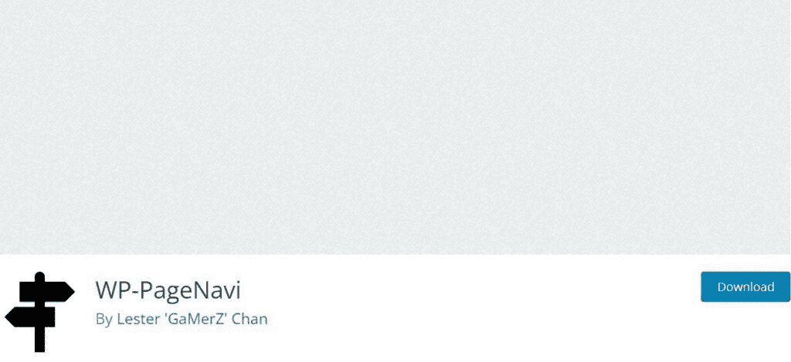

WP-PageNavi WordPress plugin.


活跃在超过 700，000 个网站上的 WP-PageNavi 是最受欢迎的 WordPress 分页插件。它也是 100%免费的，这有助于解释它的受欢迎程度。

## 注册订阅时事通讯


### 想知道我们是怎么让流量增长超过 1000%的吗？

加入 20，000 多名获得我们每周时事通讯和内部消息的人的行列吧！

[Subscribe Now](#newsletter)

它为您提供了一个简单的设置区域，您可以在其中控制站点的分页行为。您可以调整文本、显示多少页码等等。

如果你想对你的分页设计有更多的控制，你也可以考虑 WP Pagenavi 插件的第三方[样式。](https://wordpress.org/plugins/styles-for-wp-pagenavi-addon/)

#### 它是如何工作的

因为 WP-PageNavi 如此受欢迎，一些 [WordPress 主题](https://kinsta.com/best-wordpress-themes/)为插件提供内置支持。如果你的主题有，你需要做的就是激活插件，配置它的设置，然后你就可以开始了。您可以通过进入**设置>页面导航**来访问设置。

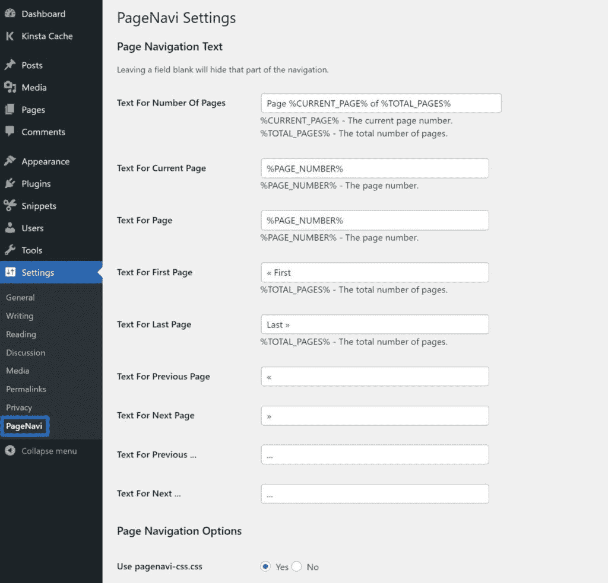

The WP-PageNavi settings area.


然而，如果你的主题不包括内置支持，你将需要[手动编辑你的主题的模板文件](https://kinsta.com/knowledgebase/edit-wordpress-code/)来让插件工作，如果你不是一个非常专业的人，这可能有点复杂。

您需要找到您的主题用于分页的默认代码，并用 WP-PageNavi 的自定义代码片段替换它。开发者在插件的 WordPress.org 页面上解释了如何做到这一点。

### 2.WP-分页


WP-Paginate WordPress plugin.


WP-Paginate 是另一个在你的 WordPress 站点上设置自定义分页的流行插件。除了帮助你给文章分页，你还可以使用插件给[你的评论区](https://kinsta.com/blog/wordpress-comment-plugins/)添加自定义分页，这可以帮助[加快你的评论](https://kinsta.com/blog/wordpress-comments/)。

不像上面的 WP-PageNavi 插件，你不需要直接编辑你的主题模板文件，如果你不是技术人员，这可能是一个更好的选择。对于更高级的用户，您仍然可以选择使用 PHP 在您的主题模板文件中手动放置分页。

使用该插件，您将能够自定义分页的所有方面，包括以下内容:

*   标签和按钮
*   安置
*   要显示多少导航项目

在 WordPress.org 有一个免费版本，应该适用于大多数网站。还有一个 19 美元的高级版本，增加了更多的预设风格和风格选项。

#### 它是如何工作的

要配置插件，可以进入**设置→ WP-Paginate** 控制插件的设置。

如果你想显示插件的分页而不编辑你的主题模板文件，你需要在**位置&位置**设置中做如下选择:

1.  选中 **Everywhere** 框，在需要分页的地方显示您的新分页。
2.  将**位置**下拉框设置为等于内容下方的**。**
3.  选中**隐藏标准分页**框来隐藏你的主题的现有分页。

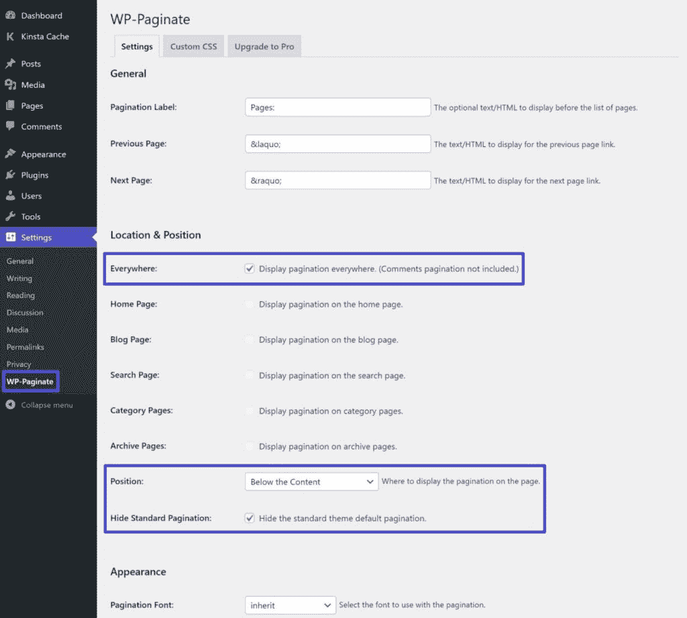

How to configure the WP-Paginate plugin.


### 3.BestWebSoft 分页

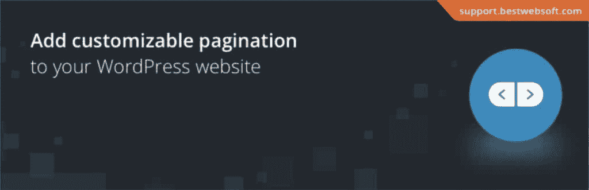

Pagination by BestWebSoft WordPress plugin.


BestWebSoft 的 Pagination 是另一个分页插件，它可以让你在你的站点上添加一个新的分页系统，而不需要编辑你的主题模板文件。

然而，就像上面的 WP-Paginate 插件一样，如果你想更好地控制布局，你仍然可以选择编辑你的主题模板文件。

需要为您的电子商务网站提供超快的、可靠的、完全安全的托管服务吗？Kinsta 提供所有这些服务，并由 WooCommerce 专家提供 24/7 的世界级支持。[查看我们的计划](https://kinsta.com/plans/?in-article-cta)

通过插件的设置，你可以轻松地调整分页的位置、样式和行为。

免费版对大多数网站来说应该很好，但是 20 美元的高级版也增加了更多的分页类型和内置的 Divi 兼容性。

#### 它是如何工作的

要配置插件，请转到仪表板中新的**分页**选项卡。

插件的默认设置将自动隐藏你的主题的现有分页，并用插件的自定义分页替换它。您需要做的只是为新分页的样式和行为配置设置。

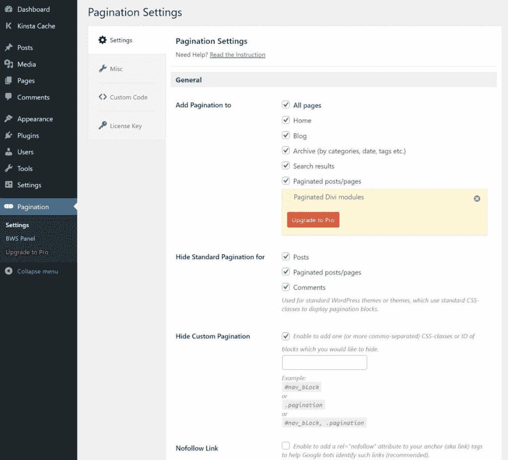

The Pagination plugin’s settings area.


### 4.Ajax 加载更多

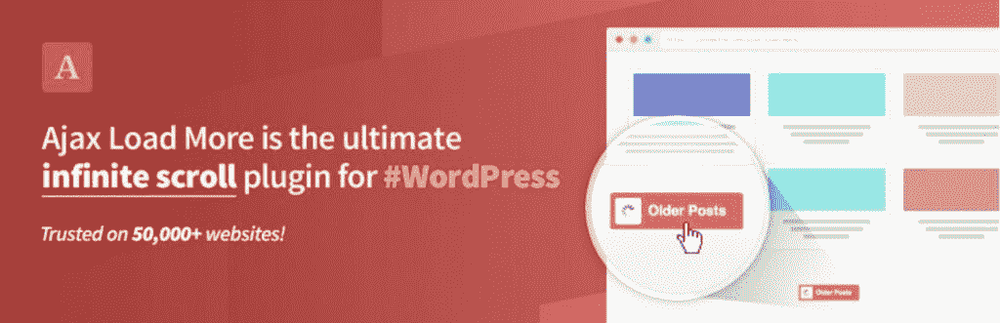

Ajax Load More WordPress plugin.


[Ajax Load More](https://wordpress.org/plugins/ajax-load-more/) 让你创建按钮来加载更多的内容，而不用强迫用户加载新的页面。它为您提供了几个控制分页的选项，包括“传统的”分页和一些独特的变化。

如果您愿意购买一些高级附加组件，您可以添加实际的分页按钮。当用户移动到一个新页面时，他们不会感觉到页面在重新加载，但是 URL 会改变(这对 SEO 有好处)。你可以[在这里](https://connekthq.com/plugins/ajax-load-more/examples/seo-paging-add-ons/)看到这个的现场演示。

Ajax Load More 允许您用免费版的“Load More”按钮替换分页。Ajax Load More 不是添加访问者可以用来导航到不同页面的分页链接，而是让您添加一个“Load More”按钮来显示更多帖子，而无需重新加载页面。你可以[在这里](https://connekthq.com/plugins/ajax-load-more/examples/default/)看到这个的现场演示。

#### 它是如何工作的

Ajax Load More 插件通过创建一个包含所需设置的新文章列表来工作，而不是给现有文章列表添加分页。为此，您将使用 WordPress 仪表盘中的 **Ajax Load More** 区域。

如果您想设置传统分页，请确保购买并安装分页插件。

### 5.字母分页


Alphabetic Pagination WordPress plugin.


[字母分页](https://wordpress.org/plugins/alphabetic-pagination/)插件帮助你在你的站点上实现不同类型的分页——A-Z 列表。

字母分页让您为字母表中的每个字母创建一个分页选项，而不是按数字分页和按发布日期排序文章。然后，如果用户点击一个特定的字母，他们将看到以该字母开头的所有内容。

#### 它是如何工作的

要使用该插件，请前往**设置>字母分页**来配置其设置。

在插件设置的**常规**标签中，您可以配置在哪里显示您的字母分页。

使用 **Auto** 实现是最简单的选择。但是，您也可以使用[短码](https://kinsta.com/blog/wordpress-shortcodes/)或**短码**标签中的 PHP 函数手动放置您的字母分页。

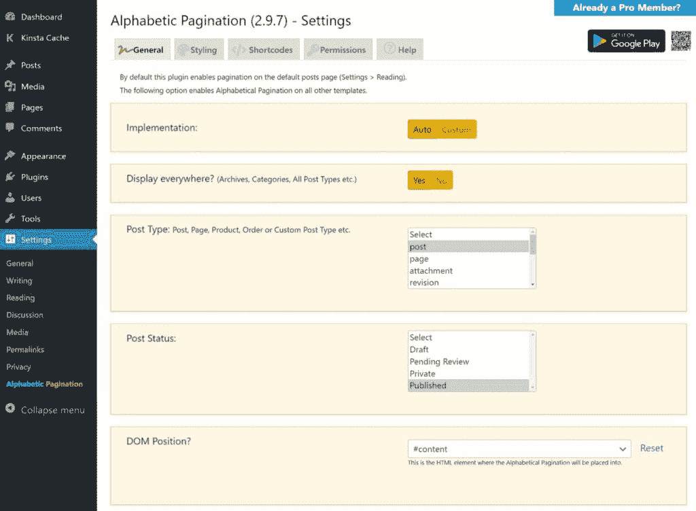

How to configure the placement of your alphabetic pagination.


一旦配置好位置，就可以从**样式**选项卡控制字母分页的设计。

### 6.WP 展示帖子

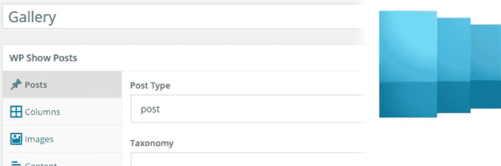

WP Show Posts WordPress plugin.


WP Show Posts 是一个有用的插件，可以让你创建自己的帖子列表，包括自定义分页。

这是关键的细节——你不是在现有的博客文章列表中添加分页。相反，你正在创建一个**新的**博客文章列表，其中包括你自己的分页设置。

该插件还包括一个灵活的[查询构建器](https://kinsta.com/blog/wp-query/)，这样你就可以准确地选择显示哪些文章(以及你想对哪些文章分页)。

#### 它是如何工作的

一旦你激活插件，你可以去 **WP 显示帖子>添加新的**来创建一个新的帖子列表。

我们建议浏览所有设置，以控制要显示的内容。设置分页时，勾选**帖子**选项卡中的**分页**框，设置每页**帖子的数量**。

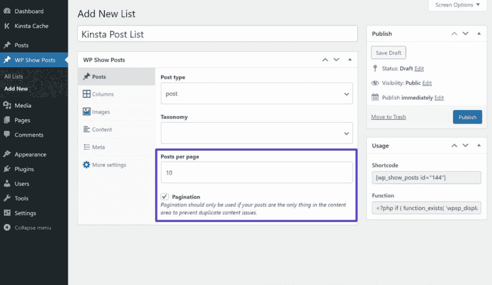

How to create a new post list with pagination.


一旦你设置好了一切，你就可以使用它的 shortcode 或 PHP 函数来添加你的文章列表。

### 7.WooCommerce 的分页样式器

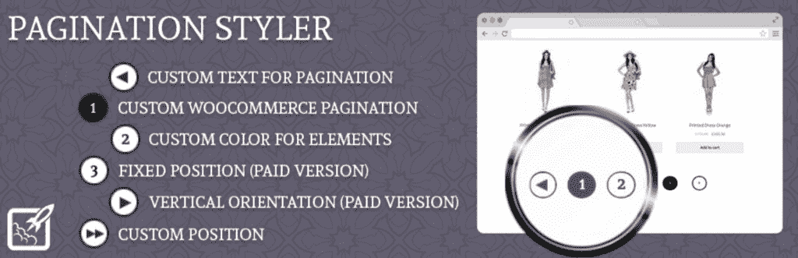

Pagination Styler for WooCommerce WordPress plugin.


顾名思义，[Pagination Styler for woo commerce](https://wordpress.org/plugins/pagination-styler-for-woocommerce/)是一款专门针对 [WooCommerce 店铺](https://kinsta.com/blog/woocommerce-tutorial/)的分页插件。

它为您提供了许多控制商店产品分页定位和风格的新选项。您还可以从完全不同的布局中进行选择，比如用垂直分页代替传统的水平分页。

#### 它是如何工作的

WooCommerce 分页样式器的工作原理是用插件的分页替换现有的 WooCommerce 分页。

要配置插件的设置，你可以在你的 WordPress 仪表盘中进入 **BeRocket >分页样式器**:

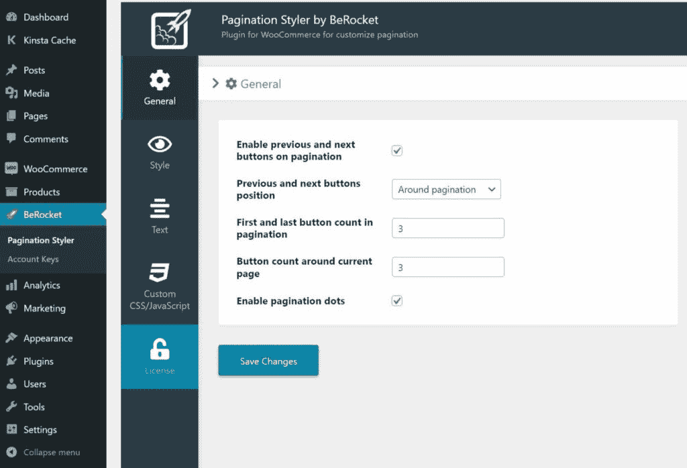

The Pagination Styler for WooCommerce settings area.


[调整你网站的分页可以帮助你创建一个更加用户友好、易于导航的网站，但是许多 WordPress 主题并没有提供详细的选项😅这个指南是来帮助你的！💪](https://twitter.com/intent/tweet?url=https%3A%2F%2Fkinsta.com%2Fblog%2Fwordpress-pagination%2F&via=kinsta&text=Adjusting+your+site%27s+pagination+can+help+you+create+a+more+user-friendly%2C+easily+navigable+website%2C+but+many+WordPress+themes+don%27t+offer+detailed+options+%F0%9F%98%85+This+guide+is+here+to+help%21+%F0%9F%92%AA&hashtags=WPTips%2CWordPress)

## 摘要

分页可以让你将 WordPress 站点的内容分成多个页面。这可以使人类和搜索引擎更容易导航，也可以通过在每个页面上加载更少的数据来提高性能。

所有的 WordPress 站点都有现成的分页支持。然而，大多数主题中的默认分页系统是有限的。

为了改进 WordPress 分页，你可以添加你的自定义代码或者使用我们上面详述的 7 个 WordPress 分页插件中的一个。

*还有关于 WordPress 分页的问题吗？请在下面的评论中分享你的想法！*

* * *

让你所有的[应用程序](https://kinsta.com/application-hosting/)、[数据库](https://kinsta.com/database-hosting/)和 [WordPress 网站](https://kinsta.com/wordpress-hosting/)在线并在一个屋檐下。我们功能丰富的高性能云平台包括:

*   在 MyKinsta 仪表盘中轻松设置和管理
*   24/7 专家支持
*   最好的谷歌云平台硬件和网络，由 Kubernetes 提供最大的可扩展性
*   面向速度和安全性的企业级 Cloudflare 集成
*   全球受众覆盖全球多达 35 个数据中心和 275 多个 pop

在第一个月使用托管的[应用程序或托管](https://kinsta.com/application-hosting/)的[数据库，您可以享受 20 美元的优惠，亲自测试一下。探索我们的](https://kinsta.com/database-hosting/)[计划](https://kinsta.com/plans/)或[与销售人员交谈](https://kinsta.com/contact-us/)以找到最适合您的方式。*