# 剖析 WordPress TinyMCE 编辑器

> 原文:# t0]https://kinta . com/blog/WordPress-tinymce-editor/

这是两篇致力于 WordPress 编辑的文章的第二部分。第一篇文章是关于 [WordPress 文本编辑器](https://kinsta.com/blog/wordpress-text-editor/)的，而在这篇文章中，我们将剖析 WordPress TinyMCE 编辑器，我们将按照我们的意愿对其进行修改。请遵循以下内容，我们将向您展示如何:

*   [添加自定义样式到 WordPress TinyMCE 编辑器](#custom_styles)
*   [激活隐藏按钮](#hidden_buttons)
*   [用现有插件增强 WordPress TinyMCE 编辑器](#existing_plugins)
*   [开发定制的 WordPress TinyMCE 插件](#custom_plugins)
*   使用免费的 WordPress 插件给 TinyMCE 添加样式和按钮

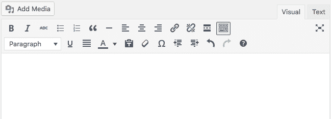

TinyMCE is a browser-based WYSIWYG editor written in JavaScript and released as open source software under [LGPL](https://en.wikipedia.org/wiki/LGPL)


## WordPress 浏览器编辑器

**更新** : WordPress 5.0 将改变我们撰写和发布内容的方式。一定要看看我们的指南:[WordPress 5.0 的新功能(如何准备古腾堡)](https://kinsta.com/blog/wordpress-5-0/)

默认情况下，WordPress 的 [TinyMCE 编辑器](https://www.tinymce.com/)提供了两行按钮来创建、编辑和格式化文章内容。第一行(主工具栏)包括样式和格式功能。附加控件允许添加、编辑和删除锚点，添加 **<！–more—>**标签，激活免分心模式。所有这些按钮对任何有文字处理器基础知识的人来说都应该很熟悉。

工具栏切换按钮切换高级编辑器工具栏(第二行按钮)，它提供了一个包含文本元素(段落、标题和预格式化文本)的下拉菜单、更多样式控制和一些附加功能(粘贴为文本、清除格式、特殊字符、撤消和重做)，这些功能在许多方面都很方便。


The Special characters table allow users to quickly add HTML entities


最后，问号按钮提供了一个键盘快捷键列表，可以改善用户的书写体验。

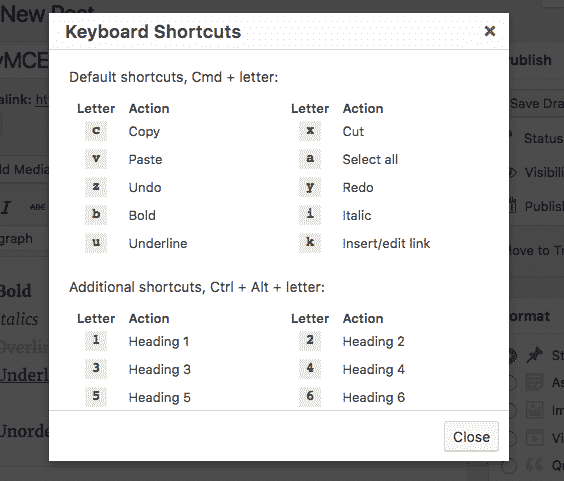

The TinyMCE shortcuts panel


现在，将您的内容添加到可视化编辑器中，然后切换到[文本编辑器](https://kinsta.com/blog/best-text-editors/)。你会发现相应的 HTML 结构，因为当从可视模式切换到文本模式时，WordPress 会保存你的输入。


> Kinsta 把我宠坏了，所以我现在要求每个供应商都提供这样的服务。我们还试图通过我们的 SaaS 工具支持达到这一水平。
> 
> <footer class="wp-block-kinsta-client-quote__footer">
> 
> 
> 
> <cite class="wp-block-kinsta-client-quote__cite">Suganthan Mohanadasan from @Suganthanmn</cite></footer>

[View plans](https://kinsta.com/plans/)

默认的主工具栏和高级工具栏提供了大量的功能，这些功能可以通过添加按钮和控件来扩展。TinyMCE 中的许多按钮都是现成的，我们只需要激活它们就可以让它们发挥作用。此外，我们可以通过安装一个或多个现有插件来添加许多高级功能。

如果所有这些按钮还不够，我们可以通过开发定制插件，用你最酷的功能来增强编辑器。

也就是说，让我们从 API 最简单和最常见的用法开始。


## 向 WordPress TinyMCE 编辑器添加自定义样式

假设您需要提供一种简单的方法，从 TinyMCE 向帖子内容添加自定义样式。这是一个两步程序:

*   首先，我们需要激活一个名为 Styleselect 的隐藏下拉菜单，
*   然后，我们必须定义我们想要添加到样式选择菜单中的每个样式。

我们可以通过过滤 TinyMCE 按钮的数组来完成第一个任务。默认工具栏显示一行或两行按钮，但是我们可以启用多达四行工具栏，这要归功于[以下过滤器](https://codex.wordpress.org/Plugin_API/Filter_Reference/mce_buttons,_mce_buttons_2,_mce_buttons_3,_mce_buttons_4):

*   **mce_buttons** 过滤主工具栏按钮(第一行)，总是可见的；
*   **mce_buttons_2** 过滤高级工具栏按钮(第二行)，用户可以切换打开/关闭；
*   **mce_buttons_3** 默认不活动；
*   **mce_buttons_4** 默认不活动。

我们可以将一个回调函数挂接到这些过滤器中的一个来显示/隐藏现有的按钮，就像 Styleselect 下拉菜单一样。以下功能启用第二行中的菜单:

```
function my_mce_buttons_2( $buttons ) {
	array_unshift( $buttons, 'styleselect' );
	return $buttons;
}
add_filter( 'mce_buttons_2', 'my_mce_buttons_2' ); 
```

[array_unshift](http://php.net/manual/en/function.array-unshift.php) PHP 函数将 **styleselect** 元素前置到 **$buttons** 数组的前面。

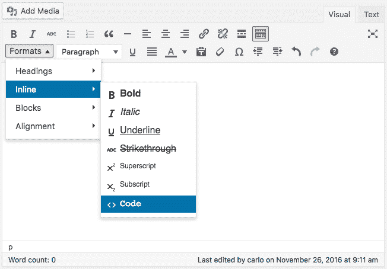

The Format dropdown menu will show a list of all available CSS styles


现在按钮已经被激活，我们可以通过 **tiny_mce_before_init** 过滤器过滤 TinyMCE 配置参数数组来注册我们的定制样式。
考虑以下函数:

```
function my_tiny_mce_before_init( $mceInit ) {
	$style_formats = array(
		array(
			'title' => 'PHP',
			'block' => 'code',
			'classes' => 'language-php'
		)	
	);
	$mceInit['style_formats'] = json_encode( $style_formats );	
	return $mceInit;    
}
add_filter( 'tiny_mce_before_init', 'my_tiny_mce_before_init' ); 
```

**style_formats** 元素是 JSON 编码的元素数组。每个元素设置单个菜单项的配置参数。上面的函数用一个定制元素替换了默认样式，这个定制元素将选中的文本包装在一个 **code.language-php** 元素中。

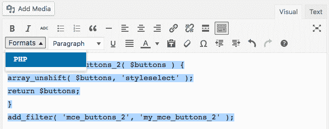

The Styleselect dropdown menu containing a single custom item


在我们的示例中，我们为单个菜单项设置了三个属性:

*   **标题**:菜单项的标题；
*   **块**:要生成的块元素；
*   **classes** :应用于选择的 CSS 类的空格分隔列表。

我们将 **code** 元素添加为 block，这样它将只应用于整个选择一次。将其作为**内联**元素添加会将代码标签应用到每一行。

我们可以添加更多项目，并按类别对它们进行分组，如下例所示:

```
function my_tiny_mce_before_init( $mceInit ) {
	$style_formats = array(
		array(
			'title' => 'Code language',
			'items' => array(
				array(
					'title' => 'PHP',
					'block' => 'code',
					'classes' => 'language-php'
				),
				array(
					'title' => 'CSS',
					'block' => 'code',
					'classes' => 'language-css'
				),
				array(
					'title' => 'HTML',
					'block' => 'code',
					'classes' => 'language-html'
				)
			)
		)	
	);

	$mceInit['style_formats'] = json_encode( $style_formats );

	return $mceInit;    
}
add_filter( 'tiny_mce_before_init', 'my_tiny_mce_before_init' ); 
```

**style_formats** 元素是一个多维参数数组。在这个例子中，我们添加了第一级项目(代码语言)和三个子项目(PHP、CSS、HTML)。下图显示了生成的菜单。

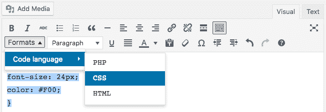

We can group menu items and reduce the menu size on the screen


TinyMCE 将样式应用于所选的元素，但是不知道这些样式，所以它们不会应用于编辑器中的内容。如果需要实时预览，我们必须用 [add_editor_style()](https://developer.wordpress.org/reference/functions/add_editor_style/) 函数注册一个定制样式表:

```
/**
 * Registers an editor stylesheet for a custom theme.
 */
function my_theme_add_editor_styles() {
	add_editor_style( 'css/my-editor-style.css' );
}
add_action( 'admin_init', 'my_theme_add_editor_styles' ); 
```

这个函数注册了一个样式表，WordPress TinyMCE 将使用它将内容样式化到编辑器中。作为一个例子，假设我们想要对 PHP、CSS 和 HTML 代码应用不同的颜色。为了完成这项任务，我们将把以下声明添加到 **css/my-editor-style.css** 样式表中:

```
.language-php{ color: red; }
.language-css{ color: green; }
.language-html{ color: blue; } 
```

TinyMCE 将产生下图所示的输出。

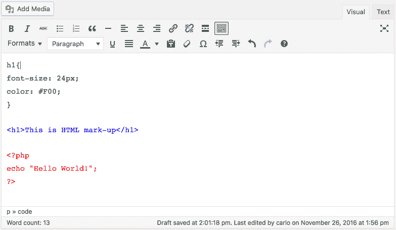

> 注意:我们只看了几个配置设置，但是 TinyMCE API 让开发人员可以很好地控制编辑器。关于元素和属性的完整列表，请参见 TinyMCE 文档。

## 启用隐藏按钮

我们可以用几种方法在可视化编辑器中添加按钮。在很多情况下，我们不需要构建自定义按钮，因为 TinyMCE 提供了很多隐藏按钮，我们可以很容易地激活它们。
这些按钮中的一个是**样式选择**下拉菜单，但是我们有一个很长的非活动按钮列表，我们可以通过 **mce_buttons_{n}** 过滤器之一过滤按钮阵列来激活它(参见 TinyMCE 文档以获得[可用按钮的完整列表](https://www.tinymce.com/docs-3x/reference/buttons/))。

考虑下面的例子:

## 注册订阅时事通讯


### 想知道我们是怎么让流量增长超过 1000%的吗？

加入 20，000 多名获得我们每周时事通讯和内部消息的人的行列吧！

[Subscribe Now](#newsletter)

```
function my_mce_buttons_3( $buttons ) {	
	$buttons[] = 'superscript';
	$buttons[] = 'subscript';
	return $buttons;
}
add_filter( 'mce_buttons_3', 'my_mce_buttons_3' ); 
```

上面的回调函数将**上标**和**下标**元素添加到数组 **$buttons** 的末尾。

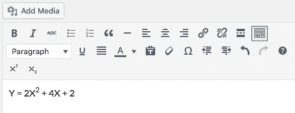

The image shows two extra buttons added to the third row of TinyMCE toolbar


以下是 WordPress TinyMCE 中可用的隐藏按钮列表:

*   **切**
*   **复制**
*   **粘贴**
*   **小时**
*   **格式选择**
*   **字体选择**
*   **字体大小选择**
*   **样式选择**
*   **下标**(原**子**)
*   **上标**(原 **sup** )
*   **背景色**
*   **newdocument**

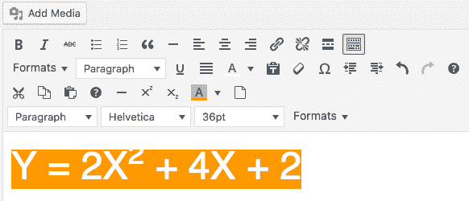

The image shows the TinyMCE toolbar full of all the available buttons


如果这些按钮都不符合我们的需求，我们可以为编辑器提供更多的功能，这要感谢大量的官方插件。

## 用 TinyMCE 插件增强可视化编辑器

假设你的目标是通过一个 WordPress 插件将 [TinyMCE 表格按钮](https://www.tinymce.com/docs-3x/reference/plugins/Plugin3x@table/)包含到可视化编辑器中。

首先你要从 [TinyMCE 网站](https://www.tinymce.com/download/)下载 Dev 包。解压 zip 文件，从 **/js/tinymce/plugin/table** 文件夹中获取 **plugin.min.js** 文件。

在 **/wp-content/plugins** 中创建以下文件夹:

*   /WP-content/plugins/tinymce-example-plugin/
*   /WP-content/plugins/tinymce-example-plugin/MCE/table

完成后，在插件根文件夹中创建一个新的**tinymce-example-plugin.php**文件，并将 **plugin.min.js** 文件上传到表格文件夹中(见下图)。

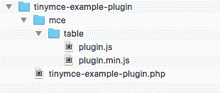

The image shows the plugin file structure


现在将以下几行添加到**tinymce-example-plugin.php**中:

```
<?php
/**
 * @package TinyMCE_example_plugin
 * @version 1.0
 */
/*
Plugin Name: TinyMCE example plugin
Plugin URI: http://wordpress.org/extend/plugins/#
Description: This is an example plugin 
Author: Your Name
Version: 1.0
Author URI: http://yourdomain.com/
*/ 
```

为了将表格按钮包含到 WordPress TinyMCE 编辑器中，我们只需要两个过滤器:
**mce_buttons** 向 TinyMCE 主工具栏添加新按钮(我们可以使用任何一个 **mce_buttons_{n}** 过滤器，这取决于按钮要显示的行)
**mce_external_plugins** 加载一个外部 TinyMCE 插件。

Struggling with downtime and WordPress problems? Kinsta is the hosting solution designed to save you time! [Check out our features](https://kinsta.com/features/)

下面是插件文件的代码:

```
function example_plugin_register_buttons( $buttons ) {
   $buttons[] = 'table';
	return $buttons;
}
// add new buttons
add_filter( 'mce_buttons', 'example_plugin_register_buttons' );

function example_plugin_register_plugin( $plugin_array ) {
   $plugin_array['table'] = plugins_url( '/mce/table/plugin.min.js', __FILE__ );
   return $plugin_array;
}
// Load the TinyMCE plugin
add_filter( 'mce_external_plugins', 'example_plugin_register_plugin' ); 
```

第一个函数向主工具栏添加一个新按钮，而第二个函数从指定的 URL 加载一个插件。函数的作用是:在插件目录下获取指定文件的绝对 url(更多信息请阅读[的抄本](https://codex.wordpress.org/Function_Reference/plugins_url))。

现在我们可以保存文件并激活插件。下图显示了增强的工具栏。

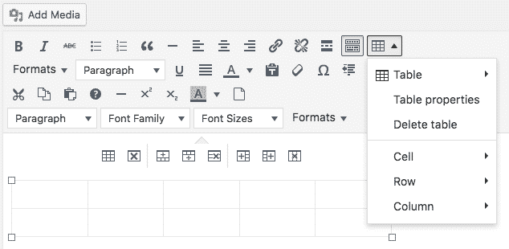

仅此而已。按照同样的步骤，我们可以将任何现有的 TinyMCE 插件添加到 WordPress 可视化编辑器中。

你可以下载[这个插件。zip 文件](https://kinsta.com/wp-content/uploads/2016/12/tinymce-example-plugin.zip)，或者在 Gist 上查看[这个例子的 PHP 代码。](https://gist.github.com/carlodaniele/0c63b192be42665d4143cdb5412e570a)

## 构建 TinyMCE 插件

最后，我们可以构建我们的 TinyMCE 定制插件。假设您想要添加一个按钮，以允许用户将所选内容包装在以下标记中:

```
<pre><code>Selected text</code></pre>
```

我们甚至可以决定给 **<代码>** 标签添加一个 CSS 类，为[棱镜](http://prismjs.com/)代码荧光笔提供支持。我们需要:

*   在 WordPress 插件中注册一个自定义的 TinyMCE 按钮和插件；
*   开发 TinyMCE 插件；

我们已经知道如何在 WordPress TinyMCE 中注册一个插件和添加一个按钮:

```
function example_plugin_register_buttons( $buttons ) {
	$buttons[] = 'prism';
	return $buttons;
}
// add new buttons
add_filter( 'mce_buttons', 'example_plugin_register_buttons' );

function example_plugin_register_plugin( $plugin_array ) {
	$plugin_array['prism'] = plugins_url( '/mce/prism/plugin.js', __FILE__ );
	return $plugin_array;
}
// Load the TinyMCE plugin
add_filter( 'mce_external_plugins', 'example_plugin_register_plugin' ); 
```

这与上一个例子的代码完全相同，唯一的区别是现在我们注册了一个名为 **prism** 的自定义插件。
现在让我们创建下面的 **plugin.js** 文件:

```
(function() {
	var languages = ['css', 'php', 'html', 'javascript'];

	tinymce.PluginManager.add( 'prism', function( editor ){

		var items = [];

		tinymce.each( languages, function( languageName ){
			items.push({
				text: languageName,
				onclick: function(){
					var content = tinyMCE.activeEditor.selection.getContent();
					editor.insertContent( '<pre><code class="language-' + languageName + '">' + content + '</code></pre>' );
				}
			});
		});

		editor.addButton( 'prism', {
			type: 'menubutton',
			text: 'Prism',
			icon: 'code',
			menu: items
		});

	});
})(); 
```

这个代码也可以在 Gist 上找到。

深入 TinyMCE APIs 不是我们的目标，您可以在 [TinyMCE 开发者文档](https://www.tinymce.com/docs/demo/)中找到您需要知道的所有内容。
这个文件应该放在我们插件目录的 **/mce/prism/** 子文件夹中。JS 函数在 languages 数组的元素之间进行迭代，并将一个新对象推送到每种语言的 items 数组中。addButton 方法创建棱柱菜单按钮，并为 items 数组的每个元素添加一个菜单项。

保存，上传和刷新，你华丽的下拉菜单按钮将弹出其所有的美丽。

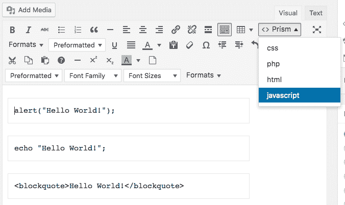

关于如何开发 TinyMCE 插件的更多信息可以在[面向开发者的在线文档](https://www.tinymce.com/docs/advanced/creating-a-plugin/)中找到。

## WordPress 的 TinyMCE 高级插件

如果您不是开发人员，也可以增强可视化编辑器。TinyMCE Advanced 是一个免费的 WordPress 插件，它将 15 个 TinyMCE 插件的功能带到了默认的可视化编辑器中。

多亏了 TinyMCE，高级用户可以在编辑器工具栏的四行中添加、删除、重新排列按钮。此外，该插件提供了一个选项来启用工具栏上方的菜单。

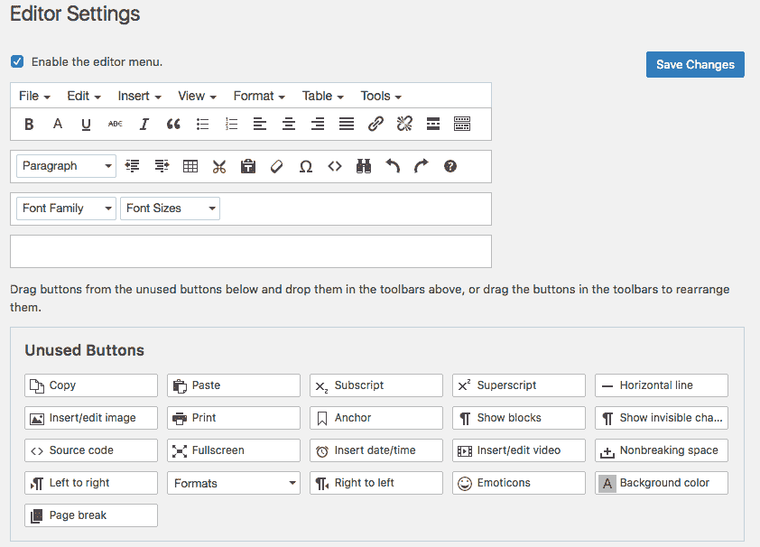

From the editor settings page we can add, remove and arrange buttons on TynyMCE toolbar


从插件选项页面我们可以启用几个高级功能，像**表格**按钮、**字体系列**和**字体大小**菜单、**显示块**和**显示不可见字符**按钮。

其他选项允许用户确定将受新设置影响的编辑器，等等。

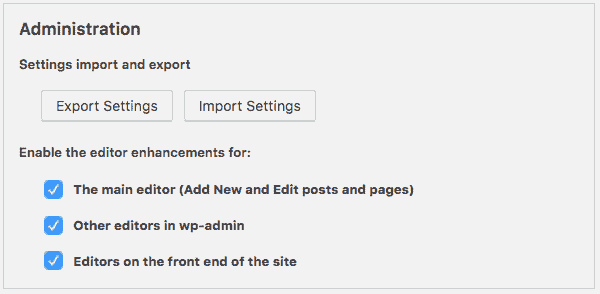

TinyMCE Advanced provides a comprehensive list of editor settings


## 结论

TinyMCE API 提供了很多可以使用的东西。我们可以激活隐藏的功能或注册外部插件。如果没有一个可用的特性满足我们的需求，我们可以从 API 中获得乐趣，并构建定制的扩展。你对增强 WordPress TinyMCE 编辑器有什么进一步的想法吗？

* * *

让你所有的[应用程序](https://kinsta.com/application-hosting/)、[数据库](https://kinsta.com/database-hosting/)和 [WordPress 网站](https://kinsta.com/wordpress-hosting/)在线并在一个屋檐下。我们功能丰富的高性能云平台包括:

*   在 MyKinsta 仪表盘中轻松设置和管理
*   24/7 专家支持
*   最好的谷歌云平台硬件和网络，由 Kubernetes 提供最大的可扩展性
*   面向速度和安全性的企业级 Cloudflare 集成
*   全球受众覆盖全球多达 35 个数据中心和 275 多个 pop

在第一个月使用托管的[应用程序或托管](https://kinsta.com/application-hosting/)的[数据库，您可以享受 20 美元的优惠，亲自测试一下。探索我们的](https://kinsta.com/database-hosting/)[计划](https://kinsta.com/plans/)或[与销售人员交谈](https://kinsta.com/contact-us/)以找到最适合您的方式。