# 30 个关于我们的明星页面的例子

> 原文：<https://kinsta.com/blog/about-us-page/>

仅仅向消费者推销你的产品是不够的。你也需要赢得他们的信任。

一种方法是解释你是谁，你的公司是什么。最简单和最有效的方法是使用“关于我们”页面。

你可能偶然发现了一堆关于我们的网页，但是你怎么知道哪些是最有效的呢？

在本帖中，我们将分享一些针对特定领域的最有效的[关于我们的页面](https://kinsta.com/about-us/)，并解释为什么它们如此有影响力。

在我们开始之前，让我们看一下关于我们页面的概述，并剖析一个常用的模板。

## 什么是“关于我们”页面？

“关于我们”页面旨在分享企业的故事和历史，并与客户建立更深层次的联系。

消费者想知道他们所支持的品牌背后的团队。一个关于我们的网页提供了完美的房地产，拉开帷幕，揭示谁在幕后工作。

> Kinsta 把我宠坏了，所以我现在要求每个供应商都提供这样的服务。我们还试图通过我们的 SaaS 工具支持达到这一水平。
> 
> <footer class="wp-block-kinsta-client-quote__footer">
> 
> 
> 
> <cite class="wp-block-kinsta-client-quote__cite">Suganthan Mohanadasan from @Suganthanmn</cite></footer>

[View plans](https://kinsta.com/plans/)

然而，最重要的是,“关于我们”页面促进了消费者和商家之间的信任。

超过 33%的消费者表示，在决定支持哪些企业时，“信任”是一个核心因素。

通过“关于我们”页面，您可以开始与客户建立情感关系，并在更深层次上与他们互动。

那么如何才能创造出一个能引起共鸣的呢？让我们看看您需要在“关于我们”页面中包含的一些组件。

[想向所有潜在的网站访问者介绍自己吗？👀这些关于我们的页面是一个完美的灵感✨ 点击推文](https://twitter.com/intent/tweet?url=https%3A%2F%2Fkinsta.com%2Fblog%2Fabout-us-page%2F&via=kinsta&text=Want+to+introduce+yourself+to+any+and+all+potential+site+visitors%3F+%F0%9F%91%80+These+About+Us+pages+are+a+perfect+inspiration+%E2%9C%A8&hashtags=Startup%2CEntrepreneur)

## 如何写一个关于我们的网页

关于我们的最佳页面分享公司和创始人的故事。这是一个揭开业务帷幕并展示实现这一目标的人的机会。

一些最有效的关于我们的页面:

*   在更深的层次上将消费者与企业联系起来
*   提供创始人创建企业的背景知识
*   分享企业的核心价值观、使命、信念和愿景
*   回答消费者可能对企业提出的任何问题

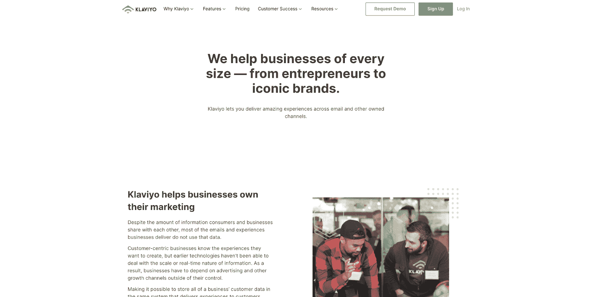

The About Us page is a vital element of your business website.

您如何通过“关于我们”页面实现这些目标？首先，让我们来看一个推动成功的常用“关于我们”页面模板。

### 关于我们页面模板

“关于我们”页面有四个主要部分:

**1。分享公司成立的原因**

这是你关注公司“为什么”的机会这可能是你从市场上的其他竞争者中脱颖而出的原因。

分享你获得创业灵感的时刻，以及你创业的动机。

**2。强调你的背景和你的创始团队的角色**

你是谁？为什么这个时候你是领导公司的合适人选？分享你的背景和个人故事。那会把你和你的顾客联系起来。

**3。记录公司的发展**

陈述从障碍到产品改进的一切。让你的新客户跟上速度。今天公司在哪里？和以前的地方有什么不同？

**4。记录使命和愿景**

你的公司想解决什么？它要去哪里？在“关于我们”页面的最后，详细说明您将业务转变为最终愿景的步骤。

有了这四个组成部分，你将创建一个恒星关于我们的网页，将哇前景和转换新客户。

将这些元素与正确的网站构建器和适当的页面设计结合起来，将帮助你[将访问者转化为客户](https://kinsta.com/blog/conversion-rate-optimization-tips/)。

记住你的顾客想要什么也很重要。

你的目标受众中的用户希望看到你的使命陈述、社交证明和使用你产品的例子。“关于我们”网页上的这些元素将会赢得目标受众的信任。

现在，让我们来看看一些支持这些组件并将其应用到生活中的公司。

## 30 个关于我们的页面示例(按行业)

无论你在哪个行业，你都可以在你的网站上使用关于我们的页面。

虽然上面列出的四个组件对于每个“关于我们”页面都是必需的，但不同的行业有时会采用不同的方法。

下面，你会发现 30 个按行业分类的关于我们的最佳页面。从他们的成功中学习，并在创建自己的成功时采用他们的一些策略。

### 科技公司

HubSpot、Buffer 和 Vidyard 是三家拥有令人惊叹的美国页面的科技公司。

#### 轮毂点

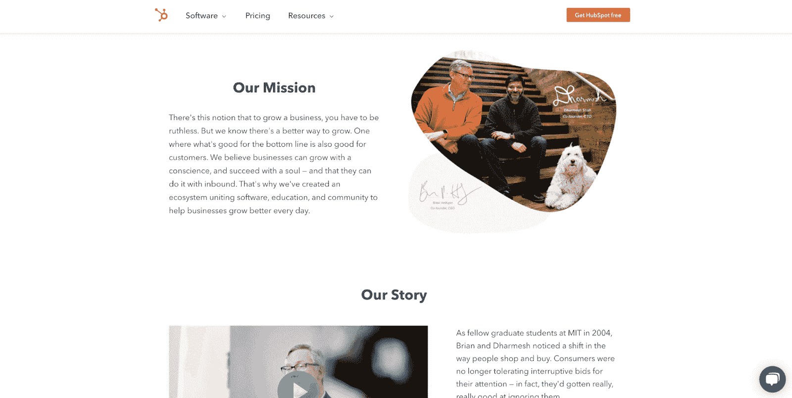

Hubspot’s About Us page is a critical piece of its website.

HubSpot 的[关于我们页面](https://www.hubspot.com/our-story)以它的使命开始，直接进入公司的故事。此外，该页面还提供了一段首席执行官的视频，讨论了他与 Hubspot 创始人的最初互动以及他对公司未来发展的愿景。

HubSpot 通过在“关于我们”页面上添加一段视频，吸引潜在客户浏览他们可能渴望消费的新媒体。

#### 缓冲器

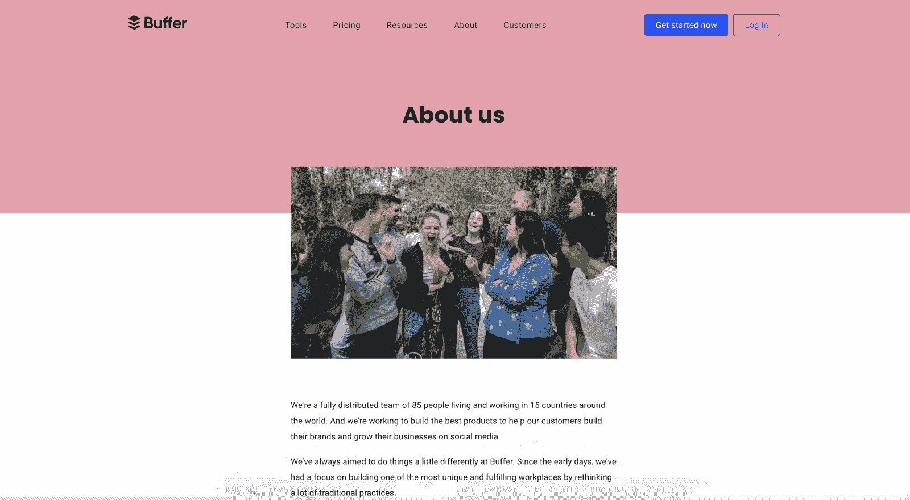

Buffer About Us page.

Buffer 的[关于我们页面](https://buffer.com/about)聚焦于技术背后的团队。当你点击页面时，一个吸引人的标题并不会向你致意。相反，你会看到一张 [Buffer](https://kinsta.com/blog/content-marketing-ninja/#automate-content-distribution) 团队成员的照片，他们为创造其产品做出了贡献。

这是一个很好的方式来展示整个组织，体现真正的合作精神。企业可以突出强调每天为产品提供动力并创造奇迹的团队，而不是只关注创始人。

#### 维德亚德

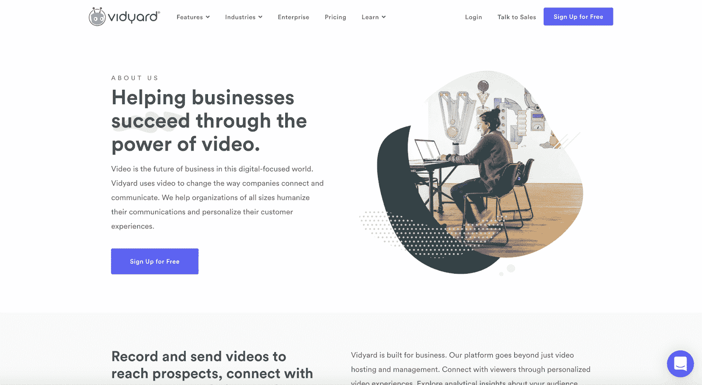

Vidyard About Us page

Vidyard 的[关于我们的页面](https://www.vidyard.com/about/)以突出其使命的标题开始，并直接进入其产品的核心功能。该页面有一个产品演示视频，您在漫步时会偶然发现，展示了其他的使用案例。最后，介绍领导团队。

这种对“关于我们”页面的高级方法将主要焦点放在产品的优势上，而将次要焦点放在团队上。如果您的产品很复杂，这可能是您应该考虑的一种方法。

### 消费品行业

RXBAR、The Sill 和 Hydrant 是消费品公司有效利用“关于我们”页面讲述他们的故事的三个例子。

#### RXBAR

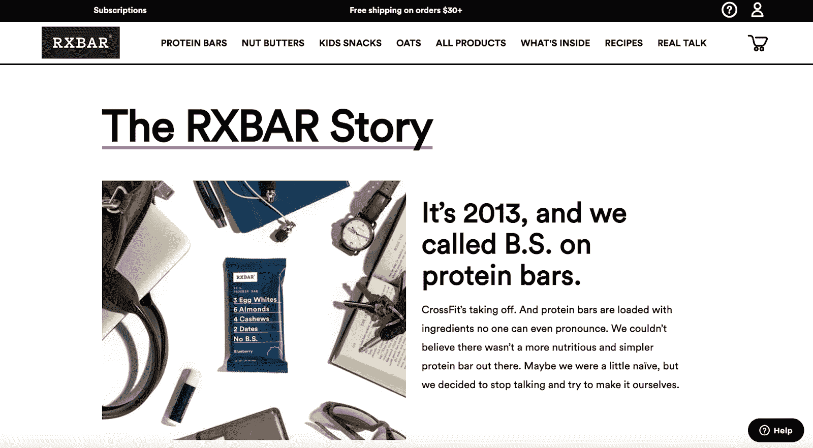

RXBAR About Us page.

RXBAR 的[关于美国页面](https://www.rxbar.com/our-story)围绕公司的历史，可以追溯到 2013 年。醒目的标题通过突出公司的理念吸引读者。

“现在是 2013 年，我们在蛋白质棒上打了电话给 B.S，”它说。

读者可以通过“过去和现在”滑块继续发现更多关于品牌和公司发展的信息。滑块是一个值得考虑的极好的多媒体选项。它让消费者了解你公司的历史，而不会占用页面太多的空间。

#### 窗台

The Sill About Us page.

Sill 是一家直接面向消费者的植物公司，它有一个简单而有效的关于我们的页面。它主要关注该公司的起源故事，突出其创始人和演变的基本事实。然后，它邀请消费者申请一个开放的角色。

这很有效，因为它简单明了。这表明关于我们的页面不一定要塞满信息。相反，你可以直截了当地介绍你自己和你的公司，并有效地表达你的观点。

#### 给水栓

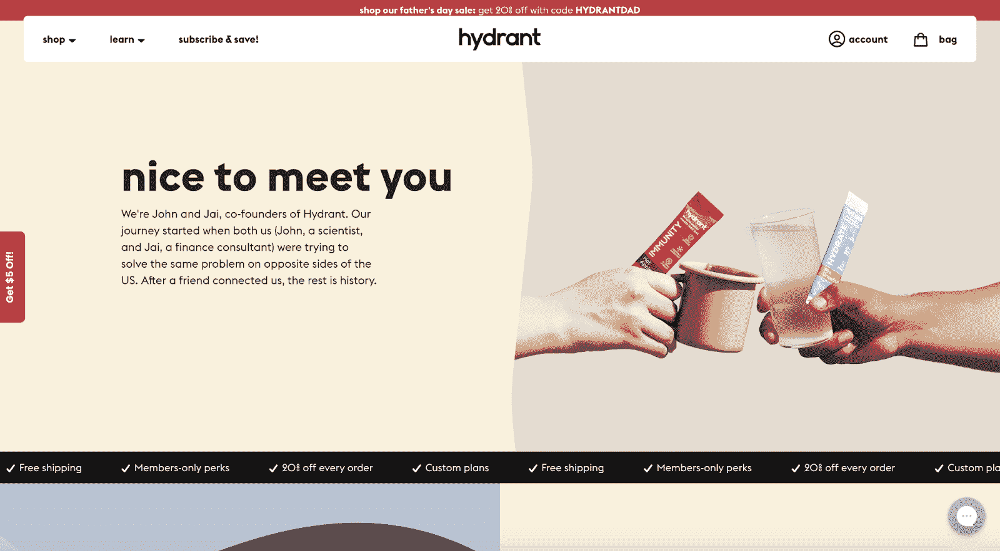

Hydrant About Us page.

消防栓的[关于我们的页面](https://www.drinkhydrant.com/pages/about)以一张两个人手里拿着产品敬酒的诱人图片打开。读完这份拷贝后，人们可能会猜测这双手是公司的两位创始人约翰和杰的。

这一页被分成三个部分，很容易消化。这种格式是设置页面的完美方式，因为它以一种不会让人不知所措的方式慢慢引导读者。

每一部分都旨在吸引读者，诱使他们多读一点。最后，这一页以约翰和杰的签名结束，给它一种创始人的个人风格，你觉得你现在可以称他们为朋友了。

### 保险

斑马、柠檬水和 Clearcover 是保险行业中的三家公司，它们正在通过“关于我们的神奇”页面铺平道路。

#### 斑马

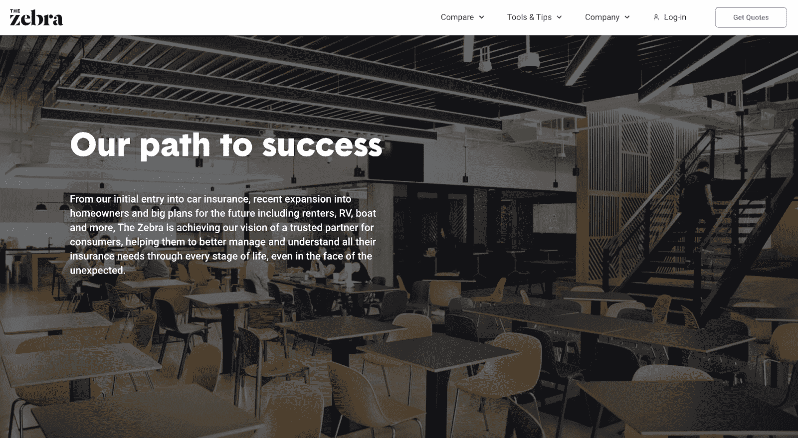

The Zebra About Us page.

斑马的[关于我们的页面](https://www.thezebra.com/about/)几乎像关注过去一样关注未来。公司以标题“我们的成功之路”开场关于业务的段落简洁明了，页面立刻流入关于公司文化的板块。

通过文化和领导力部分，斑马关注的是创造公司的人，而不是公司本身。这与其他一些“关于我们”的页面相比是一个微妙的变化。斑马公司的“关于我们”页面大约有三分之二是关于[公司文化](https://kinsta.com/podcast/culture-key-to-business-growth/)和领导团队的。

#### 柠檬汁

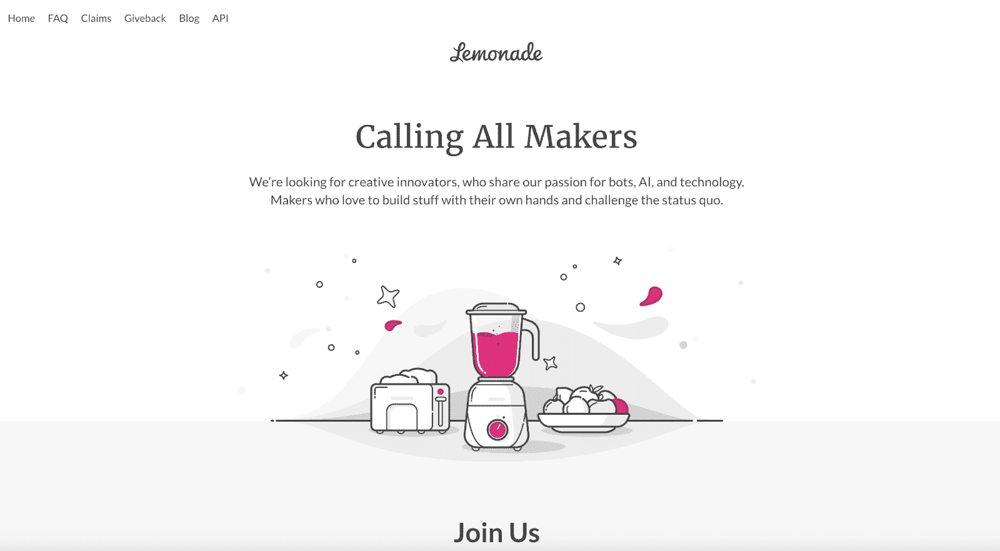

Lemonade About Us page.

柠檬水的[关于我们的页面](https://makers.lemonade.com/)围绕着它的“制造者”通过这一信息，该公司强调，其所有员工都在积极开发产品，他们是自己权利范围内的“创造者”。

柠檬水的“关于我们”页面上的信息很少，但这与它的品牌是一样的。例如，该公司在其登录页面上使用多余的空白来说明一个粉红色的流行破折号。这个页面也不例外。

只有两行文字和一个插图，柠檬水提供了一个高层次的公司和那些建设它的人。

#### 透明盖板

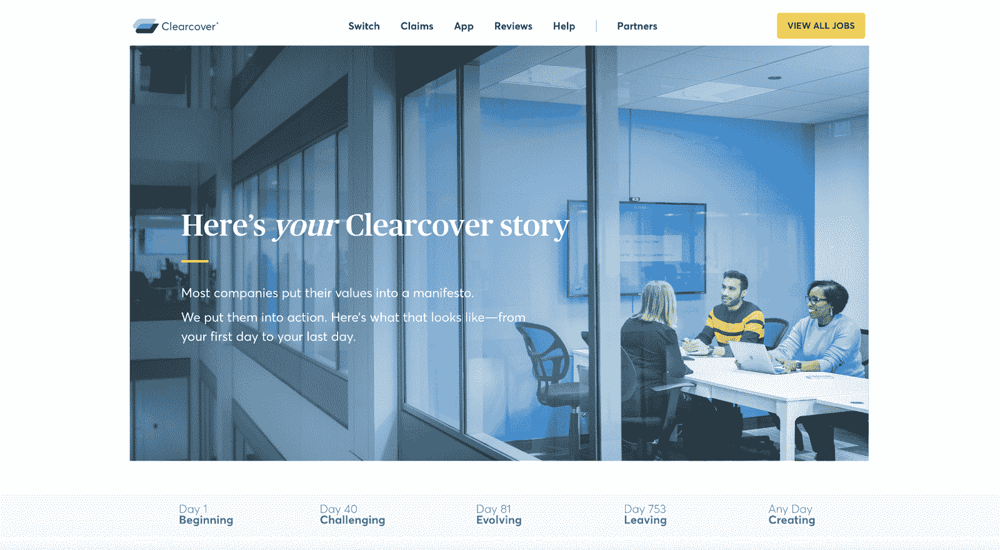

Clearcover About Us page.

Clearcover 使用传统的[关于我们页面](https://clearcover.com/culture/)模板来引导读者了解公司的历史。该页面只关注公司的故事，将其分为五个核心部分:开始、挑战、发展、离开和创造部分。

使用交互式章节标记，您可以提高页面的参与度，[让读者绕过](https://kinsta.com/blog/website-navigation/)跳到他们希望阅读的章节和主题。这种互动元素可以增加消费者在页面和信息上花费的时间。

### Fintech

Dave、Chime 和 Riskified 为参与金融科技行业的“关于我们”页面设定了标准。我们来看看为什么。

#### 戴夫

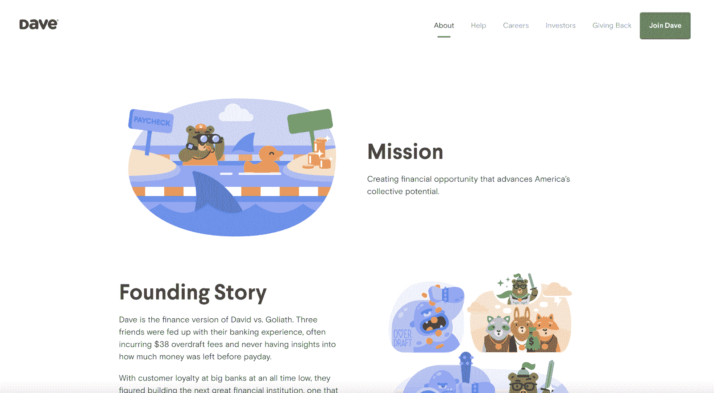

Dave’s About Us page.

Dave 是一家以人为本的银行公司，它提供了一个[关于我们的页面](https://dave.com/about)，包括简化的文本和引人入胜的插图。

交替部分采用两栏布局，便于读者从不同主题来回跳转，如其使命、创始故事等。此外，插图的风格非常吸引人(并且是品牌的)，让用户想继续向下滚动页面查看更多。

#### 和谐

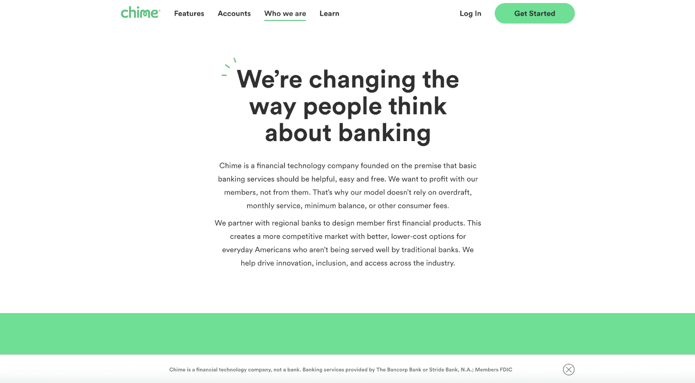

Chime About Us page.

Chime 的[关于我们的页面](https://www.chime.com/about-us/)严重依赖文案来对比 Dave 的。Chime 通过分享其与地区银行的合作伙伴关系，并强调其区别于竞争对手的价值主张，使用了一种解释性的方法。

## 注册订阅时事通讯

### 想知道我们是怎么让流量增长超过 1000%的吗？

加入 20，000 多名获得我们每周时事通讯和内部消息的人的行列吧！

[Subscribe Now](#newsletter)

对于像 Chime 这样的公司来说，这并不奇怪。金融科技行业有许多监管规定，Chime 希望其客户理解其技术为何与众不同。

通过关注信息和删除页面上所有多余的内容，你可以深入了解你的公司和品牌的关键点。

#### 风险化

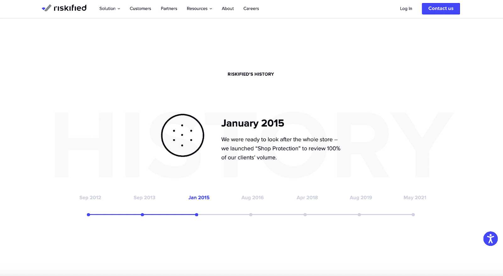

Riskified About Us page.

Riskified 在它的[关于美国页面](https://www.riskified.com/about/)上独特而引人入胜地突出了它的历史。试图将你公司的历史整合成小块是一项任务。更糟糕的是，如果你把所有东西都拼出来，关于我们的页面会永远拖下去。

Riskified 展示了一个交互式时间表，突出了其发展过程中的七个关键里程碑。观众可以来回切换，并收到一个新的插图，用一句话描述一个核心公司的里程碑。这是同时吸引和教育潜在客户的好方法。

### 卫生保健

Wheel、Clear 和 Healthgrades 在关于美国页面方面领先于医疗保健行业。

#### 车轮

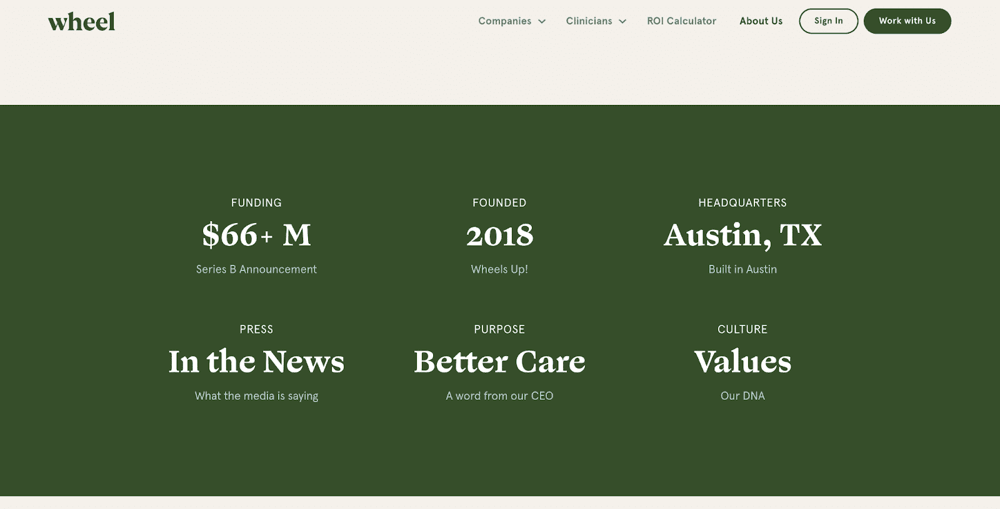

Wheel About Us page.

Wheel 的[关于我们页面](https://www.wheel.com/about)将你需要知道的一切都分解成小块。这种格式突出了你需要了解的关于公司的关键细节。从融资成功到总部所在地，一切都整齐地打包到它的部分中。

对于你认为每个消费者都应该知道的关于你的业务的重要细节，考虑使用这种格式。通过将一些基本信息简化成这些部分，你可以在页面的另一部分为更吸引人的叙述留出空间。

#### 清楚的

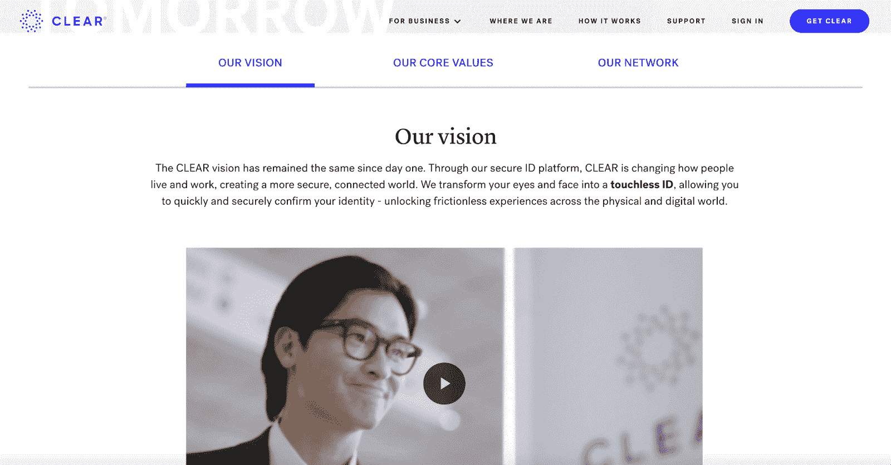

Clear About Us page.

Clear 的[关于我们页面](https://www.clearme.com/about-us/)关注三个不同的部分:愿景、核心价值观和网络。Clear 使用一段公司视频来介绍这项业务以及即将推出的产品。

[在“关于我们”页面的顶部醒目位置展示一段视频](https://kinsta.com/blog/embed-youtube-video-wordpress/)。视频很吸引人，消费者喜欢看。此外，你不能用一大段文字吓跑消费者。你可以用一个视频把他们吸引进来，邀请他们呆一会儿。

#### 健康等级

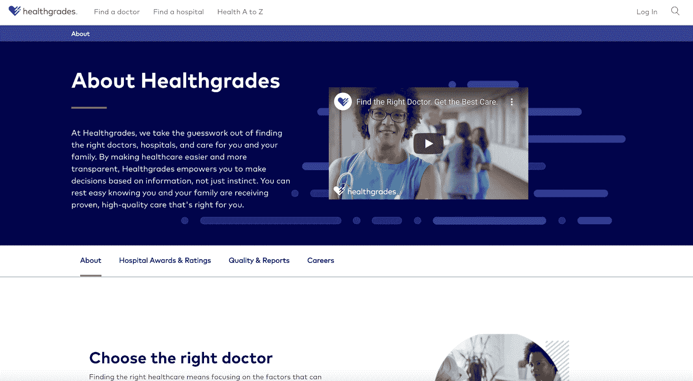

Healthgrades About Us page.

Healthgrades 的[关于我们页面](https://www.healthgrades.com/about)使用一个内置的导航栏，使用户能够切换四个子标题:关于，医院奖项&评级，质量&报告，职业。这个次级导航栏简化了“关于我们”页面，所以它不会延伸太远。

当用户不需要不断滚动来获取新内容时，它可以让用户保持参与。消费者可能会在一些子页面之间来回切换，学到比仅仅是静态登录页面更多的东西。

### 宠物

BarkBox、Wag 和 Ollie 是领先的宠物用品和宠物护理公司，拥有令人难忘的“关于我们”页面。

#### BarkBox

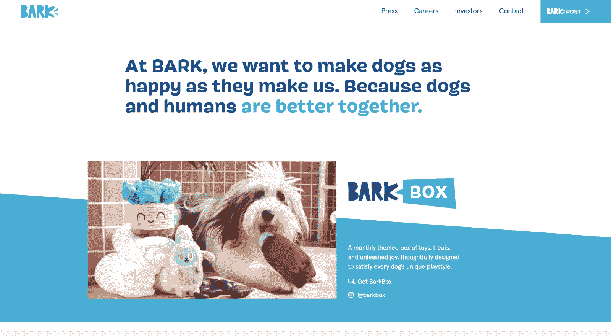

BarkBox About Us page.

BarkBox 的[关于我们的页面](https://bark.co/)使用了令人难忘的狗的图像。该公司通过突出显示其提供的不同垂直业务来保持页面简洁。每个都有其指定的部分，带有相应的文本和图像。

这个关于我们的页面表明，如果你认为没有必要，你不必太深入你公司的故事。BarkBox 有许多不同的属性，因此它使用这个空间来确保其客户了解所提供的内容。

#### 摆动

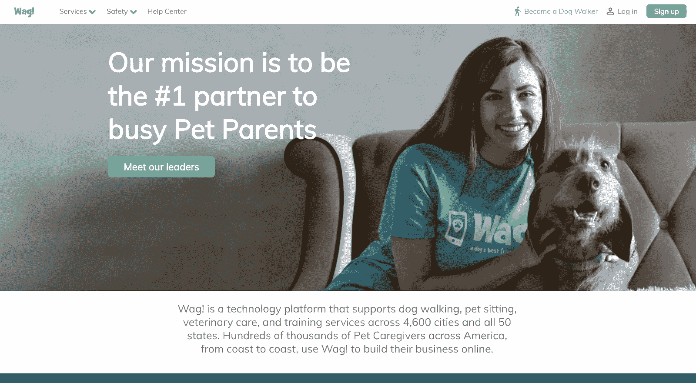

Wag About Us page.

Wag 在其[关于我们的页面](https://wagwalking.com/about)上有一个简单的布局，展示了一个带着一个女人和她的狗的英雄形象，一个标题，一个简短的描述，以及一个号召观众“见见我们的领导人”的号召。这是一个简单的方法，可以让消费者了解公司的基本情况。

Wag 的“关于我们”页面是一个有效的提醒，提醒你不必过分使用“关于我们”页面的内容。相反，集中精力对你的公司做一个高层次的概述，并强调几个关键点。

#### 奥利

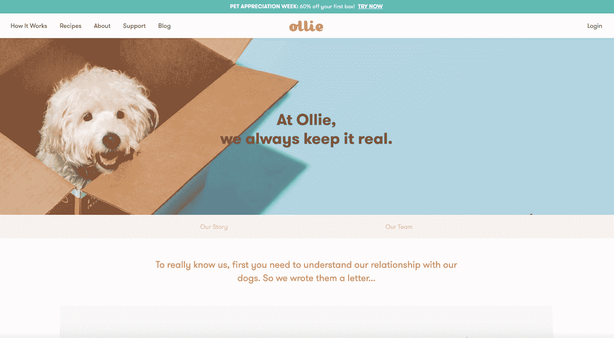

Ollie About Us page.

Ollie 的[关于我们页面](https://www.myollie.com/about/our-story/)利用二级导航栏将内容分成不同的部分:我们的故事和我们的团队。此外，每一页都使用动画来吸引读者，将他们的注意力吸引到包含重要信息的不同区域。

与我们世界一流的支持团队一起体验卓越的 WordPress 托管支持！与支持我们财富 500 强客户的同一个团队聊天。[查看我们的计划](https://kinsta.com/plans/?in-article-cta)

寻找新的方法来吸引读者继续阅读。实现这一点的一种方法是使用微妙的运动图形、 [Javascript](https://kinsta.com/knowledgebase/what-is-javascript/) 或 gif。即使是最轻微的动作也会吸引读者的眼球，让他们想要更多。

### 运输

Lyft，优步和伯德都采取不同的方法来分享他们的故事。

#### 拉起来

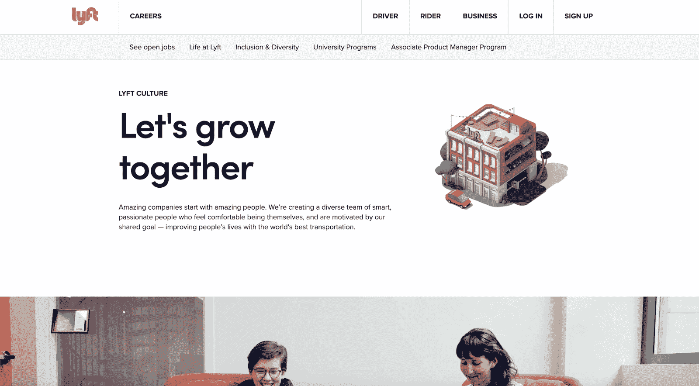

Lyft About Us page.

Lyft 的[关于我们页面](https://www.lyft.com/careers/life-at-lyft)聚焦于幕后推动公司发展的团队。该页面冒犯了新司机和新加入组织的内部团队成员。这与我们见过的大多数“关于我们”页面不同。

这种策略被较大的组织所使用，这些组织通常会在任何给定的时间点招聘许多职位。Lyft 是一个[总是招募](https://kinsta.com/careers/)的组织，所以把它的关于我们的页面集中在团队上是有意义的。

#### 超级的

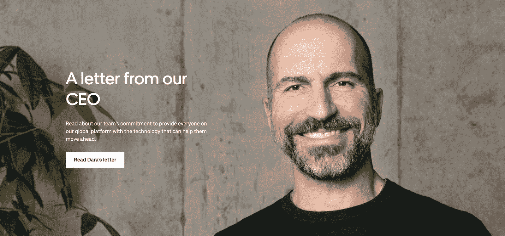

Uber About Us page.

优步的[关于我们页面](https://www.uber.com/us/en/about/)突出显示了其首席执行官的一封信。此外，首席执行官的个人资料照片作为页面的英雄形象。由于世界上大多数人都熟悉优步品牌，该公司使用这一页来绘制其路线图。

通过公布这封来自首席执行官的信，优步让消费者一瞥公司是如何发展的。

#### 伯德

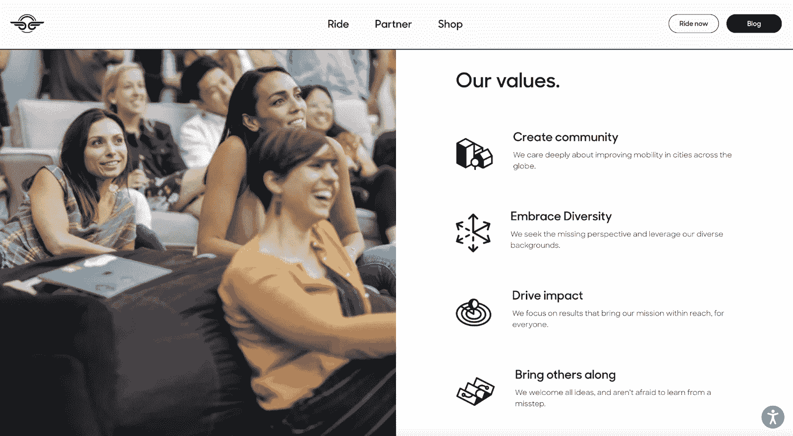

Bird About Us page.

Bird 的[关于我们页面](https://www.bird.co/about/)是围绕公司的核心价值观构建的。伯德通过创造一个与公司每个支柱相对应的独特图标来概括其价值观。

在“关于我们”页面上使用图标是一种有效的策略。独特的[图标](https://kinsta.com/blog/wordpress-icon-fonts/)可以让人记忆深刻，并有助于将文本分解成小块的想法。

### 音乐

Spotify、Mighty Audio 和 WaveXR 作为领先的音乐科技公司，在关于我们的页面上独树一帜。

#### Spotify

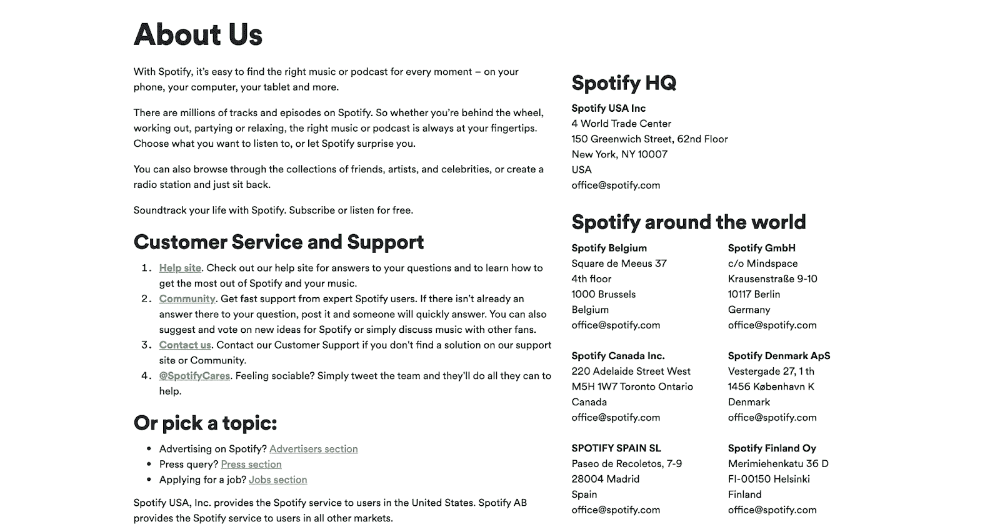

Spotify About Us page.

Spotify 的[关于我们页面](https://www.spotify.com/us/about-us/contact/)只有文本，没有图片。这个页面上的大部分内容是地址、[客服邮件](https://kinsta.com/blog/email-marketing-software/)，以及公司简介。

Spotify 在其“关于我们”页面上的直接方式表明，只要你是一个全球知名品牌，你就可以只包括基本信息或核心公司信息。

#### 强大的音频

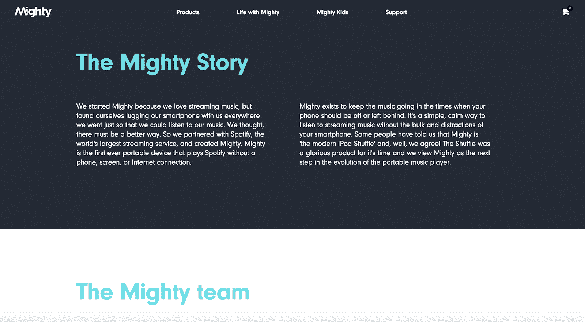

Mighty Audio About Us page.

Mighty Audio 用两大块文字分享了它的故事，然后在它的[关于我们页面](https://bemighty.com/pages/our-story)上突出显示了这个团队。深色背景和浅蓝色标题文本的对比会弹出。

考虑如何在页面上使用对比颜色，以确保突出最重要的信息。

#### 动摇

WaveXR About Us page.

WaveXR 将其[关于我们的页面](https://wavexr.com/about/)分为四个不同的部分:团队、价值观、职业和媒体。该页面以简短的公司描述开始，然后邀请读者点击这四个子标题中的一个以了解更多信息。

在你的“关于我们”页面上包含媒体提及总是一个好主意。 [Press](https://kinsta.com/press/) 有助于建立社会证明，提高你的企业的可信度。消费者可以通过你收到的任何相关新闻来了解你的公司。

### 演员表

Chargebee、ReCharge 和 Cedar 是[账单](https://kinsta.com/help/billing-questions/)空间中“关于我们”页面的典型例子。

#### 受款人

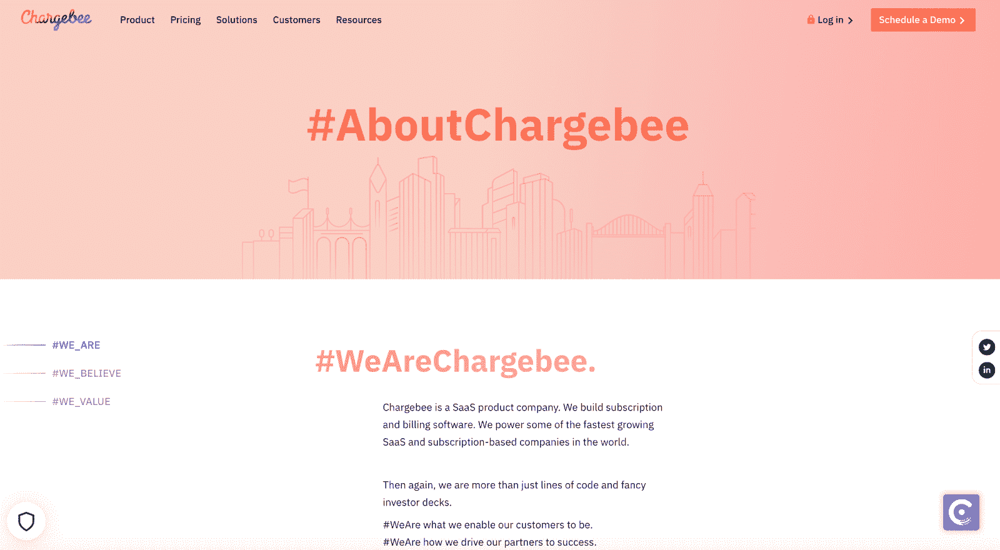

Chargebee About Us page.

Chargebee 使用社交媒体标签将其[关于我们的页面](https://www.chargebee.com/company/)与社交媒体联系起来。标题用标签问候消费者，鼓励 Twitter 上的社交分享。

考虑如何说服你的消费者在社交媒体上分享你的“关于我们”页面。突出一个品牌标签是一个很好的开始。

#### 再充电

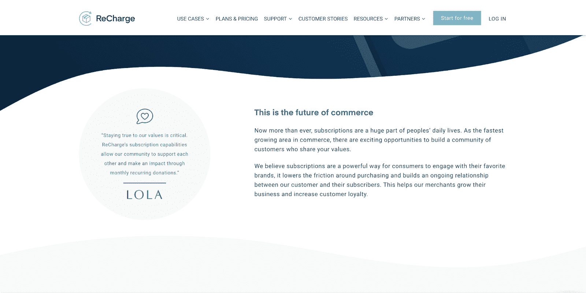
充值功能直接在其[关于我们的页面](https://rechargepayments.com/about/)上提供客户证明。毕竟，还有什么比通过现有客户更有效的方式来了解一家公司呢？

请你最热情的客户之一分享一份评价。把它放在你的“关于我们”页面上以增加可信度。

#### 雪松

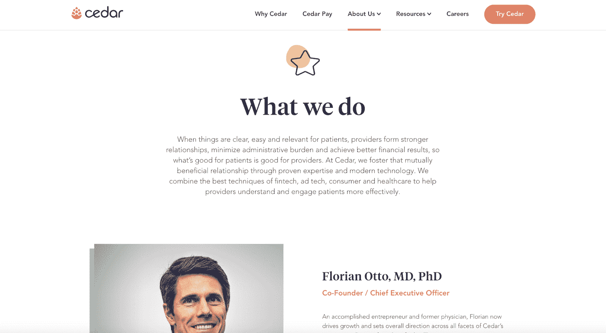

Cedar About Us page.

Cedar 结合了许多设计元素，包括文本、插图、照片和关于美国页面的对比色。它以公司描述开始，并立即介绍了联合创始人。

在“关于我们”页面上尽可能多地使用与您的品牌相一致的不同设计元素。不同风格的不同元素可以让消费者关注内容。

### 旅行

集体撤退，本地和外地领导旅游行业在创新的关于我们的网页。

#### 集体静修

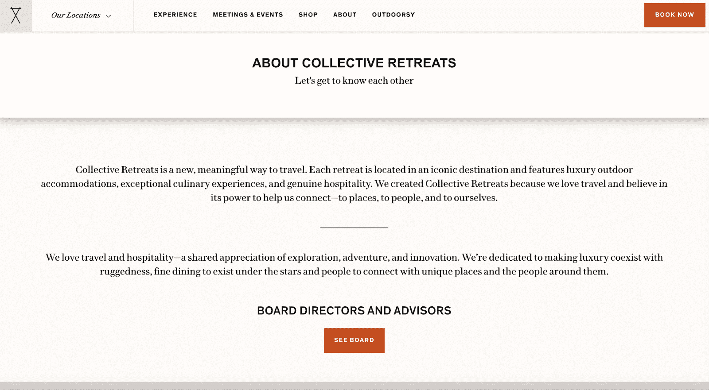

Collective Retreats About Us page.

集体静修提供了一个基本而有效的方法来访问它的[关于我们的页面](https://www.collectiveretreats.com/about-us/)。该页面有三句话，涵盖了业务描述和对其产品的总体方法的简要概述。

将你的公司浓缩成一两句话，并确保你将这句话添加到你的“关于我们”页面。在页面上简单的公司描述会很有帮助。

#### Localeaur

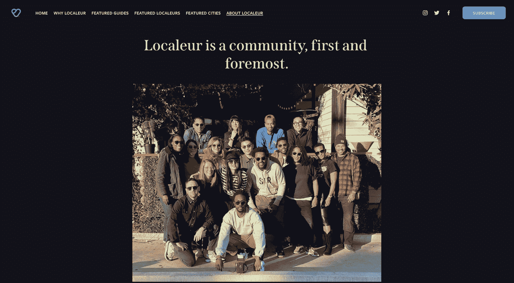

Localeur About Us page.

Localeur 在其[关于我们的页面](https://www.localeur.com/ourstory)上展示了一张员工照片作为主要内容。对于专注于社区的企业来说，这是一个显而易见的选择。

考虑在页面顶部添加您团队的照片。这不应该是一张[库存照片](https://kinsta.com/blog/wordpress-stock-photos/),而是一张在异地活动或员工交流经历中的真实照片。

#### 离开

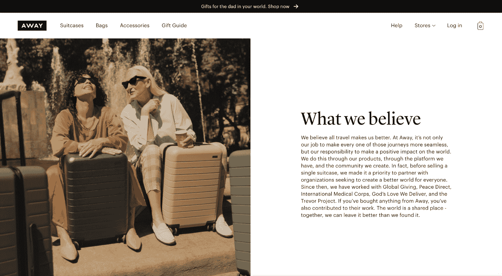

Away About Us page.

Away 的[关于我们的页面](https://www.awaytravel.com/our-story)围绕着公司的信念。这种方法类似于以价值观为导向的公司。

《远离》提供了一种精致的、[令人难忘的方式，通过高质量的图像和清晰的文案来分享](https://kinsta.com/blog/wordpress-social-media-plugins/)其业务所代表的东西。

## 关于我们的最佳页面

戴夫有最好的关于我们的网页，由于其简单的设计，直截了当的复制，和引人入胜的插图。

该页面与该公司的品牌相匹配，并以一种有趣、轻松的方式分享了公司的创立故事。

Dave’s easy-to-read, engaging About Us page is a solid example for inspiration.

[It isn't enough to just market your product to consumers- you need to earn their trust too. 🤝 Check out these About Us pages for all the inspiration you need 🤩Click to Tweet](https://twitter.com/intent/tweet?url=https%3A%2F%2Fkinsta.com%2Fblog%2Fabout-us-page%2F&via=kinsta&text=It+isn%27t+enough+to+just+market+your+product+to+consumers-+you+need+to+earn+their+trust+too.+%F0%9F%A4%9D+Check+out+these+About+Us+pages+for+all+the+inspiration+you+need+%F0%9F%A4%A9&hashtags=StartupLife%2CSmallBiz)

## 结论

你的网站应该有一个关于我们的精彩页面。这是你讲述自己的故事以及企业使命和愿景的机会。

借助强大的“关于我们”页面，您可以更好地与客户沟通并建立信任。随着时间的推移，这种信任将转化为持续支持你业务的忠诚顾客带来的经常性收入。

*想分享您对“关于我们”页面的想法吗？请在下面的评论中与我们的社区分享它们！*

* * *

让你所有的[应用程序](https://kinsta.com/application-hosting/)、[数据库](https://kinsta.com/database-hosting/)和 [WordPress 网站](https://kinsta.com/wordpress-hosting/)在线并在一个屋檐下。我们功能丰富的高性能云平台包括:

*   在 MyKinsta 仪表盘中轻松设置和管理
*   24/7 专家支持
*   最好的谷歌云平台硬件和网络，由 Kubernetes 提供最大的可扩展性
*   面向速度和安全性的企业级 Cloudflare 集成
*   全球受众覆盖全球多达 35 个数据中心和 275 多个 pop

在第一个月使用托管的[应用程序或托管](https://kinsta.com/application-hosting/)的[数据库，您可以享受 20 美元的优惠，亲自测试一下。探索我们的](https://kinsta.com/database-hosting/)[计划](https://kinsta.com/plans/)或[与销售人员交谈](https://kinsta.com/contact-us/)以找到最适合您的方式。