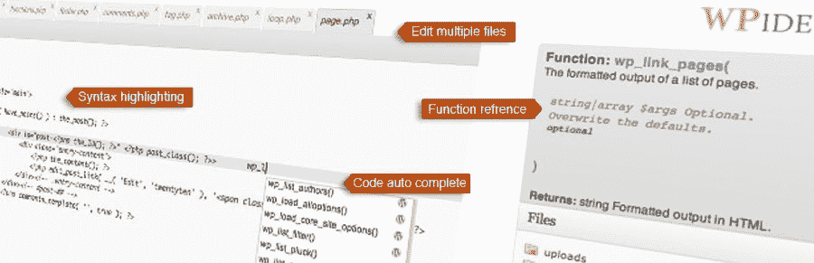
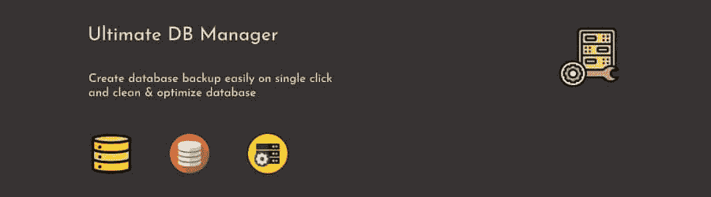

# WordPress 抽象:最佳实践和 WordPress 抽象插件

> 原文：<https://kinsta.com/blog/abstract-wordpress-plugin/>

WordPress 是老 CMS，也是[用的最多的一个](https://kinsta.com/wordpress-market-share/)。由于其支持过时的 PHP 版本和遗留代码的历史，它仍然缺乏实现现代编码实践——WordPress abstraction 就是一个例子。

例如，将 WordPress 核心代码库分成由 Composer 管理的包会好得多。或者从文件路径中自动加载 WordPress 类。

这篇文章将教你如何手动抽象 WordPress 代码并使用抽象 WordPress 插件功能。

T3】

## 整合 WordPress 和 PHP 工具的问题

由于其古老的架构，我们在将 WordPress 与 PHP 代码库工具集成时偶尔会遇到问题，例如静态分析器 [PHPStan](https://phpstan.org/) ，单元测试库 [PHPUnit](https://phpunit.de/) ，以及命名空间范围库 [PHP-Scoper](https://github.com/humbug/php-scoper) 。例如，考虑以下情况:

*   在支持 [PHP 8.0](https://kinsta.com/blog/php-8/) 的 [WordPress 5.6](https://kinsta.com/blog/wordpress-5-6/) 之前，Yoast 的一份报告描述了在 WordPress core 上运行 PHPStan 将如何产生[数千个问题](https://developer.yoast.com/blog/the-2020-wordpress-and-php-8-compatibility-report/#h-scanning-wordpress-with-phpstan)。
*   由于仍然支持 PHP 5.6，WordPress 测试套件目前[只支持 PHPUnit 到 7.5](https://core.trac.wordpress.org/ticket/46149) 版本，已经到了生命的尽头。
*   通过 PHP-Scoper [确定 WordPress 插件的范围是非常具有挑战性的](https://github.com/humbug/php-scoper#wordpress)。

我们项目中的 WordPress 代码将只是总数的一小部分；该项目还将包含底层 CMS 的业务代码不可知。然而，仅仅拥有一些 WordPress 代码，项目可能无法正确地与工具集成。

因此，将项目拆分成包是有意义的，其中一些包包含 WordPress 代码，而另一些包只有使用“普通”PHP 的业务代码，没有 WordPress 代码。这样，后面这些包就不会受到上述问题的影响，而是可以与工具完美集成。


## 什么是代码抽象？

代码抽象从代码中移除了固定的依赖性，产生了通过契约相互交互的包。然后，可以将这些包添加到不同的应用程序中，使用不同的堆栈，最大化它们的可用性。代码抽象的结果是基于以下支柱的清晰解耦的代码库:


> 需要在这里大声喊出来。Kinsta 太神奇了，我用它做我的个人网站。支持是迅速和杰出的，他们的服务器是 WordPress 最快的。
> 
> <footer class="wp-block-kinsta-client-quote__footer">
> 
> 
> 
> <cite class="wp-block-kinsta-client-quote__cite">Phillip Stemann</cite></footer>

[View plans](https://kinsta.com/plans/)

1.  针对接口而不是实现编码。
2.  创建包并通过 Composer 分发它们。
3.  通过依赖注入将所有部分粘合在一起。

[想了解更多 WordPress 代码抽象？👩‍💻从最佳实践到推荐的插件，你需要知道的一切都是一键搞定⬇️ 点击推文](https://twitter.com/intent/tweet?url=https%3A%2F%2Fkinsta.com%2Fblog%2Fabstract-wordpress-plugin%2F&via=kinsta&text=Want+to+know+more+about+WordPress+code+abstraction%3F+%F0%9F%91%A9%E2%80%8D%F0%9F%92%BB+From+best+practices+to+recommended+plugins%2C+everything+you+need+to+know+is+a+click+away+%E2%AC%87%EF%B8%8F&hashtags=WordPress%2CCoding)

## 针对接口而不是实现进行编码

针对接口编码是使用契约让代码片段相互交互的实践。契约只是一个 PHP 接口(或任何不同的语言),它定义了哪些函数可用以及它们的签名，即它们接收哪些输入以及它们的输出。

接口声明功能的意图，而不解释功能将如何实现。通过接口访问功能，我们的[应用程序](https://kinsta.com/blog/application-performance-monitoring/)可以依靠自主代码来完成特定的目标，而不需要知道或关心它们是如何完成的。通过这种方式，应用程序不需要进行调整以切换到另一段代码来实现相同的目标——例如，来自不同的提供者。
T3】

### 合同示例

下面的代码使用 Symfony 的契约 [`CacheInterface`](https://github.com/symfony/symfony/blob/302b844/src/Symfony/Contracts/Cache/CacheInterface.php) 和 PHP 标准推荐(PSR)的契约 [`CacheItemInterface`](https://github.com/php-fig/cache/blob/0a7c67d/src/CacheItemInterface.php) 来实现缓存功能:

```
use Psr\Cache\CacheItemInterface;
use Symfony\Contracts\Cache\CacheInterface;

$value = $cache->get('my_cache_key', function (CacheItemInterface $item) {
    $item->expiresAfter(3600);
    return 'foobar';
}); 
```

`$cache`实现了`CacheInterface`，它定义了从缓存中检索对象的方法`get`。通过契约访问该功能，应用程序可以不知道缓存在哪里。无论是内存、磁盘、数据库、网络，还是其他任何地方。尽管如此，它必须执行功能。`CacheItemInterface`定义方法`expiresAfter`来声明项目必须在缓存中保留多长时间。应用程序可以调用此方法，而无需关心缓存的对象是什么；它只关心它必须被缓存多长时间。

## WordPress 中的接口编码

因为我们正在抽象 WordPress 代码，结果将是应用程序不会直接引用 [WordPress 代码](https://kinsta.com/knowledgebase/edit-wordpress-code/)，而是总是通过一个接口。例如，WordPress 函数`get_posts`有这样的签名:

```
/**
 * @param array $args
 * @return WP_Post[]|int[] Array of post objects or post IDs.
 */
function get_posts( $args = null ) 
```

我们可以通过契约`Owner\MyApp\Contracts\PostsAPIInterface`来访问它，而不是直接调用这个方法:

```
namespace Owner\MyApp\Contracts;

interface PostAPIInterface
{
  public function get_posts(array $args = null): PostInterface[]|int[];
} 
```

注意 WordPress 函数`get_posts`可以返回类`WP_Post`的对象，这是特定于 WordPress 的。当抽象代码时，我们需要去除这种固定的依赖。契约中的方法`get_posts`返回类型`PostInterface`的对象，允许你引用类`WP_Post`而不必明确它。类`PostInterface`需要提供对来自`WP_Post`的所有方法和属性的访问:

```
namespace Owner\MyApp\Contracts;

interface PostInterface
{
  public function get_ID(): int;
  public function get_post_author(): string;
  public function get_post_date(): string;
  // ...
} 
```

执行这个策略可以改变我们对 WordPress 在堆栈中位置的理解。不要把 WordPress 看作是应用程序本身(我们在上面安装主题和插件)，我们可以简单地把它看作是应用程序中的另一个依赖项，可以替换成任何其他组件。(即使我们在实践中不会取代 WordPress，但从概念上来看，它*是*可替换的。)


## 创建和分发包

Composer 是一个 PHP 的包管理器。它允许 PHP 应用程序从存储库中检索包(即代码片段)并将它们作为依赖项安装。为了将应用程序从 WordPress 中分离出来，我们必须将其代码分发到两种不同类型的包中:一种包含 WordPress 代码，另一种包含业务逻辑(即没有 WordPress 代码)。

最后，我们将所有包作为依赖项添加到应用程序中，并通过 Composer 安装它们。由于工具将被应用到业务代码包中，这些包必须包含应用程序的大部分代码；百分比越高越好。让他们管理大约 90%的代码是一个很好的目标。

## 将 WordPress 代码提取到包中

按照前面的例子，契约`PostAPIInterface`和`PostInterface`将被添加到包含业务代码的包中，另一个包将包含这些契约的 WordPress 实现。为了满足`PostInterface`，我们创建了一个`PostWrapper`类，它将从一个`WP_Post`对象中检索所有属性:

```
namespace Owner\MyAppForWP\ContractImplementations;

use Owner\MyApp\Contracts\PostInterface;
use WP_Post;

class PostWrapper implements PostInterface
{
  private WP_Post $post;

  public function __construct(WP_Post $post)
  {
    $this->post = $post;
  }

  public function get_ID(): int
  {
    return $this->post->ID;
  }

  public function get_post_author(): string
  {
    return $this->post->post_author;
  }

  public function get_post_date(): string
  {
    return $this->post->post_date;
  }

  // ...
} 
```

在实现`PostAPI`时，由于方法`get_posts`返回`PostInterface[]`，我们必须将对象从`WP_Post`转换为`PostWrapper`:

```
namespace Owner\MyAppForWP\ContractImplementations;

use Owner\MyApp\Contracts\PostAPIInterface;
use WP_Post;

class PostAPI implements PostAPIInterface
{
  public function get_posts(array $args = null): PostInterface[]|int[]
  {
    // This var will contain WP_Post[] or int[]
    $wpPosts = \get_posts($args);

    // Convert WP_Post[] to PostWrapper[]
    return array_map(
      function (WP_Post|int $post) {
        if ($post instanceof WP_Post) {
          return new PostWrapper($post);
        }
        return $post
      },
      $wpPosts
    );
  }
} 
```

## 使用依赖注入

依赖注入是一种设计模式，它允许您以松散耦合的方式将所有应用程序部件粘合在一起。通过依赖注入，应用程序通过它们的契约访问服务，契约实现通过配置“注入”到应用程序中。

只需更改配置，我们就可以轻松地从一个合同提供商切换到另一个。有几个依赖注入库可供我们选择。我们建议选择一个遵循 [PHP 标准建议](https://www.php-fig.org/)(通常被称为“PSR”)的库，这样如果需要的话，我们可以很容易地用另一个替换这个库。关于依赖注入，库必须满足 [PSR-11](https://www.php-fig.org/psr/psr-11/) ，它提供了“容器接口”的规范其中，下列库符合 PSR-11 标准:

*   [Symfony 的 DependencyInjection](https://github.com/symfony/dependency-injection)
*   [PHP-DI](https://github.com/PHP-DI/PHP-DI)
*   [灵气。说〔t1〕](https://github.com/auraphp/Aura.Di)
*   [容器(依赖注入)](https://github.com/thephpleague/container)
*   [Yii 依赖注入](https://github.com/yiisoft/di)

### 通过服务容器访问服务

依赖注入库将提供一个“服务容器”，它将一个契约解析为其相应的实现类。应用程序必须依赖服务容器来访问所有功能。例如，虽然我们通常会直接调用 WordPress 函数:

```
$posts = get_posts(); 
```

…使用服务容器，我们必须首先获得满足`PostAPIInterface`的服务，并通过它执行功能:

```
use Owner\MyApp\Contracts\PostAPIInterface;

// Obtain the service container, as specified by the library we use
$serviceContainer = ContainerBuilderFactory::getInstance();

// The obtained service will be of class Owner\MyAppForWP\ContractImplementations\PostAPI
$postAPI = $serviceContainer->get(PostAPIInterface::class);

// Now we can invoke the WordPress functionality
$posts = $postAPI->get_posts(); 
```

### 使用 Symfony 的依赖注入

[Symfony 的 DependencyInjection 组件](https://symfony.com/doc/current/components/dependency_injection.html)是目前最流行的依赖注入库。它允许您通过 PHP、YAML 或 XML 代码配置服务容器。例如，为了定义契约`PostAPIInterface`通过类`PostAPI`得到满足，在 YAML 是这样配置的:

```
services:
  Owner\MyApp\Contracts\PostAPIInterface:
    class: \Owner\MyAppForWP\ContractImplementations\PostAPI 
```

Symfony 的 DependencyInjection 还允许将一个服务的实例自动注入(或“自动连接”)到依赖它的任何其他服务中。此外，它使得定义一个类是它自己的服务的实现变得容易。例如，考虑 YAML 配置之后的[:](https://github.com/leoloso/PoP/blob/8602e9041ac92f4683966eed5c4a90686b9395fa/layers/GraphQLAPIForWP/plugins/graphql-api-for-wp/config/hybrid-services.yaml)

```
services:
  _defaults:
    public: true
    autowire: true

  GraphQLAPI\GraphQLAPI\Registries\UserAuthorizationSchemeRegistryInterface:
    class: '\GraphQLAPI\GraphQLAPI\Registries\UserAuthorizationSchemeRegistry'

  GraphQLAPI\GraphQLAPI\Security\UserAuthorizationInterface:
    class: '\GraphQLAPI\GraphQLAPI\Security\UserAuthorization'

  GraphQLAPI\GraphQLAPI\Security\UserAuthorizationSchemes\:
    resource: '../src/Security/UserAuthorizationSchemes/*' 
```

该配置定义了以下内容:

*   契约`UserAuthorizationSchemeRegistryInterface`通过类`UserAuthorizationSchemeRegistry`得到满足
*   契约`UserAuthorizationInterface`通过类`UserAuthorization`得到满足
*   文件夹`UserAuthorizationSchemes/`下的所有类都是它们自己的实现
*   服务必须自动注入到另一个服务中(`autowire: true`)

让我们看看自动布线是如何工作的。类别 [`UserAuthorization`](https://github.com/leoloso/PoP/blob/bd56f23b52a3e02966fdcbde4bc58f246a47a6e5/layers/GraphQLAPIForWP/plugins/graphql-api-for-wp/src/Security/UserAuthorization.php) 依赖于具有合同`UserAuthorizationSchemeRegistryInterface`的服务:

```
class UserAuthorization implements UserAuthorizationInterface
{
  public function __construct(
      protected UserAuthorizationSchemeRegistryInterface $userAuthorizationSchemeRegistry
  ) {
  }

  // ...
} 
```

多亏了`autowire: true`，DependencyInjection 组件将自动让服务`UserAuthorization`接收其所需的依赖，这是`UserAuthorizationSchemeRegistry`的一个实例。

## 什么时候抽象

抽象代码会消耗大量的时间和精力，所以我们应该只在它的好处超过它的成本时才进行。以下是关于什么时候抽象代码是值得的建议。你可以通过使用本文中的代码片段或者下面建议的抽象 WordPress 插件来实现。

### 获得工具

如前所述，[在 WordPress 上运行 PHP-Scoper 是困难的](https://github.com/humbug/php-scoper/issues/303)。通过将 WordPress 代码分离成不同的包，[直接控制 WordPress 插件](https://graphql-api.com/blog/graphql-api-for-wp-is-now-scoped-thanks-to-php-scoper/)变得可行。

### 减少加工时间和成本

运行 PHPUnit 测试套件在需要初始化和运行 WordPress 时要比不需要时花费更长的时间。更少的时间也可以转化为运行测试花费的更少的钱——例如， [GitHub](https://kinsta.com/knowledgebase/what-is-github/) Actions 根据使用 GitHub 托管的跑步者花费的时间对他们收费。

### 不需要大量的重构

一个现有的项目可能需要大量的重构来引入所需的架构(依赖注入，将代码拆分成包，等等)。)，很难拔出来。从头开始创建项目时对代码进行抽象使得项目更易于管理。

## 注册订阅时事通讯


### 想知道我们是怎么让流量增长超过 1000%的吗？

加入 20，000 多名获得我们每周时事通讯和内部消息的人的行列吧！

[Subscribe Now](#newsletter)

### 为多个平台编写代码

通过将 90%的代码提取到一个与 CMS 无关的包中，我们可以产生一个适用于不同 CMS 或框架的库版本，只需替换整个代码库的 10%。

### 迁移到不同的平台

如果我们需要将一个项目从 [Drupal 迁移到 WordPress](https://kinsta.com/blog/wordpress-vs-drupal/) ，从 WordPress 迁移到 [Laravel](https://kinsta.com/blog/laravel-9/) ，或者任何其他组合，那么只需要重写 10%的代码——这是一笔可观的节省。

## 最佳实践

在设计抽象代码的契约时，我们可以对代码库进行一些改进。

### 坚持 PSR-12

当定义访问 WordPress 方法的接口时，我们应该遵循 [PSR-12](https://www.php-fig.org/psr/psr-12/) 。这个最新的规范旨在减少扫描来自不同作者的代码时的认知摩擦。坚持 PSR-12 意味着重命名 WordPress 函数。

WordPress 使用 **snake_case** 命名函数，而 PSR-12 使用 **camelCase** 。因此，函数`get_posts`将变成`getPosts`:

```
interface PostAPIInterface
{
  public function getPosts(array $args = null): PostInterface[]|int[];
} 
```

…以及:

```
class PostAPI implements PostAPIInterface
{
  public function getPosts(array $args = null): PostInterface[]|int[]
  {
    // This var will contain WP_Post[] or int[]
    $wpPosts = \get_posts($args);

    // Rest of the code
    // ...
  }
} 
```

### 拆分方法

界面中的方法不需要是 WordPress 中方法的复制品。只要有意义，我们就可以改造它们。例如，WordPress 函数`get_user_by($field, $value)`知道如何通过参数`$field`从数据库中检索用户，该参数接受值`"id"`、`"ID"`、`"slug"`、`"email"`或`"login"`。这种设计有几个问题:

*   如果我们传递了一个错误的字符串，它不会在编译时失败
*   参数`$value`需要接受所有选项的所有不同类型，即使当传递`"ID"`时它期望一个`int`，当传递`"email"`时它只能接收一个`string`

我们可以通过将函数分成几个部分来改善这种情况:

```
namespace Owner\MyApp\Contracts;

interface UserAPIInterface
{
  public function getUserById(int $id): ?UserInterface;
  public function getUserByEmail(string $email): ?UserInterface;
  public function getUserBySlug(string $slug): ?UserInterface;
  public function getUserByLogin(string $login): ?UserInterface;
} 
```

WordPress 的合同是这样解决的(假设我们已经创建了`UserWrapper`和`UserInterface`，如前所述):

```
namespace Owner\MyAppForWP\ContractImplementations;

use Owner\MyApp\Contracts\UserAPIInterface;

class UserAPI implements UserAPIInterface
{
  public function getUserById(int $id): ?UserInterface
  {
    return $this->getUserByProp('id', $id);
  }

  public function getUserByEmail(string $email): ?UserInterface
  {
    return $this->getUserByProp('email', $email);
  }

  public function getUserBySlug(string $slug): ?UserInterface
  {
    return $this->getUserByProp('slug', $slug);
  }

  public function getUserByLogin(string $login): ?UserInterface
  {
    return $this->getUserByProp('login', $login);
  }

  private function getUserByProp(string $prop, int|string $value): ?UserInterface
  {
    if ($user = \get_user_by($prop, $value)) {
      return new UserWrapper($user);
    }
    return null;
  }
} 
```

### 从函数签名中删除实现细节

WordPress 中的函数可能会提供关于它们如何在自己的签名中实现的信息。从抽象的角度评估功能时，可以删除这些信息。例如，在 WordPress 中获取用户的姓氏是通过调用`get_the_author_meta`来完成的，明确地将用户的姓氏存储为一个“meta”值(在表`wp_usermeta`上):

```
$userLastname = get_the_author_meta("user_lastname", $user_id); 
```

你不必把这些信息传达给合同。接口只关心什么，不关心如何。因此，契约可以有一个方法`getUserLastname`，它不提供任何关于如何实现的信息:

所有的 Kinsta 托管计划都包括来自我们资深 WordPress 开发者和工程师的 24/7 支持。与支持我们财富 500 强客户的同一个团队聊天。查看我们的计划！

```
interface UserAPIInterface
{
  public function getUserLastname(UserWrapper $userWrapper): string;
  ...
} 
```

### 添加更严格的类型

一些 WordPress 函数可以用不同的方式接收参数，导致歧义。例如，函数`add_query_arg`可以接收单个键和值:

```
$url = add_query_arg('id', 5, $url); 
```

…或一组`key => value`:

```
$url = add_query_arg(['id' => 5], $url); 
```

我们的接口可以通过将这样的函数分成几个独立的函数来定义一个更容易理解的意图，每个函数接受一个独特的输入组合:

```
public function addQueryArg(string $key, string $value, string $url);
public function addQueryArgs(array $keyValues, string $url); 
```

### 消除技术债务

WordPress 函数`get_posts`不仅返回“文章”，还返回“页面”或任何“自定义文章”类型的实体，这些实体是不可互换的。帖子和页面都是自定义帖子，但页面不是帖子也不是页面。所以执行`get_posts`可以返回页面。这种行为是一种概念上的差异。

为了恰当起见，`get_posts`应该改为叫做`get_customposts`，但在 WordPress core 中它从未被重命名。这是大多数持久软件的常见问题，被称为“技术债务”——代码有问题，但永远不会修复，因为它引入了突破性的变化。

然而，在创建我们的合同时，我们有机会避免这种类型的技术债务。在这种情况下，我们可以创建一个新的接口`ModelAPIInterface`,它可以处理不同类型的实体，并且我们创建了几个方法，每个方法处理一种不同的类型:

```
interface ModelAPIInterface
{
  public function getPosts(array $args): array;
  public function getPages(array $args): array;
  public function getCustomPosts(array $args): array;
} 
```

这样，差异将不再出现，您将看到以下结果:

*   `getPosts`仅返回帖子
*   `getPages`仅返回页面
*   返回文章和页面

## 抽象代码的好处

抽象应用程序代码的主要优势是:

*   在只包含业务代码的包上运行的工具更容易设置，并且运行起来花费的时间(和金钱)更少。
*   我们可以使用不支持 WordPress 的工具，比如用 PHP-Scoper 来定义插件的范围。
*   我们生产的包可以很容易地在其他应用程序中自主使用。
*   将应用程序迁移到其他平台变得更加容易。
*   我们可以将思维从 WordPress 思维转移到我们的商业逻辑上来。
*   契约描述了应用程序的意图，使其更容易理解。
*   应用程序通过包进行组织，创建一个包含最少内容的精益应用程序，并根据需要逐步增强它。
*   我们可以清理技术债务。

## 抽象代码的问题

抽象应用程序代码的缺点是:

*   它最初涉及大量的工作。
*   代码变得更加冗长；添加额外的代码层来实现相同的结果。
*   你可能最终会生产出[几十个包](https://graphql-api.com/blog/why-to-support-cms-agnosticism-the-graphql-api-split-to-around-90-packages/)，然后必须对它们进行管理和维护。
*   您可能需要一个 monorepo 来一起管理所有软件包。
*   依赖注入对于简单的应用程序来说可能是过度的(收益递减)。
*   对代码的抽象永远不会完全完成，因为在 CMS 的架构中通常隐含着一种普遍的偏好。

## 抽象 WordPress 插件选项

尽管通常最明智的做法是在工作之前将代码提取到一个本地环境中，一些 WordPress 插件可以帮助你实现你的抽象目标。这些是我们的最佳选择。

### 1.WPide

由 WebFactory Ltd 制作的流行的 [WPide 插件](https://wordpress.org/plugins/wpide/)极大地扩展了 WordPress 的默认代码编辑器的功能。它作为一个抽象的 WordPress 插件，允许你在原位查看你的代码，更好地可视化需要注意的内容。




WPide 插件。


WPide 还有一个搜索和替换功能，可以快速定位过时或过期的代码，并用重构的格式副本替换它。

除此之外，WPide 还提供了许多额外的特性，包括:

*   语法和块突出显示
*   [自动备份](https://kinsta.com/help/wordpress-backups/)
*   文件和文件夹创建
*   全面的文件树浏览器
*   访问 WordPress 文件系统 API

### 2.终极数据库管理器

WPHobby 的 [Ultimate WP DB 管理器插件](https://wordpress.org/plugins/ultimate-db-manager-lite/)让你可以快速下载完整的数据库进行提取和重构。




终极 DB 管理器插件。


当然，这种类型的插件对 Kinsta 用户来说不是必需的，因为 Kinsta 向所有客户提供了直接数据库访问。然而，如果你没有足够的数据库访问权限，Ultimate DB Manager 可以作为一个抽象的 WordPress 插件派上用场。

### 3.你自己定制的抽象 WordPress 插件

最后，抽象的最佳选择总是创建你的插件。这看起来是一个大工程，但是如果你直接管理 WordPress 核心文件的能力有限，这提供了一个抽象友好的解决方法。

这样做有明显的好处:

*   从你的主题文件中抽象出你的函数
*   通过主题更改和数据库更新保留您的代码

你可以通过 [WordPress 插件开发者手册](https://developer.wordpress.org/plugins/)学习如何创建你的抽象 WordPress 插件。

[在这篇全面的指南中，学习如何使用抽象 WordPress 插件功能手动抽象你的代码&🚀⬇️ 点击推文](https://twitter.com/intent/tweet?url=https%3A%2F%2Fkinsta.com%2Fblog%2Fabstract-wordpress-plugin%2F&via=kinsta&text=Learn+how+to+abstract+your+code+manually+%26amp%3B+using+abstract+WordPress+plugin+capabilities+in+this+thorough+guide+%F0%9F%9A%80%E2%AC%87%EF%B8%8F&hashtags=WordPress%2CCoding)

## 摘要

我们应该在应用程序中抽象代码吗？和所有事情一样，没有预先定义的“正确答案”,因为它取决于具体的项目。那些需要花费大量时间使用 PHPUnit 或 PHPStan 进行分析的项目可能受益最大，但是完成这些项目所需的努力可能并不总是值得的。

你已经学会了开始抽象 WordPress 代码所需要知道的一切。

您计划在您的项目中实施这一战略吗？如果是，你会使用抽象的 WordPress 插件吗？请在评论区告诉我们！

* * *

让你所有的[应用程序](https://kinsta.com/application-hosting/)、[数据库](https://kinsta.com/database-hosting/)和 [WordPress 网站](https://kinsta.com/wordpress-hosting/)在线并在一个屋檐下。我们功能丰富的高性能云平台包括:

*   在 MyKinsta 仪表盘中轻松设置和管理
*   24/7 专家支持
*   最好的谷歌云平台硬件和网络，由 Kubernetes 提供最大的可扩展性
*   面向速度和安全性的企业级 Cloudflare 集成
*   全球受众覆盖全球多达 35 个数据中心和 275 多个 pop

在第一个月使用托管的[应用程序或托管](https://kinsta.com/application-hosting/)的[数据库，您可以享受 20 美元的优惠，亲自测试一下。探索我们的](https://kinsta.com/database-hosting/)[计划](https://kinsta.com/plans/)或[与销售人员交谈](https://kinsta.com/contact-us/)以找到最适合您的方式。