# 2022 年及以后出版商的 20 大广告网络

> 原文：<https://kinsta.com/blog/ad-networks/>

广告对所有企业都很重要。但是在 2022 年，企业正在寻找目标广告，并把它们放在黄金地段。房地产可以是你的网站，让你产生收入，同时为广告商提供一个宣传他们的产品和服务的地方。

出于这个原因，许多[企业正在与](https://kinsta.com/blog/b2b-lead-generation/)的广告网络合作。这些在线服务允许广告商在多个发行商处投放广告，并从一个中心位置管理他们的活动。

你可能想知道这样的服务是不是好得难以置信。在本文中，我们将讨论什么是广告网络，了解它们是如何工作的，讨论与广告网络合作的利与弊，并在强调当今的 20 个最佳选择之前，讨论什么是高质量的广告网络。

## **什么是广告联盟？**

广告网络是一种将广告商与希望托管广告的发行商网站联系起来的服务。广告网络的目的是将可用的广告空间与投放广告的企业的需求相匹配。

当然，不是所有的旧广告都可以。广告商正在寻找高流量的网站，这些网站要么与他们的行业有关，要么与他们的目标受众有重叠。

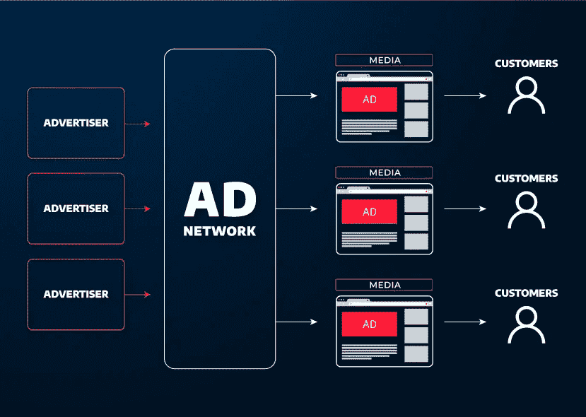

Ad networks moving content from advertiser to customer

对于广告商来说，广告网络将在一个中心汇集他们所有的广告。这将列出所有正在进行的广告活动，它们在哪里进行，它们的目标是谁，以及它们的表现如何。出版商将能够使用他们的仪表板来确定广告产生了多少收入。

[Want to up your ad game? An ad network could be for you! ⬇️Click to Tweet](https://twitter.com/intent/tweet?url=https%3A%2F%2Fkinsta.com%2Fblog%2Fad-networks%2F&via=kinsta&text=Want+to+up+your+ad+game%3F+An+ad+network+could+be+for+you%21+%E2%AC%87%EF%B8%8F&hashtags=MarketingTips%2CPPC)

### 广告网络使用什么样的广告形式？

广告网络使用许多不同的广告形式。如果你打算成为一名出版商，你应该在你的网站上预留一些广告空间。谢天谢地，你不必运行任何你不习惯的格式。例如，如果您不希望弹出广告打断您的[客户友好的用户体验](https://kinsta.com/blog/web-design-principles/)，您可以选择横幅广告或滑块。

以下广告形式是广告网络中最受欢迎的几种形式:

*   弹出式广告
*   原生广告
*   [横幅](https://kinsta.com/blog/banner-ad-sizes/)
*   推送通知
*   牺牲墙
*   长狭潮道
*   设备
*   视频广告
*   正文内
*   手机专用
*   滑块广告
*   载体
*   操作系统（Operating System）
*   即时消息浮动广告

## 广告网络是如何运作的？

既然你对什么是广告网络有了深刻的理解，那么让我们花些时间来讨论它是如何工作的，以及它如何对出版商和广告商都有利。

广告商在广告网络内建立活动。这包括实际的广告本身和活动的参数。需要设置的参数包括预算、上限、发布广告的频率以及广告商试图触及的目标受众。

广告网络获取这些信息，并向发布者提供广告标签，让他们直接安装到自己的页面上。一旦完成，广告就可以发布了，广告商可以自由地旋转他们的广告横幅，并通过广告网络的中央控制面板管理一切。

这意味着广告商和出版商之间没有联系的必要。所有的广告管理都是通过网络完成的，所以你不必担心来回奔波。

有各种类型的广告网络可供选择，这取决于您作为出版商或广告商的需求。

### **优质广告网络**

优质广告网络只向知名出版商出售空间。这些都是受欢迎的网站，可以创造很高的需求。付费网络也有更高的内容标准，导致[转化率](https://kinsta.com/blog/conversion-rate-optimization-tips/)增加，出版商网站产生更多收入。

### **垂直广告网络**

垂直网络销售特定主题的内容。一个很好的例子就是专门为时尚业或旅游业设计的广告网络。旅游网络的出版商网站可能包括[旅游博客](https://kinsta.com/blog/how-to-start-a-travel-blog/)、酒店网站、旅行社网站等等。

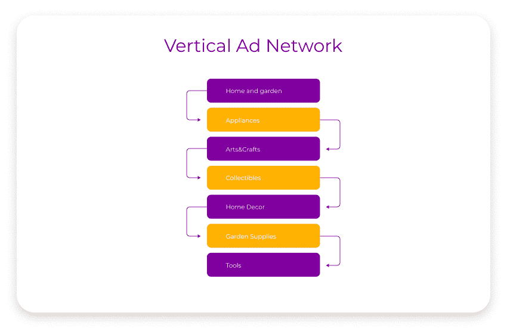

Different verticals connect in a vertical ad network

垂直网络中生成的所有广告都应该吸引相似的受众。虽然这些网络上的流量可能低于其他一些选择，但它们更有针对性和相关性，所以它们产生高质量的流量。

通过垂直广告网络在你的网站上发布广告的广告客户可以选择在你的整个网站或某些部分投放广告。

### **横向广告网络**

横向广告网络提供更多的数量和更全面的库存基础。然而，在这些网络上运行的广告的目标更加普遍，这意味着较低质量的互动可能会发生。

然而，这些广告在更广泛的网络上运行，因此印象的机会将更高。

### **专业广告网络**

专门的广告网络，有时被称为特定库存广告网络，专注于特定类型的广告或设备。

例如，在专业网络上运行广告的人可能只想运行移动广告或为他们的内容营销战略推送视频。这些移动广告网络为应用程序提供广告，所以如果你已经开发了一个应用程序，并希望将其货币化，这些网络中的一个可能是你的正确选择。

### **绩效和附属广告网络**

如果你有兴趣参与影响者营销或[联盟项目](https://kinsta.com/affiliate-academy/affiliate-programs-for-bloggers/)，一个绩效广告网络可能是正确的选择。这些网络允许像[播客](https://kinsta.com/blog/how-to-promote-a-podcast/)、YouTubers、Twitch streamers 和博客这样的有影响力的人与希望通过流行平台推广其产品的公司联系。

大多数大企业都经营一个联盟广告网络。亚马逊是更著名的平台之一，但你也会看到像塔吉特、家得宝和百思买这样的公司参与进来。

这些网络通常基于每次转换成本或每次收购成本模型运行，因此支出完全基于绩效。

## 广告网络如何让广告商和出版商受益？

当与一个好的广告网络合作时，出版商和广告商受益匪浅。

出版商可以出售他们网站上的空间，而这些空间他们根本就没有使用。

广告商可以通过在许多不同的出版商之间传播广告而受益，同时仍然使用一个集中的平台来管理他们的活动。

易用性对广告商来说是一个巨大的好处。他们只需设置一次活动，并在多个网站上发布。

此外，整个网络都遵守预算和上限。这意味着不需要单独管理。

## 选择广告网络时要考虑的因素

在选择合作的广告网络之前，你需要考虑一些重要的因素。

首先，网络提供了哪些商业模式？一些常见的例子包括:

*   CPM(每千分之一成本)，即每 1000 次展示的成本
*   每次点击成本
*   CPI(每次安装成本)
*   每项行动成本
*   CPV(每次观看的费用)

在注册之前，您需要考虑的其他一些因素包括:

*   提供的垂直市场
*   广告类型
*   易用性
*   支付选项
*   把…作为目标

## 2022 年出版商的 20 大广告网络

### 1.Google AdSense

当人们谈论广告网络时，他们通常想到的第一个是谷歌 AdSense。它无疑是世界上最大、最知名的广告网络。它允许出版商通过在他们的网站上粘贴广告代码来提供广告空间，甚至可以通过插件将[添加到 WordPress。](https://kinsta.com/blog/how-to-add-google-adsense-to-wordpress/)

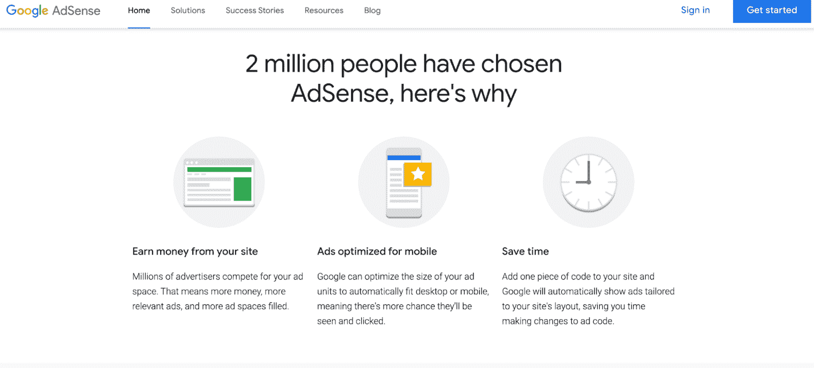

Google AdSense

一旦完成，出版商可以选择他们希望广告出现在哪里。还有一个选项，谷歌运行测试来定位你的页面上的最佳广告位置。然后，广告商对广告位置进行竞价，出价最高的广告就会出现在你的网站上。一旦发生这种情况，出版商就会得到报酬。

AdSense 的最低支付门槛是 100 美元。虽然这是最广为人知的服务，但有几个 [AdSense 替代品](https://kinsta.com/blog/adsense-alternatives/)可供选择。

### **2。亚马逊联营公司**

如果你对[联盟营销](https://kinsta.com/affiliate-academy/affiliate-marketing-statistics/)感兴趣，亚马逊是这个领域的第一批大牌之一。[亚马逊联盟](https://affiliate-program.amazon.com/)网络是一个营销项目，允许出版商在他们的网站上手动放置产品链接。

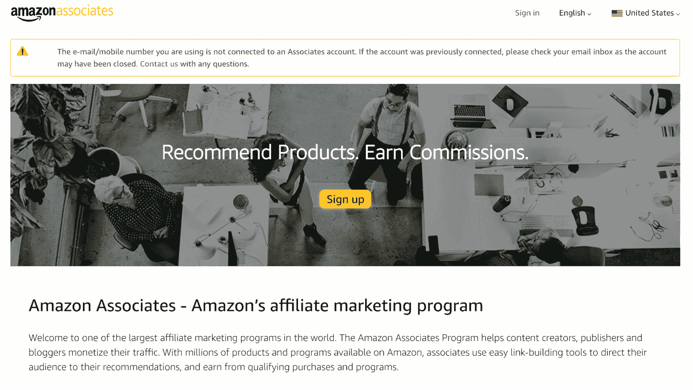

Amazon Associates

还有一种不干涉的方法叫做原生购物广告，它可以让你根据亚马逊产品出现的页面来显示它们。

一旦访问者点击你的广告并购买，你就可以从中获得佣金。不仅如此，你还可以从用户使用你的链接时的额外购买中获得佣金。

亚马逊员工的支付门槛仅为 10 美元。

### **3。纪念碑**

Monumetric 是一个广告网络，它允许出版商以一种用户友好的方式展示广告，而不会妨碍浏览体验。

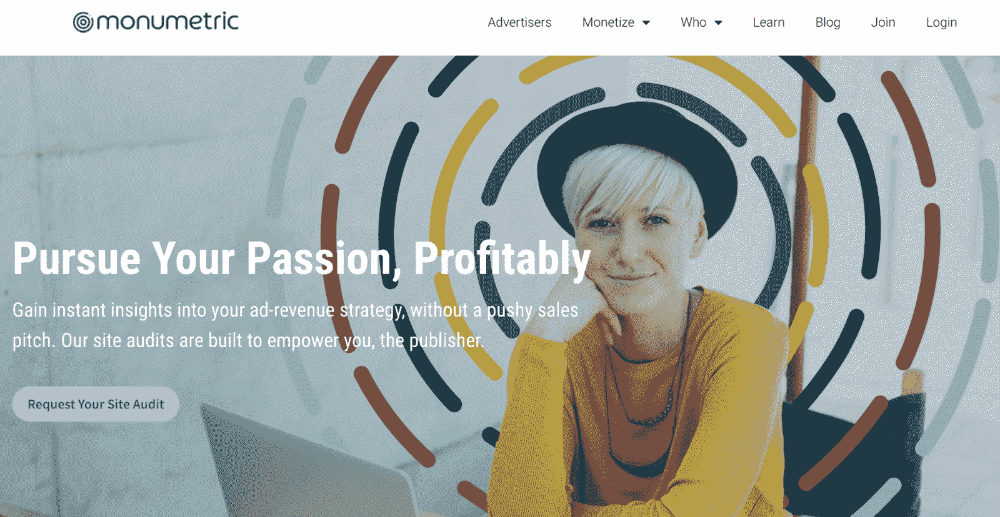

Monumetric

注册这项服务时，列出你有免费的广告空间。然后，Monumetric 将相应地填充该空间。

然而，根据你的[定位策略](https://kinsta.com/blog/positioning-strategy/)，如果有你不希望在你的网站上推送的特定类型的广告或公司，你可以指定这些偏好，Monumetric 会处理的。

这项服务需要 99 美元的安装费，如果你的网站有超过 80，000 的页面浏览量，可以免除这项费用。成为不朽出版商的最低门槛是每月 10，000 的页面浏览量。最低支付要求是 10 美元，可通过直接存款或贝宝支付。

### **4。Adcash**

当使用 [Adcash](https://adcash.com/) 在你的网站上运行广告时，你可以在原生广告、弹出式广告、间隙广告和横幅广告之间进行选择。该公司采用 CPM、CPC 和 CPA 业务模式，没有最低流量要求。

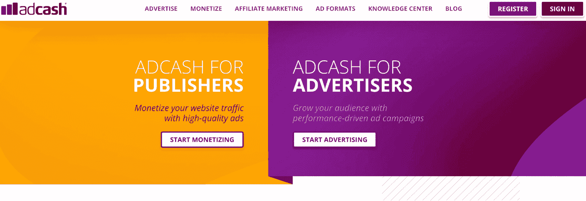

Adcash

与 Adcash 合作时，您将有机会获得拥有丰富广告经验的多语言客户经理提供的[知名技术支持。](https://kinsta.com/kinsta-support/)

Adcash 的最低支付门槛为 25 美元。请求支付后，你将在 30 天后收到你的钱。

### **5。正中藤蔓**

Mediavine 是一个广告网络，在生活内容领域很受欢迎。旅游博客、[美食网站、](https://kinsta.com/blog/how-to-start-a-food-blog/)、家居装修平台和妈妈博客都利用这个网络取得了很大的成功。

## 注册订阅时事通讯

### 想知道我们是怎么让流量增长超过 1000%的吗？

加入 20，000 多名获得我们每周时事通讯和内部消息的人的行列吧！

[Subscribe Now](#newsletter)

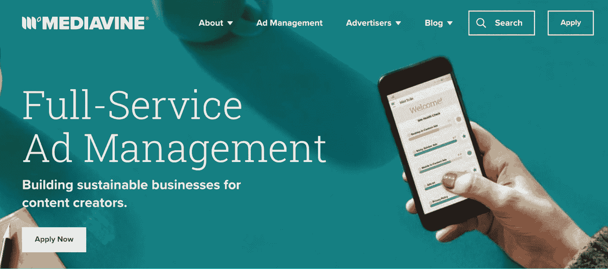

Mediavine

虽然这些垂直市场取得了最大的成功，但这个网络并不局限于生活方式中心。任何人都可以加入。

Mediavine 所需的最低流量为每月 50，000 次访问。该网络以净 65 为基础支付，这意味着您在 65 天后收到付款。

所有款项都在每月的第五天支付。作为特殊忠诚度奖励的一部分，您的收入份额每年都会增加。根据您选择的支付方式，最低支付限额在 25 美元到 200 美元之间。

### **6。Ezoic**

Ezoic 是一个依靠机器智能运行的广告网络。它不断测试不同的位置和广告设计，为出版商创造最高收入的配置。这就是为什么它自称是一个为出版商设计的智能平台。

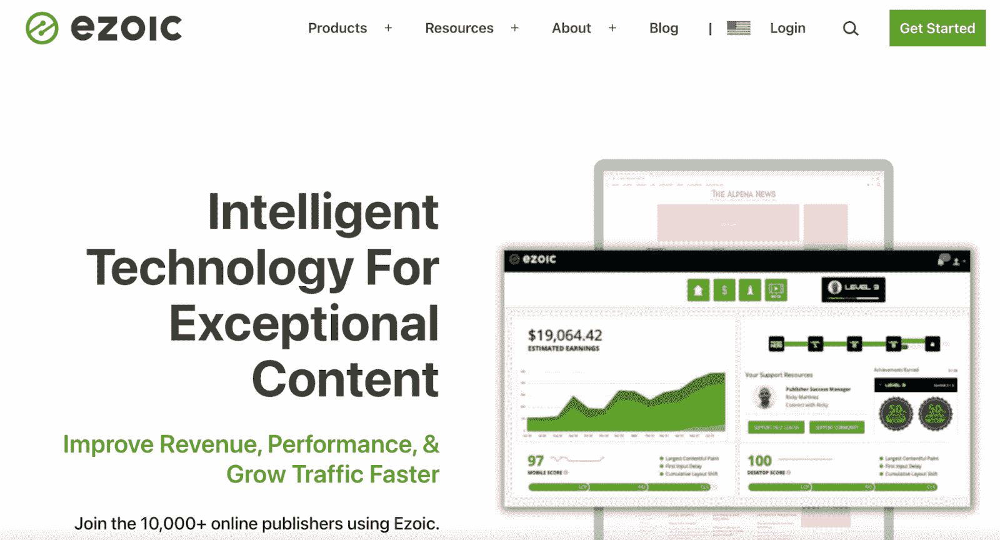

Ezoic

Ezoic 易于使用，带有拖放测试位置。它还可以让你设定自己的目标，并进行测试，看看你的位置对目标的影响有多大。Ezoic 还允许你连接其他广告网络，比如 Google AdSense，以最有效的方式在这个平台上运行广告。

Ezoic 的最低支付额是 20 美元，你需要每月有 10，000 次访问才能使用它。内容垂直市场没有限制。

### **7。Epom 市场**

[Epom 市场](https://epom.com/)每月为 40 多个国家的 15 个不同垂直市场提供超过 130 亿次广告展示。

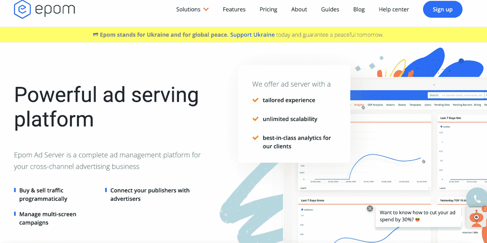

Epom Market

在 Epom Market 上投放广告时，您可以使用[横幅广告](https://kinsta.com/blog/banner-ad-sizes/)、文字广告、手机专用广告和视频广告。它采用 CPM、CPC、CPA 和拍卖业务模式，要求出版商每月有 50 万次展示。

该网络的 30 天试用可以免费产生多达 10 亿次展示。Epom market 有月费，从每月 212 美元的基础费用开始，越往上越多，每月费用将超过 2000 美元。

### **8。应用程序**

AppLovin 是一个连接移动广告商和出版商的移动广告网络。

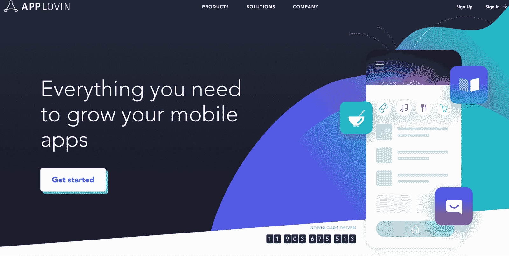

AppLovin

有各种规模的应用程序可供选择，这个网络运行在注册会计师和 CPV 的商业模式下。开始使用 AppLovin 网络没有最低应用流量要求。

AppLovin 在 Net 15 系统上支付，这意味着一个月结束时产生的所有收入将在 15 天后支付。

### **9。点击**

Clickadu 是一个支持网站和移动渠道的数字广告网络。它采用 CPM 商业模式，有几种不同的广告形式。

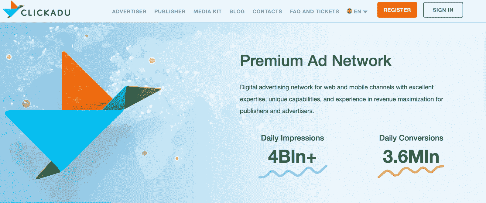

Clickadu

这包括浏览广告、视频前置广告和弹出式广告。活动既可以是管理式的，也可以是自助式的。还包括高级定位选项。

Clickadu 没有最低流量要求。大多数支付选项的最低支付门槛是 50 美元，但如果你使用贝宝，只有 10 美元。

Struggling with downtime and WordPress problems? Kinsta is the hosting solution designed to save you time! [Check out our features](https://kinsta.com/features/)

### 10。信息链接

[信息链接](https://www.infolinks.com/)在您的内容中放置带有特定关键字的上下文广告，以增强相关性和用户互动。它将广告与你的内容特别匹配，当用户悬停在突出显示的关键词上时，就能看到广告。

Infolinks

该网络还使用屏幕底部的静态通知栏广告，页面浏览之间弹出的间隙广告，以及网站两侧的垂直广告。

信息链接的最低支付门槛是 50 美元。

### **11。PopAds**

PopAds 专门做弹出式广告。这是一项具有增强安全性的快速服务，为客户提供实时消费者数据以供分析。这可用于布局优化目的。

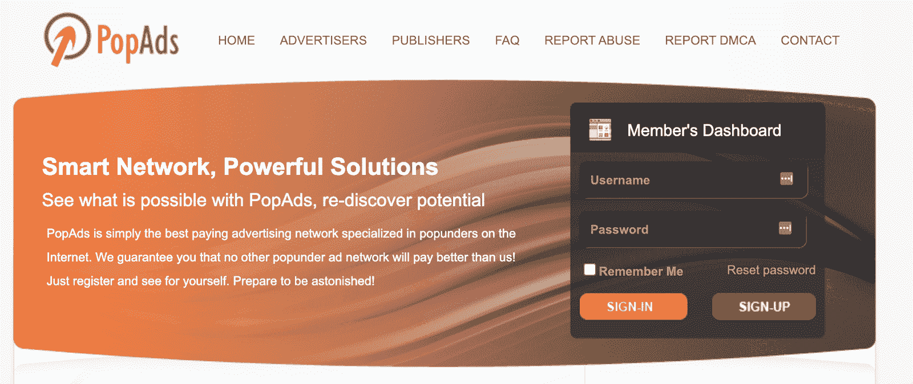

PopAds

PopAds 使用 CPM 和 CPV 商业模式，没有最低流量门槛。Popads 的支付门槛只有 5 美元。

### **12。交通力**

流量力量将出版商与 100 多家合作伙伴联系起来，并形成了一种基于印象的商业模式。

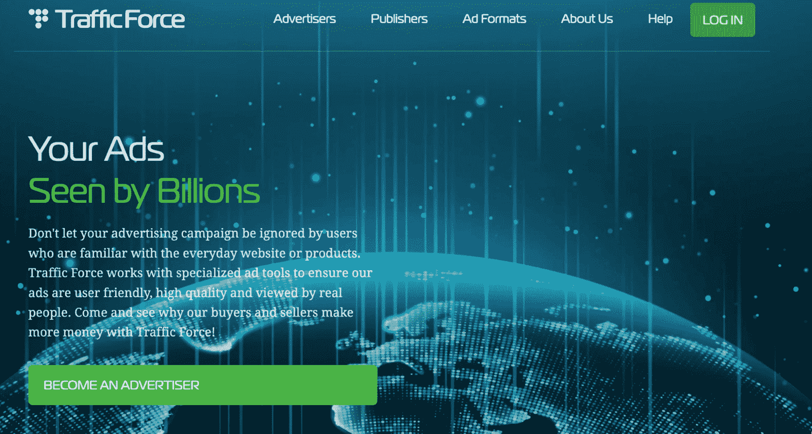

Traffic Force

广告形式从显示横幅广告到即时消息浮动广告、弹出式广告和视频流广告。它使用 OpenRTB 技术处理流量。这个网络非常安全，使用软件扫描所有的广告来查找恶意广告。它通过 [SSL secure](https://kinsta.com/blog/types-of-ssl-certificates/) ads 增加了另一层安全性。

交通力量没有最低交通要求。根据出版商的偏好，可以每周、每两周或每月付款。

### 13。塔布拉

Taboola 是一个广告网络，[利用你的博客或提供内容建议的网站赚钱。这些建议作为广告出现在网站内容之后。](https://kinsta.com/blog/how-to-monetize-a-blog/)

Taboola

这是一个为大型网站设计的网络，每月至少有 50 万访问者才能成为出版商。该网络会在您第一个月结束后的 45 天内发放您的首笔款项。

### **14。Adblade**

[Adblade](https://www.adblade.com/) 专门针对媒体机构，与美国广播公司、雅虎！和福克斯新闻频道，以及许多其他大型出版商。

Adblade

它采用 CPM、CPC 和实时竞价商业模式，要求出版商每月至少有 50 万用户注册。Adblade 在每月结束后 30 天支付，支票或 ACH 转账的最低支付限额为 100 美元。国际转账最低 250 美元。

### 15。推进媒体

Propel Media 是一家 CPV/PPV 广告网络，以接触高意向受众而闻名。它通过使用展示广告和上下文文本广告来做到这一点。它使用推送广告、灯箱广告和新的标签体验。

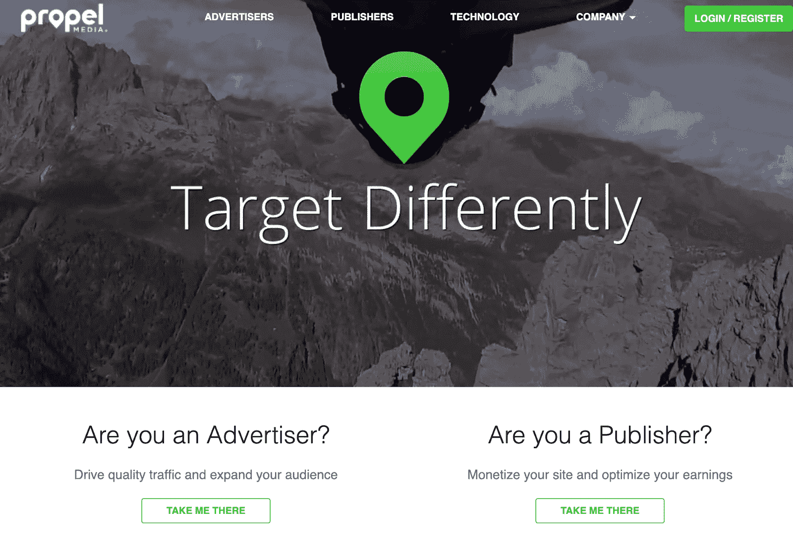

Propel Media

该网络提供了增强的优化选项，以及[可视化分析](https://kinsta.com/blog/data-visualization-tools/)。没有最低流量要求，

### 16。低音

Undertone 是一个广告网络，为广告商和出版商等提供 T2 视频营销和灵活整合。

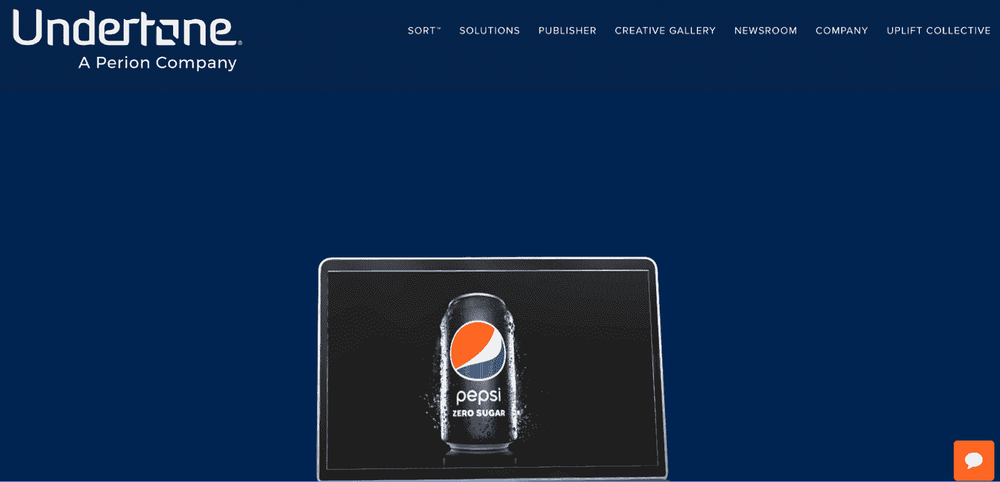

Undertone

Undertone 出名的原因是移动广告、网络广告和各种设备上的应用内广告体验。它采用 CPM、CPC、CPA 和 CPV 商业模式，要求出版商每月有 50 万用户注册这项服务。

### 17.阿德马文

AdMaven 被誉为最好的弹出式广告网络之一，但它也支持其他几种广告形式。这包括灯箱广告、插页广告、展示广告和滑动广告。

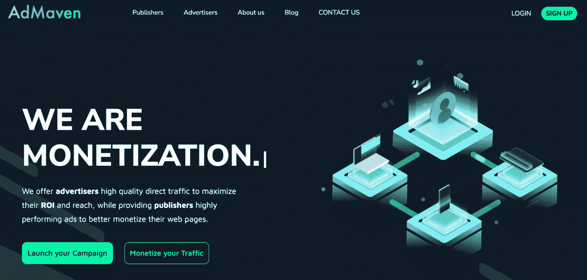

AdMaven

它使用 CPA、CPI、CPL、CPC 和 CPM 业务模型，并且不要求最低流量。AdMaven 的最低支付门槛是 50 美元，除非您选择电汇。这就要求出版商至少要赚 1000 美元。

### **18 号。螺旋桨气流**

[PropellerAds](https://propellerads.com/) 是一家专注于几种不同广告形式的广告网络。这包括传统的显示广告选项，以及智能链接、弹出广告、插播广告和浏览器[推送通知](https://kinsta.com/blog/turn-off-push-notifications/)。

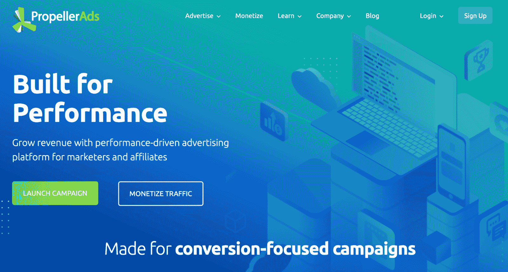

PropellerAds

PropellerAds 的最低支付门槛仅为 5 美元，并且可以每周支付。

### **19。BuySellAds**

[BuySellAds](https://www.buysellads.com/) 列出了广告商可以直接购买的中央市场中出版商的库存。你永远不需要与广告商沟通，因为网络会直接处理一切。

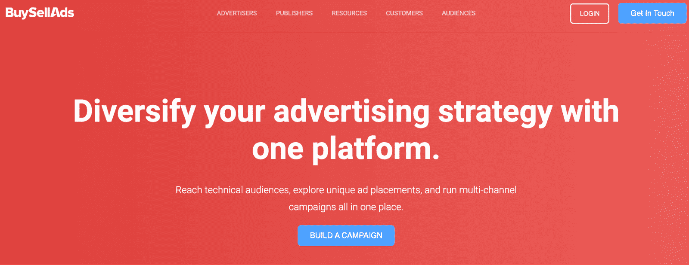

BuySellAds

如果你还没有卖出一个广告位，你还可以选择弹出的“后退”广告选项。这可以确保你的网站上永远不会没有广告。此网络没有最低流量要求。根据您的支付选择，最低限额从 20 美元到 500 美元不等。

### 20。AdThrive

AdThrive 是一个专注于生活网站和博客的网络。这包括育儿、食物、旅游、家居装修和 DIY 博客等等。与 Mediavine 非常相似，你不必参与这些垂直行业就可以通过 AdThrive 开展工作。他们只是它的最高执行者。

AdThrive

AdThrive 是一个实际上保证支出的网络，这意味着即使广告商不支付他们，他们仍然会支付你。它主要处理美国以外的流量，因此拥有全球受众的网站可能无法充分利用它。

要使用 AdThrive，您必须拥有至少 100，000 的月浏览量，并且在您的网站上安装了[Google Analytics](https://kinsta.com/blog/google-analytics-wordpress/)。AdThrive 按 Net 45 计划支付，最低支付门槛为 25 美元。然而，电汇的最低限额是 100 美元。

[Are ad networks too good to be true? 👀 Learn more in this guide ✅Click to Tweet](https://twitter.com/intent/tweet?url=https%3A%2F%2Fkinsta.com%2Fblog%2Fad-networks%2F&via=kinsta&text=Are+ad+networks+too+good+to+be+true%3F+%F0%9F%91%80+Learn+more+in+this+guide+%E2%9C%85&hashtags=MarketingTips%2CPPC) ## **总结**

广告网络是你网站赚钱的好方法，而且不费吹灰之力就能给 WordPress 添加广告。你不必直接与广告商互动，可以高枕无忧，让网络来处理一切。

在与广告网络合作时，您可以专注于您的网站内容，确保您的页面浏览量达到最大的广告曝光率和最大的利润，同时使用您的 [Kinsta APM](https://kinsta.com/apm-tool/) 功能来监控性能。

更多有效托管网站的选择，包括[托管 WooCommerce 托管](https://kinsta.com/woocommerce-hosting/)，请联系金斯塔和[安排今天的演示](https://kinsta.com/schedule-demo/)。

* * *

让你所有的[应用程序](https://kinsta.com/application-hosting/)、[数据库](https://kinsta.com/database-hosting/)和 [WordPress 网站](https://kinsta.com/wordpress-hosting/)在线并在一个屋檐下。我们功能丰富的高性能云平台包括:

*   在 MyKinsta 仪表盘中轻松设置和管理
*   24/7 专家支持
*   最好的谷歌云平台硬件和网络，由 Kubernetes 提供最大的可扩展性
*   面向速度和安全性的企业级 Cloudflare 集成
*   全球受众覆盖全球多达 35 个数据中心和 275 多个 pop

在第一个月使用托管的[应用程序或托管](https://kinsta.com/application-hosting/)的[数据库，您可以享受 20 美元的优惠，亲自测试一下。探索我们的](https://kinsta.com/database-hosting/)[计划](https://kinsta.com/plans/)或[与销售人员交谈](https://kinsta.com/contact-us/)以找到最适合您的方式。