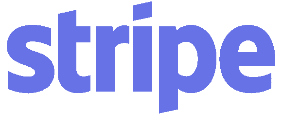
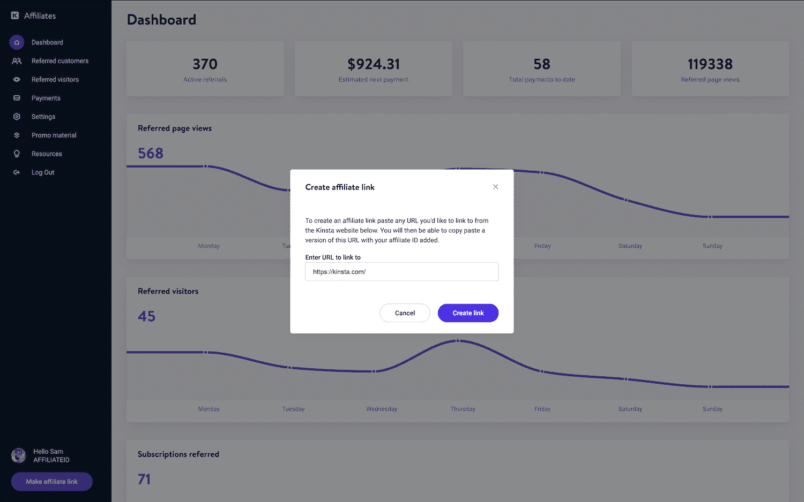
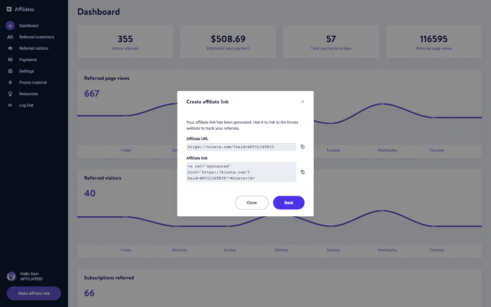
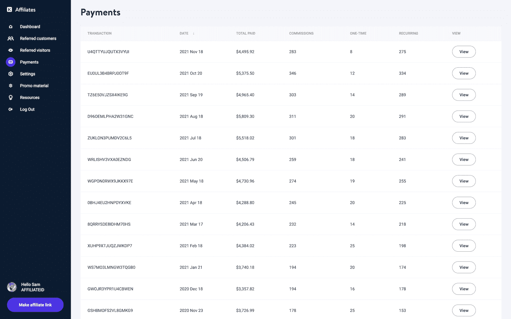
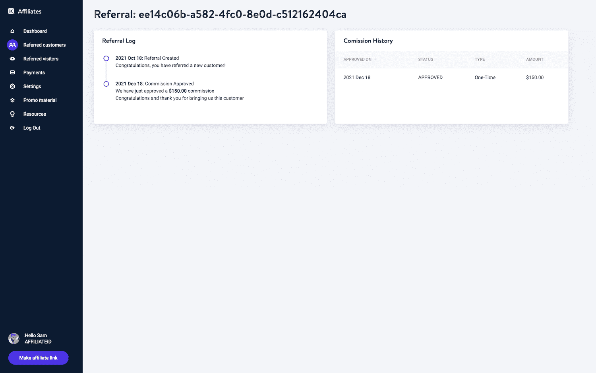
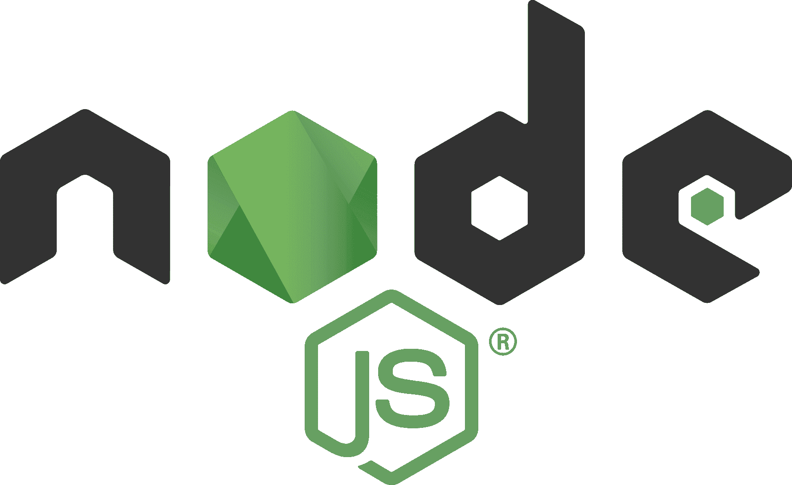
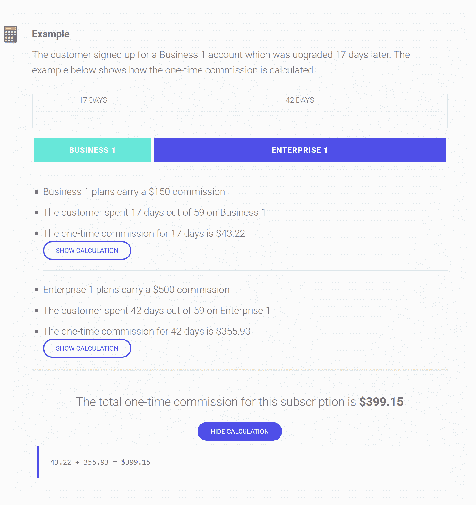
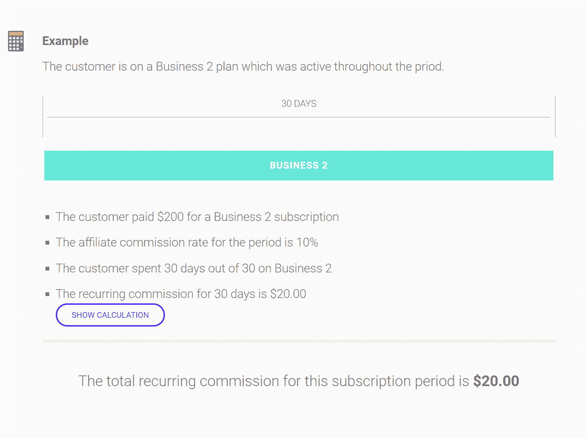
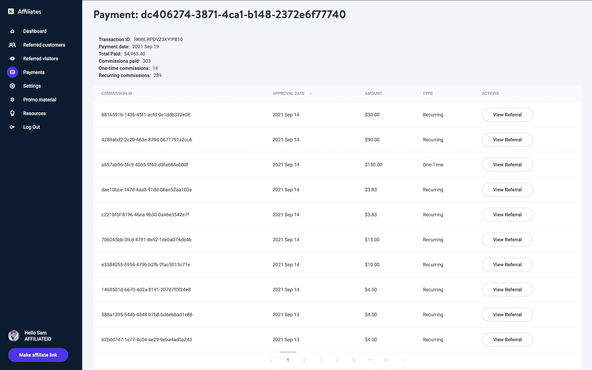
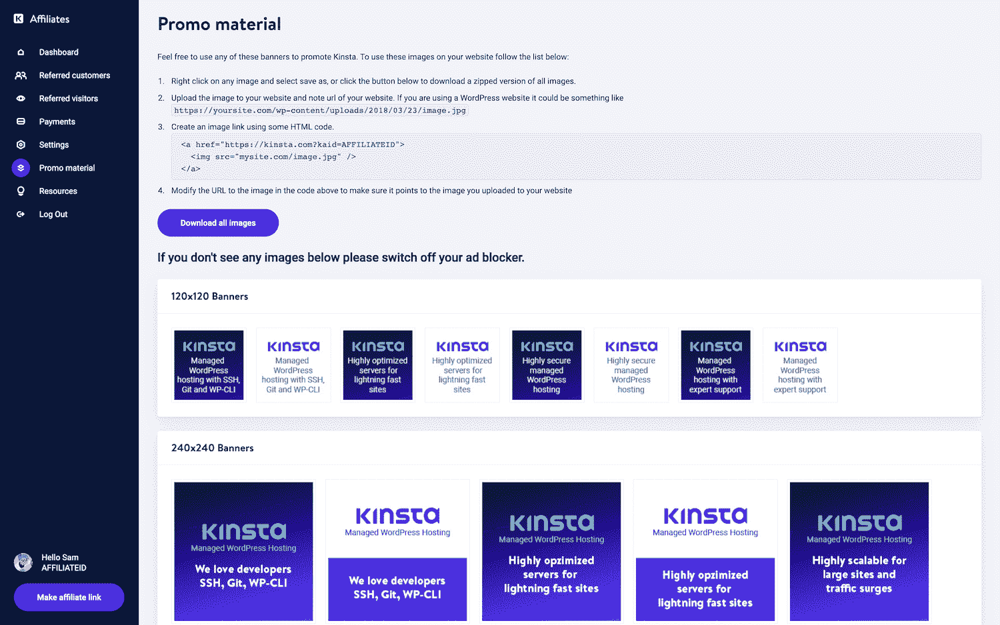

# 加盟系统很烂，所以我们推出了自己的系统

> 原文：<https://kinsta.com/blog/affiliate-system/>

让我们完全坦诚；市场上的大多数联盟系统是彻头彻尾的可怕。要么它们令人难以置信地困惑、笨重、缓慢，要么它们看起来像是 90 年代设计的。或者更糟，以上所有情况的混合。有些可能有一半的工具，你需要的，但然后缺少其他必要的功能，你的下属营销人员想要的。😩

自从我们推出 Kinsta 以来，我们的使命就是绝不向客户发布任何不合格的产品。我们坚持的一个标准是，如果我们自己不会使用它，那么我们必须找到更好的方法。因此，正如我们对 MyKinsta 仪表板所做的一样，我们决定打造自己的仪表板。

今天，我们将从商业和发展的角度讨论我们走这条路的一些原因，以及我们最终的结果(从 MVP 到最终产品)。

*   [为什么我们推出自己的产品](#rolling-our-own)
*   [我们的加盟系统如何运作的基础知识](#how-the-affiliate-system-works)
*   [MVP(开始构建)](#mvp)
*   [改变 MVP(适应和改进)](#changing-mvp)
*   [最终产品](#final-product)
*   [行动中的加盟系统和计划](#kinsta-affiliate-system)

## 为什么我们推出自己的产品

当我们开始研究实现联盟系统需要做什么时，我们很快意识到没有现成的解决方案适合我们。以下是主要原因:

*   最大的问题是我们的会员系统需要与我们的计划和订阅系统紧密结合，而不是与第三方提供商结合。
*   品牌对我们来说非常重要。虽然一些联盟系统提供白标解决方案，但大多数是半成品实施，并不总是完全透明的。我们自己建造它将允许我们完全控制设计和品牌，甚至不必担心白色标签的解决方案。
*   依赖第三方系统会阻止我们快速添加新功能，或者根本不添加。我们定制的 [MyKinsta dashboard](https://kinsta.com/mykinsta/) 大部分都是完全根据用户反馈构建的，这也是它成为业界最好的 WordPress 站点管理工具之一的原因！感谢我们了不起的客户。👏我们知道，从我们推出第三方解决方案的那一刻起，反馈和请求就会源源不断地涌来，而我们没有能力实现这些。
*   不仅为我们的分支机构，也为我们的管理员提供和构建定制报告的能力是我们不可或缺的。**我们热爱并需要数据！**除此之外，你还应该如何制定未来的战略决策？还必须从我们复杂的计划和订阅系统中提取报告数据。

[MyKinsta has become one of the best #WordPress site management tools in the industry! How? By listening to clients.👂Click to Tweet](https://twitter.com/intent/tweet?url=https%3A%2F%2Fkinsta.com%2Fblog%2Faffiliate-system%2F&via=kinsta&text=MyKinsta+has+become+one+of+the+best+%23WordPress+site+management+tools+in+the+industry%21+How%3F+By+listening+to+clients.%F0%9F%91%82)

再深入一点，我们知道一旦我们向公众开放联盟系统，我们就无法停止。当然，漏洞已经修复，但如果我们需要更换支付提供商，我们不能在继续收取他们有权收取的款项的同时搁置我们的分支机构。

此外，灵活性是一个主要问题。如果我们不得不改变订阅的内部处理方式(这实际上已经发生了)，我们能够处理多种语言和货币吗？我们一路开发的附加软件怎么样，比如 [Redis](https://kinsta.com/help/redis-cache/) 、[每小时备份](https://kinsta.com/help/wordpress-backups/#hourly-backups)等等。我们能为我们的用户建立一个可扩展的仪表板吗？

从技术角度来说，用别人的软件被证明是**完全多余的。由于我们有一种通过 [Stripe](https://kinsta.com/blog/credit-card-fraud-stripe/) 处理订阅的特殊方式，我们需要编写自己的逻辑来解释什么是推荐以及升级和降级的变更机制。**

虽然我确信许多解决方案都有 API，但是编写代码将我们的数据发送到 API 将会是 80%的工作。为什么不投入额外的 20%,创造我们自己的用户界面，这是我们非常擅长的。

### 涉及的费用

另一个大问题是定价。市场上有便宜的产品，但由于功能或灵活性的考虑，它们没有被淘汰。其他人很好地解决了支付问题，并拥有更多功能，但他们的商户费用增加很快。让我们来看看一些最受欢迎的成本。注意:根据销售量和其他因素，有些价格可能会降低一点。

*   **share asale:**:550 美元一次性网费，100 美元押金，每笔交易收取 20%的交易费。
*   **CJ:** $3，000 网费，$3，000 押金，$500 年费，以及 30%的交易费或每笔交易 0.30 美元——以金额较大者为准。
*   **ClickBank:** $49.95 激活费，$2.50 支付期处理费，以及每笔销售的 7.5%交易费+ $1。

假设我们每年从代销商销售中获得 250，000 美元，这是费用总额(扣除一次性押金和网络接入费)。对了，什么是上网费？🤔

*   **分享销售:** $50，000 的费用
*   CJ:75，000 美元的费用
*   **点击银行:** $27，000 的费用

呀！这已经很多了。这还不包括我们已经支付给支付处理器 Stripe 的其他费用。我们还研究了其他联盟系统，如乐天营销和影响半径，但成本更高。

推广我们自己的加盟系统的好处是，我们最大的成本就是开发时间。我们内部已经有了构建一切的惊人天赋。但是正如您所看到的，在选择推出自己的解决方案或使用第三方解决方案时，有许多活动部件和事项需要考虑。

## 我们的加盟系统如何运作的基础

我将进一步深入细节，但是为了理解我们如何开始构建产品，了解基本的数据流是有用的。

进入系统的入口点是一个包含会员 ID 的特殊链接。我们称之为 Kinsta 附属 ID 或简称 KAID(例如:`https://kinsta.com?**kaid=affiliateid**`)

大多数其他代销商工具在知道你应该使用什么样的 URL 和链接到哪里的时候，简直是一塌糊涂。所以从一开始，我们就想让它成为一个简单的两步过程。

### 第一步

第一步是在 Kinsta 网站上输入目的地。这可以是任何地方，不仅仅是我们的主页。也许他们想直接链接到我们的计划页面(如下所示)。

Create Kinsta affiliate link

### 第二步

第二步是为他们生成链接，这样他们就可以轻松地复制并粘贴到他们喜欢的任何地方。并提供附带的 HTML，带有 rel="sponsored "链接属性(这非常重要),以符合 Google 对附属链接的指导原则。Google 之前推荐使用 [nofollow](https://kinsta.com/knowledgebase/add-nofollow-links-in-wordpress/) 属性，这仍然是一个可行的选项。

Generate affiliate link and HTML code

当我们检测到一个访问者使用这样一个链接时，我们设置一个 cookie，其中包含关于谁推荐了该用户的信息。**我们重视初始推荐人**，不提供分成佣金。这对代销商来说更公平，并导致质量胜于数量的竞争。

Stripe 处理所有购买，我们使用其广泛且(大部分)记录良好的 API 来创建用户、订阅、发起支付等等。购买流程发生在网站上，网站反过来使用 MyKinsta 的内部 API 来启动我们需要让用户注册的流程。关于谁推荐了客户的信息也记录在我们的系统中。

## MVP(开始构建)

每当你推出一个新的东西，明智的做法是建立一个 MVP(最小可行产品),并立即开始营销以试水。尽早获得反馈并从中学习。适应、改变和改进。这正是我们第一次推出 Kinsta 时所做的，以及我们如何从 0 美元增长到 7 位数的收入。

我们从一开始就知道，系统中最具挑战性的部分是负责跟踪和计算佣金的逻辑。最初，整个系统是用 PHP 编写的，完全依赖 Stripe 来计算所有的东西。

我们计算推荐佣金的方法是查看被推荐订阅的整个条带历史，并计算出一次性佣金和重复佣金。时间流逝和计划类型等因素会影响计算。

Kinsta affiliate system payments

例如，如果推荐是在两天前创建的，当然不会有一次性佣金。如果推荐是在四个月前创建的，我们必须分配一次性佣金(两个月后到期)和两个经常性佣金(一次性佣金后每月到期一次)。

为了得到一个月要支付的佣金总额，我们对一个特定附属机构的所有推荐做了上述操作。事实证明，这比我们最初想象的计算量更大。我们知道我们必须做出改变，但是我们在功能和开发时间之间找到了一个很好的折衷。

前端使用 PHP 微框架 [Flight PHP](https://danielpataki.com/flight-php/) 构建。我们创建了一些路线，整理了一些表格和图表，然后出发了。

[Tip for developing any new product. Build an #MVP, get feedback early on, and learn from it. 👍Click to Tweet](https://twitter.com/intent/tweet?url=https%3A%2F%2Fkinsta.com%2Fblog%2Faffiliate-system%2F&via=kinsta&text=Tip+for+developing+any+new+product.+Build+an+%23MVP%2C+get+feedback+early+on%2C+and+learn+from+it.+%F0%9F%91%8D)

## 改变 MVP(适应和改进)

在大约 7 个月的私人测试和 6 个月的常规操作后，我们需要重建。我们最初的 MVP 并不是按比例建造的。由于我们新的附加系统和超龄系统，我们处理订阅的方式需要改变。到目前为止，一个客户总是有一个订阅。我们需要改变这种情况，允许每个用户有多个订阅。

由于我们的客户总是有一个且只有一个订阅，我们可以有把握地说，任何活跃的推荐订阅等于一个推荐托管计划。换句话说，订阅是我们认为的推荐。我们需要进行一次彻底的改革，将我们的 Stripe 客户视为推荐客户。

Kinsta affiliate system referred customers

此外，我们计算佣金的次优方法已经开始显露端倪。这主要影响了我们的管理员，但我们确实有 1-2 个分支机构经历了更高的加载时间，而我们计算了他们每次查看仪表板的佣金。

为了使事情圆满，我们想将整个系统移到[节点](https://nodejs.org/en/) + [React](https://reactjs.org/) 区域，使它使用与 MyKinsta 相同的堆栈。如果需要的话，这将允许更多的开发人员加入进来，并开始更容易地使用一种通用的设计语言。

## 最终产品

当我们完成重建时，我们留下了一个非常优秀的系统，它需要更少的管理，有更多的功能，自动化常见的附属管理任务，并与我们的主要产品 MyKinsta 共享相同的技术堆栈。

### 堆栈

附属系统现在运行在后端的节点上，并在前端作出反应。它利用 [GraphQL](https://graphql.org/) 来满足我们的查询需求，利用 [Ant Design](https://ant.design) 来设计框架。

## 注册订阅时事通讯

### 想知道我们是怎么让流量增长超过 1000%的吗？

加入 20，000 多名获得我们每周时事通讯和内部消息的人的行列吧！

[Subscribe Now](#newsletter)

实际上有四个独立的进程同时运行:

*   **加盟后台:**这是整个系统的后台。它与外界完全隔绝；只有内部通讯才能到达。它基本上是数据库的入口点，它所做的只是接受和回答 GraphQL 查询
*   **代销商仪表板:**这是代销商系统面向用户的一面。它由一堆 React 组件组成，这些组件通过 GraphQL 查询从后端获取数据
*   **附属管理:**这是一个特殊的管理界面，管理员可以在这里查看汇总统计数据、管理应用程序和执行其他任务
*   **关联同步:**一组 cron 作业，保持一切同步——我们将很快进入这一部分，因为这是系统的核心

### 数据和计算的改进

在该系统的初始版本中，我们对所有东西都进行了特别的计算。这被证明是数据密集型的，但它也不是很好，因为如果我们改变一些东西——比如支付的佣金金额——它要么改变事后的一切，要么我们需要用基于日期的 if 语句丢弃代码。

新的联盟系统使用两种机制来提高效率:一种从 Stripe 获取数据的更好方式和一个记录事件的分类系统。

事件系统确保无论发生什么，都不会改变。如果推荐人应支付一次性佣金，我们会记录该佣金并将其附加到推荐人。然后，我们标记该推荐，并且不再查看一次性佣金。同样的机制也适用于经常性佣金。一旦计算并记录了一个周期的经常性佣金，我们就“忘记”了这个周期。

这意味着计算只需要在很短的时间内完成，佣金的汇总通过简单地汇总一些数据库行来完成。

第二个组件依赖 cron 作业来收集数据。我们每 10 分钟从条带中抓取所有数据，并将其保存到本地数据库中，进行一些修改以使进一步的处理更容易。

例如，判断订阅更改事件是否涉及托管计划需要大量的代码。我们可以在需要的时候计算这种特殊情况，但是我们没有这样做，而是使用 cron 作业向保存的对象添加一个标志。由于我们正在获取 10 分钟的数据，整个过程可能需要 100 毫秒，这使得进一步的选择查询更加高效。

第二个 cron 作业将数据放到最终位置，计算佣金、创建事件和其他操作。

分开执行这些操作的原因是，第一个操作非常简单，但依赖于条带，而第二个操作要复杂得多。如果我们在第二个操作中引入一个错误，导致它失败，我们就不需要重新同步数小时/数天/数周的条带数据；我们只需要重新运行第二个操作。

这种设置提供了许多其他好处，每个 cron 作业依次由几个不同的组件组成，如获取新订阅、批准待定佣金等。将来，我们可能希望进一步分解我们的 cron 作业，以确保我们可以尽早发现问题，而不会影响系统的其他部分。

在优化我们的计算并迁移到新的框架后，我们的关联仪表板**现在加载速度提高了一倍**！🚀

## 行动中的联盟系统和计划

如果不展示我们的[联盟系统](https://kinsta.com/affiliates/)和正在运行的项目，这篇文章就不完整。以下是我们为 Kinsta 所有分支机构提供的部分功能和优势。

Kinsta affiliate dashboard

### 1.无与伦比的佣金(注册奖金+经常性)

我们在我们的佣金和支出结构上下了很长时间的功夫，因为我们意识到这可能是附属公司最重要的因素之一。事实上，我们托管的许多博客和网站所有者都是靠代销商收入维持生计的。我们很荣幸现在提供业内最高的奖金！对于某人推荐的每个 Kinsta 托管计划，他们将获得一次性注册奖励，具体如下:

Struggling with downtime and WordPress problems? Kinsta is the hosting solution designed to save you time! [Check out our features](https://kinsta.com/features/)

*   起步计划(50 美元)
*   专业计划(100 美元)
*   业务 1-4(150 美元)
*   企业 1-2(500 美元)

但是等等，我们不会就此止步！除了签约奖金之外，代销商还可以从每笔推荐中获得每月 10%的佣金。以下是我们所知道的佣金支付方式的几个例子。在我们的[附属条款](https://kinsta.com/legal/affiliate-terms/)中查看更多支付场景示例。

**注册奖金示例**

Affiliate payout example

**经常性佣金示例**

Recurring commission example

### 2.实时跟踪

我们的代销商仪表板不同于市场上的任何其他仪表板！您可以近乎实时地查看会员数据、页面浏览量、订阅量、深入的计划详情，甚至可以深入查看单个推荐，并检查该推荐的所有付款(如下所示)。

Kinsta affiliate payment drill-down

### 3.高寿命价值

向金斯塔推荐客户的最大优势之一是，我们对每个客户都有极高的终身价值。我们的流失率低于 4%！这意味着代销商可以轻松赚取该客户终身的经常性佣金。

### 4.每月支出

分支机构没有必要担心或标记他们的日历。Kinsta 总是按时付款，并且每个月都会直接寄到代销商的 PayPal 账户。

### 5.快速促销材料

需要在网站或博客上推广 Kinsta 的横幅广告吗？别担心，我们有很多！从[附属仪表板](https://affiliate.kinsta.com/)可以轻松访问促销横幅和徽标。

Kinsta affiliate banners

### 6.长转换窗口

人们很忙，可能不会马上改变信仰。很多时候，当选择新的 WordPress 主机时，人们喜欢货比三家。这就是我们为代销商提供 60 天跟踪 cookies 的原因，以确保他们获得销售积分。

### 7.ITP 2.0 准备就绪

金斯塔附属系统是 ITP 2.0 准备好了！[智能跟踪预防 2.0](https://webkit.org/blog/8311/intelligent-tracking-prevention-2-0/) (ITP)是苹果在 Safari 11 及更高版本中的新设置，从本质上限制了基于网络的跟踪解决方案对浏览器中 cookies 的访问。根据最近的一项研究，截至 2020 年 10 月，Safari 仍然占据着 T2 网络浏览器市场份额的 8%左右。所以这个变化对广告行业影响很大。

不过，不用担心。Kinsta 附属系统完全依赖于第一方 cookies，没有反弹或其他避开 ITP 的方法。因此，所有转介都将得到适当的跟踪和记录，就像在 ITP 2.0 之前一样。

出于以下原因，我们特意在不采用“防 ITP”方法的情况下构建系统:

1.  我们相信诚实、透明的跟踪，并收集尽可能少的数据。
2.  我们不需要通过多个网站跟踪访问者。
3.  我们预计网络规则会随着时间变得越来越严格。

你可以阅读更多关于 ITP 2.0 衍生的内容。

### 8.多语言仪表板–提供五种语言

我们的 Kinsta 附属仪表板现在有五种不同的语言版本，更多版本即将推出。目前，您可以选择以下选项:

*   英语
*   德国人
*   法语
*   西班牙语
*   意大利的

### 9.帮助子公司取得成功

除了建立一个令人敬畏的联盟系统和仪表板，我们真的希望联盟成功。他们能赚的钱真的没有限制。任何人都可以免费加入。 [在这里报名](https://kinsta.com/affiliates/)。

注意:我们确实手动批准附属账户，只是为了确保网站遵守我们的[附属条款](https://kinsta.com/legal/affiliate-terms/)。

Kinsta 的营销团队和我们的加盟经理将随时为您提供帮助。我们很乐意提供[代销商营销技巧](https://kinsta.com/affiliate-academy/affiliate-marketing-tips/)和[代销商销售技巧](https://kinsta.com/affiliate-academy/affiliate-sales-tips/)，让促销活动更上一层楼。事实上，我们正致力于在我们的博客上制作专门为代销商设计的额外内容，以及增加收入的方法。

## 摘要

事实证明，我们目前的实现更加稳定，速度更快，对我们的会员和管理员来说都是更好的体验。它奠定了坚实的基础，在此基础上，我们可以建立一个了不起的产品和计划。

一个很大的好处是，我们现在可以更加关注面向用户的改进。在发布后的几个月里，我们增加了更多的图表、URL 跟踪等功能。我们计划进一步改善用户体验，并为我们的分支机构提供工具，使他们能够赚取更多。

我们离完成还远着呢！🤘

[想建立自己的加盟系统？](https://kinsta.com/affiliate-academy/affiliate-marketing-tips/)我们不会说谎，这是一项繁重的工作，但非常值得花费时间和精力。我们现在有一个系统，我们整个团队都引以为豪，分支机构也乐于使用。

* * *

让你所有的[应用程序](https://kinsta.com/application-hosting/)、[数据库](https://kinsta.com/database-hosting/)和 [WordPress 网站](https://kinsta.com/wordpress-hosting/)在线并在一个屋檐下。我们功能丰富的高性能云平台包括:

*   在 MyKinsta 仪表盘中轻松设置和管理
*   24/7 专家支持
*   最好的谷歌云平台硬件和网络，由 Kubernetes 提供最大的可扩展性
*   面向速度和安全性的企业级 Cloudflare 集成
*   全球受众覆盖全球多达 35 个数据中心和 275 多个 pop

在第一个月使用托管的[应用程序或托管](https://kinsta.com/application-hosting/)的[数据库，您可以享受 20 美元的优惠，亲自测试一下。探索我们的](https://kinsta.com/database-hosting/)[计划](https://kinsta.com/plans/)或[与销售人员交谈](https://kinsta.com/contact-us/)以找到最适合您的方式。