# 选择代理托管平台的 11 大理由

> 原文：<https://kinsta.com/blog/agency-focused-managed-hosting/>

拥有一家成功的 WordPress 代理公司的关键在于与你的客户建立长期关系。

虽然你可以建立网站并把它们交给客户，但是支持网站的维护对你和客户来说总是更好的。这也将帮助你建立一个可靠的经常性收入，使你能够专注于更好地发展你的机构。

一个以代理为中心的托管平台可以给你很大的帮助。

本文将讨论以代理为中心的托管服务提供商可以为你的业务增压的各个领域。

开始吧！

## 在以代理为中心的托管平台中需要注意的特性

管理自己的 web 服务器可能非常耗时。您还需要专业知识来保证客户数据的在线、安全和可靠。与合适的托管 WordPress 托管解决方案合作可以解决你所有的问题。

并非所有托管的 WordPress 托管平台都是以同样的方式构建的。当选择以代理为中心的托管服务提供商时，以下是您应该注意的一些功能:

### 1.更好的用户访问管理

有许多客户站点需要管理是令人兴奋的，但也是具有挑战性的，尤其是当你的投资组合中有几十个(甚至几百个)站点的时候。

大多数主机提供商使用预建的控制面板解决方案，如 [cPanel](https://kinsta.com/knowledgebase/what-is-cpanel/) 和 Plesk——它们不适合 WordPress 代理。一个以代理为中心的托管平台不会因为网站管理的复杂性而让你的成功泡汤。

寻找能够让您和您的团队通过单一控制面板轻松管理多个站点的解决方案。对用户访问管理进行精细控制也很重要，因为这将允许您向开发人员、设计人员和客户授予独特的权限。

理想情况下，你应该选择一个主机提供商，它有一个专门为管理 WordPress 站点而定制的控制面板。例如，每个 Kinsta 帐户都配备了强大的 MyKinsta 仪表板。

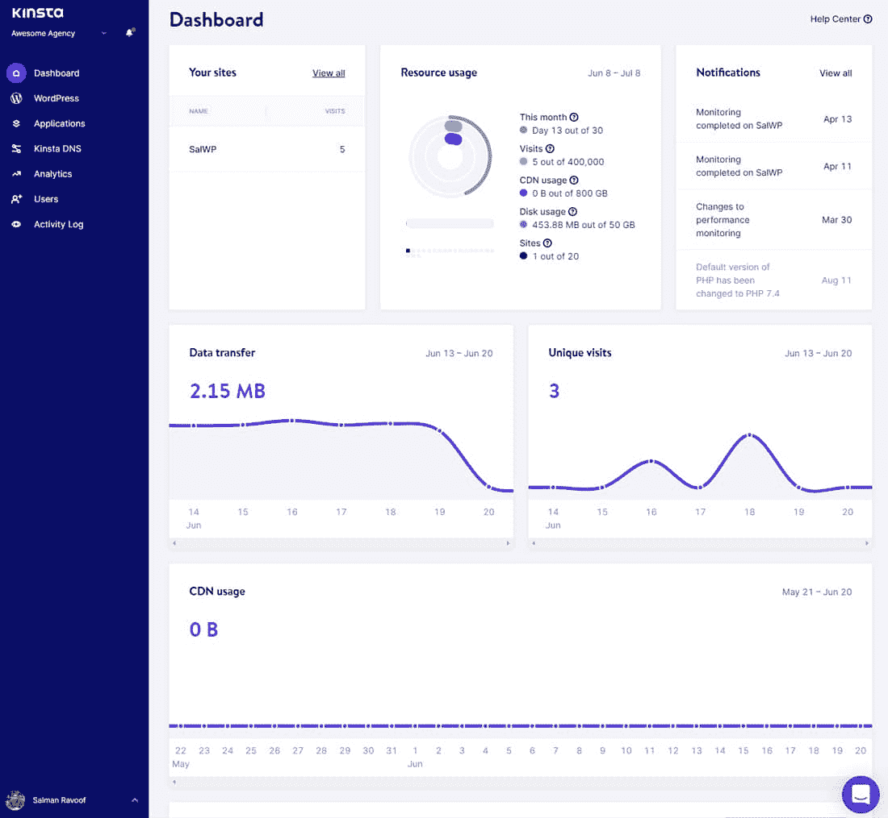

The MyKinsta dashboard.

MyKinsta 会根据用户请求不断更新新功能。其中一些是:

*   搜索和替换工具
*   启用/禁用 **WP_DEBUG** 选项
*   Kinsta APM，调试慢速 WordPress 站点的免费工具
*   用于站点转移、站点重命名和站点标记的智能站点管理工具

我们将在后面深入讨论这些特性。

同时，你可以[带着 MyKinsta 自由旋转](https://demo.kinsta.com/register)并探索它的外观和感觉！

### 2.自动化站点备份和更新

大多数网站开发人员都明白备份对于保护网站的重要性——防止删除、恶意软件、损坏的更新、错误和其他威胁。

一个 WordPress 站点包括许多部分——核心、主题、插件、上传、配置文件、数据库等等。—将它们全部备份对于将站点恢复到以前的状态至关重要。

虽然您可以频繁地手动备份所有客户的站点，但在我们繁忙的日程安排中，这并不总是可能的。当你最需要的时候，你可能会忘记备份或者推迟备份。

自动备份在这里派上了用场。它们简化了您的备份过程，实现了更高效的恢复，让您和您的客户相安无事。

有很多方法可以备份一个 WordPress 站点。你也可以使用 [WordPress 插件进行增量备份](https://kinsta.com/blog/wordpress-backup-plugins/)。然而，计划自动备份的最高效的方法是在服务器级别—最好是在您的主机提供商的支持下。

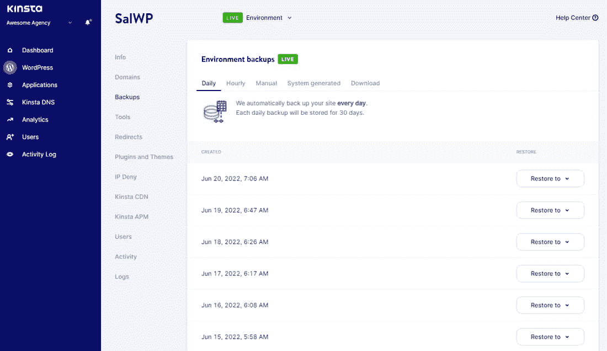

MyKinsta’s automated backups feature.

Kinsta 的代理计划包括为您托管的每个客户站点保留 30 天的备份。这意味着您可以快速修复客户网站的任何不可预见的问题。

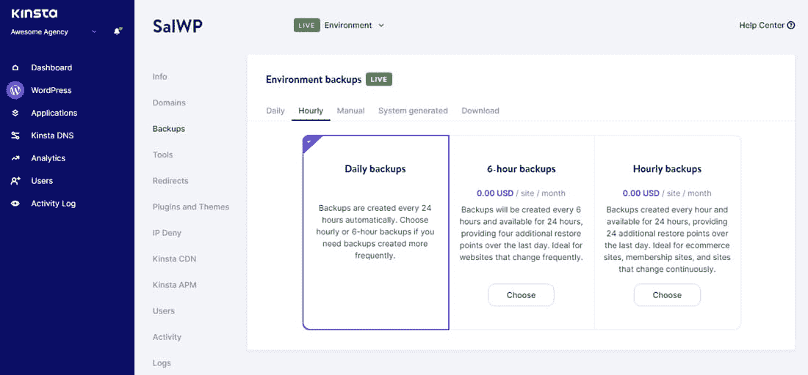

Setting up hourly backups through MyKinsta.

WordPress 自动更新的激增让自动备份变得更加重要。您的所有站点都可以立即利用最新的维护和安全更新，或者在出现问题时退回到以前的版本。

### 3.常规防火墙和安全扫描

WordPress 通常被视为容易出现安全漏洞和不安全的商业平台。这通常是因为网站所有者没有遵循业内公认的安全最佳实践。

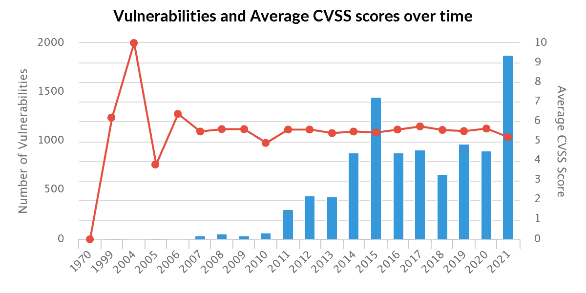

WordPress vulnerabilities more than doubled in 2021\. (Source: [Risk Based Security](https://www.riskbasedsecurity.com/2022/01/11/wordpress-vulnerabilities-more-than-doubled-in-2021/))

作为一家 WordPress 代理公司，你可以通过为你的客户提供安全的 WordPress 网站来使自己与众不同。

首先要处理好[服务器加固](http://codex.wordpress.org/Hardening_WordPress),检查所有客户网站的后门和常见黑客行为，包括插件或主题漏洞。您还必须保护这些站点免受暴力登录尝试、恶意重定向、跨站脚本(XSS)和 DDoS 攻击。

之后，您应该监控所有站点的正常运行时间，并主动阻止恶意代码对它们的损害。

接下来，您将看到一个成熟的系统管理员角色。试图成为一名系统管理员来节省每月 30 美元通常不是一个好主意。

这就是为什么你应该把这些任务委托给专家。投资一个[安全的 WordPress 主机](https://kinsta.com/secure-wordpress-hosting/)来保护你所有的网站免受恶意行为者的攻击。

在 Kinsta，对我们来说，没有什么比您网站的安全性更重要。我们的安全 WordPress 托管解决方案使用主动和被动措施来阻止安全攻击。我们每两分钟监控一次您站点的正常运行时间，有严格的基于软件的限制，主动检测 DDoS 攻击，并阻止恶意代码进入我们的网络。

Kinsta 上托管的所有站点都受到 Cloudflare 企业级防火墙的保护，并包括免费的 DDoS 保护。我们支持 2FA，IP 地理位置拦截，自动封禁恶意 IP。

最重要的是，我们还有黑客修复保证。这意味着，如果您客户的任何网站遭到破坏，我们将免费修复。

### 4.服务器级缓存和性能增强

缓存对于任何网站的速度和性能来说都是至关重要的因素。这个事实对于 WordPress 网站来说更为重要，考虑到它们与静态网站相比并不是最快的。

How web cache works.

WordPress 是用 PHP 构建的，我们看到了 PHP 8.0 和 PHP 8.1 的巨大性能提升。但是如果你不[正确地缓存你的站点](https://kinsta.com/blog/wordpress-cache/)，它仍然会慢慢爬行。

对于一个典型的 WordPress 站点来说，你主要需要注意四种类型的缓存:

*   [字节码缓存](https://kinsta.com/blog/wordpress-cache/#bytecode-cache)
*   [对象缓存](https://kinsta.com/blog/wordpress-cache/#object-cache)
*   [页面缓存](https://kinsta.com/blog/wordpress-cache/#page-cache)
*   [CDN 缓存](https://kinsta.com/blog/wordpress-cache/#cdn-cache)

对于这个任务，你可以使用很多 [WordPress 缓存插件](https://kinsta.com/blog/wordpress-caching-plugins/)。然而，如果你没有正确配置缓存插件，它会降低你的站点速度——这与你希望你的客户端站点达到的效果正好相反。

因此，寻找一个以代理为中心的托管提供商，使所有网站的服务器端缓存。这样，你就不必涉足第三方缓存插件，其中大部分也会消耗网站的性能。

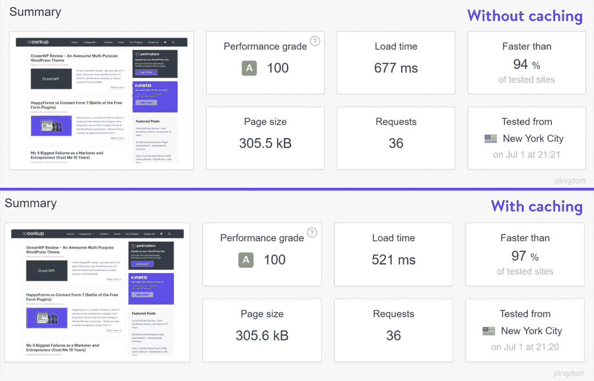

Speed test results for a site without and with caching.

请注意，启用缓存后，页面加载速度加快了——性能提高了 23.04% 。

如果主机还可以提供手动清除缓存的选项，那就更好了。当您想要刷新缓存以立即更新实时网站时，这将很方便。

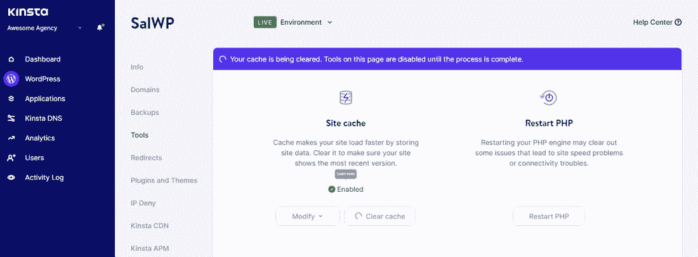

Clearing cache in MyKinsta dashboard.

如果你用 Kinsta 托管你的 WordPress 站点，你不必担心复杂的缓存和性能插件。我们已经在服务器级别实现了不同类型的缓存和性能增强。

您还可以设置自定义缓存过期时间，以进一步优化您的网站性能。

### 5.自由迁移

虚拟主机是一个复杂的迷宫。你的潜在客户可能已经有了另一个主机提供商的网站。在某种程度上，这可能是一个不错的商业决策，但现在已经没有必要了。

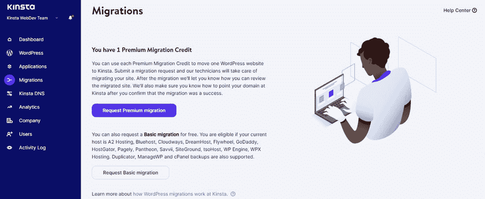

Requesting a site migration through MyKinsta.

网站迁移包括将网站的文件、数据库和服务器设置从一个主机提供商转移到另一个主机提供商。最终，网站看起来可能是一样的，但是本质上可能有很多不同。

作为一个 WordPress 代理，这是你发挥专长的地方。如果需要，您可能还需要强调将客户的网站迁移到更好的主机的优势。

虽然您可以[手动管理迁移](https://kinsta.com/blog/migrate-wordpress-site/)，但它们并不总是那么简单。例如，从一个 [WordPress 多站点网络](https://kinsta.com/blog/migrate-wordpress-site/#manually-migrating-a-wordpress-multisite-network)中迁移一个站点就有点复杂。

## 注册订阅时事通讯

### 想知道我们是怎么让流量增长超过 1000%的吗？

加入 20，000 多名获得我们每周时事通讯和内部消息的人的行列吧！

[Subscribe Now](#newsletter)

大多数托管提供商提供免费或付费迁移。对于代理机构，我们建议您寻找一个可以为您处理迁移的主机，最好是没有额外费用的。

作为一个专注于代理的托管平台，Kinsta [将免费处理您所有的网站迁移](https://kinsta.com/knowledgebase/wordpress-migrations/)，无论网站有多简单或复杂。无论您是托管商业宣传册网站还是拥有数千种产品的电子商务商店，我们都将确保他们在迁移过程中不会经历任何停机。

### 6.CDN 整合

内容交付网络(CDN)是一个关于网站速度的显而易见的解决方案。它们加快了向你的访问者发送内容的速度，同时减轻了你的网络服务器的负担。

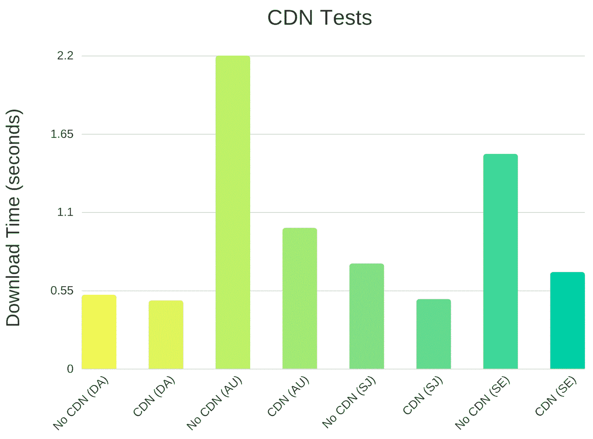

CDN speed tests graph for various global locations.

节省服务器资源也意味着节省带宽成本。如果您托管许多客户端站点，这些节省会随着时间的推移而增加。

无论您托管的是低流量静态网站还是高流量动态网站，CDN 几乎在所有场景中都是有益的。再者，[大多数 CDN 提供商](https://kinsta.com/blog/wordpress-cdn/#popular-cdn-providers)都很便宜，有些像 Cloudflare 甚至是免费的。

许多流行的 cdn 提供了与 WordPress 站点的简单集成。然而，如果您使用缓存、安全和性能插件，cdn 可能会更棘手。如果你的主机提供商提供以上所有服务，再加上 CDN 整合，那就简单多了。当心这样的主人。

Kinsta 的主机速度非常快，但是我们知道用 CDN 驱动你的网站会更快。这就是为什么[我们与 Cloudflare](https://kinsta.com/cloudflare-integration/) 合作，让我们的客户网站，以及您的客户网站，变得更快、更安全。它由 Cloudflare 在 200 多个地点的全球网络提供支持，无需额外成本即可为您的客户站点提供超快速的 CDN。

### 7.可靠的 24/7 支持

在你最需要的时候获得帮助对于与你的客户保持长期关系至关重要。您不希望您的任何客户的网站在高峰流量季节或任何其他时间离线。

根据一项调查， [67%的人](https://www.salesforce.com/blog/customer-service-stats/)表示他们会为更好的客户服务体验支付额外费用。

如果你有满意的客户，他们会推荐其他人。它们是你最便宜也是最好的口碑营销方式，创造了一个可以带来巨大回报的连锁反应。作为一个小企业，这可能是你最大的竞争优势。

然而，建立网站和维护服务器需要非常不同的技能。对大多数 WordPress 代理商来说，投资一个技术熟练的客户支持团队是不可行的。因此，你需要依靠你的主机提供商来快速响应你和你的客户的支持请求。

作为客户遍布全球的托管服务提供商，我们理解 [24/7 实时支持](https://kinsta.com/kinsta-support/)的重要性。无论是中午还是午夜，您都可以与我们的支持工程师实时联系。

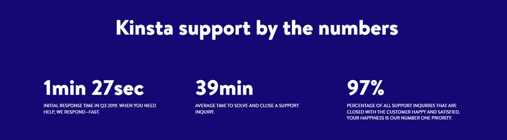

Kinsta Support stats.

我们的团队知道 WordPress 的来龙去脉(有些甚至贡献了 WordPress 核心)。他们在服务器维护、网站故障排除、主题和插件开发和维护等方面经验丰富。

### 8.无障碍中转站点

暂存站点是网站开发者和代理机构在安全环境中测试代码的生命线。它们让你在更新网站时更大胆、更有创造性、更有实验性。

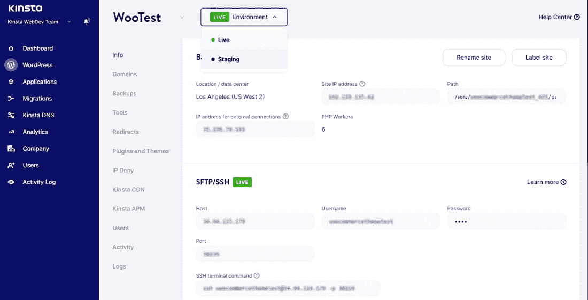

Switching between Live and Staging environments in MyKinsta.

如果您的客户希望您对他们当前的网站进行任何更改，您可以使用暂存站点来确保这些更改在发布之前没有错误。它们还保护了网站的声誉和 SEO 排名，不损害用户体验，并节省了 web 开发的时间。

最终，中转站点将帮助您向客户交付卓越的结果。

虽然你可以使用 [WordPress staging plugins](https://kinsta.com/blog/wordpress-staging-site/#2-install-a-plugin-to-help-you-create-a-wordpress-staging-site) 或者手动的方法来建立一个 staging 站点，但是最好在你的主机的支持下在服务器层面上完成。寻找一个提供中转网站的主机提供商——最好是免费的。

Struggling with downtime and WordPress problems? Kinsta is the hosting solution designed to save you time! [Check out our features](https://kinsta.com/features/)

所有由 Kinsta 托管的网站都可以使用我们的免费 WordPress staging environment 来有效地测试和部署代码。如果你是一个大机构的一部分，你可能需要几个人来访问 WordPress 暂存站点。如果您需要更多，我们还提供[高级暂存环境](https://kinsta.com/add-ons/?plan=visits-business1&interval=month#h-premium-staging-environments)。

通过 MyKinsta，您可以根据特定用户在大型团队或机构中的角色来设置他们的访问权限。您可以向实时和临时站点添加、分配和删除公司级或站点级角色。

### 9.集成的本地开发工具

[本地开发环境](https://kinsta.com/knowledgebase/what-is-localhost/)帮助您在本地机器上快速高效地设计和开发网站。这可能看起来违背直觉，但是它们允许你在没有互联网连接的情况下开发网站。

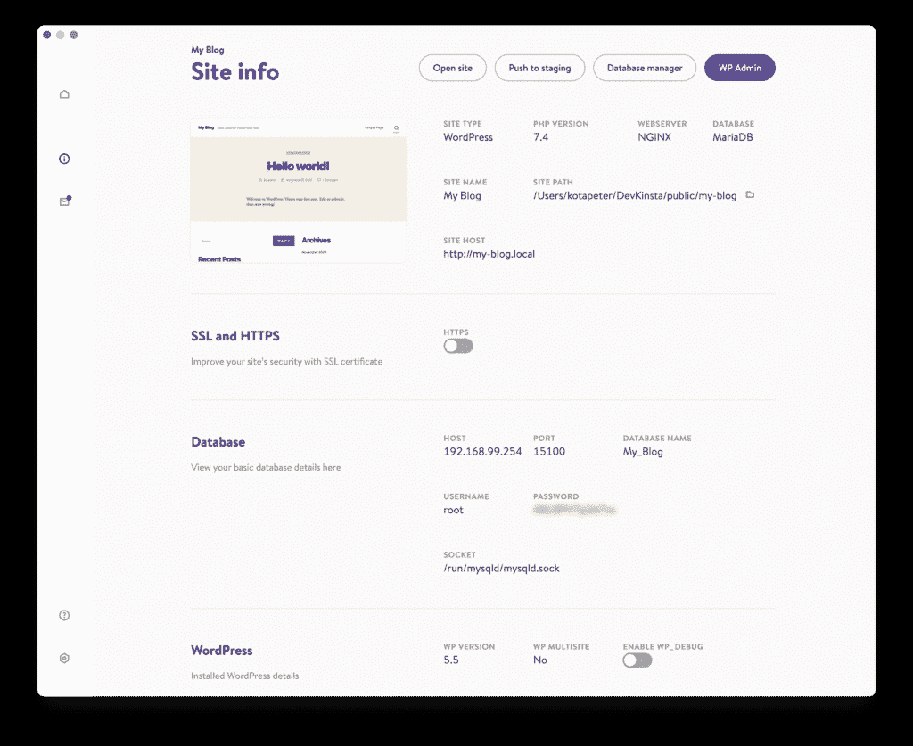

DevKinsta is a WordPress local development tool.

使用本地开发工具还有其他几个优点:

*   在任何地方工作你的代码(和你的客户的代码)
*   快速调试不同环境中的主题和插件(Nginx，Apache，PHP，MySQL 等)。)
*   加快您的开发和网页设计工作流程

一旦你在本地完成了一个网站的开发，在网上推广会很有挑战性。如果您在与 web 服务器完全不同的本地环境中开发它，事情会复杂得多。

实时推动变更会使事情变得更加复杂，尤其是如果您还将暂存站点(所有 web 开发工作流的一个常见部分)加入其中的话。

作为一个 WordPress 代理，你应该寻找一个主机提供商，在他们的服务和任何流行的本地 WordPress 开发工具之间提供简单的集成。

在 Kinsta，我们觉得大多数本地开发工具都有点太复杂或有限。所以我们创建了 [DevKinsta](https://kinsta.com/devkinsta/) ，这是我们为本地 WordPress 开发的免费工具套件。它可以让你在几分钟内创建本地 WordPress 实例和一个完整的主机栈——PHP、Nginx 和 MySQL。

具体来说，DevKinsta 提供了一系列可靠且不断增长的功能，例如:

*   一键式 WordPress 网站创建
*   本地电子邮件管理
*   内置数据库管理器
*   与 MyKinsta 的集成及其特性
*   将您的代码部署到 Kinsta 的登台环境中
*   SMTP 服务器、`WP_DEBUG`拨动开关等等！

### 10.代理品牌的白色标签选项

大多数托管 WordPress 主机安装自己的插件来启用缓存和其他自定义设置。通常，主持人会使用他们的品牌从通常的 WordPress 插件中脱颖而出。

如果你只是在托管自己的网站，这应该不是问题。但是作为一家 WordPress 代理公司，向你的客户提供个性化的服务总是更好的——这能更好地反映你的品牌，让你在竞争中脱颖而出。

Kinsta 有一个这样的插件，名为 Kinsta MU 插件。它增加了一些 Kinsta 品牌来帮助你在 WordPress 管理面板上导航。

例如，admin dashboard 侧边栏中的 Kinsta Cache 选项卡具有 Kinsta 徽标，因此您可以在需要时快速找到正确的位置来清除您站点的缓存。

对于那些想从 WordPress 管理仪表板上删除 Kinsta 商标的代理商和其他 Kinsta 客户，我们提供了一个选项。

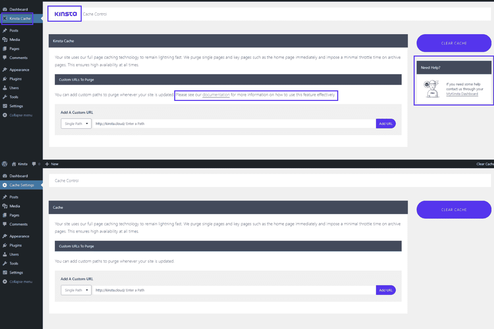

Before and after screens of white-labeling Kinsta-branded elements.

通过这个设置，你可以在你的 WordPress admin 中用你的 logo 给 Kinsta 品牌的元素贴上白色标签。如果你为你的客户使用 Kinsta 的主机，这个功能是很方便的。

### 信息

虽然我们目前不提供包含计费系统的经销商计划，但我们有一个[附属计划和一个代理合作伙伴计划](https://kinsta.com/knowledgebase/affiliate-program-vs-agency-partner-program/)。如果需要，也可以使用混合模型。

### 11.免费托管您的代理网站

为你的代理网站提供免费的托管空间只是锦上添花。这也是 Kinsta 向所有代理合作伙伴提供的服务。

作为 Kinsta 合作伙伴，您的代理网站在我们的 Pro 计划中免费托管。您将获得与我们为每位 Kinsta 客户提供的相同的高性能和安全的托管服务，进而为您和您的客户提供服务。

Kinsta 的代理合作伙伴计划不仅仅是免费托管您的代理网站。下面就让我们来深入探讨一下吧！

## 加入 Kinsta 的代理合作伙伴计划

Kinsta 的[代理合作伙伴计划](https://kinsta.com/wordpress-hosting-agencies/)是在研究了我们许多代理客户的需求后诞生的。它是专门为管理客户网站托管的网络和创意机构设计的。

您可以加入 Kinsta 的代理合作伙伴计划，为您和您的客户享受各种好处:

1.  MyKinsta 通过无限的团队成员实现更好的用户访问管理
2.  为您的所有客户站点提供无限制的免费迁移
3.  免费自动备份(代理合作伙伴保留 30 天)
4.  顶级的服务器级安全性
5.  扩展黑客修复保证
6.  自动更新(同样，带备份)
7.  简单的 DNS 管理
8.  用于站点转移、重命名和标记的智能站点管理工具
9.  Cloudflare CDN 集成
10.  Kinsta APM 发现并修复站点性能瓶颈
11.  通过 Google 云基础设施实现自动扩展
12.  白标缓存插件
13.  专家 24/7 实时支持
14.  暂存环境
15.  DevKinsta 实现无障碍本地开发
16.  免费托管您的代理网站
17.  高度可定制的计划，以满足您的不同需求

我们不断扩大的博客和知识库文章库将帮助你和你的客户解决几乎所有的网络开发和 WordPress 问题。为了充分利用您的 Kinsta 帐户，您可以访问我们的[帮助中心](https://kinsta.com/help/)获取宝贵的提示、教程、最佳实践和指南。

最重要的是，你可以利用 [Kinsta 代理目录](https://kinsta.com/agency-directory/)来进一步巩固你作为 WordPress 代理的权威。我们所有的代理合作伙伴都有资格在此列出—在注册了[代理计划](https://kinsta.com/wordpress-hosting-agencies/#plans)后，您将收到提交信息的邀请。

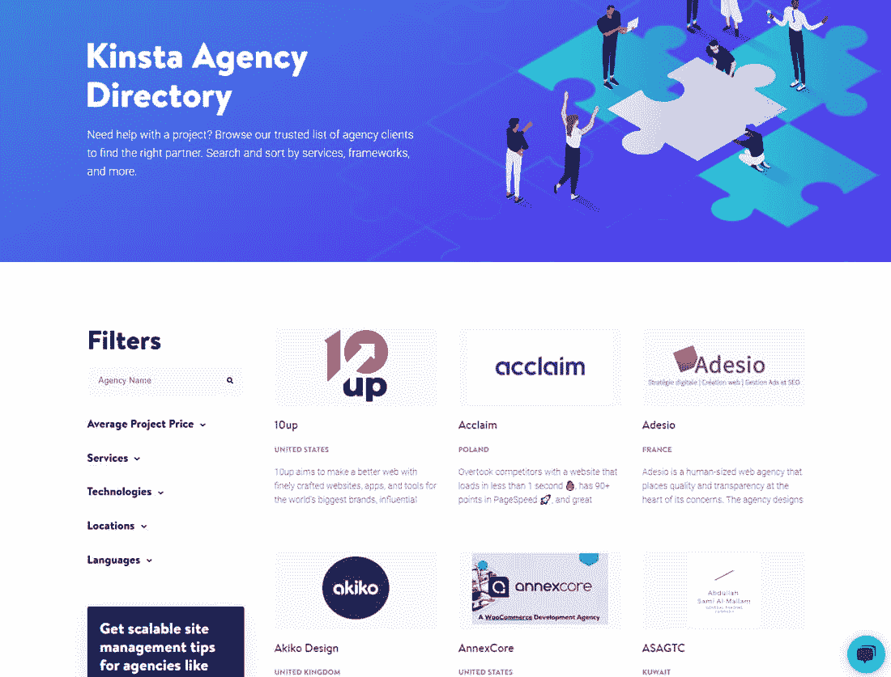

Kinsta Agency Directory.

在这里，寻找代理的用户可以浏览我们信任的代理列表，找到合适的合作伙伴。他们可以根据提供的服务、支持的技术、位置、语言等对这些机构进行搜索和排序。

> [WordPress 为机构托管](https://kinsta.com/wordpress-hosting-agencies/)

<iframe class="wp-embedded-content" sandbox="allow-scripts" security="restricted" style="position: absolute; clip: rect(1px, 1px, 1px, 1px);" title="“WordPress Hosting for Agencies” — Kinsta®" src="https://kinsta.com/wordpress-hosting-agencies/embed/#?secret=4FwMlH4CPR#?secret=hbE6tsq0L1" data-secret="hbE6tsq0L1" width="500" height="282" frameborder="0" marginwidth="0" marginheight="0" scrolling="no">
 
以代理为中心的托管平台仍处于早期阶段，而 Kinsta 正处于这一变革的前沿。我们密切关注云托管和 web 开发技术，寻找新的方法来加速和优化我们客户的网站。
 
如果这些对你来说都不错，请<a href="https://kinsta.com/wordpress-hosting-agencies/#contact">联系我们</a>！ T3】
 <h2>摘要</h2> 
经营一家成功的 WordPress 代理公司涉及一系列独特的挑战——营销、销售、技术专长、客户支持、会计、服务器管理、网络安全、网站维护等。
 
通过与以代理为中心的托管平台合作，你可以更好地应对这些挑战。虽然一个可靠的托管主机可能无法解决您的所有问题，但它们有助于您安心地了解您的站点是安全、快速和可靠的。
 
现在是时候扩展您的机构了！
 
<em>加入 Kinsta 的</em> <em> <a href="https://kinsta.com/wordpress-hosting-agencies/">代理合作伙伴计划</a> </em> <em>，快速构建、管理和启动客户网站。加入数百家选择 Kinsta 作为其托管合作伙伴的其他机构。</em>
 
 
 
让你所有的<a data-track-ga-category="single-post" data-track-ga-label="bottom-cta" href="https://kinsta.com/application-hosting/">应用程序</a>、<a data-track-ga-category="single-post" data-track-ga-label="bottom-cta" href="https://kinsta.com/database-hosting/">数据库</a>和<a data-track-ga-category="single-post" data-track-ga-label="bottom-cta" href="https://kinsta.com/wordpress-hosting/"> WordPress 网站</a>在线并在一个屋檐下。我们功能丰富的高性能云平台包括:
 <ul> <li>在 MyKinsta 仪表盘中轻松设置和管理</li> <li>24/7 专家支持</li> <li>最好的谷歌云平台硬件和网络，由 Kubernetes 提供最大的可扩展性</li> <li>面向速度和安全性的企业级 Cloudflare 集成</li> <li>全球受众覆盖全球多达 35 个数据中心和 275 多个 pop</li> </ul> 
在第一个月使用托管的<a data-track-ga-category="single-post" data-track-ga-label="bottom-cta" href="https://kinsta.com/application-hosting/">应用程序或托管</a>的<a data-track-ga-category="single-post" data-track-ga-label="bottom-cta" href="https://kinsta.com/database-hosting/">数据库，您可以享受 20 美元的优惠，亲自测试一下。探索我们的</a><a data-track-ga-category="single-post" data-track-ga-label="bottom-cta" href="https://kinsta.com/plans/">计划</a>或<a data-track-ga-category="single-post" data-track-ga-label="bottom-cta" href="https://kinsta.com/contact-us/">与销售人员交谈</a>以找到最适合您的方式。
 
 </body> </html></iframe>