# 亚历克莎·兰克:你需要知道的一切

> 原文：<https://kinsta.com/blog/alexa-rank/>

每个人都想在谷歌上获得高排名。

毕竟这是大多数人决定一个网站成功与否的方式。但是有一个人们经常忽略或者不太了解的指标:

**Alexa rank。**

知道(并理解)你的网站的 Alexa 排名可以帮助你改善你的网站并获得更多的流量。

## Alexa Rank 是什么？简短定义:

Alexa rank 是一个全球排名系统，它将数百万个网站按照受欢迎程度进行排名。

它是通过查看给定网站在过去 3 个月的平均每日独立访客和页面浏览量来计算的。

你的 Alexa 排名越低，网站就越受欢迎。

Support

在这篇文章中，你将了解关于 Alexa 排名的一切，它是如何计算的，如何改善它，排名靠前的网站，等等。

但是一个网站 Alexa 排名高意味着什么呢？

简单来说，Alexa 排名越低，(估计)流量越好。

让我们了解更多。

> 需要在这里大声喊出来。Kinsta 太神奇了，我用它做我的个人网站。支持是迅速和杰出的，他们的服务器是 WordPress 最快的。
> 
> <footer class="wp-block-kinsta-client-quote__footer">
> 
> 
> 
> <cite class="wp-block-kinsta-client-quote__cite">Phillip Stemann</cite></footer>

[View plans](https://kinsta.com/plans/)

 

### 信息

Alexa.com 之前在 2022 年 5 月 1 日被亚马逊关闭(退休)。然而，后端 API 和工具似乎仍然可以工作。如果你试图访问后端 API 来查看一个 URL 的 Alexa 排名，系统仍然会返回一个分数。如果你对类似的工具感兴趣，也可以查看一下 [Cloudflare 雷达域排名](https://blog.cloudflare.com/radar-domain-rankings/)作为替代。

## Alexa Rank 是什么？(扩展)

Alexa rank 是一个全球排名系统(Amazon.com 的子公司)，使用网络流量数据列出最受欢迎的网站。

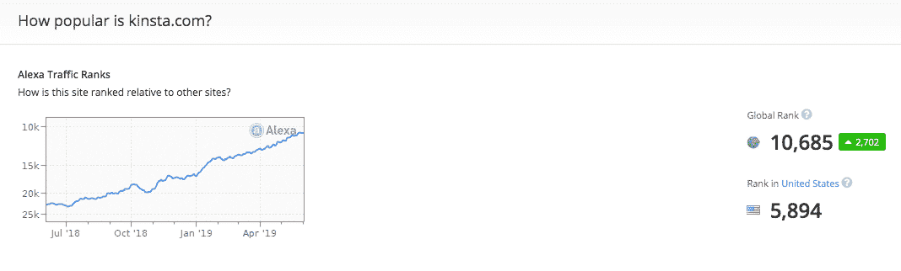

Alexa traffic ranks

它按照受欢迎程度对数百万个网站进行排名，你的 Alexa 排名越低，你的网站就越受欢迎(至少根据 Alexa)。它还查看一个网站相对于其他网站的表现，使其成为一个有用的基准 KPI 或竞争分析。

[有没有想过 Alexa 排名是什么，是怎么计算出来的？👨‍🏫了解它的一切，以加强你的搜索引擎优化策略！ 点击推文](https://twitter.com/intent/tweet?url=https%3A%2F%2Fkinsta.com%2Fblog%2Falexa-rank%2F&via=kinsta&text=Ever+wondered+what+the+Alexa+rank+is+and+how+it%27s+calculated%3F+%F0%9F%91%A8%E2%80%8D%F0%9F%8F%ABLearn+everything+about+it+to+strengthen+your+SEO+strategy%21&hashtags=seo%2Cwordpress)

### Alexa Rank 是如何工作的？

Alexa 排名是通过结合网站的估计流量以及前三个月的访客参与度计算出来的。流量和参与度是根据其工具栏提供的数据来估算的。它监控用户的浏览行为，作为所有互联网用户的样本。

如果你想为排名贡献数据，开始你只需要下载并安装 [Alexa 工具栏](https://www.alexa.com/toolbar):

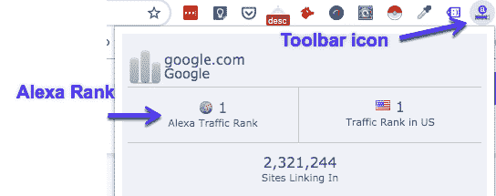

Alexa toolbar for Chrome

这将显示所访问网站的 Alexa 排名。它还会向中央服务器发送流量数据，记录下你的 IP 地址和你访问的网址。

## Alexa 排名是怎么算出来的？

我们已经简单地谈了一下，但是让我们更详细地看一下。

据 Alexa 的官方网站称，该排名是使用该网站的平均每日独立访客估计数和过去 3 个月该网站的页面浏览量估计数的组合计算出来的。

他们排名系统的数据是基于他们的“全球数据小组”提供的流量。这些数据是从使用谷歌 Chrome 、Firefox、Internet Explorer 等浏览器扩展的互联网用户那里收集的。

Alexa 排名算法审核一个网站，并计算访问频率。如果同一个用户在同一天访问一个网站超过一次，则算作单次访问。

用于衡量一个站点的个人排名的参数基于两个项目:

*   **每日独立访客:**Alexa 用户一天内访问一个网站的流量/数量。
*   **平均浏览量:**Alexa 用户查看特定页面或 URL 的次数。

从这里开始，独立访问者和页面浏览量组合最高的网站排名第一。

*(psst，如果你好奇的话，1 号站点以 G 开头，和 oogle 押韵。)*

该算法还会寻找任何潜在的偏见，并修改其排名，以补偿不包括在 Alexa 测量面板中的访客。

也有人说，Alexa 来源于第三方数据，以提供更广泛的互联网用户视角。

### Alexa 排名准确吗？

虽然 Alexa 的排名可以很好地比较一个网站与另一个网站的表现，但 Alexa 的统计数据不一定是最准确的

事实上，人们已经[比较了 Alexa 和 Google Analytics](https://marketing4restaurants.com/alexa-vs-google-analytics-how-accurate-is-alexa/) ，得出的结论是 Alexa 没有那么准确。一些网页浏览量高得多的网站实际上在 Alexa 上的排名更低*(GA:153177&Alexa:346890**vs**GA 3852&Alexa:194636)*。记住，越低越好。

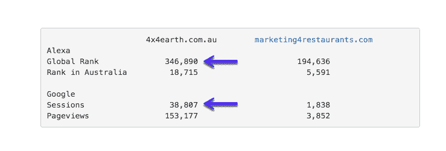

Alexa vs Google Analytics (Image source: Marketing4Restaurants.com)

这可能是因为谷歌的覆盖范围比 Alexa 广得多，因为不是每个人都会安装 Alexa 工具栏来跟踪。

由于覆盖率较低，将 Alexa rank 视为一个用于比较的概述，而不是一个网站的绝对准确的概述。

### Alexa Rank 可以被操纵吗？

根据[搜索引擎期刊](https://www.searchenginejournal.com/manipulating-alexa-traffic-rankings/3044/)，你可以操纵你网站的 Alexa 排名。通过创建一个 JavaScript 函数从你的网站打开一组页面地址，你可以人为地提高你的 Alexa 排名。目标是让每个地址在一个单独的窗口中打开，从而增加浏览量。

当然，不建议这样做，因为这对 UX 来说太可怕了。有多少次你被那些让你点击进入多个页面来阅读一篇文章的网站所困扰？

很烦。不要成为那样的人。

然而，更好的和推荐的改进方法是写好的和有规律的内容来给你的网站带来正确的流量。你懂的， [SEO 101](https://kinsta.com/blog/what-does-seo-stand-for/) 。

## 注册订阅时事通讯

### 想知道我们是怎么让流量增长超过 1000%的吗？

加入 20，000 多名获得我们每周时事通讯和内部消息的人的行列吧！

[Subscribe Now](#newsletter)

人为提升你的 Alexa 排名只是一个短期策略。就像许多快速解决方案一样，它不会长久。

### 我如何看到我的网站的 Alexa 排名？(提示:使用这个等级检查器)

检查你网站的 Alexa 排名非常简单。只需前往 Alexa 的官方排名检查器，输入你想要检查的网站的网址，然后点击查找:

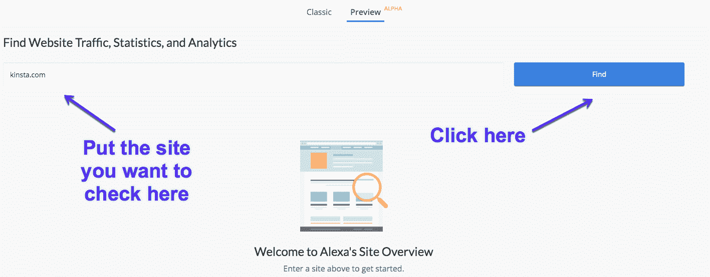

Alexa rank checker

从这里，您可以进行另一项搜索或查看网站的统计数据:

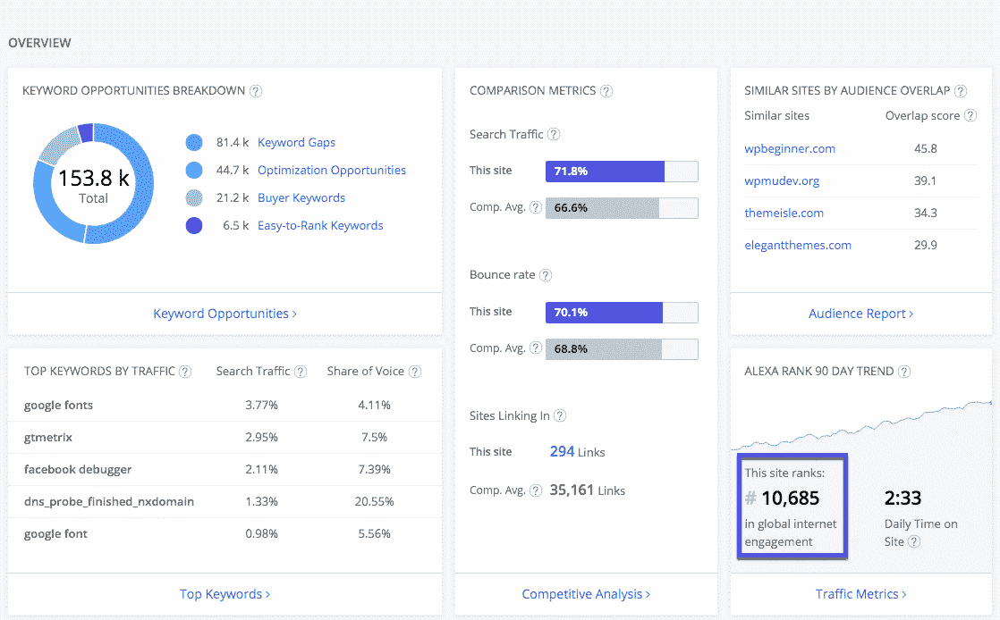

Alexa rank checker: results

如果你想检查多个等级(一次最多 5 个 URL)，你可以使用这个[批量等级检查器。](https://smallseotools.com/alexa-rank-checker/)同样，只需输入您的网址并搜索:

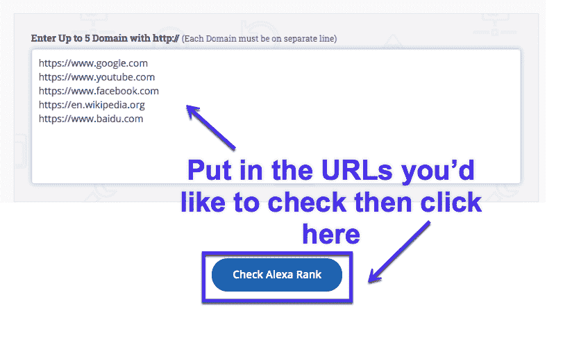

Check multiple Alexa ranks

## Alexa Rank 有哪些利弊？

所以我们已经看了它是什么，它的准确性和如何看到它，但 Alexa rank 的利弊是什么？让我们仔细看看:

### 赞成的意见

以下是 Alexa rank 有帮助的几种方式:

*   如果你的网站通过广告赚钱，一个高的 Alexa 排名可能会让你对广告空间收取更多的费用。
*   你可以快速估算出竞争对手网站的流量，然后与你自己的网站进行比较。
*   有潜力吸引更高质量的客座作家希望贡献文章到更高排名的网站。
*   洞察你的网站的表现，这可能对你的其他搜索引擎优化/营销有所帮助。

### 骗局

以下是 Alexa rank 没有帮助的几个方面:

*   数据仅限于安装了工具栏的用户。因此，将会有很多网站，尽管有很高的流量，但排名却很低。
*   它很容易被操纵(正如我们提到的)，进一步使排名变得不可靠。
*   [子域](https://kinsta.com/blog/wordpress-subdomain/)和子页不单独排名，只有顶级域。所以这里可能有些不准确。

总的来说，Alexa 排名有其利弊，但仍然有足够的动力让你跟踪它(并改善它)。

厌倦了慢热的主持人？Kinsta 的设计考虑了速度和性能。[查看我们的计划](https://kinsta.com/plans/?in-article-cta)

那么如何改善呢？很高兴你问了。

## 如何提高你的 Alexa 排名(5 个快速提示)

正如已经提到的，你可以提高你的网站的 Alexa 排名，而不用操纵它。但是最快的方法是什么？

以下是一些有用的提示:

### #1 优化您的元数据

就像 [SEO 最佳实践](https://kinsta.com/blog/wordpress-seo/)一样，你想给你的网站添加元数据(页面标题+元描述)，这样 Alexa(和 Google)就知道你的网站是关于什么的。

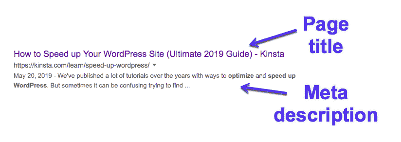

Metadata in SERPs

### #2 写人们想看的内容

用高质量的内容吸引人们到你的网站是很棒的，原因有很多:它改善了搜索引擎优化，让人们访问你的网站，并允许你对创收关键词进行排名。这也增加了人们访问 Alexa 工具栏的机会，从而获得更高的排名。

毕竟，70%的互联网用户希望通过内容了解产品:

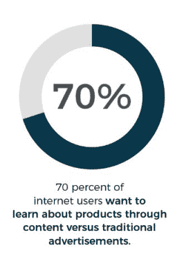

70% of users want to learn about products through content vs traditional advertisements

### #3 定期更新你的网站

用新鲜的内容更新你的网站(人们想要阅读的内容)。无论你是博客写手、开发者还是小企业主，定期制作[有用的内容](https://kinsta.com/learn/content-marketing/)来提高参与度是很重要的。

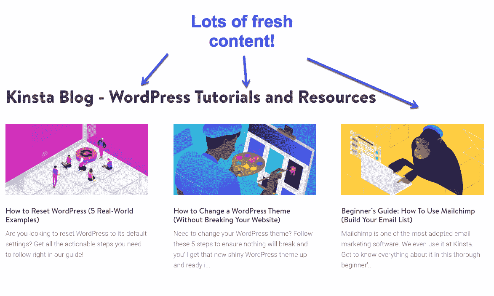

Recently published content on the Kinsta Blog

### #4 在社交媒体上分享您的内容

为你的网站写内容当然很好，但是你也想在相关的社交媒体渠道上推广它。理想情况下，你应该瞄准你的目标受众常去的平台。T2 每天有 32 亿社交媒体用户，你不想错过在你的网站上吸引眼球的机会。

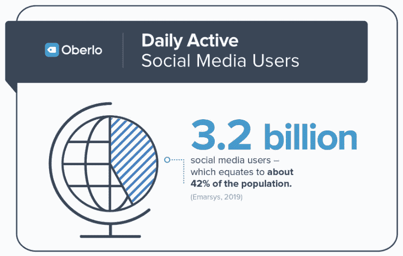

3.2 billion daily social media users

### #5 增加网络流量

现在，这可能是最难的一个。增加你的流量不会在一夜之间发生。创建内容(别忘了[加入特色片段](https://kinsta.com/blog/featured-snippets/))，维护一个健康的网站，获得高质量的网站反向链接，这些都需要坚持不懈的努力。

哦，只要确保你的主机能够处理任何流量的增加[。](https://kinsta.com/knowledgebase/dedicated-server/)

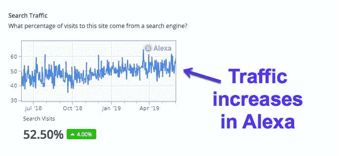

Traffic increases in Alexa

## 最受欢迎的 10 个网站是什么？(按 Alexa 排名)

在我们结束这篇文章之前，如果你感兴趣，Alexa 保留了一份网上排名前[的网站](https://www.alexa.com/topsites)的列表，以及一些数据点，如平均每天在网站上的时间，每个访问者的平均每天浏览量，搜索的平均%流量，以及链接到网站的平均网站总数。

以下是 Alexa 排名前十的网站:

1.  Google.com
2.  Youtube.com
3.  Facebook.com
4.  Baidu.com
5.  Wikipedia.org
6.  Qq.com
7.  Taobao.com
8.  Tmall.com
9.  Yahoo.com
10.  Amazon.com

## 摘要

公平地说，Alexa 排名可以成为网站比较的有用数据。只是不要把太多的营销工作建立在它的基础上，因为它不像谷歌分析那样准确。

把它当作一个补充工具来加强你的搜索引擎优化策略。请记住:

Alexa 排名越低,(估计)流量越好。

* * *

让你所有的[应用程序](https://kinsta.com/application-hosting/)、[数据库](https://kinsta.com/database-hosting/)和 [WordPress 网站](https://kinsta.com/wordpress-hosting/)在线并在一个屋檐下。我们功能丰富的高性能云平台包括:

*   在 MyKinsta 仪表盘中轻松设置和管理
*   24/7 专家支持
*   最好的谷歌云平台硬件和网络，由 Kubernetes 提供最大的可扩展性
*   面向速度和安全性的企业级 Cloudflare 集成
*   全球受众覆盖全球多达 35 个数据中心和 275 多个 pop

在第一个月使用托管的[应用程序或托管](https://kinsta.com/application-hosting/)的[数据库，您可以享受 20 美元的优惠，亲自测试一下。探索我们的](https://kinsta.com/database-hosting/)[计划](https://kinsta.com/plans/)或[与销售人员交谈](https://kinsta.com/contact-us/)以找到最适合您的方式。