# 2022 年将使用的 21 种替代搜索引擎

> 原文：<https://kinsta.com/blog/alternative-search-engines/>

当我们谈到 SEO 和搜索引擎时，我们会立刻想到 Google。但是你知道吗，有很多**替代搜索引擎**提供同样多的服务。

谷歌是全球公认的搜索引擎和行业巨头，事实上，即使是第二大“搜索引擎”也是谷歌图片，根据[这项研究](https://sparktoro.com/blog/2018-search-market-share-myths-vs-realities-of-google-bing-amazon-facebook-duckduckgo-more/):

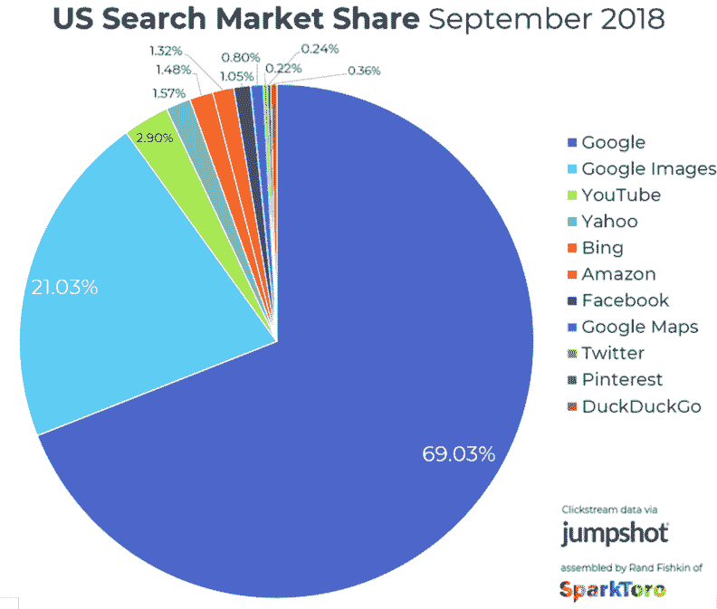

Search engine market share

即使是最大最知名的，也不代表是你唯一的选择。

人们选择使用另一个搜索引擎的主要原因之一是为了增加隐私，因为众所周知，谷歌会跟踪自己和第三方使用的用户数据。

如果你只用过谷歌，看看其他的搜索引擎，你可能会找到你喜欢的。

## 我们的替代搜索引擎指南

在我们开始考虑替代搜索引擎之前，先问自己一些问题，你到底想从搜索引擎中得到什么:

*   除了谷歌，最好的搜索引擎有哪些？
*   哪个搜索引擎最安全？
*   什么是最好的隐私搜索引擎？
*   哪个搜索引擎最好？

### 谷歌以外的搜索引擎

看看这个备选搜索引擎列表，它包含了除谷歌之外的一些你可能听说过的搜索引擎和一些你可能不熟悉的搜索引擎:

### 1.堆

Bing search engine

微软的必应是仅次于谷歌的第二大搜索引擎。

它易于使用，并通过美丽的日常背景照片提供了更好的视觉体验。Bing 非常适合视频搜索，因为它以大缩略图的形式显示搜索结果，将鼠标悬停在缩略图上可以用声音预览。

就像谷歌一样，Bing 充满了内部功能，如货币兑换、翻译和航班跟踪，使其成为一个真正多功能的工具，在全球市场上占有一席之地。请务必阅读我们关于 Bing 网站管理员工具的[深度指南。](https://kinsta.com/blog/bing-webmaster-tools/)

虽然你可能很熟悉必应，但你可能不知道它提供了一个奖励计划。当你通过 Bing 购物或搜索时，你可以获得积分来购买应用程序和电影，这非常方便。

### 2.达克达克戈

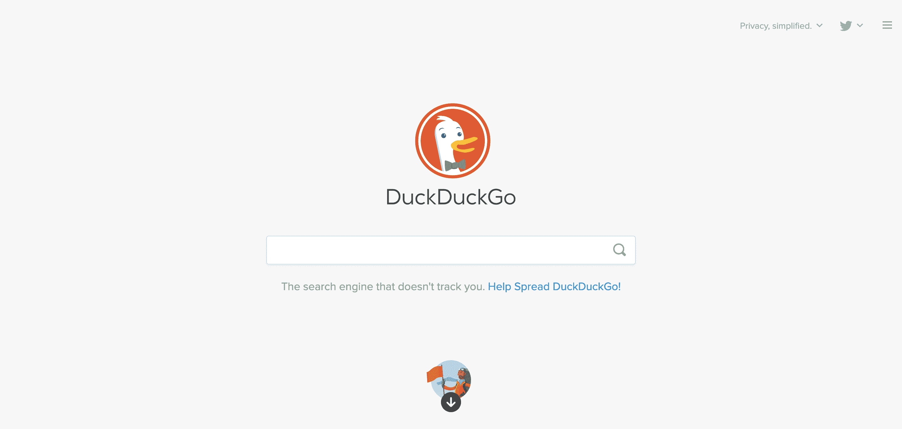

DuckDuckGo search engine

DuckDuckGo 是一个流行的搜索引擎，适合那些重视自己隐私的人，因为他们的每个查询都会被跟踪和记录。

它有一个非常干净的界面，最少的广告和无限的滚动，所以用户体验很好，很流畅。绝对没有用户跟踪，你甚至可以在你的浏览器中添加 DuckDuckGo 的扩展来保护你的活动隐私。

该搜索引擎有一个非常有用的功能，叫做 [bangs](https://duckduckgo.com/bang) ，它允许你通过键入前缀直接在 DuckDuckGo 的另一个网站中进行搜索。比如，输入“！易趣魔术聚会”会直接带你到易贝的搜索结果查询“魔术聚会”。
T3】

### 3.雅虎！

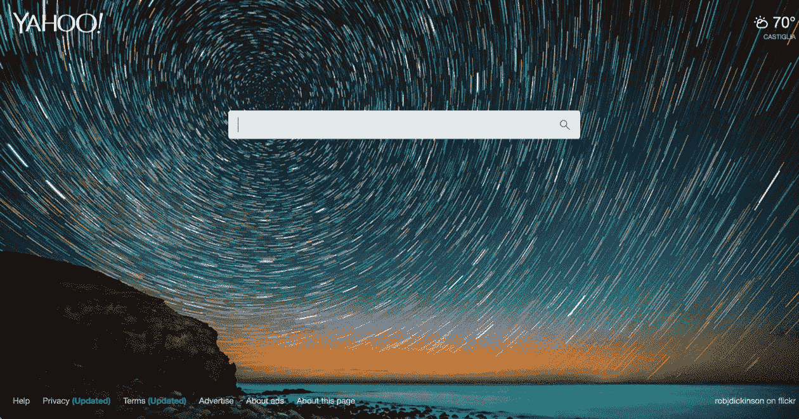

Yahoo search engine

雅虎比谷歌存在的时间还要长，尽管有些人认为它已经过时，但它仍然是全球第三大最受欢迎的搜索引擎。它甚至是 Firefox 的默认搜索引擎。

雅虎的一大优点是它不仅仅是一个搜索引擎。雅虎的门户网站提供电子邮件、新闻、网上购物、游戏等等，在一个地方提供全面的用户体验。

它与 Flickr、Yahoo Answers 和 Yahoo Finance 的集成意味着它提供了更好的图像结果和各种主题的大量信息。

(建议阅读: [77 种提高网站流量的有效策略](https://kinsta.com/blog/how-to-drive-traffic-to-your-website/))

### 4.要求

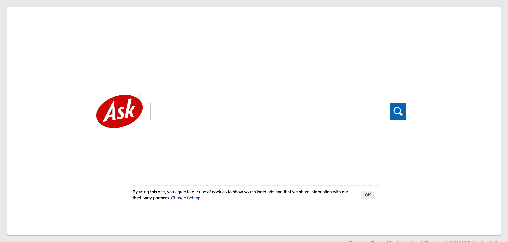

Ask search engine

曾经被称为 Ask Jeeves 的简单问答格式 [Ask](https://www.ask.com/) 允许自然语言搜索。这使得它对用户非常友好，特别是对于那些不太熟悉搜索引擎的人，比如年长的计算机用户。

搜索结果还会显示与您的搜索词相关的常见问题，这可以提供方便的资源并帮助您进一步搜索。

### 5.百度(全球最大的中文搜索引擎)

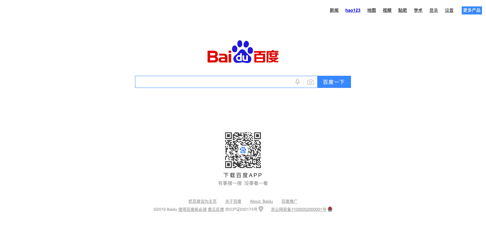

Baidu search engine

百度是中国领先的搜索引擎，占据中国互联网市场超过 70%的份额。虽然用的是普通话，但是和谷歌惊人的相似。它在设计上看起来很相似，通过广告赚钱，在搜索结果中使用[丰富的片段](https://kinsta.com/blog/schema-markup-wordpress/)。

然而，百度受到严格审查。某些图片甚至亲民主的网站在搜索引擎上都被屏蔽了。

### 6.WolframAlpha

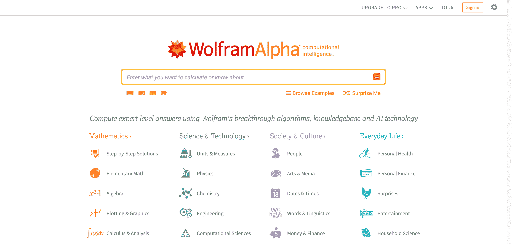

WolframAlpha search engine

WolframAlpha 是一个私有的搜索引擎，它允许你“使用 Wolfram 的突破性算法、知识库和人工智能技术来计算专家级的答案。”

它旨在传递专业知识，分为数学、科学与技术、社会与文化和日常生活。其中有各种子类别和有用的工具，可以让您计算数据、研究统计数据并找到问题的专家答案(您马上会看到一个例子)。

在 WordPress 网站托管的世界里，真的只有一种选择。[免费试用 kin sta](https://hubs.ly/H0pklC_0)。

除了作为一个专家知识的中心，WolframAlpha 不会跟踪你的搜索，当涉及到隐私时，让你安心。

### 7.纸板阅读器

Boardreader search engine

[Boardreader](http://boardreader.com/) 是一个针对[论坛和留言板](https://kinsta.com/blog/wordpress-forum-plugins/)的搜索引擎。它允许你搜索论坛，然后按日期和语言过滤结果。

这是进行内容研究的一个有用工具，因为它可以很容易地在主题中找到真实用户写的内容。如果你不熟悉这个领域，不知道最好的论坛是什么，Boardreader 是一个不错的起点。

### 8\. StartPage

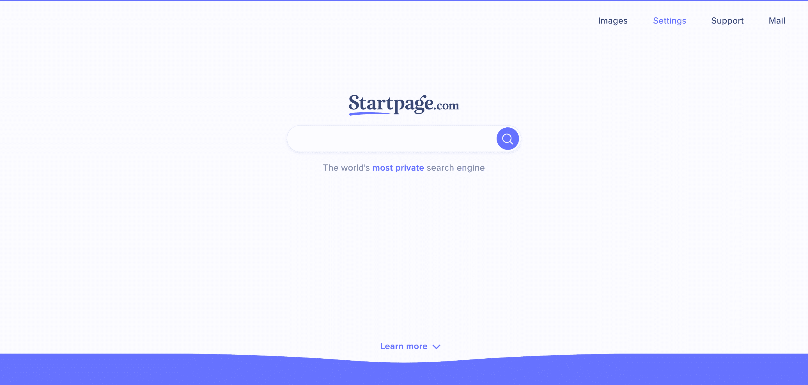

Startpage search engine

有点像 DuckDuckGo， [StartPage](https://www.startpage.com/) 的创立以严格的用户隐私为核心。它不会跟踪或存储您的任何数据。它也不会根据你的浏览行为来投放广告。

## 注册订阅时事通讯

### 想知道我们是怎么让流量增长超过 1000%的吗？

加入 20，000 多名获得我们每周时事通讯和内部消息的人的行列吧！

[Subscribe Now](#newsletter)

Startpage 号称是“世界上最私密的搜索引擎”。你将能够从完全私人的谷歌搜索中得到类似的结果。

除了作为搜索引擎，Startpage 还提供代理服务，允许您匿名浏览网站，以提高在线安全性。他们甚至有一个定制的 URL 生成器，这意味着你可以浏览而不需要设置 cookies。

所有这些都呈现在一个智能、简洁的界面中，可以设置各种主题，包括夜间模式，提供一个超级功能的用户界面。

### 9.Ecosia

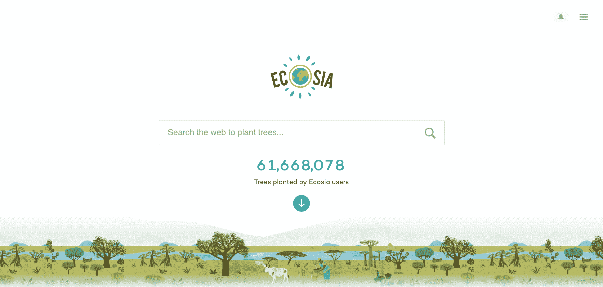

Ecosia search engine

大量使用搜索引擎确实会对二氧化碳排放产生环境影响。这就是 [Ecosia](https://www.ecosia.org/) 的用武之地:CO 2 中立替代搜索引擎。

每一次搜索(由 Bing 提供支持)产生的收入都将用于植树计划。平均来说，生成一棵树大约需要 45 次搜索。

### 10\. Qwant

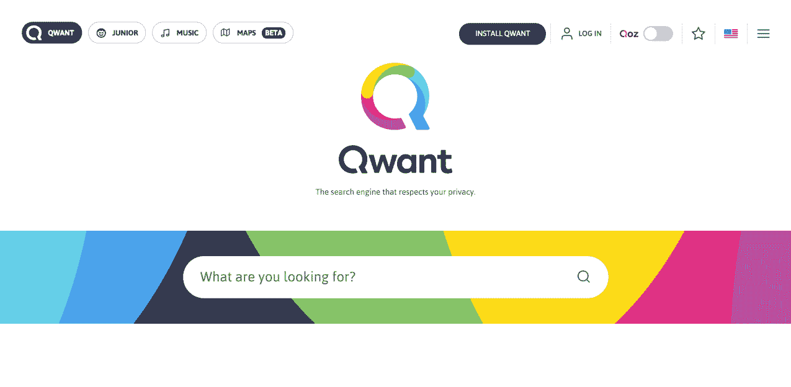

Qwant search engine

总部位于法国的 Qwant 是一个基于隐私的搜索引擎，它不会记录你的搜索，也不会将你的个人信息用于广告。

用户友好的界面将你的搜索结果分为网络、新闻和社交，甚至还有一个专门的音乐部分，使用人工智能来帮助你搜索歌词和发现新音乐。

它使用了快速搜索功能，你可以在网站名称前输入“&”来立即查看外部搜索结果。例如，“&w”或“&wikipedia”允许您直接从 Qwant 立即访问来自 wikipedia 的结果。

### 11.搜索加密

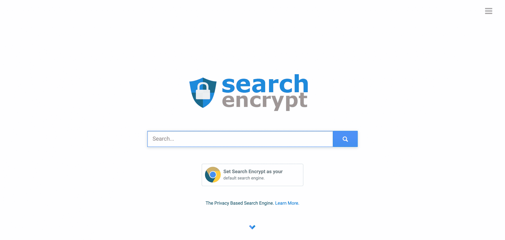

Search encrypt search engine

另一个基于隐私的搜索引擎是 [Search Encrypt](https://www.searchencrypt.com/) ，它使用本地加密来确保用户的可识别信息不会被跟踪。

作为一个元搜索引擎，Search Encrypt 从搜索合作伙伴的网络中获取结果，提供全面的结果，而不是个性化的历史。

这个搜索引擎的一个非常有趣的特点是，它会在 15 分钟不活动后自动删除你的本地浏览记录。这意味着您永远不必担心您的隐私，即使其他人可以访问您的计算机。

### 12\. SearX

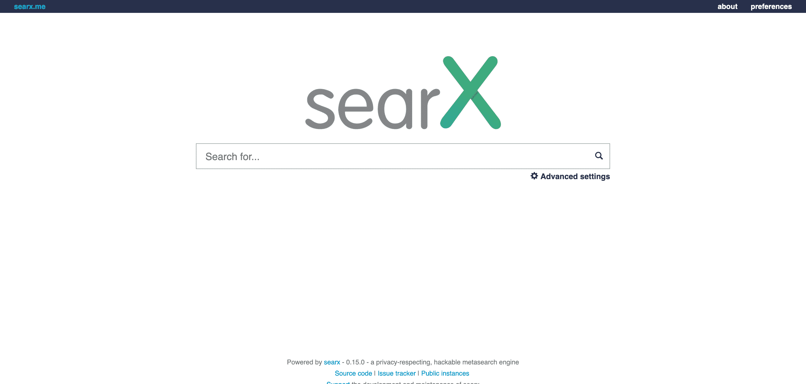

SearX search engine

SearX 是一个元搜索引擎，旨在提供一个免费的、分散的互联网视图。

这是一个开源搜索引擎，每个人都可以查看源代码，也可以在 GitHub 上投稿。甚至可以选择定制它，并把它作为你自己的搜索引擎放在你的服务器上。

SearX 提供了许多在其他搜索引擎上找不到的偏好和设置，提供了很好的可用性和快速、精确的结果。

### 13.Yandex

Yandex search engine

作为全球第五大最受欢迎的搜索引擎， [Yandex](https://yandex.com/) 在其本土俄罗斯被广泛使用，在那里它占有大约 60%的搜索引擎市场份额。

它提供了与谷歌非常相似的服务，你可以在用户友好的布局中搜索网站、图片、视频和新闻。Yandex 的附加功能包括移动应用、地图、翻译、云存储等，提供了同样多的功能，但界面更简洁。

### 14.吉比鲁

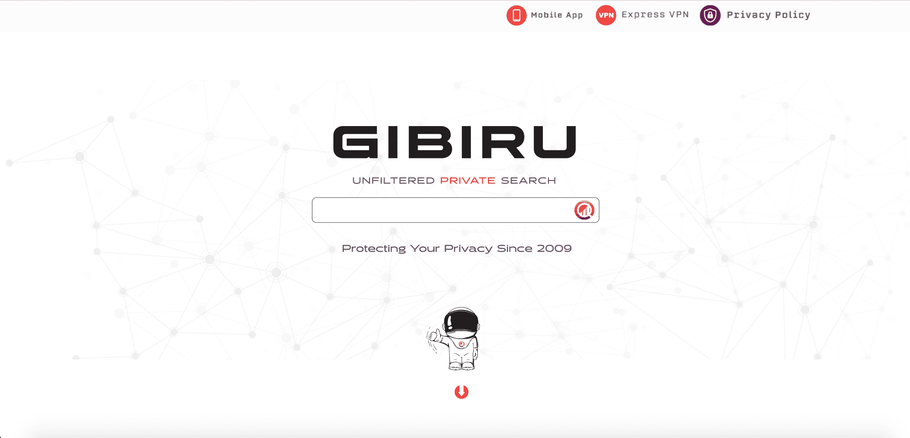

Gibiru search engine

Gibiru 的口号是“不过滤的私人搜索”,这正是它所提供的。

通过下载 AnonymoX Firefox 插件，你所有的搜索都通过一个代理 IP 地址发送。这为您提供了隐私和公正的搜索结果，并确保其他计算机用户将无法跟踪您的历史。

搜索查询不会保存在 Gibiru 的服务器上，在搜索开始后几秒钟内记录就会被删除。

在 WordPress 网站托管的世界里，真的只有一种选择。[免费试用 kin sta](https://hubs.ly/H0pklC_0)。

### 15.断开搜索

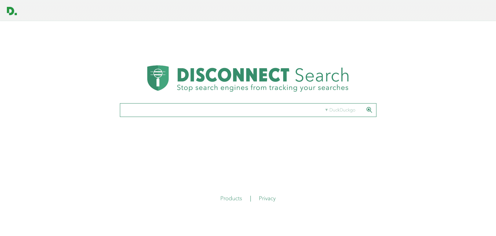

Disconnect search search engine

[断开连接](https://search.disconnect.me/)允许您通过自己选择的搜索引擎进行匿名搜索。

当您输入一个搜索词时，您的查询会通过 Disconnect 的服务器被重新路由和匿名化，然后被传递到您选择的搜索引擎。这允许你使用你最喜欢的搜索引擎，而没有任何隐私问题。

Disconnect 还提供了浏览器扩展和应用程序，允许您阻止跟踪网站、[更快地加载页面、](https://kinsta.com/learn/speed-up-wordpress/)、查看广告请求和许多更多基于隐私的功能。

### 16.瑞士奶牛

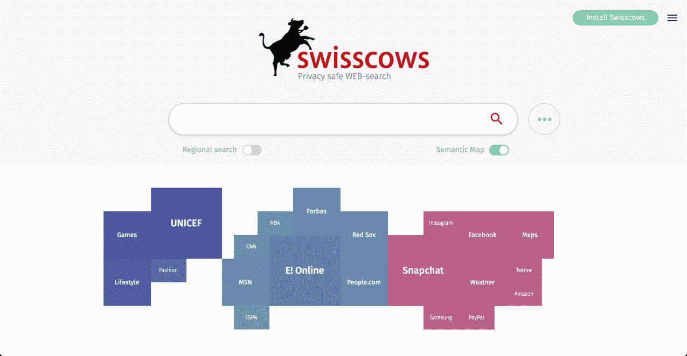

Swisscows search engine

[Swisscows](https://swisscows.ch/) 提供完全加密的搜索以保护您的隐私和安全。它不存储个人数据、 [IP 地址](https://kinsta.com/tools/what-is-my-ip/what-is-my-ip/)或搜索查询，它的服务器设在瑞士，瑞士有一些世界上最严格的隐私政策。

它特别受希望给孩子安全搜索体验的父母欢迎，因为它内置的色情和暴力过滤器无法被覆盖。

它使用语义信息识别为搜索查询提供直观的答案，并使用数据池快速高效地生成答案。创新的语义地图显示了其他相关或流行的查询，有助于为您提供更多信息。

### 17.卢科尔

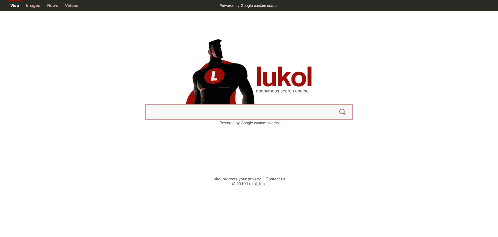

Lukol search engine

Lukol 是一个匿名搜索引擎，它提供来自谷歌的搜索结果，但通过移除任何可追踪的元素来保护你的隐私。

这意味着你仍然可以受益于谷歌的搜索能力，而不用担心被跟踪。Lukol 确保您的搜索完全匿名，并通过保护您远离误导或不适当的网站来帮助您保持安全。

就功能而言，它是一个非常简单的搜索引擎。你可以从网页、图片、新闻和视频中选择搜索内容，但没有过滤结果的选项。

### 18.元杰

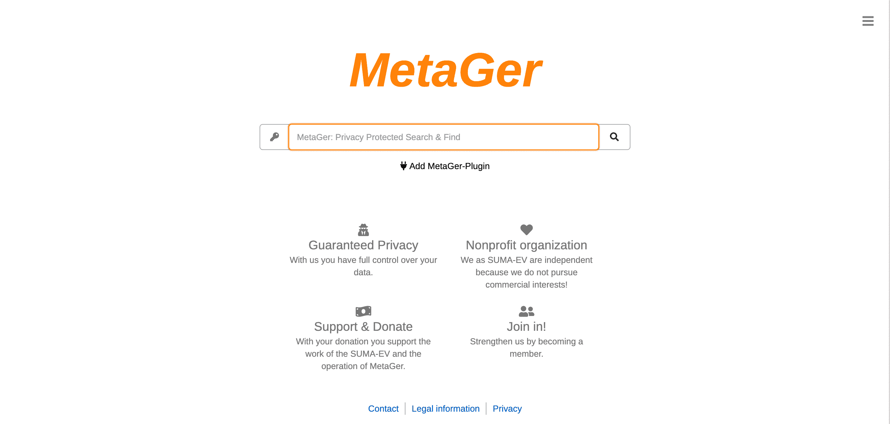

MetaGer search engine

MetaGer 通过匿名搜索提供“隐私保护搜索& Find”。他们是一个[非营利组织](https://kinsta.com/blog/wordpress-for-nonprofits/)，所以他们不会因为追踪你的搜索而有所收获，而且他们只使用绿色能源，增加了信任感。

MetaGer 是一个元搜索引擎，可以查询多达 50 个外部搜索引擎，为其结果提供多样性和深度。它在处理查询时不考虑点击率，所以结果是未过滤的和无偏见的。他们甚至提供地图和路线规划，但不追踪你的位置。

你也可以下载一个插件，将 MetaGer 设置为你的默认搜索引擎和起始页，以确保你的搜索始终保持私密。

### 19.巨型细胞

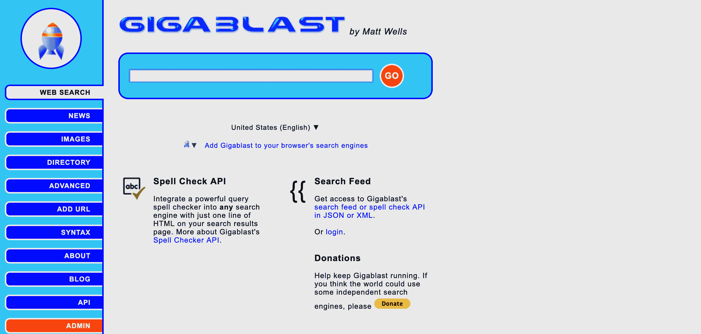

Gigablast search engine

Gigablast 是一个私人搜索引擎，它对数百万个网站和服务器的实时信息进行索引，而不会跟踪你的数据，让你远离营销人员和 T2 垃圾邮件制造者。

它不是最有吸引力的搜索引擎，但它提供了多种过滤或个性化查询的选项，包括按语言、精确短语和文件类型进行搜索。除了网页、新闻和图片，Gigablast 还提供了一个目录和一个全面的高级搜索功能。

### 20.奥斯科博

Oscobo search engine

Oscobo 是一个搜索引擎，可以在你搜索网页时保护你的隐私。通过不使用任何第三方工具或脚本，您的数据得到保护，免受黑客攻击和滥用。

通过加密所有流量，它提供匿名搜索结果，没有任何形式的跟踪，包括 IP 地址和 cookies。Oscobo 不会将搜索词发送到您点击的网站，也不会分享您的个人数据或搜索历史。

您可以通过网页、图像、视频和地图进行搜索，以获得更好的可用性。还有一个 [Chrome 扩展](https://kinsta.com/blog/best-chrome-extensions/)，允许你从 Chrome 栏进行私人搜索，以方便访问安全查询。

### 21.无限搜索

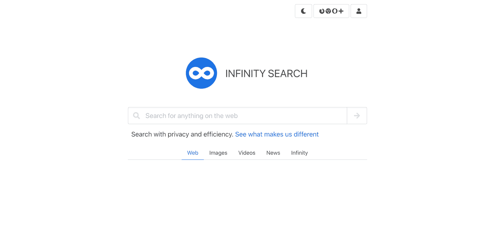

Infinity search

[Infinity Search](https://infinitysearch.co/) 是一个另类的搜索引擎，特别关注隐私。事实上，Infinity Search 不会保存用户搜索的内容，也不会记录任何关于访问者的可识别信息。为了加快搜索结果的速度，Infinity Search 从多个来源检索结果，并在结果页面上有一个侧栏，用户可以在许多其他网站上搜索相同的内容。

这个可靠的替代搜索引擎的一个很酷的地方是它也是开源的。你可以在 GitLab 上找到更多相关信息。

这个搜索引擎有几个内置的集成，比如股票图表和 HTML 编辑器。Infinity Search 与许多其他搜索引擎的不同之处在于，它们有自己的索引，并且不完全依赖外部资源。

## 除了谷歌，最好的搜索引擎是什么？

毫无疑问，由于其强大的算法和人工智能，谷歌是最大的，也可以说是最好的搜索引擎。

因此，选择不使用谷歌浏览互联网似乎是一种奇怪的尝试。但是成为最好的搜索引擎是有代价的。

众所周知，谷歌以分享你的个人数据为代价，通过允许谷歌在互联网上跟踪你来个性化你的浏览体验。对某些人来说，这种个性化至少会变得令人讨厌。

更重要的是，这些替代方案中有许多为您提供不同的隐私功能和方法。所以去尝试一下吧，你可能会得到更好的搜索结果。

以下是一些你可以使用这些替代搜索引擎的方法:

### 在 DuckDuckGo 上执行 Bang 搜索

一个 [DuckDuckGo bang](https://duckduckgo.com/bang) 是一个快捷方式，可以快速将你带到其他网站的搜索结果。

例如，当你想在另一个网站(如维基百科、亚马逊、GitHub、Stack Overflow 等)搜索时，只需添加一个**！**到搜索栏:

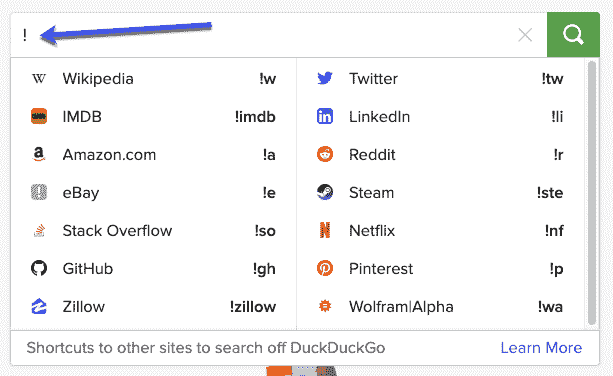

Bang search with DuckDuckGo

您将能够从一个大的目标网站列表中选择并执行搜索。然后，该按钮会将您直接带到您刚刚定义的网站的搜索结果页面。当你知道你想在另一个网站上搜索时，这很有用。

### 检查 DuckDuckGo 上的网站是否关闭

另一个来自 DuckDuckGo 这里。您可以通过搜索:**“X 是否宕机”**快速、轻松地检查网站是否宕机:

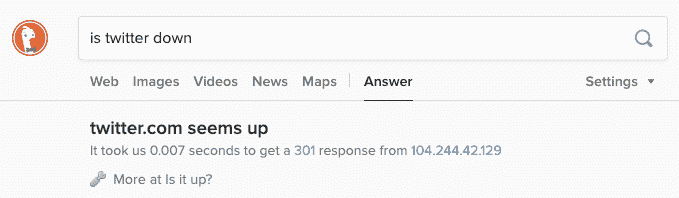

Website status DuckDuckGo

### 在 Bing 上预览结果中的图像

只需将鼠标悬停在搜索结果中的图像上，即可预览该图像:

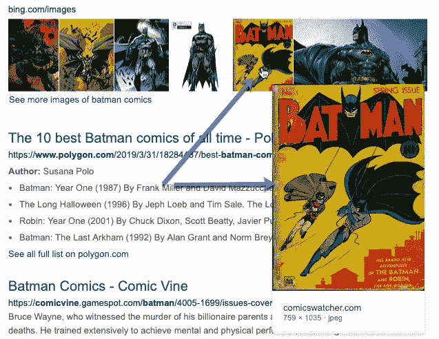

Preview images with Bing

如果你将鼠标悬停在 Bing 视频搜索的缩略图上，你还会看到视频的简短预览。这有助于您在不访问网站的情况下快速检查剪辑是否相关。

### 比较 WolframAlpha 中的网站

使用 WolframAlpha，您可以对任何网址进行快速网站比较。

比如搜索*[facebook.com vs twitter.com](https://www.wolframalpha.com/input/?i=facebook.com+vs+twitter.com)*:

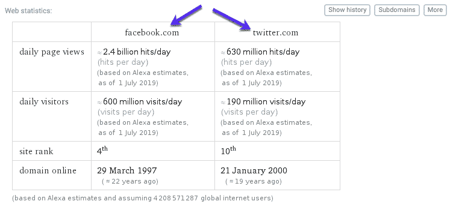

Website comparison with WolframAlpha

数据直接从 Alexa 的数据库中提取，让你快速浏览两个网站。

## 什么是最好的隐私搜索引擎？

所以你想在不损害隐私的情况下搜索网页？那你最好用私人搜索引擎。

但是什么是私人搜索引擎呢？

私有搜索引擎是不跟踪其用户数据的搜索引擎，并且提供具有额外保护和数据隐私级别的搜索结果。

最好的隐私搜索引擎是:

*   达克达克戈
*   StartPage

让我们从保护您的隐私的角度更仔细地看看它们:

### 最佳私人搜索引擎#1: DuckDuckGo

DuckDuckGo 包括一个详细透明的隐私政策。然而，如果 100%的隐私是你的目标，你应该知道它可以保存搜索历史。DuckDuckGo 声称这是“非个人”和聚合数据，因此您的搜索无法直接追溯到您。

你可以在这里阅读完整的 DuckDuckGo 隐私政策[。](https://duckduckgo.com/privacy)

### 最佳私人搜索引擎#2:起始页

StartPage 的隐私政策简单而中肯:*“我们不跟踪你。我们不侧写你。句号。”*使用这个私人搜索引擎时，元数据(个人信息，如[你的 IP 地址](https://kinsta.com/tools/what-is-my-ip/what-is-my-ip/))会从你的搜索查询中删除。这个匿名搜索请求会被发送到 Google，然后结果会通过 StartPage 发送给你，不会泄露你的任何私人数据。

你可以在这里阅读完整的起始页隐私政策[。](https://www.startpage.com/en/search/privacy-policy.html)

[Google is the #1 search engine. Does it mean it's the only one you could use? Check out the best alternatives and what they can offer 🕵️👤Click to Tweet](https://twitter.com/intent/tweet?url=https%3A%2F%2Fbit.ly%2F2NQLLgj&via=kinsta&text=Google+is+the+%231+search+engine.+Does+it+mean+it%27s+the+only+one+you+could+use%3F+Check+out+the+best+alternatives+and+what+they+can+offer+%F0%9F%95%B5%EF%B8%8F%F0%9F%91%A4&hashtags=seo%2Csearchengine)

想学习如何使用搜索引擎优化来增加网站流量吗？看看[我们的视频](https://www.youtube.com/watch?v=a0R78h7NMhg) :

## 摘要

这只是一个可供选择的搜索引擎和它们所能提供的世界的快照。

无论你是在寻找更多的隐私，更好的可用性，还是无偏见的结果，都有很多选择。试几个出来，看看你怎么样。你永远不知道；你可能会找到新的最爱。或者至少是一个谷歌助手。

* * *

让你所有的[应用程序](https://kinsta.com/application-hosting/)、[数据库](https://kinsta.com/database-hosting/)和 [WordPress 网站](https://kinsta.com/wordpress-hosting/)在线并在一个屋檐下。我们功能丰富的高性能云平台包括:

*   在 MyKinsta 仪表盘中轻松设置和管理
*   24/7 专家支持
*   最好的谷歌云平台硬件和网络，由 Kubernetes 提供最大的可扩展性
*   面向速度和安全性的企业级 Cloudflare 集成
*   全球受众覆盖全球多达 35 个数据中心和 275 多个 pop

在第一个月使用托管的[应用程序或托管](https://kinsta.com/application-hosting/)的[数据库，您可以享受 20 美元的优惠，亲自测试一下。探索我们的](https://kinsta.com/database-hosting/)[计划](https://kinsta.com/plans/)或[与销售人员交谈](https://kinsta.com/contact-us/)以找到最适合您的方式。