# 内容创作者和企业的 14 个最佳 YouTube 替代品

> 原文：<https://kinsta.com/blog/alternatives-to-youtube/>

2022 年，YouTube 是美国成年人中使用最多的平台。但是，仅仅因为它是市场上领先的视频平台和搜索引擎，并不意味着对于某些用例没有更好的替代方案。

由于每个视频显示的广告数量不断增加，以及算法干扰上传的视频，许多 YouTube 视频创作者已经开始探索其他选择。

外面有很多选择。

在这篇文章中，我们看了免费和付费 YouTube 的最佳替代品，并讨论了企业主何时应该选择 YouTube 以外的替代品。

### 查看我们的[视频指南](https://www.youtube.com/watch?v=dBpToUmap7k)了解 YouTube 的最佳选择

## YouTube 能被取代吗？

YouTube 是市场上最成熟的在线视频平台。每月有超过 20 亿登录用户访问该平台，全球观众每月观看数十亿小时的视频。

> 需要在这里大声喊出来。Kinsta 太神奇了，我用它做我的个人网站。支持是迅速和杰出的，他们的服务器是 WordPress 最快的。
> 
> <footer class="wp-block-kinsta-client-quote__footer">
> 
> 
> 
> <cite class="wp-block-kinsta-client-quote__cite">Phillip Stemann</cite></footer>

[View plans](https://kinsta.com/plans/)

因此，从市场和观众的角度来看，我们列表中的选项不太可能在短期内完全取代 YouTube。

但是如果你[还没有一个现成的 YouTube 频道](https://kinsta.com/blog/how-to-create-a-youtube-channel/)，它可能仍然值得你花时间为你的视频策略考虑一个不同的选择。

无论你是制作视频并利用它们来吸引新的观众，还是将它整合到你的网站上来将访问者转化为潜在客户，你都有很好的选择来取代 YouTube。

## YouTube 的竞争对手是谁？

YouTube 在不同类别中都有竞争对手。作为一个社交视频分享平台，Twitter、Instagram 和脸书已经成为原生视频的竞争对手。

这些平台在过去几年中增加了对视频的关注，脸书甚至在 2018 年发布了[Facebook Watch](https://www.facebook.com/business/help/299111170863908?id=214359809769375)——一个为每个用户定制的以视频为中心的订阅源。Twitter 还允许用户上传原生视频，Instagram 去年推出了 [IG TV](https://about.instagram.com/features/igtv) 。

严格来说，视频托管平台有 Dailymotion 等免费选项和 Wistia、Vimeo 和 Spotlightr 等高级解决方案。

## 最佳免费 YouTube 替代品

下面，我们为内容创作者和企业提供了一系列免费的 YouTube 选择。

### 1.日常运动

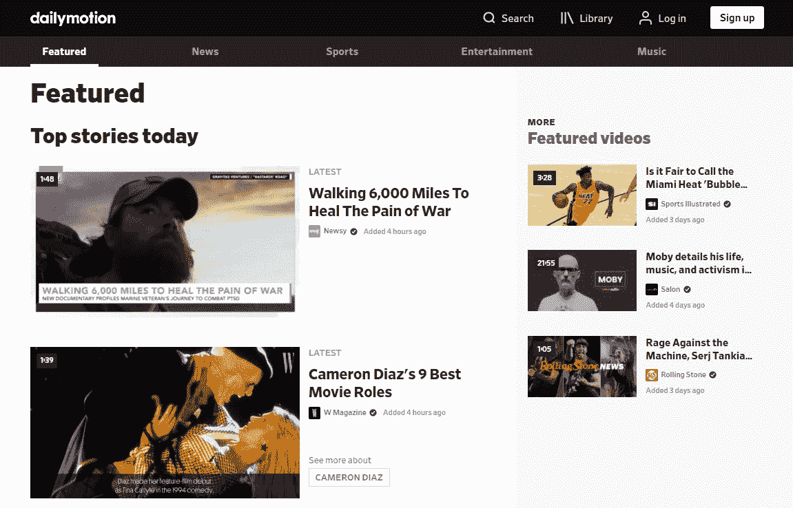

Dailymotion homepage.

[Dailymotion](https://www.dailymotion.com/) 是一个视频托管和分享平台，用于上传视频并与现有观众分享。你可以用它来创建一个视频频道，获得追随者，并从共享广告收入中赚钱。

听起来很熟悉？这是你能得到的最接近 YouTube 的东西，但实际上不是一样的东西。

#### 赞成的意见

*   免费无限视频上传
*   上传支持高达 2 GB 和 60 分钟长的高清视频
*   支持 4K 视频上传和播放
*   时尚的嵌入式视频播放器
*   创作者可以通过广告赚钱

#### 骗局

*   较小的受众
*   所有视频上的广告，甚至非合作伙伴频道

#### 观众

作为内容创作者或营销人员，在选择 YouTube 替代方案时，受众规模是需要考虑的关键因素。

Dailymotion 声称其平台上有 3 亿活跃用户。他们可能指的是平均每月 3 亿独立访客，因为如果你看看他们的顶级频道和视频，这些数字并不完全相同。

例如，T 系列，这个在 YouTube 上拥有超过 1 . 9 亿用户的巨头，在 Dailymotion 上拥有不到 1 万名*粉丝。当然，他们只上传了几个视频，但考虑到*最受欢迎的* Dailymotion 账户，这个数字并不令人敬畏。*

最后，如果我们看看 Dailymotion 上的视频列表趋势，我们会看到与 YouTube 呈现的数字截然不同的数字:

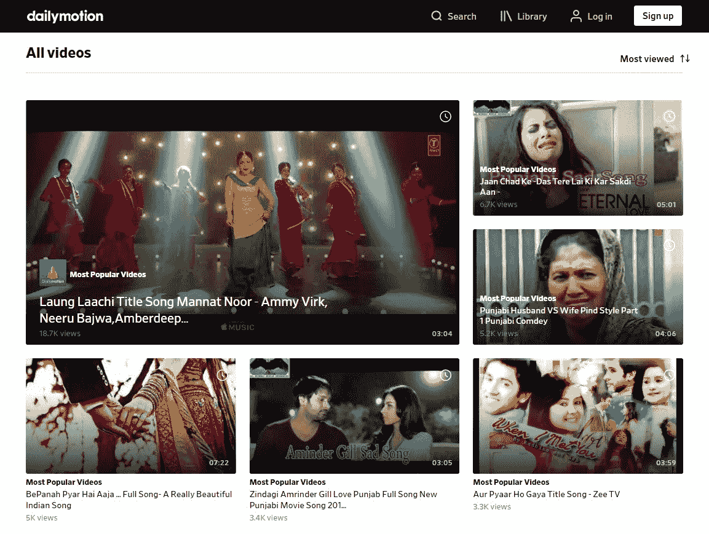

每日动态热门视频。

第一个结果不到十万次浏览，第二个只有区区五千次。

许多热门视频的浏览量只有几百次。

这些因素应该让事情变得非常清楚:Dailymotion 的受众比 YouTube 少得多。

#### Dailymotion 比 YouTube 好吗？

既然 Dailymotion 是直接竞争对手，那么问它是否比 YouTube 更好这个问题是公平的。

YouTube 支持精确的视频分辨率、更长的视频和更大的文件上传。YouTube 也有更多的观众，在搜索结果中获得推荐或列出的视频的流量潜力要高得多。

但另一方面，竞争在 Dailymotion 上并没有那么激烈。正如我们所报道的，只要在 24 小时内达到 1000 次浏览，你就可以点击趋势列表，让你的视频得到推广。这个数字不会影响 YouTube 这个更大的平台。

如果你的观众不多，Dailymotion 可能是一个值得测试的新视频发布渠道。在 Dailymotion 的用户群中，你将有更高的机会被其他人看到和分享。

Dailymotion 做得更好的一件事是嵌入视频。最终结果看起来更时尚，没有品牌或扩展播放选项:

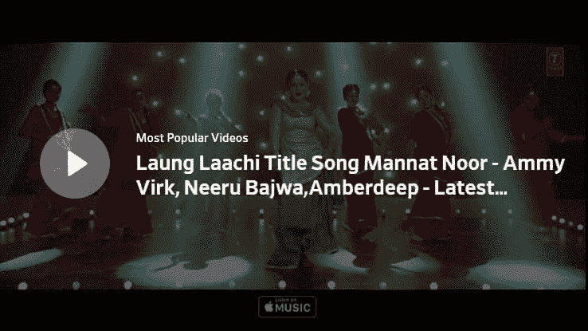

Dailymotion 嵌入式视频。

他们的嵌入式播放器使其成为网站所有者在文章和页面中实现短视频的更好选择。

#### 以下产品的绝佳选择:

*   还没有在 YouTube 上立足的内容创作者(有可能成为小池塘里的大鱼)
*   想要 YouTube 之外的免费视频托管服务来托管其嵌入式高清视频的小型企业

### 2.Vimeo

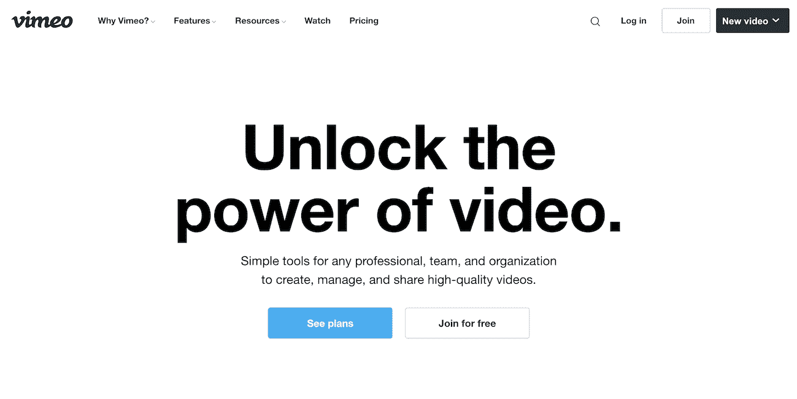

Vimeo homepage.

Vimeo 是一个视频平台，提供托管、协作、分享、压缩、销售线索生成等工具。

它拥有专注于特定领域的活跃用户群，这使得它成为一些创作者或企业的合格受众建设平台。

#### 赞成的意见

*   支持 4K 视频上传和播放
*   支持实时流媒体
*   完全可定制的[嵌入](https://kinsta.com/blog/embed-youtube-video-wordpress/)
*   参与用户群

#### 骗局

*   免费计划限制为每周上传 500 MB
*   免费用户的最大视频大小为 500 MB
*   创作者没有广告收入的潜力

#### 观众

Vimeo 拥有超过 2 亿用户，仅占 YouTube 总观众人数的不到 9%。

但与 Dailymotion 不同的是，Vimeo 拥有一批活跃的核心用户，维持着一个繁荣的社区。

虽然 YouTube 是各种创作者的家园，涵盖了各种类型和主题——从旅游、体育、游戏到 DIY——但 Vimeo 上最受欢迎的视频可以归为几个类别:

*   短片
*   自然视频
*   极限运动
*   音乐视频
*   动画片

这个社区庆祝创造力，如果你符合他们的电影标准，他们会很乐意分享你的作品。

Vimeo 还有一个人选和短片首映的专题页面:

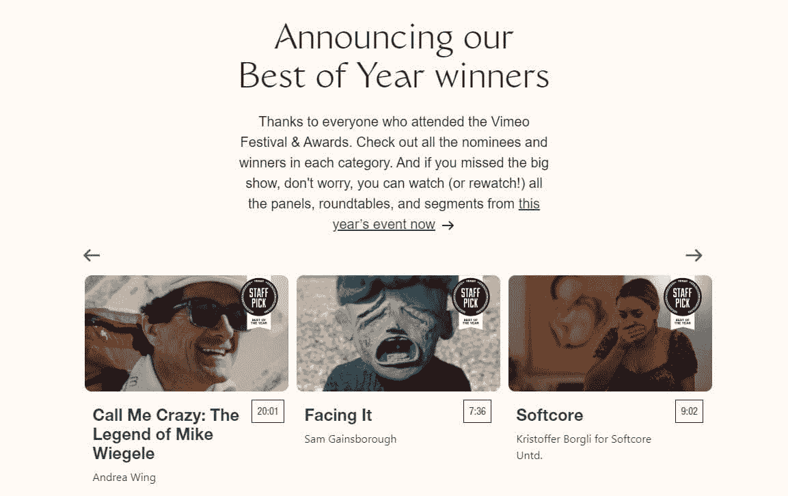

Vimeo 节及颁奖。

这个过程为新电影制作人和创作者接触观众提供了一条捷径。

#### Vimeo 比 YouTube 好吗？

对于一些创作者和企业来说，Vimeo 可能是比 YouTube 更好的平台。

如果你管理一家视频制作公司或一名业余摄像师，Vimeo 由专业创意人员组成的紧密联系的社区是完美的匹配。因为这是一个更小、更集中的受众群体，所以在没有追随者的情况下更容易获得关注和观点。

专业用户甚至可以在平台上的所有视频下方列出他们的工作可用性和一个“雇佣”按钮:

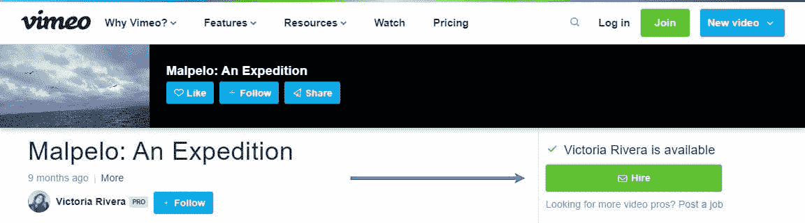

Vimeo 的“雇佣”按钮。

许多行业专业人士也更喜欢 Vimeo 播放器，因此将您的 showreel 上传到平台不会有什么坏处。

如果你是一个需要视频托管服务的企业主，Vimeo 提供了比 Youtube 更好的嵌入式视频播放器。

您可以直接自定义嵌入代码，并创建自动启动的全屏视频，而无需第三方工具或服务:

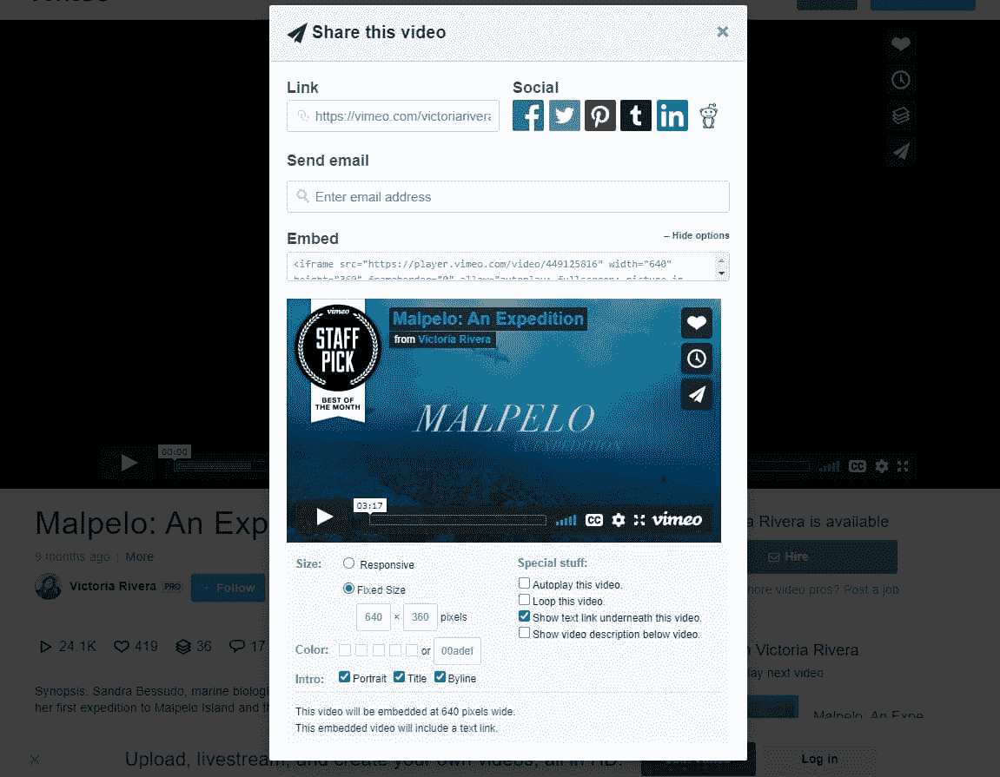

Vimeo 视频嵌入选项。

你甚至可以改变播放配色方案，以配合你的品牌的颜色。

如果你需要上传视频并将其嵌入到你的网站上，Vimeo 是一个很好的选择——可定制的、时尚的高清视频嵌入，总成本为 0 美元。

#### 以下产品的绝佳选择:

*   视觉艺术家、动画师、摄像师和其他创意专业人士
*   企业主寻找一个免费的视频托管网站与好看的嵌入

### 3.Facebook Watch

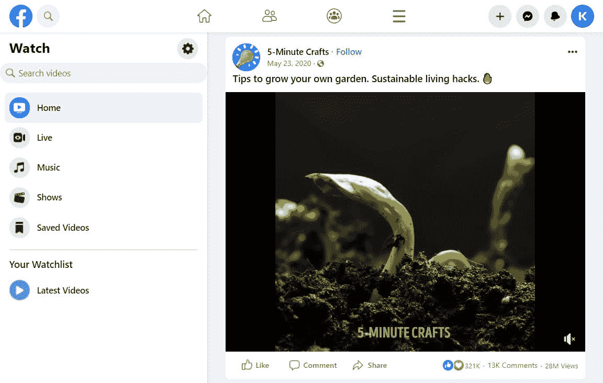

脸谱手表。

在过去的几年里，脸书在视频方面加倍努力。他们甚至发布了 Facebook Watch，这一功能允许你根据自己的兴趣和观看历史来浏览和观看热门视频。

界面和 YouTube 差别很大，但是内容和受众经常重叠。

在许多方面，脸书现在是视频托管/共享领域的一个成熟的竞争对手。

#### 赞成的意见

*   比 YouTube 更大的潜在受众和覆盖面
*   脸书本地视频分享
*   选择通过广告赚钱
*   支持长达 10 GB 和 4 小时的文件
*   重新确定活动目标的自定义受众
*   直播

#### 骗局

*   最高分辨率上限为 1080p
*   笨重的嵌入

#### 观众

脸书拥有近 30 亿月活跃用户，是唯一比 YouTube 拥有更广泛用户基础的替代者。

现在，视频分享不是脸书的主要目的，但它已经成为该平台用户体验的重要组成部分。只需查看你的时间表，或者阅读最新的脸书统计数据。

过去，脸书视频出版商单月的浏览量就超过了 30 亿次。一些网站，如[的 LADbible](https://www.facebook.com/LADbible/) ，完全在脸书建立了他们的观众群，而[的 Nas Daily](https://www.facebook.com/nasdaily/) ，一个受欢迎的旅游博客，经常在他的视频上获得数千万的浏览量。

因为脸书有一个基于广告的模式，成功的创作者可以获得收入分成并养活自己。

脸书也可以成为企业通过视频营销努力获得新受众的绝佳沙盒。

#### 以下产品的绝佳选择:

*   旅游博客作者、YouTube 厨师和其他内容创作者
*   希望通过视频吸引新观众的小型企业
*   希望为未来的[脸书营销](https://kinsta.com/blog/facebook-marketing/)活动创造种子受众的营销人员

### 4.推特视频

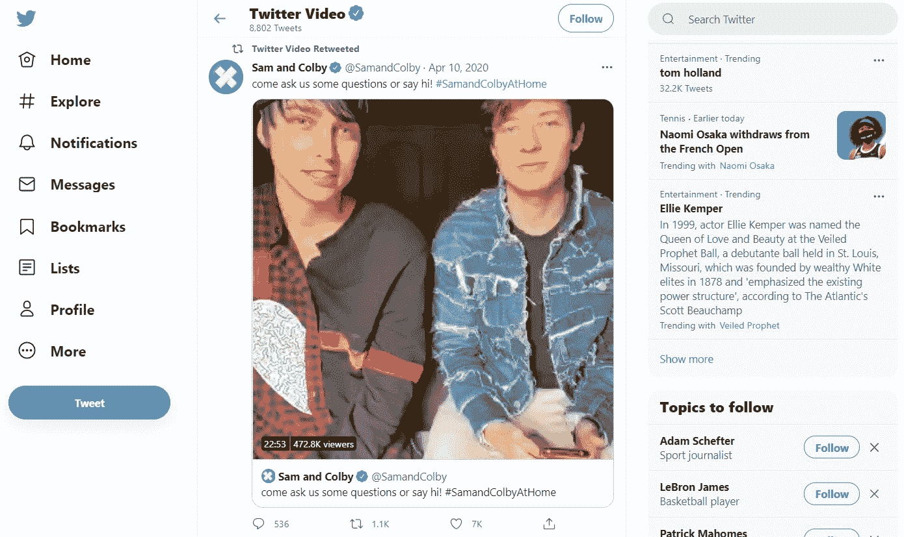

推特视频。

Twitter 是另一个全押在视频上的社交媒体平台。三年多前，他们推出了 Twitter Live，此后一直定期报道体育赛事。

但这还不是全部:任何 Twitter 用户都可以上传和分享视频，或者在平台上开始直播。

#### 赞成的意见

*   Twitter 上的原生视频分享
*   低保真度视频表现不错
*   直播

#### 骗局

*   最大视频长度为 140 秒
*   最大分辨率为 1200p

#### 长格式与短格式视频内容

了解 YouTube SEO 的来龙去脉的行业专家已经注意到一种趋势，即 YouTube 更喜欢较长的视频——最好超过 10 分钟——作为推荐和搜索结果。

如果你努力制作制作精良的 10 分钟长的视频，Twitter 可能是你试验视频内容的更好地方。

Twitter 是一个“短小精悍”会有回报的平台，所以如果你天生不啰嗦，这可能是天作之合。

#### 以下产品的绝佳选择:

*   喜剧演员和其他靠短格式视频发迹的创作者
*   能够快速回答具体问题的会计师和其他专业人士
*   任何与长格式视频斗争的人

### 5.IG 电视

IGTV 主页。

IG TV 是 Instagram 的视频分享平台，被设计成一个 100%移动优先的环境。

它于 2018 年发布，与其说是对 YouTube 的直接攻击，不如说是 Vine 的精神继承者——脸书正在用 Facebook Watch 处理这一问题。

但这并不意味着它不能成为创作者和企业在 YouTube 上看不到吸引力的可行替代方案。

#### 赞成的意见

*   Instagram 上的原生视频分享
*   完全支持原生移动视频格式
*   低保真度视频表现不错

#### 骗局

*   普通账户最多 10 分钟
*   仅限于应用

#### 移动优先的视频体验

Instagram 的 IG TV 目标是创建第一个具有优化的移动优先视频体验的平台。

随着全移动人像视频成为常态，您可以获得与视频创作者近距离的个人体验。

它可以成为通过非结构化移动视频与观众建立更深层次关系的优秀工具。

#### 以下产品的绝佳选择:

*   买不起相机或制作人员的企业
*   年轻受众的内容创作者

### 6.数据管道

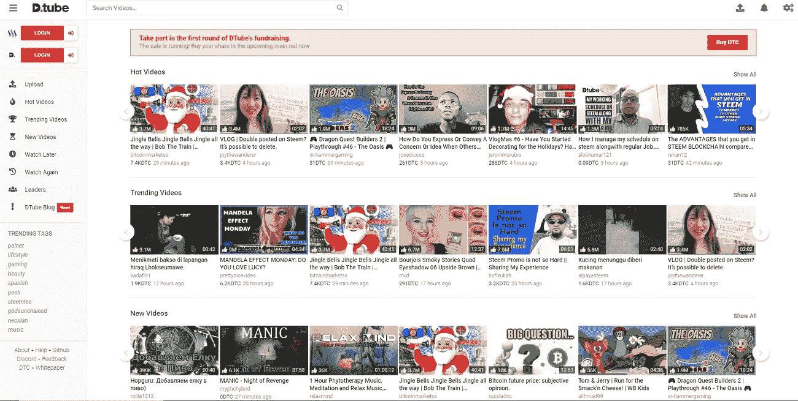

DTube 主页。

DTube 是 YouTube 的一个替代品，它使用区块链技术在点对点之间分享视频。

分散式方法意味着降低了[服务器中断](https://kinsta.com/blog/website-downtime/)中断视频的风险。

该平台支持言论自由，反对 YouTube 基于人工智能的审查，所有视频创作者都可以为成功的视频赚取 DTube 的加密货币。

您还可以共享托管在其他地方的视频，而不是上传到 IPFS。

#### 赞成的意见

*   没有审查
*   赚取加密货币

#### 骗局

*   小观众
*   笨拙的界面

#### 以下产品的绝佳选择:

*   区块链爱好者
*   言论自由爱好者

## 最佳付费 YouTube 替代品

下面，我们将介绍 YouTube 在线托管视频的最佳替代方案。如果你是一个企业主或营销人员，需要的不仅仅是视频托管，这些将是你的拿手好戏。

## 注册订阅时事通讯

### 想知道我们是怎么让流量增长超过 1000%的吗？

加入 20，000 多名获得我们每周时事通讯和内部消息的人的行列吧！

[Subscribe Now](#newsletter)

### 7.威斯特亚

Wistia homepage.

Wistia 是一个专业的视频托管平台，它将帮助您将视频与其他营销活动相结合。

它提供了详细的视频分析、视频内线索捕获表单、营销自动化工具集成等等。

假设你已经在使用[分析工具](https://kinsta.com/blog/google-analytics-alternatives/)、CRM 或其他商业工具，并且有一个数据驱动的方法来开发和优化你的营销活动。那样的话，这正合你的胃口。

#### 赞成的意见

*   4K 视频支持，高达 8 GB 的文件
*   真棒，可定制的嵌入
*   根据用户活动为脸书广告创建定制受众
*   从视频播放器中捕捉线索
*   使用自动回复器和 CRM 同步电子邮件和其他数据

#### 骗局

*   价格:Wistia 起价为 99 美元/月，第十个视频之后每段视频加 0.25 美元
*   没有观众

#### 漂亮的嵌入

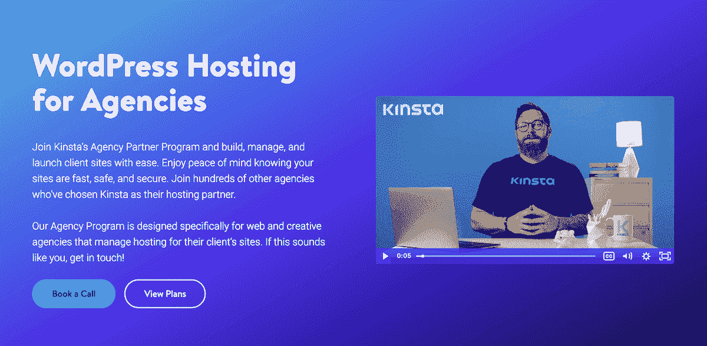

Wistia embedded videos.

Wistia 最好的特性之一是你可以完全控制定制每个嵌入式视频播放器。

标准内联嵌入代码在您的内容中生成一个流畅、响应迅速的视频播放器。它会自动匹配容器大小，这使得在多个页面中包含视频变得更加容易。

更进一步，您可以在视频的开头或结尾添加 CTA，甚至是线索捕捉表单。

#### 以下产品的绝佳选择:

*   希望在漏斗中更有效地使用现场视频的营销人员
*   销售流程长、以销售线索为中心的业务；保险等。

### 8.Spotlightr(以前的 vooPlayer)

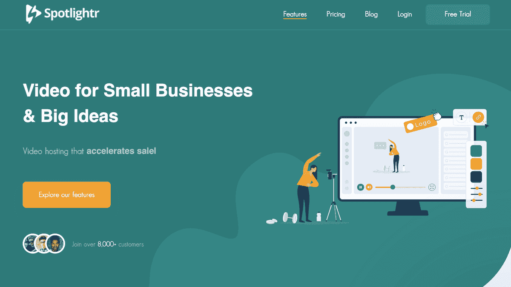

Spotlightr homepage.

从 vooPlayer 更名而来的 Spotlightr 是一个类似的视频营销平台，提供高级分析工具、线索捕捉、业务工具集成和高级安全功能。

你甚至可以为观看特定视频的人举办一场比赛或发放赠品。专业用户也可以在他们的网站上设置 PPV VODs，而不必创建会员门户。

如果你想要 YouTube 替代品的瑞士军刀，Spotlightr 是你最好的选择。

#### 赞成的意见

*   4K 视频支持
*   高级分析
*   营销自动化集成
*   受众构建工具
*   合理的价格:17 美元/月的启动计划

#### 骗局

*   只有 25 GB 存储空间
*   复杂的

#### 远不止视频托管

Spotlightr 及其功能超越了简单的视频托管领域。这是一个完整的工具箱，将帮助您在营销和销售过程的每一步中整合视频。

利用内置的受众生成器为脸书和谷歌广告活动创造受众。为你的观众主持现场直播和比赛。

热图和高级分析让您了解观众如何与您的视频内容互动。

Spotlightr 是一个伟大的工具，将帮助你所有的视频营销活动。

#### 以下产品的绝佳选择:

*   希望在漏斗中更有效地使用现场视频的营销人员
*   销售流程长、以销售线索为中心的业务；保险等。

### 9.布莱特科夫

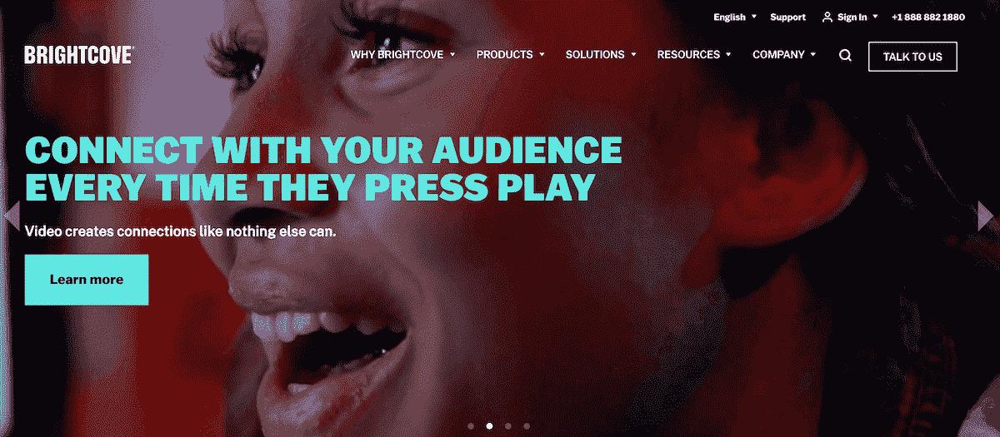

Brightcove homepage.

Brightcove 是面向企业和分布式业务的领先在线视频平台。根据他们的网站，超过一半的财富 500 强公司已经是 T2 的客户。

除了视频托管和直播，Brightcove 将事情推向了另一个层面。您可以使用 OTT 技术在智能手机和智能电视应用程序上提供直播视频。

对于出版商来说，它提供了在托管视频中插入服务器端广告的功能。你可以将它与 DSP 整合，直接向你的客户销售广告空间。

实时视频分析帮助您了解您的客户和潜在客户如何与您网站上的视频互动。

#### 赞成的意见

*   超高清支持高达 8K 的视频分辨率
*   在您的视频中投放和销售广告空间
*   通过高级内容管理将视频集成到应用和网站中
*   协作工具提高最终视频质量
*   实时分析给你新的见解
*   基于视频互动建立成熟的受众

#### 骗局

*   企业定价。他们的网站上也没有定价模式。
*   笨拙的界面

#### 以下产品的绝佳选择:

*   希望集中管理视频并利用观众数据实现个性化体验的企业

### 10.SproutVideo

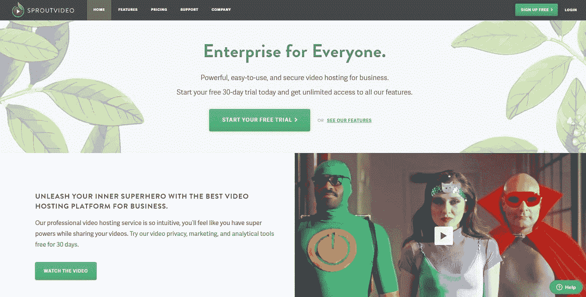

SproutVideo homepage.

对于拥有强大数字营销能力的小企业和个体创业者来说，SproutVideo 是一个很好的 YouTube 替代品。

需要为您的专业网站提供超快的、可靠的、完全安全的托管服务吗？Kinsta 提供所有这些以及 WordPress 专家提供的 24/7 世界级支持。[查看我们的计划](https://kinsta.com/plans/?in-article-cta)

您可以完全控制为网站上的每个页面定制和创建独特的视频播放器。这样，您可以确保嵌入的视频不会与您的设计冲突，而是对其进行补充。

利用可定制的销售线索表单，从您的视频播放器中捕捉销售线索。通过 API 集成将销售线索直接发送到您最喜欢的自动回复器或 CRM。

它集成了 MailChimp、Hubspot、 [Zapier](https://kinsta.com/blog/woocommerce-zapier/) 和许多第三方工具。

#### 赞成的意见

*   4K 超高清回放
*   为每个页面定制和创建独特的视频播放器
*   视频中的销售线索捕获表单
*   地理跟踪和高级分析
*   观看视频后，通过定制 CTA 推动更多行动
*   地理限制适用于企业计划
*   合理:种子计划起价为每月 25 美元

#### 骗局

*   复杂的
*   每月为超过 500 GB 的带宽支付额外费用

#### 以下产品的绝佳选择:

*   小企业和个体创业者，他们擅长数据驱动的营销，并希望从他们的视频作品中获得更多

### 11.WordPress 替代品:Jetpack

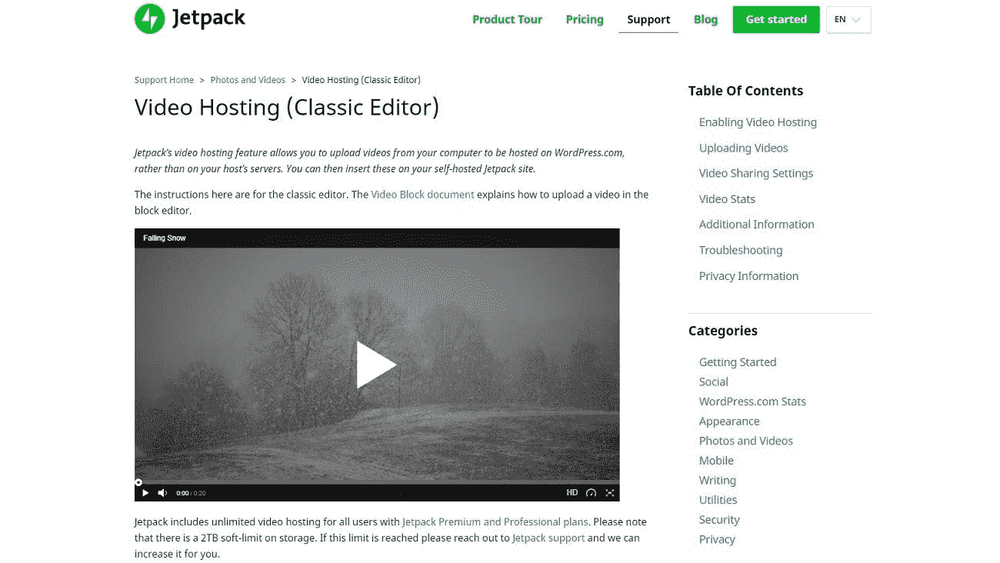

Jetpack 的视频托管功能。

对于我们的 WordPress 爱好者来说，他们只是想要一个 WordPress 插件来完成这项工作，不要再找了:WordPress 的 Jetpack 在他们的收费计划中包含了 T2 视频主机，收费低至 11.97 美元/月。

使用新的编辑器，您可以将视频块直接添加到帖子或页面中，而无需复制粘贴。

你也可以在你的 WordPress 仪表盘中查看深入的实时视频分析。

#### 赞成的意见

*   支持高达 4K 分辨率的高清视频
*   无限的存储和带宽
*   选择自动播放、静音或循环播放嵌入的视频
*   实时分析
*   便宜:喷气背包高级计划每月花费 10 美元

#### 骗局

*   需要一个 WordPress 站点来有效地使用
*   缺少竞争对手高级选项的高级功能

#### 将视频块直接添加到 WordPress 帖子中

如果你使用[古腾堡编辑器](https://kinsta.com/blog/gutenberg-wordpress-editor/)，你可以将视频块直接添加到 WordPress 的帖子和页面中。

WordPress 视频块。

您可以直接将视频文件从电脑拖放到草稿中。

你不需要定制任何代码来使视频在直播时看起来很棒。WordPress 会自动为你处理这个过程。

#### 以下产品的绝佳选择:

*   Jetpack 的现有高级订户
*   没有预算购买更昂贵解决方案的小型企业

### 12\. Odysee

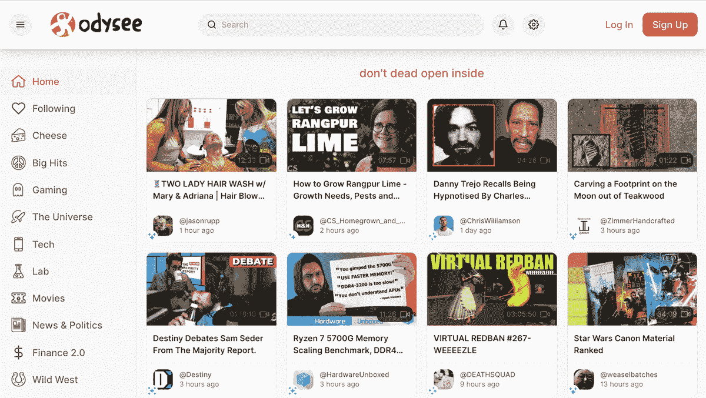

Odysee homepage.

Odysee 很有趣，因为它完全运行在一个叫做 LBRY 的区块链协议上。这个相当新的协议允许任何人在 LBRY 网络上创建与数字内容交互的应用程序。

是的，您可以将视频上传到您的 Odysee 帐户，并将其用于[数字营销](https://kinsta.com/clients/tao-digital-marketing/)和其他业务需求。然而，如果你足够聪明，能够使用该协议构建一个应用程序，你可以完成一些有趣的事情。

#### 赞成的意见

*   应用开发者可以设定每流或下载的价格(像 iTunes 一样)
*   免费提供内容(比如 YouTube)
*   发布视频、音频文件、文档或任何其他类型的文件
*   利用平台赚取加密货币

#### 骗局

*   这个平台可能会出故障
*   用户经常从 YouTube 自动发布到 Odysee，因此更难获得观众

#### 基于区块链构建

LBRY 是 Odysee 的母公司，这也是我们经常看到两个名字在一起的原因。这也是 Odysee 使用的区块链协议的名称。

LBRY Credit 是一种加密货币(也称为数字货币)，Odysee 用它来支付用户。

#### 以下产品的绝佳选择:

*   新老企业希望以加密方式接收支付，并在传统视频平台之外扩大受众
*   对独特的奖励系统感兴趣的内容创作者

## 额外收获:值得考虑的 YouTube 替代品

即使我们涵盖了我们认为的 YouTube 的可靠替代方案，我们认为还有几个方案值得您考虑:

### 13.布里德。电视

新娘。电视主页。

新娘。TV 是一个在[企业级](https://kinsta.com/enterprise-wordpress-hosting/)运作的视频货币化解决方案。这个平台背后的主要想法是帮助出版商增长和货币化他们的观众。

该公司一直在快速发展。到目前为止，他们的流量和广告请求数据正在飞速增长。这意味着这是一个很好的时机和他们一起上船，看看你能完成什么。

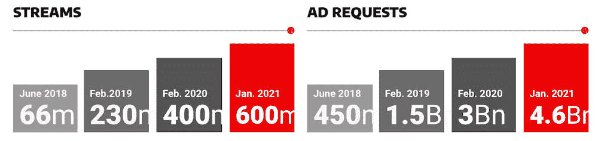

新娘。电视流和广告请求。

#### 赞成的意见

*   简单的设置过程
*   价格合理的企业级视频管理
*   Brid TV player 可以轻松集成到 iOS 和 Android 应用程序中

#### 骗局

*   他们的 WordPress 插件仍然有很多问题并且不稳定

#### 以下产品的绝佳选择:

*   寻求立即有效地将内容货币化的企业
*   希望提高内容浏览量和收入的出版商

### 14.乌特荣

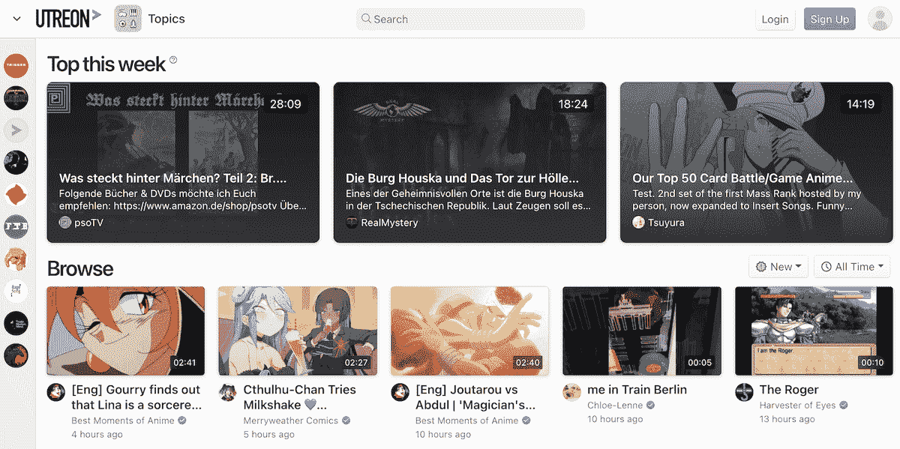

Utreon homepage.

Utreon 已经成为“YouTube 的替代品”运动的重要组成部分，随着这一运动的发展，它变得越来越受欢迎。为什么？它为内容创建者提供更先进的工具，关注创新功能，并提供更好的社区参与。

虽然所有这些方面都很有吸引力，但内容创建者被吸引到 Utrean 平台的最大原因可能是他们对隐私的立场。

例如，他们在任何情况下都不会出售用户信息。他们的[隐私政策](https://utreon.com/privacy)充满了用户利益。

#### 赞成的意见

*   比其他平台更高的隐私标准
*   真正的粉丝与创作者的互动
*   简单的注册流程，允许创建者只需点击几下鼠标即可导入现有内容

#### 骗局

*   因为早期而缺少一些特征
*   响应时间较慢，因为员工仍然很少
*   该平台仍有一些问题需要解决

#### 一种不同类型的接触

除了隐私标准之外，Utreon 最吸引人的地方可能是该平台希望通过视频提供更广泛的参与。

通过利用迷因、视频分享、支持率和提问系统，该平台正试图弥合内容创作者和粉丝之间的差距。

#### 以下产品的绝佳选择:

*   寻求与粉丝和追随者更广泛、更个性化体验的企业和创作者

### 15.Metacafe

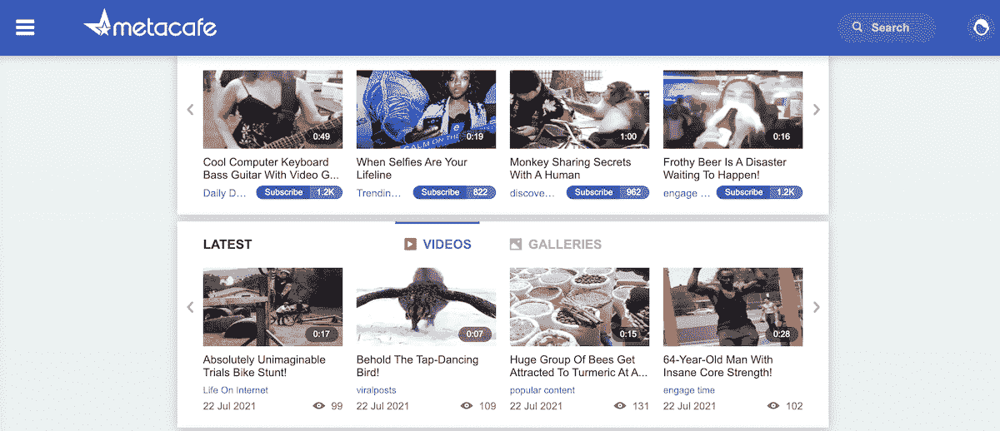

Metacafe 主页。

在我们的最佳 YouTube 替代者名单中，还有一个平台叫做 [Metacafe](https://www.metacafe.com/) 。这个概念很简单，但却非常有效。

它为用户和出版商提供了一个简单易用的上传和浏览内容的平台。

Metacafe 在网上拥有强大的追随者，他们的网站注册为美国前三大视频网站。截至本文发布时，Metacafe 每月有 1200 万的独立浏览量。

他们的平台是一个很好的方式来传递你的信息，同时保持视频剪辑简短扼要。

#### 赞成的意见

*   对评论、音乐视频和新闻剪辑很有用
*   适合家庭的内容

#### 骗局

*   Metacafe 将视频上传限制在 100 MB 以内，因此对于长格式视频来说，它不是一个好的解决方案

#### 短片视频王

这就是 Metacafe 平台的整个前提。平台上的所有视频都是简写的。该平台上的大多数用户将他们的视频保持在 90 秒到 180 秒的时间范围内。

还采取了一个额外的步骤来确保短格式视频风格得到尊重。用户将无法上传任何大于 100 MB 的视频文件。

这个想法是以一种简短、有趣、快速的格式在所有频道上分享内容。

也许 Metacafe 最有趣的一点是视频不能自动添加。一旦提交，一个由 80，000 多名志愿者组成的内置[社区](https://kinsta.com/learn/wordpress-communities/)会对其进行观察，并决定是否将其添加到平台上。

#### 以下产品的绝佳选择:

*   希望制作有趣、充满活力、简短的视频，吸引客户和追随者的内容创作者

[随着每个视频显示的广告数量不断增加，以及算法对上传视频的干扰，许多 YouTube 视频创作者开始探索其他选择👀点击此处查看受欢迎的替代品👇](https://twitter.com/intent/tweet?url=https%3A%2F%2Fkinsta.com%2Fblog%2Falternatives-to-youtube%2F&via=kinsta&text=With+an+ever-increasing+number+of+ads+shown+per+video%2C+and+with+algorithms+interfering+with+uploaded+videos%2C+many+YouTube+video+creators+have+started+exploring+other+options+%F0%9F%91%80+See+the+popular+alternatives+here+%F0%9F%91%87&hashtags=YouTube%2CContentCreators)

## 摘要

2022 年，YouTube 不是在线视频的终极目标。仅仅因为它是领先的视频托管和共享平台，并不意味着它是您或您的企业的唯一选择。

有很多选项可供选择。

你有 IGTV 和 Facebook Watch 等重要的视频分享和社交媒体业务。面向企业的专业视频托管包括 Vimeo、Wistia 和 Spotlightr 等选项。如果您需要一个真正的企业级解决方案，以及一个为您的公司量身定制的计划，Brightcove 是您的不二之选。

想进入能引起大量观众共鸣的短片吗？给 Metacafe 一个眼神。

现在轮到你了:除了 YouTube，你更喜欢什么？你试过什么？请在评论中告诉我们！

* * *

让你所有的[应用程序](https://kinsta.com/application-hosting/)、[数据库](https://kinsta.com/database-hosting/)和 [WordPress 网站](https://kinsta.com/wordpress-hosting/)在线并在一个屋檐下。我们功能丰富的高性能云平台包括:

*   在 MyKinsta 仪表盘中轻松设置和管理
*   24/7 专家支持
*   最好的谷歌云平台硬件和网络，由 Kubernetes 提供最大的可扩展性
*   面向速度和安全性的企业级 Cloudflare 集成
*   全球受众覆盖全球多达 35 个数据中心和 275 多个 pop

在第一个月使用托管的[应用程序或托管](https://kinsta.com/application-hosting/)的[数据库，您可以享受 20 美元的优惠，亲自测试一下。探索我们的](https://kinsta.com/database-hosting/)[计划](https://kinsta.com/plans/)或[与销售人员交谈](https://kinsta.com/contact-us/)以找到最适合您的方式。