# 我们分析了 130 亿个日志条目，以下是我们了解到的情况

> 原文：<https://kinsta.com/blog/analyzing-log-entries/>

我们将是第一个承认这一点的人，我们金斯塔的大多数人都是数据迷。我们喜欢查看大型数据集，看看我们是否能发现新的趋势，或者获得任何可能影响托管行业或我们业务的变化的额外见解。托管数以千计的网站使我们拥有几乎无限的数据源来持续跟踪和提取查询。

我们的系统管理员和开发团队定期挖掘日志文件，看看我们是否可以改进 MyKinsta 工具和客户服务的某些方面。例如，我们使用这些数据的一种方式是**实现更好的过滤器来阻止不良的机器人流量和爬虫**。我们学到的东西直接进入我们的 [MyKinsta 分析](https://kinsta.com/help/mykinsta-analytics/)工具。因此，这些数据实际上可以帮助您节省托管计划的资金，因为我们提高了过滤和访问测量的质量和准确性。

**我们分析了 130 亿(没错是 10 亿)日志条目**，这一次我们决定与您分享我们的所有发现！我们将统计数据分成三个不同的部分:访问日志、缓存性能和 PHP 引擎。

*   [访问日志统计](#access-log-stats)
*   [缓存性能日志统计](#cache-performance-log-stats)
*   [PHP 引擎](#php-engines)

下面的数据是从 Kinsta 服务器上的数千个 WordPress 网站上收集的。图表中的大多数百分比都四舍五入到最接近的整数。共享的数据没有一个是 PII 的。

## 访问日志统计

在总共 130 亿个条目(日志文件中的行)中，我们分析了 80 亿个访问日志。

日志条目包含我们所说的“请求”这不同于访问，因为我们的原始访问日志跟踪从网站请求资源的 IP 地址。例如，Google Analytics 会自动过滤掉大量不良流量，试图向您展示对您网站真实人类访问量的最佳估计。日志统计包括直接命中服务器的每种类型的请求，从浏览器请求到不良机器人和搜索引擎爬虫。

### 桌面 vs 移动 vs 其他一切

我们首先分析了来自桌面浏览器、移动浏览器和其他所有东西的所有请求。为此，我们查看了被称为`user-agent`的 HTTP 头。一个`user-agent`基本上是一个文本字符串，当它连接到 web 服务器时标识浏览器和/或操作系统。

> 需要在这里大声喊出来。Kinsta 太神奇了，我用它做我的个人网站。支持是迅速和杰出的，他们的服务器是 WordPress 最快的。
> 
> <footer class="wp-block-kinsta-client-quote__footer">
> 
> 
> 
> <cite class="wp-block-kinsta-client-quote__cite">Phillip Stemann</cite></footer>

[View plans](https://kinsta.com/plans/)

它通常看起来像这样:`**user-agent:** Mozilla/5.0 (Macintosh; Intel Mac OS X 10_14_3) AppleWebKit/537.36 (KHTML, like Gecko) Chrome/72.0.3626.109 Safari/537.36`。你可以在像 [Pingdom](https://kinsta.com/blog/pingdom-speed-test/) 或 Chrome DevTools 这样的工具中看到响应头中的`user-agent`。

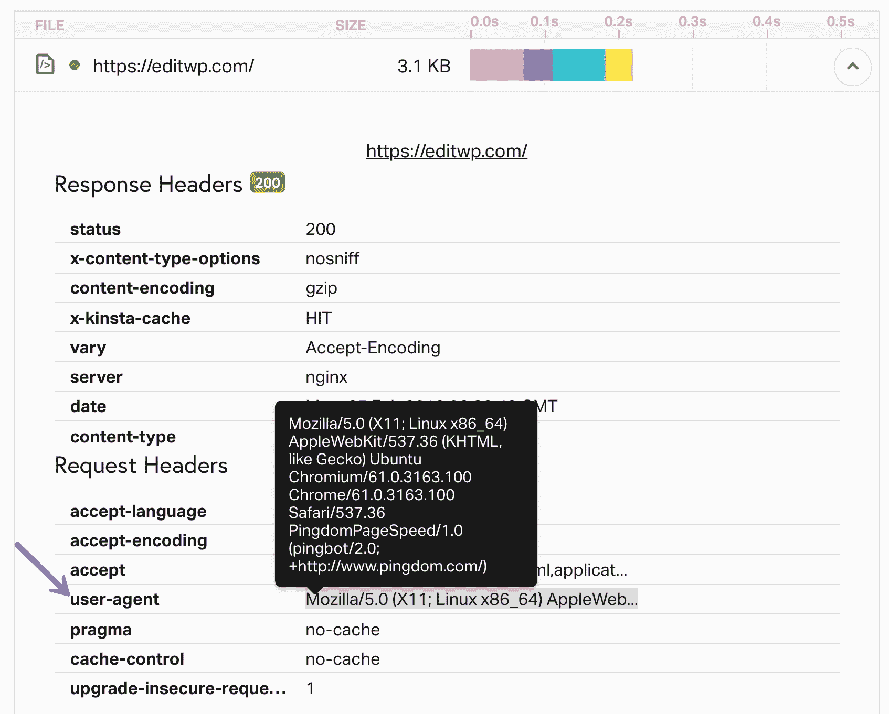

user-agent

关于日志文件中的`user-agent`的一个缺点是它**很容易被假冒**。这就是为什么你会在下面的一些统计中看到“其他”的原因之一。

就像谷歌分析一样，由于广告拦截器和 GDPR cookie，你可能看不到所有的数据(一些人报告说看不到 60%以上的数据！)，你只需**使用你能看到的数据**并据此做出战略决策。

在我们的日志中，我们看到以下数量的请求:

*   来自桌面浏览器的 3，395，000，000 个请求
*   来自移动浏览器的 31 亿次请求
*   1，505，000，000 个来自其他一切的请求(API 调用、[搜索引擎、](https://kinsta.com/blog/alternative-search-engines/)爬虫、机器人、正常运行时间机器人等)。值得注意的是，对于 Kinsta 客户来说，这些类型的请求**被排除在付费访问**之外。我们排除任何类型的机器人，我们可以确定它有“机器人”在其名称中。或者，如果我们发现有东西试图暴力破解“wp-login.php”，我们会禁止它进入我们的基础设施。)

Desktop vs Mobile vs Everything Else (click to view larger)

有趣的是，桌面仍然是对 Kinsta 托管的站点的最多请求的第一名。虽然移动业务发展迅速，但它肯定会因你所处的行业而有所不同。

例如，超过 80%的对我们的 Kinsta 站点的访问来自桌面。我们的网站在移动设备上完全响应迅速，但当涉及到寻找应用程序、数据库和托管 WordPress 主机时，人们不想在他们的手机上做。托管是大多数人仍然喜欢坐在桌面上的承诺之一。

因此，无论如何，你可以搭上移动潮流，但不要忘记考虑你的客户实际上是如何购买你的产品的。

#### 桌面🖥️

接下来，我们根据桌面浏览器的类型查看了来自`user-agent`的超过 33 亿个请求。

*   来自 Chrome 的 1790430230 个请求
*   来自 Firefox 的 473，229，236 个请求
*   来自其他人的 444，729，025 次请求
*   来自 IE 的 251，692，300 个请求
*   来自 Safari 的 218，604，777 个请求
*   来自 Edge 的 169，840，696 个请求
*   来自 Opera 的 41，819，852 次请求

你可以看到 **Chrome 以 53%的请求率领先于**。这并不令人惊讶，因为其他来源，如 [statcounter、](http://gs.statcounter.com/browser-market-share) [NetMarketshare](https://netmarketshare.com/browser-market-share.aspx?options=%7B%22filter%22%3A%7B%22%24and%22%3A%5B%7B%22deviceType%22%3A%7B%22%24in%22%3A%5B%22Desktop%2Flaptop%22%5D%7D%7D%5D%7D%2C%22dateLabel%22%3A%22Trend%22%2C%22attributes%22%3A%22share%22%2C%22group%22%3A%22browser%22%2C%22sort%22%3A%7B%22share%22%3A-1%7D%2C%22id%22%3A%22browsersDesktop%22%2C%22dateInterval%22%3A%22Monthly%22%2C%22dateStart%22%3A%222018-02%22%2C%22dateEnd%22%3A%222019-01%22%2C%22segments%22%3A%22-1000%22%7D) 都显示 Chrome 拥有超过 60%的市场份额。2020 年 10 月进行的一项更近期的研究显示，Chrome 的使用率进一步提高，浏览器市场份额达到 73%。

当然，火狐位居第二。但真正让我们吃惊的是微软 Edge，为 5%。至少在 Kinsta 托管的网站中，微软 Edge 似乎正在慢慢获得更多的市场份额。微软还在 2018 年 12 月宣布，它正在 Chrome 上重建其 Edge 浏览器，并将其带到 Mac 上。

[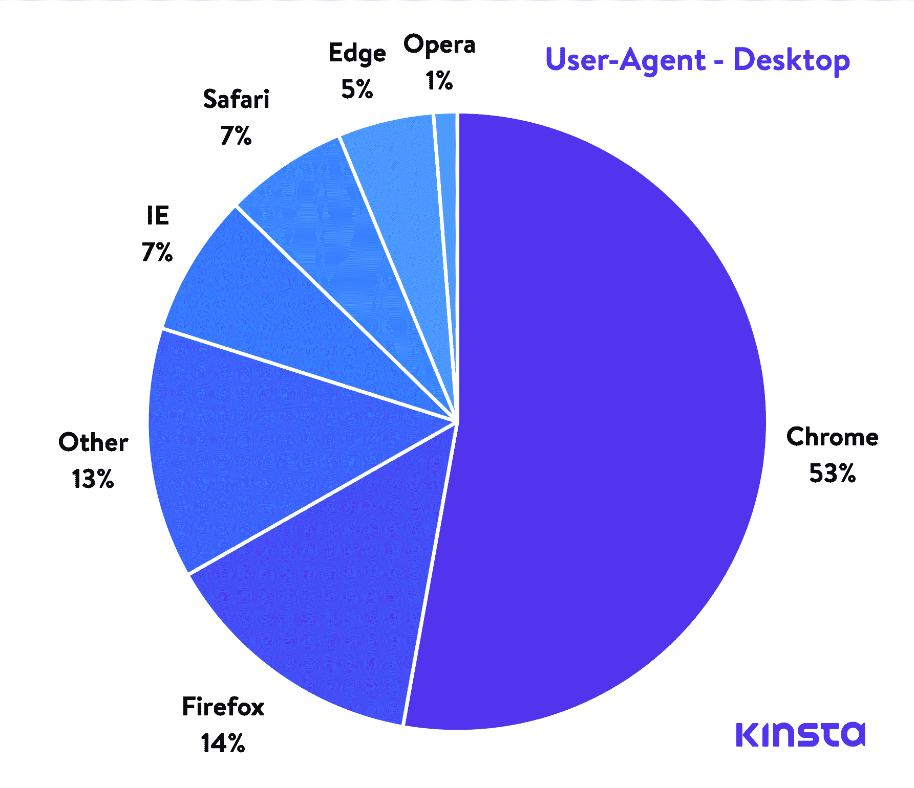](https://kinsta.com/wp-content/uploads/2019/02/user-agent-desktop-1.png)

User-agent desktop (click to view larger)

#### 移动的📱

然后，我们根据移动浏览器的类型查看了来自`user-agent`的 31 亿多个请求。

*   来自 Mobile Safari 的 1，190，404，881 个请求
*   来自 Chrome Mobile 的 945，589，763 个请求
*   脸书提出的 391 674 959 项请求
*   来自三星互联网的 135，877，704 个请求
*   来自 Chrome Mobile WebView 的 108，858，301 个请求
*   来自 Instagram 的 97，946，458 次请求
*   来自 Pinterest 的 87，992，534 次请求
*   来自 Chrome 移动 iOS 的 61，027，970 次请求
*   75，186，662 次来自其他人的请求

这个实际上让我们很惊讶。对于 Kinsta 托管的 WordPress 网站来说，Safari 的**移动版本使用最多**，有超过 10 亿次请求。虽然 Chrome 紧随其后，但你仍然不太经常看到 Safari 独霸群雄。这仅仅意味着很多人在他们的 iPhones 上浏览 Kinsta 托管的网站。

[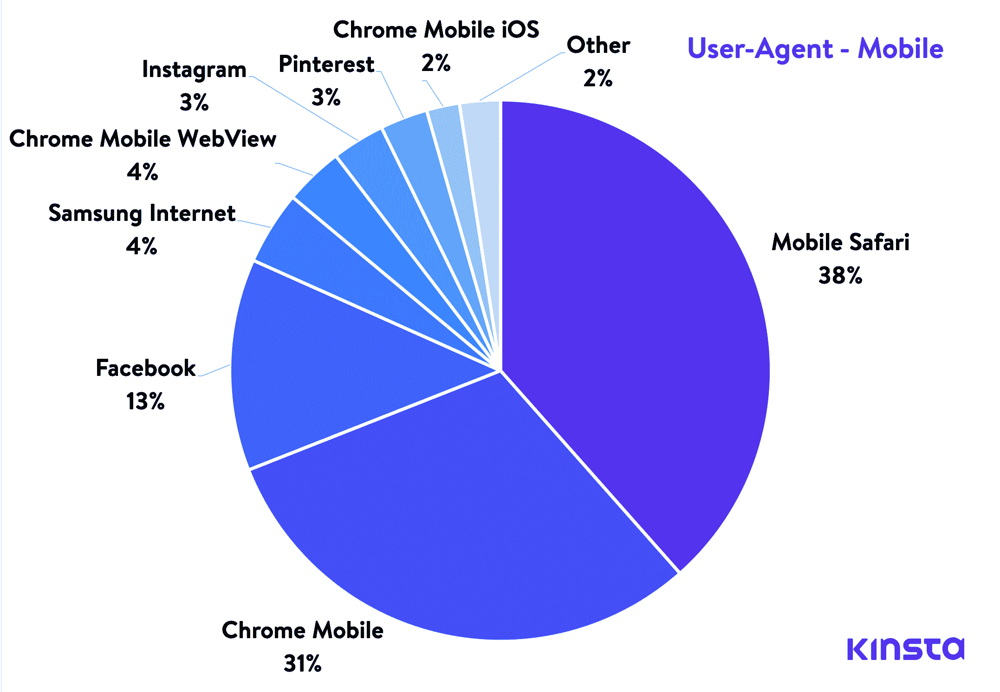](https://kinsta.com/wp-content/uploads/2019/02/user-agent-mobile-1.png) 

【用户代理移动(点击查看大图)

### 操作系统

接下来，我们分析了来自不同操作系统的所有请求:台式机与移动设备。

#### 桌面🖥️

我们根据桌面操作系统的类型查看了来自`user-agent`的 33 亿多个请求。

*   来自 Windows 的 2，143，021，069 个请求
*   OS X 排雷中心的 634 841 151 次请求
*   其他人的 363，719，866 次请求
*   来自 Linux 的 175，998，693 个请求
*   来自 Chrome 操作系统的 37，769，563 个请求
*   来自 Ubuntu 的 34 683 021 次请求
*   来自 Windows 98 的 2，865，221 个请求
*   Fedora 的 2101416 英镑

**Windows 是浏览 Kinsta 网站的访问者中使用最多的操作系统**(超过 20 亿次请求)。不出所料，麦克·OS X 名列第二。

[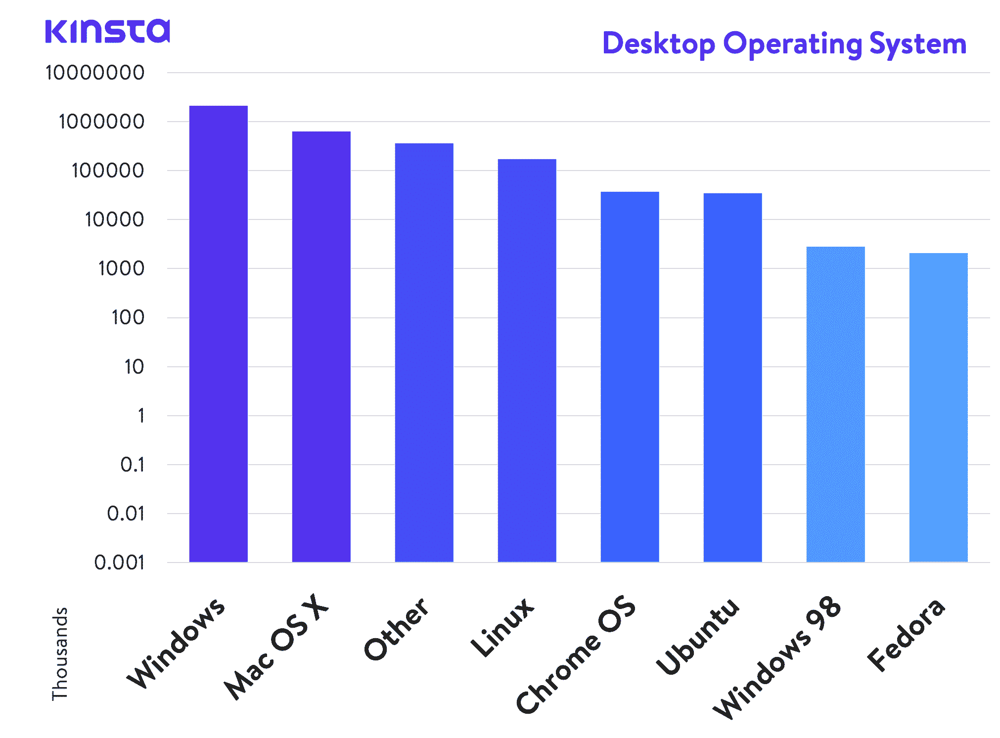](https://kinsta.com/?attachment_id=41309)

Desktop Operating System (click to view larger)

奇怪的是，我们仍然看到一些来自 Windows 98 的请求。😳但是请记住，您必须对`user-agent`数据持保留态度，因为它可能是伪造的。但这也是一个重要的提醒，许多发展中国家和企业仍在运行旧的操作系统。不是每个人都有全新的 MacBook Pro。

#### 移动的📱

接下来，我们根据移动操作系统的类型查看了来自`user-agent`的 31 亿多个请求。

*   监督办的 1，610，093，701 项请求
*   来自 Android 的 1，440，006，814 个请求
*   25，356，278 次其他请求
*   来自 Windows 的 15，936，471 个请求
*   来自 Linux 的 4，982，630 个请求
*   来自 Firefox 操作系统的 1，887，653 个请求
*   来自 Tizen 的 851，237 次请求
*   来自黑莓操作系统的 552，422 次请求
*   来自 Symbian 操作系统的 250，183 个请求
*   来自 Kindle 的 82，611 个请求

虽然 Windows 正在赢得桌面操作系统之战，但 iOS 是冲击 Kinsta 托管网站的最常用的移动操作系统。Android 紧随其后。人们确实喜欢他们的 iPhones。😉

[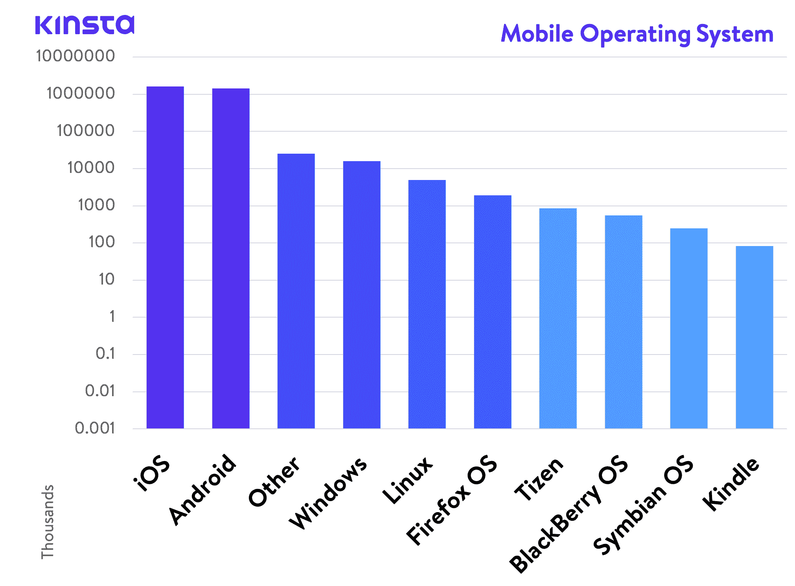](https://kinsta.com/wp-content/uploads/2019/02/mobile-operating-system-1-1.png)

Mobile Operating System (click to view larger)

### HTTP vs HTTPS🔒

然后我们观察有多少网站通过 HTTP 和 HTTPS 提供服务。

*   来自 HTTP 的 835，157，594 次请求
*   HTTPS 提出的 5 659 842 406 项请求

如你所见， **87%来自 Kinsta 网站的请求都是通过 HTTPS** 发出的。根据 W3Techs 的数据，只有 [48.2%的网站](https://w3techs.com/technologies/details/ce-httpsdefault/all/all)在使用 HTTPS 协议。我们很高兴地看到，在金斯塔的比例远远高于平均水平！👏当然，这部分要归功于 Let's Encrypt，因为 SSL 证书现在是免费的。Kinsta 客户端可以通过简单的点击[安装 SSL 证书](https://kinsta.com/help/how-to-install-ssl-certificate/#free-ssl)(以下是如何[在 WooCommerce](https://kinsta.com/knowledgebase/woocommerce-ssl/) 上安装 SSL 证书)！

[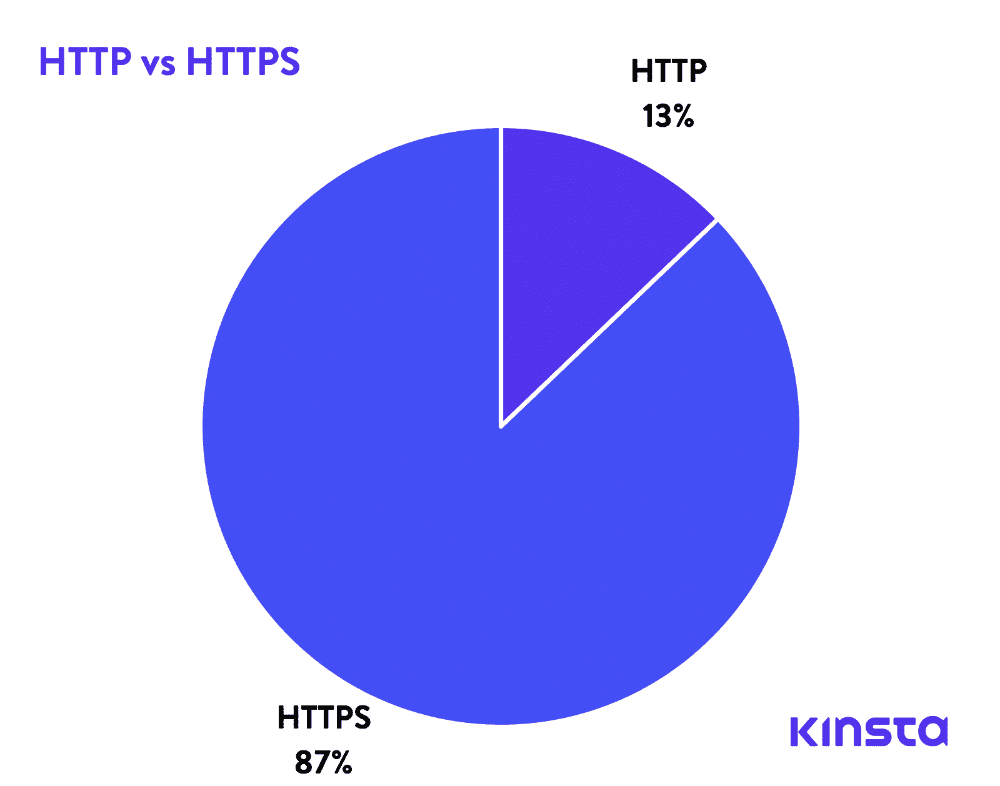](https://kinsta.com/wp-content/uploads/2019/02/http-vs-https-1.png)

HTTP vs HTTPS (click to view larger)

[Over 87% of all requests from sites hosted at Kinsta are running over HTTPS. Here's to a more secure web! 🔒Click to Tweet](https://twitter.com/intent/tweet?url=https%3A%2F%2Fbit.ly%2F38sObev&via=kinsta&text=Over+87%25+of+all+requests+from+sites+hosted+at+Kinsta+are+running+over+HTTPS.+Here%27s+to+a+more+secure+web%21+%F0%9F%94%92&hashtags=HTTPS%2Cwebsec)

### www 与非 www

我们很想知道有多少网站运行 www 而非 www，所以我们查看了数据。

*   来自 www 的 2，764，257，683 次请求
*   3，730，742，317 次来自非 www 的请求

如你所见， **57%的 Kinsta 网站运行非 www** 。

使用 www 作为你的域名的一部分曾经是过去的标准。但现在这种情况不一定是真的了。即使我们在金斯塔这里也不用 www。你仍然可能看到 www 被大量使用的一个原因是，在使用多年后改变它可能是复杂的，并会引起问题。所以很多老品牌只是继续使用它。

[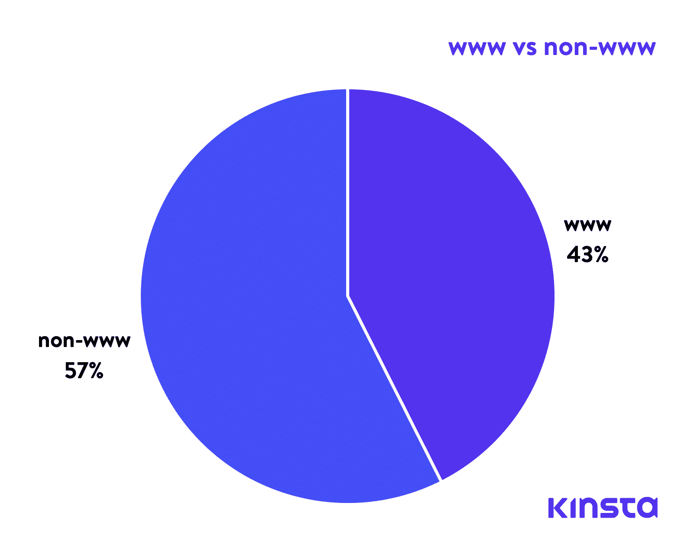](https://kinsta.com/wp-content/uploads/2019/02/www-vs-non-www-1.png)

www vs non-www (click to view larger)

拥有大量流量的大公司想要使用 www 的另一个原因是由于 DNS。从技术上讲，裸域(非 www)不能使用 CNAME 记录来为故障转移重定向流量。然而，这个问题有[的变通办法](http://serverfault.com/a/408026)。

所以当涉及到 www 与非 www 时，更多的是个人偏好的问题。也许你更喜欢较短的 URL，在这种情况下，你可以使用非 www。请记住，无论您选择哪个版本，您都可以设置重定向，以便可以访问每个版本。例如，如果你访问 www.kinsta.com，它只是重定向到 kinsta.com。

### 社交媒体流量

然后我们观察哪些社交媒体网络发送的流量最大。注意:这只是前 7 名。

*   脸书提出的 45，358，077 项请求
*   来自 Pinterest 的 7，789，013 个请求
*   来自 Instagram 的 1，971，578 次请求
*   来自 YouTube 的 986，708 次请求
*   LinkedIn 的 434，462 次请求
*   来自 Reddit 的 379，516 个请求
*   来自推特的 113 885 次请求

如你所见，**脸书几乎统治了社交媒体游戏**,发送了 79.5%的请求。Pinterest 以 13.7%位居第二。如果你还没有尝试过 Pinterest，并且有一项业务可能会在那里很好地运作，这绝对是值得一试的。

[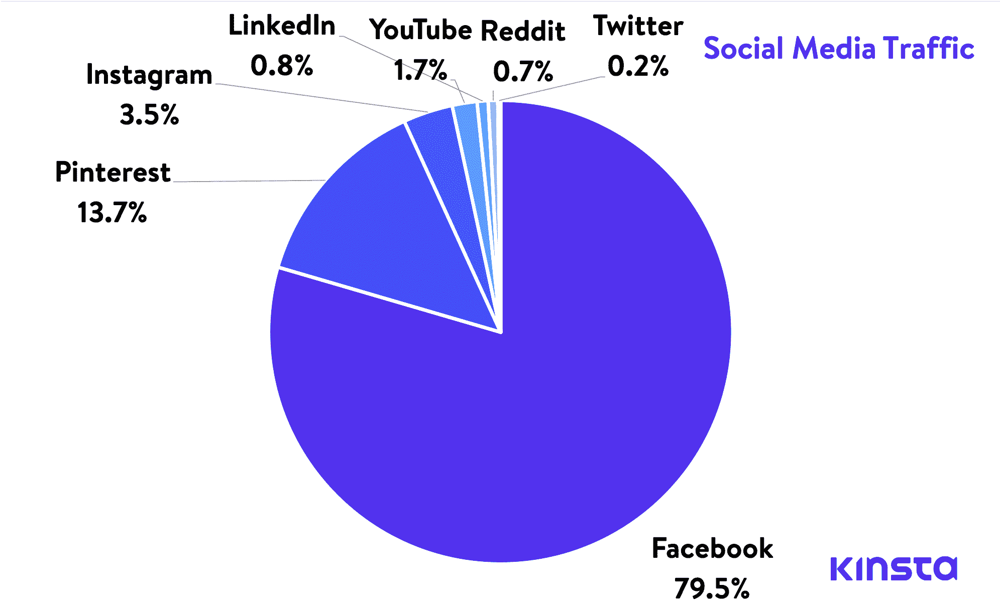](https://kinsta.com/?attachment_id=41437)

Social media traffic (click to view larger)

### 响应代码

HTTP 状态码，也被称为响应码，就像是来自 web 服务器的一个短消息，被钉在网页的顶部。它实际上不是网页的一部分。相反，它是来自服务器的一条消息，让您知道当服务器收到查看页面的请求时事情是如何进行的。

如果你是 Kinsta 的客户，你可以在 [MyKinsta Analytics](https://kinsta.com/help/mykinsta-analytics/#response-analysis) 中查看与你网站的响应代码相关的各种图表和数据。

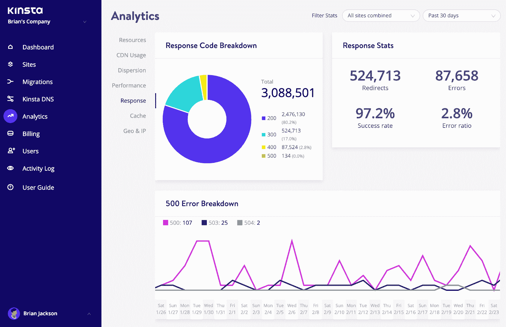

Response codes in MyKinsta Analytics

我们很想知道哪个响应代码返回的最多，所以我们查看了数据。

#### 200 个响应代码

**2xx** 当服务器成功接收、理解并处理浏览器请求时，返回成功代码。在超过 56 亿个 2xx 响应代码中，下面是分布情况。

*   5，612，645，073 个请求返回 200 个
*   464，366 个请求返回 201 个
*   176，325 个请求返回 202 个
*   6，891，596 个请求返回 204 个
*   13，840，463 个请求返回 206 个
*   428 个请求返回 278 个

您可以看到返回最多的是 200 响应代码。这意味着**“一切正常。”**当网页或资源完全按照预期的方式运行时，代码就会被交付。

[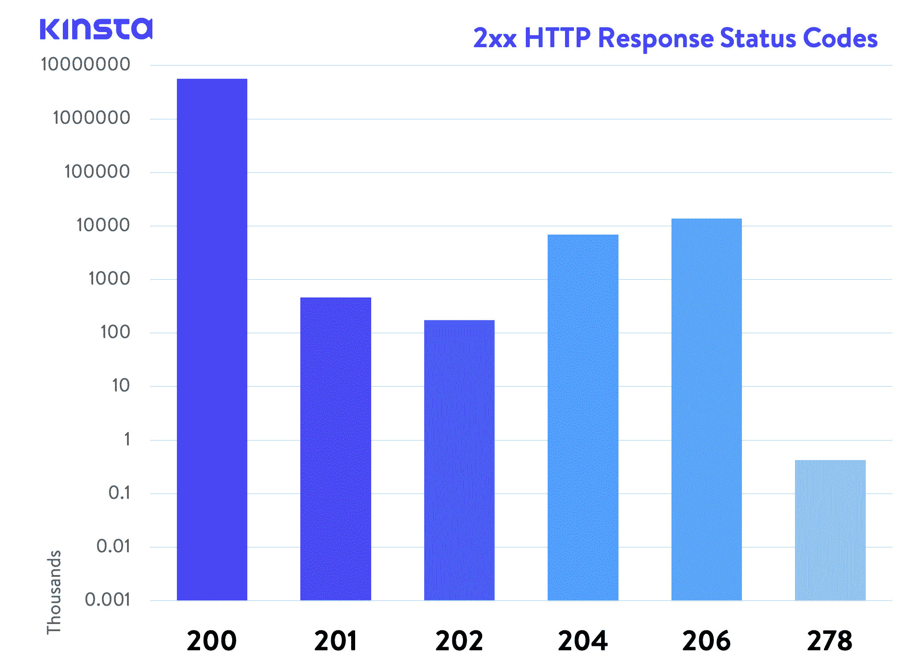](https://kinsta.com/wp-content/uploads/2019/02/2xx-http-response-status-codes-1.png)

2xx HTTP response status codes (click to view larger)

#### 300 个响应代码

当请求的资源被新资源替代时，返回 [**3xx** 重定向代码](https://kinsta.com/blog/http-status-codes/#300-status-codes)。在 36 亿多个 3xx 响应代码中，下面是分布情况。

## 注册订阅时事通讯

### 想知道我们是怎么让流量增长超过 1000%的吗？

加入 20，000 多名获得我们每周时事通讯和内部消息的人的行列吧！

[Subscribe Now](#newsletter)

*   239，992，263 个请求返回 301 个
*   30，003，302 个请求返回 [302 个](https://kinsta.com/blog/http-302/)
*   39，154 个请求返回 303 个
*   返回 91，379，063 个请求 [304 个](https://kinsta.com/knowledgebase/http-304/)
*   1，212，079 个请求被返回 [307 个](https://kinsta.com/knowledgebase/307-redirect/)
*   5 076 个请求返回 308 个

您可以看到返回最多的是 301 响应代码。这意味着**“请求的资源已经被永久移动。”**当网页或资源被一个不同的资源永久替换时，该代码被发送。

[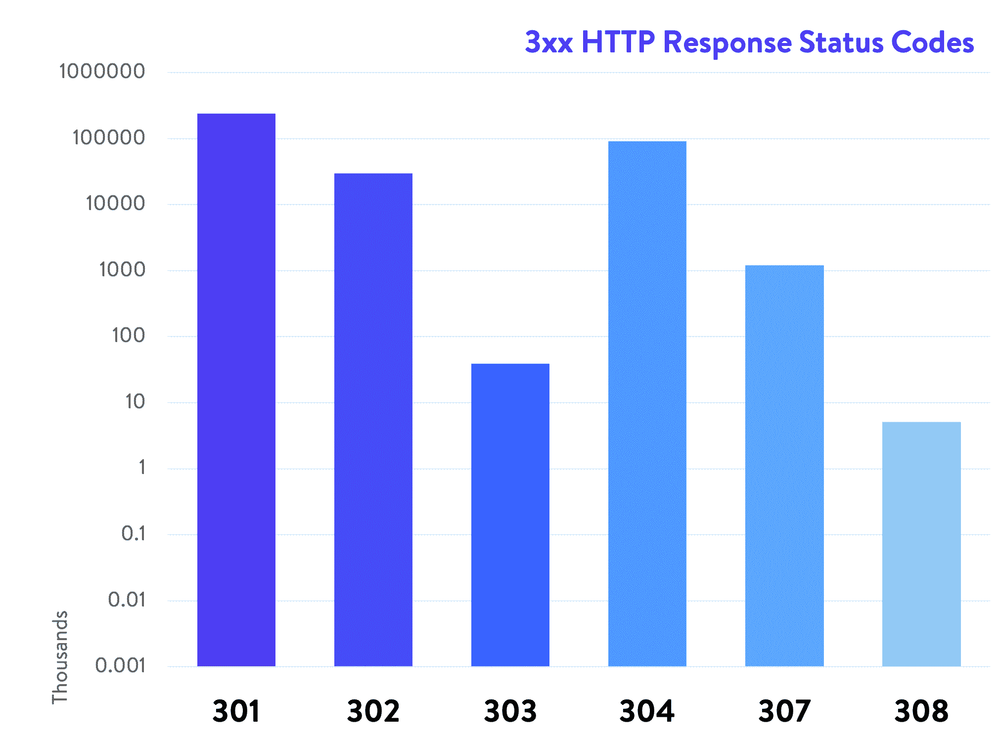](https://kinsta.com/wp-content/uploads/2019/02/3xx-http-response-status-codes-1.png)

3xx HTTP response status codes (click to view larger)

不足为奇的是，在 3xx 响应代码中，301 是最常见的一个，因为它用于 SEO 目的的永久 [URL 重定向](https://kinsta.com/help/redirect-rules/)。

如果您是 Kinsta 的客户，您可以使用 MyKinsta 中的[重定向工具](https://kinsta.com/help/redirect-rules/)轻松添加您需要的重定向。它支持正则表达式，性能更好，因为重定向是在服务器级添加的，你不再需要 WordPress 重定向插件。

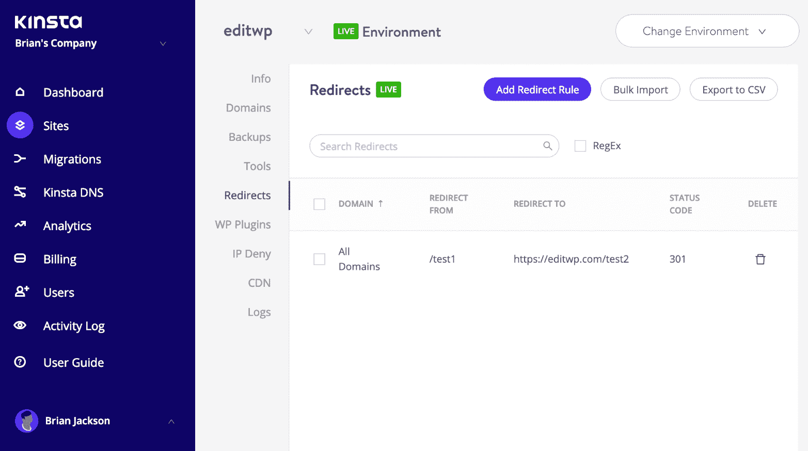

WordPress redirect tool

#### [400 个响应代码](https://kinsta.com/blog/http-status-codes/#400-status-codes)

**4xx** 响应代码是客户端错误代码，表示请求有问题。在超过 48 亿个 4xx 响应代码中，下面是分布情况。

*   14，783，009 个请求返回 [400 个](https://kinsta.com/knowledgebase/400-bad-request/)
*   1，311，362 个请求被返回 [401 个](https://kinsta.com/knowledgebase/401-error/)
*   10，095 个请求返回 402 个
*   2，8139，689 个请求被返回 [403 个](https://kinsta.com/blog/403-forbidden-error/)
*   返回 407，692，910 个请求 [404](https://kinsta.com/blog/error-404-not-found/)
*   5，301，730 个请求被返回 [405](https://kinsta.com/blog/405-method-not-allowed-error/)
*   返回的 8946 个请求 [406 个](https://kinsta.com/blog/406-error/)
*   90，330 个请求返回了 409 个
*   319，074 个请求返回 410 个
*   375，309 个请求返回 412 个
*   84 个请求返回 [413 个](https://kinsta.com/knowledgebase/413-request-entity-too-large-error/)
*   15，506 个请求被返回 [414 个](https://kinsta.com/knowledgebase/414-request-uri-too-large/)
*   1，190 个请求返回 415 个
*   1，824 个请求返回 416 个
*   134 个请求返回 418 个
*   返回了 2 个请求 419
*   32，976 个请求返回 422 个
*   退回的 2 个请求 423
*   返回了 23，467，660 个请求 [429 个](https://kinsta.com/knowledgebase/429-too-many-requests/)
*   529 个请求返回 444 个
*   4，391，165 个请求返回了 499 个

您可以看到返回最多的是 404 响应代码。这意味着**“未找到请求的资源。”**最常见的错误信息。这个代码意味着请求的资源不存在，并且服务器不知道它是否曾经存在过。

[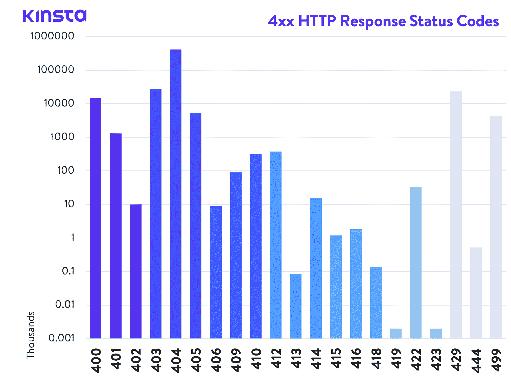](https://kinsta.com/wp-content/uploads/2019/02/4xx-http-response-status-codes-1.png)

4xx HTTP response status codes (click to view larger)

我们认为 404 响应代码是最高的并不奇怪。这仅仅是因为这么多的 WordPress 网站[上有断开的链接](https://kinsta.com/blog/broken-links/)。很多时候，WordPress 网站的所有者只是跟不上变化，或者不知道如何正确地检查和修复这些变化。查看我们关于[如何修复 404 错误](https://kinsta.com/blog/error-404-not-found/)的深入教程。

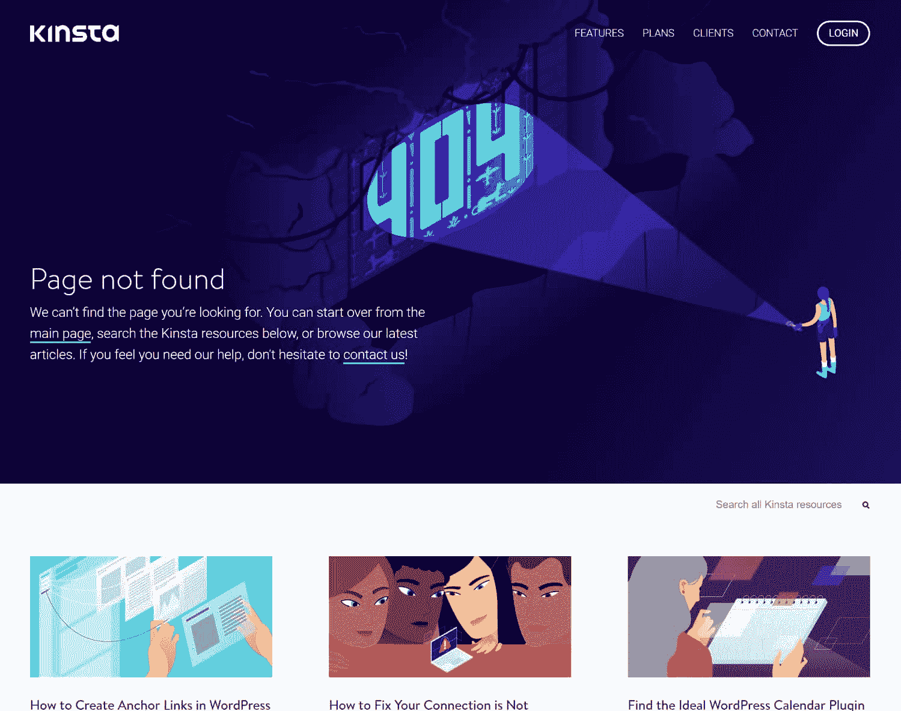

Kinsta 404 page

除了可用性之外，这些错误糟糕的另一个原因是许多 404 页面非常耗费资源，这会影响性能。对于大型网站，你会希望避免沉重的 404 页面。创建一个[简单的 404 模板](https://codex.wordpress.org/Creating_an_Error_404_Page)，如果可能的话，避免进一步查询[数据库](https://kinsta.com/knowledgebase/wordpress-database/)。

#### 500 响应代码

一个 **500** 服务器错误代码表示请求被接受，但是服务器上的一个错误阻止了请求的实现。这是 80 亿个请求的分布情况。

*   3，521，528 个请求返回 500，占所有请求的. 04%。

这意味着**“服务器出错，请求无法完成。”**一个普通代码，简单地表示“内部服务器错误”。服务器出错，请求的资源未送达。

这种代码通常是由第三方插件、有故障的 PHP，甚至是数据库连接中断而产生的。查看我们的教程，了解如何[修复建立数据库连接的错误](https://kinsta.com/blog/error-establishing-a-database-connection/)以及解决 [500 内部服务器错误](https://kinsta.com/blog/500-internal-server-error/)的其他方法。

500 HTTP response status codes (click to view larger)

我们喜欢 WordPress 的一点是有[成千上万令人惊奇的插件](https://kinsta.com/best-wordpress-plugins/)可供选择。然而，它们通常也是导致最多 500 个错误的原因之一。

### 搜索引擎爬虫

还记得我们在本文开头看到的“来自其他事物的超过 15 亿次请求”吗？然后我们看了搜索引擎爬虫的分布。

*   来自 Google ( [Googlebot](https://support.google.com/webmasters/answer/182072?hl=en) )的 296，138，088 个请求
*   来自 Bing ( [Bingbot](https://www.bing.com/webmaster/help/how-to-verify-bingbot-3905dc26) )的 202，089，312 个请求
*   来自雅虎的 5147672 个请求
*   来自 Yandex (yandex.ru、yandex.ru 或[yandex.com](https://yandex.com/support/webmaster/robot-workings/check-yandex-robots.xml))的 32，607，911 次请求
*   来自 DuckDuckGo ( [DuckDuckGo](https://duckduckgo.com/duckduckbot) )的 4，096，169 个请求
*   来自百度( [Baiduspider](http://help.baidu.com/question?prod_en=master&class=476&id=3001) )的 14，685，230 个请求

如你所见， **Google 是 Kinsta 网站的头号搜索引擎爬虫**。这一点也不奇怪，因为谷歌是目前网络上最大的搜索引擎(尽管[不是唯一的](https://kinsta.com/blog/alternative-search-engines/))。根据 statcounter 的数据，必应仅[保持着 2.4%](http://gs.statcounter.com/search-engine-market-share) 的搜索引擎市场份额。

事实上，36%或 2 亿以上的请求来自 Bing，这意味着他们仍在索引大量数据，甚至可能以更频繁的速度爬行。换句话说，仅仅因为 Bing 不流行，并不意味着它不索引和抓取大量数据！

Struggling with downtime and WordPress problems? Kinsta is the hosting solution designed to save you time! [Check out our features](https://kinsta.com/features/)

[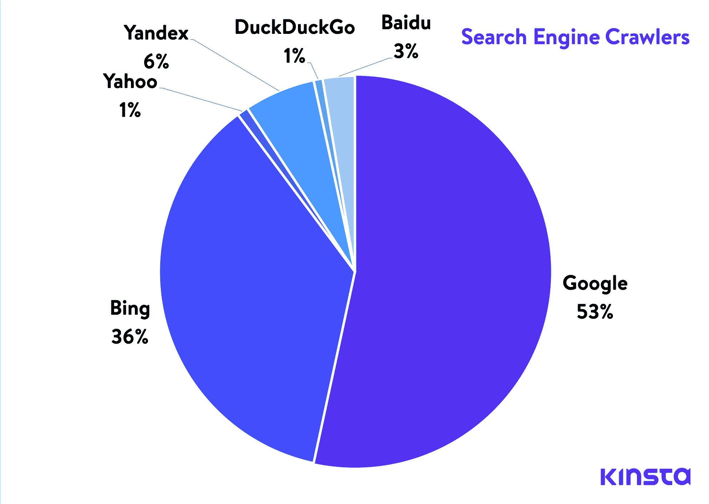](https://kinsta.com/wp-content/uploads/2019/02/search-engine-crawlers-1-1.png)

Search Engine Crawlers (click to view larger)

### 静态文件

我们很好奇，想看看 Kinsta 托管的 WordPress 站点请求最多的是哪种文件类型。这是结果。

*   1，236，061，584 次对`.js`文件的请求
*   677，593，186 次对`.css`文件的请求
*   对`.json`文件的 14，994，575 次请求
*   对`.pac`文件的 14，481，137 次请求
*   13，407，382 次对`.xml`文件的请求
*   对`.html`文件的 12，601，551 次请求
*   6，502，068 次对`.htm`文件的请求
*   5，726，959 次对`.pdf`文件的请求
*   4，475，057 次对`.txt`文件的请求
*   1，526，141 次对`.webmanifest`文件的请求
*   1，383，469 次对`.conf`文件的请求
*   1，070，029，306 次对`.jpg`文件的请求
*   718，437，582 个对`.png`文件的请求
*   对`.svg`文件的 114，168，603 次请求
*   89，211，616 次对`.ico`文件的请求
*   39，439，970 次对`.gif`文件的请求
*   对`.jpeg`文件的 21，371，010 次请求
*   2，100，825 次对`.webp`文件的请求
*   1，088，319 次对`.cur`文件的请求
*   8，221，104 个对`.mp4`文件的请求
*   2，623，488 次对`.mp3`文件的请求
*   49，086，037 次对`.woff2`文件的请求
*   44，395，929 个对`.woff`文件的请求
*   对`.ttf`文件的 16，045，404 次请求
*   6，395，202 次对`.eot`文件的请求
*   3，438，946 次对`.otf`文件的请求

**JavaScript 文件(`.js`)是 Kinsta 托管网站请求最多的文件类型**。虽然大多数结果并不令人惊讶，但有趣的是看到超过 200 万次对`.webp`文件(谷歌新的较小图像格式)的请求，以及`.jpg`如何以超过 10 亿次的请求超过`.jpeg`，而第二名仅超过 2100 万次(在此阅读原因: [jpg vs jpeg](https://kinsta.com/blog/jpg-vs-jpeg/) )。Kinsta 支持 [WebP](https://kinsta.com/blog/webp/) ，我们很快会有更多关于这方面的信息发布！😉

[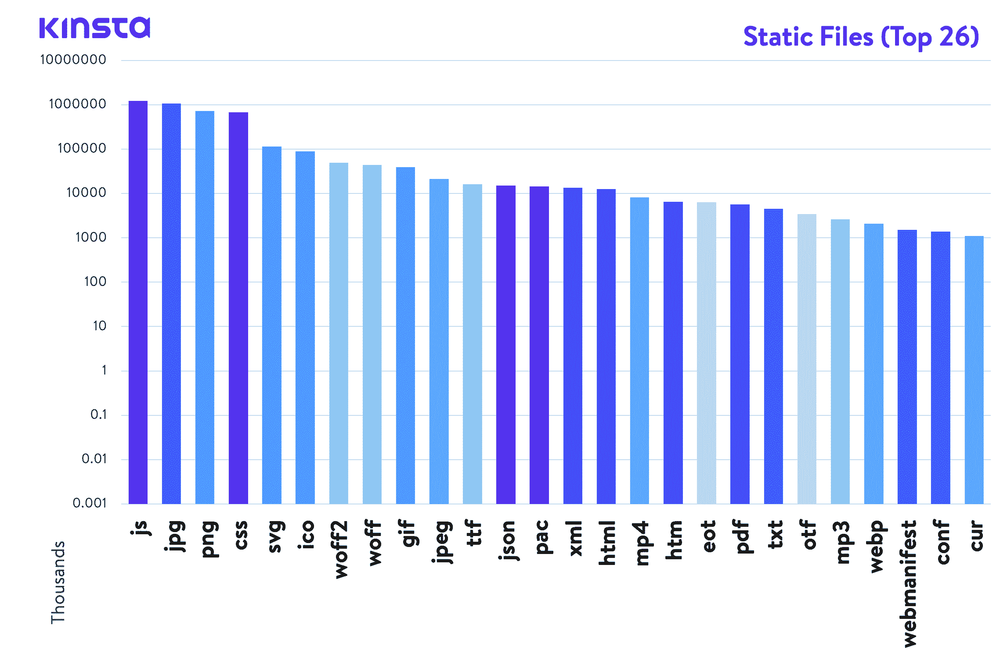](https://kinsta.com/wp-content/uploads/2019/02/static-files-1.png)

Static files (click to view larger)

### 搜索引擎优化工具(爬虫和机器人)

接下来，我们想看看来自 24 亿多搜索引擎优化爬虫和机器人的请求。这些工具不断地访问 WordPress 站点，为它们的数据库收集反向链接数据，并运行 SEO 审计工具。

*   来自 Moz 的 26，691，247 次请求
*   来自人权参考网站的 86，049，707 项请求
*   尖叫青蛙的 2690306 次请求
*   来自 SEMrush 的 98，014，939 次请求
*   来自 Majestic 的 51，550，801 次请求
*   来自 cognitiveSEO 的 54，046 次请求

**SEMrush 对 Kinsta 托管的网站有最多的请求**,数量高达 9800 多万。Ahrefs 以 8600 多万次请求紧随其后。最让我们吃惊的统计数据是 Moz 有多低。我们本以为会有更多。然而，请记住这与他们的索引大小无关。这可能是他们只是爬得更有效率。

许多人没有意识到这些类型的搜索引擎优化工具对他们网站的冲击有多大。答案是，很多！请记住，如果您是 Kinsta 的客户，我们不会将这些计入您的付费访问量。

SEO tools (click to view larger)

Ahrefs 是我们最喜欢的搜索引擎优化工具之一！看看我们如何用它来清理负面的搜索引擎优化攻击。

### IP 地理位置统计

接下来，我们很好奇大多数请求来自哪里，所以我们提取了数据。

*   美国的 3，009，603，588 项请求
*   联合王国的 338 547 518 项请求
*   加拿大的 272，523，573 项请求
*   印度提出的 229，216，018 项请求
*   德国提出的 187，608，219 项请求
*   澳大利亚提出的 183 092 752 项请求
*   印度尼西亚提出的 136 572 768 项请求
*   133，160，302 项来自法国的请求
*   瑞典提出了 122，017，186 项请求
*   爱尔兰提出的 107，672，467 项请求
*   荷兰的 95，056，260 项请求
*   巴西的 81，944，390 项请求
*   希腊提出 79 022 194 项请求
*   比利时提出 67 619 795 项请求
*   阿根廷提出的 60 189 992 项请求
*   墨西哥提出的 5，790，0871 项请求
*   来自西班牙的 57，405，068 项请求
*   来自中国的 55，546，628 项请求
*   意大利提出了 52 991 930 项请求
*   新加坡提出的 48，076，976 项请求

可能不会让任何人感到惊讶，来自 Kinsta 托管网站的大多数请求来自美国，超过 30 亿！

虽然我们的客户遍布世界各地，但我们实际上对前 19 名的请求分布如此均匀感到惊讶。

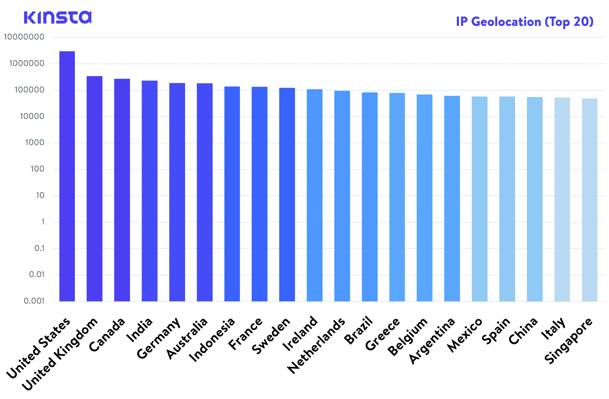

## 缓存性能日志统计

在总共 130 亿个日志条目中，我们分析了 50 亿个缓存性能日志。这些统计数据让我们深入了解 WordPress 站点实际上是如何表现的，比如一个站点是否从缓存中提供服务。请记住，一般来说，**您希望您的站点尽可能多地从缓存中提供内容**。这将确保您获得闪电般的加载时间！

众所周知，会员和电子商务网站有很多不可缓存的内容，这就是为什么你不能像对待一个有很多静态内容的博客一样对待这些类型的网站。查看我们关于托管 WordPress 会员网站的[注意事项的深度文章。](https://kinsta.com/blog/hosting-wordpress-membership-sites/)

### 缓存统计

每当 Kinsta 的一个站点被提交给浏览器时，它都包含一个`x-kinsta-cache`响应头来显示缓存是如何被提交的。你可以用 Pingdom 或者 Chrome DevTools 这样的工具看到这一点。一个“命中”意味着这个请求是由 [WordPress 缓存](https://kinsta.com/blog/wordpress-cache/)提供的。这通常是您想要看到的。

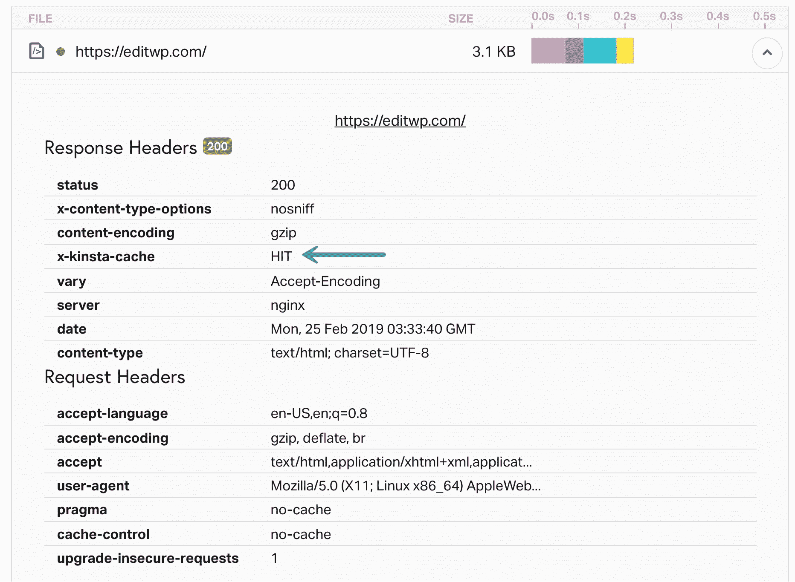

Cache HIT response header

因此，我们提取了所有数据，以全面了解缓存交付的状态。

*   1，795，217，266 个桌面请求的响应标题为 HIT
*   1，070，119，048 个桌面请求的响应标头为 BYPASS
*   457，393，894 个桌面请求的响应标头为未命中
*   118，778，823 个桌面请求的响应标头为过期
*   522，774 个桌面请求具有过时的响应标头
*   404，497，162 个移动请求的响应标头为 HIT
*   128，540，590 个请求的响应标头为 BYPASS
*   120，687，202 个请求的响应标头为未命中
*   41，951，398 个请求的响应标头为过期
*   93，680 个请求具有过时的响应标头

结果正是我们想要的和应该有的。最大数量的**个请求都来自缓存(命中响应)**，超过 17 亿。这太棒了！第二高的是旁路。这些请求通常包括一个 [WordPress 登录页面](https://kinsta.com/blog/wordpress-login-url/)，一个电子商务网站的结账页面等。WordPress 网站的某些区域没有被故意缓存以确保功能性。

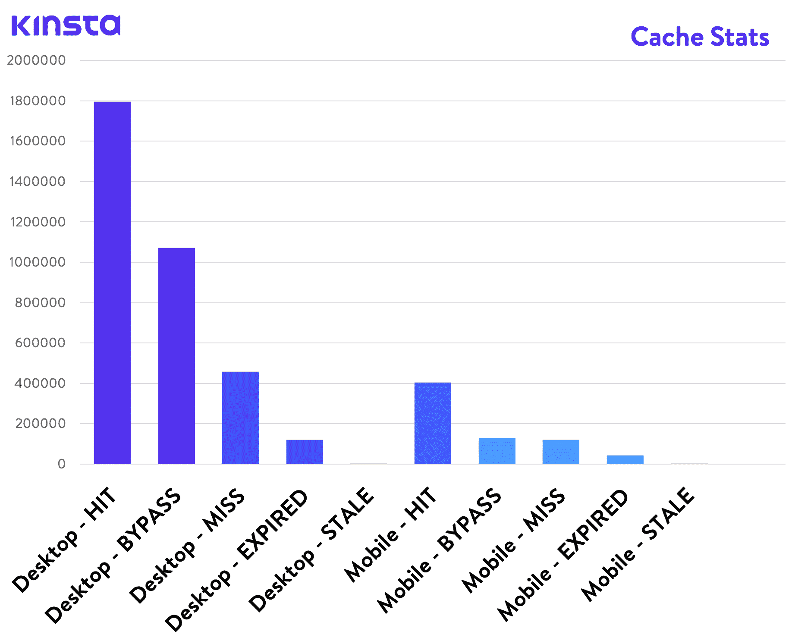

Cache stats (click to view larger)

未命中意味着[网站缓存](https://kinsta.com/topic/website-cache/)根本不存在。例如，当你[清除你网站上的缓存](https://kinsta.com/blog/wordpress-clear-cache/)时，缓存必须重建。当访问者第一次点击页面或再次发帖时，就会发生这种情况。之后的后续访问由缓存提供服务，记录一次命中。

手机版几乎完全遵循了同样的模式。

### Cookie 类别

你有没有想过主机如何决定网站的哪些区域不应该被缓存？在很多情况下，答案是饼干。🍪

例如，在 [WooCommerce](https://kinsta.com/woocommerce-hosting/) 和 [Easy Digital Download](https://kinsta.com/blog/easy-digital-downloads/) 网站上，当用户向购物车中添加商品时，`woocommerce_items_in_cart cookie`和`edd_items_in_cart`等 cookies 会被放入用户的浏览器中。当在 Kinsta 平台上检测到这些 cookies 时，会自动绕过缓存，以确保顺利和同步的结账过程。有不同种类的 cookies 用于绕过缓存，下面是我们查询的几个。

*   3，953，049，476 个桌面请求包含杂项 cookie
*   117，848，189 个桌面请求包含购物车 cookie 中的 EDD 或 WC 项目
*   34，179，376 个桌面请求包含记录在 cookie 中的 WP
*   1，353，672 个桌面请求包含评论作者/ wp-postpass cookie
*   862，200，418 个移动请求包含杂项 cookie
*   13，772，183 个移动请求包含购物车 cookie 中的 EDD 或 WC 项目
*   12，579，820 个移动请求包含记录在 cookie 中的 WP
*   274，747 个移动请求包含评论作者/ wp-postpass cookie

超过 39 亿的第一类请求是来自杂项 cookie 的请求。这是什么意思？通常，这是一个第三方插件，包含自己命名的 cookie 来绕过缓存。

有趣的一点是，EDD/WC 购物车的 cookie 比实际登录的 cookie 要多。这很可能是因为我们在 Kinsta 托管的很多 WordPress 站点本质上都是电子商务。另外，你们中的大多数人可能不会经常登录你的 WordPress 站点(你可能已经登录了一天的大部分时间)。但是总有顾客来购物！

[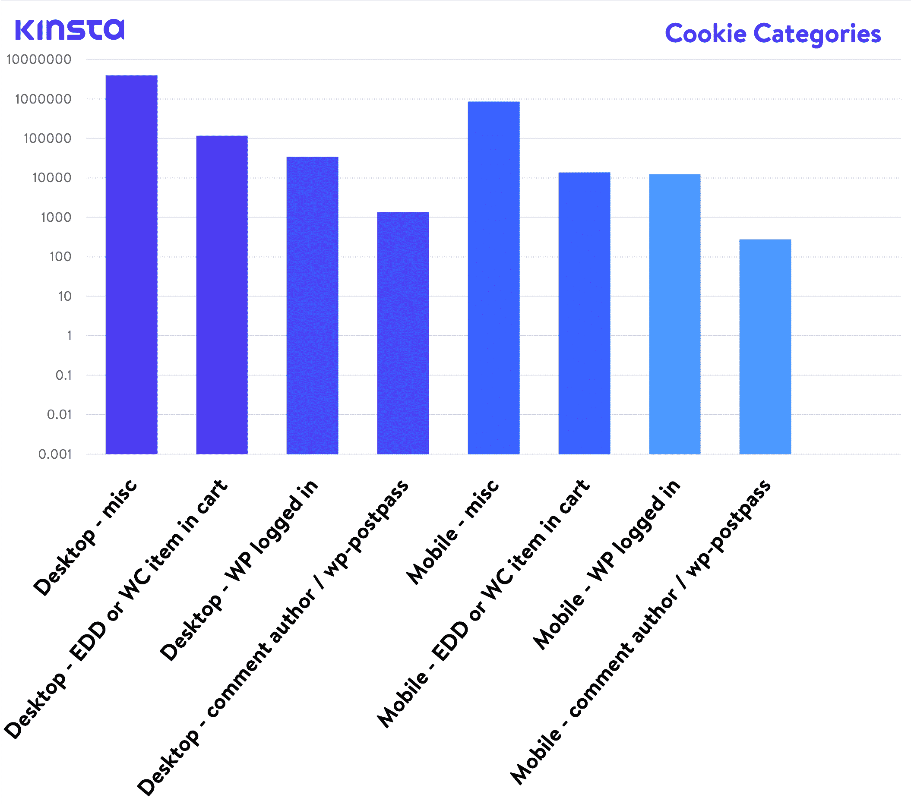](https://kinsta.com/?attachment_id=41423)

Cookie categories (click to view larger)

## PHP 引擎

根据官方的 [WordPress 统计数据](https://wordpress.org/about/stats/)页面，超过 **57%的 WordPress 用户是仍在使用 PHP 5.6 或更低版本**的 **。这太吓人了！这不仅从安全角度来看是不好的，还因为仍然有很大一部分 WordPress 站点没有利用 PHP 7 的额外性能增强。**

我们认为看到 Kinsta 正在使用的 [PHP 版本](https://kinsta.com/blog/php-versions/)的分布也是很有趣的。这是我们的发现。

如果我们看看在 Kinsta 上运行的站点，超过 75%的 WordPress 站点使用 PHP 7.2 或更高版本。这些是我们喜欢看到的数据。👏

[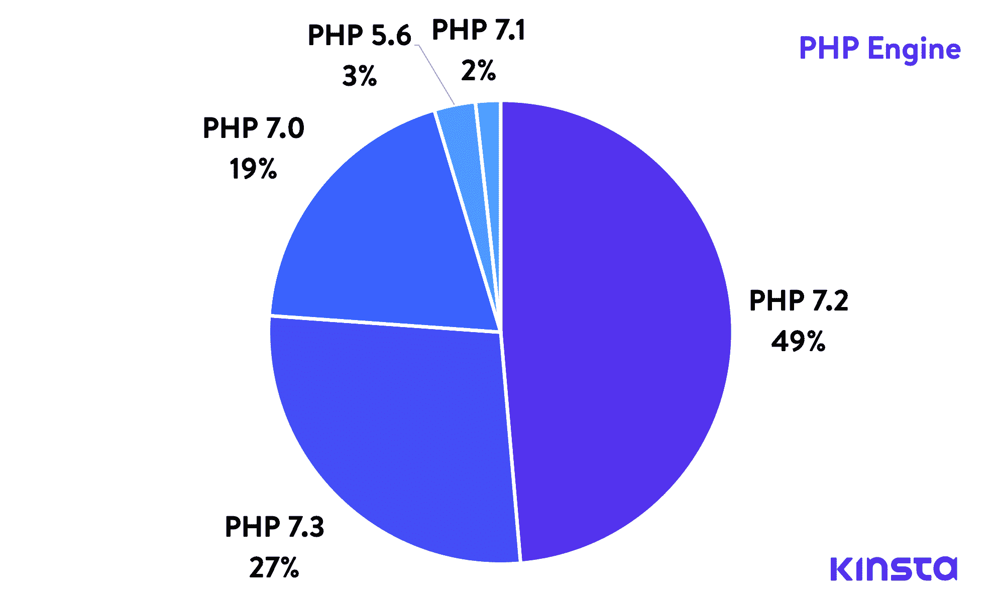](https://kinsta.com/?attachment_id=41409)

PHP engine (click to view larger)

根据我们的发现(参见我们的 [PHP 基准测试](https://kinsta.com/blog/php-benchmarks/))，PHP 7.3 平均比 PHP 7.2 快 **9%。如果将 PHP 7.3 与 PHP 5.6 进行比较，它每秒可以处理几乎 3 倍的请求(事务)!**

如果你是一个 Kinsta 客户，你可以在 MyKinsta 仪表板的 Tools 下点击一下，轻松地[修改 PHP 版本](https://kinsta.com/knowledgebase/how-to-update-php-in-wordpress/)。

Change to PHP 7.3

[Over 75% of WordPress sites at Kinsta are using PHP 7.2 or higher. Come join the fast crowd! 🚀Click to Tweet](https://twitter.com/intent/tweet?url=https%3A%2F%2Fbit.ly%2F38sObev&via=kinsta&text=Over+75%25+of+WordPress+sites+at+Kinsta+are+using+PHP+7.2+or+higher.+Come+join+the+fast+crowd%21+%F0%9F%9A%80&hashtags=PHP%2Cwebperf)

## 摘要

从上面的数据中，我们可以总结出一些关于 Kinsta 网站的有趣的事情:

*   桌面浏览器相对于移动浏览器仍然被大量使用。尽管你可能会在网上读到手机正在接管(在很多地方都是如此)，但重要的是要记住，这可能因行业或细分市场而异。看数据，不要只假设移动是你所有客户所在的地方。我们建议查看您的谷歌分析移动设备数据，以了解您的电子商务交易和目标发生在哪里。
*   机器人、API 和搜索引擎爬虫占所有请求的 19%。每天攻击你的 WordPress 网站的机器人和爬虫数量惊人！来自这些的 15 亿次请求不是一个小数目。好消息是，如果你是 Kinsta 的客户，我们会尽最大努力过滤这些内容，确保它们不会被计入你的付费访问量。
*   微软 Edge 浏览器的使用比我们想象的要多。随着他们转向基于 Chromium 的浏览器并提供 Mac 版本，你可能会期待这款浏览器的市场份额会上升。
*   很多人都在用 iPhones！Safari 手机版是移动设备中使用频率最高的浏览器。
*   Windows 98 仍然在某个地方表现强劲。虽然`user-agent`可能是伪造的，但很难确切知道它有多准确。但最有可能的是，有些公司或发展中国家仍在使用 Windows 98。
*   HTTPS 在金斯塔的原力很强！我们非常兴奋地看到，87%的 Kinsta 网站都在 HTTPS 运营。开始加密吧！👏
*   已经 2019 年了，再也不需要 www 了。虽然拥有 www 有一些好处，但大多数好处并不适用于普通用户或企业。因此，让我们转向更短的 URL！
*   **脸书交通是一个庞然大物。然而，如果你有可能在 Pinterest 上开展业务，这绝对是一个值得一试的网络。**
*   **301 重定向和 404 错误(断链)无处不在**。这并不奇怪，但这是一个重要的提醒，要修复你的链接，不要忘记使用 301 重定向搜索引擎优化的目的。
*   会出现 500 个错误，这就是使用 WordPress 的乐趣。很多时候这些都是由于一个坏的插件，有故障的 PHP，或者数据库连接中断。
*   谷歌是王者，必应是爬虫女王。必应抓取你网站的次数可能比你想象的要多得多。
*   **JavaScript 是最受欢迎的文件，**但看到 WebP 慢慢崛起真是太棒了。
*   搜索引擎优化工具每天都会抓取你的网站。你认为 SEMrush 和 Ahrefs 还能通过什么方式获得那些花哨的反向链接数据？他们通过不断抓取你的网站来做到这一点。
*   有很多无法缓存的内容。许多 WordPress 网站都有绕过缓存以确保正常功能的请求。重要的是你要有一个高质量的[应用程序](https://kinsta.com/application-hosting/)、[数据库](https://kinsta.com/database-hosting/)和[管理的 WordPress 主机](https://kinsta.com/wordpress-hosting/)(像 Kinsta)来处理这些类型的请求。电子商务、会员和 LMS 网站应该与静态博客完全不同。
*   **超过 75%的 Kinsta 客户端正在利用 PHP 7.2 和 PHP 7.3** 。使用新版本的 PHP 是最简单的性能优化方法之一！

我们希望你喜欢所有这些统计数据！我们确实做到了。如果你好奇的话，我们用微软 Excel 生成了上面所有的图表。

有没有你想看的我们可能没有包括的统计数据？如果是这样，请在下面的评论中告诉我们，我们会尽力而为。

* * *

让你所有的[应用程序](https://kinsta.com/application-hosting/)、[数据库](https://kinsta.com/database-hosting/)和 [WordPress 网站](https://kinsta.com/wordpress-hosting/)在线并在一个屋檐下。我们功能丰富的高性能云平台包括:

*   在 MyKinsta 仪表盘中轻松设置和管理
*   24/7 专家支持
*   最好的谷歌云平台硬件和网络，由 Kubernetes 提供最大的可扩展性
*   面向速度和安全性的企业级 Cloudflare 集成
*   全球受众覆盖全球多达 35 个数据中心和 275 多个 pop

在第一个月使用托管的[应用程序或托管](https://kinsta.com/application-hosting/)的[数据库，您可以享受 20 美元的优惠，亲自测试一下。探索我们的](https://kinsta.com/database-hosting/)[计划](https://kinsta.com/plans/)或[与销售人员交谈](https://kinsta.com/contact-us/)以找到最适合您的方式。