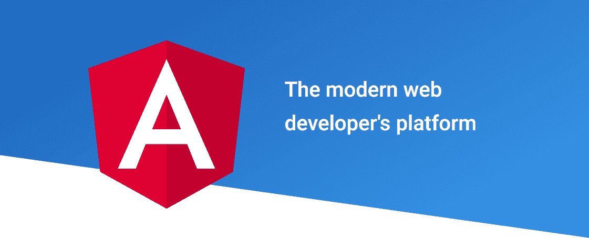
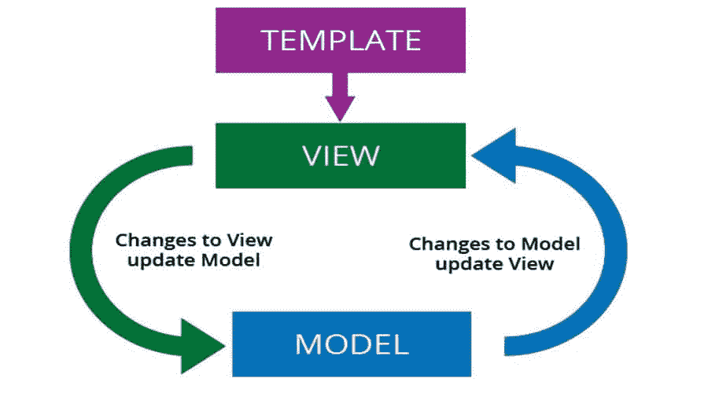
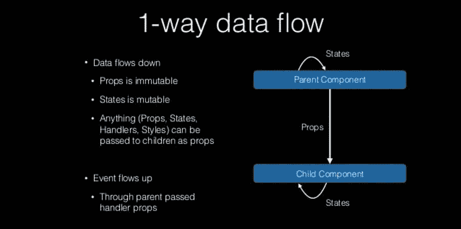
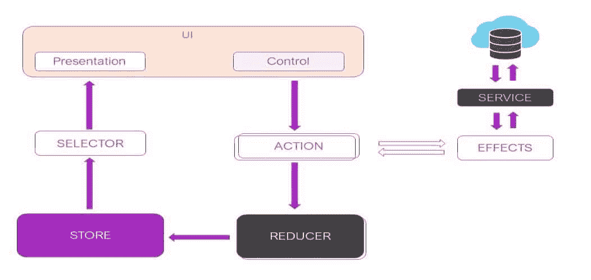
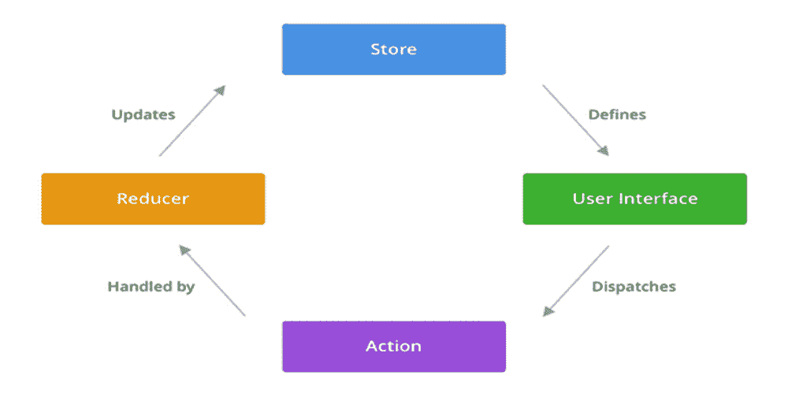
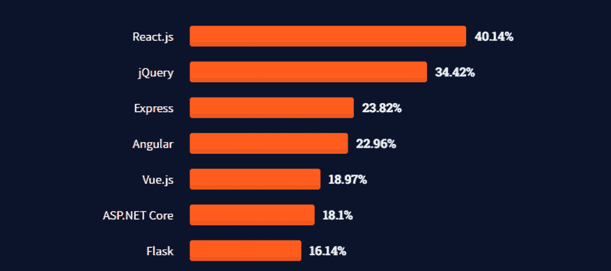

# 角度与反应:详细的并排比较

> 原文：<https://kinsta.com/blog/angular-vs-react/>

Angular 和 React 是强大而流行的 [JavaScript](https://kinsta.com/knowledgebase/what-is-javascript/) 资源，可以用来构建你能想到的任何前端项目。两者都有助于为 web 项目构建复杂而时髦的用户界面。因此，他们经常成为在线开发者社区的头条新闻。

有一个大问题:在 Angular 和 React 之间，你会为你的下一个项目选择哪一个？

它们都有许多相似和独特的特性，并且都非常适合在许多不同的环境下高效地创建项目。然而，在做出决定之前，你需要考虑其他变量，如预算、时间、效率、学习曲线等等。

我们将深入讨论 Angular 和 React 的特性和优势，引导您找到最适合自己的解决方案。

我们开始吧！

## 什么是有角？




棱角分明的标志。


[Angular](https://angular.io/) 是一个基于 TypeScript 的开源平台和 web 应用框架，由来自 [Google](https://kinsta.com/blog/google-workspace/) 的团队开发。该框架有助于使用 TypeScript 和 [HTML](https://kinsta.com/blog/html-vs-html5/) 创建单页面应用程序。如果你想为移动和网络构建应用程序，Angular 是你想要的技术。


[Angular vs React? 👀 This guide will help you pick the right option for your project 💥Click to Tweet](https://twitter.com/intent/tweet?url=https%3A%2F%2Fkinsta.com%2Fblog%2Fangular-vs-react%2F&via=kinsta&text=Angular+vs+React%3F+%F0%9F%91%80+This+guide+will+help+you+pick+the+right+option+for+your+project+%F0%9F%92%A5&hashtags=Angular%2CJavaScript)

与其他框架不同，Angular 提供双向数据绑定。这意味着，如果您更改输入框中的值，它将自动更新组件类的添加属性值。换句话说，它将在模型和视图之间创建实时、完美的数据同步。

你可能已经意识到了这个事实，但是这个领域的新开发人员可能会把 Angular 和 AngularJS 误认为是同一个东西:它们不是。

Angular 和 AngularJS 的核心区别在于，前者使用 TypeScript(JavaScript 的一个上标)作为核心，后者使用 [JavaScript](https://kinsta.com/blog/javascript-media-query/) 。实际上，Angular 更像是 AngularJS 的升级版。
T3】

## 为什么要用 Angular？

在 Angular 里，一切都发生在同一个引擎盖下。它提供了一个生态系统，允许你毫不费力地创建你的应用程序。模板、双向绑定、RESTful API 模块化、Ajax 处理、依赖注入等特性使您的应用程序开发变得简单而紧凑。

虽然我们将在特性部分详细讨论角特性，但这里有一些你应该考虑选择角特性的主要原因。

### 谷歌支持

使用 Angular 的首要优势是 Google。 [Google](https://kinsta.com/blog/google-pagespeed-insights/) 长期支持 Angular。这就是为什么它仍然在扩大有角度的生态系统。

你遇到的所有谷歌应用都使用 Angular 框架。随着对框架信心的增长，其他开发人员也找到了向经验丰富的专业人士学习的机会。

### 详细文件

Angular 提供了详细的文档来指导开发人员。而不是强迫你在不同的地方搜索，你可以在同一个地方找到你需要的所有解释。在大多数情况下，吸收全面的文档是学习语言最有效的方式(除了用代码练习)。

### 简化编码

Angular 承诺花在编码上的时间更少，并有助于创建令人厌烦的快速应用程序。与许多其他框架相比，TypeScript 帮助 Angular 在开发周期的早期阶段高效地识别错误并消除它们。

Angular 让你不用担心某样东西是组件、服务还是任何其他代码类型，因为它把它们组织成整洁、独立的盒子。然后它将它们作为模块引入。这些模块使构建应用程序的功能变得容易，将元素分成特性和可重用的部分。

此外，Angular 总体上提供了更清晰的编码。也就是说，更清晰的编码并不能确保更好的可读性。它仅仅意味着一个更加没有矛盾的环境。


## 谁用棱角分明？

今天，全球超过 500 家大公司都在使用 Angular。Angular 已经明确地把它的位置标在了流行榜的顶端。由于它的多样性，从软件行业到游戏行业，每个人都可以依赖这个框架。

使用 Angular 的顶级公司包括:

1.  谷歌
2.  [微软](https://kinsta.com/blog/microsoft-teams-vs-slack/)
3.  国际商用机器公司
4.  [PayPal](https://kinsta.com/blog/paypal-alternative/)
5.  向上工作
6.  德意志银行
7.  三星电子
8.  福布斯（美国出版及媒体集团）
9.  《卫报》
10.  摇滚明星游戏

现在你已经知道 Angular 是什么了，让我们来看看 React。

## 什么是反应？


反应过来的标志。


[React](https://reactjs.org/) 是由[脸书](https://kinsta.com/blog/facebook-statistics/)团队开发的开源 [JavaScript 库](https://kinsta.com/blog/javascript-libraries/)。React 通常用于从隔离的组件创建单页应用程序的用户界面。

它可以处理 web 和移动应用程序的视图层。因此，React 支持 web 和移动应用程序开发。这个灵活的框架也使得创建复杂的应用成为可能，如果你把它和其他支持库一起使用的话。

React 具有单向数据绑定，这意味着它的结构从父节点流向子节点。然而，对于双向数据绑定，React 提供了 LinkedStateMixin，它设置了通用的数据流循环模式。

在传统的数据流中，对于每个新的数据输入，必须重新加载整个页面才能查看更改。在 React 中，不需要重新加载。这是因为在接受新的数据更新时，React 不会像传统数据流那样创建任何额外的文档对象模型(DOM)。


## 为什么应该使用 React？

React 非常轻量级，而且学习和开始使用起来也更快。此外，React 允许在开发过程中使用第三方库。它还支持双向数据绑定过程。

以下是开始使用 React 的一些主要原因。

### 简单易学

React 相对容易学习和实现，因此企业可以很快进入状态。这个库是 SEO 友好的，它关注渲染速度。使用 React 的公司通常可以期待看到加载时间的减少和在搜索引擎结果中更高的排名。

### 简化编码

在 React 中，应用程序的客户端和服务器端可以有相似的代码。因此，任何使用 React 的网站都具有高速优势，这使得它对爬虫、用户和开发人员都很有吸引力。

此外，它很容易测试，因为 React 可以将视图视为特定状态的函数。

### 脸书支持

React 的一个绝佳优势就是脸书本身。一群个体开发者、特定社区和脸书自己维护着这个框架。

就像谷歌对 Angular 的评价一样，脸书对 React 持乐观态度。由于 React 具有更好的可访问性和使用性，它为新开发人员快速学习这个框架并向应用程序开发迈出成功的第一步提供了更广泛的可能性。

## 谁使用 React？

根据 [2018 年开发者生态系统状况调查](https://www.jetbrains.com/research/devecosystem-2018/javascript/)，全球 60%的开发者使用 React。同样，脸书拥有全球最大的活跃用户群之一，这得益于该公司在该平台的移动应用程序中使用了 React。

使用 React 的顶级公司包括:

1.  [脸书](https://kinsta.com/blog/facebook-marketing/)
2.  [Instagram](https://kinsta.com/blog/instagram-stats/)
3.  WhatsApp
4.  网飞
5.  雅虎
6.  纽约时报
7.  不调和
8.  Dropbox
9.  超级饮食
10.  亚特兰蒂斯人

## 角度与反应:深入比较

既然您已经很好地掌握了这两个 JavaScript 孩子能做什么，让我们来面对面地比较一下。

### 类似

Angular 和 React 之间的相似之处包括:

*   **架构:** Angular 和 React 都有基于组件的架构。这些组件可以在其他组件中重用，这使得它们可以无限地循环使用。值得注意的是，组件是 UI 的一部分。例如，组件可以是带有文本的登录对话框、密码字段或登录按钮。
*   **开源** **:** 都是[开源](https://kinsta.com/knowledgebase/open-source-web-hosting/)。因此，React 和 Angular 拥有大型开发人员社区，他们定期丰富资源。
*   **热门** **:** 开发者大多使用这两种技术来构建单页面应用程序。这表明你可以制作更快更好的数字解决方案的单页应用程序。
*   **开发** **环境** **:** Angular 和 React 用于开发手机或 web 应用的前端。
*   **渲染:** Angular 和 React 提供高效的客户端和服务器端渲染。
*   **性能:** Angular 和 React 提供相似的性能。区别大多取决于用户的视角。
*   **易于更新:** Angular 和 React 都提供易于更新的功能。Angular 使用 CLI，React 依赖外部库。

### 有用

Angular 和 React 都有利于前端开发者，考虑到各自的特长，这并不奇怪。小规模和大规模的应用程序都受益于它们的功能和灵活性，允许开发者帮助他们的创作充分发挥潜力。

以下是它们各自的一些用法。

#### 有角的

由于它在跨平台应用程序开发中非常有效，企业更喜欢 Angular 来构建跨平台应用程序，以减少开支。但同时，Angular 是一个非常复杂的平台。因此，掌握它需要更高的努力和经验。

所以，当你选择用 Angular 来构建你的项目时，老手们肯定会伸手去拿。该框架还提供了几个优势，使 web 应用程序更快、更高效。

通过 Angular 中的“差异加载”,浏览器可以加载更少的代码和聚合填充来加快速度。该框架的最新版本允许您创建两种类型的代码包——一种用于现代浏览器，另一种用于旧浏览器。

React 提供了一个内置的高级依赖注入服务，这对于解决生产力因素和加速开发过程非常有用。因此，用户可以通过改进的软件设计功能享受更加简化的体验。

当你创建一个大的应用程序时，代码的可维护性成为一个重要的问题。在 Angular 中，这是一件非常简单的事情。当从一个版本升级到另一个版本时，开发人员不需要担心兼容性，因为 Angular 会自动更新所有相关的包，包括 [HTTP](https://kinsta.com/learn/what-is-http2/) ，Angular material 和 Routing。

Angular 的 AOT 编译器在构建时将 Typescript 和 [HTML](https://kinsta.com/blog/html-best-practices/) 代码转换成 JavaScript。因此，它在浏览器加载代码之前就已经编译好了，从而加快了渲染速度。

Angular 中的 IVY rendering 将组件和模板翻译成 JavaScript 代码。它的渲染器的树摇动技术是独一无二的——它消除了未使用的代码，所以浏览器加载页面更快。

#### 反应

反应很简单。与其他平台相比，您可以在更短的时间内开始学习和创建项目。因为您将使用原始的 JavaScript，所以您可以访问已经在 web 上编译的丰富的 JavaScript 知识。

更重要的是，JSX 允许在你的代码中结合 HTML 和 JavaScript。这让开发者的生活变得无忧无虑。

我们知道，React 有服务器端渲染。这就是它对 SEO 友好的原因——它可以轻松应对大多数搜索引擎。

一般来说，客户端渲染只向浏览器发送空的 [HTML](https://kinsta.com/blog/html-fonts/) 代码，而服务器端渲染向浏览器发送 [HTML](https://kinsta.com/blog/free-html-editor/) 代码和内容。之后，浏览器可以很容易地将其编入索引，并在搜索结果中排名更高。

React 代码是稳定的，因为它有一个向下的数据流。子组件的任何变化都不会影响其母组件。这有助于开发人员轻松调试。

### 特征

反应和角度都提供了广泛的功能。有些是相似的，有些是独特的。让我们通过全面的描述来讨论 Angular vs React 的一些最重要的特性。

#### 有角的

大多数时候，框架越大，性能越好。作为一个完整的框架，Angular 提供了很多特性。

以下是几个例子:

*   **构建在 Typescript 之上:** Angular 构建在 TypeScript 之上，TypeScript 是 [JavaScript](https://kinsta.com/blog/javascript-media-query/) 的超集。为了在开发大型应用程序和识别 bug 的过程中捕捉错误，TypeScript 扮演了一个有益的角色。更有趣的是，您可以在 web 浏览器中直接调试 typescript 代码。
*   **Ajax 支持:** Angular 内置了对 [Ajax](https://kinsta.com/blog/admin-ajax-php/) 和 [HTTP](https://kinsta.com/blog/http3/) 的支持，允许用户与后端服务连接和通信，提升性能。此外，Ajax 减少了两端请求的响应时间。
*   **基于组件的架构:** Angular 最初从 MVC 模型视图控制器(MVC)架构开始，后来转向基于组件的架构。因此，您现在可以将所有应用程序分成完全独立的逻辑和功能组件，同时仍然可以单独测试和运行所有应用程序。
*   Angular CLI:Angular 命令行界面(CLI)是开发人员称赞的最显著的 Angular 特性之一。它利用应用程序初始化和应用程序配置来自动化整个开发过程。它还可以让你通过 LiveReload 支持预览你的应用程序。
*   可读性:Angular 框架的另一个方面是提高了可读性。大多数新开发人员很容易适应用 Angular 阅读代码。此外，它的可访问性使得开发人员与框架的交互更加容易。
*   **易于维护******:**最后但并非最不重要的一点，Angular 提供卓越的易维护性。它有助于用改进的组件替换分离的组件，从而生成干净、易于维护的代码和更新。**

 **#### 反应

现在我们来看看 React 的顶级特性:

*   **声明式 UI:**React 引擎使用 [HTML](https://kinsta.com/blog/html-fonts/) 来编写应用程序 UI。HTML 比 Java 更轻便，更简单。因此，工作流保持不间断，Angular 本身可以决定程序流，而不是您花费宝贵的时间来计划它。
*   **可操作性:** React 提供了一个简单的 UI 设计，并提供了许多扩展来为应用程序架构提供全面的支持。同样，React native 是 React 的继承框架，通常用于构建跨平台的移动应用程序。
*   **干净****a****b 摘要:** React 复杂的内部功能不会打扰用户。像摘要循环这样的内部过程并不是用户必须学习和理解的。因此，React 交付了清晰的架构，而不是像 MVC/MVVM 那样的架构。
*   **虚拟 DOMS:** React 提供了一个虚拟 DOM，它可以复制现有的 DOM 并维护缓存，这样每次更新 [HTML](https://kinsta.com/blog/php-frameworks/) 代码时，您就不必一次又一次地重新渲染 DOM 树。换句话说，如果您更改组件的任何状态，虚拟 DOM 只会更改真实 DOM 中的特定对象。
*   **可重用** **c** **组件:** React 提供了一个独立的基于组件的结构。由于这种可重用性，所有 React 组件也可以在应用程序的其他部分回收。
*   **Cross-** **p** **平台功能:**React 的另一个令人惊讶的成果是名为 React Native 的衍生框架，它是为跨平台移动应用开发而创建的。此外，它使用 [React.js](https://kinsta.com/knowledgebase/what-is-react-js/) 进行专门的移动应用开发。

### 结构

Angular 是一个成熟的框架，而 React 是一个 JavaScript 库。因此，React 必须与一个框架配对，以构建快速、美观且兼容的 UI。

以下是开发人员使用的一些基于 React 的框架:

*   材料用户界面
*   蚂蚁设计
*   Redux
*   反应引导
*   分裂

### 学习曲线

像 Angular 或 React 这样的 JavaScript 库这样的学习框架需要时间和精力。不幸的是，这一过程并非对每一项技术都同样顺利。

## 注册订阅时事通讯


### 想知道我们是怎么让流量增长超过 1000%的吗？

加入 20，000 多名获得我们每周时事通讯和内部消息的人的行列吧！

[Subscribe Now](#newsletter)

为此，我们来简单讨论一下 Angular vs React 的学习曲线。

#### 有角的

框架的学习曲线取决于框架的多功能性、大小和性质。如果你看到一个陡峭的学习曲线，那么学习一门语言或框架是很有挑战性的。

Angular 的学习曲线非常陡峭，因为它的结构和动态非常庞大。因此，对于初学者来说，追求广泛的概念和相关代码可能是困难的。

要学 Angular，还得学 TypeScript。Typescript 是 JavaScript 的超集，它的一些语法是 Angular 独有的，在其他框架中找不到。

谷歌从一开始就开发 Angular 并管理它。他们通常每半年发布一次框架更新。因为发布日期并不总是相隔六个月，所以开发人员很难跟踪更新并及时将它们整合到他们的生态系统中。

此外，对于已经使用过替代方法的开发人员来说，学习依赖注入等角度特性可能会更加棘手。这是因为 Angular 使用它们的方式不同。

### 反应

另一方面，React 相对来说是轻量级的，很容易进入。不需要掌握 JavaScript。如果你已经有了中等水平的语言经验，你会没事的。React 本身还包括依赖注入等特性，这将减少新学习者的学习时间。

但是，它也有一些独特的特性和过程需要您去理解和掌握，比如内部状态管理和组件。虽然 React 可能看起来比 Angular 更容易学习，但您需要更适应新技术。

虽然考虑到技术的复杂性，React 可能需要较少的时间，但仍然需要专门的努力来掌握。

### 依赖注入

依赖注入是一种设计模式，在这种模式下，类将从外部请求权限，而不是自己创建。例如，一个计算机类可能需要一个“处理器”类。在这种情况下，处理器类就是“依赖性”

#### 有角的

Angular 支持依赖注入，在测试和调试中提供灵活性。依赖注入的另一个重要用途是类的可重用性。比如你可以在“电脑”中使用不同类型的“处理器”来得到不同的电脑。因此，您不必在计算机类中更改任何代码。

这里有一个 [Angular DI](https://angular.io/guide/dependency-injection) 代码示例:

```
import { [Injectable](https://angular.io/api/core/Injectable) } from '@angular/core';
@[Injectable](https://angular.io/api/core/Injectable)({
  providedIn: 'root',
})
export class HeroService {
  constructor() { }
}
```

#### 反应

React 在 JSX 有内置的依赖注入工具。React 中的 DI 是通过道具和孩子发生的。

这里有一个例子:

```
const name = 'Josh Perez';
const element = <h1>Hello, {name}</h1>;
ReactDOM.render(
  element,
  document.getElementById('root')
);
```

### 数据绑定

数据绑定是在用户界面和显示的数据之间建立连接的过程。尽管主要目的是相似的，但是数据绑定在不同的框架中可以有不同的功能。

例如，您可以在 Microsoft Word 和 Excel 的“文本格式”功能中选择字体和颜色。在 UI 中，更改字体将会显示所选字体的输出。指示数据连接的建立。

值得注意的是，Angular 和 React 都使用了两种不同的数据绑定。

更重要的是，这两者之间有很多不同之处。

#### 有角的

Angular 使用双向数据绑定，也称为双向数据绑定。这意味着如果你在 UI 中改变了什么，它也会在另一端的一个[组件](https://kinsta.com/blog/web-components/)类中引用。

然而，从技术角度来说，这是一个相对较慢的过程。




角度数据绑定过程。


#### 反应

另一方面，React 主要使用单向数据绑定。单向数据绑定表示单向的父到子数据流。因此，你不能追溯它。

需要一流的，快速的，安全的主机为您的新电子商务网站？Kinsta 提供超快的服务器和来自 WooCommerce 专家的 24/7 世界级支持。[查看我们的计划](https://kinsta.com/plans/?in-article-cta)

此外，有一些条件可以维持单向数据绑定:

*   **要查看的组件:**组件的任何变化都会引起视图的移动。
*   **视图到组件:**视图(UI)的任何变化都会引起数据组件的移动。




双向数据绑定。(图片来源:[堆栈溢出](https://stackoverflow.com/questions/13504906/what-is-two-way-binding) )


React 单向数据绑定(图片来源: [Slideshare](https://www.slideshare.net/hszcg1/react-tech-salon)

用有向图解释的反应单向数据绑定)

这种单向数据绑定过程有助于您编写无错误的代码。它还提供了轻松的调试，因为您可以更好地控制您的数据。

但是，如果您愿意，也可以在 React 中实现双向数据绑定，在其中一个组件上应用“change”事件。

### 状态管理

状态管理在大型应用程序中至关重要。也就是说，维护像文本字段、单选按钮等 UI 组件的状态并不总是容易的。

让我们来看看 Angular vs React 是如何处理状态管理的。

#### 有角的

在 Angular 中，NGRX 是一个状态管理库，它允许使用反应式状态管理。

NGRX 倾向于遵循 FLUX/REDUX。NGRX 提供的优势是它将所有状态存储在一个树中，允许您从应用程序的任何地方访问所有表单。




国家管理是如何在棱角分明中运作的。


#### 反应

在 React 中，每个单独的 React 组件都可以有一个状态，因此有必要分别管理这些组件的状态。否则，在大型应用程序中，开发人员可能会面临更多的错误。

通常，REDUX 作为 React 的状态管理库工作。另一个是后坐力，这是最简单、最轻便的选择。但是如果你对 React 有很好的理解，你可以使用钩子作为基本的状态管理工具，甚至不需要额外的库。




管理棱角分明的 Redux 状态。(图片来源: [DZone](https://dzone.com/articles/angular-app-state-management-with-ngrx) )


### 基本工具

如果您想开始使用 React 或 Angular 进行开发，您需要具备编辑、项目设置、渲染和测试的基本要素。这里有一些开发人员常用的 Angular 和 React 工具。

#### 有角的

Angular 的工具包括:

*   **代码** **e** **编辑:** Angular 兼容多种代码编辑器。如 VS 代码、[崇高文字](https://kinsta.com/blog/how-to-use-sublime-text/)、Aptana 等。
*   **项目** **s** **etup:** 用 Angular CLI(命令行界面)设置项目非常容易。
*   **服务器端****r****ender ing:**Angular Universal 在 Angular 中做服务器端渲染。
*   **测试:** Jasmine、量角器、Karma 广泛用于测试一个角度项目。

#### 反应

React 的工具包括:

*   **Code****e****diting:**VS Code、Sublime Text、Atom 是 React 编码的热门选项。
*   **项目****s****etup:**Create React apps(CLI)用于在 React 中设置项目。
*   **服务器端****r****endering:**React 使用 [Next.js 框架](https://kinsta.com/knowledgebase/next-js/)进行服务器端渲染。
*   **测试:** Jest 以测试 React 应用而闻名。Enzyme 是另一个测试工具，旨在帮助 React 开发人员检查他们的代码。

### 表演

在本节中，我们比较了不同流程的 Angular 与 React 在执行时间方面的性能。这让我们对这些技术的表现有了清晰的认识。

| **动作** | **角度** | **反应** |
| --- | --- | --- |
| **加载** | 10ms | 7 毫秒 |
| **脚本** | 173 毫秒 | 102 毫秒 |
| **渲染** | 3 毫秒 | 6 毫秒 |
| **绘画** | Two | 4 毫秒 |
| **系统** | Seventy-three | One hundred and twenty-nine |
| **偶像** | Three thousand and thirty-four | Three thousand and forty-two |
| **总计** | Three thousand two hundred and ninety-five | Three thousand two hundred and eighty-nine |

### 流行

现在，经过上面所有的讨论和解释，你可能很好奇 Angular vs React 在开发者中的受欢迎程度。

大多数开发人员发现很难在这两者之间做出选择，因为它们的个性和多年来的常规性能。然而，如果我们看看分析数据的使用百分比，我们可以得到一些真正的想法之间的受欢迎程度。

#### 堆栈溢出

[据](https://insights.stackoverflow.com/survey/2020) [StackOverflow](https://insights.stackoverflow.com/survey/2020) 统计，2021 年 67k 受访者中，约有 40.14%的人选择 React，而 22.96%的人选择 Angular。

除非我们深入挖掘，否则数据会误导你做出决定。值得注意的是，与 React 相比，更多的问题被标记为 Angular。




棱角分明 vs 人缘平平。


Angular 的生态系统让开发者面临更多的复杂性。大多数初学者都希望开始时没有压力。

但是另一方面，如果一个框架的开发者社区很大并且很活跃，那么找到任何可能出现的问题的解决方案可能会更容易，也更省时。这就是为什么许多开发人员选择依赖资源的可用性，而不是仅仅依赖特性。

#### 开源代码库

在 GitHub 上，React 的存储库中有 [175k 颗恒星](https://github.com/facebook/react/stargazers)，而 Angular 的数量只有 76.5k。因此，GitHub 用户同样对 React 感兴趣，而不是 Angular。

我们可以假设进一步分析 [NPM 经理下载](https://www.npmtrends.com/angular-vs-react-vs-vue)的数量。似乎 React 在 Angular 上领先于图表，并且这个数字每天都在持续上升。

### 角度与反应:并排比较

让我们看一下 Angular 与 React 的并排比较，并检查一些核心编程参数:

| **参数** | **角度** | **反应** |
| --- | --- | --- |
| **类型** | 成熟的框架 | JavaScript 库 |
| **DOM 类型** | 真正的 DOM | 虚拟 DOM |
| **数据绑定** | 双向数据绑定 | 单向数据绑定 |
| **写于** | 以打字打的文件 | Java Script 语言 |
| **模板** | JSX + J% (ES5/ES6) | HTML +类型脚本 |
| **抽象** | 中等 | 强烈的 |
| **源代码中包含 JavaScript 库** | 不可能 | 可做的 |
| **型号** | MVC 模式 | 虚拟 DOM |
| **测试和调试** | 单一工具中的完整解决方案 | 需要一套额外的工具 |
| **自由** | 有限的 | 允许选择库、体系结构和工具 |

### 社区

我们已经知道，[脸书](https://kinsta.com/blog/how-to-create-a-facebook-page/)是 React 的创造者，而谷歌的开发者建造了 Angular。来自这两个巨头的支持是每个框架比其他框架更快获得流行的另一个原因。自诞生以来，开发人员社区已经做了——并将继续做——非常出色的更新 React 和 Angular 的工作。

正如你所料，两者都有庞大的、繁荣的社区，有许多活跃的用户。GitHub 中令人印象深刻的评分和 StackOverflow 中标记的问题进一步表明了这一点。

## Angular vs React:应该用哪个？

这两种 web 技术都有一些独特的功能和特点。最后，选择 Angular 还是 React 取决于团队和项目的类型。

如果你忽略了一些缺点，Angular 是最全面的解决方案。另一方面，React 非常灵活，具有虚拟 DOM 和与其他框架、库和工具的适应性等核心优势。

最初，React 看起来很容易上手。您可以使用 React 立即开始一个项目。但这并不保证将来不会变得更复杂。此外，您必须具备使用其他 JavaScript 框架和工具的知识和经验，以便充分发挥 React 的潜力。

相反，棱角分明似乎更复杂。因此，开发人员需要集中精力并投入大量时间来学习，因为 Angular 有一个陡峭的学习曲线。不过，一旦你摆脱了这条曲线，你会发现 Angular 更容易维护和扩展，尤其是在大规模应用和项目上。

大多数初学者很可能从 React 开始，最终转向使用 Angular。

[Just starting with JavaScript? 💥 This guide has everything you need to choose between two popular JS resources — Angular vs React ⬇️Click to Tweet](https://twitter.com/intent/tweet?url=https%3A%2F%2Fkinsta.com%2Fblog%2Fangular-vs-react%2F&via=kinsta&text=Just+starting+with+JavaScript%3F+%F0%9F%92%A5+This+guide+has+everything+you+need+to+choose+between+two+popular+JS+resources+%E2%80%94+Angular+vs+React+%E2%AC%87%EF%B8%8F&hashtags=Angular%2CWebDev)

## 摘要

简而言之，这两种技术就其预期目的而言都是独一无二的。每个都有广泛的特性和功能，使它们不可替代。

然而，是否使用 Angular vs React 的最终决定更多地取决于用户的目的，而不是这些技术提供的功能。

无论你选择哪一个，值得注意的是，Angular 和 React 程序员如今受到更多关注，薪水也更高。在未来几年，人们对构建单页应用程序的兴趣只会继续增长。

因此，无论哪个更吸引你，我们都可以指望 Angular 和 React 在未来很长一段时间内成为开发人员的热门选择。

在你最近的项目中，你选择了这两种网络技术中的哪一种？请在下面的评论区告诉我们您的体验！

* * *

让你所有的[应用程序](https://kinsta.com/application-hosting/)、[数据库](https://kinsta.com/database-hosting/)和 [WordPress 网站](https://kinsta.com/wordpress-hosting/)在线并在一个屋檐下。我们功能丰富的高性能云平台包括:

*   在 MyKinsta 仪表盘中轻松设置和管理
*   24/7 专家支持
*   最好的谷歌云平台硬件和网络，由 Kubernetes 提供最大的可扩展性
*   面向速度和安全性的企业级 Cloudflare 集成
*   全球受众覆盖全球多达 35 个数据中心和 275 多个 pop

在第一个月使用托管的[应用程序或托管](https://kinsta.com/application-hosting/)的[数据库，您可以享受 20 美元的优惠，亲自测试一下。探索我们的](https://kinsta.com/database-hosting/)[计划](https://kinsta.com/plans/)或[与销售人员交谈](https://kinsta.com/contact-us/)以找到最适合您的方式。**