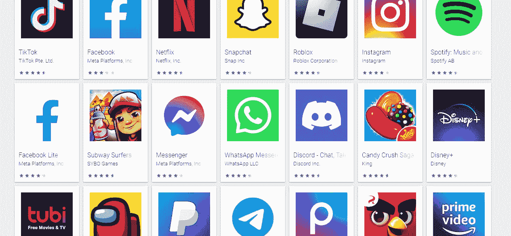
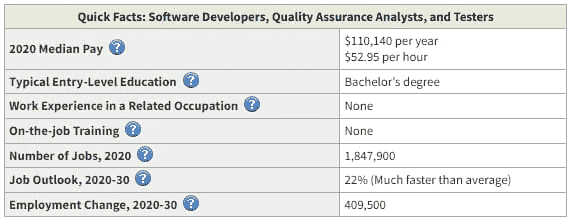
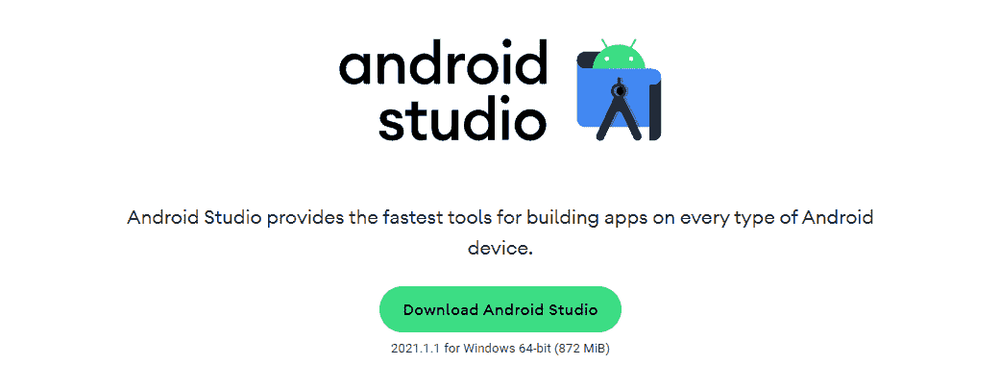
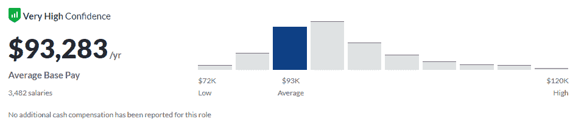
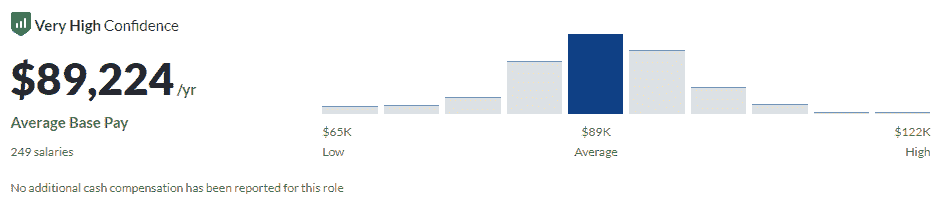
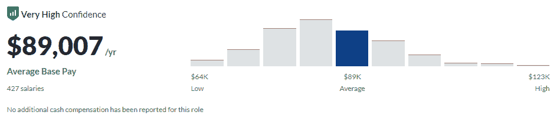
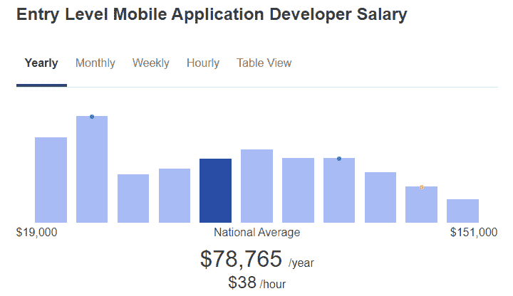
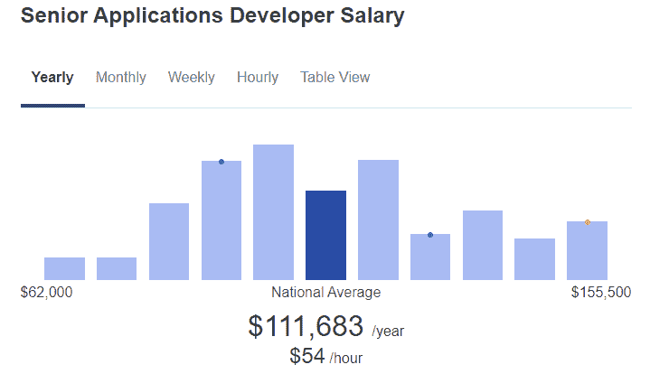
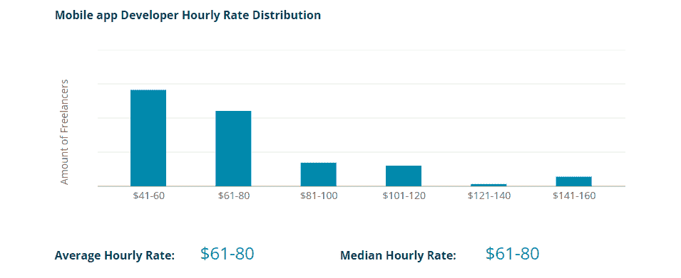
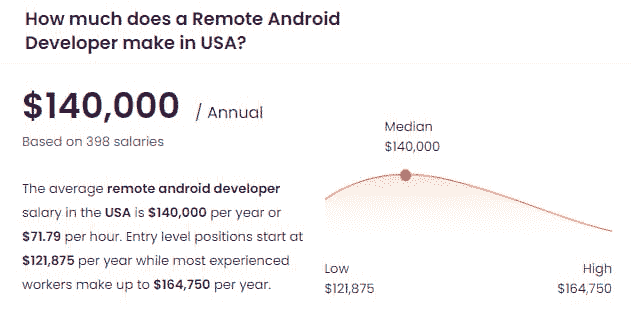

# 一般的 App 开发者工资是多少？

> 原文：<https://kinsta.com/blog/app-developer-salary/>

在开发人员的世界里，有成千上万种不同的专门化方式。“应用程序开发人员”是一个越来越受欢迎的职位，越来越多的人开始追求和寻找工作。

对苹果或安卓等移动操作系统有诀窍，或者正在寻找一份比“软件开发员”稍微更专业、更受欢迎的工作？让我们来看看应用程序开发者，他们是什么，以及在整个范围内自我认定的应用程序开发者赚了多少钱。

## 什么是 App 开发者？

我们先搞清楚一件事:app 到底是什么，“应用”和“程序”有什么区别？

虽然“app”通常指的是你可以在苹果应用商店、谷歌 Play 商店或其他地方找到的移动应用程序，但应用程序可以为任何操作系统编写，甚至可以为[网络服务器](https://kinsta.com/knowledgebase/what-is-apache/)编写。

An array of mobile apps.

一个应用程序被设计来帮助用户执行一个单一的任务，无论是玩游戏、写文档还是编辑图像。“程序”和“软件”是更广泛的术语，可以指在特定硬件上运行的任何数据，并且不总是为最终用户制作的。所有的 app 都是软件，但不是所有的软件都是 app。

出于这个原因，应用程序开发人员(相对于一般程序员)专注于开发一个程序，帮助最终用户做一些事情。

虽然这是移动开发人员(Android、iOS)最常使用的头衔，但桌面计算机开发人员(Windows、macOS、Linux)甚至 web 应用程序开发人员也非常常用它。

App 开发者也可能专门打造某一类 app，比如游戏、[社交媒体](https://kinsta.com/blog/wordpress-social-media-plugins/)、视频录制软件等。

有些甚至可以跨平台工作，这使它们成为稀有商品，因为它们能够将应用程序移植到多个系统。

[对苹果或安卓之类的移动操作系统很有一套，或者正在寻找一份比软件开发人员更专业、更受欢迎的工作？👀阅读本⬇️ 点击转推](https://twitter.com/intent/tweet?url=https%3A%2F%2Fbit.ly%2F3D6YWCL&via=kinsta&text=Have+a+knack+for+mobile+OSes+like+Apple+or+Android%2C+or+looking+for+a+job+that%27s+slightly+more+specialized+and+in-demand+than+a+software+developer%3F+%F0%9F%91%80+Read+this+%E2%AC%87%EF%B8%8F&hashtags=iOS%2CWebDev)

### 应用程序开发人员的基本职责

好奇 app 开发者的日常任务是什么？以下是对你将被期望做的事情的一瞥。

*   为特定的操作系统或特定的编程语言创建软件应用程序。
*   为最终用户创建一个干净且易于访问的用户界面。
*   调试和修复代码。
*   更新和修补旧软件。
*   与艺术家、研究人员和其他开发人员一起工作。
*   与客户沟通并提交原型。
*   编写用户容易理解的文档。

一般来说，应用程序开发人员比其他开发人员更关注终端用户，所以你可能会在编码的同时做更多的前端图形工作和 UI 设置，特别是如果你在一个非常小的团队中。

### 应用开发者的类型

即使“应用程序开发人员”已经是一个专门的头衔，仍然有几种类型的应用程序开发工作可供选择。

*   **软件开发者:**这些本质上和 app 开发者很像；他们可以被认为是一个稍微不那么专业化的职位。这些开发人员倾向于在后端编码方面做更多的工作，尽管通常仍然关注最终用户。
*   **手机应用开发者:**这往往是“应用开发者”的代名词，但可以提供澄清。这些开发人员可以使用 Android、iOS 或其他移动操作系统。你可以在你的职位中进一步细化操作系统，比如“Android 开发者”。
*   桌面应用程序开发人员:喜欢移动开发人员，但他们使用桌面计算机操作系统，如 Windows、Mac、Linux 等。也像移动 devs，可以专门化，比如“Windows developer”。
*   web 应用程序开发人员:这些人从事从 web 服务器交付到浏览器的 Web 应用程序，如电子邮件、[表单](https://kinsta.com/blog/wordpress-contact-form-plugins/)和基于浏览器的工具，如文字处理器。
*   混合应用程序开发人员:这份工作专注于开发跨平台的 web 应用程序，这些应用程序的行为和感觉都像应用程序。混合应用程序是用 web 语言编写的，比如 [HTML](https://kinsta.com/blog/learn-html/) 、 [CSS](https://kinsta.com/blog/wordpress-css/) 和 [Javascript](https://kinsta.com/knowledgebase/what-is-javascript/) 。

### 对应用开发者的需求

应用程序开发的需求相当高，你可以找到许多寻求某种应用程序开发人员的工作列表。

类似的[软件开发工作的就业前景为 22%](https://www.bls.gov/ooh/computer-and-information-technology/software-developers.htm) ，这意味着它的增长速度将比任何行业的其他工作都要快得多。尽管越来越多的人涌入科技行业，但需求还是很大的。

The median pay for software developers is $110,000/yr according to the U.S. Bureau of Labor.

至于具体的移动开发者，你的前景非常好。到 2026 年，对移动开发人员的需求预计将增加到 24% 由于移动设备的持续普及，知道如何使用这些设备将有助于你找到工作。

最后，[移动应用程序开发人员被认为是 2017 年美国的头号工作](https://money.cnn.com/gallery/pf/2017/01/05/best-jobs-2017/index.html)，在增长、薪酬和工作满意度方面表现出色。

总的来说，如果你想有安全感，应用程序开发，尤其是移动开发，是一份非常好的工作。

## 如何成为一名 App 开发者？

对任何形式的应用程序开发感兴趣？这里有一些关于如何开始和你需要什么的资源。

### 应用程序开发人员的工作要求和经验

看看一个 app 开发者必备的技能和要求。

*   一些工作可能需要相关领域的大专或学士学位，而对其他人来说，良好的投资组合和经验可能就足够了。
*   作为一名软件开发人员或你的主要编程语言的证书在简历上也会很好看。
*   实践经验或之前在目标系统上开发和发布过的应用肯定会有所帮助，尤其是如果这些应用获得了相当数量的下载和关注。
*   技术经验和对目标操作系统和平台的熟悉是必要的。
*   能够编写质量代码和[调试](https://kinsta.com/blog/debugging-wordpress-performance/)。
*   与客户和同事的沟通技巧。
*   创新和分析/解决问题的技能。
*   具备前台工作能力和一些 UI/设计技能。

### 如何开始成为一名应用程序开发人员

成为应用开发者的第一步是选择你想专攻的技术。移动应用程序开发和 web 应用程序开发非常不同，尽管桌面和移动开发之间可能会有一些交叉。

你想用电话、电脑、网络服务器还是它们的组合来工作？要不要专攻某个 OS？熟悉适用于您选择的技术的[开发工具](https://kinsta.com/blog/node-js-apps/)和[平台](https://kinsta.com/blog/what-is-paas/)。

The Android Studio homepage.

还有选择哪种编程语言的问题。取决于你想有多创新，天空基本上是这里的极限——但是有一些你可能想研究的应用程序开发的通用语言，还有比这里列出的更多的选项。

*   Android: Kotlin，Java，C++
*   iOS: Swift
*   Windows: C#，C++， [Python](https://kinsta.com/blog/nodejs-vs-python/) ，Java，Perl
*   麦克:斯威夫特
*   Linux: Python，C++，C，Perl，Java
*   Web 应用:HTML/CSS，Javascript，Java， [PHP](https://kinsta.com/blog/php-developer-salary/) ，Python，Ruby。注意，像 Django、 [Laravel](https://kinsta.com/blog/laravel-developer/) 或 Ruby on Rails 这样的[框架](https://kinsta.com/knowledgebase/what-is-laravel/)经常被使用，尤其是像 Ruby 和 Python 这样最初不是为 web 开发的语言。

这里有一些工具和官方资源可以帮助你开始。此外，考虑搜索你选择的语言的初学者指南。

苹果(macOS 和 iOS):

*   [用苹果学习编码](https://developer.apple.com/learn/curriculum/)
*   [SwiftUI 教程](https://developer.apple.com/tutorials/swiftui)
*   [苹果 SDK](https://developer.apple.com/develop/)
*   [iOS 编程资源](https://codewithchris.com/ios-programming-resources/)

窗口:

*   [为 Windows 开发桌面应用](https://docs.microsoft.com/en-us/windows/apps/desktop/)
*   [Windows SDK 和开发者工具](https://developer.microsoft.com/en-us/windows/downloads/)

Linux:

*   [做一个 Linux 的 App](https://makealinux.app/#/)
*   [令人惊叹的 Linux 开发工具](https://github.com/madbob/awesome-linux-dev)
*   [开发 Linux 应用程序课程](https://training.linuxfoundation.org/training/developing-applications-for-linux/)

安卓系统:

*   [Android Studio SDK](https://developer.android.com/studio)
*   [安卓培训课程](https://developer.android.com/courses)
*   [超棒的安卓学习资源](https://github.com/androiddevnotes/awesome-android-learning-resources)

Web 应用程序:

*   [Web 应用开发:资源、最佳实践以及如何做](https://tms-outsource.com/blog/posts/web-application-development/)
*   [用 Azure 构建应用](https://azure.microsoft.com/en-us/developer/) + [创建 Web 应用](https://azure.microsoft.com/en-us/developer/)
*   [如何创建 Web 应用程序:关于开发过程的深入指导](https://azure.microsoft.com/en-us/developer/)
*   [如何构建网络应用的 15 步指南](https://azure.microsoft.com/en-us/developer/)

## 应用程序开发人员的平均工资

现在揭晓答案:应用开发者一年能赚多少钱？和类似的工作相比，它在经验水平、地点方面又如何呢？

由于“应用开发者”是一个非常广泛的类别，我们也将看看移动应用开发者和网络应用开发者一年的收入。

以下是根据顶级薪资跟踪网站，自称“应用程序开发人员/应用程序开发人员”的收入。

*   [的确](https://azure.microsoft.com/en-us/developer/):8 万美元/年，基于 3k 工资。
*   [glass door](https://azure.microsoft.com/en-us/developer/):93k 美元/年，低的 72k 美元，高的 120k 美元。
*   [zip recruiter](https://azure.microsoft.com/en-us/developer/):94k 美元/年，低的 49k 美元，高的 159k 美元。
*   [工资等级](https://azure.microsoft.com/en-us/developer/):71k 美元/年，低的 51k 美元，高的 101k 美元。

平均这四项记录，您将得到每年 85，000 美元的总平均值。虽然没有科技行业中一些受人尊敬的职业高，但在类似的工作中，这是一个相当不错的薪水。

App developers make $93,000/yr on average according to Glassdoor.

那些专门使用 Android 和 iOS 等工具的移动应用开发者呢？让我们来看看。

*   [Salary.com](https://azure.microsoft.com/en-us/developer/):98k 美元/年，最低 69k 美元，最高 123k 美元。
*   [glass door](https://azure.microsoft.com/en-us/developer/):89k/年，低的 65k，高的 122k。
*   [zip recruiter](https://azure.microsoft.com/en-us/developer/):10.2 万美元/年，低的 4.2 万美元，高的 15.2 万美元。
*   [工资等级](https://azure.microsoft.com/en-us/developer/):74k 美元/年，最低 49k 美元，最高 119k 美元。

平均而言，这是 91k 美元/年，实际上比一般的应用程序开发人员要高一点。

## 注册订阅时事通讯

### 想知道我们是怎么让流量增长超过 1000%的吗？

加入 20，000 多名获得我们每周时事通讯和内部消息的人的行列吧！

[Subscribe Now](#newsletter)

Mobile developers make $89,000/yr on average according to Glassdoor.

最后，web 应用程序开发，面向那些使用 web 服务器及其技术的人。

*   Salary.com:10.6 万美元/年。
*   [glass door](https://azure.microsoft.com/en-us/developer/):89k/年，低的 64k，高的 123k。
*   [zip recruiter](https://azure.microsoft.com/en-us/developer/):82k 美元/年，低的 51k 美元，高的 111k 美元。
*   [工资等级](https://azure.microsoft.com/en-us/developer/):66k 美元/年，最低 46k 美元，最高 96k 美元。

在这里，你也可以得到 86k 美元/年，这个数字和一般的应用程序开发者相差不远。

Web app developers make $89,000/yr on average according to Glassdoor.

虽然这三种类型的应用程序开发人员的工资差不多，但移动应用程序开发人员的工资要高一些。

### 按经验水平划分的应用程序开发人员薪资

经验水平对薪资的影响最大。很重要的一点是，要知道你刚开始工作时的工资是否够用，是否值得在这个行业呆足够长的时间来获得高级职位的福利，或者你是否应该在其他地方专攻。

作为一名刚从大学毕业或经验非常少的入门级应用程序开发人员，你可以期望获得以下回报。

*   Salary.com:32 美元/小时，也就是大约 6.7 万美元/年。
*   [glass door](https://azure.microsoft.com/en-us/developer/):95k 美元/年，低的 48k 美元，高的 190k 美元。
*   [的确](https://azure.microsoft.com/en-us/developer/):6.5 万美元/年，基于 20+工资。
*   [zip recruiter](https://azure.microsoft.com/en-us/developer/):79k 美元/年，低的 19k 美元，高的 151k 美元。

这使得入门级应用程序开发人员的平均年薪为 7.7 万美元。不坏，考虑到一些技术工作的总平均工资甚至更低。

Entry-level mobile app developers make $78,765/yr on average according to ZipRecruiter.

对于那些有一点经验的人来说，你会看到这些薪水:

*   [的确](https://azure.microsoft.com/en-us/developer/):56k 美元/年，基于 40+工资。
*   [glass door](https://azure.microsoft.com/en-us/developer/):78k 美元/年，低的 47k 美元，高的 129k 美元。
*   [zip recruiter](https://azure.microsoft.com/en-us/developer/):69k 美元/年，低的 24k 美元，高的 145k 美元。
*   薪酬等级:57k 美元/年，最低 53k 美元，最高 64k 美元。

这相当于 6.5 万美元/年，低于入门级职位。这可能只是反映了 Glassdoor 基于少数报告对入门级工资的过高估计，但它确实表明入门级和初级职位之间的差异可能可以忽略不计。

Junior app developers make $69,000/yr on average according to ZipRecruiter

最后，这是你在这个行业工作十年或更长时间后的预期收入。

*   [确实](https://azure.microsoft.com/en-us/developer/):10.1 万美元/年，基于 600+工资。
*   [glass door](https://azure.microsoft.com/en-us/developer/):11.7 万美元/年，低的 9 万美元，高的 15.3 万美元。
*   [zip recruiter](https://azure.microsoft.com/en-us/developer/):11.2 万美元/年，低的 6.2 万美元，高的 15.6 万美元。
*   薪酬等级:99k 美元/年，最低 73k 美元，最高 127k 美元。

平均每年赚 107，000 美元，比你刚开始的时候多了不少。

Struggling with downtime and WordPress problems? Kinsta is the hosting solution designed to save you time! [Check out our features](https://kinsta.com/features/)

Senior app developers make $112,000/yr on average, according to ZipRecruiter.

### 按地点划分的应用程序开发人员工资

你住在哪里对你的薪水有很大的影响，甚至会影响你选择搬到哪里。以下是一些国家的例子，以及他们以当地货币和美元支付给应用开发者的报酬。

*   瑞士:8.5 万美元/年(7.9 万法国法郎/年)
*   苏格兰:5.3 万美元/年(3.9 万美元/年)
*   澳大利亚:5.1 万美元/年(7.3 万澳元/年)
*   德国:5.1 万美元/年(4.6 万欧元/年)
*   加拿大:5 万美元/年(6.4 万加元/年)
*   荷兰:4.8 万美元/年(4.3 万欧元/年)
*   奥地利:4.8 万美元/年(4.3 万欧元/年)
*   新加坡:4.2 万美元/年(5.6 万新元/年)
*   英国:4.2 万美元/年(3.2 万美元/年)
*   芬兰 4.1 万美元/年(3.7 万欧元/年)
*   新西兰:4.1 万美元/年(6.3 万新西兰元/年)
*   法国:4 万美元/年(3.6 万欧元/年)
*   中国:3.8 万美元/年(24 万美元/年)
*   [香港](https://azure.microsoft.com/en-us/developer/):38 万美元/年(30 万港币/年)
*   以色列:37000 美元/年(₪120k/year)
*   意大利:3.2 万美元/年(2.9 万欧元/年)
*   沙特阿拉伯:2.6 万美元/年(97 万沙特阿拉伯里亚尔/年)
*   墨西哥:2.3 万美元/年(MXN 48.5 万美元/年)
*   俄罗斯:17000 美元/年(1.3m₽/year)
*   印度$ 7k/年(₹512k/year)
*   巴西 5000 美元/年(26000 雷亚尔/年)
*   尼日利亚:3000 美元/年(₦1.2m/year)
*   印度尼西亚 275 美元/年(400 万印尼盾/年)

### 自由应用程序开发人员工资

自由职业当然不适合每个人，但是在你投身于这样的工作之前，知道你将面临什么是很重要的。自由职业者的应用程序开发与有薪职位相比如何？

据 ZipRecruiter 和 Glassdoor 报道，iOS 自由开发者的薪水分别为 11 万美元/年和 10.1 万美元/年。自由的安卓开发者可以期待 11.9 万美元/年的薪水[。安卓系统的工资可能会偏高一点，但差距并不大。](https://azure.microsoft.com/en-us/developer/)

Codementor 报告称，自由职业的移动应用程序开发人员总体上每小时挣 61-80 美元。如果[全职自由职业者平均每周工作 36 个小时](https://azure.microsoft.com/en-us/developer/)，那么年薪为 11.4 万至 16.8 万美元/年。

Mobile app developers have an hourly rate that ranges from $61-80, according to Codementor.

这当然很大程度上取决于你的客户愿意支付多少，你能找到多少客户，以及你每周工作多少小时。

### 远程应用程序开发人员工资

如果你打算做一名远程开发人员，工资可能会有点不同。这里有一些你可能会做的估计。

远程 Android 开发者可以从[11.1 万美元/年](https://azure.microsoft.com/en-us/developer/)到[14 万美元/年](https://azure.microsoft.com/en-us/developer/)，而 iOS 开发者预计可以从[11.2 万美元/年](https://azure.microsoft.com/en-us/developer/)。

A remote Android developer makes $140,000/yr on average, according to Talent.com.

一般来说，远程移动应用程序开发者平均年收入为 7.3 万美元。初级开发人员可以期望年薪 6 万美元，而作为高级移动应用程序开发人员，你可以年薪 8.7 万美元。

最后，如果你想大致了解一下远程软件开发人员的情况，他们会考虑 9 万美元/年。

### 应用程序开发人员的工资与网络开发人员的工资

根据美国劳动局 2020 年的统计数据，网络开发人员的平均工资为 7.7 万美元/年。你也可以看到，根据各种薪资网站，[网页开发人员平均工资 6-7.5 万/年](https://kinsta.com/blog/web-developer-salary/)。

Web developers make $77,000/yr on average according to the U.S. Bureau of Labor.

相比之下，应用程序开发人员的年薪为 8.5 万美元，比网络开发人员的年薪高出 8-2.5 万美元。众所周知，与软件开发人员相比，网络开发人员，尤其是前端开发人员的工资普遍较低。

### 应用程序开发人员工资与其他开发人员工资的对比

Web 开发人员可以分为三大类:使用 HTML 和 CSS 设计网页可见部分的前端开发人员，专注于使用各种技术进行服务器端工作的后端开发人员，以及两者兼而有之的全栈开发人员。

他们都属于“网络开发人员”，但每个人的薪水都大不相同。

当然，也有其他类型的 web 开发人员，比如 web 应用程序开发人员，但这三个是最常见的头衔。

前端开发者的平均收入为[$ 90k/年](https://kinsta.com/blog/front-end-developer-salary/)，后端开发者[$ 91k/年](https://kinsta.com/blog/backend-developer-salary/)，全栈开发者[$ 97k/年](https://kinsta.com/blog/full-stack-developers-salary/)。

一般的应用程序开发人员每年可以赚 85000 美元，你可以看到专业化是多么重要，因为更高层次的职位似乎可以赚更多的钱。网络开发也是一个非常大的行业，因为互联网总是在扩张。

## 该不该做 App 开发者？

app 开发是适合你的职业吗？本质上，它非常类似于软件开发人员的头衔。因此，如果你对此感兴趣，应用程序开发也可能是正确的课程。另外，这两个职位经常可以互换，所以你可以申请这两个职位。

如果你喜欢用代码创建应用程序，以最终用户为中心进行开发，并设计令人满意的 UI 布局，那么应用程序开发人员可能是一个适合你的职位。

这个职位以及整个科技行业的前景是充满希望的，工资与类似的科技工作相当。事实上，工资通常会更高一些。

像其他技术工作一样，你在职业生涯中有很大的灵活性，并能获得很好的福利。你可以舒适地远程工作(在这个时代非常重要)，或者选择做自由职业者和合同工。

对于新开发人员来说，应用程序设计是一个很好的起点，从这里你可以选择专业化或只停留在你的利基市场。

[Looking to become an app developer? Start here 👩‍💻Click to Tweet](https://twitter.com/intent/tweet?url=https%3A%2F%2Fbit.ly%2F3D6YWCL&via=kinsta&text=Looking+to+become+an+app+developer%3F+Start+here+%F0%9F%91%A9%E2%80%8D%F0%9F%92%BB&hashtags=iOS%2CWebDev) ## 摘要

应用程序开发人员可以通过每年 85000 美元获得合理的薪水——尽管根据你的具体职位和技能，还有可能获得更高的薪水。

作为一项比软件开发稍微专业化的工作，应用程序开发人员致力于为移动和桌面操作系统开发以用户为中心的应用程序。他们有时甚至加入网络开发者的行列，为服务器开发网络应用程序。这是一个相当宽泛的职位，可以容纳许多不同的技能。

如果你对开发任何类型的应用程序感兴趣，你可以安全地尝试应用程序开发，因为这是一个非常受欢迎的工作。

*如果 Javascript 是你正在考虑的一项技术，也可以看看 Node.js 开发人员的平均工资！*

* * *

让你所有的[应用程序](https://kinsta.com/application-hosting/)、[数据库](https://kinsta.com/database-hosting/)和 [WordPress 网站](https://kinsta.com/wordpress-hosting/)在线并在一个屋檐下。我们功能丰富的高性能云平台包括:

*   在 MyKinsta 仪表盘中轻松设置和管理
*   24/7 专家支持
*   最好的谷歌云平台硬件和网络，由 Kubernetes 提供最大的可扩展性
*   面向速度和安全性的企业级 Cloudflare 集成
*   全球受众覆盖全球多达 35 个数据中心和 275 多个 pop

在第一个月使用托管的[应用程序或托管](https://kinsta.com/application-hosting/)的[数据库，您可以享受 20 美元的优惠，亲自测试一下。探索我们的](https://kinsta.com/database-hosting/)[计划](https://kinsta.com/plans/)或[与销售人员交谈](https://kinsta.com/contact-us/)以找到最适合您的方式。