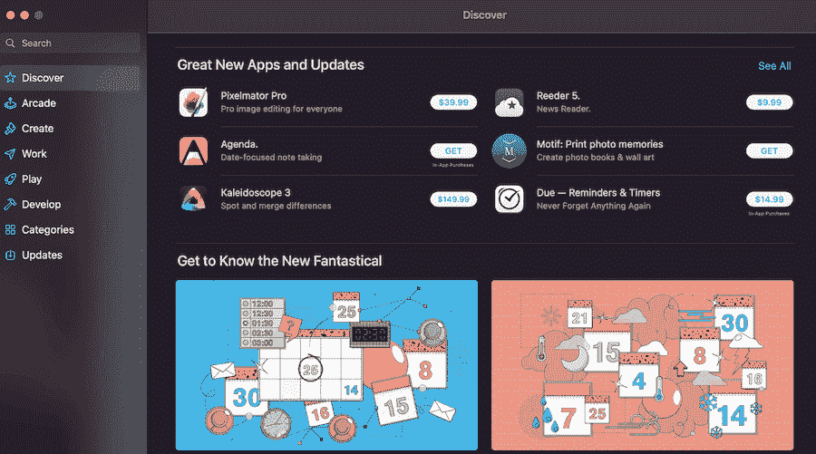
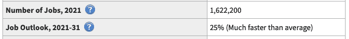
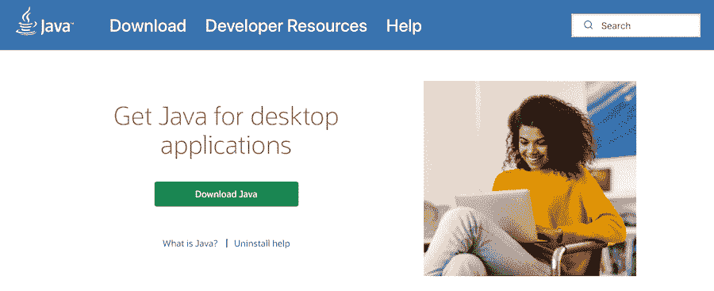
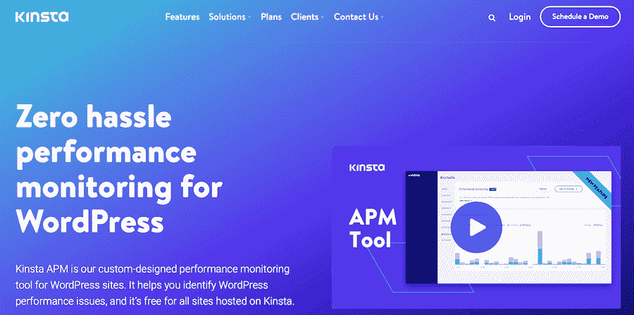
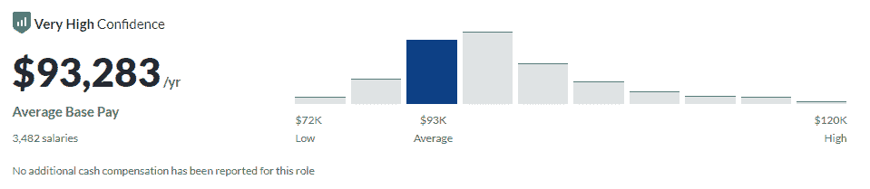
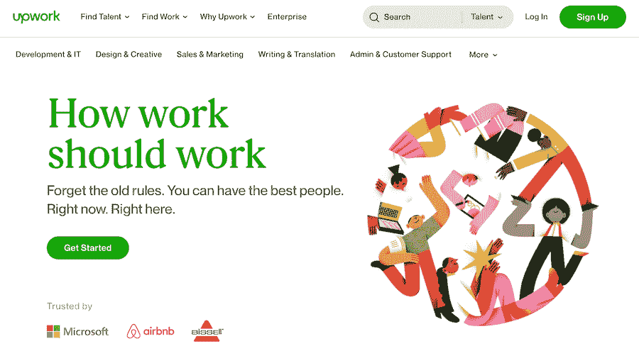

# 如何成为一名应用程序开发人员:你需要知道的一切

> 原文：<https://kinsta.com/blog/application-developer/>

您每天都会遇到应用程序开发人员的工作。事实上，他们设计、创造和维护你现在可能正在使用的阅读本文的软件。他们负责一切事情，从我们在手机上玩的游戏到我们用来预订航班和跟踪我们健身目标的应用程序。

如果你有兴趣成为一名应用程序开发人员，在选择它作为你的职业道路之前，你应该知道一些事情。

这就是我们今天的重点。我们将从讨论什么是[应用开发](https://kinsta.com/application-hosting/)开始，以及在这个职业中你能期望承担什么责任，接下来是额外津贴、培训、技能、工作前景等等。

希望你在阅读完这篇文章后，对成为一名应用程序开发人员是否是你的正确职业道路有一个更清晰的认识。

## 什么是应用开发？

在全面回答这个问题之前，你需要知道什么是应用程序。

应用程序是设计用来执行特定任务或一组任务的计算机程序，可以是从玩游戏到理财的任何东西。

应用程序开发是设计、创建、测试和维护这些程序或应用程序的过程。

有许多不同类型的应用程序开发人员，每个人都有自己的侧重点。例如，一些人开发移动应用程序，而其他人可能从事企业软件或视频游戏。

应用程序开发人员工作的平台也可能不同。有些人可能会为 Android 设备或苹果产品开发应用程序。

正在开发的应用程序的类型也将决定开发过程。例如，一个简单的游戏应用程序可能不像更复杂的企业应用程序那样需要很长的开发时间。这里有几种类型的应用程序开发人员，你可以把他们培养成:

*   移动应用开发者
*   Web 应用程序开发人员
*   游戏应用开发商
*   嵌入式系统应用开发人员

[Is a career switch in the cards? 🃏 If you're interested in the world of application development and think it could be for you, find the prerequisites, training, and skill required in this guide ✅Click to Tweet](https://twitter.com/intent/tweet?url=https%3A%2F%2Fkinsta.com%2Fblog%2Fapplication-developer%2F&via=kinsta&text=Is+a+career+switch+in+the+cards%3F+%F0%9F%83%8F+If+you%27re+interested+in+the+world+of+application+development+and+think+it+could+be+for+you%2C+find+the+prerequisites%2C+training%2C+and+skill+required+in+this+guide+%E2%9C%85&hashtags=WebDev%2CJobHunt)

### 一个 App 的典型生命周期是怎样的？

应用程序开发遵循一个被称为应用程序生命周期的过程——它是应用程序从构思到交付并最终退役的旅程。

应用程序的生命周期始于一个想法。它可能来自任何地方—业务需求、客户请求，甚至个人兴趣。想法一旦产生，它就会具体化为一个概念。

在那里，应用程序将被设计、构建和测试。一旦确定该应用程序符合所有要求，它将向公众发布。[部署](https://kinsta.com/wordpress-staging/)过程将根据正在开发的应用程序的类型而变化。

应用程序发布后，将对其进行监控以发现任何问题。必要时，开发者会发布对[的更新，修复任何 bug](https://kinsta.com/knowledgebase/devkinsta/logging/)。

最终，应用程序将到达其生命周期的终点并被淘汰——这可能有几个原因，如技术的变化或用户群的需求。

## 应用程序开发人员是做什么的？

简而言之，应用开发者为特定的操作系统(通常是移动操作系统)创建程序。这个过程可能包括从设计最初的原型到发布后维护和更新应用程序的所有事情。

应用程序开发人员通常作为团队的一部分工作，尽管他们也可能在较小的项目中独立工作。虽然有些开发人员可能专门从事[编码](https://kinsta.com/developer-roles/coding-skills-at-kinsta/)，但其他人也可能从头到尾负责管理应用程序开发项目。

一旦应用程序被批准，开发人员将开始[编写代码](https://kinsta.com/blog/best-programming-fonts/)并根据客户提出的规范构建应用程序。这可能包括使用各种编程语言，以及测试应用程序以确保其正常工作。

应用程序完成后，开发人员还可能负责将其提交给应用程序商店(如 App Store 或 Google Play)，并在事后提供支持和更新。

The App Store

### 日常任务和职责

应用程序开发人员的日常任务将根据手头的项目而有所不同。然而，大多数应用程序开发人员每天都会执行一些常规任务，例如:

*   编写代码:这可能是应用程序开发人员最重要的职责。开发人员将把大部分时间花在编写符合客户提出的规范的代码上。
*   **测试应用程序:**一旦应用程序被编码，它将[需要被测试](https://kinsta.com/blog/performance-testing-tools/)以确保它正常工作。开发人员可以执行手动和自动测试来查找和修复应用程序中的任何错误。
*   **调试应用:**在某些情况下，开发者可能需要[调试已经被公众使用的](https://kinsta.com/help/wordpress-debugging/)应用。这可能涉及跟踪和修复导致应用程序故障的任何错误。同样的，[防止宕机](https://kinsta.com/blog/website-downtime/)也是开发一个 web 应用必须的。
*   **与团队成员协作:**应用程序开发人员通常作为团队的一部分工作，这意味着他们需要与他人进行有效的沟通。这可能包括从一起编写代码到参加团队会议的任何事情。
*   跟踪项目进度:开发人员跟踪应用程序的进度也很重要。这可能包括使用[项目管理](https://kinsta.com/blog/wordpress-project-management-plugins/)软件或者定期更新客户的应用程序状态。
*   **提交应用:**在某些情况下，开发者可能负责向应用商店申请。这可能包括遵循特定的指导原则，并确保应用程序满足所有要求。
*   **管理应用程序开发项目:**虽然有些应用程序开发人员可能只负责编码，但其他人也可能从头到尾管理项目。这可能涉及从处理[客户沟通](https://kinsta.com/blog/wp-feedback-wordpress-plugin/)到跟踪项目进展的所有事情。

应用程序开发团队可能还包括项目经理、设计师和质量保证分析师。在较大的组织中，也可能有专门的应用程序开发部门。

开发人员通常全职工作，尽管他们可能偶尔需要加班以满足截止日期或处理意想不到的挑战。一些开发人员也可能出差去会见客户或参加会议。

## 为什么要成为应用开发者？

你想成为应用程序开发人员有几个原因。一些最常见的原因包括:

*   这份工作需求量很大:随着智能手机和其他移动设备的日益普及，对应用程序开发人员的需求也越来越大。
*   你可以获得高薪:除了需求量大之外，应用程序开发人员平均还能获得 T2 的高薪。
*   **远程工作是一种选择:**许多应用程序开发人员可以[远程工作](https://kinsta.com/blog/working-remotely/)，这是一项巨大的福利。这使得工作时间和地点有了更大的灵活性。
*   你可以专攻某一特定领域:有些应用程序开发人员可能从事不同的项目，而其他人可能专攻某一特定领域。这可能包括开发游戏，为特定平台创建应用程序。
*   **App 开发极其灵活:**你可以使用任何你想要的编程语言或操作系统，以及你喜欢的工具和框架。这可以使应用程序开发成为一个令人满意和有益的职业。
*   **转换到更专业的角色是可能的:**随着经验的积累，你可能会发现自己想专攻应用程序开发的某个特定领域。这可能包括成为[首席开发人员](https://kinsta.com/blog/frontend-developer/)或项目经理。
*   **你为这份工作学到的技能适应性很强:**你作为应用程序开发人员学到的技能可以应用到几个不同的领域。例如，你可以利用你的编码技能成为一名软件开发人员或者一名[网站开发人员](https://kinsta.com/blog/how-to-become-a-web-developer/)。

## 应用程序开发人员受欢迎吗？

是的，应用程序开发人员需求量很大，这主要是由于智能手机和其他移动设备的日益普及。根据美国劳工统计局的数据，2021 年至 2031 年间，对应用程序开发人员的需求预计将增长 25%，这被认为远高于平均就业前景增长率。

The job outlook for application developers (2021-31). (Source: U.S. Bureau of Labor Statistics)

截至 2021 年，这一劳动力类别的工作或职位数量为 160 万。

## 成为应用程序开发人员所需的技能

如果你想成为一名应用程序开发人员，你需要掌握很多技能来胜任这个角色。让我们把这些分成更技术性的技能和那些与工作流程、生产力和绩效更相关的[。](https://kinsta.com/blog/git-for-web-development/)

### 编程语言

作为应用开发人员，你必须精通各种编程语言。

Java

应用程序开发人员常用的编程语言包括:

*   Java: [Java](https://kinsta.com/blog/java-developer/) 让开发人员可以创建出性能惊人的应用程序。Java 是许多大型应用程序和系统的支柱，包括 Android、亚马逊的 Kindle Fire 操作系统和 Twitter。
*   **Python:**[Python](https://kinsta.com/blog/python-tutorials/)最大的好处是它大大加快了你的工作流程，你可以用它来轻松集成你的系统。
*   JavaScript **:** 这种编程语言是为你喜爱的动态交互式网页提供动力的引擎。虽然是为浏览器而创建的， [JavaScript](https://kinsta.com/knowledgebase/what-is-javascript/) 现在也用于许多其他应用。
*   c++:c++是一种面向对象的编程语言，这使得开发人员可以构建软件系统。C++用于各种应用，包括计算机游戏、企业软件和科学应用。
*   **PHP:** [PHP](https://kinsta.com/php/) 是一种专为 web 开发设计的服务器端脚本语言。
*   **Node.js:** 虽然 [Node.js](https://kinsta.com/blog/node-js-vs-php/) 通常用于 web 开发，但它是一个开源的 JavaScript 运行时环境，您也可以使用它来创建工具和应用程序。

你可能还需要理解基于网络的语言，比如 HTML5 和 T2 CSS3。

### 操作系统

你还需要了解不同的操作系统，比如 Android 和 iOS。这将允许您为各种设备开发应用程序。

## 注册订阅时事通讯

### 想知道我们是怎么让流量增长超过 1000%的吗？

加入 20，000 多名获得我们每周时事通讯和内部消息的人的行列吧！

[Subscribe Now](#newsletter)

### 数据库

为了有效地存储数据，应用程序开发人员需要很好地理解数据库。这可能涉及从 [MySQL](https://kinsta.com/knowledgebase/what-is-mysql/) 到 [MongoDB](https://kinsta.com/knowledgebase/what-is-mongodb/) 的任何东西。

### 用户界面和设计

应用程序开发人员需要为他们的应用程序创建用户友好的界面。这涉及到对人机交互和[图形设计](https://kinsta.com/blog/web-design-courses/)原则的良好理解。

### 质量测试

为了确保他们的应用程序是最高质量的，应用程序开发人员需要能够彻底地测试他们的应用程序。这包括功能测试和[性能测试](https://kinsta.com/blog/query-monitor/)。

### 排除故障

当应用程序开发人员遇到错误时，他们需要能够调试他们的代码以找到问题的根源。Web 应用程序开发通常涉及一般的 web 开发，以符合。在这些情况下，熟悉像 [Kinsta APM](https://kinsta.com/apm-tool/) 这样的性能监控工具是必不可少的，尤其是当你使用 WordPress 的时候。

Get high-quality performance monitoring for WordPress with the Kinsta APM tool.

### 工作流程和生产力技能

除了技术技能，你还需要商业头脑和与他人合作的能力。这些技能包括:

*   **营销和业务:**虽然应用程序开发人员主要关注应用程序开发的技术方面，但很好地理解[营销](https://kinsta.com/blog/digital-marketing-strategy/)和业务也很重要。这将允许您创建不仅在技术上合理而且具有商业吸引力的应用程序。
*   **项目管理** **:** 作为一名应用程序开发人员，您必须高效地管理您的时间和资源，以满足截止日期。这包括能够创建和跟踪项目里程碑，以及将任务委派给其他团队成员。
*   **客户端管理:**在许多情况下，应用程序开发人员与具有特定应用程序需求的客户端合作。这意味着你需要能够有效地管理客户期望和可交付成果。
*   团队合作:应用程序开发是一个基于团队的过程。这意味着您需要能够与其他开发人员、设计人员和测试人员有效地合作，以创建高质量的应用程序。
*   **满足截止日期的能力:**在应用程序开发过程中，经常有严格的截止日期需要满足。这意味着你需要能够快速有效地完成工作。

## 一般应用开发者的工资是多少？

根据 [Glassdoor](https://www.glassdoor.com/Salaries/application-developer-salary-SRCH_KO0,21.htm) 的数据，应用程序开发人员的平均工资为每年 9.3 万美元。可以用额外的工资和奖金来赚钱。

然而，根据经验和技能的不同，年薪从 5 万美元到 15 万美元不等。

The average salary for an app developer on Glassdoor.

拥有更多经验和更专业技能的应用程序开发人员有望获得更高的薪水。这和其他开发领域的人工资差不多，像[全栈开发者](https://kinsta.com/blog/what-is-a-full-stack-developer/)。

其他报道的平均工资包括从[开始的每年 8 万美元，从](https://www.indeed.com/career/application-developer/salaries)开始的每年 9.8 万美元，从[的 zipcruiter](https://www.ziprecruiter.com/Salaries/Applications-Developer-Salary)开始的每年 9.8 万美元，从[的 Payscale](https://www.payscale.com/research/US/Job=Application_Developer/Salary) 开始的每年 7.2 万美元。更进一步来说，[当综合 Glassdoor，实际上是 ZipRecruiter 和 Payscale 报告的数字时，当前的平均工资](https://kinsta.com/blog/app-developer-salary/#average-app-developer-salary)是每年 85，000 美元。

## 如何成为一名应用开发者

如果您有兴趣成为一名应用程序开发人员，您需要做几件事情。让我们先来谈谈这个领域中一个角色的一般工作要求，然后讨论一些细节，比如如何开始，开始时你需要知道的最低要求，以及你应该学习什么编程语言。

Struggling with downtime and WordPress problems? Kinsta is the hosting solution designed to save you time! [Check out our features](https://kinsta.com/features/)

### 应用程序开发人员工作要求

要成为应用程序开发人员，您需要满足一些基本要求。首先，你需要计算机科学或相关领域的学士学位。

此外，如果你有使用计算机和应用程序开发软件的经验，并且对[编程语言](https://kinsta.com/blog/best-programming-language-to-learn/)有很强的理解，那将会很有帮助。最后，拥有强大的解决问题的技能也很重要，因为应用程序开发人员经常需要调试代码并找到错误的解决方案。

虽然学士学位是大多数应用程序开发人员的最低要求，但一些公司可能要求您拥有硕士学位或更高学位。此外，一些公司可能更希望你有从事特定应用开发软件或编程语言的经验。

### 自由职业者还是全职角色:从哪里开始

应用开发角色主要有两种选择:[自由职业者](https://kinsta.com/blog/how-to-become-a-freelance-technical-writer/)或者全职。

对双方都有好处。例如，自由职业者在工作时间和在家工作方面提供了更多的灵活性，而全职工作通常有更多的工作保障和福利。

决定哪条路线适合你的最好方法是开始申请工作，看看外面有什么。如果你不确定从哪里开始，的确是一个寻找应用程序开发人员工作的绝佳资源。你也可以看看自由职业者的工作论坛，比如 [Upwork](https://www.upwork.com/) 。

Upwork

### 开始前你需要知道的最基本的东西

应用程序开发是一个复杂的过程，但是您不需要知道所有的事情就可以开始。最好的学习方法就是做。

也就是说，在开始之前，你应该知道一些关键的事情，包括应用程序开发软件和编程语言的基础知识。如果你打算自己开发一个应用程序，然后发布或者受雇于一家开发公司，那么你的方法会略有不同。

如果你想被一家开发公司聘用，你最好的选择是专注于学习一门或两门特定的编程语言。应用程序开发最流行的编程语言是 Java，其次是 Python。其他受欢迎的选项包括 C++和 [PHP](https://kinsta.com/blog/php-8-2/) 。

如果你想开发一个应用，你需要熟悉应用开发软件和编程语言。例如，如果你使用流行的游戏开发引擎 [Unity](https://unity.com/) 来构建一个游戏，你需要学习 C#。

在资源方面，许多优秀的书籍、网站和在线课程可以帮助您学习应用程序开发的基础知识。

### 应该先学习哪些编程语言？

应用程序开发人员可以学习多种编程语言。开始时最好的语言取决于你的目标和兴趣。

如果你想被开发公司聘用，我们建议你从 Java 或 Python 开始。这是两种最流行的编程语言，相对容易学习，可用于各种应用程序开发项目。

如果你想自己开发一个应用程序，我们建议从 C#或 JavaScript 开始——它们是构建多样化应用程序的通用语言。

## 招聘应用程序开发人员时要注意什么

在我们分道扬镳之前，我们还想看看招聘方面的事情。如果你打算雇佣一名应用程序开发人员，你必须清楚自己对候选人的期望。在丢掉工作之前，要清楚地意识到:

*   他们需要知道什么编程语言
*   他们需要精通的应用程序开发软件
*   他们的经验水平
*   你希望开发的应用类型
*   你的预算

一旦你很好地意识到你需要什么，就该开始写你的招聘启事了。确保你的招聘启事简洁明了，并且包含了候选人需要知道的所有相关信息。

如果你被难住了，这里有一个对初级应用程序开发人员工作期望的快速概述作为例子:

*   一个初级的 app 开发者应该精通至少一门编程语言和应用开发软件。
*   他们应该从头到尾都非常了解应用程序开发过程。
*   他们应该能够很好地把握方向，并与团队合作。
*   他们应该有一些应用程序开发项目的工作经验。

既然你已经知道了在应用程序开发人员身上应该寻找什么，那么是时候开始寻找了！你可以在各种各样的招聘栏和自由职业者网站上找到应用程序开发人员。你也可以查看一下 [Kinsta 机构目录](https://kinsta.com/agency-directory/)，里面有很多合格的专业人士愿意承担你的项目。

The Kinsta Agency Directory homepage.

搜索候选人时，使用与你所寻找的技能和经验相关的关键词。

[想涉足应用程序开发领域吗？从这里开始🚀 点击推文](https://twitter.com/intent/tweet?url=https%3A%2F%2Fkinsta.com%2Fblog%2Fapplication-developer%2F&via=kinsta&text=Want+to+venture+into+the+world+of+application+development%3F+Start+here+%F0%9F%9A%80&hashtags=WebDev%2CJobHunt)

## 摘要

这就是成为应用程序开发人员所需要知道的一切！我们希望本指南对您有所帮助，并且您现在能够更好地理解应用程序开发过程。

记住，如果你想被一家开发公司聘用，就要专注于学习 Java 或 Python。如果你想开发一个 app，重点学习 C#或者 JavaScript。如果你要雇佣一名应用程序开发人员，确保你对候选人的期望是明确的。

感谢您的阅读，祝您在应用程序开发之旅中好运。

如果你想开始网络开发，DevKinsta 提供了一个在本地开发 WordPress 网站的好方法。最棒的是。完全免费。

*您是否希望以应用程序开发人员的身份开始工作？如果是，有什么阻碍你进入这个领域吗？请在下面的评论中发表意见！*

* * *

让你所有的[应用程序](https://kinsta.com/application-hosting/)、[数据库](https://kinsta.com/database-hosting/)和 [WordPress 网站](https://kinsta.com/wordpress-hosting/)在线并在一个屋檐下。我们功能丰富的高性能云平台包括:

*   在 MyKinsta 仪表盘中轻松设置和管理
*   24/7 专家支持
*   最好的谷歌云平台硬件和网络，由 Kubernetes 提供最大的可扩展性
*   面向速度和安全性的企业级 Cloudflare 集成
*   全球受众覆盖全球多达 35 个数据中心和 275 多个 pop

在第一个月使用托管的[应用程序或托管](https://kinsta.com/application-hosting/)的[数据库，您可以享受 20 美元的优惠，亲自测试一下。探索我们的](https://kinsta.com/database-hosting/)[计划](https://kinsta.com/plans/)或[与销售人员交谈](https://kinsta.com/contact-us/)以找到最适合您的方式。