# 如何为你的 WordPress 站点设置自动优化

> 原文：<https://kinsta.com/blog/autoptimize-settings/>

Autoptimize 是一个免费的 WordPress 优化插件。除了 HTML、CSS 和 JavaScript 优化之外，Autoptimize 还包括针对现代 WordPress 网站其他方面的优化功能。

在本帖中，我们将分享最佳的自动优化插件设置，以提高你的 WordPress 站点的性能和页面速度。

## 为什么要自动优化？

在我们进入最佳自动优化设置之前，让我们快速回顾一下为什么自动优化是一个伟大的优化插件的三个原因。

1.  自动优化的免费版本有一个完整的功能集来优化你的 WordPress 站点。
2.  Autoptimize 是一个严格的优化插件，不做任何 HTML 页面缓存。这意味着它可以兼容所有的网络主机——甚至是像 Kinsta 这样有[自定义页面缓存配置](https://kinsta.com/blog/wordpress-cache/)的主机。
3.  Autoptimize 在 WordPress 知识库中有超过 100 万个活跃安装，并且不断更新新功能和错误修复。

## 自动优化 JS、CSS 和 HTML 设置

HTML、 [CSS](https://kinsta.com/blog/wordpress-css/) ，JavaScript 是 Autoptimize 的饭碗。与其他优化插件一样，挖掘 Autoptimize 的广泛功能集和设置可能是一项艰巨的任务。为了使事情变得更容易，我们已经编译了最佳的自动优化设置，以提高您的网站的性能。

> Kinsta 把我宠坏了，所以我现在要求每个供应商都提供这样的服务。我们还试图通过我们的 SaaS 工具支持达到这一水平。
> 
> <footer class="wp-block-kinsta-client-quote__footer">
> 
> 
> 
> <cite class="wp-block-kinsta-client-quote__cite">Suganthan Mohanadasan from @Suganthanmn</cite></footer>

[View plans](https://kinsta.com/plans/)

### JavaScript 选项

[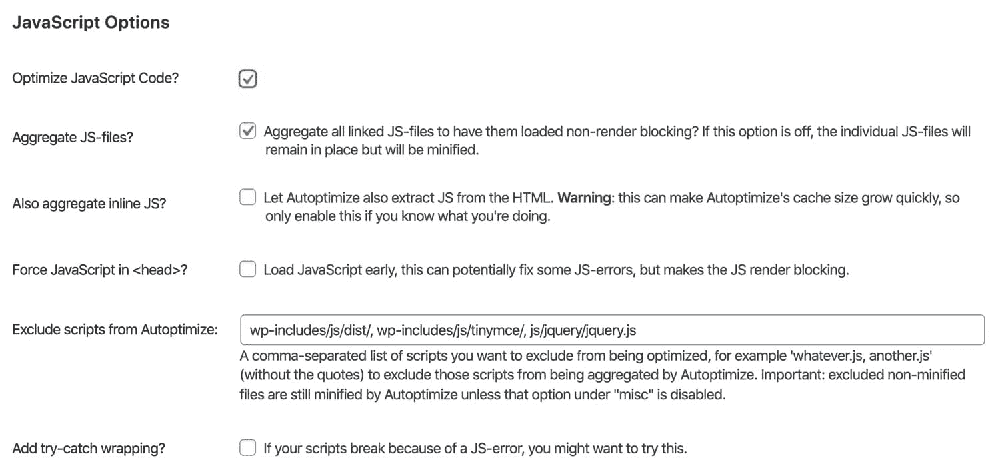](https://kinsta.com/wp-content/uploads/2020/04/autoptimize-javascript-optimization-1.jpg)

JavaScript optimization in Autoptimize.

#### 优化 JavaScript 代码

我们建议启用此选项。当“优化 JavaScript 代码”启用时，自动优化将[缩小您的 JavaScript 文件](https://kinsta.com/blog/minify-javascript/)。

#### 聚合 JS 文件

Autoptimize 的“聚合 JS 文件”选项会将所有的 JavaScript 文件合并成一个文件。在过去，合并 JS 和 CSS 文件是 WordPress 优化的关键步骤。在 Kinsta，我们使用支持并行下载和多路复用的[现代 HTTP/2 服务器](https://kinsta.com/learn/what-is-http2/)——这意味着组合文件不再像过去那样重要，因为 HTTP/2 允许同时下载[多个文件](https://kinsta.com/blog/wordpress-download-manager/)。也就是说，聚合 CSS 和 JS 文件仍然会导致某些类型的 WordPress 站点减速，所以我们建议[在启用和禁用这个选项的情况下测试你的页面速度](https://kinsta.com/blog/website-speed-test/)。

#### 也聚合内联 JS

“还聚合内联 JS”选项提取 HTML 中的内联 JS，并将其与 Autoptimize 的优化 JS 文件相结合。由于此选项会导致自动优化的缓存大小快速增加，我们建议您禁用此选项，除非您有特定的理由启用它。

#### 强制 JavaScript 进入

在大多数情况下，我们不建议在你的站点的 HTML `<head>`元素中强制加载 JavaScript 文件。强迫 JS 过早加载会导致[渲染阻塞元素](https://kinsta.com/blog/eliminate-render-blocking-javascript-css/)，这可能会降低你的页面速度。如果您有 JavaScript 文件需要加载到`<head>`元素中，我们建议从自动优化中排除这些脚本。

#### 从自动优化中排除脚本

此选项允许您从聚合中排除特定的目录和 JavaScript 文件。默认情况下，自动优化不包括以下脚本。

*   wp-includes/js/dist/
*   wp-includes/js/tinymce/
*   js/jquery/jquery.js

请注意，默认情况下，添加要排除的脚本只会影响聚合。除非在“杂项选项”下取消选中“缩小排除的 CSS 和 JS 文件”,否则排除的 JavaScript 文件仍将被缩小。

#### 添加尝试捕捉包装

启用“添加 try-catch 包装”选项会将您的 JavaScript 代码包装在 try-catch 块中。该选项对于由 JS 缩小和聚合引起的[调试问题](https://kinsta.com/blog/wordpress-debug/)很有用。如果你的站点只有在启用了“添加 try-catch 包装”的情况下才能工作，[我们建议与开发人员](https://kinsta.com/partners/)一起检查你的 JavaScript 文件，找出导致问题的原因，因为过度使用 try-catch 块会降低 JS 性能。

[自动优化:你不知道你需要的免费 WordPress 优化插件...但是，这将使你的网站快如闪电⚡️This 指南解释了为什么你需要它🚀 点击推文](https://twitter.com/intent/tweet?url=https%3A%2F%2Fkinsta.com%2Fblog%2Fautoptimize-settings%2F&via=kinsta&text=Autoptimize%3A+the+free+WordPress+optimization+plugin+you+didn%27t+know+you+needed...but+that+will+make+your+site+lightning+fast+%E2%9A%A1%EF%B8%8FThis+guide+explains+exactly+why+you+need+it+%F0%9F%9A%80&hashtags=wordpress%2Cplugin)

### CSS 选项

[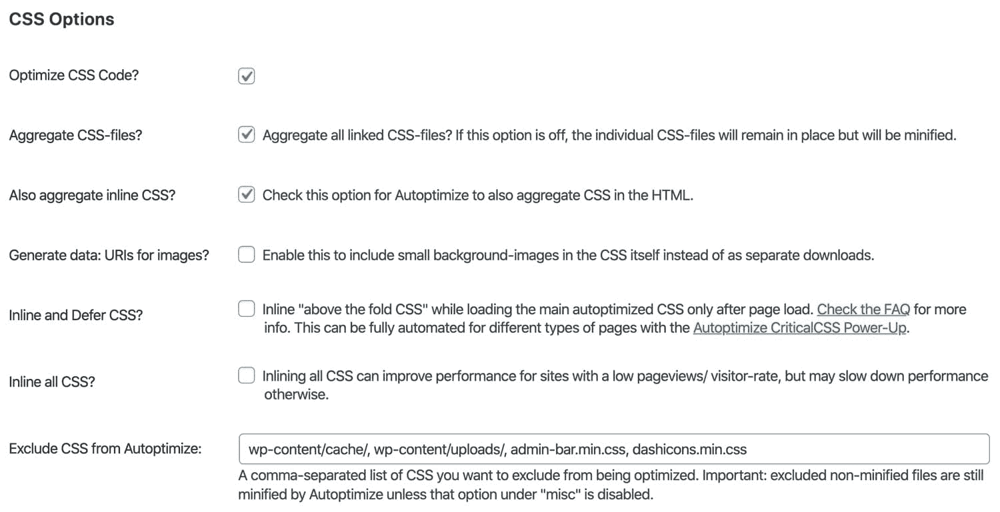](https://kinsta.com/wp-content/uploads/2020/04/autoptimize-css-optimization.jpg)

Autoptimize CSS optimization.

#### 优化 CSS 代码

我们建议启用此选项。当“优化 CSS 代码”被启用，自动优化将缩小你的 CSS 文件。

#### 聚合 CSS 文件

自动优化的“聚合 CSS 文件”选项会将所有的 CSS 文件合并成一个文件。正如我们前面提到的，这个特性可能对支持 HTTP/2 的站点没有好处。我们建议在您的网站上 A/B 测试此选项，以确定是否对页面速度有任何积极影响。

#### 也聚合内联 CSS

此选项会将内联 CSS 移动到自动优化的 CSS 文件中。虽然将内联 CSS 移动到浏览器可缓存的 CSS 文件可以减小页面大小，但我们建议在大多数情况下禁用此选项。

#### 生成数据:图像的 URIs

启用此选项后，自动优化将对小背景图像进行 64 位编码，并将其嵌入 CSS 中。我们建议测试这个选项，以衡量对页面速度的影响。虽然将图像编码成 base64 格式[减少了 HTTP 请求的数量](https://kinsta.com/blog/make-fewer-http-requests/)，但是 base64 表示文件通常比二进制文件大 20-30%。

#### 内嵌和延迟 CSS

对于某些网站来说，内联关键 CSS 可以显著提高速度。这里的想法是“在折叠之上”的元素所需要的内联样式。实际上，内联 CSS 通常以结构元素、全局字体系列和大小以及导航样式等元素为目标。

通过内联这些关键元素，可以在以后加载更大的完整 CSS 文件，而不会影响页面的外观。虽然可以手动提取关键的样式，但我们建议使用像[这个](https://jonassebastianohlsson.com/criticalpathcssgenerator/)这样的工具来生成样式作为起点。

[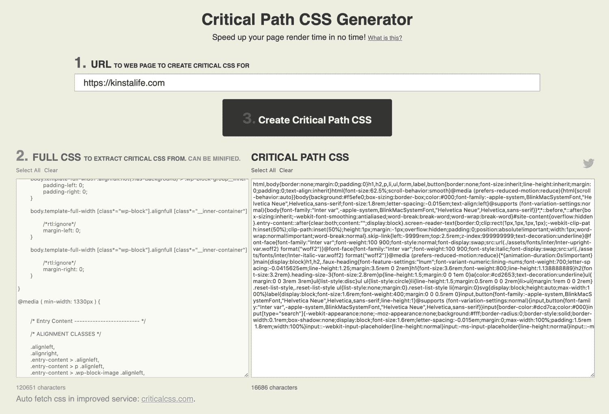](https://kinsta.com/wp-content/uploads/2020/04/generate-critical-css.jpg)

Generate critical CSS.

生成关键 CSS 后，将其复制并粘贴到自动优化设置中。

[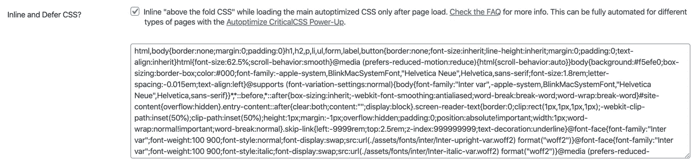](https://kinsta.com/wp-content/uploads/2020/04/autoptimize-inline-and-defer-css.jpg)

Inline and defer CSS in Autoptimize.

下一步是测试你的网站的前端体验。如果您注意到一些奇怪的[无样式内容(FOUC)](https://kinsta.com/blog/eliminate-render-blocking-javascript-css/#what-are-renderblocking-resources) 闪烁，您可能需要识别那些无样式元素，并将相应的样式添加到自动优化中以便进行内联。

Autoptimize 提供了一种“动力”,可以自动为你的 WordPress 页面生成关键的 CSS。根据我们的经验，这个特性有时会降低你的站点速度，因为它使用外部 API 调用来生成关键的 CSS。因此，最初的关键 CSS 生成依赖于外部服务器的响应。在大多数情况下，前面提到的不需要任何外部 API 调用的方法是一个更干净的解决方案。

#### 内嵌所有 CSS

对于大多数网站，我们不建议内联所有的 CSS，因为它会大大增加页面大小。此外，内联所有 CSS 使得 web 浏览器无法缓存 CSS。

#### 从自动优化中排除 CSS

默认情况下，自动优化从聚合中排除以下目录和 CSS 文件。如果你想防止自动优化聚集你的任何 CSS 文件，你可以将它们添加到这个列表中。类似于 JavaScript 排除，这个特性的默认行为并不阻止 CSS 文件被缩小——只是被聚集。

*   WP-内容/缓存/
*   WP-内容/上传/
*   admin-bar.min.css
*   dashicons.min.css

### HTML 选项

Autoptimize 的 HTML 优化可以通过删除空白来帮助减少页面的大小。

[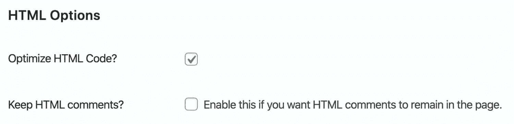](https://kinsta.com/wp-content/uploads/2020/04/autoptimize-html-optimization.jpg)

HTML optimization in Autoptimize.

#### 优化 HTML 代码

我们建议启用“优化 HTML”代码功能，因为它通过删除 HTML 中不必要的空白来减小页面大小。虽然这一功能与大多数网站兼容，但删除空白可能会导致一些网站出现故障。因此，我们建议在生产环境中使用 HTML 代码优化之前，对其进行彻底的测试。

## 注册订阅时事通讯

### 想知道我们是怎么让流量增长超过 1000%的吗？

加入 20，000 多名获得我们每周时事通讯和内部消息的人的行列吧！

[Subscribe Now](#newsletter)

#### 保留 HTML 注释

如果您想保留优化页面的 HTML 注释，请启用此功能。

### CDN 选项

如果您使用的是 [Kinsta CDN](https://kinsta.com/help/kinsta-cdn/) 或具有 CDN 功能的代理服务，如 [Cloudflare](https://kinsta.com/blog/cloudflare-settings-wordpress/) ，您不需要在 Autoptimize 的 CDN 选项中进行任何配置。为了更快更容易地提升整体优化，您可以考虑缩减代码。这可以在 [MyKinsta 仪表盘](https://kinsta.com/mykinsta/)中使用[代码缩小功能](https://kinsta.com/help/kinsta-cdn-code-minification)来完成。

但是，如果您使用不同的 CDN 服务来加速您的资产，您应该在此字段中输入 CDN URL。

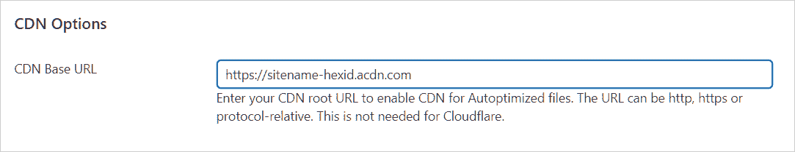

If you use Kinsta CDN, you don’t need to enter anything in CDN Options.

### 缓存信息

Autoptimize 的“缓存信息”显示重要信息，如缓存文件夹的位置和权限，以及缓存的样式和脚本的总大小。如果你在“我们能写吗？”旁边看到“不”，您需要与您的主机合作来修复文件夹权限。

[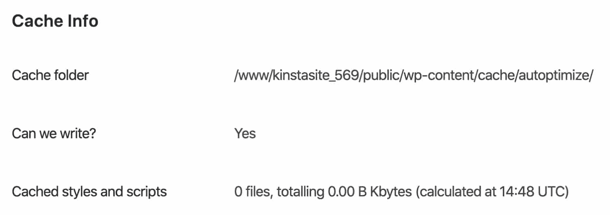](https://kinsta.com/wp-content/uploads/2020/04/autoptimize-cache-info.jpg)

Autoptimize cache info.

### 杂项选项

自动优化有一些杂七杂八的优化设置。如果您在获取优化的 CSS 和 JS 文件以加载到您的网站上时遇到问题，您可能需要重新配置下面的一些设置。

[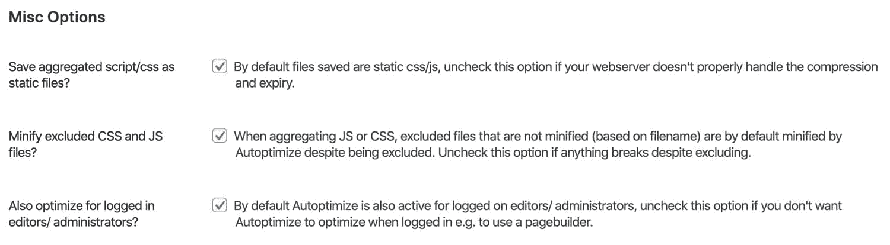](https://kinsta.com/wp-content/uploads/2020/04/autoptimize-misc-optimization.jpg)

Miscellaneous optimizations in Autoptimize.

#### 将聚合脚本/CSS 保存为静态文件

我们建议启用此选项，将聚合文件保存为本地静态文件。如果您的服务器未配置为处理文件压缩和过期，您可能需要禁用此功能。

#### 缩小排除的 CSS 和 JS 文件

我们建议启用此选项，以确保所有 CSS 和 JS 文件都被缩小。但是，如果您注意到某些排除的 CSS 和 JS 文件存在一些与缩小相关的问题，您可以继续禁用此选项。

#### 还针对登录的编辑/管理员进行了优化

我们建议启用此功能，以确保针对登录的编辑者和管理员优化资产。如果您以登录用户的身份测试自动优化设置，这一点很重要。

需要一个一流的，快速，安全的主机为您的新电子商务网站？Kinsta 提供超快的服务器和来自 WooCommerce 专家的 24/7 世界级支持。[查看我们的计划](https://kinsta.com/plans/?in-article-cta)

## 自动优化中的图像优化

自动优化功能内置了 ShortPixel，用于优化图像。除了图像质量设置，Autoptimize 的集成还允许您生成和[提供您的图像的 WEBP 版本](https://kinsta.com/blog/webp/)。

对于 Kinsta 用户，我们不建议使用自动优化中的图像优化功能。相反，我们建议直接使用来自 [ShortPixel](https://kinsta.com/blog/webp/#shortpixel) 或 [Imagify](https://kinsta.com/blog/webp/#imagify) 的全功能插件。有了完整的插件，你将对优化设置有更细粒度的控制，包括重写图像以使用`<picture>`标签，这是 Kinsta 上的 WEBP 支持所必需的。

[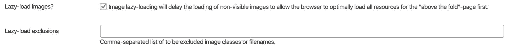](https://kinsta.com/wp-content/uploads/2020/04/autoptimize-lazy-load-images.jpg)

Lazy-load images with Autoptimize.

自动优化还包括图像的延迟加载功能。我们建议启用此功能，以提高大量图像页面的页面速度。启用延迟加载时，自动优化允许您从延迟加载中排除某些图像类和文件名。

排除设置对于图像很有用，如徽标、社交图标和其他不应该延迟加载的重要图像元素。如果你正在寻找一个对延迟加载提供更多控制的解决方案，看看我们在 WordPress 中关于延迟加载图像和视频的[指南。](https://kinsta.com/blog/wordpress-lazy-load/)

## 自动优化中的额外优化

[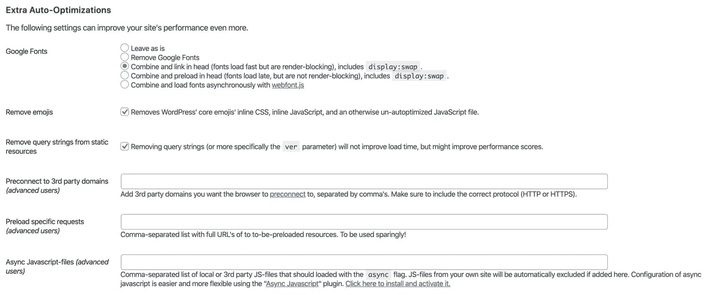](https://kinsta.com/wp-content/uploads/2020/04/autoptimize-extra-optimization.jpg)

Extra optimizations in Autoptimize.

#### 谷歌字体

自动优化有几个不同的选项来优化谷歌字体。你的最佳选择将取决于你的网站如何利用谷歌字体。

*   保持原样。
*   移除谷歌字体。
*   结合并链接在头部。
*   结合并预载在头部。
*   用 webfont.js 异步组合和加载字体。

我们不建议使用“保持原样”选项，因为它没有速度优势。

如果谷歌字体在你的网站上不是一个关键的需求，删除它们并使用一个[系统字体栈](https://woorkup.com/system-font/)可以对你的页面速度产生巨大的积极影响。

如果你想在你的网站上保留谷歌字体，我们建议测试最后三个选项，看看哪一个最适合你的网站。

#### 移除表情符号

这个自动优化选项删除了与 WordPress 核心表情符号相关的 CSS 和 JavaScript。我们建议启用此选项，因为它可以帮助您缩小页面大小。此外，大多数主流操作系统都带有包含表情符号的字体堆栈。当然，还有其他方法可以禁用你的 WordPress 网站上的表情符号。

#### 从静态资源中移除查询字符串

如果您想[删除查询字符串(例如？ver=)从静态资源](https://kinsta.com/knowledgebase/remove-query-strings-static-resources/)中，你可以启用这个选项。删除查询字符串不会影响加载时间，但它可能有助于提高你的网站在 [GTmetrix](https://kinsta.com/blog/gtmetrix-speed-test/) 、 [Google Pagespeed](https://kinsta.com/blog/google-pagespeed-insights/) 和其他性能测试服务中的得分。

#### 预连接到第三方域

preconnect 指令允许您的浏览器连接到指定的域，以在发送完整的 HTTP 请求之前处理 [DNS 查找](https://kinsta.com/blog/reduce-dns-lookups/)和 [SSL 握手](https://kinsta.com/knowledgebase/ssl-handshake-failed/)协商。

例如，如果您的站点有一个从`https://site.kinsta.cdn.com/logo.png`开始提供的徽标图像，您可以指示 Autoptimize 在 HTML 的`<body>`元素中发出 HTTP 请求之前，在`<head>`元素中添加一个 preconnect 指令来处理初始 DNS 和 SSL 连接。

您可以使用浏览器的开发工具或检查器来查找要预连接的重要外部域。在下面的示例页面中，有对以下域的外部请求。

*   `https://cdn.brianli.com`
*   `https://www.google-analytics.com`
*   `https://www.googletagmanager.com`

这三个域可以添加到自动优化的预连接列表中。

[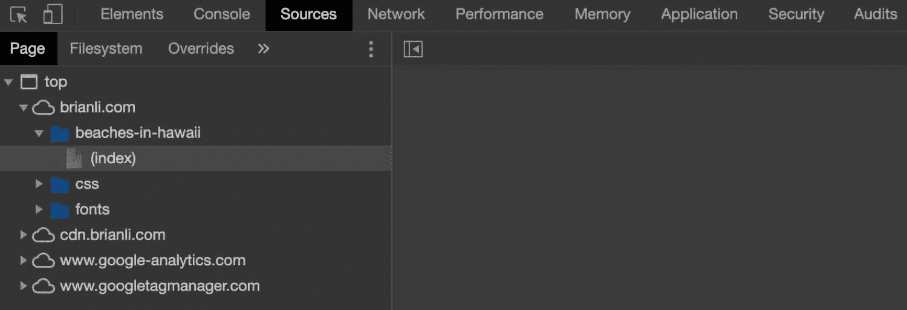](https://kinsta.com/wp-content/uploads/2020/04/chrome-developer-tools-sources.jpg)

Find external assets with developer tools.

出于性能原因，我们建议在 Autoptimize 的预连接列表中添加不超过六个域，因为为太多域指定预连接指令会导致性能下降。

#### 预加载特定请求

[预加载指令](https://kinsta.com/blog/google-pagespeed-insights/#18-preload-key-requests)指示您的网络浏览器尽快下载资产。该指令对于下载在页面加载过程中很早就需要的资产非常有用。实际上，预加载通常用于加快自定义字体的加载速度，方法是在页面的 CSS 中请求字体之前加载它们。

我们建议向开发者咨询哪些资产，如果有的话，可以预加载到你的 WordPress 站点上。与许多其他性能相关的调整一样，预加载太多资产会导致您的网站加载速度变慢。

#### 异步 JavaScript 文件

Autoptimize 的“异步 JavaScript 文件”特性允许您通过`async` HTML 标志指定某些外部 JavaScript 文件来异步加载。虽然异步加载 JS 文件可以提高页面速度，但我们建议进行充分的测试，以确保不会影响网站功能。

[If you're not already using Autoptimize, you'll want to add this WordPress optimization plugin to your site ASAP after reading this guide 🚀Click to Tweet](https://twitter.com/intent/tweet?url=https%3A%2F%2Fkinsta.com%2Fblog%2Fautoptimize-settings%2F&via=kinsta&text=If+you%27re+not+already+using+Autoptimize%2C+you%27ll+want+to+add+this+WordPress+optimization+plugin+to+your+site+ASAP+after+reading+this+guide+%F0%9F%9A%80&hashtags=wordpress%2Cplugin)

## 摘要

如果你知道如何调整设置，自动优化插件是 WordPress 用户提升网站性能的可靠选择。

有了 HTML 和 CSS 优化这样的基本功能和更高级的功能，比如指定预连接和预加载指令的能力，Autoptimize 有了优化你的 WordPress 站点前端性能所需的一切。

如果你有兴趣了解更多关于 WordPress 优化和如何优化你的网站后端的知识，一定要看看我们的[全面的 WordPress 性能指南](https://kinsta.com/learn/speed-up-wordpress/)。

* * *

让你所有的[应用程序](https://kinsta.com/application-hosting/)、[数据库](https://kinsta.com/database-hosting/)和 [WordPress 网站](https://kinsta.com/wordpress-hosting/)在线并在一个屋檐下。我们功能丰富的高性能云平台包括:

*   在 MyKinsta 仪表盘中轻松设置和管理
*   24/7 专家支持
*   最好的谷歌云平台硬件和网络，由 Kubernetes 提供最大的可扩展性
*   面向速度和安全性的企业级 Cloudflare 集成
*   全球受众覆盖全球多达 35 个数据中心和 275 多个 pop

在第一个月使用托管的[应用程序或托管](https://kinsta.com/application-hosting/)的[数据库，您可以享受 20 美元的优惠，亲自测试一下。探索我们的](https://kinsta.com/database-hosting/)[计划](https://kinsta.com/plans/)或[与销售人员交谈](https://kinsta.com/contact-us/)以找到最适合您的方式。