# 如何解决“啊，啪！”Chrome 中的错误(8 种方法)

> 原文：<https://kinsta.com/blog/aw-snap-chrome-error/>

尽管谷歌 Chrome 经常是可靠的，但它并不是完全不会出错。当你浏览互联网时，你可能会看到一个加载错误，并伴有“啊，啪！”消息。这将出现，而不是您想要查看的网页。

幸运的是，您可以快速轻松地修复 Aw Snap Chrome 错误。通常，当您简单地重新加载页面或清除浏览器缓存时，这种情况就会消失。但是，如果问题仍然存在，您还可以尝试更高级的解决方案。

在这篇文章中，我们会给你一个“啊，啪！”误差及其主要原因。然后，我们将向您展示解决这个问题的八种简单方法。我们开始吧！

## 什么是“啊，啪！”错误？(加上是什么原因造成的)

目前，谷歌 Chrome 占据了桌面浏览器市场份额的 77%。这使它成为网上冲浪最受欢迎的渠道:

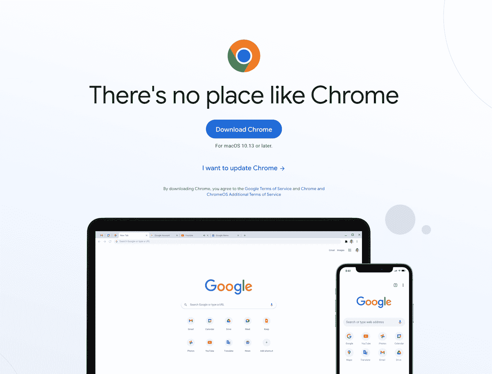

Google Chrome

当你使用 Chrome 时，你可能会遇到[加载错误](https://kinsta.com/topic/chrome-errors/)。最常见的信息之一是“啊，啪！”错误:

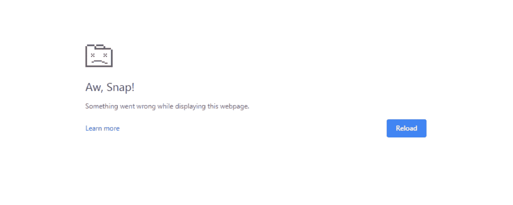

Aw Snap Chrome error

此错误代码将阻止您继续浏览在线内容。当这种情况发生时，Chrome 页面会加载缓慢或者根本打不开。

> 需要在这里大声喊出来。Kinsta 太神奇了，我用它做我的个人网站。支持是迅速和杰出的，他们的服务器是 WordPress 最快的。
> 
> <footer class="wp-block-kinsta-client-quote__footer">
> 
> 
> 
> <cite class="wp-block-kinsta-client-quote__cite">Phillip Stemann</cite></footer>

[View plans](https://kinsta.com/plans/)

自从“啊，太棒了！”消息是一个一般性错误，它可能有多种原因。有时，谷歌 Chrome 会遇到一次性加载问题，只需重新加载页面即可解决。

[Click to Tweet](https://twitter.com/intent/tweet?url=https%3A%2F%2Fkinsta.com%2Fblog%2Faw-snap-chrome-error%2F&via=kinsta&text&hashtags=Chrome%2CWebTips)

在其他情况下，您的设备可能[耗尽可用内存](https://kinsta.com/knowledgebase/wordpress-memory-limit/)。如果你打开了太多的标签页或应用程序，Chrome 可能很难加载新的网页。

以下是您可能会看到“啊，啪！”错误:

*   浏览器数据损坏
*   错误的扩展
*   [恶意软件](https://kinsta.com/blog/types-of-malware/)
*   不稳定的互联网连接

由于有如此多的潜在原因，当这个错误发生时，你可能会不知所措。然而，你不应该太担心，因为这是 Chrome 用户的常见问题，你可以很容易地进行故障诊断和确定哪里出错了。

## 如何解决“啊，啪！”Chrome 中的错误(8 种方法)

一旦你遇到 Aw Snap Chrome 错误，处理起来可能会令人沮丧。为了帮助您恢复正常浏览，我们来讨论一些修复此问题的有效方法！

### 1.重新加载页面

当 Chrome 发出“啊，啪！”消息，它可能在加载过程中遇到了问题。在尝试更高级的故障排除方法之前，只需重新加载页面即可。如果是暂时的故障，这可能会消除错误。

在桌面设备上，只需找到左上角的刷新图标:

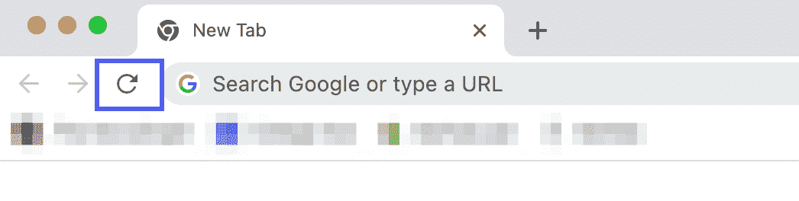

Reload Chrome button

根据您的操作系统，您也可以使用一些[键盘快捷键](https://kinsta.com/blog/wordpress-keyboard-shortcuts/):

*   **Windows 和 Linux** : F5 或 Ctrl + R
*   **Mac** : Command + R

如果您使用的是手机或平板电脑等移动设备，刷新过程会有所不同。在 Chrome 应用程序中，选择三点图标并点击**重新加载**:

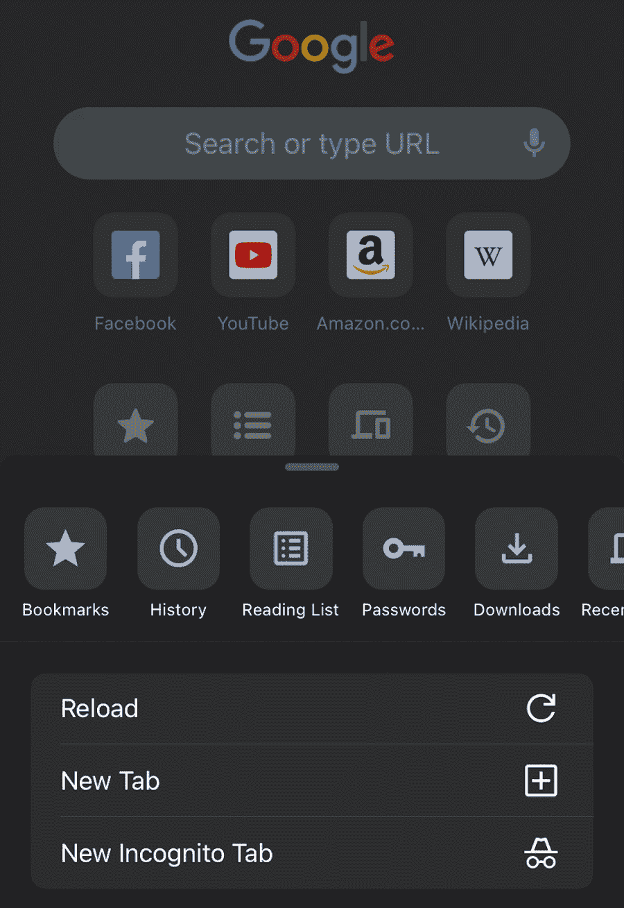

Reload Chrome in mobile

在许多情况下，这将解决错误。然而，如果你仍然看到“啊，啪！”消息，是时候尝试替代方法了。

### 2.检查不稳定的互联网连接

Aw Snap Chrome 错误的另一个可能原因是互联网连接不良。如果你的电脑或移动设备没有正确连接到 Wi-Fi 或有线网络，Chrome 将无法加载任何在线内容。

首先，尝试将您的设备置于飞行模式几秒钟。这将断开它与任何网络的连接。然后，关闭它并重新加载页面。

如果问题仍然存在，我们建议删除不必要的操作。例如，您应该禁用任何占用不必要带宽的下载、流媒体和游戏。

你也可以使用[虚拟专用网络(VPN)](https://kinsta.com/blog/proxy-vs-vpn/) 。虽然这有助于您更安全地浏览，但它可能会导致 Aw Snap Chrome 错误。要成功重新加载页面，请尝试禁用您的 VPN。

另一方面，您的设备可能没有连接到互联网。如果您使用的是 Wi-Fi，请重置整个路由器。如果手机信号不好，你必须找到一个服务更好的位置。

### 3.清除您的浏览器缓存

当你第一次访问一个网站时，你的浏览器必须向它的服务器请求该网站的数据。为了避免每次返回时重复这个过程，您的浏览器会将这个[数据保存在缓存](https://kinsta.com/blog/what-is-cached-data/)中。这可以加快回访的加载时间。

虽然缓存数据有它的好处，但它也会导致加载问题。如果缓存损坏，这可能是“啊，啪！”错误消息。

对于下一个故障诊断步骤，谷歌建议[清除你的浏览器缓存](https://kinsta.com/knowledgebase/how-to-clear-browser-cache/)。为此，找到右上角的三点图标。然后，点击**更多工具>清除浏览数据**:

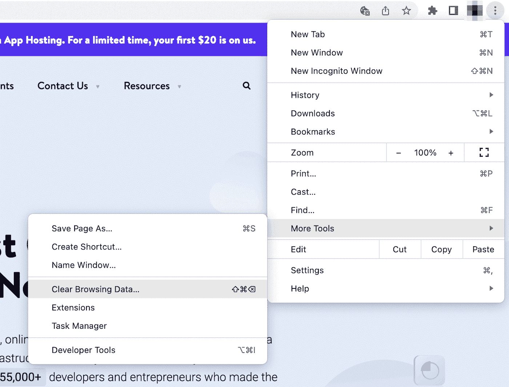

Clear Chrome browsing data

这将打开一个弹出窗口，您可以在其中自定义要清除的信息。在**基本**选项卡下，务必选择**缓存图像和文件**:

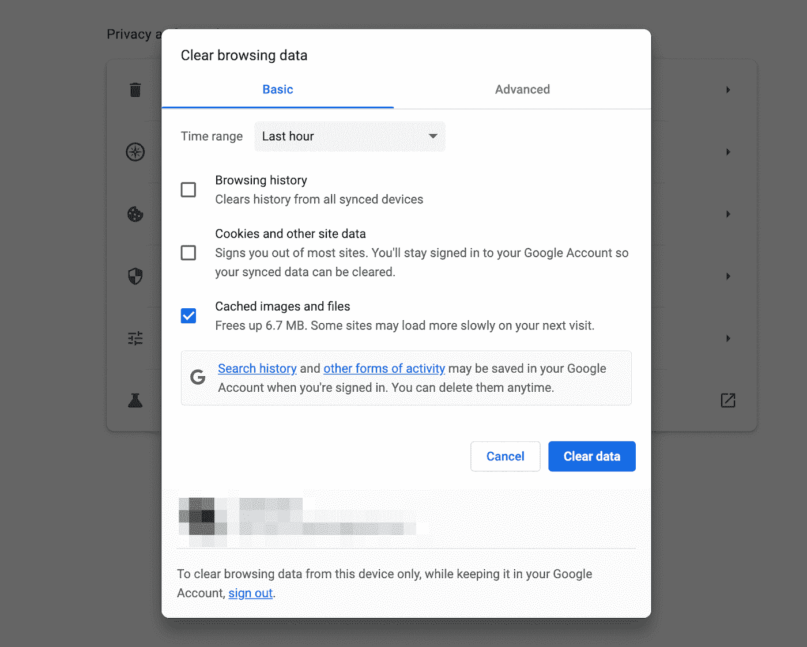

Clear cached images and files

点击**清除数据**后，尝试重新加载您试图访问的网站。如果它加载了，您将知道您的缓存数据有问题。

为了防止这种情况再次发生，导航到**隐私和安全>cookie 和其他网站数据**。在这个页面上，可以随意屏蔽[第三方 cookie](https://kinsta.com/blog/cookieless-future/)。您也可以选择在关闭窗口后清除 cookies:

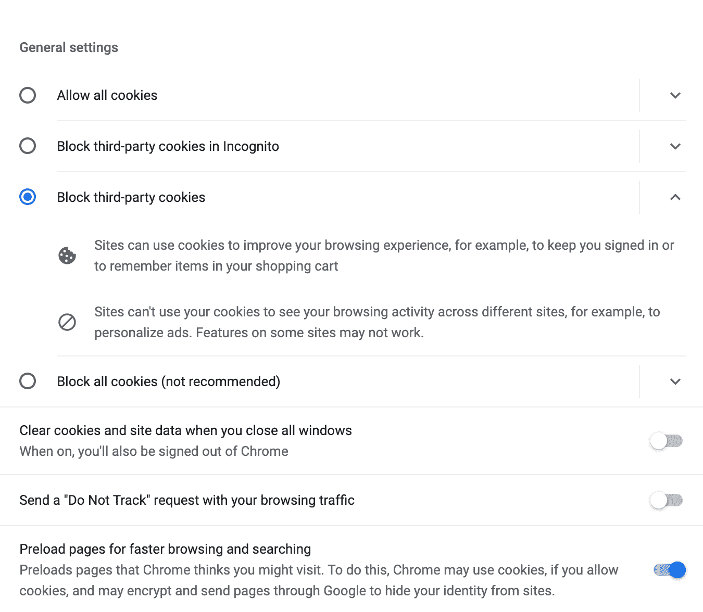

Chrome cookie settings

这基本上可以自动执行 cookie 删除过程。但是，请记住，如果没有 [cookies](https://kinsta.com/blog/wordpress-cookies-php-sessions/) ，您可能会有较慢的浏览体验。

### 4.打开一个匿名标签

如果你不想完全清空你的浏览器缓存，你可以简单地在[隐名模式](https://kinsta.com/knowledgebase/incognito-mode/)下打开页面。这是一个私人浏览器，防止 Chrome 保存任何 cookies、网站数据、表单条目或浏览历史。

## 注册订阅时事通讯

### 想知道我们是怎么让流量增长超过 1000%的吗？

加入 20，000 多名获得我们每周时事通讯和内部消息的人的行列吧！

[Subscribe Now](#newsletter)

你需要做的就是再次打开 Chrome 菜单，点击**新隐身窗口**:

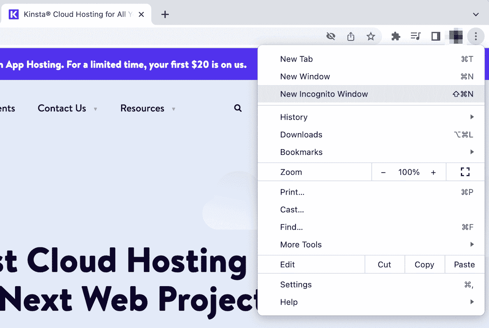

Chrome incognito window

或者，以下是此过程的一些快捷方式:

*   **Windows** : Control + Shift + N
*   **Mac** : Command + Shift + N

当你使用 Chrome 移动应用程序时，这将位于**新的匿名标签**下:

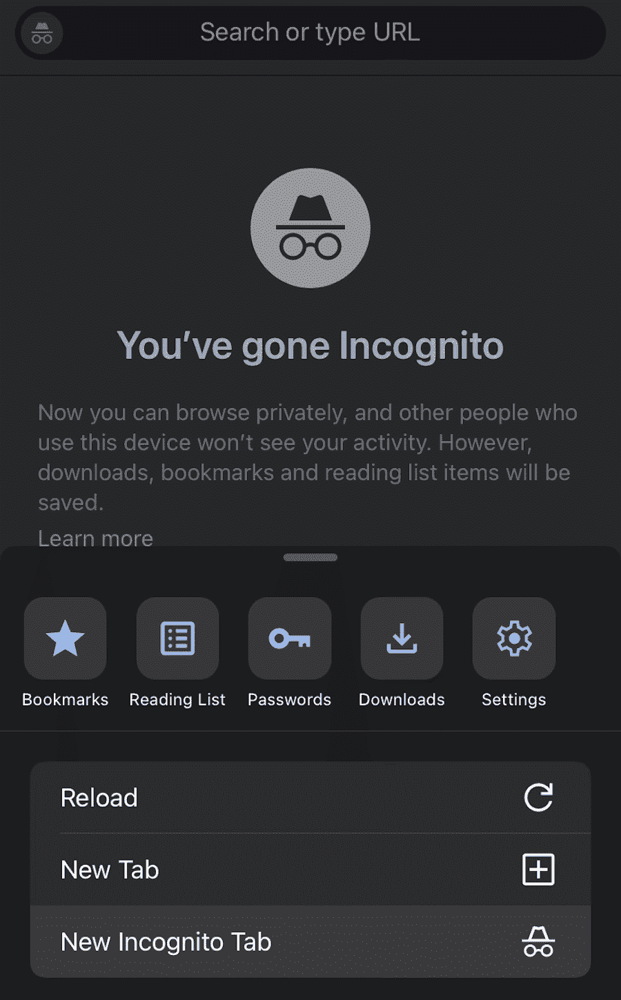

Mobile incognito tab

在新窗口中，输入您试图访问的网页的 URL。如果加载正确，问题出在你的缓存或者浏览器扩展。由于隐姓埋名模式暂时禁用了这些功能，它可以让您绕过“啊，啪！”错误。

### 5.禁用扩展

当你使用谷歌浏览器时，你可以[安装不同的扩展](https://kinsta.com/blog/best-chrome-extensions/)来提高你的生产力和自动化必要的任务。由于这些包含第三方软件，它们有时编码很差。这意味着一些浏览器扩展可能会与 Chrome 发生冲突，导致“啊，啪！”错误。

要禁用您的扩展，请点击**更多工具**。然后，选择**分机**:

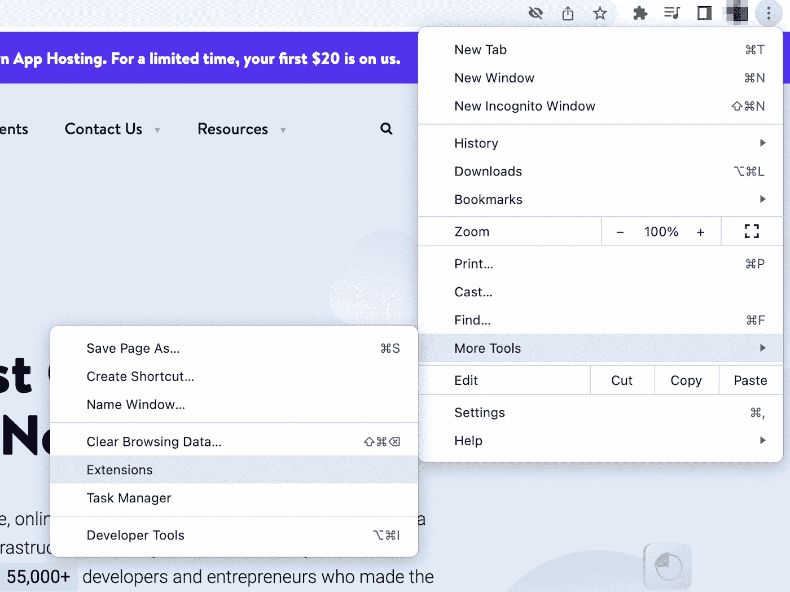

Open Chrome extensions

这将打开一个你的 Chrome 扩展列表。使用拨动开关，您可以关闭每个开关:

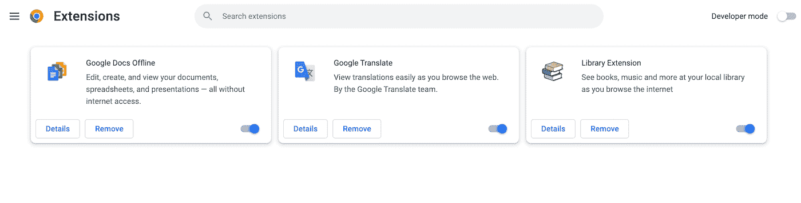

Disable Chrome extensions

之后，重新加载 Chrome 页面。如果它完全呈现，您将知道这些扩展之一是错误的原因。

在这种情况下，请返回到您的扩展页面并逐个启用它们。打开分机后，点击**重新加载**。

每当错误再次出现时，请注意您刚刚激活了哪个扩展。然后，您可以完全删除该软件。

Struggling with downtime and WordPress problems? Kinsta is the hosting solution designed to save you time! [Check out our features](https://kinsta.com/features/)

### 6.更新谷歌浏览器

作为 Chrome 的普通用户，你可能已经知道它执行[自动软件更新](https://kinsta.com/blog/wordpress-automatic-updates/)。但是，您可能会在不知不觉中使用旧版本，而没有意识到这一点。如果您的浏览器没有获得一致的性能和安全更新，它可能会有更多的崩溃，故障或加载问题。

如果你不确定是否需要更新 Chrome，检查你当前的版本是相当容易的。你只需要打开 Chrome **设置**:

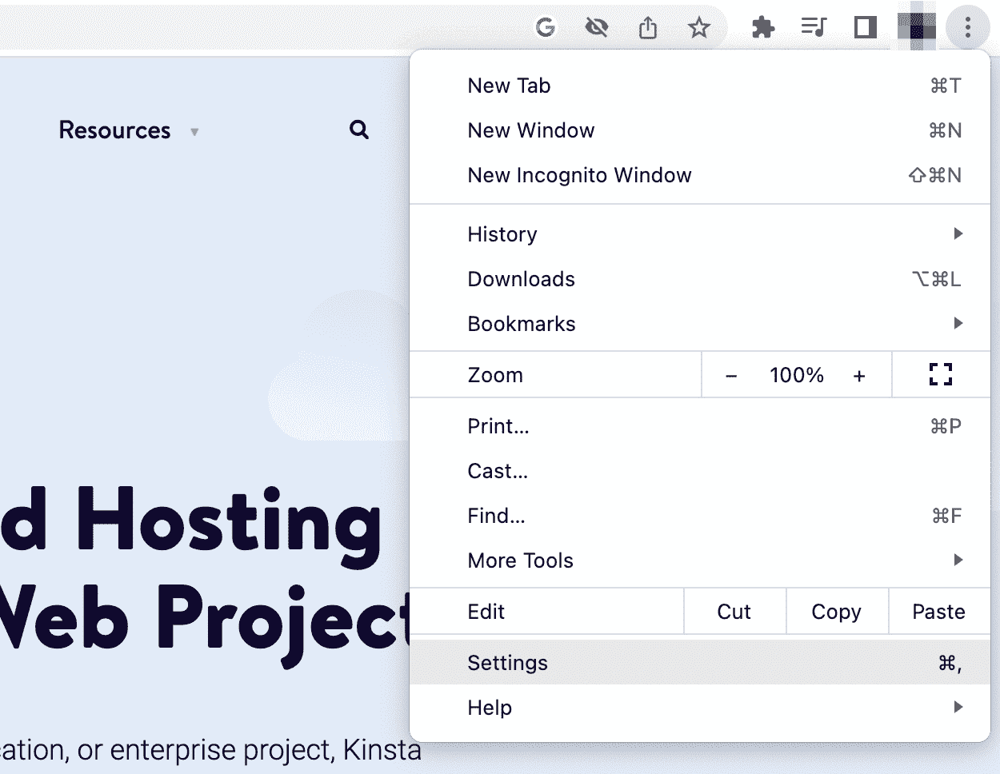

Chrome settings

在你点击**关于 Chrome** 之后，它会检查你的软件是否是最新的。如果有任何可用的新版本，请务必安装它们:

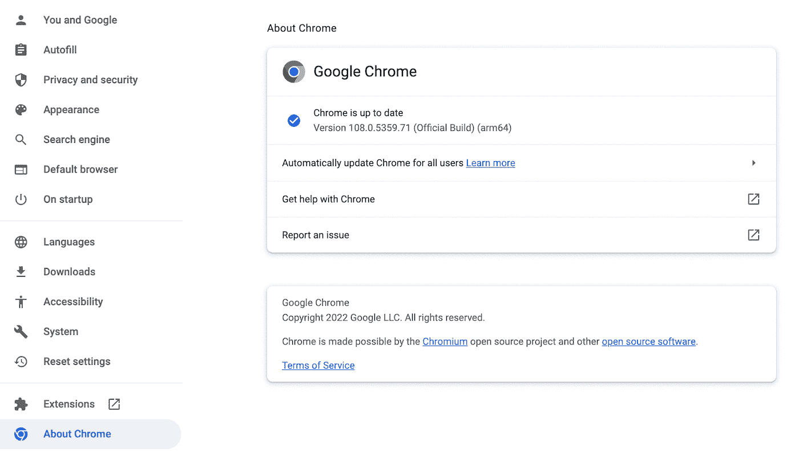

Update Google Chrome

如果你仍然不能进行在线搜索，你的软件可能不是问题所在。当你看到一个持续的错误，继续下一个方法！

### 7.重新启动您的设备

即使进行了大量的故障诊断，您也可能无法找到“啊，啪！”错误。如果发生这种情况，你可以尝试重新启动谷歌浏览器和你的个人设备。这还会关闭任何可能造成不兼容问题的正在运行的程序或应用程序。

首先，完全关闭 Chrome 应用程序。然后，重新打开它，再次输入目标 [URL](https://kinsta.com/knowledgebase/what-is-a-url/) 。有时，这将刷新 Chrome 并使您能够查看内容。

或者，您的设备可能需要简单的刷新。若要修复错误，请关闭您的计算机、手机或平板电脑。

不管你的操作系统是什么，你通常都可以在主菜单中关闭电脑。例如，苹果电脑在苹果菜单中有**重启**和**关机**按钮:

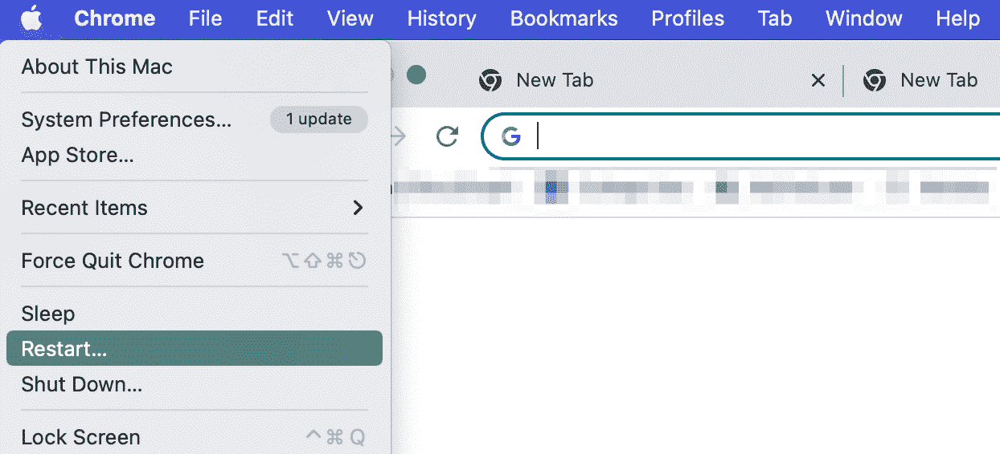

Restart Mac computer

对于安卓手机，你需要按住电源键。同样，iPhones 要求你同时按下音量和侧边按钮。

关闭设备后，请将其重新打开。如果 Chrome 加载成功，这可能是一个短期故障。

### 8.查找并删除恶意软件

在更严重的情况下，Aw Snap Chrome 错误可能是您设备上的恶意软件造成的。虽然这可能令人害怕，但这里有一些安全漏洞的主要警告信号:

*   奇怪的广告和弹出窗口
*   对浏览器的未经授权的更改
*   装载速度慢
*   重新显示扩展或工具栏
*   重定向到不熟悉的页面
*   [杀毒软件](https://kinsta.com/blog/wordpress-security-plugins/)警报

如果你需要从 Windows 电脑上移除恶意软件，Chrome 有一个内置的清理工具。要找到它，请进入**设置>高级>重置并清理>清理电脑**:

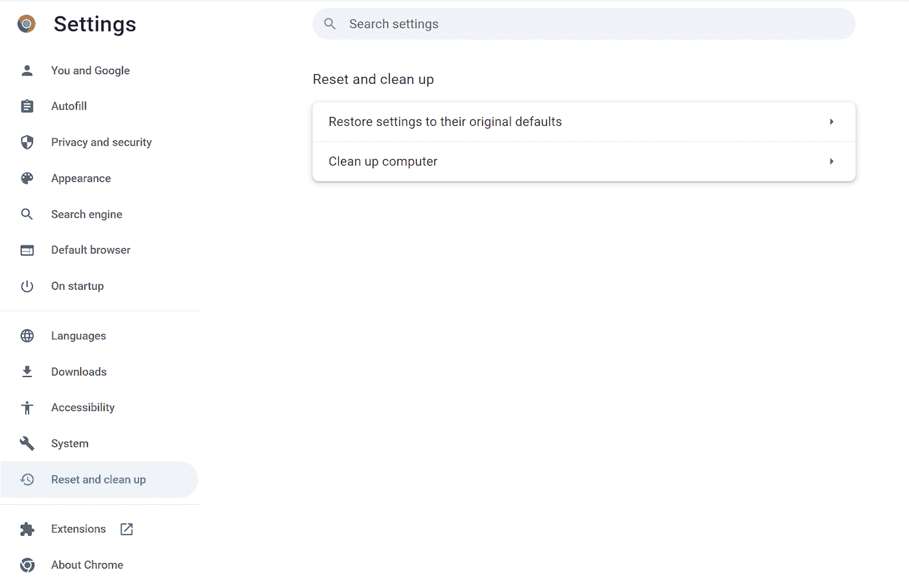

Reset and clean up settings in Windows

然后，点击**查找**，这样 Chrome 就可以[扫描恶意软件](https://kinsta.com/blog/scan-wordpress-for-malware/)。一旦它提醒你不需要的软件，点击**删除**。

在 Mac 电脑上，你可以在已安装的程序中搜索不熟悉的软件。一旦发现可疑的应用程序，右键单击并选择**移至垃圾箱**:

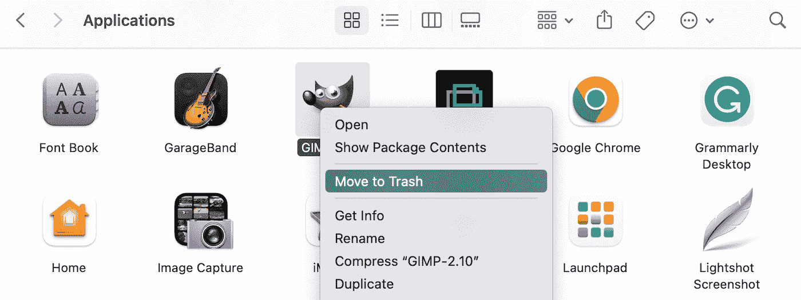

Remove Mac application

作为最后一招，考虑将 Chrome 重置为默认配置。在**设置**页面，点击**重置设置**选项卡:

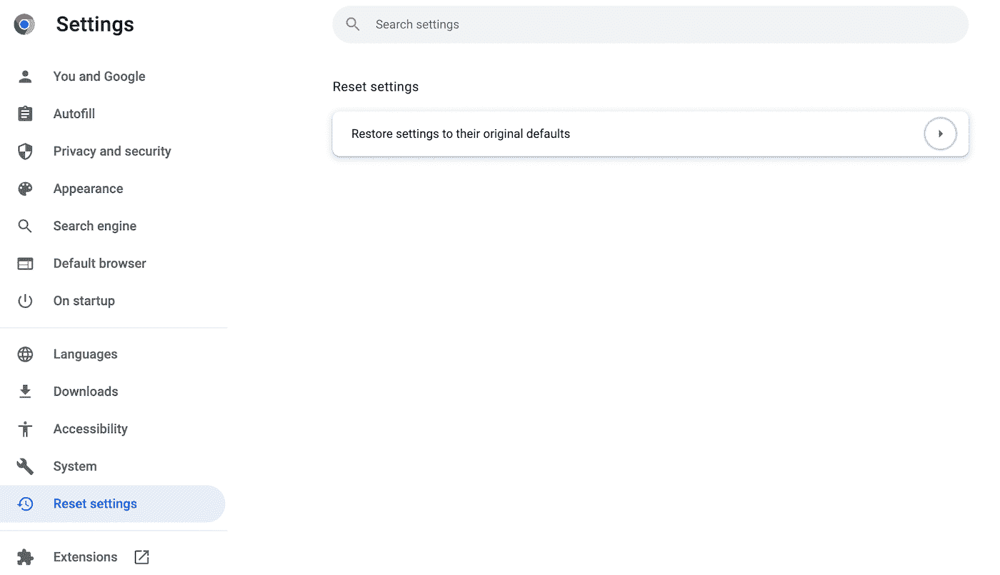

Reset Chrome settings

最后，点击**将设置恢复到原始默认值**。您必须在弹出窗口中确认此操作:

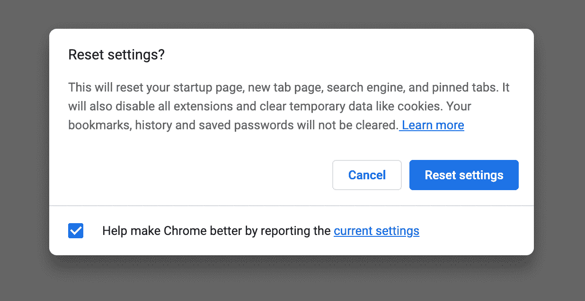

Confirm Chrome settings reset

现在 Chrome 应该又能正常运行了！

[Click to Tweet](https://twitter.com/intent/tweet?url=https%3A%2F%2Fkinsta.com%2Fblog%2Faw-snap-chrome-error%2F&via=kinsta&text&hashtags=Chrome%2CWebTips)

## 摘要

当你在网上搜索内容时，你可能会意外地发现一个 Chrome 错误信息，标签为“啊，啪！”如果您的 internet 连接不良、缓存数据损坏或扩展名不兼容，此错误可能会阻止您正常浏览。

Aw Snap Chrome 错误的一些简单解决方案是重新加载页面，检查您的互联网连接，并打开一个私人浏览器。如果这些策略都不能解决问题，你可以尝试清理浏览器缓存、禁用扩展或更新谷歌浏览器。

作为网站所有者，您会希望确保任何人都可以轻松访问您的内容。有了 [Kinsta 托管计划](https://kinsta.com/plans/)，内置的性能监控可以让您的网站保持在线并正常工作！

* * *

让你所有的[应用程序](https://kinsta.com/application-hosting/)、[数据库](https://kinsta.com/database-hosting/)和 [WordPress 网站](https://kinsta.com/wordpress-hosting/)在线并在一个屋檐下。我们功能丰富的高性能云平台包括:

*   在 MyKinsta 仪表盘中轻松设置和管理
*   24/7 专家支持
*   最好的谷歌云平台硬件和网络，由 Kubernetes 提供最大的可扩展性
*   面向速度和安全性的企业级 Cloudflare 集成
*   全球受众覆盖全球多达 35 个数据中心和 275 多个 pop

在第一个月使用托管的[应用程序或托管](https://kinsta.com/application-hosting/)的[数据库，您可以享受 20 美元的优惠，亲自测试一下。探索我们的](https://kinsta.com/database-hosting/)[计划](https://kinsta.com/plans/)或[与销售人员交谈](https://kinsta.com/contact-us/)以找到最适合您的方式。