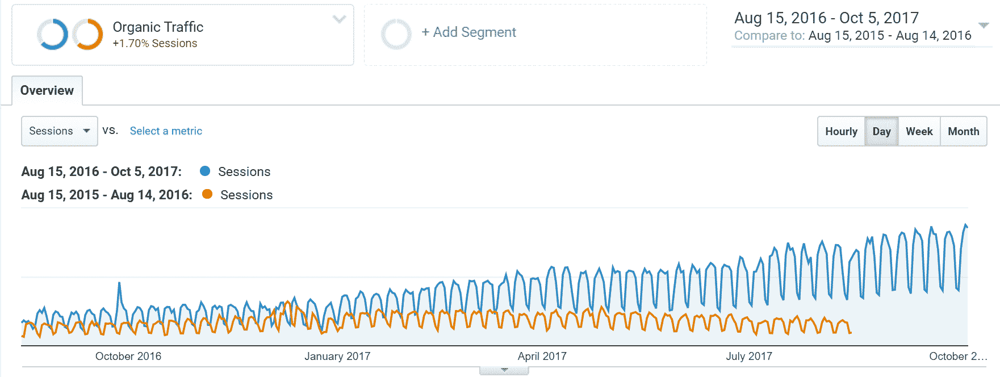

# B2B 销售线索挖掘——2022 年的 11 个技巧和策略

> 原文：<https://kinsta.com/blog/b2b-lead-generation/>

领导不仅仅是一个随机的潜在客户。就是离你只有一步之遥的那个。你只需要抓住他们的注意力，提供价值，证明你的服务能解决他们的问题。

产生高质量的销售线索是一个好的 B2B 营销策略的基础，建立一个强大的渠道将确保你保持稳定的增长率。与 B2C 相比， [B2B 营销有很大不同。](https://kinsta.com/blog/b2b-vs-b2c/)

我们发现，将内向和外向结合使用通常是建立这一渠道的最佳方式——虽然[外向是与销售线索](https://kinsta.com/blog/outbound-marketing/)联系的更直接的方式，但你的[内向可以用来建立你的可信度](https://kinsta.com/blog/inbound-marketing/)，从而让更多合格的销售线索来到你面前。以下是 B2B 营销中最有效的线索生成策略。

1.  [内容营销](#content-marketing)
2.  [社交媒体营销](#social-media-marketing)
3.  [PPC–点击付费](#ppc)
4.  [获得更多社交份额](#social-shares)
5.  [把“缺货”变成机会](#out-of-stock)
6.  [使用教父策略建立你的邮件列表](#godfather-strategy-email-list)
7.  [利用 FOMO 提高你的转化率](#fomo)
8.  [在关键页面上使用意向弹出窗口或滑动选择选项](#intent-popups)
9.  [提问获得 50%转化率](#ask-questions)
10.  [获得可信的反向链接](#trusted-backlinks)
11.  [利用冰冷的电子邮件发挥创意](#creative-cold-emails)

## 1.内容营销

对于那些有有趣内容可以分享的公司来说，这是一个非常好的选择:文章、视频等等。为了让它工作，你应该做非常深入的研究，知道你应该使用什么样的语言；你的客户会喜欢什么内容；他们听谁的等等。

了解你的目标群体，给他们提供**高质量的文案**。这将为你的网站提供很棒的[搜索引擎优化(SEO)](https://kinsta.com/blog/wordpress-com-to-wordpress-org/) 。SEO 是以一种典型的无目标的方式增加页面浏览量，这样更多的潜在客户会通过[搜索引擎](https://kinsta.com/blog/alternative-search-engines/)找到你的网站。

搜索引擎可以是营销任何业务的最佳工具之一。如果你在搜索引擎优化方面取得了成功，你将更快地获得新客户，而且基本上是免费的。为了赢得搜索引擎优化游戏，你应该有一个强大的内容营销战略，提供你的目标受众会发现价值的信息。

确保有一个策略，不仅是对你的客户最好的，而且是你的团队可以持续保持的。

像 [Ahrefs](https://ahrefs.com) (反向链接、[关键词研究、](https://kinsta.com/blog/keyword-research/)和竞争对手研究)和 [Accuranker](https://accuranker.com) (关键词排名跟踪)这样的工具可以帮助你的企业保持领先地位。Kinsta 使用了这些工具，并能够在短短 13 个月内将他们的有机流量增加 571%，从而带来更多 B2B 销售线索。查看他们完整的 [WordPress SEO 指南](https://kinsta.com/blog/wordpress-seo/)了解所有的细节和这些 [77 个行之有效的策略来为你的网站带来更多的流量](https://kinsta.com/blog/how-to-drive-traffic-to-your-website/)。

Organic traffic increase in 13 months

专业提示:一旦你准备好工具、计划和策略**，确保保持一致**。不幸的是，这是许多公司没有做到的一件事，那就是坚持。

[Content marketing is undeniably one of the best sources for #B2B leads. 👍 Remember, business decision-makers read content just like the rest of us.Click to Tweet](https://twitter.com/intent/tweet?url=https%3A%2F%2Fbit.ly%2F2D2rORv&via=kinsta&text=Content+marketing+is+undeniably+one+of+the+best+sources+for+%23B2B+leads.+%F0%9F%91%8D+Remember%2C+business+decision-makers+read+content+just+like+the+rest+of+us.)

## 2.社交媒体营销

社交媒体允许您优化您的销售线索生成流程，因为它允许更有针对性的方法。62%的营销人员认为，像 LinkedIn 这样的社交网络被证明能够有效地产生潜在客户(建议阅读:[如何在 LinkedIn 上创建公司页面](https://kinsta.com/blog/how-to-create-a-company-page-on-linkedin/))。它为企业和品牌提供了一个与潜在客户互动的平台。

此外，[社交媒体广告](https://www.mixbloom.com/resources/tactics-promoting-content-social-media/)非常有效，尤其是现在很少见到没有脸书、推特或 Instagram 账户的人。放在这些网站上的广告具有很强的针对性，因为你可以设置位置、年龄、性别和兴趣等。

你可以通过社交媒体获得大量线索，但这并不容易，需要深思熟虑的策略。

加里·维纳查克强烈推荐一本名为[刺拳，刺拳，刺拳，右勾拳](https://www.amazon.com/Jab-Right-Hook-Story-Social/dp/006227306X/ref=sr_1_4?ie=UTF8&keywords=Gary+Vaynerchuk&qid=1489417327&sr=8-4)的书，这本书是了解什么能给你带来最佳效果的好方法。这本书谈到了社交媒体平台上的沟通，其方法是“戳”是你的目标受众感兴趣的内容，而不是销售信息。“右钩”是一种营销/销售信息，带有行动号召，例如填写此表格、购买此产品、分享此优惠。你应该为每一个右钩拳刺三次。

一个很好的例子是 Kinsta 在他们的 [PHP 基准测试](https://kinsta.com/blog/php-benchmarks/)文章上发布的广告。Kinsta 没有在 Twitter 广告中直接销售任何东西，但它是有针对性的内容，他们知道 WordPress 开发者的受众会感兴趣。“右钩”然后被放置在博客帖子本身，以生成 B2B 线索。

> 最终的 PHP 5.6、7.0、7.1、7.2 和 HHVM 基准测试(2018)🚀[https://t.co/TkmPvA7xn1](https://t.co/TkmPvA7xn1)pic.twitter.com/QIB7wdLgPXT2
> 
> ——金塔(@金塔)[2018 年 2 月 27 日](https://twitter.com/kinsta/status/968537380582957056?ref_src=twsrc%5Etfw)