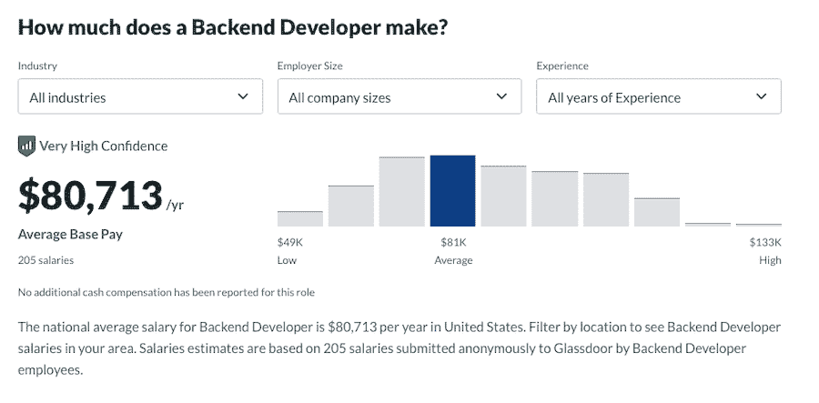
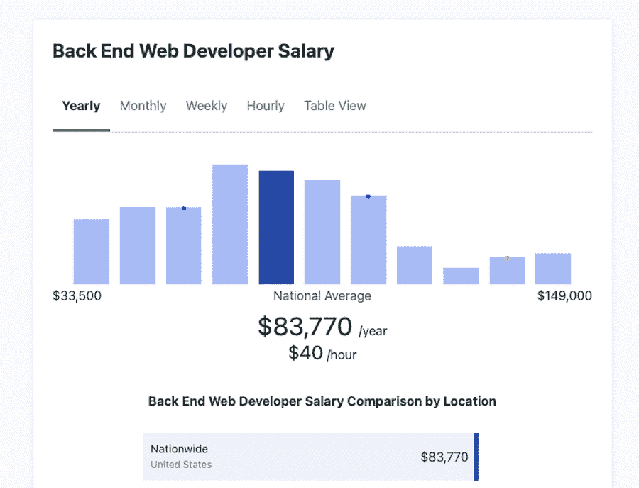
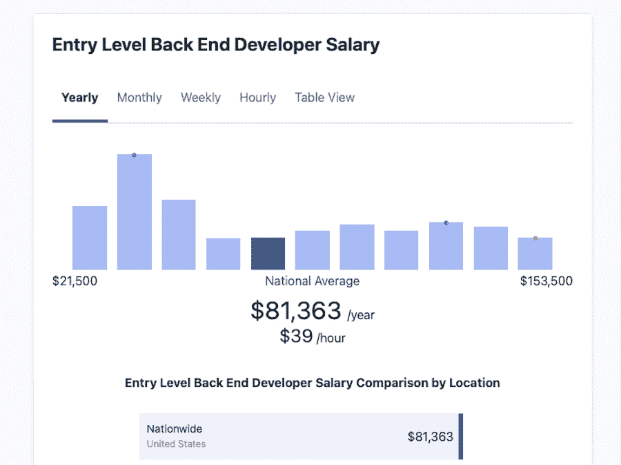
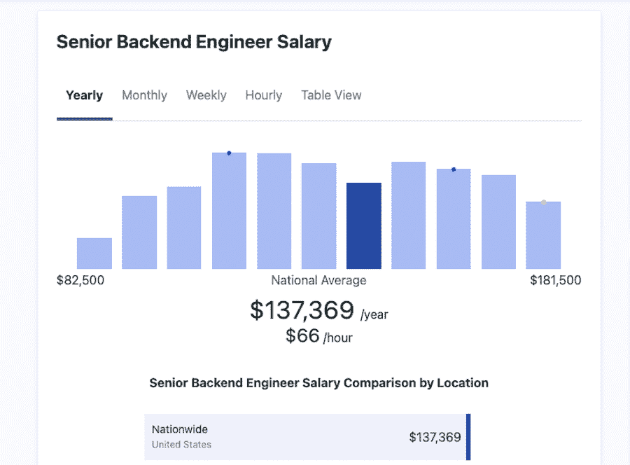
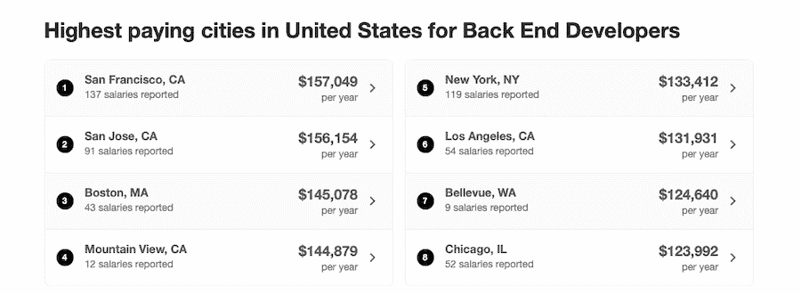
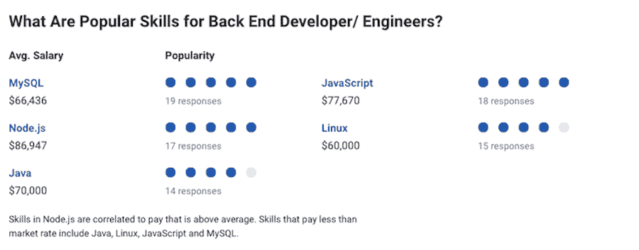

# 一般后端开发人员的工资是多少？2022 年最新数据

> 原文：<https://kinsta.com/blog/backend-developer-salary/>

我们之前的一篇关于[全栈开发人员薪水的文章](https://kinsta.com/blog/full-stack-developers-salary/)提到了前端开发人员和后端开发人员之间的区别。

虽然全栈开发是一条令人兴奋和充满活力的职业道路，但它并不适合所有人。因此，如果你考虑从事编程工作，你可能会寻找更多关于后端开发的信息。这就是我们制作这份指南的原因。

我们将讨论后端开发包括什么，对后端开发人员的需求，以及后端开发人员的平均工资。我们还会将平均工资与类似的工作进行比较。

到本文结束时，您将知道如果您决定走这条职业道路，您可以期待什么，以及成为后端开发人员是否值得。

### 查看我们的[视频指南](https://www.youtube.com/watch?v=YbOCpNGw1Mc)成为一名网页开发者

## 后端开发:是什么？

顾名思义，后端开发指的是使用后端技术。如果你从事后端开发，你将在幕后工作，以确保前端的一切顺利运行。

你将使用[数据库](https://kinsta.com/knowledgebase/wordpress-database/)、服务器技术、API 和各种[基于云的平台](https://kinsta.com/blog/cloud-market-share/)，以及服务器端开发的其他元素。

让我们更深入地了解一下后端开发人员的工作要求和职责。

[想知道你能够(或者应该！)做后台开发？💰继续读...👀 点击推文](https://twitter.com/intent/tweet?url=https%3A%2F%2Fkinsta.com%2Fblog%2Fbackend-developer-salary%2F&via=kinsta&text=Wondering+what+you+could+%28or+should%21%29+be+making+as+a+backend+developer%3F+%F0%9F%92%B0+Read+on...+%F0%9F%91%80&hashtags=WorkInTech%2CDeveloper)

### 后端开发人员的工作要求和职责

作为后端开发人员，您将编写服务器端脚本，创建负责帮助网站和应用程序与外部服务器通信的协议和例程，以便它们可以检索所有必要的信息。

您还将负责所有的服务器逻辑、数据库和客户机-服务器数据流。虽然你的大部分工作并不能立即看到，但确保任何网站或应用程序的核心平稳运行是至关重要的。

因此，如果您想满足后端开发人员的工作要求，您需要了解以下技术:

*   Java、C#、Visual Basic、Ruby、 [Python](https://kinsta.com/blog/python-object-oriented-programming/) 等高级编程语言的知识。通常，你还需要知道 [PHP](https://kinsta.com/knowledgebase/what-is-php/) 和 [JavaScript](https://kinsta.com/knowledgebase/what-is-javascript/) 。
*   相关框架的知识，如 [Laravel](https://kinsta.com/knowledgebase/what-is-laravel/) ，Django， [Node.js](https://kinsta.com/knowledgebase/what-is-node-js/) 等
*   Oracle、 [MySQL](https://kinsta.com/knowledgebase/what-is-mysql/) 或微软 [SQL Server](https://kinsta.com/blog/postgresql-vs-sql-server/) 等数据库的工作知识
*   数据结构和算法的知识
*   如果你想参与移动后端开发，了解 API 和 ORM。

值得一提的是，上面的列表并不意味着你必须精通所有这些语言、[框架](https://kinsta.com/blog/php-frameworks/)和数据库。学习它们的完整列表不仅会花费你数年的时间，而且几乎不可能全部掌握。

更好的办法是专攻一门特定的语言，并开发适合该语言的其他技术。大多数后端开发人员专注于一两种语言及其相关技术。不要忘记，随着你在你的领域获得经验，你可以在以后扩展你的技能。

### 后端开发人员技能

除了技术知识，你还需要一些额外的技能，这将使你作为后端开发人员的工作变得容易得多。其中包括:

*   高水平的数学教育或知识
*   分析思维和解决问题的技能
*   创新思维
*   良好的沟通技巧

上面列出的技能不仅能帮助你进行日常工作，还能帮助你将业务需求转化为功能代码。

### 后端开发者有需求吗？

[根据哥伦比亚工程训练营](https://bootcamp.cvn.columbia.edu/blog/back-end-developer-skills/)的消息，后端开发人员现在很抢手。这些说法得到了 [HubSpot 的研究](https://www.hubspot.com/marketing-statistics)的支持，该研究显示[全球电子商务零售额](https://kinsta.com/blog/ecommerce-statistics/)将超过 4.5 万亿美元——这是一个严重依赖后端开发者向其消费者提供最佳用户体验的行业。

来自美国劳工统计局的统计数据显示，由于移动设备和电子商务行业的普及，该行业到 2028 年将增长 13%。

考虑到这些统计数据，可以肯定地说，后端开发人员的职业前景一片光明。换句话说，如果你决定走这条职业道路，找到工作机会不会有问题。

### 信息

Kinsta 一直在为我们的远程团队寻找充满激情的开发人员。如果你感兴趣，请查看[我们的职业页面](https://kinsta.com/careers/)！

## 后端开发人员的平均工资

既然我们已经介绍了什么是后端开发，以及你在这个职位上取得成功所需的技能和知识，那么让我们来谈谈你期望的平均工资吧。

Backend developers salary range on Glassdoor.

根据 Glassdoor 的数据，后台开发人员的平均基本工资是 80713 美元，这是根据匿名提交给 Glassdoor 的 200 份薪水计算出来的。提交的最低工资约为 4.8 万美元，最高工资约为 13.2 万美元。

[实际上，根据 2200 美元的年薪计算，](https://www.indeed.com/career/back-end-developer/salaries)报告的数字更高，为 118856 美元。Indeed 还指出，作为后端开发人员，你每年可以获得 4000 美元的奖金。

PayScale 的数字更接近 Glassdoor，报告后端开发人员的平均年薪为 81，161 美元。这个数字是基于匿名提交给 PayScale 的 58 份薪水。根据工资标准，最低工资为 51，000 美元，最高工资为 131，000 美元。

Average backend web developer salary, according to ZipRecruiter.

另一方面， [ZipRecruiter](https://www.ziprecruiter.com/Salaries/Back-End-Web-Developer-Salary) 列出的后端开发人员平均年薪为 83770 美元，低端为 33500 美元，高端达到 149000 美元。

根据这些数字，后端开发人员的平均年薪是 90，826 美元。那一点也不差，但是和同类工作比起来怎么样？

下面，我们将看看典型的后端开发人员工资与前端和全栈开发人员工资的对比，以及收入潜力如何因经验、地点和您擅长的编程语言而异。

### 后端与前端开发人员的工资

后端开发比[前端开发](https://kinsta.com/blog/web-design-courses/)更复杂。回想一下后端开发职业中涉及的所有不同的语言、数据库和技术。

因此，有理由期待你的工资会比一个[前端开发人员的工资](https://kinsta.com/blog/front-end-developer-salary/)高。但是数字说明了什么呢？

[据 Glassdoor](https://www.glassdoor.com/Salaries/front-end-developer-salary-SRCH_KO0,19.htm) 报道，平均前端开发者薪资为 86021 美元，低的 51K 美元，高的 145K 美元。

[的确列出了](https://www.indeed.com/career/front-end-developer/salaries)前端开发人员的平均年薪为 103，887 美元，还有 2500 美元的年度现金奖金。

[PayScale 列出了](https://www.payscale.com/research/US/Job=Front_End_Developer_%2F_Engineer/Salary)平均年薪 75，310 美元，最低 5 万美元，最高 11.5 万美元。

最后， [ZipRecruiter 说](https://www.ziprecruiter.com/Salaries/Entry-Level-Front-End-Web-Developer-Salary)前端开发人员的平均年薪是 57，017 美元。报道的最低年薪为 25500 美元，最高年薪为 113500 美元。

基于这些数字，前端开发人员的平均工资为 80，558 美元。

乍一看，前端开发人员的平均工资似乎与后端开发人员的工资相差不远。但一旦你仔细观察，就会发现每年的差额在 1 万美元左右。这不是一个惊人的差异，但它肯定证明了后端开发人员的工作要求更高。

### 后端与全栈开发人员工资

后端开发是一个要求很高的职业，但没有全栈开发的职业要求高。全栈开发人员需要了解后端*和前端*开发，以满足他们的工作需求。

然而，许多全栈开发人员往往最终从事后端开发工作，所以看到这两种工资如何叠加肯定很有趣。

[根据 Glassdoor](https://www.glassdoor.com/Salaries/full-stack-developer-salary-SRCH_KO0,20.htm) 的数据，全栈开发人员的平均年薪为 97，849 美元(最低为 61，000 美元；最高为 15.6 万美元)。

## 注册订阅时事通讯

### 想知道我们是怎么让流量增长超过 1000%的吗？

加入 20，000 多名获得我们每周时事通讯和内部消息的人的行列吧！

[Subscribe Now](#newsletter)

[Indeed 的数据显示](https://www.indeed.com/career/full-stack-developer/salaries)全栈开发人员的平均年薪为 106，242 美元，每年还有 4，100 美元的额外现金奖励。

ZipRecruiter 表示，平均年薪为 102，744 美元，最低 3.8 万美元，最高 15 万美元。

[根据 PayScale](https://www.payscale.com/research/US/Job=Full_Stack_Software_Developer/Salary) ，平均年薪为 78951 美元，最低 54K 美元，最高 115K 美元。

考虑到所有的平均值，全栈开发人员的总体平均年薪为 96，446 美元。与后端开发人员大约 9 万美元的平均年薪相比，差距并不是很大。

但这与全栈开发人员的期望相当，因为他们拥有更广泛的技能和前端和后端技术知识，所以工资略高。

### 按经验计算的后端开发人员工资

到目前为止，我们已经将典型的后端开发人员的工资与其他类似的工作进行了比较。现在是时候看看你的经验水平是如何影响薪水的，以及作为一名初学者和一名有经验的后端开发人员，你可以期待什么。

首先，让我们看看这个职位的入门级工资。

[据 Glassdoor](https://www.glassdoor.com/Salaries/backend-developer-salary-SRCH_KO0,17.htm) 报道，一个有< 1 年经验的入门级后端开发人员，平均年薪可以达到 82301 美元，最低 5 万美元，最高 13.6 万美元。

工作经验不到一年的入门级员工平均年薪为 6.1 万美元。

Average entry-level backend developer salary, according to ZipRecruiter.

ZipRecruiter 表示，入门级后端开发人员的年薪预计为 81，363 美元，最低为 21，500 美元，最高为 153，000 美元。

随着经验的增长，你可能最终会成为所有主要项目的负责人，并指导有前途的初级后端开发人员。在那样的水平下，你对薪水有什么期望？

[Glassdoor 列出了拥有 10-14 年经验的高级后端开发人员的平均年薪为 85，823 美元，最低 6 万美元，最高 12.4 万美元。](https://www.glassdoor.com/Salaries/backend-developer-salary-SRCH_KO0,17.htm)

如果你有 10 年以上的工作经验，根据薪资表，后端开发人员的平均年薪是 7.4 万美元。

Average senior backend engineer salary, according to ZipRecruiter.

ZipRecruiter 列出了高级后端开发人员的平均年薪为 137，369 美元(最低为 82，500 美元；最高为 181，500 美元)。

根据这些数字，后端开发人员的平均入门级年薪为 74，888 美元，而高级别年薪平均为 99，064 美元。

需要一个给你带来竞争优势的托管解决方案吗？Kinsta 为您提供了令人难以置信的速度、一流的安全性和自动伸缩功能。[查看我们的计划](https://kinsta.com/plans/?in-article-cta)

### 按地点列出的后端开发人员工资

当你考虑后端开发人员的平均工资时，位置是另一个要考虑的因素。例如，根据 PayScale ，如果你在加利福尼亚州的旧金山，你可以期望比全国平均水平多挣 10.9%。

德克萨斯州的达拉斯(增长 7.2%)和科罗拉多州的丹佛(增长 4.7%)也是如此。与此相反，后端开发人员工资最低的是佛罗里达州的奥兰多(低 38.4%)和马萨诸塞州的波士顿(低 7.9%)。

Highest-paying cities for backend developers, according to Indeed.

[据 Indeed](https://www.indeed.com/career/back-end-developer/salaries) 报道，后端开发人员薪资最高的城市是加州的旧金山和圣何塞。相比之下，收入最低的城市是德克萨斯州的达拉斯和内华达州的拉斯维加斯。

换句话说，如果你想在后端开发职业中赚更多，你必须搬到西海岸。

### 按国家列出的后端开发人员工资

现在，你住在哪里会对你作为后端开发人员的工资产生很大影响。对这类开发人员的需求可以推高平均工资。同样，如果需求不足，会导致平均水平下降。

让我们花点时间来回顾一下哪些国家对后端开发人员的需求很高(数据由 [ZipRecruiter](https://www.ziprecruiter.com/) 提供):

*   瑞士:11 万美元/年(10.1 万瑞士法郎/年)
*   丹麦:$ 89000/年(DKK 552000/年)
*   澳大利亚:7 万美元/年(9.5 万澳元/年)
*   英国:$ 7.5 万/年(5.4 万/年)
*   荷兰:$ 4.8 万/年(4.1 万欧元/年)
*   德国:$ 66000/年(56000 欧元/年)
*   奥地利:7.4 万美元/年(6.3 万欧元/年)
*   瑞典:$ 6.4 万/年(SEK 55.2 万)
*   爱尔兰:7.9 万美元/年(6.7 万欧元/年)
*   加拿大:$ 57000/年(约$ 72000/年)
*   芬兰:5.5 万美元/年(4.7 万欧元/年)
*   法国:5.3 万美元/年(4.5 万欧元/年)
*   意大利::3.3 万美元/年(2.8 万欧元/年)
*   俄罗斯::3 万美元/年(219 万美元/年)
*   西班牙:4 万美元/年(3.4 万欧元/年)
*   中国:$ 45000/年(人民币 288000/年)
*   葡萄牙:4.7 万美元/年(4 万欧元/年)
*   罗马尼亚:$ 20000/年(84k/年)
*   印度:$ 8k/年(₹629k/year)

### 按编程语言列出的后端开发人员工资

我们前面提到过，后端开发人员通常比前端开发人员熟悉更多的语言和技术。也就是说，你对语言的选择直接影响到你的预期收入。

Popular skills for high-paying backend developer roles. (Source: PayScale)

例如， [PayScale 显示](https://www.payscale.com/research/US/Job=Back_End_Developer%2F_Engineer/Salary)node . js 中的技能与高于平均水平的薪酬相关。另一方面，工资低于市场平均水平的技能包括 Java、Linux、JavaScript 和 T2 MySQL T3。

根据 Indeed 的数据，掌握 XSLT、Haskell 和 Go 的技能可以让你的薪水增加 10%到 51%。

### 自由后端开发人员的平均工资

后端开发职业是有回报的，但你可能不喜欢作为全职员工为一家公司工作。

也许你想参与各种项目，过更自由的生活。或许你有兴趣作为自由职业者 [WordPress 开发者](https://kinsta.com/blog/wordpress-developer-salary/)或 [web 开发者](https://kinsta.com/blog/web-developer-salary/)使用你的后端开发者的技能。不管是什么情况，后端开发的职业生涯并不意味着你必须把自己绑在一家公司。

也就是说，虽然自由后端开发者职业是可能的，但是你的薪水会怎么样呢？

根据 Codementor 的说法，一个自由后端开发者每小时可以赚 61-80 美元。

没有太多关于自由后端开发者能挣多少钱的信息。然而，这里要记住的一点是，作为一名自由职业者，你要对你的收入直接负责。你每月或每年赚多少钱取决于你能合理承担的项目数量以及你的时薪。

## 成为后端开发者值得吗？

那么，当谈到后端开发人员的工资时，成为一名 web 开发人员是否值得，或者你应该追求不同的职业生涯？

根据我们看到的数字，后端开发人员可以过上体面的生活。事实上，平均年薪为 90，826 美元，钱不应该是一个问题。

当然，你必须考虑其他因素，比如地点、你精通的编程语言和技术，以及经验——所有这些都会影响你最终能赚多少钱。

即使你决定走自由职业的道路，成为一名自由后端开发人员，你仍然可以挣很多钱，拥有自己热爱的职业。

除了钱，考虑你喜欢做什么以及你天生的优势和技能也很重要。如果分析性思维、解决问题和打破常规的思维对你来说是与生俱来的，那么后端开发职业将是一个很好的选择。

如果您喜欢在幕后工作，并且对服务器端的事情更感兴趣，而不是花时间在属于前端开发领域的设计上，这同样适用。

考虑到这一点，以及后端开发人员的需求将持续增长的事实，后端开发职业是值得追求的。

[一项一项工作地揭开薪水的神秘面纱💰首先:后端开发人员👨‍💻](https://twitter.com/intent/tweet?url=https%3A%2F%2Fkinsta.com%2Fblog%2Fbackend-developer-salary%2F&via=kinsta&text=Demystifying+salaries+one+job+at+a+time+%F0%9F%92%B0+First+up%3A+backend+developers+%F0%9F%91%A8%E2%80%8D%F0%9F%92%BB&hashtags=TechJobs%2CDeveloper)

## 摘要

后端开发人员面临的独特挑战是故障排除、现场解决问题，以及将业务需求转化为工作代码。

因此，你的工作在某些时候可能看起来很有挑战性，而在其他时候，它可能只是一帆风顺。虽然入门级后端开发人员的基本工资可能看起来很低，只有 73，361 美元，但你积累的经验越多，就越容易达到 6 位数。

请记住，如果你决定从事后端开发，你会比前端开发人员赚得更多，但没有全栈开发人员赚得多。然而，如果你喜欢在幕后工作，并且认为你可以成功地将业务需求转化为高效优雅的代码，那么走后端路线可能是正确的选择。

如果你是一个有才华的后端开发人员，并且你有兴趣在一个文化和技术卓越一样重要的宽松环境中与一个高技能团队一起工作，[看看我们的招聘](https://kinsta.com/careers/)。

你对后端开发人员的工资水平有什么看法？请在评论区告诉我们！

* * *

让你所有的[应用程序](https://kinsta.com/application-hosting/)、[数据库](https://kinsta.com/database-hosting/)和 [WordPress 网站](https://kinsta.com/wordpress-hosting/)在线并在一个屋檐下。我们功能丰富的高性能云平台包括:

*   在 MyKinsta 仪表盘中轻松设置和管理
*   24/7 专家支持
*   最好的谷歌云平台硬件和网络，由 Kubernetes 提供最大的可扩展性
*   面向速度和安全性的企业级 Cloudflare 集成
*   全球受众覆盖全球多达 35 个数据中心和 275 多个 pop

在第一个月使用托管的[应用程序或托管](https://kinsta.com/application-hosting/)的[数据库，您可以享受 20 美元的优惠，亲自测试一下。探索我们的](https://kinsta.com/database-hosting/)[计划](https://kinsta.com/plans/)或[与销售人员交谈](https://kinsta.com/contact-us/)以找到最适合您的方式。