# 如何轻松备份 WordPress 站点(4 种方法)

> 原文：<https://kinsta.com/blog/backup-wordpress-site/>

备份你的网站是不容忽视的。在很多情况下，为你的 WordPress 站点做一个[备份可以省去很多麻烦。例如，如果您遇到一个错误，破坏了您的站点或者一个更新影响了它的功能，您将能够回滚保存的版本。](https://kinsta.com/help/wordpress-backups/)

恢复 WordPress 备份可以节省你几个小时的故障排除时间。此外，拥有一个意味着你可以复制你的网站或将其移动到一个新的主机。我们甚至会说，如果你没有最近的备份，你应该把它添加到你的待办事项列表的顶部。

在本文中，我们将向您展示如何做到这一点。我们将讨论网站的哪些部分需要备份，并向您展示四种备份方法，包括手动方式、使用插件、通过您的网络主机以及在本地网站上。我们开始工作吧！

### 查看我们的[视频指南](https://www.youtube.com/watch?v=AKbYNAVXUUA)来备份 WordPress 网站

## WordPress 网站备份介绍

WordPress 网站不仅仅是一个简单的文件集合，你可以从一个地方复制粘贴到另一个地方。如果你问自己，“我需要复制什么文件来做 WordPress 站点备份？”然后知道你的问题有两个部分的答案:

1.  所有存在于你的 WordPress 根目录下的文件
2.  你的 WordPress 数据库

WordPress **根目录**是你设置 WordPress 副本的文件夹，它为你的网站提供动力。您应该通过[文件传输协议(FTP)](https://kinsta.com/blog/best-ftp-clients/) 或[安全外壳访问(SSH)](https://kinsta.com/blog/how-to-use-ssh/) 连接到您的服务器来访问该目录，然后找到名为 **root** 、 **public** 、或 **public_html** 的文件夹。

> Kinsta 把我宠坏了，所以我现在要求每个供应商都提供这样的服务。我们还试图通过我们的 SaaS 工具支持达到这一水平。
> 
> <footer class="wp-block-kinsta-client-quote__footer">
> 
> 
> 
> <cite class="wp-block-kinsta-client-quote__cite">Suganthan Mohanadasan from @Suganthanmn</cite></footer>

[View plans](https://kinsta.com/plans/)

在某些情况下，该目录还可以包含您网站的名称:

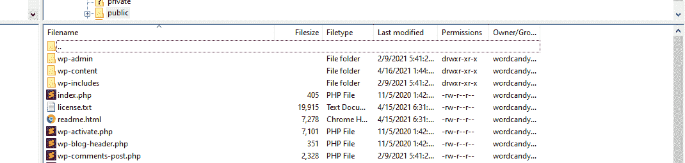

访问你的 WordPress 网站的根目录。

这个**根目录**包含了从你的主题到你的插件和媒体文件的所有内容。它的一些文件包括您的网站如何与其服务器交互的规则、您添加到主题和插件的新功能等等。

简而言之，这个目录包含了让 WordPress *工作*的所有文件。然而，你实际网站的内容[驻留在一个独特的数据库](https://kinsta.com/knowledgebase/wordpress-database/)。你在下面看到的每个表格都存储了一个 WordPress 站点的数据:

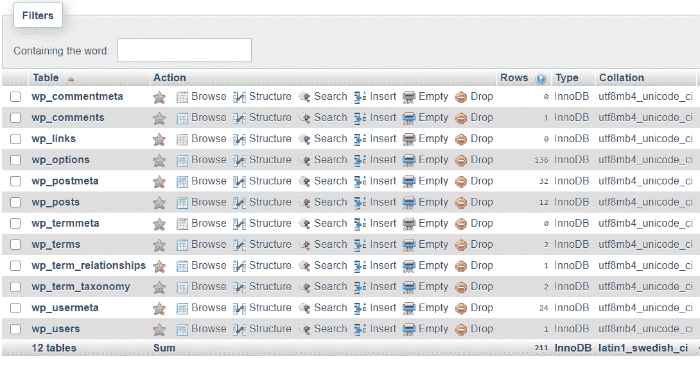

一个 WordPress 数据库及其表格。

备份数据库包括导出所有这些表(通常以 *SQL* 格式)。然后导入该文件的内容，数据库软件将覆盖现有的值。

如果这还没什么意义，不要担心。我们将在下面的章节中向你展示如何手动备份一个 WordPress 站点。如果你不喜欢弄乱你的数据库或者手动复制文件，使用备份 WordPress 站点插件。

本质上，WordPress 备份插件创建了你的站点文件和数据库的拷贝(一起或分开)。然后，这些插件使您能够选择“恢复”哪些备份文件这意味着用备份文件中的内容覆盖现有的文件和数据库表。

如果你使用一个信誉良好的网络主机，它可能也会提供自动站点备份。这个功能意味着你不必担心手动创建备份或使用插件，因为你的网络主机会为你做。它还应该存储这些备份一段时间，以备不时之需。

## 何时备份你的 WordPress 网站

简短的回答是，你应该总是有一个你的网站最近的备份。想象一下，今天遇到一个站点崩溃错误，却不知道如何解决它。

如果您有一天或不到一天的备份，您可能会没事。但是，如果它是一周前的，它可能不包括您网站的一些最新更新。超过一个月，它可能会错过你在此期间所做的重要改变。

问问你自己，在不对你的网站产生负面影响的情况下，你认为你可以丢失多少最近的数据。如果你运行一个静态站点，偶尔备份应该没问题。但是，对于论坛、在线商店、博客和大多数大型网站来说，一致的备份是必要的:

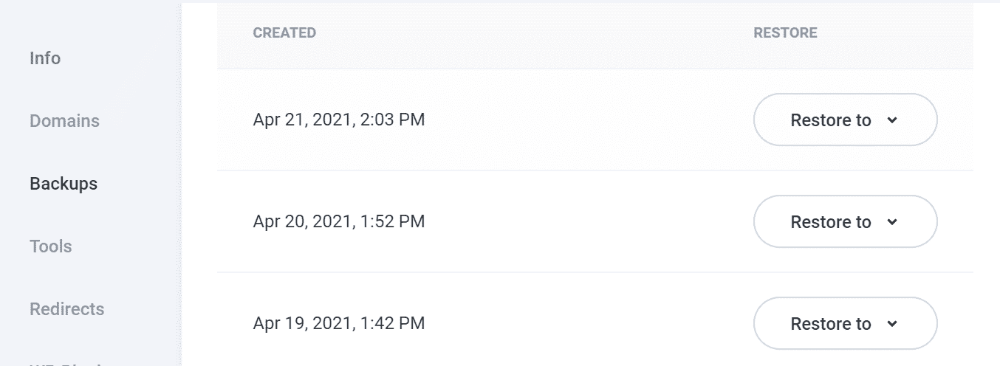

最近的网站备份列表。

如果你购买一个虚拟主机服务，你会注意到他们中的许多人[将每日备份](https://kinsta.com/features/)作为一个重要的卖点。如果你选择托管 WordPress 主机，你应该至少接收每日备份。

这可能看起来有点大材小用，但如果它能让你避免丢失哪怕一次关键数据，那么它的额外代价当然是值得的——这通常可以忽略不计。许多 WordPress 插件也可以让你安排备份，如果你使用不包括备份功能的预算共享主机服务，这将会很方便。

这给我们带来了手动备份 WordPress 的一个明显的缺点:你不能自动完成这个过程。对于如此重要的事情，我们建议采用一种简化的方法，最大限度地减少某人忘记备份甚至因失误而丢失一些文件的可能性。

最后一点需要注意的是，在对站点进行重大更改、将其移动到新主机或者[更改站点的域](https://kinsta.com/blog/wordpress-change-domain/)之前，您应该备份整个站点。如果你曾经问过自己，“我如何在更新前备份我的 WordPress 站点？”然后继续阅读下面的章节，找到最适合你的方法。
T3】

## 如何备份一个 WordPress 站点(4 种方法)

既然我们已经介绍了备份站点的重要性，是时候探索如何备份了。让我们来看看如何使用四种方法备份 WordPress 站点。

### 1.如何手动备份 WordPress 站点

正如我们之前提到的，备份一个 WordPress 网站包括复制它的所有文件和导出它的数据库内容。您可以使用文件传输协议(FTP)客户端[比如 FileZilla](https://wordpress.org/support/article/using-filezilla/) 来执行这两个任务中的第一个。

你的虚拟主机应该给你提供一套证书，你可以用它通过 FTP 连接到你的网站，或者在我们的例子中通过 SFTP 连接到你的网站:

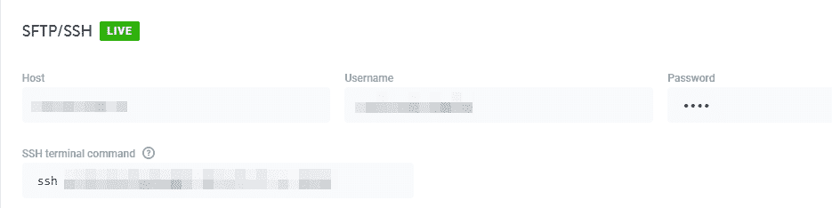

一组 FTP 凭证。

使用这些凭证，你将能够连接到你的服务器并找到你的 WordPress **根目录**。在许多情况下，该目录被称为**公共**T4。首先，复制或下载整个文件夹:

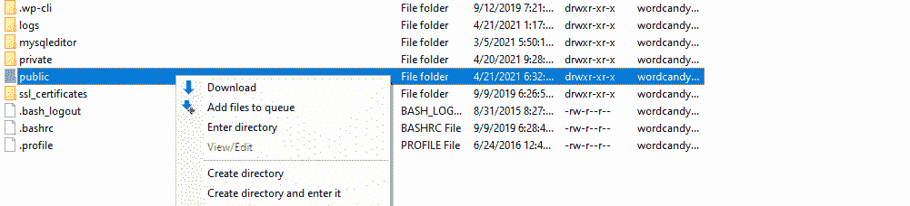

下载 WordPress 根目录。

下载可能需要一段时间，因为大多数 WordPress 网站包含成百上千的文件。备份完成后，我们建议您将该文件夹重命名为备份的日期，然后将其存储在安全的位置。它可以让你把你的整个 WordPress 网站(包括所有的媒体)保存在你的电脑上或者一个[云存储解决方案](https://kinsta.com/knowledgebase/wordpress-google-cloud-storage/)中。

这回答了“我如何用 FTP 备份我的 WordPress 站点？”—这样我们就有了你的数据库。备份该元素的最简单的方法是进入你的主机控制面板，寻找你的数据库管理软件。

如果您使用的是 Kinsta，您可以通过登录您的托管帐户仪表板(如果您是 Kinsta 用户，则为 [MyKinsta](https://kinsta.com/mykinsta/) )来访问您的数据库，选择一个网站，然后浏览到**信息**选项卡:

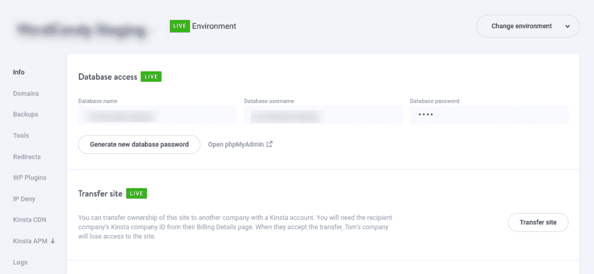

MyKinsta 仪表盘的“信息”标签。

当你点击名为**的选项打开 phpMyAdmin** *，*它将启动数据库管理器。从左边的菜单中选择您站点的数据库，您应该会看到一个如下所示的表列表:

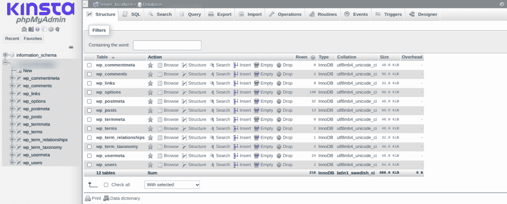

phpMyAdmin 中的 WordPress 数据库表。

接下来，在屏幕顶部的菜单中选择**导出**。 [phpMyAdmin](https://kinsta.com/help/wordpress-phpmyadmin/) 会问你想用什么导出方法。**快速**选项将自动在一个 SQL 文件中包含您站点的所有表格，这正是我们想要的。

确保选择**格式**、下的 **SQL** ，然后点击 **Go** :

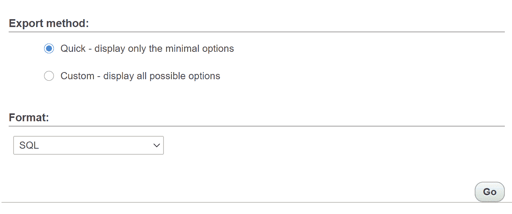

从 phpMyAdmin 导出网站的表格。

您的数据库文件应该会立即下载。就是这样！

在这个阶段，你已经有了你的 WordPress 根目录和它的数据库的拷贝。您可以将站点目录和数据库 SQL 文件压缩在一起，以备不时之需。

## 注册订阅时事通讯

### 想知道我们是怎么让流量增长超过 1000%的吗？

加入 20，000 多名获得我们每周时事通讯和内部消息的人的行列吧！

[Subscribe Now](#newsletter)

#### 还原手动备份

如果您需要恢复手动备份，最好的方法是将备份**根**文件夹以不同的名称上传到您的服务器(与当前文件夹在同一级别)。目录建立后，您可以删除当前的**根**文件夹，并将备份重命名为其初始值。

之后，就该恢复数据库备份了。为此，请返回 phpMyAdmin 并找到您站点的数据库。这一次，选择屏幕顶部的**导入**选项。

phpMyAdmin 将要求您选择要导入的文件并指定其格式:

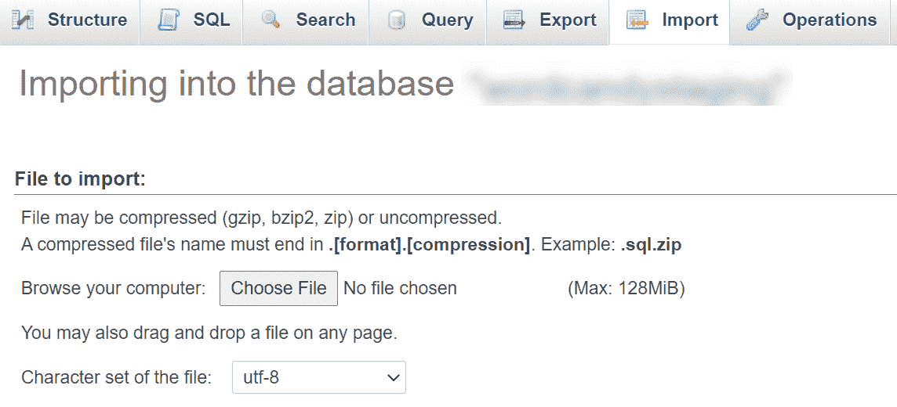

通过 phpMyAdmin 导入数据库文件。

选择您想要导入的数据库备份文件，并点击屏幕底部的 **Go** 。导入过程完成后，您会看到一条成功消息。

在此阶段，如果您访问您的网站，您的备份将会替换其最新版本。如果您恢复了备份来修复网站的问题，它现在应该可以正常工作了。

### 2.如何使用一个备份插件

有很多你可以使用的 WordPress 备份插件。然而，我们可以将它们分为两大类:

1.  **全站点备份插件:**这种类型的插件会为你的网站生成完整的副本，以备不时之需。
2.  **增量备份插件:**该系列插件仅在您对网站进行更改时生成备份，从而避免占用不必要的服务器存储空间。

这两种插件的另一个区别是，增量备份工具往往要花钱。然而，有很多免费的完整站点备份工具可以使用。

如果你对增量备份插件感兴趣，我们在之前的博客文章中提供了我们最喜欢的选项的[综述。在这一部分，我们将向您展示如何使用最流行的免费解决方案之一，](https://kinsta.com/blog/wordpress-backup-plugins/) [UpdraftPlus](https://wordpress.org/plugins/updraftplus/) :

updraft plus 插件。

大多数 WordPress 备份插件的工作方式是相似的，这意味着如果你知道如何使用其中的一个，你应该能够找到使用其他同类型工具的方法。UpdraftPlus 也不例外，您可以使用它在几分钟内创建完整的站点备份。

首先，安装并激活插件，然后在你的 WordPress 仪表盘中进入**设置** > **更新和备份**。接下来，点击**立即备份**按钮:

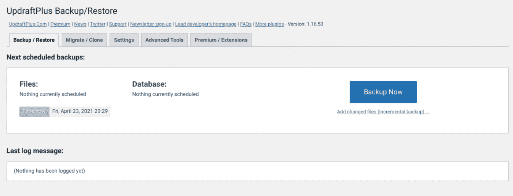

使用 UpdraftPlus 创建 WordPress 站点备份。

如您所见，UpdraftPlus 还提供增量备份。然而，该特性只对插件的[高级版本](https://updraftplus.com/)可用，所以在本教程中我们将忽略它。

需要一流的，快速的，安全的主机为您的新电子商务网站？Kinsta 提供超快的服务器和来自 WooCommerce 专家的 24/7 世界级支持。[查看我们的计划](https://kinsta.com/plans/?in-article-cta)

点击按钮后，UpdraftPlus 会询问您希望将网站的哪些部分包含在备份中。默认情况下，他们同时拥有您站点的文件和数据库:

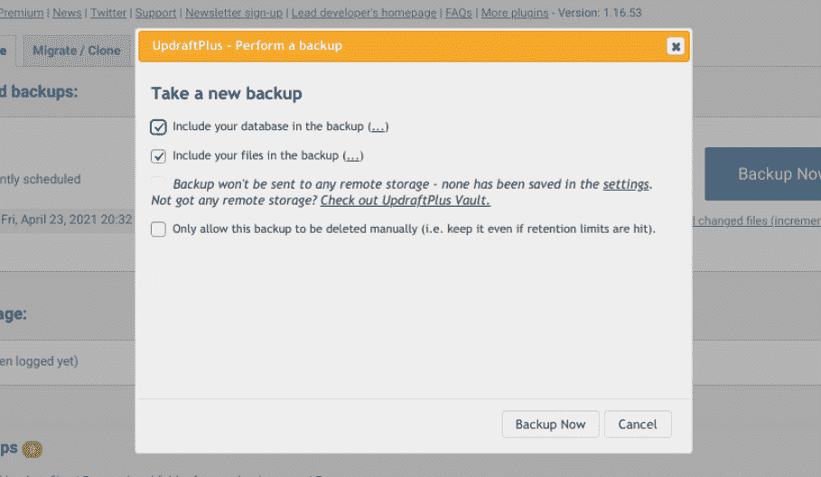

选择哪些元素包含在你的 WordPress 备份中。

点击窗口底部的确认按钮，等待插件生成你的备份文件。现在，如果您向下滚动到**现有备份**部分，您将看到您最近的备份(现在应该只有一个):

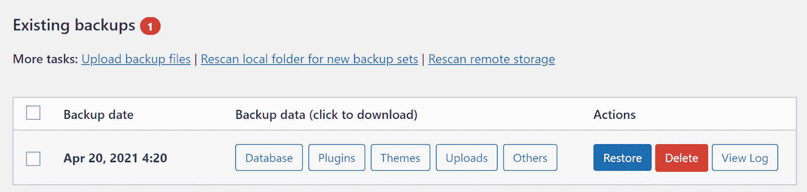

列出你现有的 WordPress 站点备份。

UpdraftPlus 使您能够单独下载任何备份文件组件，如其插件、主题、上传文件，甚至数据库。您还可以通过单击相应的按钮来删除或恢复备份。

#### 还原您的 UpdraftPlus 备份

恢复 UpdraftPlus 备份是一件简单的事情。该插件将询问您想要恢复哪些组件，您应该选择所有组件:

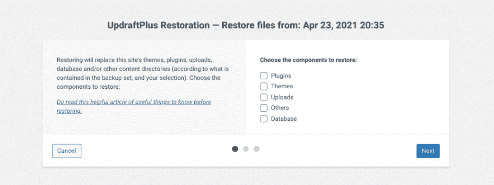

恢复一个 UpdraftPlus WordPress 备份。

您需要确认要继续还原备份。一旦你这么做了，插件会处理剩下的事情。该过程完成后，您的网站将恢复到以前的版本。

简而言之，这就是大多数 WordPress 备份插件的工作方式。然而，大多数免费工具都缺少一个功能，那就是安排 WordPress 站点备份，下面的方法就派上了用场。

### 3.如何通过你的网络主机备份你的 WordPress 网站

如果你使用一个信誉良好的网络主机，它应该会为你提供自动备份。但是，这些备份的频率可能会有所不同。例如，在 Kinsta，我们提供自动每日或[甚至每小时备份](https://kinsta.com/feature-updates/hourly-backups/)，您可以通过登录您的托管仪表板来访问。

但是，这不是我们提供的唯一备份类型。在接下来的部分中，我们将向您展示如何访问您的自动备份，以及如何使用 DevKinsta 来创建您的网站的本地副本。

如果你不是 Kinsta 的用户，我们建议你向你的网络主机查询你的备份选项。它可能会为您处理该过程，或者为您指出手动完成该过程的方法。

#### 如何访问您的自动 Kinsta 备份并创建新的备份

您需要做的第一件事是登录 MyKinsta 仪表板。要查看现有备份的概览，请选择您的站点并导航至**备份**选项卡:

MyKinsta 备份概述。

Kinsta 将自动备份保存两周(对于 [Kinsta 机构合作伙伴计划](https://kinsta.com/wordpress-hosting-agencies/)客户为 30 天)。此外，我们使您能够[将备份恢复到您的实时或暂存环境](https://kinsta.com/blog/restore-wordpress-from-backup/)。如果您想要测试对网站先前版本的更改，最后一个功能会很有帮助。

我们还为您提供按需生成备份的选项，方法是转到**手动**选项卡并选择**备份** **现在**选项:

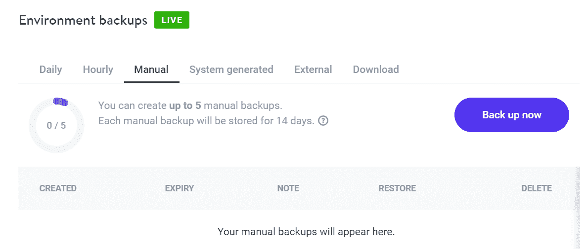

使用 Kinsta 创建手动备份。

您最多可以创建五个手动备份，系统将最多存储 14 天。这是一个很有价值的功能，你可以在对你的网站进行重大更新之前使用。

### 4.如何使用 DevKinsta 在本地备份 WordPress 站点

DevKinsta 是一个免费的本地 WordPress 开发工具，任何人都可以使用。如果你想在本地测试新项目，从事插件或主题开发，等等，它是完美的。

如果你是一个 Kinsta 用户，你可以用你的主机账户连接 DevKinsta，并用它来备份你的本地主机 WordPress 站点。为此，打开 DevKinsta 并选择**创建新站点**下的**从 Kinsta 导入**选项:

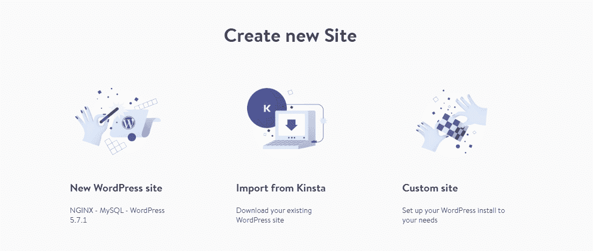

使用 DevKinsta 将 Kinsta 网站导入到本地主机。

如果您还没有这样做，DevKinsta 将要求您验证您的托管凭证。一旦你这样做了，你将会看到一个你所有现存的 Kinsta 网站的列表，包括 [staging environments](https://kinsta.com/help/staging-environment/) :

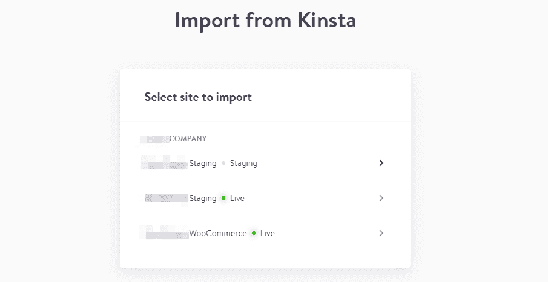

选择要导入哪个 Kinsta 网站。

选择一个网站，DevKinsta 会完成剩下的工作。导入过程可能需要一段时间，这取决于网站的大小。但是，一旦备份过程完成，该副本将作为本地备份。

如果您想要恢复备份，可以使用 [DevKinsta 的 push to staging 功能](https://kinsta.com/knowledgebase/devkinsta/push-local-site-to-kinsta-staging/)。一旦备份位于 Kinsta 服务器上的暂存环境中，您就可以将其转移到生产环境中。

[If you don’t have a recent backup of your WordPress site, this is your sign to add it to the top of your to-do list ASAP. 👀Click to Tweet](https://twitter.com/intent/tweet?url=https%3A%2F%2Fkinsta.com%2Fblog%2Fbackup-wordpress-site%2F&via=kinsta&text=If+you+don%E2%80%99t+have+a+recent+backup+of+your+WordPress+site%2C+this+is+your+sign+to+add+it+to+the+top+of+your+to-do+list+ASAP.+%F0%9F%91%80&hashtags=WordPress%2CWPTips)

## 摘要

学习如何备份 WordPress 站点比你想象的要容易。你可以手动操作，使用插件，甚至让你的网络主机来处理整个过程。

WordPress 站点备份最简单和最安全的方法是使用一个主机提供商来自动备份。在 Kinsta，我们为每个计划提供自动的每日备份。如果这还不够，你可以随意创建手动备份，或者使用 [DevKinsta](https://kinsta.com/devkinsta/) 来建立你网站的本地副本。

关于如何备份你的 WordPress 网站，你有什么问题吗？让我们在下面的评论区回顾一下吧！

* * *

让你所有的[应用程序](https://kinsta.com/application-hosting/)、[数据库](https://kinsta.com/database-hosting/)和 [WordPress 网站](https://kinsta.com/wordpress-hosting/)在线并在一个屋檐下。我们功能丰富的高性能云平台包括:

*   在 MyKinsta 仪表盘中轻松设置和管理
*   24/7 专家支持
*   最好的谷歌云平台硬件和网络，由 Kubernetes 提供最大的可扩展性
*   面向速度和安全性的企业级 Cloudflare 集成
*   全球受众覆盖全球多达 35 个数据中心和 275 多个 pop

在第一个月使用托管的[应用程序或托管](https://kinsta.com/application-hosting/)的[数据库，您可以享受 20 美元的优惠，亲自测试一下。探索我们的](https://kinsta.com/database-hosting/)[计划](https://kinsta.com/plans/)或[与销售人员交谈](https://kinsta.com/contact-us/)以找到最适合您的方式。