# 最佳联盟 WordPress 主题(这里有 30 个)

> 原文：<https://kinsta.com/blog/best-affiliate-wordpress-themes/>

你需要帮助找到一个惊人的 WordPress 主题来为你的网站创造被动收入吗？在这里，我们将看看一些最好的 WordPress 主题来帮助你做到这一点。

成功的联盟营销者希望他们的网站在搜索结果中排名靠前，用引人注目的联盟内容吸引受众，并说服访问者点击这些联盟链接。

你可以通过一个高质量的 WordPress 主题来实现这些目标。你不必倾家荡产去买一个。继续阅读，我们会告诉你怎么做！

## 以会员为中心的 WordPress 主题的好处

代销商营销是一种以业绩为中心的商业策略，在线商店通过网站的促销活动向网站(代销商的)支付佣金。作为回报，当代销商的广告促成销售时，代销商会得到补偿。

> Kinsta 把我宠坏了，所以我现在要求每个供应商都提供这样的服务。我们还试图通过我们的 SaaS 工具支持达到这一水平。
> 
> <footer class="wp-block-kinsta-client-quote__footer">
> 
> 
> 
> <cite class="wp-block-kinsta-client-quote__cite">Suganthan Mohanadasan from @Suganthanmn</cite></footer>

[View plans](https://kinsta.com/plans/)

通过[附属计划](https://kinsta.com/affiliate-academy/affiliate-programs-for-bloggers/#what-are-affiliate-programs)进行营销是最广泛使用的在线被动收入策略之一。事实上，仅在美国，联盟营销支出预计将在 2022 年达到 82 亿美元。

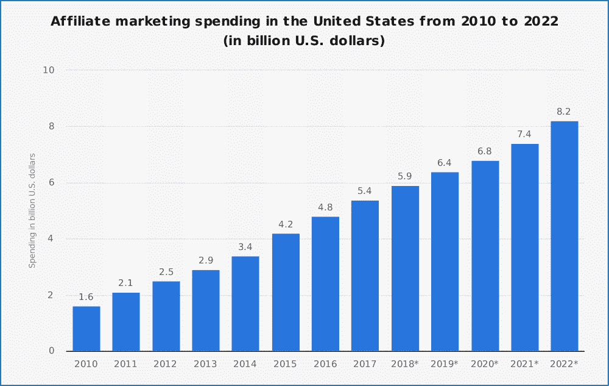

Growth of affiliate marketing spending in the US through 2022\. (Source: [Statista](https://www.statista.com/statistics/693438/affiliate-marketing-spending/))

意识到这一点在 Kinsta 的重要性，我们实现了一个开箱即用的[加盟系统](https://kinsta.com/blog/affiliate-system/)，它包含了许多功能、低维护以及日常加盟管理操作的自动化。

正如我们在[联盟学院](https://kinsta.com/affiliate-academy/)中经常鼓励的那样，拥有重大影响力是成为[有效联盟营销者](https://kinsta.com/affiliate-academy/how-to-become-an-affiliate-marketer/)的重要方面之一。赚取影响力和建立大量受众的理想方法是建立一个专注于特定领域的网站或博客，并为其提供独特的内容来推广您的附属产品。

这就是为什么大多数分支机构转向 WordPress 和其他渠道，如 YouTube、社交网络或时事通讯。大多数 WordPress 主题是为博客或商业网站创建的，他们中的许多人认为联盟营销是次要的，或者根本不支持它。

虽然你可以将这些有利可图的联盟链接添加到任何一个 WordPress 网站和主题中，但是选择一个专门为联盟营销开发的模板有两个基本优势:

1.  以会员为中心的 WordPress 主题有助于发布设计精美的评论，通常包含有用的元素，如星级评定、产品比较和媒体画廊。这样的评论有助于强调产品的优点和缺点。
2.  一个致力于联盟营销的 WordPress 主题打开了插件和定制选项的大门，旨在提高你的[联盟佣金](https://kinsta.com/ebooks/wordpress/increase-affiliate-commissions/)并避免与你的业务无关的功能。

## 30 个最佳 WordPress 主题

有许多免费和付费的 WordPress 主题可以使用，但是哪一个适合你呢？我们已经为不同的类别编辑了一个最好的 WordPress 主题的综合列表，以帮助你缩小选择范围。

### 1.阿斯特拉

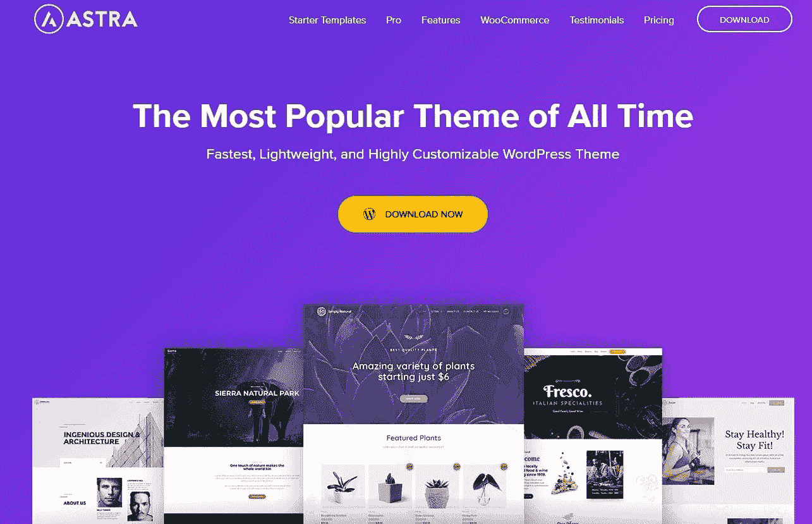

Astra homepage (Source: [Astra](https://wpastra.com/))

Astra 由 Brainstorm Force 开发，是一个非常受欢迎的多用途 WordPress 主题，可以为各种网站量身定制，如博客、企业、作品集和在线市场。

Astra 的联盟营销模板是轻量级和高度可定制的，以促进您的产品和服务，由于其灵活性，易用性，演示和迷人的设计。Astra 被设计成使用不到 50 KB 的资源，并且省略了渲染阻塞 [jQuery](https://kinsta.com/knowledgebase/what-is-jquery/) 。这意味着你的网站将[加载得更快](https://kinsta.com/learn/page-speed/)更流畅，这对用户和 SEO 都有好处。

尽管没有本地的 [Gutenberg block](https://kinsta.com/blog/wordpress-5-0/) 编辑器，Astra 与著名的拖放构建器广泛兼容，如 Elemontor、Gutenberg Blocks、Beaver Builder、WooCommerce、 [Yoast SEO](https://kinsta.com/partners/yoast/) 、LearnDash 和 Toolset。通过这种方式，您可以选择最自然的构建器来从零开始创建页面，或者根据您的需要修改演示网站。

Astra 也支持 RTL 语言。从数百个预设计的模板中选择一个，并根据您的内容进行定制。

#### 主要附属主题功能

*   丰富多样的预置主题库
*   快速加载的轻量级模板
*   与流行的构建器兼容
*   针对不同设备进行了优化
*   干净的代码和搜索引擎友好
*   用户友好且可定制
*   不使用 jQuery
*   全天候实时聊天支持

#### 定价

Astra 提供了一个免费的基础版本，但是它有几个限制。我们建议使用它进行测试，以确定 Astra 是否是满足您需求的最佳 WordPress 主题。

有三种高级包(Astra Pro、基本包和增长包)，价格从每年 59 美元到 249 美元不等。您可以选择按年订阅，也可以永远一次性付款。

高级会员还可获得 14 天退款保证。

### 2.红利

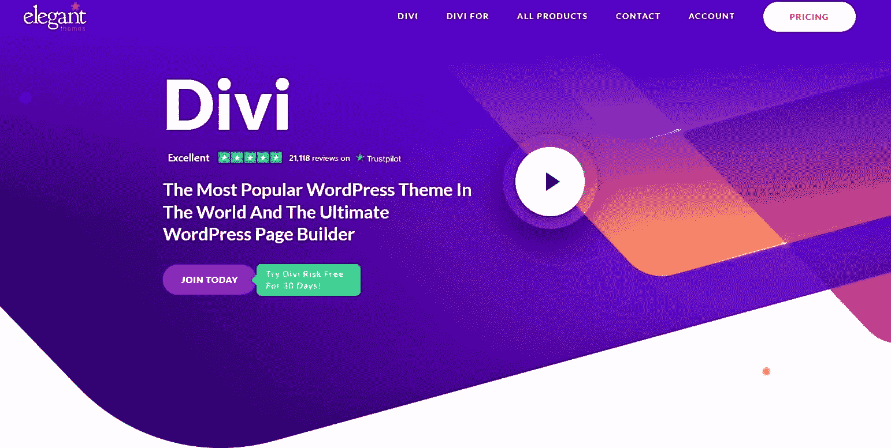

Divi homepage (Source: [Divi](https://www.elegantthemes.com/gallery/divi/))

Divi 是 WordPress 主题领域的老玩家，拥有超过 200 万网站所有者的庞大客户群。像 Astra 一样，Divi 是一个通用的主题，适用于任何网站，包括附属网站。

使用 Divi 的联盟营销模板，不用安装页面生成器，就可以很容易地在脸书和谷歌上建立登陆页面和开展广告活动。相反，你可以使用 [Divi Builder](https://kinsta.com/blog/wordpress-page-builders/#divi) 。Divi Builder 捆绑了 30 多个元素(包括 CTA、切换、文本、电子邮件选择加入、按钮和视频)，可以帮助您添加视觉效果并设计您的页面以提高转化率。

Divi Builder 与 Gutenberg 的本机集成是另一个奇妙的特性。因此，你可以快速添加一个 Divi 模块到 Gutenberg，更容易创建联盟内容来驱动有机流量。

Divi 还有内置的 SEO 特性，可以帮助你添加规范的 URL、元描述、关键字和自定义标题到主页和个人文章中。

更重要的是，有一个集成的 WooCommerce builder 来设计一个完全个性化的在线商店，以[营销您的附属产品](https://kinsta.com/affiliate-academy/affiliate-sales-tips/)。另外，Bloom 和 Monarch 是 Divi 支持的营销插件，用于推广您的代销商业务。

#### 主要附属主题功能

*   拖放式构建器与 Gutenberg 的本机集成
*   内置的 WooCommerce 生成器
*   200 多个针对不同领域的预制模板包
*   搜索引擎优化友好
*   40 多个网站元素
*   各种可视化定制工具
*   用于联盟营销的插件
*   全天候支持

#### 定价

有两种 Divi 订阅选项:89 美元的年度访问和 249 美元的终身访问。你将被授予访问 Divi，Bloom，Monarch 和 WordPress 杂志 theme Extra 的权限，以及高级支持，更新，无限制的网站使用和数百个布局包。

两种会员资格都有 30 天退款保证。

### 3.声音

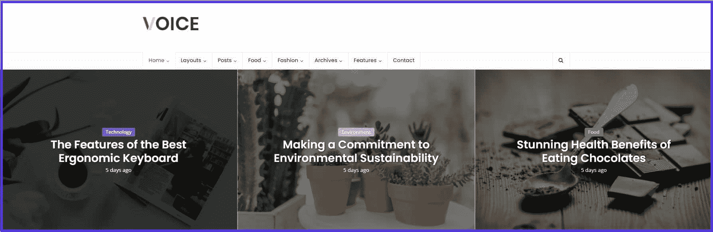

Voice theme (Source: [ThemeForest](https://themeforest.net/))

如果你是一个在线新闻出版商，希望通过联盟营销增加收入，ThemeForest 的 [Voice](https://themeforest.net/item/voice-clean-newsmagazine-wordpress-theme/9646105) 是一个很好的选择。

Voice 包括各种响应布局，但是如果你想用 WordPress 建立一个联盟网站，我们推荐带有封面图片的全幅选项。凭借其复杂和可配置的主题选项面板，您可以快速轻松地开发出符合您需求的风格。

Voice 提供了无限的颜色和字体，并考虑到可读性。此外，您可以从各种颜色皮肤、导航功能、个性化侧栏和小部件设计以及标题配置设置中进行选择。

该主题还允许您使用 Meks [ThemeForest](https://kinsta.com/blog/themeforest-pros-cons/) 智能小工具和集成的横幅广告系统在您的网站上展示和宣传附属产品。

它还支持诸如 WooCommerce integration 和 [bbPress](https://kinsta.com/knowledgebase/bbpress/) 等功能，以帮助您包括一个讨论板，在社交网络上营销您的内容，并整合电子商务功能。

#### 主要附属主题功能

*   无限的字体和颜色
*   适用于在线杂志和报纸
*   兼容 WooCommerce、Yoast SEO、MailChimp、Jetpack 和 bbPress
*   强大的主题面板
*   快速页面加载速度
*   GDPR 兼容性
*   150+后列表组合
*   内置横幅广告系统

#### 定价

语音售价 69 美元。如果您额外支付 21.38 美元，就可以获得 12 个月的延期支持。

### 4.REHub

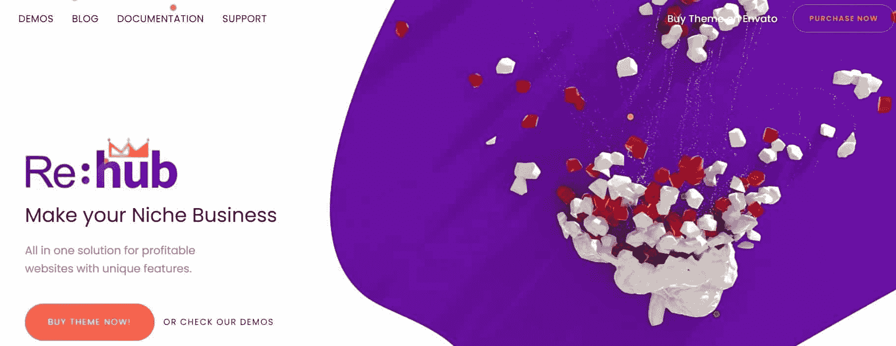

REHub theme (Source: [ThemeForest](https://themeforest.net/))

由亚马逊推荐， [REHub](https://themeforest.net/item/rehub-directory-multi-vendor-shop-coupon-affiliate-theme/7646339) 是 ThemeForest 上排名最高的 WordPress 主题之一，基于 1000 多条评论。它包含 30 多种布局，可以通过各种业务类别的附属链接进行商业化，如在线零售商、市场、评论网站和价格比较网站。

ReHub 配备了大量强大的功能，包括那些与 WooCommerce 、WordPress 和 Easy Digital Downloads 的流行附属插件[兼容的功能。这有助于你提高收入潜力，包括你自己的商品以及你作为代销商做广告的产品。](https://kinsta.com/blog/woocommerce-plugins/)

REHub 适应性强，包括一系列与 WordPress 联盟营销相关的插件，包括 Content Egg 的产品比较表和联盟链接生成器。

REHub 的专业 SEO 助推器包包括有用的工具，如视频块和模式，评论片段，自动内容，加上如何和常见问题块。您还可以使用页面生成器自定义所有内容，它与 WPBakery、Gutenberg 和 Elemontor 兼容。

#### 主要附属主题功能

*   全网站编辑
*   搜索引擎优化辅助包
*   30 多种产品和文章布局
*   支持 Elementor、Gutenberg 和 WPBakery
*   电子商务营销包
*   各种动画工具
*   对比图表生成器
*   目录式列表生成器
*   AMP 支持和移动响应模板
*   多供应商用户配置文件
*   强大的附属功能

#### 定价

REHub 售价 59 美元，另外 17.63 美元可以获得一年的延长支持。您还将获得终身支持。

### 5.大海啊

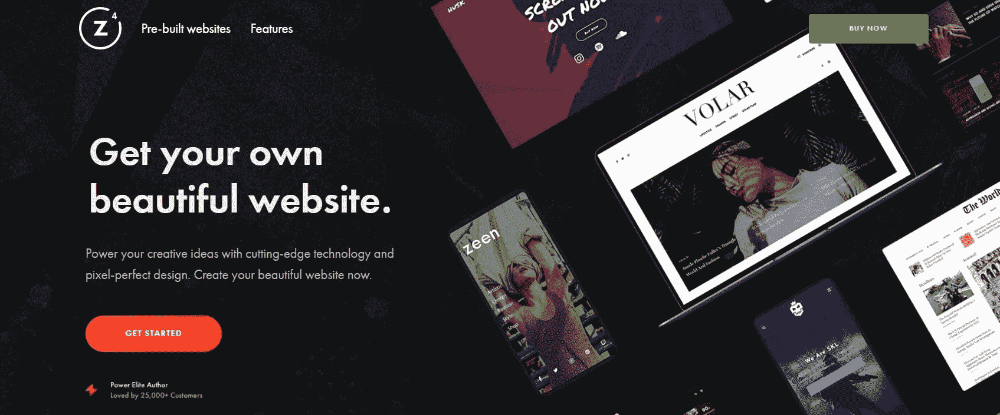

Zeen theme (Source: [ThemeForest](https://themeforest.net/))

由 Codetipi 开发的 Zeen 是一个完美的 WordPress 主题，有超过 30 个吸引人的博客、新闻杂志和 WooCommerce 演示。

它的功能范围从用户友好的集成模板生成器和极简风格到众多的货币化策略。因此，你不会被限制只能使用演示。您可以使用 Tipi Builder 来开发您的个性化文章布局，以接触您的读者并赢得更多点击。

Zeen 迎合代销商，尤其是它的“让我们回顾”插件。这个插件让你可以访问你的[评论](https://kinsta.com/blog/best-wordpress-review-plugins/)的各种主题。选择添加尽可能多的按钮，以及它们的优点和缺点，是最重要的。

除了代销商链接，Zeen 还帮助你使用广告、赞助内容和推广箱来推广你的博客。

Zeen 的性能是其最优秀的特点之一。Zeen 开发者坚持 WordPress 编码最佳实践，避免[臃肿的第三方依赖](https://kinsta.com/blog/how-to-choose-a-wordpress-theme/)。

#### 主要附属主题功能

*   30 多个预先设计的演示
*   可定制的 Tipi 生成器
*   多重货币化特征
*   语音搜索选项
*   内置表情符号
*   高级黑暗模式
*   让我们回顾一下插件
*   强大的性能
*   友好的支持

#### 定价

常规 Zeen 许可证的价格为 64 美元，包括 Envato 的质量检查、Codetipi 的六个月支持以及未来的更新。支付额外的 19.50 美元以延长一整年的支持。

### 6.专业活页夹

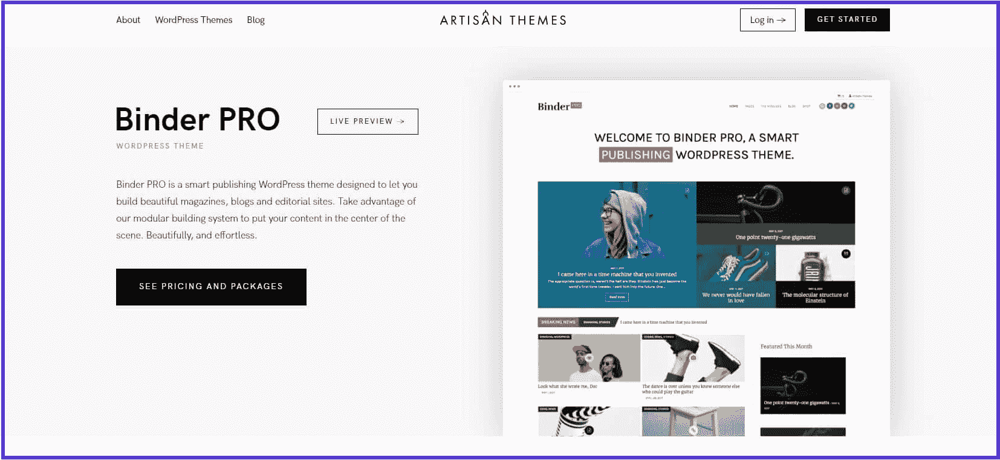

Binder PRO homepage (Source: [Artisan Themes](https://artisanthemes.io/))

Binder PRO 是 Artisan Themes 开发的另一个时髦的出版 WordPress 主题，用于创建引人注目的编辑网站、博客和杂志。

Binder PRO 采用模块化设计技术，使您能够通过拖放组件来构建独特的布局。你还会得到一个内容安装程序和一堆预制模板来启动你的网站。

Binder PRO 的网格布局、侧边栏和内容块有助于代销商在访客看到页面底部附近的内置商店中出售的商品之前，通过帖子和广告在整个页面上建立一个可信的基础。

Binder PRO 包括八个优雅的模板:美食、美食杂志、我的博客、复古杂志、精致博客、日志、时尚博客和简单杂志。该主题的订阅者也可以从 WooCommerce 支持中受益，并访问 Artisan 功能，如插件、页面和高级样式。

#### 主要附属主题功能

*   8 个时尚、杂志风格的模板
*   拖放前端编辑器
*   访问不同的 Artisan 插件和包
*   使用多种语言的
*   支持 Adobe 和[谷歌字体](https://kinsta.com/blog/best-google-fonts/)
*   无限自定义侧边栏
*   优化功能(SSL、自动备份、缓存和缩小设置)
*   手机友好型
*   WP forms-就绪
*   古腾堡和 WooCommerce 的兼容性

#### 定价

Binder PRO 有两个年度订阅选项:主题包和豪华包，价格分别为 129 美元和 389 美元。它还提供 30 天退款保证。

### 7.ClipMyDeals

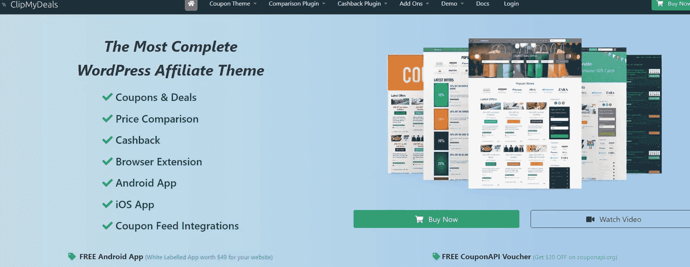

ClipMyDeals homepage (Source: [ClipMyDeals](https://clipmydeals.com/))

ClipMyDeals 是开发优惠券网站的最佳联盟主题之一。你也可以用它来设计一个返现或价格比较网站。

虽然许多优惠券主题需要您安装子主题，但 ClipMyDeals 在配置器中集成了 20 多种预装颜色组合和 9 种字体。您可以使用简单的下拉菜单自由选择您喜欢的设计。

WordPress 定制器调整了这个模板中的所有东西，使它变得简单和用户友好。定制器允许你选择你的主页布局，包括你是否希望滑块、横幅或者一个[吸引人的视频](https://kinsta.com/blog/embed-youtube-video-wordpress/)出现在你的主页上。

ClipMyDeals 还允许您选择是否显示最近的博客条目、优惠券和“热门商店”网格。也可以使用页面构建器插件，如 WPBakery 和[element 或](https://kinsta.com/blog/best-elementor-addons/)。

使用 ClipMyDeals，您可以添加浏览器扩展、Android/iOS 应用和其他工具来最大化转化率。另外，你可以订阅 LinkMyDeals 的优惠券订阅，ClipMyDeals 会为你发布优惠券。

#### 主要附属主题功能

*   易于使用的 WordPress 定制
*   网络推送通知
*   带条形码生成器的可打印优惠券
*   针对社交媒体优化
*   Widgetized 页脚区和侧栏
*   浏览器扩展(Chrome、Opera、Edge 和 Firefox)
*   返现和价格比较插件
*   移动响应布局
*   终身免费更新
*   批量进口
*   woo 商务就绪

#### 定价

ClipMyDeals 主题售价 79 美元。返现、价格比较和浏览器扩展插件是可选的额外服务，每个 29 美元。该订阅还包括免费的 Android 应用程序，终身门票支持和更新。

### 8.歌利亚

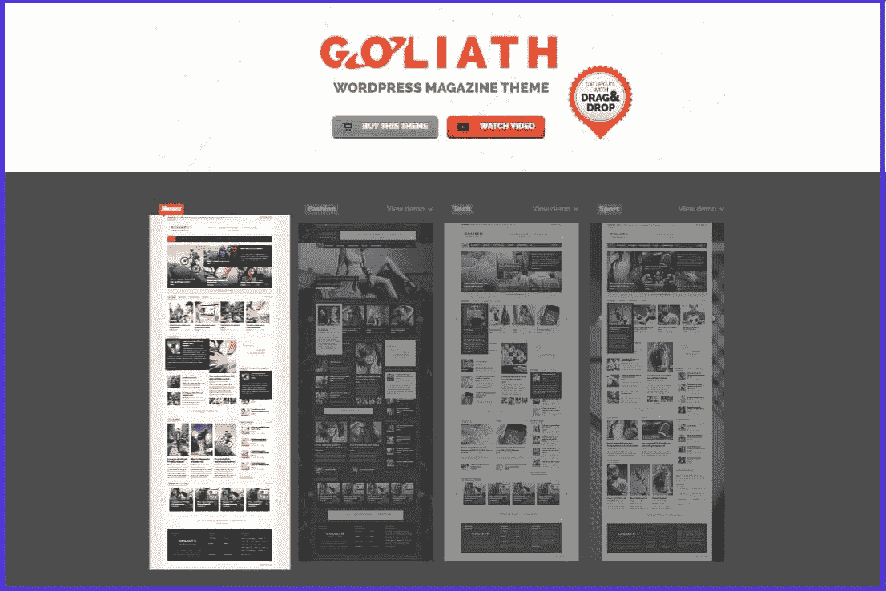

Goliath theme (Source: [ThemeForest](https://themeforest.net/))

Goliath 对于专门从事评论的网站来说是一个极好的选择，这要归功于其集成的评级系统、巧妙的摘要功能以及在谷歌搜索结果中优化的评论布局。

Goliath 提供了四个不同的演示站点，具有不同的字体和配色方案。这四种类型的内容最适合体育、新闻、时尚和技术相关的内容。使用拖放式页面编辑器按照您想要的方式配置您的网站。

主页的结构是用户友好的，并支持醒目的标题和视觉效果。主页上的每个帖子都有“快速查看”悬停功能:将鼠标移动到一个帖子上可以查看扩展版本。您的读者可以在导航菜单和阅读进度条的帮助下轻松跟踪他们在内容中的位置。

“回顾总结”功能是 Goliath 最好的方面之一。自定义可视组合程序块允许您分别对每个项目进行评级和列出，并显示产品的优点和缺点。

借助 Goliath 的嵌入式广告系统，你可以轻而易举地使用 Iframe、 [Google AdSense](https://kinsta.com/blog/google-ads-vs-adsense/) 或标准图片横幅广告来设置广告。你可以在标题、侧边栏、文章和许多其他位置集成广告。

#### 主要附属主题功能

*   在桌面和移动设备上完全响应
*   强大的广告系统
*   多语言支持(通过 WPML 插件)
*   集成的可视化编辑器页面生成器
*   旋转滑块
*   “热门”文章标志
*   实时可视化编辑器
*   支持不同的插件，包括 WooCommerce 和 bbPress
*   针对 SEO 进行了优化
*   审查总结和广泛的评级系统

#### 定价

Goliath 的常规许可费用为 59 美元，包括 Envato 的质量检查和未来的更新。

[Want your site to rank highly in search results and persuade visitors to click on those affiliate links? 😄 These themes can help 🚀Click to Tweet](https://twitter.com/intent/tweet?url=https%3A%2F%2Fkinsta.com%2Fblog%2Fbest-affiliate-wordpress-themes%2F&via=kinsta&text=Want+your+site+to+rank+highly+in+search+results+and+persuade+visitors+to+click+on+those+affiliate+links%3F+%F0%9F%98%84+These+themes+can+help+%F0%9F%9A%80&hashtags=AffiliateTips%2CWordPress)

### 9.技术市场

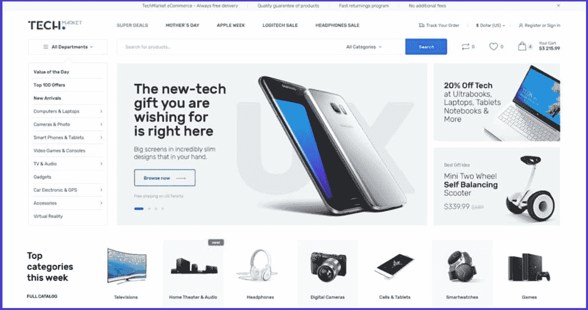

Techmarket theme (Source: [ThemeForest](https://themeforest.net/))

Techmarket 是由 Madras Themes 开发的一个多厂商 WordPress 联盟主题，专注于 WooCommerce 电子商店。如果你是亚马逊的会员或者想要一个[多供应商](https://kinsta.com/blog/best-woocommerce-multi-vendor-plugins/)市场，这个主题适合你。

Techmarket 建立在 Bootstrap 4 框架之上，非常灵活，易于使用，并且响应迅速。

引人注目的设计和宽屏分辨率使其成为 1000 多台电脑的首选。Techmarket 使用 CSS3 实现强大的样式选项，使用 HTML5 实现智能内容结构。

您可以从七个商店演示、八个主页设计、两个登录页面和大量商店页面中进行选择。内容可以很容易地从一个页面移动到另一个页面。

Techmarket 支持多个[电子商务插件](https://kinsta.com/blog/wordpress-ecommerce-plugins/)，包括 WooCommerce、Prosociate 和 WooZone。稍作调整，你就可以销售其他商品，如园艺用品、食谱、鞋子……应有尽有。

这个主题的功能与 WooCommerce 的核心和其他扩展(包括 King Composer、Visual Composer 和 Slider Revolution)广泛集成，以展示您的产品。

Techmarket 还针对古腾堡进行了优化，并兼容当今流行的浏览器。

#### 主要附属主题功能

*   单击安装和设置
*   跨浏览器兼容性
*   响应式大菜单
*   丰富的 WooCommerce 功能
*   WPML 兼容性
*   支持帖子格式和帖子缩略图
*   社交媒体整合
*   导入/导出定制工具
*   17 个部件
*   7 个商店演示
*   2 个登录页面模板
*   8 个主页布局
*   免费更新
*   Suport for Google Fonts
*   一对一的支持

#### 定价

Techmarket 主题在 ThemeForest 上有售，售价 59 美元。马德拉斯主题的未来更新、质量检查和六个月支持都包含在您的订阅中。支付额外的 17.63 美元，以延长全年的援助。

### 10.市场化地

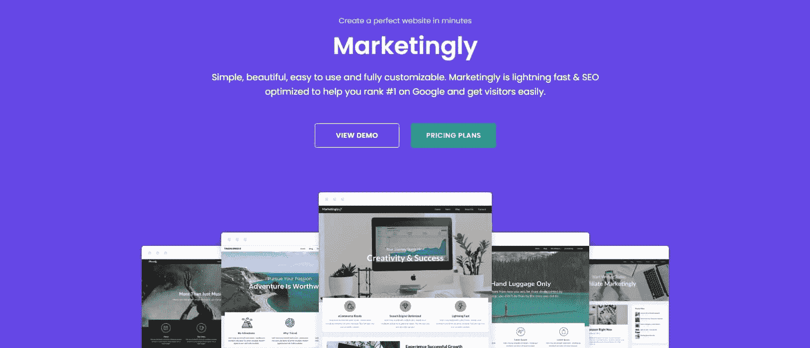

Marketingly homepage (Source: [Superb Themes](https://superbthemes.com/))

Superb Themes 的一个漂亮的轻量级 WordPress 主题，可以用于任何目的，无论是旅游博客、商业网站还是杂志。

营销采用干净的内容块，排版，充满活力的图像，一个白色的背景，流畅的导航。全屏图像和服务框显示在侧边栏和单列博客布局的上方。

这个主题是精心构建的联盟营销的想法，并为搜索引擎优化。

如果你想作为代销商赚钱，有大量的广告空间可用，你可以使用头部部件来包含广告横幅。当涉及到图像或视频广告时，所有的广告网络——包括谷歌的 DFP 和 AdSense——都被支持。

Superb Themes 还提供一个名为 Affiliate Marketingly 的免费儿童主题。虽然免费版有一些受限制的功能，你可以添加一个独特的标志，图标和背景图片，以提高你的联盟网站的外观。

#### 主要附属主题功能

*   SEO 优化的
*   所有的颜色和字体都是完全可定制的
*   访问所有子主题
*   与元素或兼容
*   可导入的演示内容
*   提供免费版本
*   高级支持
*   装载速度快，灵活，结构美观
*   支持无限域

#### 定价

如果你发现免费版本对你的需求来说太有限，Marketingly 提供了三个高级等级:Marketingly Premium、Business Subscription 和 Lifetime Access。价格从 29 美元到 149 美元不等。

Marketingly 通常不会为下载后的产品提供退款。

### 11.克劳埃

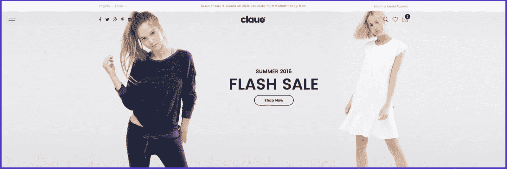

Claue theme (Source: [Theme Forest](https://themeforest.net/))

凭借极简主义风格和当代设计， [Claue](https://themeforest.net/item/claue-clean-minimal-woocommerce-theme/18929281) 利用 WooCommerce 提供了一个最佳的 WordPress 主题联盟，目标客户是希望通过社交平台推广内容或产品的时尚博主或零售商。

这个主题有大量的功能，并且附带了用于创建可扩展在线商店的可靠插件。由于它创造性地使用 Instagram 等社交媒体平台来增加流量和产生可点击的链接，它可以成为联盟营销的一个有利可图的选择。

Claue 允许你创建一个由你的 Instagram feed 支持的页面。当你拍照并上传到社交平台时，你的网站会自动更新。

得益于其高度灵敏的设计，Claue 与现代设备兼容。

Claue 提供的 Lookbook 系列巧妙地帮助您展示您的时尚产品和功能，作为您最佳服装的销售点。

最重要的是，您可以在每个特定条目的底部、左侧或右侧显示缩略图。“粘性”功能可以让你在滚动时将产品细节保持在原位。

#### 主要附属主题功能

*   10 个全功能演示
*   视网膜就绪设计
*   Instagram 商店和 MailChimp
*   与 WooCommerce 的兼容性
*   Ajax 支持的搜索建议
*   WPBakery 页面生成器
*   单击导入演示
*   MetaSlider
*   RTL 语言支持
*   LookBook 插件
*   粘性“添加到购物车”

#### 定价

Claue 的标准许可费用为 69 美元。它附带质量检查、未来更新和六个月的支持。只需额外支付 21.38 美元，您就可以将支持延长至 12 个月。

### 12.极端主义者

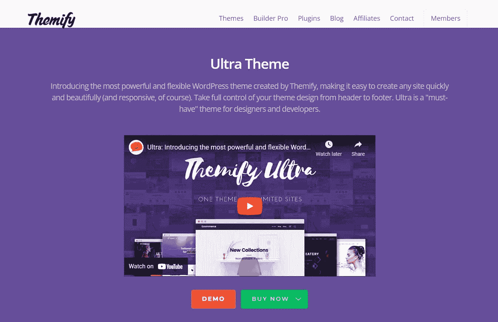

Themify Ultra homepage (Source: [Themify](https://themify.me/))

Themify 的 Ultra 可能不致力于联盟营销，但它是一个多功能的 WordPress 主题，可以轻松适应联盟营销者。

Ultra 包括 60 多种预设计的布局，以及一个简单的拖放构建器。如果你想开一个博客来销售你的代销商商品，Ultra 可能是一个有效的主题。只需点击一下，您就可以快速安装模板和演示。

Ultra 主题拥有出色的搜索引擎优化性能，尤其是当它涉及到谷歌的重要排名因素时。为了优化你网站页面的指标，提高你在搜索引擎中的曝光率，我们仍然建议安装免费的 [Yoast SEO](https://kinsta.com/blog/yoast-seo/) 插件。

Ultra 不缺的一点就是多样性。有 15 个页眉，6 个页脚，5 个帖子模板，以及一系列更多的定制选项。该主题还包括内置的应用程序，如联系人表单、WooCommerce 工具、图片荧光笔、倒计时、[价格表](https://kinsta.com/blog/wordpress-pricing-table-plugins/)和进度条。所有这些都可以用来促进代销商的销售。

#### 主要附属主题功能

*   60 种响应式预设布局
*   一键式演示导入和设置
*   集成页面生成器
*   自动更新
*   滑块和视频背景
*   视差滚动
*   搜索引擎优化和视网膜就绪
*   网络商务整合
*   12 奖金建设者附加
*   快速页面加载速度
*   挂钩内容、谷歌字体和社交图标

#### 定价

你可以购买一个主题或者加入主题化俱乐部，该俱乐部提供多个主题和其他额外津贴。

您可以花 59 美元购买 Ultra 主题，其中包括一整年的支持和更新。主题大师俱乐部的费用是 89 美元，而终身俱乐部的费用是 249 美元。

### 13.简介

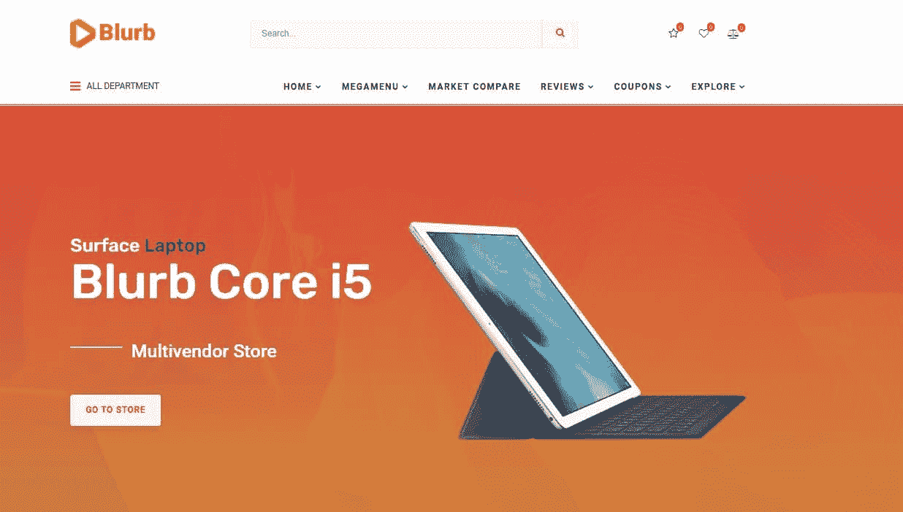

Blurb theme (Source: [Theme Forest](https://themeforest.net/))

由 themeim 于 2014 年开发的 [Blurb](https://themeforest.net/item/blurb-affiliate-marketing-wordpress-theme/23176025) 主题是为使用优惠券和代销商销售技术的博客作者和代销商设计的。它提供了一个统一主题下的亚马逊市场、优惠券、价格比较和评论。

有了企业级模板和响应界面，你还可以使用 Blurb 来有效地[建立一个 WooCommerce 商店](https://kinsta.com/blog/woocommerce-tutorial/)，一个多供应商市场，或者一个产品评级和评论网站。

Blurb 提供了 3 个独特的主页布局，2 个评论页面设计，超过 31 个内页样式，愿望列表功能和大型菜单。您可以使用 Blurb 的内置配色方案个性化您的品牌标识和徽标。

您可以创建宽达 1，650 像素的自定义布局网格，在各种设备上提供愉快的用户体验，并平稳地引导您的访问者浏览您的网站。此外，该主题支持多种语言，并且可以翻译。

侧栏、页脚和页眉都是可定制的。主题也兼容很多平台。对于额外的定制，您可以结合使用 Blurb 和 Elementor。

如果你需要一个框架来为你所有的合作伙伴展示各种各样的目录，那么广告可能是一个完美的选择。

#### 主要附属主题功能

*   一键按关键字过滤
*   优惠券、评论和产品评级
*   带有评级和评论选项的多供应商商店页面
*   手机友好的布局
*   有效的 HTML/CSS
*   与 elements 或 70 多个自定义元素集成
*   SEO 就绪
*   高级搜索栏
*   漂亮的大菜单
*   响应比较和表格设计
*   [MailChimp 简讯](https://kinsta.com/blog/mailchimp-for-wordpress/)
*   免费的谷歌字体
*   “最佳产品”特征

#### 定价

Blurb 主题的价格为 59 美元，包括未来的更新和 themeim 六个月的支持。

## 注册订阅时事通讯

### 想知道我们是怎么让流量增长超过 1000%的吗？

加入 20，000 多名获得我们每周时事通讯和内部消息的人的行列吧！

[Subscribe Now](#newsletter)

### 14.快速帆船

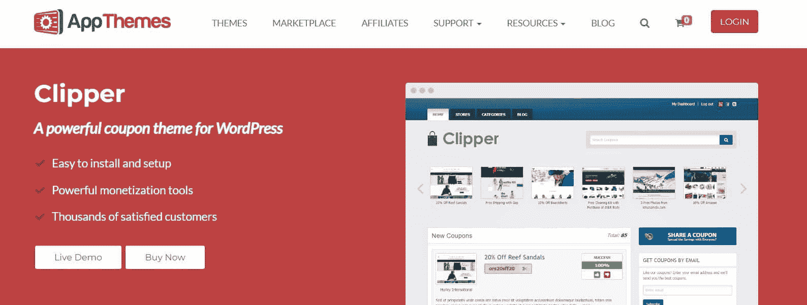

Clipper theme homepage (Source: [AppThemes](https://www.appthemes.com/))

来自 AppThemes 的 Clipper 是另一个强大的 WordPress 主题联盟，它使得在你的博客上添加优惠券甚至建立一个独立的优惠券网站变得简单。

快船的仪表板帮助您管理优惠券，安全，报告，广告，配置和高级设置。这个主题是用户友好的，组织良好。例如， [Google Analytics](https://kinsta.com/blog/how-to-use-google-analytics/) 的代码可以被添加，而不需要任何插件或者改变主题的【header.php】的**文件。**

您可以选择启用优惠券编辑、用户注册、优惠券/商店监控、[链接隐藏](https://kinsta.com/affiliate-academy/link-cloaking/)和优惠券查看计数器等功能。

第三方优惠券列表功能是最新版本的 Clipper 中包含的一项复杂功能。您可以允许您的客户在网站上张贴优惠券，这对企业网站和产品的所有者来说是一个宝贵的机会。作为交换，你可以要求他们付款。

如果你是一个博客写手，你可以在像谷歌广告联盟这样的网络上展示广告。

Clipper 主题包括一个报告功能，允许用户标记特定于站点内容的问题。整个事情是移动友好的。

#### 主要附属主题功能

*   强大的货币化工具
*   用户友好且易于设置
*   跟踪和高级链接伪装
*   专门的类别页面和商店
*   自定义电子邮件模板
*   5 种配色方案
*   无限优惠券商店
*   客户优惠券管理
*   专用博客
*   带有示例 CSV 文件的简易导入工具
*   搜索引擎优化友好和响应
*   访问子主题和插件

#### 定价

快船主题售价 69 美元。这包括终身许可证，无限的网站，以及 12 个月的更新和支持。

AppThemes 还提供了一个 199 美元的俱乐部包，让你可以访问公司的所有主题和 20 多个市场项目。

### 15.市场加

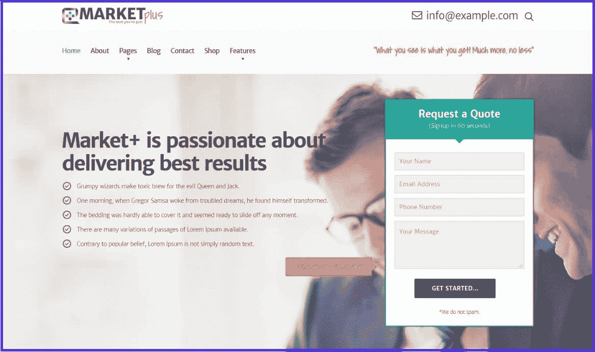

MarketPlus theme (Source: [ThemeForest](https://themeforest.net/))

tansh 的 Marketplus 是一个转换优化的 WordPress 主题，非常适合各种类型的营销人员，包括分支机构。

Marketplus 包括一个[子主题](https://kinsta.com/blog/wordpress-child-theme/)和预制模板，用于 3 到 5 列的可排序投资组合。音频，视频和图像画廊都支持。此外，您可以使用主题选项打开和关闭模式。

主题提供了流行的拖放式 WPBakery 页面生成器。编辑完导入的演示页面后，使用它可以快速创建您自己的页面。

Marketplus 对所有屏幕都有反应，以确保您的网站对所有受众都很棒。

当谈到联盟营销时，Marketplus 主题提供了定制的小部件来突出标签云、最近的帖子、联系信息和社交媒体图标。

Marketplus 捆绑了 [Visual Composer](https://kinsta.com/blog/elementor-alternative/) 插件、功能丰富的主题面板、大量调色板和排版，让您能够最大限度地控制您的作品集、推荐页面或博客的外观。

Marketplus 有六种不同的标题选项，功能全面。您可以轻松地禁用任何不必要的头元素，并将您的头配置为粘性的。

#### 主要附属主题功能

*   跨设备兼容性
*   woo 商务就绪
*   博客和组合功能
*   谷歌网络字体
*   WP 面包房
*   包含儿童主题
*   自定义 CSS 选项卡
*   徽标、分析代码和图标
*   自定义小部件
*   [滑块旋转](https://kinsta.com/blog/wordpress-slider/#1-slider-revolution)
*   定价表
*   翻译就绪
*   联系表格 7
*   自定义社交分享按钮

#### 定价

您可以花 69 美元购买 MarketPlus，享受半年度支持和未来更新。如果你想延长支持 12 个月，你需要支付额外的 21.38 美元。

### 16.电镀物品

Electro theme (Source: [ThemeForest](https://themeforest.net/))

[Electro](https://themeforest.net/item/electro-electronics-store-woocommerce-theme/15720624) 是专为电子产品网店打造的 WooCommerce 主题。

由 Techmarket 的相同开发者创建的 Electro 是灵活和健壮的。它支持像 Dokan 这样的多厂商插件，所以它可以被代销商和零售商使用，或者为其他厂商创建一个市场。

这个主题完全兼容可视化编辑器页面生成器，Slider Revolution premium WordPress Slider，以及 YITH WooCommerce Wishlist 和 YITH WooCommerce Compare 插件。Electro 还包括用户友好的垂直和水平大菜单、产品转盘、类别列表、单一产品风格、配件和其他几个专业外观的功能。

#### 主要附属主题功能

*   13 种以上的主页风格可供选择
*   明暗主题选择
*   移动设备兼容性
*   视频教程
*   试验和虚拟数据(首先试验主题)
*   集成和兼容性插件
*   免费更新
*   兼容所有主流浏览器

#### 定价

Electro 的价格是 59 美元，包括开发者 6 个月的支持。您还可以额外支付 17.63 美元，将支持延长至 12 个月。

### 17.使万维网化

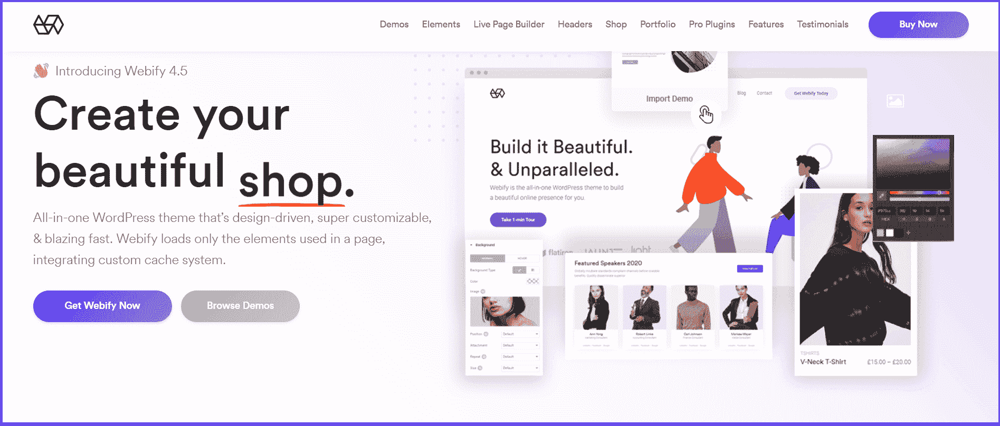

Webify theme (Source: [ThemeForest](https://themeforest.net/))

Webify 是一个基于 Elementor 的主题，它包含了构建几乎任何类型网站的特性和工具。从小的个人博客到网上商店，Webify 都能搞定。

这个主题有超过 20 个演示来帮助你开始，每个月都会有新的添加进来。为了让你的网站与众不同，Webify 提供了灵活的布局、自定义的图库风格和漂亮的动画。还有一个包含 200 多个模块的图书馆。

Webify 通过自己的缓存系统进行了 SEO 优化，以提高速度。该主题捆绑了有用的插件，包括滑块革命，基本网格画廊，分层弹出窗口，可湿性粉剂和层滑块。

#### 主要附属主题功能

*   一键式安装
*   社交媒体整合
*   支持多种语言
*   适应性图像
*   高度可定制的大型菜单
*   自定义内页
*   拖放式编辑和定制

#### 定价

Webify 的一次性成本为 59 美元，包括 theme_bubble 的未来更新和 6 个月的支持，后者可以延长至 12 个月，额外费用为 17.63 美元。

### 18.高级电子商务商店

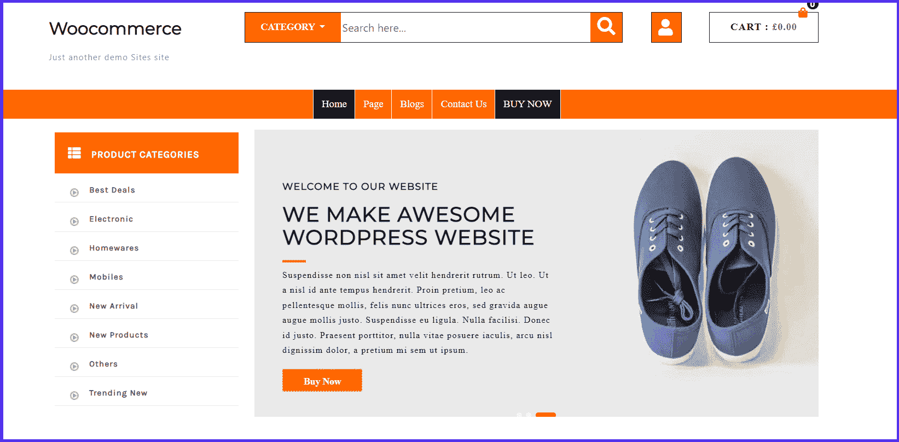

Advance Ecommerce Store theme (Source: [ThemeShopy](https://www.themeshopy.com/))

高级电子商务商店是为在线商店设计的主题商店。如果你的网站上有代销商交易、优惠券代码和产品，这是一个不错的选择。

你可以将你的产品分类，在主页顶部分享你的优惠券代码，并在文件夹上方的单图像滑块中显示热门交易。您可以突出您的畅销书和热门交易，包括用户评论，并显示您的最新帖子。

先进的电子商务商店反应灵敏，搜索引擎友好，加载速度快。主题兼容 WooCommerce 和其他很多第三方插件。

#### 主要附属主题功能

*   100 多种字体系列选项
*   特色产品图像、高清图像和视频显示
*   帖子和评论帖子
*   可定制主页
*   搜索引擎优化友好
*   支持你自己的 CSS 和 JavaScript
*   响应式设计
*   短代码
*   使用定制器 API 的主题选项

#### 定价

该主题的基础价格为 39 美元。Theme Shopy 还提供超过 25 个电子商务 WordPress 主题，售价 99 美元，并会为你安装一个主题。

Struggling with downtime and WordPress problems? Kinsta is the hosting solution designed to save you time! [Check out our features](https://kinsta.com/features/)

### 19.Dealsdot

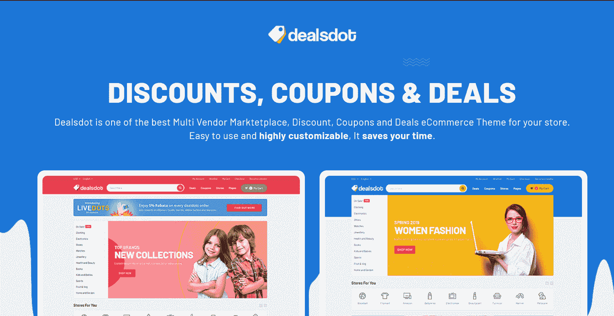

Dealsdot theme (Source: [ThemeForest](https://themeforest.net/))

[Dealsdot](https://themeforest.net/item/dealsdot-multi-vendor-marketplace-theme/25391284) 是一个多供应商市场主题，让您可以启动自己的商店，轻松推广和销售您的产品。

Dealsdot 帮助您创建带有代销商链接的优惠券和产品页面。参观者甚至可以通过点击复制优惠券代码。

WPBakery 页面生成器包含在主题中，帮助您用最少的技术技能创建专业外观的在线商店。

这个可定制的主题与 WooCommerce 兼容，提供了一个响应式的布局，只需点击一下就可以安装。

#### 主要附属主题功能

*   翻译就绪
*   无限的颜色
*   无限的谷歌字体
*   干净的代码
*   支持 Metabox
*   包含滑块旋转插件
*   WC Marketplace(多供应商插件)

#### 定价

Dealsdot 的价格为 49 美元，包括未来的更新和 6 个月的支持。您可以额外支付 13.88 美元将支持延长至一年。

### 20.Zox 新闻

Zox News theme (Source: [ThemeForest](https://themeforest.net/))

你不必管理一个新闻相关的网站来使用 Zox 新闻。通过多种布局选项，该主题可以根据联盟营销进行定制。

Zox 新闻主题包括一个评论插件，用于发布带有附属链接的深度评论。布局有广告横幅和其他宣传内容的空间。

如果你有兴趣在你的网站上发布视频评论，这个主题也支持音频和视频内容。内容以杂志风格显示，有各种可用的模板选项。

#### 主要附属主题功能

*   完全响应
*   包括免费插件(评论，忒伊亚粘性边栏，和忒伊亚邮报滑块)
*   挑逗帖子
*   woo 商务就绪
*   8 种不同文章布局选项可供选择
*   5 种不同的帖子布局
*   “继续阅读”按钮
*   谷歌放大器-就绪

#### 定价

Zox News 的价格是 55 美元，包含 6 个月的支持。额外支付 16.13 美元即可将支持延长至 12 个月。

### 21.权威专业人士

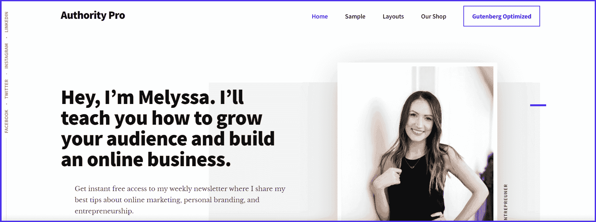

StudioPress 的 Authority Pro 是一个设计简单的联盟营销主题，功能丰富。

Authority Pro 基于 Genesis 框架构建，响应速度非常快。它有多个部件，可定制的页眉和页脚，并支持横幅广告网络。

Authority Pro 与 WooCommerce 插件兼容，只需点击几下即可设置完成。它带有一个主题定制器，可以帮助你的网站设计与你的品牌相匹配。

#### 主要附属主题功能

*   内置选择加入表单
*   特色小部件
*   证明书
*   古腾堡块编辑器
*   响应式设计
*   可定制的徽标
*   为可访问性而设计

#### 定价

Authority Pro 配有 Genesis Pro 或 Genesis framework，每年的价格为 360 美元。这使您可以获得支持，StudioPress 制作的所有主题，以及 60 天的退款保证。

### 22.专业美食家

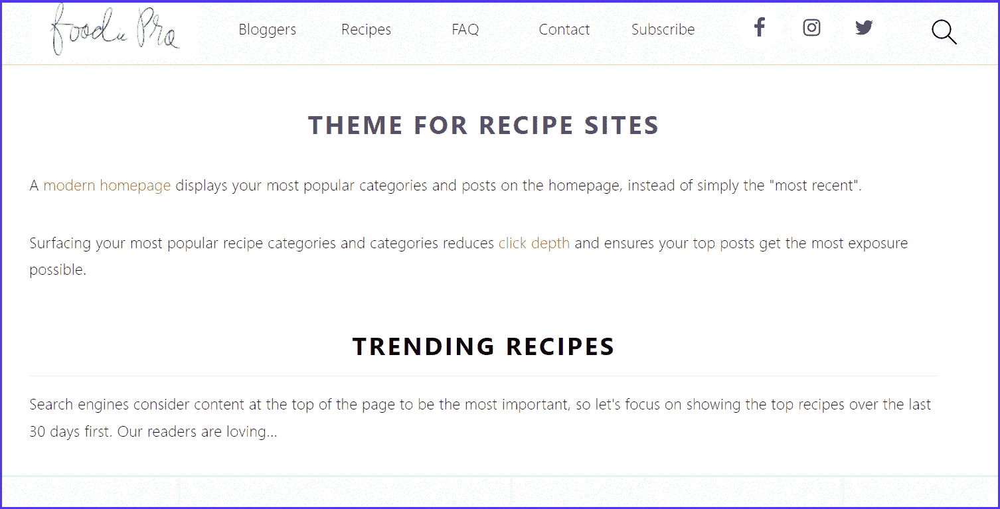

Foodie Pro theme (Source: [Feast Design Co](https://feastdesignco.com/))

无论你是一名专业厨师，还是一名想要建立自己网站的美食爱好者，Foodie Pro 都可以成为你的主题。由盛宴设计公司开发的 [Foodie Pro](https://feastdesignco.com/product/foodie-pro/) 拥有让你的博客吸引访客的所有功能。

这个主题帮助你创建食谱博客，由不同的产品或食品附属公司赞助。它的许多特性包括定制页面模板、主题定制器、小部件区域和可定制的标题。所有这些都有助于创建一个独特的网站布局。

在主页的顶部，显示了您所有的社交媒体帐户图标，以便轻松整合和共享社交媒体。Foodie Pro 主题也是移动响应的，使您的网站可以从任何设备访问。

#### 主要附属主题功能

*   颜色和版式定制选项
*   widget 化主页和食谱页面
*   特色图片
*   战略广告空间
*   自定义页面模板
*   移动响应

#### 定价

盛宴设计在这个主题上给你两个选择。第一种是以 19 美元购买没有额外支持的主题(Foodie Pro Classic 主题)。第二种是以每年 249 美元的价格购买该公司的盛宴插件。它提供自动主题更新和持续支持，并在 Feast Design 的其他食品相关主题中包含 Foodie Pro。

### 23.皈依者

Convert theme (Source: [CSSIgniter](https://www.cssigniter.com/))

由 CSSIgniter 开发的 [Convert](https://www.cssigniter.com/themes/convert/) 是一个专业外观的 WordPress 商业主题，面向中小型网站。它外观现代，布局灵活。

这个主题有许多功能来帮助推广你的产品，包括古腾堡编辑器来活跃街区。你也可以张贴作品集和案例研究。

使用 Convert，您可以灵活地选择排版和颜色控制，根据自己的喜好来定制网站设计。主题支持 3 种不同的页面生成器:Beaver Builder、Elementor 和 Divi。

#### 主要附属主题功能

*   自定义帖子类型
*   支持大多数 WordPress 插件
*   电子商务就绪
*   灵活布局
*   谷歌字体
*   粘性菜单
*   柔性接头
*   SEO 优化的

#### 定价

Convert 的售价为 49 美元，包括一年的支持和更新。CSSIgniter 还提供每年 69 美元或 79 美元(或一次性支付 249 美元)的“俱乐部”包，包括访问该公司的其他主题和插件。所有转换主题可以在无限的网站上使用。

### 24.多嘴的人

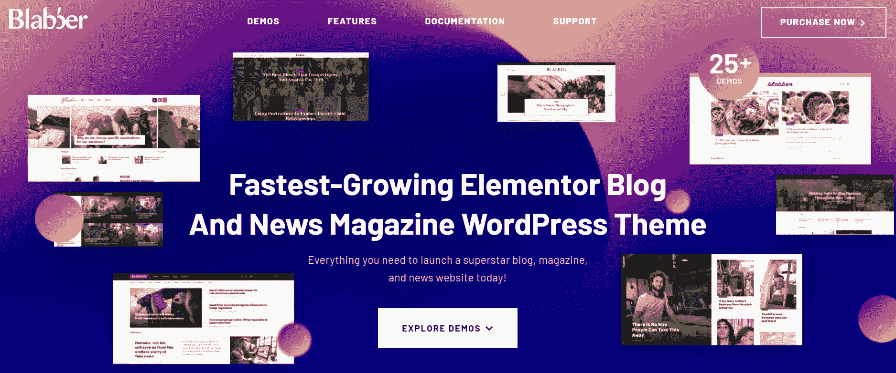

Blabber theme (Source: [ThemeForest](https://themeforest.net/))

是一个完全可定制的 WordPress 联盟营销主题，适合多种用途。它包括一个超过 25 个演示的库，可以根据您的喜好定制设计。在 Blabber 的演示中，有技术博客、旅游网站、游戏门户和美食博客的模板。

演示还附带了有影响力的[登陆页面](https://kinsta.com/blog/wordpress-landing-page-plugins/)和许多可选的页面元素。您可以混合搭配设计，进一步定制网站的布局。

Blabber 兼容 Elementor 页面生成器，支持 WooCommerce 创收。此外，该主题提供了[社交媒体整合](https://kinsta.com/blog/wordpress-social-media-plugins/)来提高你的网站的影响力。

#### 主要附属主题功能

*   支持多个插件(包括 Slider Revolution、MailChimp 和 Essential Grid)
*   响应主题
*   woo 商务就绪
*   社交媒体整合
*   预制标题样式
*   页眉和页脚布局生成器

#### 定价

Blabber 上的价格标签是 69 美元，其中包括未来的更新和 6 个月的支持。只需额外支付 21.38 美元，您就可以将支持延长至 12 个月。

### 25.从不

Neve homepage (Source: [Themeisle](https://themeisle.com/))

Neve 是一个多功能主题，具有可定制的布局和令人印象深刻的功能，可以帮助你快速建立一个网站。无论是代销商博客还是基于 WooCommerce 的网上商店，Neve 都能应付。

这个主题是翻译就绪，并提供了一个现场定制和自定义背景。您可以根据自己的需求定制页眉和页脚。不喜欢自己动手吗？Neve 也有一个包含 100 多个初学者站点的库，可以随时导入。

Neve 的布局和设计是移动友好的，因此访问者可以从任何设备访问您的网站。此外，主题是社交媒体就绪，以便您可以从网站的页眉或页脚链接我们的帐户。

#### 主要附属主题功能

*   自定义页眉和页脚
*   全局调色板
*   元素加速器
*   woo 商务就绪
*   自定义布局
*   支持移动和 AMP 兼容
*   搜索引擎优化友好

#### 定价

你可以免费试用 Neve，也可以选择它的三个套装中的一个——个人套装、商务套装和代理套装。这些计划的价格分别为 69 美元、149 美元和 259 美元。它们在一些功能上有所不同，但都有无限制的网站使用。

### 26.伊夫利特

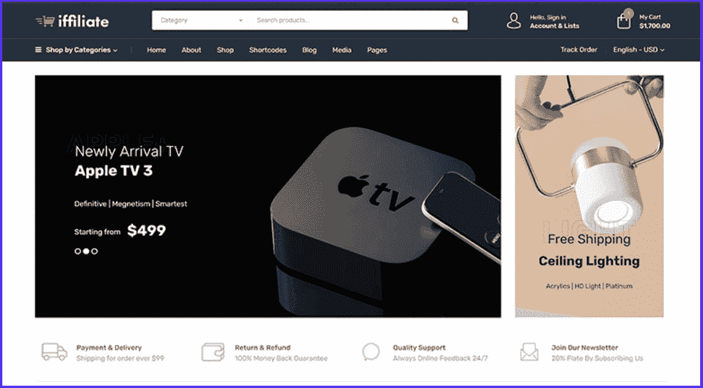

Iffiliate theme (Source: [ThemeForest](https://themeforest.net/))

Iffiliate 是一个可靠的联盟营销 WordPress 主题，它很灵活，可以用于各种目的。它允许您在网格、列表或单个产品页面中显示产品。

该主题包括 MT Mega Menu 插件，在 WPBakery Builder 的帮助下创建 Mega Menu。另一个有用的特性是 Ajax Live Search，它可以在您输入时显示产品搜索结果。

使用 iffiliate，您可以以多种方式展示您的产品和特价商品，并添加购物快捷方式。Iffiliate 通过 Redux 支持 ModernTheme 面板进行配置，无需高级技术技能。

#### 主要附属主题功能

*   多页脚宽化区域
*   自定义 CSS 框
*   自定义排版
*   支持 RTL 语言
*   一键演示导入
*   响应主题

#### 定价

iffiliate 的常规许可价格为 75 美元，包括六个月的支持。如果你想要延长到一年，它将是额外的 23.63 美元。

### 27.皮克斯韦尔

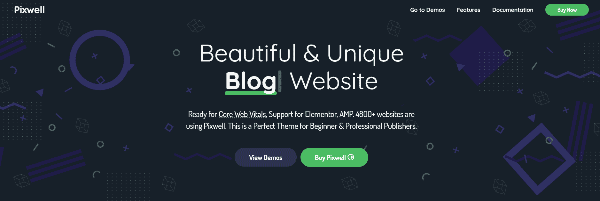

Pixwell theme (Source: [ThemeForest](https://themeforest.net/))

Pixwell 是一个当代杂志风格的联盟营销 WordPress 主题。它由 Theme-Ruby 开发，适用于各种内容，从短文到长篇博客文章和评论。

该主题有 30 多个预先制作的演示和一个广泛的布局库。所有这些都是手机友好和搜索引擎优化。访问者可以选择以暗模式或亮模式显示网站。

收藏书签功能允许用户将帖子加入书签，以便以后阅读。访问者可以发布对你的产品或作品的评论，并在网站上展示他们的用户体验。

#### 主要附属主题功能

*   无限的“下一个帖子”
*   相关短代码
*   画廊弹出式菜单
*   植入广告
*   交易和优惠券
*   Ajax 实时搜索
*   自定义页眉布局

#### 定价

获得 Pixwell 六个月的支持需要 59 美元。如果你想要 12 个月，你需要额外支付 17.63 美元。

### 28.CouponXL

CouponXL theme (Source: [ThemeForest](https://themeforest.net/))

顾名思义， [CouponXL](https://themeforest.net/item/couponxl-coupons-deals-discounts-wp-theme/10721950) 是一个用于创建优惠券网站的 WordPress 主题。然后，您可以使用代销商链接将这些优惠券货币化，并从您的网站上获得收入。

默认情况下，该主题的布局包括几个搜索栏，便于访问者找到您的最佳交易。他们还可以缩小搜索范围，找到离他们所在地较近的交易。

布局中有足够的空间以有组织和有吸引力的方式展示您的交易。您还可以显示您正在推广的其他产品的各种链接。此外，CouponXL 允许您的访问者注册并提交他们自己的优惠券和交易。

所有这些功能以及您的交易都可以通过 CouponXL 的用户友好型仪表盘进行管理。

#### 主要附属主题功能

*   Ajax 搜索
*   随机码发生器
*   会员制
*   响应主题
*   搜索引擎优化友好
*   支持 PayPal、Stripe 和其他几种支付渠道

#### 定价

您可以花 39 美元获得 CouponXL 和 6 个月的支持。只需额外支付 10.13 美元，您就可以将支持延长至一整年。

### 29.浮动

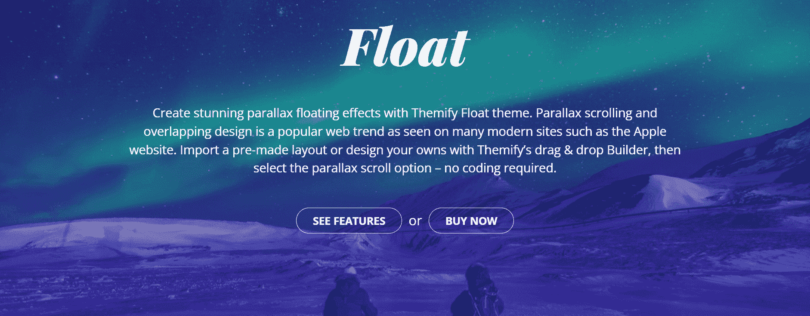

Float theme (Source: [Themify](https://themify.me/))

浮动是一个丰富多彩的联盟营销 WordPress 主题，通过视差滚动显示元素的浮动效果。主题的设计简单但细节丰富。

您可以导入一个演示布局或使用 Themify 的拖放构建器从头开始设计一个。过程中不需要编码。这个主题有几个适合不同领域的演示。

每个演示都有视差效果、重叠的页面元素、清晰的字体和各种各样的颜色。其他有用的功能包括社交媒体集成和 WooCommerce 支持。

#### 主要附属主题功能

*   响应主题
*   多种布局设计选项
*   预先设计的演示
*   支持网络商务
*   自定义小部件
*   自定义背景
*   无限的颜色

#### 定价

Float 的定价有两个选项:Standard，只包含主题 Developer，包含主题和 Photoshop 文件。这两个软件包都有 30 天退款保证，附带一年的支持和更新，可以在无限的网站上使用。

### 30.Netube

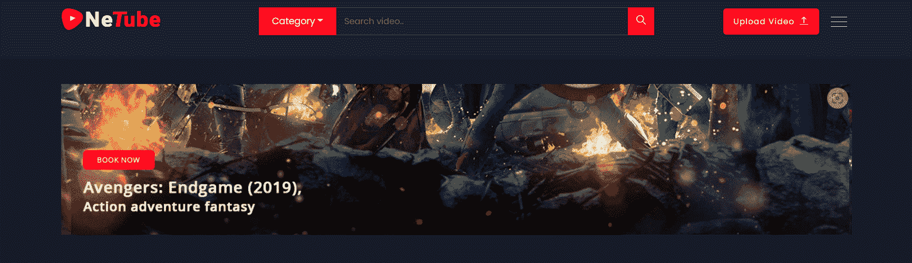

Netube theme (Source: [ThemeForest](https://themeforest.net/))

Netube 是一个用户友好的，视频杂志风格的 WordPress 主题，有许多布局变化，几十个短代码和几个有价值的插件。Netube 被设计成一次展示几个视频，是视频众多的产品评论网站的最佳联盟主题之一。它有很大的图像空间，允许你在不牺牲质量的情况下展示你的作品。

有了 Netube，你就可以按照收视率最高或浏览量最大这样的标准来组织你的内容。您还可以允许用户上传自己的视频。

响应式 Netube 主题只需点击一下就可以安装，并且可以根据您的喜好轻松定制。它是搜索引擎友好和翻译就绪。

#### 主要附属主题功能

*   平滑视差滚动
*   灯箱画廊
*   “即将推出”页面
*   包含儿童主题
*   翻译就绪
*   高级插件
*   完全响应
*   社交媒体整合
*   自定义小部件

#### 定价

Netube 的价格是 59 美元，包括终身更新和 6 个月的支持。额外支付 17.63 美元即可将支持延长至一年。

从这些主题中得到一点帮助，让你的会员网站焕然一新🚀 点击推文

## 摘要

各种网站设计可以支持联盟营销业务。最好的联盟 WordPress 主题是可定制的，SEO 友好的，并且在移动设备和桌面上都很好看。

最适合你的联盟营销工作的主题必须符合你的预算，并为你的内容提供所需的工具，无论是视频或博客风格的评论，产品比较表，还是成熟的在线商店。

使用上面的信息找到具有您需要的功能的主题，然后访问供应商的网站来尝试现场演示。

一旦你做出选择并安装了你的新主题，留意你的流量、[跳出率](https://kinsta.com/blog/how-to-reduce-bounce-rate/)和[转化率](https://kinsta.com/blog/conversion-tracking/)的统计数据，以确定你的主题是否有助于你的代销商业务的增长。

* * *

让你所有的[应用程序](https://kinsta.com/application-hosting/)、[数据库](https://kinsta.com/database-hosting/)和 [WordPress 网站](https://kinsta.com/wordpress-hosting/)在线并在一个屋檐下。我们功能丰富的高性能云平台包括:

*   在 MyKinsta 仪表盘中轻松设置和管理
*   24/7 专家支持
*   最好的谷歌云平台硬件和网络，由 Kubernetes 提供最大的可扩展性
*   面向速度和安全性的企业级 Cloudflare 集成
*   全球受众覆盖全球多达 35 个数据中心和 275 多个 pop

在第一个月使用托管的[应用程序或托管](https://kinsta.com/application-hosting/)的[数据库，您可以享受 20 美元的优惠，亲自测试一下。探索我们的](https://kinsta.com/database-hosting/)[计划](https://kinsta.com/plans/)或[与销售人员交谈](https://kinsta.com/contact-us/)以找到最适合您的方式。