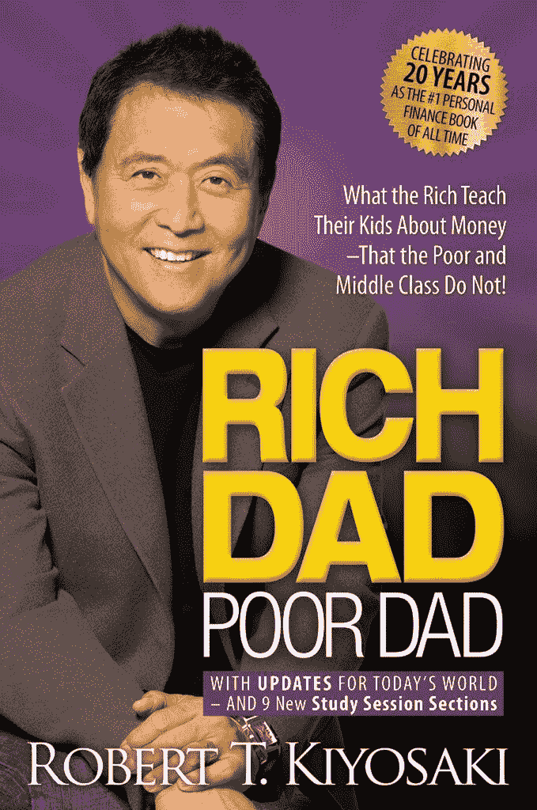
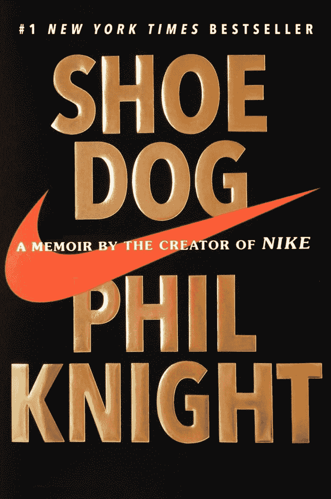
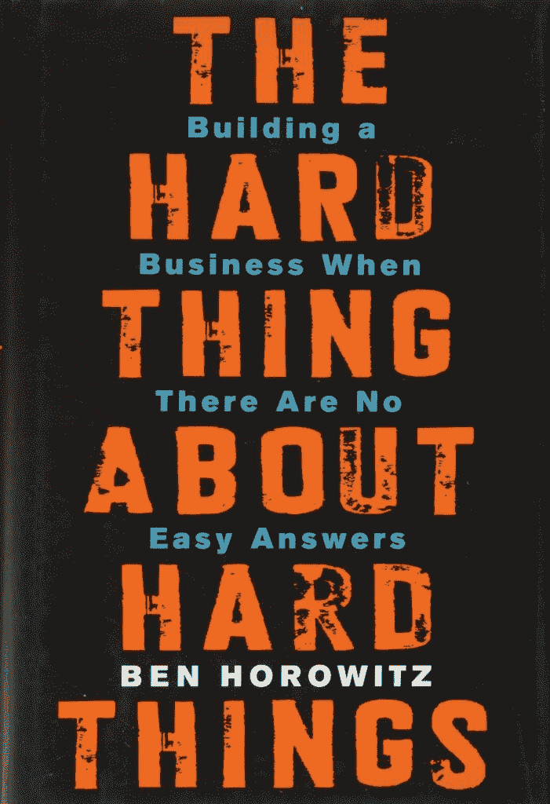
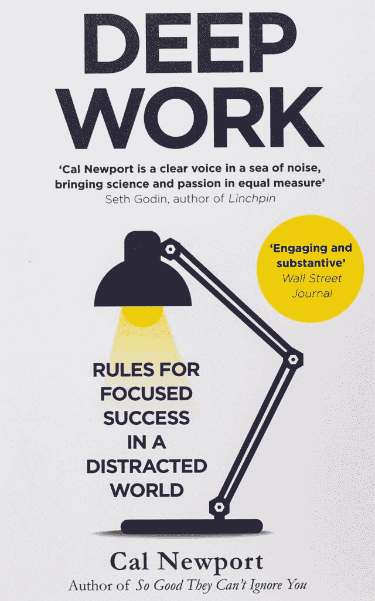
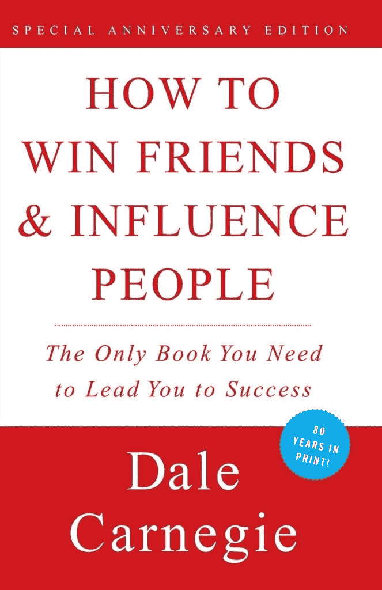
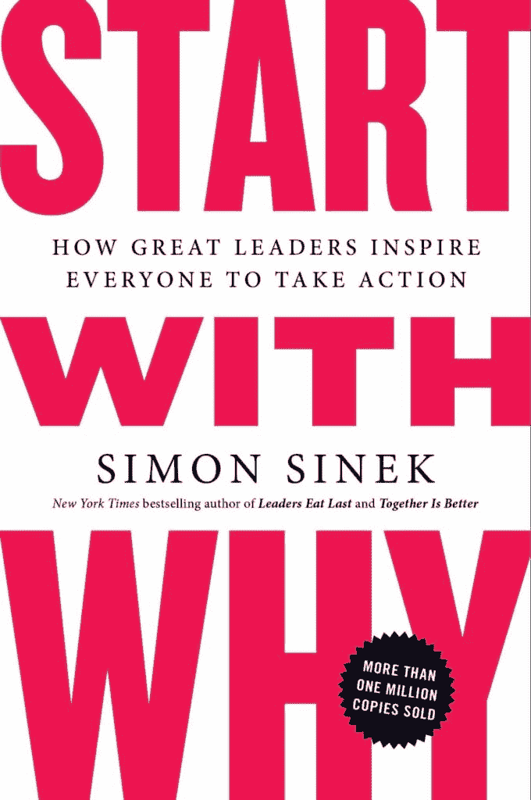
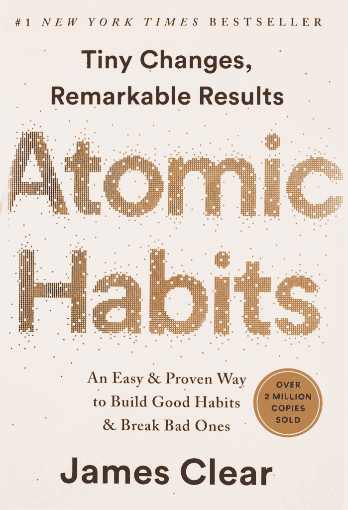
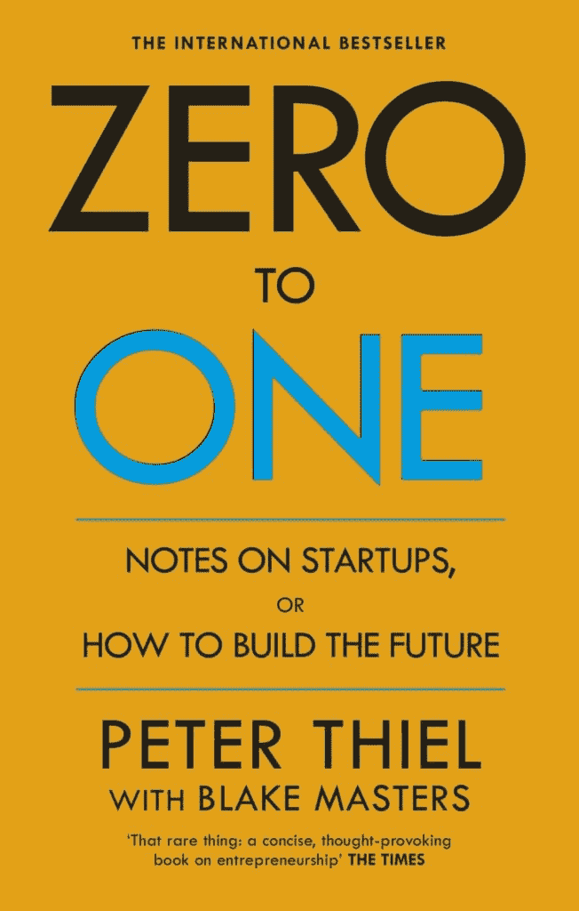
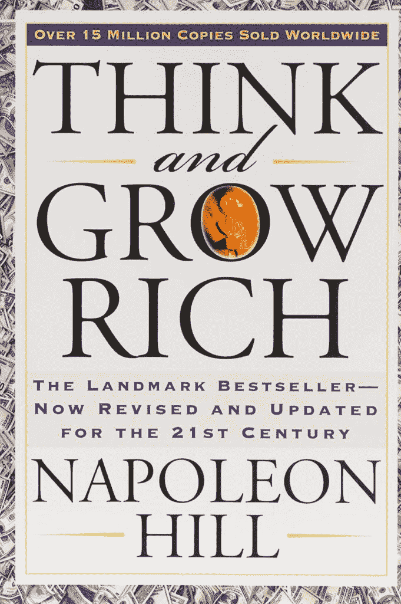

# 你的 10 本最佳商业书籍指南

> 原文：<https://kinsta.com/blog/best-business-books/>

对一些人来说，学习的过程在学校结束。但是，如果你想继续成长和完善自己，拥有一个一致的阅读习惯可以帮助你保持思维敏捷，培养你下一步行动所需的技能。

让我们开始吧！

## 阅读如何促进成功

许多非常成功的人吹捧阅读的好处，并声称这一习惯对他们今天的成就至关重要。

看一看:

*   沃伦·巴菲特 80%的时间都在阅读。
*   比尔·盖茨每年阅读大约 50 本书。
*   马克·扎克伯格每两周读一本书。
*   奥普拉·温弗瑞称书籍是她的“个人自由之路”
*   马克·库班每天阅读三个小时。

[Ready to get reading? 📚 These business books will make you a better entrepreneur, manager, and owner. ⬇️Click to Tweet](https://twitter.com/intent/tweet?url=https%3A%2F%2Fkinsta.com%2Fblog%2Fbest-business-books%2F&via=kinsta&text=Ready+to+get+reading%3F+%F0%9F%93%9A+These+business+books+will+make+you+a+better+entrepreneur%2C+manager%2C+and+owner.+%E2%AC%87%EF%B8%8F&hashtags=EntrepreneurTips%2CBizDev)

那么，从华尔街到硅谷的成功人士到底为什么要把那么多时间奉献给阅读呢？

> 需要在这里大声喊出来。Kinsta 太神奇了，我用它做我的个人网站。支持是迅速和杰出的，他们的服务器是 WordPress 最快的。
> 
> <footer class="wp-block-kinsta-client-quote__footer">
> 
> 
> 
> <cite class="wp-block-kinsta-client-quote__cite">Phillip Stemann</cite></footer>

[View plans](https://kinsta.com/plans/)

以下是几个主要原因:

*   [学习新技能](https://kinsta.com/blog/learn-wordpress/)
*   发现商务人士如何看待世界
*   扩展你的世界观和不同行业的知识
*   当障碍似乎势不可挡时寻找灵感

阅读帮助你保持思维敏捷，探索老问题的新解决方案，并向专家学习第一手资料。换句话说，阅读让你在完成学业或正式培训后仍能继续学习。

如果你确信，但你不知道从哪里开始，我们有你的掩护！

让我们来看看最好的商业书籍，让你开始。然后，我们将把这个必读清单分成不同的类别，以帮助你决定从哪里开始。

## 十大商业书籍

以下是我们的十大商业书籍终极清单，你应该深入阅读:

1.  罗伯特·清崎的《富爸爸穷爸爸》
2.  *鞋狗*菲尔·奈特著
3.  本·霍洛维茨的《关于硬东西的硬东西》
4.  *深度工作*由加州纽波特
5.  戴尔·卡内基《如何赢得朋友和影响他人》
6.  *从为什么开始*西蒙·西内克著
7.  *原子习惯*作者詹姆斯·克利尔
8.  *零比一*由彼得·泰尔
9.  *从优秀到卓越*吉姆·科林斯
10.  拿破仑·希尔的《思考致富》

现在，让我们把这些分成几类，这样你就知道从哪里开始了。

## 初学者最佳商业书籍

这里有两本适合初学者的书，可以加入你的阅读清单。他们将向你展示什么是商业思维，并证明更聪明地工作的价值。

### 1.富爸爸穷爸爸罗伯特清崎

*Cover of Rich Dad Poor Dad, one of the best business books for beginners. (Image source: [Amazon](https://www.amazon.com/Rich-Dad-Poor-Teach-Middle/dp/1612680178/))*

罗伯特·清崎的《富爸爸穷爸爸》已经成为有史以来最畅销的个人理财书籍。清崎分享了在两种父亲影响下成长的故事——他自己和他密友的“富爸爸”

清崎解释了这些人如何塑造了他对金钱和投资的看法。他揭开了阻止人们实现收入潜力的预期财务误解的帷幕。他还分享了他的旅程，并展示了让你的钱为你工作的力量。

### 2.菲尔·奈特的鞋狗

*Cover of Shoe Dog, one of the best business books for beginners. (Image source: [Amazon](https://www.amazon.com/Shoe-Dog-Memoir-Creator-Nike/dp/1501135910/))*

今天，耐克可能是一个全球图标，但它需要付出很多努力才能到达那里。在他的书 *Shoe Dog* 中，耐克的联合创始人菲尔·奈特谈到了他在商学院毕业后用从朋友那里借来的 50 美元创办了自己的公司。

奈特在他的回忆录中展现了有趣、有风度、未经过滤的自我，并讲述了他是如何选择企业家生活的非传统道路的。读者将以前所未有的方式了解奈特，并从他的旅程中受到启发，并被他来之不易的创业智慧所激励。

## 经理最佳商业书籍

知道如何做好自己的工作是一回事，学会如何管理他人的团队是另一回事。

这里有一些最好的领导力书籍，学习如何在工作中建立富有成效的关系，并让你的团队度过艰难时期并取得成功。

### 3.本·霍洛维茨的《艰难的事情》

*Cover of The Hard Thing About Hard Things, one of the best business books for managers. (Image source: [Amazon](https://www.amazon.com/Hard-Thing-About-Things-Building/dp/0062273205/))*

本·霍洛维茨是硅谷最受尊敬的企业家之一。在《艰难的事情的艰难之处》中，霍洛维茨揭开了帷幕，揭示了[带领一个成功的企业度过充满挑战的时代的真相。](https://kinsta.com/knowledgebase/coronavirus-covid-19/)

霍洛维茨的书包含了对任何商业领袖的重要建议，以他严肃的写作风格和一些说唱狂热分子生活中的标志性参考文献结尾。这是新手和老手的必读之作，尤其适合那些向艰难时期过渡并面临挑战的人。

### 4.卡尔·纽波特的深入研究

*Cover of Deep Work, one of the best business books for managers. (Image source: [Amazon](https://www.amazon.com/Deep-Work-Focused-Success-Distracted/dp/0349411905/))*

卡尔·纽波特教授在乔治敦大学教授计算机科学。他创造了“深度工作”这一术语，并解释了开放式办公室等现代商业福利和社交媒体等干扰如何阻碍高质量的工作。

## 注册订阅时事通讯

### 想知道我们是怎么让流量增长超过 1000%的吗？

加入 20，000 多名获得我们每周时事通讯和内部消息的人的行列吧！

[Subscribe Now](#newsletter)

在他的书《深度工作》中，纽波特强调了注意力分散对工作的负面影响。他总结了几个令人难忘的故事，展示了在一个心烦意乱的世界里打造一个更好的工作空间的重要性，并提供了令人惊讶的建议，比如无聊的价值。

### 5.戴尔·卡内基《如何赢得朋友和影响他人》

*Cover of How to Win Friends and Influence People, one of the best business books for managers. (Image source: [Amazon](https://www.amazon.com/How-Win-Friends-Influence-People/dp/0671027034/))*

戴尔·卡耐基的《纽约时报》畅销书*如何赢得朋友和影响他人*自 1936 年首次出版以来，已在全球售出超过 3000 万册。尽管是榜单上最古老的书，但它却是有史以来最著名的商业书籍之一。卡内基的建议继续经受时间的考验。

作为经理，你需要向你的团队成员推销你的想法和业务变化。卡耐基教你一个简单而有效的技巧，它建立在与人交流和说服别人接受你的思维方式的良好习惯上，而不会烧钱。

## 创业和扩大业务的最佳商业书籍

创业和扩大业务规模绝非易事，你的旅程肯定会令人兴奋。

这里有最好的商业书籍，可以帮助你获得资金、创业和成功。

### 6.从西蒙·西内克的《为什么》开始

*Cover of Start with Why, one of the best business books for starting and scaling a business. (Image source: [Amazon](https://www.amazon.com/Start-Why-Leaders-Inspire-Everyone/dp/1591846447/))*

企业家面临的首要问题之一是找到并保持那种激励他人的感觉。西蒙·西内克一直致力于找出是什么让一些组织具有创新性和影响力，并找到一种方法来帮助你在工作中更有灵感。

在*从为什么开始*中，Sinek 向你展示了从马丁·路德·金到史蒂夫·乔布斯等领导人是如何找到成功的，因为他们植根于他们的“为什么”他建立了一个黄金圈框架，使你能够使用相同的过程来建立一个激励他人的企业。

需要为您的电子商务网站提供超快的、可靠的、完全安全的托管服务吗？Kinsta 提供所有这些服务，并由 WooCommerce 专家提供 24/7 的世界级支持。[查看我们的计划](https://kinsta.com/plans/?in-article-cta)

### 7.詹姆斯·克利尔的原子习惯

*Cover of Atomic Habits, one of the best business books for starting and scaling a business. (Image source: [Amazon](https://www.amazon.com/Atomic-Habits-Proven-Build-Break/dp/0735211299))*

在早期保持灵感是具有挑战性的，没有什么比坏习惯更能阻碍你走向成功。

作家兼企业家 James Clear 认为问题不在于你。而是你的系统。在*原子习惯:打破坏习惯和建立好习惯的简单而行之有效的方法*中，Clear 给了你一个行之有效的系统，你可以每天使用它来改善你的决策，培养更好的习惯，克服意志力的缺乏。

通过创造一个成功的环境，你不必每天都依赖于聚集动力。Clear 将复杂的想法分解成简单可行的建议，他帮助你掌握建立良好习惯并最终导致显著结果的小行动。

### 8.彼得·泰尔以零比一领先

*Cover of Zero to One, one of the best business books for starting and scaling a business. (Image source: [Amazon](https://www.amazon.com/Zero-Notes-Start-Ups-Build-Future/dp/0753555190/))*

如果你正在寻找一本实用而乐观的书来激发你的创造力，那就拿起彼得·泰尔的*零比一。*彼得·泰尔是 [PayPal](https://kinsta.com/blog/stripe-vs-paypal/) 的联合创始人，在他的书中，他概述了他对如何建设你想要看到的未来的想法和见解。

这是速读，一两天就能把书看完。然而，它仍然充满了 Thiel 在 PayPal 和其他先驱创始人如比尔盖茨的励志故事。你可以用他的“每个企业必须回答的七个问题”来检验和完善你的想法和流程。

## 小企业主最佳商业书籍

小企业主面临独特的挑战，但他们的目标是相同的:[建立一个繁荣的企业](https://kinsta.com/webinars/from-freelance-to-agency/)，而不仅仅是生存。

这里有一些最好的书，适合准备将经营提升到一个新水平的小企业主。

### 9.吉姆·科林斯的《从优秀到伟大》

*Cover of Good to Great, one of the best business books for small business owners. (Image source: [Amazon)](https://www.amazon.com/Good-Great-Some-Companies-Others/dp/0066620996/)*

吉姆·科林斯从一个问题开始了他从优秀到卓越的写作之旅:“为什么有些企业能持续，而有些不能？”他组建了一个团队，研究持续时间超过 15 年并取得成功的精英公司。

在他的书中，柯林斯概述了伟大的方方面面，包括“第五级领导者”和“纪律文化”。这是一篇经过精心研究和精心撰写的文章，为创建繁荣的企业提供了实用的建议。

### 10.拿破仑·希尔的《思考致富》

*Cover of Think and Grow Rich, one of the best business books for small business owners. (Image source: [Amazon](https://www.amazon.com/Think-Grow-Rich-Landmark-Bestseller/dp/1585424331/ref))*

就像如何赢得朋友和影响他人一样，*思考致富*自 20 世纪 30 年代以来就一直存在，并提供了经得起时间考验的见解。它充满了永恒的智慧和可行的建议，帮助你从生活中得到你想要的。

拿破仑·希尔展示了心态的力量，并概述了处理自我怀疑和懒惰等个人障碍的方法。这本书的粉丝们建议在阅读这本书的同时做希尔的练习，并反复阅读，以获得最大的收获。

[Want to keep your mind sharp and develop the skills you need to make your next career move? ✅ Check out these business books for strategies from the experts 🤓Click to Tweet](https://twitter.com/intent/tweet?url=https%3A%2F%2Fkinsta.com%2Fblog%2Fbest-business-books%2F&via=kinsta&text=Want+to+keep+your+mind+sharp+and+develop+the+skills+you+need+to+make+your+next+career+move%3F+%E2%9C%85+Check+out+these+business+books+for+strategies+from+the+experts+%F0%9F%A4%93&hashtags=Entrepreneur%2CBizTips)

## 摘要

如果你想让你的事业和生意更上一层楼，这些畅销书都可以帮你实现。像我们名单上的这些书可以帮助你洞察商界成功人士的思想，并从他们来之不易的智慧中学习。

对于那些想要提高商业技能的人来说，这个列表是一个很好的起点。然而，除此之外，还有很多有见地的商业书籍可以帮助你更深入地钻研任何你感兴趣的话题。

想要从成功的企业家那里获得更多有价值的建议和深刻的教训，请听听我们的[逆向工程](https://kinsta.com/podcast/) [播客](https://kinsta.com/podcast/)。你可以探索各种话题，从[创造伟大的文化](https://kinsta.com/podcast/culture-key-to-business-growth/)到创业，这样你就可以支持你想要的生活方式。

现在，我们希望听到您的意见。你最喜欢的商业书籍是什么？我们应该在列表中添加什么标题，为什么？请在下面的评论区告诉我们。

* * *

让你所有的[应用程序](https://kinsta.com/application-hosting/)、[数据库](https://kinsta.com/database-hosting/)和 [WordPress 网站](https://kinsta.com/wordpress-hosting/)在线并在一个屋檐下。我们功能丰富的高性能云平台包括:

*   在 MyKinsta 仪表盘中轻松设置和管理
*   24/7 专家支持
*   最好的谷歌云平台硬件和网络，由 Kubernetes 提供最大的可扩展性
*   面向速度和安全性的企业级 Cloudflare 集成
*   全球受众覆盖全球多达 35 个数据中心和 275 多个 pop

在第一个月使用托管的[应用程序或托管](https://kinsta.com/application-hosting/)的[数据库，您可以享受 20 美元的优惠，亲自测试一下。探索我们的](https://kinsta.com/database-hosting/)[计划](https://kinsta.com/plans/)或[与销售人员交谈](https://kinsta.com/contact-us/)以找到最适合您的方式。