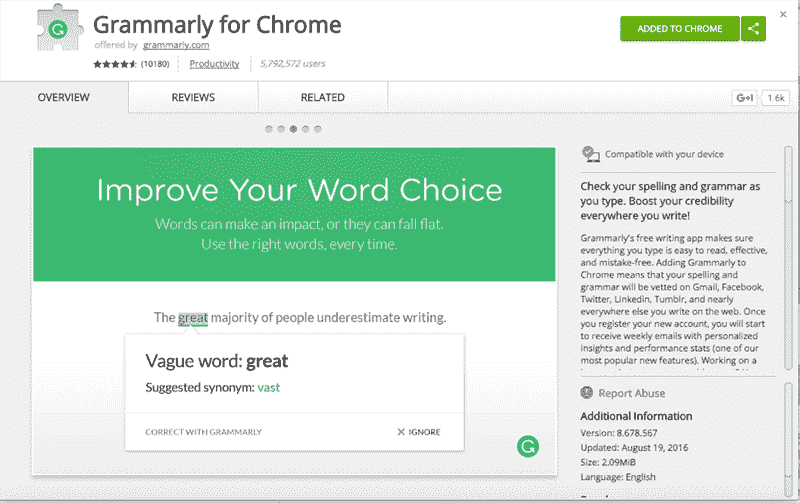
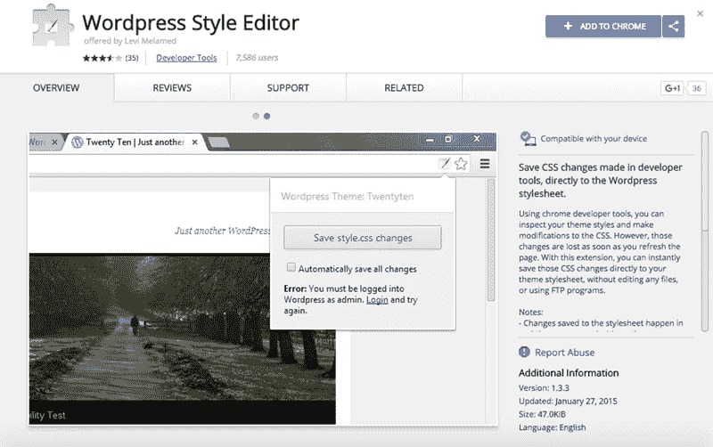
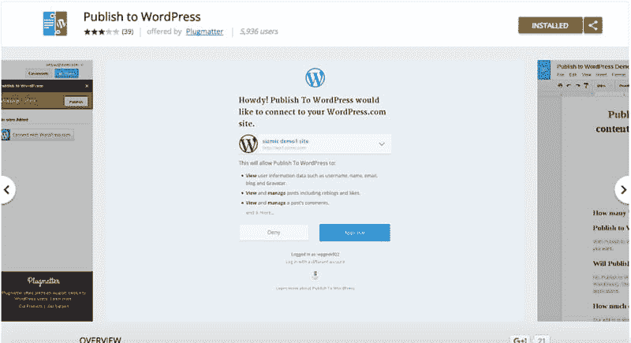
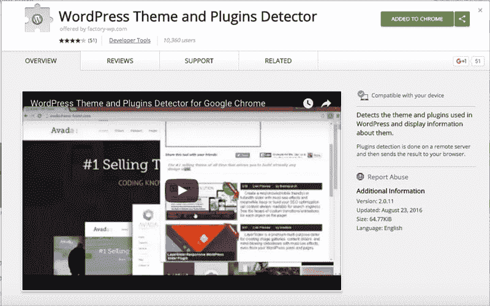
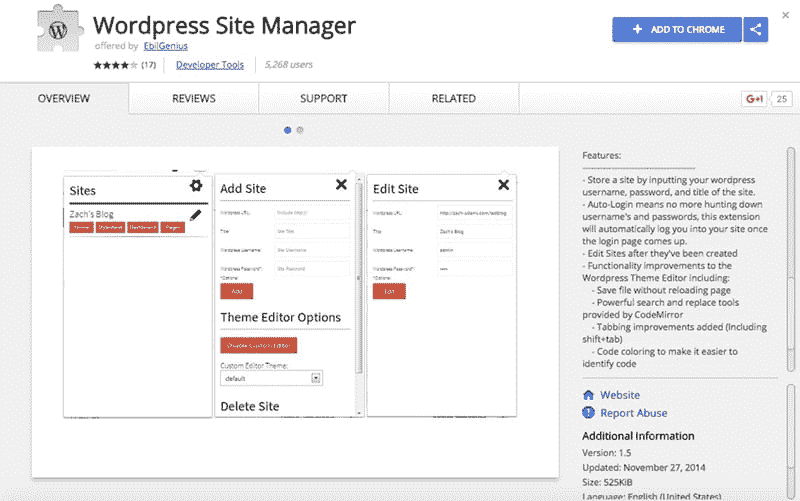
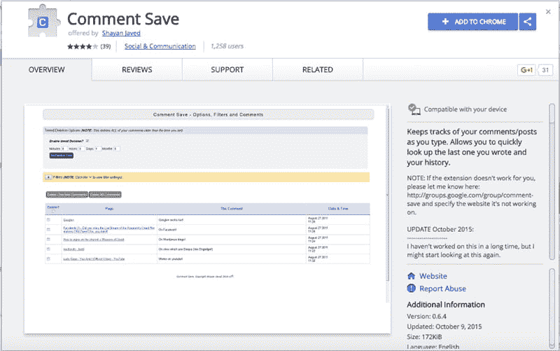
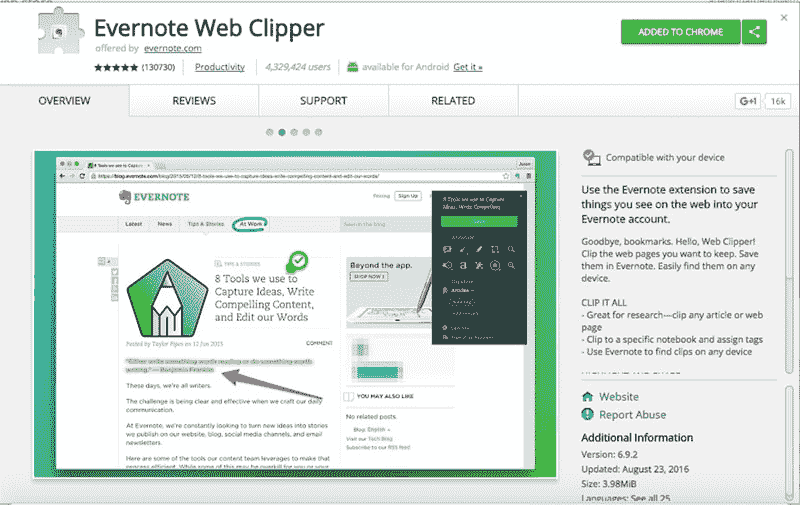
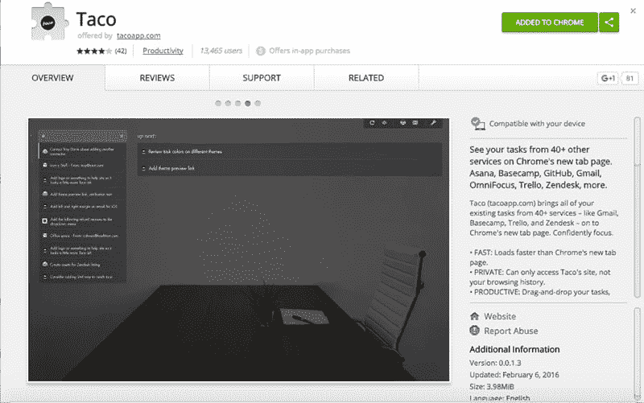
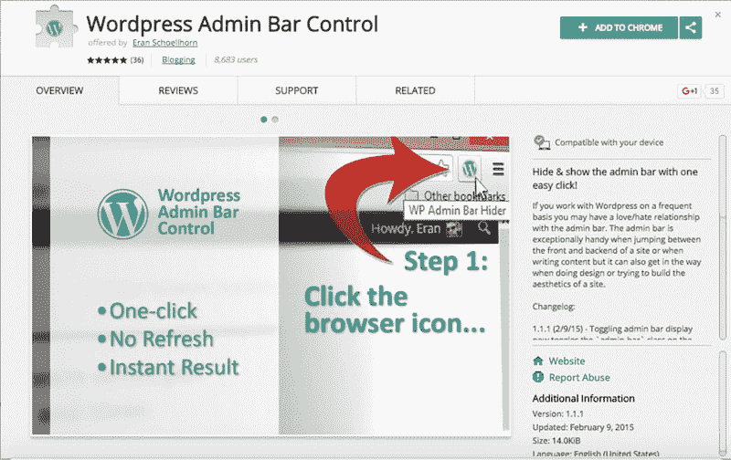

# WordPress 用户提高生产力的最佳 Chrome 扩展

> 原文：<https://kinsta.com/blog/best-chrome-extensions/>

许多人喜欢 WordPress ,不仅仅是因为它的开源特性、易用性和丰富的华丽主题，还因为它的插件允许你给你的网站添加不同的功能。多亏了这些插件，你可以创建一个强大的网站来完美地满足你的需求，而不必自己编码。正是这些插件让你在更短的时间内做更多的事情。

无论你写博客是为了商业还是娱乐，毫无疑问，除了 WordPress，你每天都在使用各种其他工具。其中一个工具就是你的浏览器。说到浏览器，Chrome 仍然高居榜首，拥有 73%的浏览器市场份额。与 WordPress 类似，浏览器最受欢迎的功能之一是添加额外功能的 Chrome 扩展。

幸运的是，对于我们 WordPress 用户来说，Chrome 有很多扩展，可以让你节省时间，提高效率。

如果你正在使用 Gmail，请确保查看这些[顶级 Gmail 插件和扩展](https://kinsta.com/blog/gmail-add-ons/)。

## WordPress 用户的 9 大最佳 Chrome 扩展

在这篇文章中，我们将为 WordPress 用户强调最好的 Chrome 扩展来提高生产力。

*   [语法](#grammarly)
*   [WordPress 风格编辑器](#wordpress-style-editor)
*   [发布到 WordPress](#publish-to-wordpress)
*   [WordPress 主题&插件检测器](#wp-themes-plugin-detector)
*   WordPress 站点管理器
*   [评论保存](#comment-save)
*   [Evernote Web Clipper](#evernote)
*   [玉米卷](#taco)
*   WordPress 管理栏控件

### 1 .[语法](https://chrome.google.com/webstore/detail/grammarly-for-chrome/kbfnbcaeplbcioakkpcpgfkobkghlhen?hl=en)

Grammarly 是迄今为止最好的 Chrome 扩展之一，尤其是在你写作的时候！这是一个[拼写和语法检查器](https://kinsta.com/blog/grammar-checker-tools/)，可以在你的浏览器中工作，可以[在你可以输入文本的任何地方纠正你的拼写和语法错误](https://kinsta.com/blog/proofreading-tips/)，这样你就可以改进你的文案、页面、产品，甚至你的电子邮件。最精彩的部分？它甚至可以在你的 WordPress 文章编辑器中工作，所以你可以放心，在你点击发布之前，你所有的错别字都会被发现。

除了给错误加下划线，当你将鼠标悬停在有问题的单词上时，Grammarly 还会显示更正建议。然后，您可以点击建议接受它，并自动纠正错误。

在极少数情况下，语法可能会有一点错误，尤其是当你使用一个日常对话中不常使用的词时。然而，你可以很容易地将它添加到你的个人字典中，并且语法上将忽略这个单词的所有未来实例。总的来说，对于任何想提高写作水平的人来说，语法是不可或缺的工具。

### 2。 [WordPress 风格编辑器](https://chrome.google.com/webstore/detail/wordpress-style-editor/bgdpllcnhcmpfcheafdhimpklhjoommn?hl=en)

如果你使用 WordPress 已经有一段时间了，你可能习惯于使用开发者工具来检查你的站点上的某些元素，以改变你的主题的 CSS 文件的样式。虽然开发人员工具确实可以更容易地找到您需要更改的确切元素和样式，但是一旦您刷新页面，更改就消失了。

WordPress Style Editor 允许你点击一个按钮，立即将这些修改保存到你的样式表中。只要你登录到你的 [WordPress dashboard](https://kinsta.com/knowledgebase/wordpress-admin/) ，你的更改将会立即生效。这个小宝石是伟大的快速变化，你需要立即修复，不想通过点击整个仪表板，使他们。

### 3。[发布到 WordPress](https://chrome.google.com/webstore/detail/publish-to-wordpress/lllekagcmcimoimdjlchepfokgengccb?hl=en-US)

如果你在上传文章到 WordPress 之前使用 Google Docs 来写文章，那么 Publish to WordPress 是一个必备的扩展。它是 Google Docs 的一个插件，允许你直接在你的 WordPress 博客或网站上发布你的文章及其图片和格式，而无需登录 WordPress。

如果你有多个博客，这个插件也能工作。你所要做的就是添加你的博客，在谷歌文档中写下你的文章，然后点击发布。您可以选择立即发布或将其保存为草稿，如果您需要等待编辑批准您的帖子，或者如果您希望将帖子安排在特定日期发布，这将非常有用。

推荐阅读:[Google Docs to WordPress](https://kinsta.com/blog/google-docs-to-wordpress/)–你需要知道的 5 个窍门

### 4 。 [WordPress 主题&插件检测器](https://chrome.google.com/webstore/detail/wordpress-theme-and-plugi/jdflfokckhmchfpokjmpcoblghjngjja?hl=en)

## 注册订阅时事通讯

### 想知道我们是怎么让流量增长超过 1000%的吗？

加入 20，000 多名获得我们每周时事通讯和内部消息的人的行列吧！

[Subscribe Now](#newsletter)

你有没有遇到过这样一个网站，它能在视觉上立刻激起你的兴趣，因为它的一切都非常完美？想知道他们是怎么做到的吗？嗯，多亏了这个扩展，你可以很容易地找到某个网站正在使用哪个主题。除此之外，你还可以看到他们在网站上激活了哪些插件。

推荐阅读: [WordPress 免费与付费主题](https://kinsta.com/blog/wordpress-free-vs-paid-themes/):哪个适合你的下一个项目？

### 5 。WordPress 网站管理员

许多 WordPress 用户，尤其是开发者每天都要管理多个 WordPress 网站。如果您是其中之一，您就会知道不断地在仪表板之间切换并进行必要的更改是多么耗时。WordPress 站点管理器提供了一种更快更简单的方式在仪表板之间切换。它提供了对网站不同部分的快速访问，你可以添加任意多的站点。

### 6 。[评论保存](https://chrome.google.com/webstore/detail/comment-save/ndmcbhmmonjkclhmeidccodfhlifmmco?hl=en)

作为不同 WordPress 网站的投稿人，你知道参与评论和保持讨论活跃的重要性。评论保存是一个完美的扩展，可以节省你大量的时间，因为它可以跟踪你在网上任何地方写的评论和帖子。你可以很容易地查找你最后一次在某个网站上发表评论是什么时候，浏览你的评论历史，甚至可以禁用你不想跟踪或不再需要跟踪的网站。

Struggling with downtime and WordPress problems? Kinsta is the hosting solution designed to save you time! [Check out our features](https://kinsta.com/features/)

### 7 。 [Evernote Web Clipper](https://chrome.google.com/webstore/detail/evernote-web-clipper/pioclpoplcdbaefihamjohnefbikjilc?hl=en)

Evernote 被吹捧为你的虚拟大脑，让你可以记录生活中任何重要的事情。Evernote Web Clipper 是他们众多扩展中的一个，在你为下一篇博客文章做研究时特别有用。你可以完整地剪辑文章，也可以剪辑一个简化的版本，去掉所有干扰，只保留文章本身。

您还可以将网页的部分内容[保存为截图](https://kinsta.com/blog/how-to-screenshot-on-mac/)或为您的选择添加注释。只需安装扩展，将文章夹到指定的笔记本中，添加标签，就大功告成了！Evernote Web Clipper 确实是一个有用的研究工具。

### 八个零。[玉米卷](https://chrome.google.com/webstore/detail/taco/aogabobfbepcehdkbfagdflinolncebh?hl=en)

虽然这个扩展不会直接从你的浏览器中发送玉米卷，但是如果你经常和别人合作，它会节省你大量的时间。似乎每个人对任务经理都有自己的偏好，找到一个让每个人都满意的经理是不可能的任务。这就是玉米卷派上用场的地方。

Taco 允许你从不同的服务中访问你的所有任务，例如 [Asana，Trello](https://kinsta.com/blog/trello-vs-asana/) ，ToDoist， [BaseCamp](https://kinsta.com/blog/trello-alternative/#3-basecamp) 等等；并将它们显示在一个中心位置——Chrome 的新标签页。现在，您不必在不同的应用程序之间切换，也不必使用 IFTTT 食谱来掌握您需要做的一切。相反，Taco 会替你做，你可以轻松地将任务标记为完成，就像你登录到任务管理器应用程序本身一样。花更少的时间跟踪需要做什么，专注于实际去做。

### 9 。管理栏控件

WordPress 管理栏对于[快速访问你网站的仪表板](https://kinsta.com/knowledgebase/wordpress-admin/)或者当你从前端浏览你的网站时在不同部分之间跳转是非常有用的。但是，当你想看看一个通知栏插件在你的网站上是什么样子，或者你的网站的重要元素在修改后是什么样子，管理栏经常会碍事。

虽然有一种方法可以在您的个人资料编辑器中禁用它，但如果您想保持对您的仪表板的快速访问，您必须在查看完更改后重新启用它。更不用说经常这样做浪费时间。一旦你安装了 WordPress 管理栏控件，你可以通过点击浏览器地址栏中的图标来隐藏管理栏。

## 包扎

有更多的扩展对 WordPress 用户特别有用，可以帮助你在更短的时间内完成更多的事情。本文中的扩展只是冰山一角，它可以帮助你快速有效地创建和管理你的 WordPress 站点。

你认为最好的 chrome 扩展有哪些？清单上应该有什么？请在下面的评论中告诉我们！

* * *

让你所有的[应用程序](https://kinsta.com/application-hosting/)、[数据库](https://kinsta.com/database-hosting/)和 [WordPress 网站](https://kinsta.com/wordpress-hosting/)在线并在一个屋檐下。我们功能丰富的高性能云平台包括:

*   在 MyKinsta 仪表盘中轻松设置和管理
*   24/7 专家支持
*   最好的谷歌云平台硬件和网络，由 Kubernetes 提供最大的可扩展性
*   面向速度和安全性的企业级 Cloudflare 集成
*   全球受众覆盖全球多达 35 个数据中心和 275 多个 pop

在第一个月使用托管的[应用程序或托管](https://kinsta.com/application-hosting/)的[数据库，您可以享受 20 美元的优惠，亲自测试一下。探索我们的](https://kinsta.com/database-hosting/)[计划](https://kinsta.com/plans/)或[与销售人员交谈](https://kinsta.com/contact-us/)以找到最适合您的方式。