# 15 个最佳元素或主题(以及何时使用它们)

> 原文：<https://kinsta.com/blog/best-elementor-themes/>

使用 [WordPress 页面生成器](https://kinsta.com/blog/wordpress-page-builders/)可以让你的工作更容易。有了[元素或](https://kinsta.com/blog/wordpress-elementor/)，你可以使用预先构建的元素和直观的拖放构建器从头开始设计完整的网站。然而，并不是所有的主题都适合每一个页面生成器，包括 Elementor。

一些主题被设计成与 Elementor 兼容或者开箱即用。使用 Elementor 友好的主题意味着在使用页面生成器创建页面或整个网站时，你会遇到更少(如果有的话)的错误。

在本文中，我们将简要介绍什么是 Elementor 以及它是如何工作的。我们将讨论 Elementor 和 WordPress 主题的区别。最后，我们将向你介绍 15 个我们最喜欢的 WordPress 元素或主题。我们开始吧！

## 什么是元素？

[Elementor](https://wordpress.org/plugins/elementor/) 是一个 WordPress 页面生成器插件。这是市场上最受欢迎的选项之一，早在[古腾堡块编辑器](https://kinsta.com/blog/gutenberg-wordpress-editor/)出现之前，它就提供了基于块的设计:

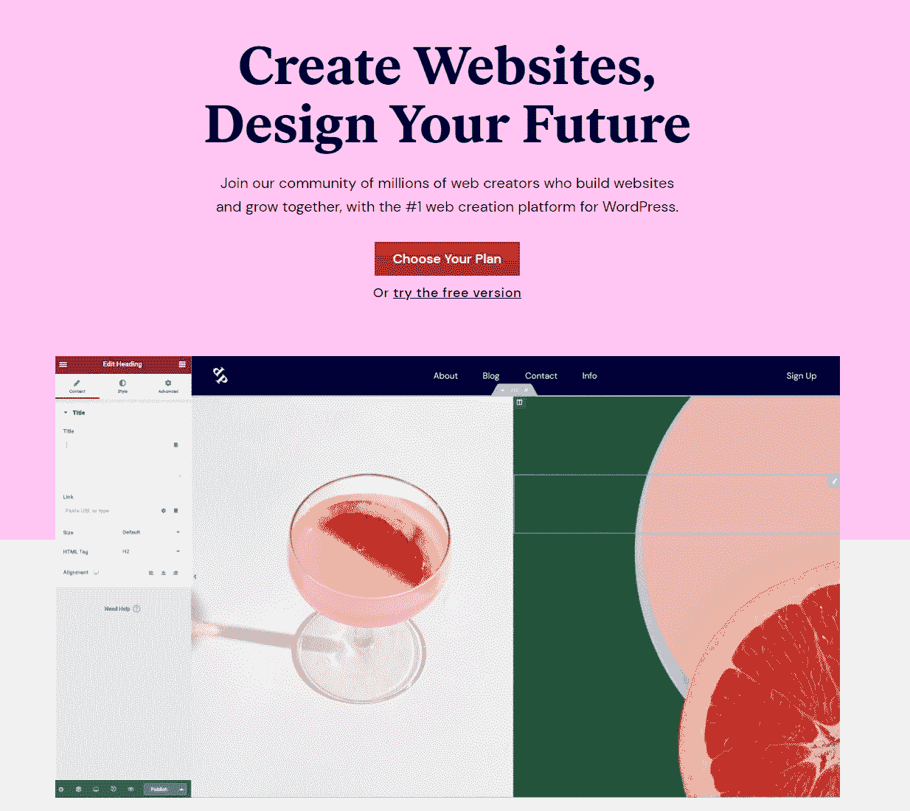

Elementor page builder

如今，Elementor 已经超越了一般的插件。数百万人使用免费版的页面生成器，其中包括 40 多个免费的小部件和模块。Elementor 甚至可以让你访问一组 [Elementor 模板](https://kinsta.com/blog/elementor-templates/)来启动你的网站设计。

如果你使用 Elementor 的高级版本，你可以使用更多的模板和高级模块。Elementor Pro 还附带了一个主题生成器，可以让你编辑主题风格的各个方面。

主题生成器可以使用 Elementor 转换几乎任何主题。但是，有些主题天生就与页面生成器兼容。在下一节中，我们将讨论主题与 Elementor 兼容意味着什么。

**主要特性:**

*   拖放式可视化生成器
*   完全响应设计
*   使用插件的免费版本可以访问 40 多个模块(使用 Elementor Pro 可以访问 90 多个模块)
*   一系列现成的免费和高级模板
*   Elementor Pro 提供的内置主题生成器

**价格:**[免费版 Elementor](https://wordpress.org/plugins/elementor/) 是个人项目的绝佳选择。高级许可从[开始，每年 49 美元](https://elementor.com/pricing/)。他们为多个网站提供支持，提供专门的客户支持，并提供对其他模块/模板的访问。

[使用 WordPress 页面生成器可以让你的工作变得更简单，而使用 Elementor，你可以从头开始设计完整的网站。😌在本指南中了解更多⬇️ 点击推文](https://twitter.com/intent/tweet?url=https%3A%2F%2Fkinsta.com%2Fblog%2Fbest-elementor-themes%2F&via=kinsta&text=Using+WordPress+page+builders+can+make+your+work+easier%2C+and+with+Elementor%2C+you+can+design+full+websites+from+scratch.+%F0%9F%98%8C+Learn+more+in+this+guide+%E2%AC%87%EF%B8%8F&hashtags=WebDesign%2CElementor)

## Elementor 主题和 WordPress 主题的区别

Elementor 主题是 WordPress 主题，旨在与页面生成器无缝协作。从技术上讲，你可以在 Elementor 旁边使用任何 WordPress 主题。

然而，注意一些流行的 WordPress 主题的描述。你可能会注意到他们经常提到他们兼容的页面生成器。

这是因为有大量的 WordPress 页面生成器可供选择。每一个都提供了不同的模块集，它们的编码也不同。一个适用于特定页面构建器的主题([比如 Divi](https://kinsta.com/blog/divi-vs-elementor/) 或者 [Beaver Builder](https://www.wpbeaverbuilder.com/) )在你使用另一个工具时可能看起来完全不同。

一般来说，对于页面构建者来说，最好的 WordPress 主题接近于空白的石板。这种简单性让您可以完全控制每个元素的样式。然而，如果你是*而不是*使用页面生成器(因为你是从头开始设计一切)，最小样式的主题需要更多的工作。

如果你想在多个项目中使用 Elementor，找到一个与插件配合得很好的主题会让你省去很多麻烦。你甚至不需要为一个高级主题付费，因为有很多免费的元素或者友好的选项。

## 安装元素或主题

Elementor 主题是 WordPress 主题。这意味着安装过程就像任何其他主题一样。

如果你正在安装一个 WordPress.org 的免费主题，你可以简单地从仪表板的**外观>主题>添加新的**标签中查找并安装它。

事实上，Hello Elementor 是最先出现在搜索结果中的主题之一。这是 Elementor 开发团队的免费主题:

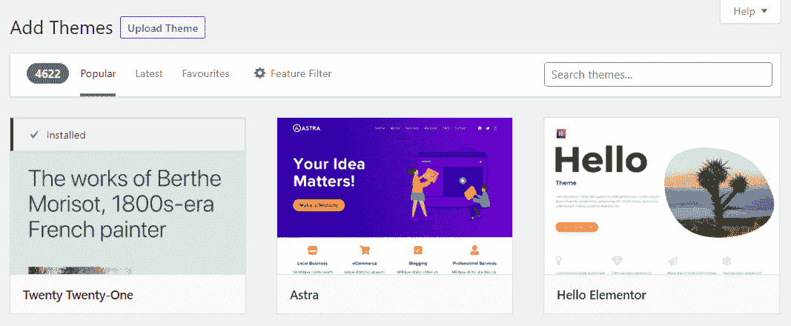

Installing a new Elementor theme

对于存储库中没有的主题，您可以使用**上传主题**按钮来上传它们。在这种情况下，如果使用高级产品，您可能还需要购买许可证。

如果你已经在使用 Elementor，你需要明白主题和模板不是一回事。您可以在安装的任何主题上使用 Elementor 或 templates。模板只是现成的设计，您可以使用 Elementor 或页面生成器来构建和导入。

## 2022 年 15 个最佳元素或主题

在这一节中，我们将简要介绍我们最喜欢的元素或主题。我们将涵盖免费和高级选项，并帮助您找出最适合您的需求！

### 1.Hello Elementor(免费)

Hello Elementor

如果您不熟悉页面生成器，我们建议您使用提供最少样式的主题。通过这种方式，您可以学习如何使用 Elementor 模块，并在空白板上看到它们的实际操作。

你好元素师是元素师背后的同一个团队的主题。它简约而轻巧。该主题提供了非常简单的样式来创建页面和定制模块，兼容性问题很少。

如果你想设计你的网站的每一个方面，并且你不是真的在寻找一个有自己独特外观的主题，我们推荐你使用 Hello。另外，Hello 可以与任何 Elementor 模板无缝协作。

**主要特性:**

*   简约风格
*   性能卓越的轻量级主题
*   [兼容 WooCommerce](https://kinsta.com/learn/woocommerce-guide/)

**价格:** Hello Elementor 是免费主题。

### 2.GeneratePress(免费和高级)

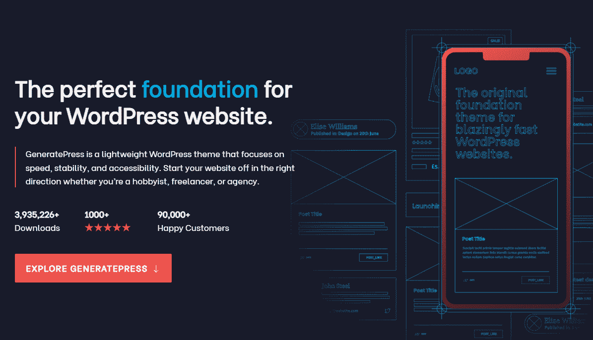

GeneratePress

[GeneratePress](https://generatepress.com/) 是一个关于兼容性的主题。它被设计成能与尽可能多的插件和网站类型一起工作。如果你支付 GeneratePress Premium，你甚至可以获得一个名为 [GenerateBlocks](https://generateblocks.com/) 的独立页面生成器插件。

GeneratePress 的免费版本可以与 Elementor 完美配合，并提供出色的网站性能。使用 GeneratePress，你可以设计[高级导航菜单](https://kinsta.com/blog/website-navigation/)并使用 Elementor 旁边的主题内置布局系统。

使用 GeneratePress 的最大好处之一是它的高级许可支持多达 500 个网站。这使得这个主题非常适合与许多客户打交道的代理商和自由职业者。

**主要特性:**

*   完全兼容大多数插件，包括 Elementor
*   自带页面生成器插件
*   包括多种类型的导航菜单
*   有广泛的页面布局选项可供选择

价格:generate press 有一个免费版本。主题的高级版本从[开始，每年 59 美元](https://generatepress.com/pricing/)。

### 3.免费和高级

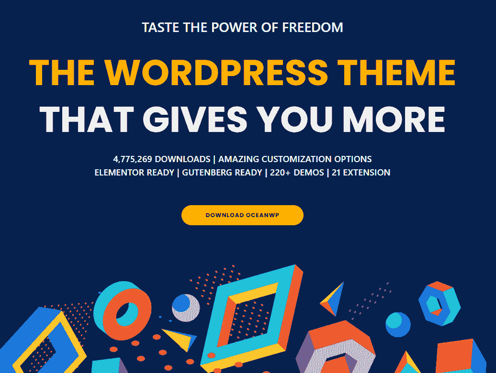

OceanWP

OceanWP 是一个从头开始构建的主题，可以与 Elementor 和块编辑器一起工作。它附带了定制的元素或模块，这些元素或模块在高级版或免费版的页面生成器中都找不到。

在其 elements or 兼容性之上，OceanWP 具有内置功能，例如用于登录的[粘性标题](https://kinsta.com/blog/elementor-sticky-header/)、 [cookie 通知](https://kinsta.com/blog/wordpress-cookies-php-sessions/)、[弹出元素](https://kinsta.com/blog/elementor-popup/)，以及为客户端标记主题的选项。因此，它可能是代理商的绝佳选择。

OceanWP 还提供定制的 Elementor 模板和完整的网站演示。您可以在 [OceanWP 网站](https://oceanwp.org/demos/)上查看可用的模板和演示。如果你是这些设计的粉丝，购买一个高级许可是值得的。

**主要特性:**

*   与元素或和块生成器完全兼容
*   访问自定义元素或模块
*   粘性标题、cookie 通知、弹出登录页面和白色标签
*   自定义元素或模板和完整的网站演示

价格:有一个[免费版的 OceanWP](https://wordpress.org/themes/oceanwp/) 。高级许可从[开始，每年 37 美元](https://oceanwp.org/core-extensions-bundle/)。

### 4.赫斯缇雅(免费和高级)

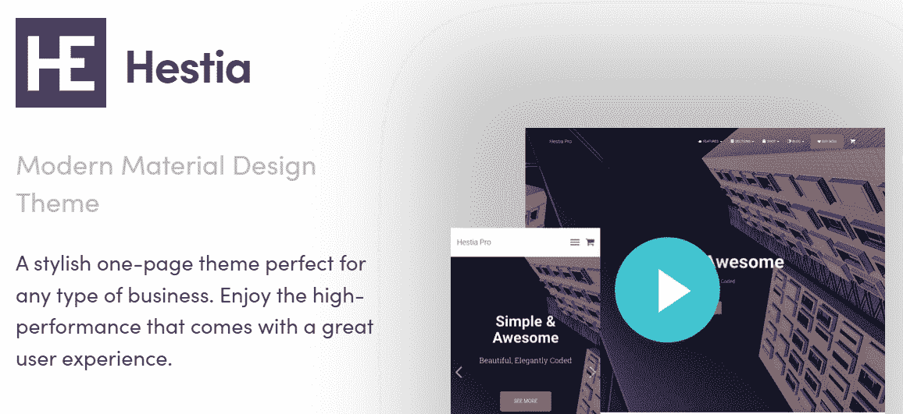

Hestia

赫斯缇雅是单页设计的主题。如果你看看赫斯缇雅的演示，你会发现它提供了一个商业网站所需要的一切。在一个页面上，您可以谈论您提供的服务，突出关键功能，展示产品，甚至包括有关您的团队的信息。

自然，你可以使用赫斯缇雅不仅仅是一页的设计。该主题与最流行的页面生成器插件一起工作，包括 Elementor。它为入门网站提供了多种设置，并针对快速页面加载时间进行了优化。

**主要特性:**

*   一页-商业网站和网上商店的设计
*   多个入门网站设计
*   与 element 或其他流行的页面生成器插件兼容

价格:赫斯缇雅的免费版本包括我们之前讨论过的所有功能。高级许可从每年[69 美元](https://themeisle.com/themes/hestia/)开始，提供额外的入门网站设计和优先支持。

### 5.图层(免费)

Layers

图层被设计成一个任何人都能轻松使用的主题。这是你可以使用 WordPress 定制器完全配置和调整的第一个主题之一。

2019 年，Elementor 收购了 Layers。现在，它是一个完全免费的主题，旨在与 Elementor 无缝集成。图层使您能够自定义您的网站，其功能非常直观，如调整徽标大小、调整页眉和页脚的高度、控制菜单中的间距等等。

Layers 不能让您定制的任何东西，您都可以使用 Elementor 进行更改。如果你想使用一个没有太多装饰的元素或主题(而且是免费的)，图层可能是一个很棒的选择。

**主要特性:**

*   直接使用元素或
*   调整网站徽标的大小
*   自定义页眉、页脚和导航菜单的高度和间距

**价格:**图层是免费主题。

### 6.Zakra(免费和高级)

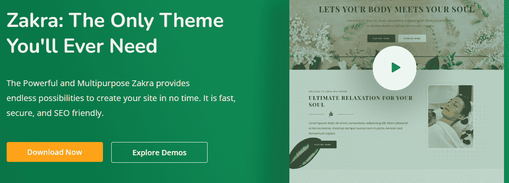

Zakra

[Zakra](https://wordpress.org/themes/zakra/) 是一个多用途的主题。它与大多数页面生成器插件兼容，包括 Elementor。为了让您的生活更轻松，Zakra 附带了超过 65 个页面模板，您可以在页面生成器中使用。

在其广泛的模板集合之上，Zakra 提供了出色的性能并支持 [Google AMP](https://kinsta.com/blog/google-amp/) 。如果你正在做一个与 Zakra 现成模板一致的项目，你可以从使用这个主题中获益。

**主要特性:**

*   超过 65 个页面模板
*   与元素或和其他页面生成器兼容
*   开箱即用的卓越性能
*   放大器就绪

价格:有一个免费版本的 [Zakra 主题](https://wordpress.org/themes/zakra/)。高级许可从每年[69 美元](https://zakratheme.com/pricing/)起，提供额外的模板和定制选项。

## 注册订阅时事通讯

### 想知道我们是怎么让流量增长超过 1000%的吗？

加入 20，000 多名获得我们每周时事通讯和内部消息的人的行列吧！

[Subscribe Now](#newsletter) ### 7.Astra(免费和高级)

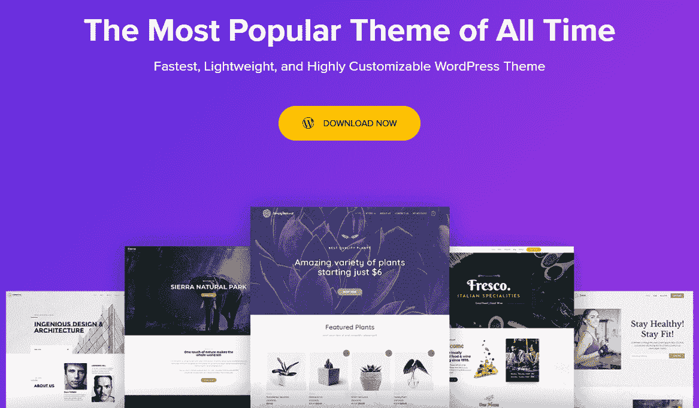

Astra

Astra 因其性能在 WordPress 主题中有点名气。这个轻量级主题一直是 WordPress 网站加载速度最快的选项之一。如果你关心加载时间，并且不想花太多时间[优化你的网站](https://kinsta.com/blog/core-web-vitals/)，这是一个很棒的选择。

有了 Astra，你可以完全兼容大多数 WordPress 页面生成器。该主题还提供了大量的网站演示和页面模板，并根据您使用的页面生成器提供不同的选项。

Astra 附带了一个拖放构建器，可以编辑你网站的页眉和页脚。这也是你可以用 Elementor Pro 做的事情。不过，如果你使用 Elementor 的免费版本，Astra builder 是一个不错的选择。

**主要特性:**

*   轻量级和面向性能的 WordPress 主题
*   与元素或和其他页面生成器兼容
*   访问大量网站演示和页面模板
*   用于站点页眉和页脚的拖放生成器

价格:有一款[免费版的雅特](https://wordpress.org/themes/astra/)。高级许可从[开始，每年 49 美元](https://wpastra.com/pricing/)，包括额外的定制选项。

### 8.自定义(免费和高级)

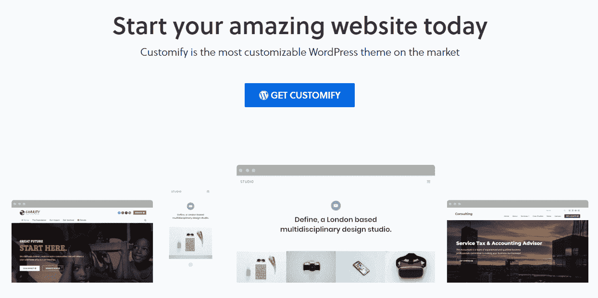

Customify

定制是一个主题，它为你提供了多种编辑和定制网站设计的方式。如果你不是页面生成器的粉丝，你可以使用 WordPress 定制器改变主题外观的任何方面。因此，如果你想要一个用户友好的方式来创建一个独特的网站，这可能是一个很好的选择。

此外，Customify 可以和所有主流的 WordPress 页面生成器插件一起工作，包括 Elementor。该主题提供了大量的网站演示和页面模板，只需点击几下就可以导入。

使用 Customify，您还可以访问页眉和页脚拖放生成器。就像 Astra 一样，如果你没有插件的高级许可，你可以使用这个构建器来代替 Elementor 的主题构建器工具。

**主要特性:**

*   使用 WordPress 定制器或页面构建器如 Elementor 调整主题的设计
*   访问预建的网站演示和页面模板
*   使用拖放构建器来编辑主题的页眉和页脚

价格:有一个[的免费版](https://pressmaximum.com/customify/)。高级许可从[开始，每年 59 美元](https://pressmaximum.com/customify/pro-upgrade/)。通过高级计划，您可以获得额外的定制选项和优先支持。

### 9.悉尼(免费和高级)

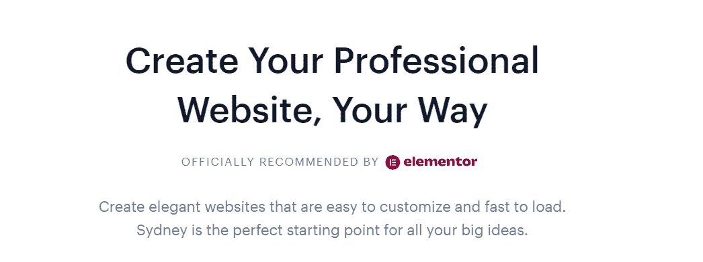

Sydney

悉尼主题来自 Elementor 的官方推荐。使用 Sydney，您可以尝试多种标题和菜单设计。

这个主题包括几个关于[博客文章](https://kinsta.com/blog/best-blogging-platform/)布局的选项和一系列按钮样式选择。因此，悉尼可能是基于博客的网站的一个很好的选择。

最重要的是，你可以完全兼容 Elementor。Sydney 还提供了多个网站演示和页面模板，您可以使用页面生成器导入和定制。为了使这项工作更容易，Sydney 给你提供了在插件的免费或高级版本中找不到的新元素或小部件。

**主要特性:**

*   附加元件或模块
*   菜单和标题设计的多种选择
*   几个博客文章布局
*   按钮的许多样式选择

**价格:**有一个[免费版的悉尼](https://athemes.com/theme/sydney/)。高级许可从每年[69 美元](https://athemes.com/sydney-pricing/)开始，包括访问额外的 Elementor 模块和页面模板。

Struggling with downtime and WordPress problems? Kinsta is the hosting solution designed to save you time! [Check out our features](https://kinsta.com/features/)

### 10.木星(高级)

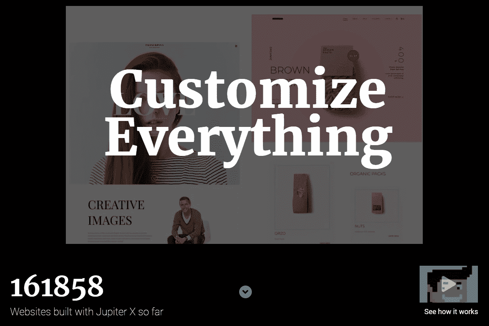

Jupiter

木星是 WordPress 主题之一，拥有最广泛的预建网站布局。使用 Jupiter，您可以从 450 多种完整的网站和页面设计中进行选择，所有设计都可以定制。

该主题提供了几个内置的定制选项，但它最适合与 Elementor 一起使用。如果您使用 Elementor，您还会得到一个包含现成页面部分的大型库，包括价格表、标题等。

Jupiter 提供了强大的菜单和弹出窗口构建器。当您将这些功能与它的预建设计相结合时，您会得到一个可以在创纪录的时间内建立并运行网站的主题。如果你想快速创建一个定制的站点，我们推荐你使用 Jupiter。

**主要特性:**

*   超过 450 个现成的网站演示和页面模板
*   使用 Elementor 访问预构建的页面部分
*   内置菜单和弹出窗口生成器

**价格:**木星许可证从[开始，半年](https://themeforest.net/item/jupiter-multipurpose-responsive-theme/5177775)59 美元。

### 11.停

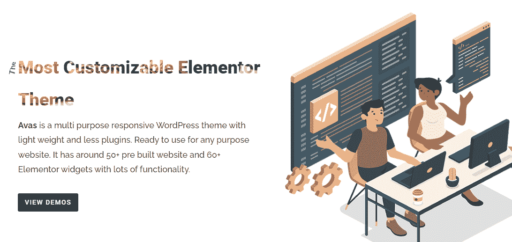

Avas

Avas 宣称自己是一个多功能的元素或主题。有了 Avas，你会得到一个轻量级的主题，有相当多的预建网站设计可供选择(近 60 个选项)。

Avas 因其元素或集成而大放异彩。这个主题提供了你能找到的最大的额外元素或模块选择。如果您使用 Avas，您还可以访问 60 多个新元素或小部件来定制您的站点。

除了这些功能之外，Avas 还允许您在多个标题选项之间进行选择。此外，该主题还附带了[滑块旋转](https://www.sliderrevolution.com/)插件。因此，如果你的网站内容是高度视觉化的，它可能是合适的。

**主要特性:**

*   近 60 个网站演示和模板
*   超过 60 种新的元素或模块
*   多个标题选项
*   滑块旋转插件

**价格:** Avas 许可从[开始，半年](https://themeforest.net/item/avas-multi-purpose-responsive-wordpress-theme/19775390)35 美元。

### 12.因果报应(溢价)

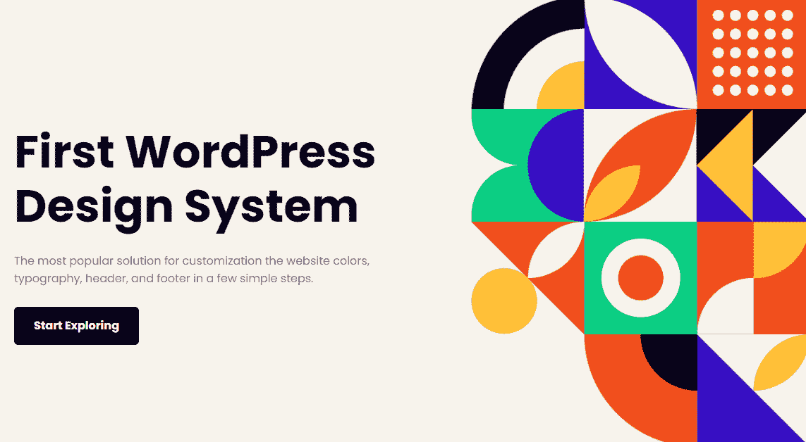

Karma

[Karma](https://themeforest.net/item/karma-responsive-wordpress-theme/168737) 是一个多功能主题，内置“皮肤”管理系统。这意味着该主题允许您使用内置工具自定义颜色、字体、页眉和页脚样式。因此，如果你的企业有很强的视觉品牌，这可能是一个很好的选择。

在其内置的定制选项之上，Karma 可以与 Elementor 完美配合。该主题提供了 250 多种页面布局和模板，您可以使用页面生成器导入和自定义它们。

**主要特性:**

*   包括 250 多种与 Elementor 兼容的页面布局和模板
*   使用内置工具自定义颜色、字体、页眉和页脚样式

**价格:** Karma 许可证从[开始，六个月 48 美元](https://themeforest.net/item/karma-responsive-wordpress-theme/168737)。

### 13.福禄考专业版(高级)

Phlox Pro

如果非要用一个词来形容[福禄考 Pro](https://themeforest.net/item/lotus-flexible-multipurpose-responsive-wp-theme/3909293) ，那就是*华而不实*。这个多用途主题附带了 80 多个页面模板，您可以使用 Elementor。

这些模板中的每一个都采用了带有动画和颜色的现代设计，使它们在视觉上引人注目。我们推荐这个 Elementor 主题用于具有引人入胜的媒体元素的网站。

使用 Phlox Pro，您可以为 Elementor 获得大量的附加模块。该主题提供了 160 多个与页面生成器一起工作的新元素，开辟了一个定制选项的世界。

除了与 Elementor 集成之外，Phlox Pro 还可以与 [WPBakery 页面生成器](https://wpbakery.com/)配合使用。这个主题也提供了很多 WordPress 定制器的编辑选项。

**主要特性:**

*   使用 Elementor 的 60 多个页面模板
*   超过 160 种新的元素或模块
*   WordPress 定制器的附加样式选项

**价格:** Phlox Pro 许可从[开始，六个月](https://themeforest.net/item/lotus-flexible-multipurpose-responsive-wp-theme/3909293)39 美元。

### 14.联苯菊酯(高级)

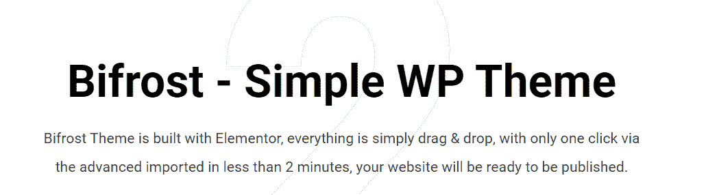

Bifrost

如果你喜欢极简设计，彩虹桥是一个很好的主题选择。该主题是为使用 Elementor 而构建的。它提供了大量的定制选项，在页面生成器中添加了 50 多个模块。

使用 Bifrost，您可以使用独特的分隔线来分隔页面中不同形状设计的部分。该主题还为博客和[投资组合布局](https://kinsta.com/blog/portfolio-website/)提供了多种选择，使其成为任何一种项目类型的绝佳选择。

**主要特性:**

*   向 Elementor 添加 50 多个模块
*   使用形状分隔线来分隔使用独特形状的页面部分
*   从博客和作品集布局的多个选项中选择

**价格:** Bifrost 许可从[开始，半年](https://themeforest.net/item/bifrost-simple-portfolio-wordpress-theme/23180008)59 美元。

### 15.森林人(高级)

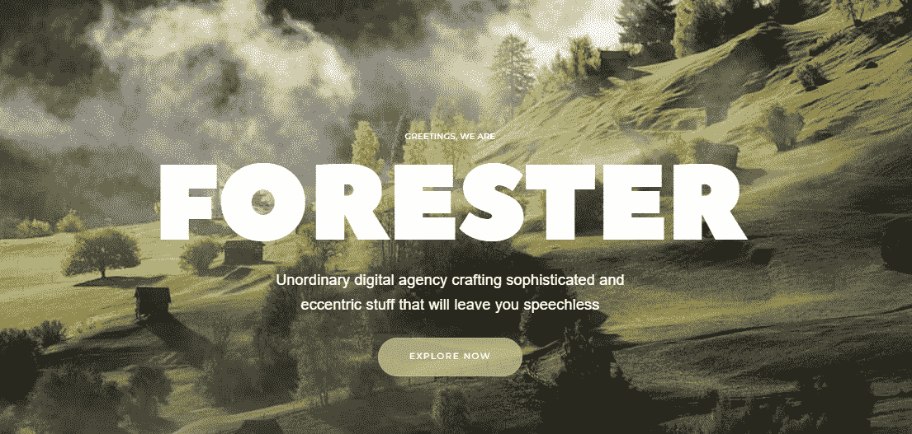

The Forester

森林人是为 Elementor 设计的 WordPress 组合主题。与我们列表中的大多数其他主题不同，这个主题完全专注于一个项目领域。

有了 Forester，您可以访问多种类型的投资组合的现成设计。它们包括摄影网站、简历网站、商业文件夹、单页设计等选项。

大多数森林人的设计严重依赖视差，如果你喜欢这种风格，这种主题是一个很好的选择。森林人还免费附带了[旋转滑块](https://www.sliderrevolution.com/)插件。

**主要特性:**

*   投资组合网站的多个模板
*   大多数模板都包含视差设计
*   旋转滑块插件

**价格:**森林人高级许可证从[开始，六个月](https://themeforest.net/item/the-forester-a-creative-wordpress-theme/20410914)44 美元。

[Learn the difference between Elementor and WordPress themes. and find 15 beautiful Elementor themes for WordPress in this guide ✨⬇️Click to Tweet](https://twitter.com/intent/tweet?url=https%3A%2F%2Fkinsta.com%2Fblog%2Fbest-elementor-themes%2F&via=kinsta&text=Learn+the+difference+between+Elementor+and+WordPress+themes.+and+find+15+beautiful+Elementor+themes+for+WordPress+in+this+guide+%E2%9C%A8%E2%AC%87%EF%B8%8F&hashtags=WebDesign%2CElementor) ## 摘要

Elementor 是一个如此著名的页面生成器，以至于有一个完整的 WordPress 主题生态系统来使用它。Elementor 主题使得使用页面生成器插件定制网站设计的各个方面变得容易。

如果你还在犹豫使用哪个元素或主题，你好，元素或和 Astra 是两个很好的选择。这两个主题都有免费版本。此外，它们是轻量级的，具有极简风格设置，使您能够从头开始构建元素或项目。

选择一个漂亮的主题只是创建 WordPress 网站的一部分。你还需要一个强大的主机提供商。查看我们的[托管计划](https://kinsta.com/plans/)了解更多信息！

* * *

让你所有的[应用程序](https://kinsta.com/application-hosting/)、[数据库](https://kinsta.com/database-hosting/)和 [WordPress 网站](https://kinsta.com/wordpress-hosting/)在线并在一个屋檐下。我们功能丰富的高性能云平台包括:

*   在 MyKinsta 仪表盘中轻松设置和管理
*   24/7 专家支持
*   最好的谷歌云平台硬件和网络，由 Kubernetes 提供最大的可扩展性
*   面向速度和安全性的企业级 Cloudflare 集成
*   全球受众覆盖全球多达 35 个数据中心和 275 多个 pop

在第一个月使用托管的[应用程序或托管](https://kinsta.com/application-hosting/)的[数据库，您可以享受 20 美元的优惠，亲自测试一下。探索我们的](https://kinsta.com/database-hosting/)[计划](https://kinsta.com/plans/)或[与销售人员交谈](https://kinsta.com/contact-us/)以找到最适合您的方式。