# 电子邮件排版:电子邮件的 8 种最佳字体(以及自定义电子邮件字体创意)

> 原文：<https://kinsta.com/blog/best-fonts-for-email/>

到目前为止，大多数拥有坚实追随者的企业已经完全接受了电子邮件营销所能提供的一切。[邮件简讯](https://kinsta.com/newsletter)、[自动回复](https://kinsta.com/blog/abandoned-cart-email/)，应有尽有。电子邮件营销是一种始终如一的方式，可以让你把握住客户需求的脉搏，同时推销你提供的所有最新产品或服务。

事实上，在客户离开你的网站很久以后，你还能联系到他们，这是非常强大的。然而，任何旧的电子邮件都不行。你如何展示你的邮件内容是吸引注意力和鼓励客户真正阅读你的邮件而不是立即删除它们的重要部分。

设计在这里起着至关重要的作用。但是可能最重要的一个方面是你的字体选择。电子邮件安全字体使客户更容易阅读你要说的内容，这意味着你更有可能获得转化。

这就是我们今天要讨论的。

## 什么是电子邮件安全字体？

在你的电子邮件中使用漂亮的字体很有诱惑力。毕竟，你想给人留下积极的印象。你想让你的内容脱颖而出。但是，特殊字体不会在所有电子邮件客户端都正确显示。事实上，如果一种字体不受支持，电子邮件客户端可能会使用后备字体，这可能会弄乱你想要的语气，或者模糊你的内容的可读性。

这就是为什么我们强烈建议你只在创建电子邮件营销内容时使用电子邮件安全字体。我们一会儿会谈到细节。但首先，让我们简单讨论一下好的字体选择实际上是如何对你的[转化率](https://kinsta.com/blog/wordpress-ab-testing-tools/)产生巨大影响的。


> 需要在这里大声喊出来。Kinsta 太神奇了，我用它做我的个人网站。支持是迅速和杰出的，他们的服务器是 WordPress 最快的。
> 
> <footer class="wp-block-kinsta-client-quote__footer">
> 
> 
> 
> <cite class="wp-block-kinsta-client-quote__cite">Phillip Stemann</cite></footer>

[View plans](https://kinsta.com/plans/)

### 好字体如何促进转换

大多数人花在电子邮件上的时间只有 11 秒。这意味着你选择的任何字体都需要可读和可扫描。他们需要提供“一目了然”的便利。通常，这意味着依赖每个人都已经熟悉的标准字体。听起来很无聊？另一种选择更糟糕。事实上，人们花两倍的时间来阅读花式字体[。如果人们在邮件上只花 11 秒钟，那就是浪费了大量的时间。](https://www.neurosciencemarketing.com/blog/articles/simple-fonts.htm)

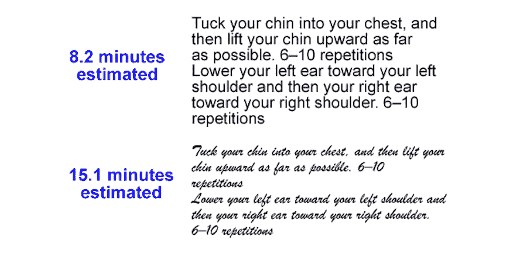

Script vs. Sans serif reading time


然而，影响转换的不仅仅是你选择的字体。你选择的字体大小也很重要。事实上，根据 [Click Laboratory](https://www.clicklaboratory.com/case-studies/increasing-sales-pipeline-with-adaptive-web-design/) 进行的研究，稍微增加一种字体的大小就可以对你的转化率产生巨大的影响。

这项研究包括将设置为 Arial 字体的文本块从 10pt 增加到 13pt。文本行之间也增加了更多的空间。13pt 字体的表现*比*好得多，因为内容现在看起来更容易，可读性更好。

这个小小的改变将跳出率降低了 10%,将转换率提高了 133%!都是因为把字号抬高了两点！

你的字体选择也有心理因素。这主要适用于徽标，但是当你选择电子邮件字体时，记住这些信息也是值得的。某些类型的字体有一些相关的“感觉”。根据[疯狂彩蛋](https://www.crazyegg.com/blog/psychology-of-fonts-infographic/)的说法，五种主要字体类型引发不同的情绪或联想:

#### Serif Fonts

例子包括时代新罗马，巴斯克维尔和格鲁吉亚。衬线字体散发出一种体面、可靠和传统的感觉。老品牌(或者那些希望看起来像已经存在了几十年的品牌)充分利用这些字体来灌输自信。[蒂芙尼&公司](https://www.tiffany.com/)的标志就是一个很好的例子。

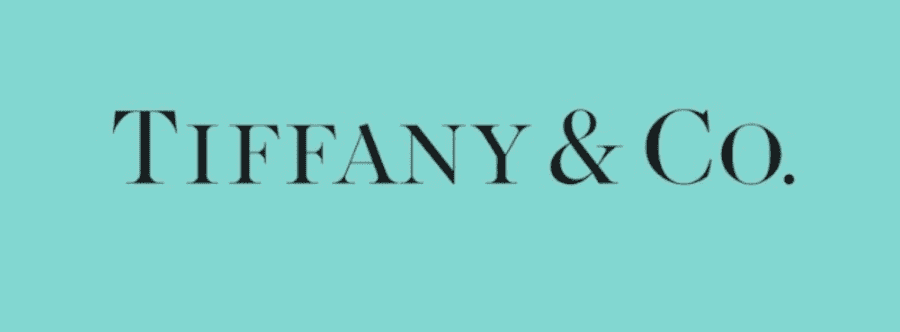

Tiffany & Co


[时尚](https://www.vogue.com/)也是:

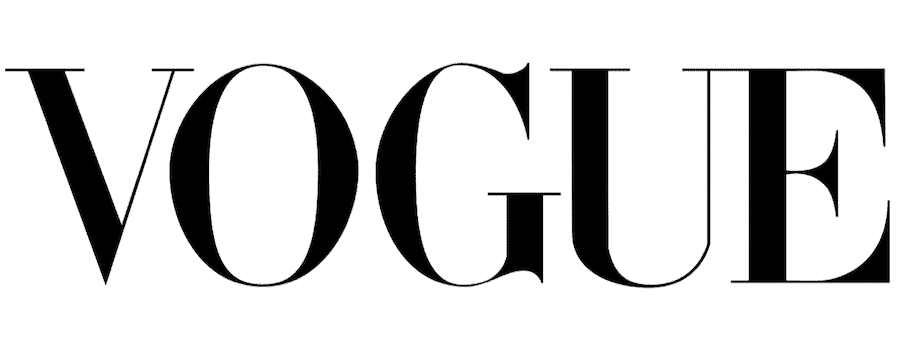

Vogue


#### 无衬线字体

例子包括 Helvetica，Calibri 和富兰克林哥特式。无衬线字体给人一种干净、简单、直接的现代感。这些字体给人以可靠和稳定的印象。无衬线字体很有企业感。[网飞](http://www.netflix.com/)采用无衬线字体:

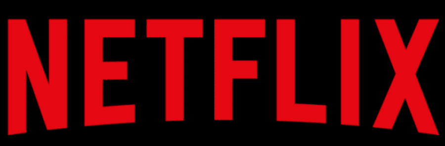

Netflix


#### 现代字体

例子包括 Futura 和 Century Gothic。[现代字体](https://kinsta.com/blog/modern-fonts/)可以显得时尚、别致，或者给人一种整体的力量感。Hulu 的标志是一个使用[现代字体](https://kinsta.com/blog/wordpress-fonts/#3-modern)的流行例子:

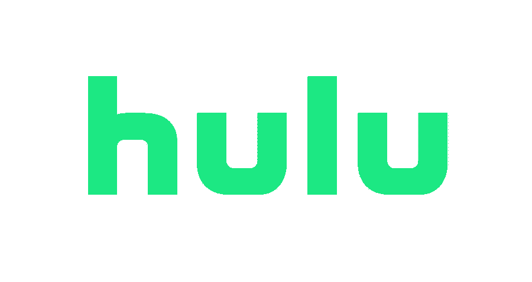

Hulu


#### 脚本字体

例子包括爱德华七世时代的手稿和比克汉姆手稿。在你的电子邮件中使用字体可能不是一个明智的选择。然而，当它们被用在标志上时确实会产生影响，这也适用于图形元素。可口可乐是使用得当的脚本字体的永恒范例:

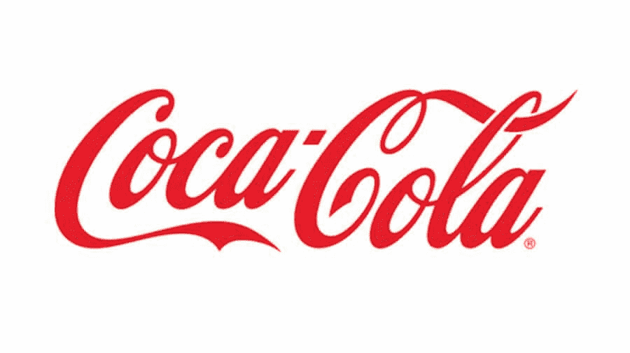

Coca-Cola


#### 显示字体

例子包括库珀和巴伦西亚。通常与[显示字体相关的词语和感觉](https://kinsta.com/blog/wordpress-fonts/#2-display)包括个性或独特性、友好性或表现力。对于徽标(可能还有标题)，显示字体可以产生真正的影响并脱颖而出。迪士尼提供了世界上最知名的标志之一，其特色是显示字体:

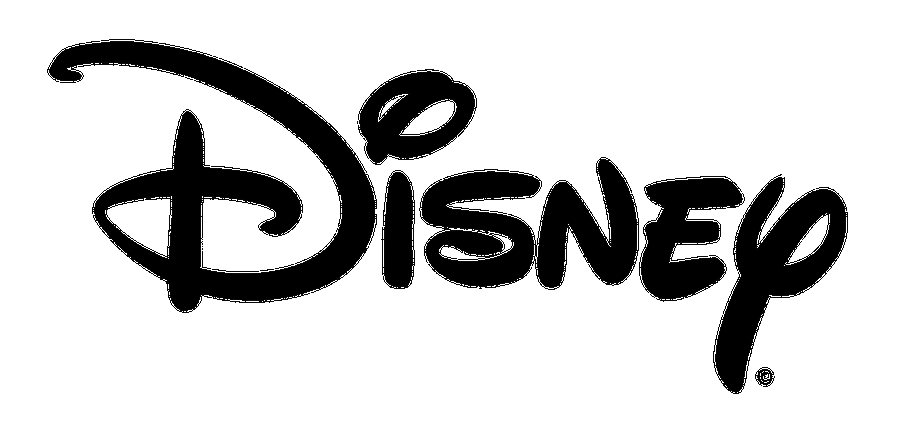

Disney


了解了这些信息，我们现在可以继续讨论如何为电子邮件选择最佳字体。

## 电子邮件排版:如何选择最好的字体

现在你已经知道了五种基本的可用字体类型(我猜除了符号之外)。你知道不同的字体会给你的顾客带来不同的情绪。但是，知道可口可乐使用的字体类型如何转化为为你的电子邮件通讯选择正确的字体呢？

让我们开始吧。

你选择在公司邮件中使用的任何字体都需要包括以下 4 个品质:

### 质量#1:可读性

我们已经提到了这个品质，但它值得重复，因为它是迄今为止最重要的。如果你的字体不清晰，没人能看到你的邮件。如果他们不能被阅读，你当然不能指望转换，现在你能吗？

### 质量#2:清晰度

简洁明快、线条精确的字体在你的电子邮件中效果最好。没有华丽或弯曲的东西。当然也不要有太细或太浅的线条。字体越大效果也越好。让你的字体比平时大一到两磅，确保字体粗细适中(但不要加粗)，行距为 1.15 倍。

### 品质#3:心理上合适

如上所述，某些字体类型有特定的感觉。确保你选择的字体适合你的内容所要传达的整体情绪以及你的内容的目的。例如，如果你想卖东西，表现得可靠或像个权威人物可能会有好处。

### 质量#4:品牌合适

同样，你选择的任何字体都应该符合逻辑，适合你所在的行业或领域。如果你的公司有一种老式的感觉，使用超现代或显示风格的字体是不合适的。同样，如果你经营一家技术型公司，质朴或正式的东西可能也不适合你。这一切都归结于什么感觉是正确的。

## 电子邮件的 8 种最佳字体

我们定义了电子邮件安全字体。我们还讨论了如何缩小字体选择的范围。但是现在是时候了解哪些字体实际上是电子邮件安全的，以及如何在不牺牲可读性或损害转换率的情况下跳出框框思考。

### 基本的电子邮件安全字体

有一套基本的可读(尽管很无聊)的电子邮件安全字体，大多数电子邮件客户端都可以识别。现在让我们来看一看其中的每一项。

#### 天线

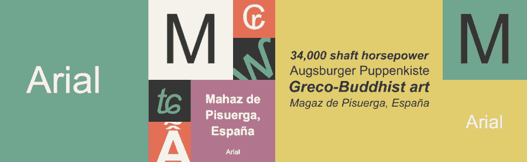

Arial


[Arial](https://www.fonts.com/font/monotype/arial) 是一种非常常用的字体。它最初是由 Monotype Imaging 的帕特里夏·桑德斯和罗宾·尼古拉斯于 1982 年创建的。尽管最初是为 IBM 激光打印机设计的，但它已经成为网络内容的最爱。

#### 韦尔达纳

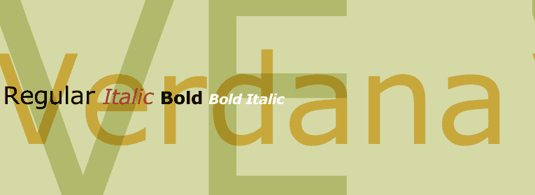

Verdana


Verdana 是一种考虑到屏幕显示而设计的字体。它是由 Matthew Carter 开发的，具有宽字符和每个字符之间的大间距的特点，以提高屏幕上的可读性。这是大多数电子邮件客户端支持的另一个主要选择。

#### Helvetica

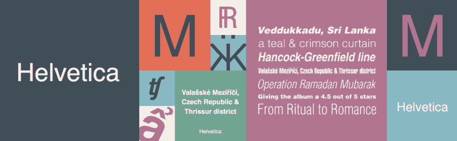

Helvetica


然后还有 Helvetica 字体，这是目前最流行的字体之一。它清晰易读，受大多数文字处理程序、电子邮件客户端和网络浏览器的支持。

#### 格鲁吉亚

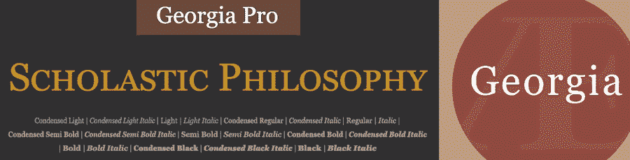

Georgia


乔治亚字体是电子邮件客户端支持的另一种常见字体。它天生易读，字母间距大，并使用字符设计，使每个字母都不同，以防止混淆。常规粗细和粗体粗细之间也有很大的差异，这有助于强调重点。

#### 前面有突出的护架

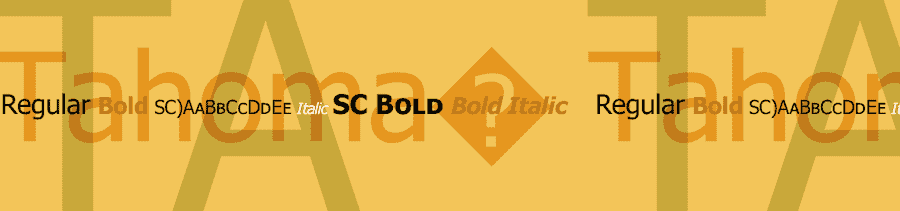

Tahoma


大多数电子邮件客户端都支持 Tahoma 。这是 Windows 操作系统上最流行的无衬线字体系列之一。它是为屏幕显示而设计的，在更小的字体下也能实现清晰易读。它最初是由马修·卡特创建的。

#### 露西达

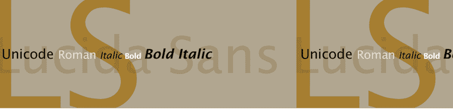

Lucida


或者，你可以使用 [Lucida](https://www.fonts.com/font/monotype/lucida-sans/story) ，另一个 sans [字体家族](https://kinsta.com/blog/best-programming-fonts/)，它优先考虑清晰的线条、清晰的风格和独特的字体。字母间距比标准的更宽，每个字符也更高，增加了更多的易读性。

#### 投石机

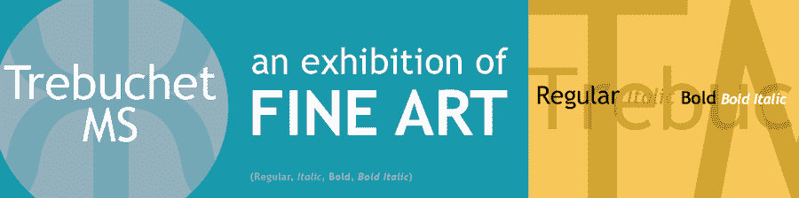

Trebuchet


Trebuchet 是另一个选项，你可以很容易地在你的电子邮件设计中使用。它是由 Vincent Connare 在 1996 年创建的，是一种无衬线字体。它是为屏幕阅读而设计的，具有更大的行高、圆形边缘和更宽的字符间距。

#### 时代新罗马

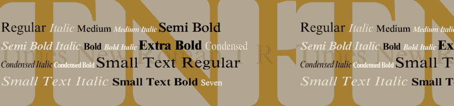

Times new roman


最后，还有 [Times New Roman](https://www.fonts.com/font/monotype/times-new-roman) ，这种字体真的不需要太多介绍。它具有传统的外观，通常用作字处理程序中的默认字体选择。它在屏幕上和印刷品上都清晰可辨。

## 注册订阅时事通讯


### 想知道我们是怎么让流量增长超过 1000%的吗？

加入 20，000 多名获得我们每周时事通讯和内部消息的人的行列吧！

[Subscribe Now](#newsletter)

你的电子邮件客户端可能有其他字体，但上面的是最可读和最常见的。

## **自定义邮件字体**

如果基本的字体选择对你没有吸引力，还有另一个选择。你可以使用 [HTML 字体](https://kinsta.com/blog/html-fonts/)来创建一个更加定制的外观。然而，值得注意的是，并不是每个电子邮件营销服务都能够或者愿意[正确显示网页字体](https://kinsta.com/blog/web-safe-fonts/)。

但是首先，让我们停下来讨论一下网络字体是如何工作的。

### 网络字体如何工作

网络字体，顾名思义，只存在于网络上。它们不包含在操作系统、设备、应用程序或软件中。它们在线存在，然后可以通过代码片段、插件和其他方式添加到您的项目中。通常情况下，你会发现网站上使用网络字体。一些电子邮件客户端目前支持使用 web 字体，包括:

*   安卓邮件
*   苹果邮件
*   iOS 邮件
*   Outlook 2000
*   Outlook.com 应用程序
*   雷鸟

然而，并非所有这些电子邮件客户端都以相同的方式支持 Web 字体。有些只需要一个链接，而有些则需要一个导入 web 字体的代码片段。稍后会有更多的介绍。首先重要的是要认识到，即使电子邮件客户端不支持你选择的网络字体(或其包含方法)，你的内容也不一定看起来很糟糕。

大多数电子邮件客户端包括一个后备选项。也就是说，如果您的电子邮件中包含的网络字体无法正确加载，电子邮件客户端将提供一种备用字体。这通常是我们上面列出的通用选项之一，但这里的好处是 a)您的内容仍然清晰可辨，b)您的内容看起来不会太差，因为标准字体成为标准是有原因的(它们简单易读)，以及 c)您可以经常选择使用哪种字体作为备用字体。

为了让你了解我们的意思， [Gmail 的](https://kinsta.com/blog/gmail-smtp-server/)默认字体是 Arial，而苹果邮件使用 Helvetica。Outlook 使用 Calibri，而 iOS 使用 [San Francisco](https://designforhackers.com/blog/san-francisco-font/) (一种苹果专门为其设备创造的字体，很大程度上受 Helvetica·纽的启发。

如果你决定使用网络字体，你应该在发布前在不同的平台上进行测试。

一些电子邮件营销服务已经包含了网络字体支持。[例如，Campaign Monitor](https://kinsta.com/blog/mailchimp-alternatives/#16-campaign-monitor) 在其拖放式电子邮件构建器中包含了几个网络字体选项，并且自动为您设置了后备选项。


Campaign Monitor Web Fonts


如果您的电子邮件营销平台本身不包含 web 字体支持，您可以通过代码添加它。

有几个代码片段可以用来在 HTML 电子邮件中嵌入 web 字体。

#### 

使用给你的电子邮件添加网络字体是一个[流行的选择](https://www.litmus.com/blog/the-ultimate-guide-to-web-fonts/)。你选择的任何网络字体都会为你定义[网址](https://kinsta.com/knowledgebase/what-is-a-url/)。所以，如果你自己在[托管字体](https://kinsta.com/blog/local-fonts/)，在你的网站上把它改成你的字体的 URL。如果字体由网络字体销售商托管，请使用他们提供的 URL。

您将把代码片段放在电子邮件代码的部分。它应该出现在最开始。大多数电子邮件客户端都支持这种方法，并且加载速度相当快。但是，如果 web 字体文件较大，您可能会遇到一些问题。

因此，如果你从[谷歌字体](https://kinsta.com/blog/best-google-fonts/)获得你的网络字体，在选择你的字体样式并选择**链接**作为你的首选嵌入方法后，你会看到以下内容:

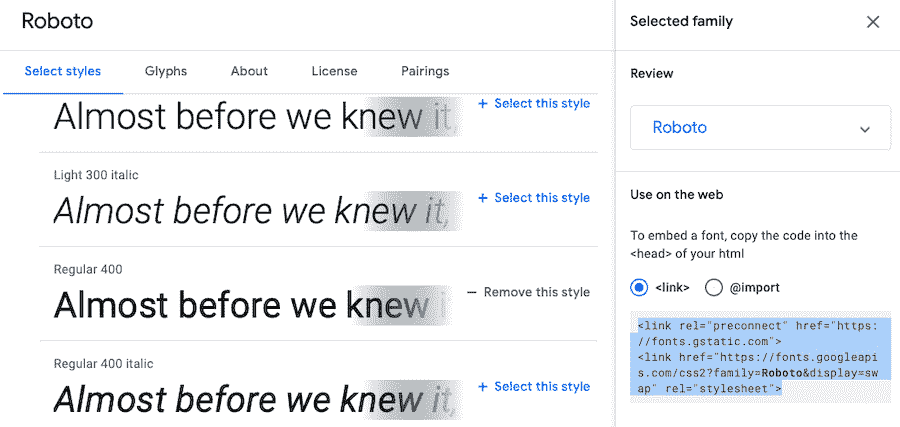

Roboto on Google Fonts


#### @导入

给邮件添加网页字体的另一种方法是使用@import。这个超级简单，在大多数电子邮件客户端上也很好用。唯一的问题是一些旧版本的 Android。

就像使用代码片段一样，您也将在电子邮件的部分插入@import。同样，在谷歌字体中，这是你选择一种字体及其样式，然后点击 **@import** 旁边的气泡后看到的内容:

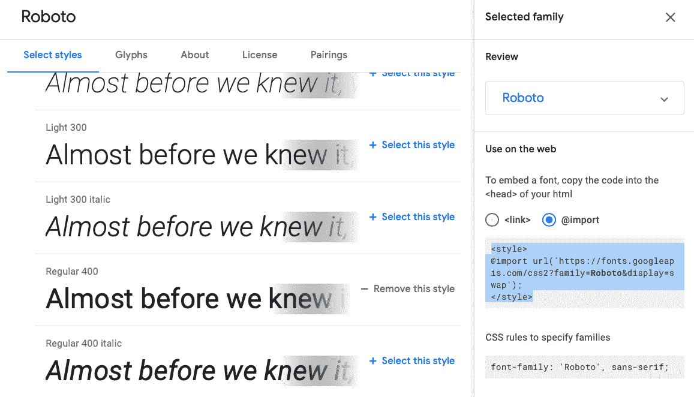

@import for the Roboto font


如果您使用的是不同的 web 字体服务，您可能不会得到这样的嵌入代码，相反，您需要自己键入代码片段。使用您的网络字体服务提供给您的 [URL](https://kinsta.com/knowledgebase/what-is-a-url/) ,或者如果您选择自己托管字体，请使用您的服务器上的相应链接。

#### @font-face

这条规则使得你可以从服务器上下载字体或者托管它们，这样它们就可以在网站上使用，或者在这种情况下，在你的电子邮件中使用。它的工作方式与前两种方法类似，它可以动态下载字体，以便您的网站或电子邮件使用。和这里讨论的所有其他方法一样，你将这段代码粘贴到你的邮件 HTML 的<头>部分。

厌倦了 WordPress 的问题和缓慢的主机？我们提供世界一流的支持，由 WordPress 专家提供 24/7 服务和超快的服务器。[查看我们的计划](https://kinsta.com/plans/?in-article-cta)

因此，根据 Mozilla 的说法，如果你打算在邮件中添加字体 Open Sans，你可以使用下面的代码片段:

```
@font-face{

font-family:"Open Sans";

src:url("/fonts/OpenSans-Regular-webfont.woff2")format("woff2"),

url("/fonts/OpenSans-Regular-webfont.woff")format("woff");

}
```

### 指定 Web 字体替代

虽然你总是希望你精心选择的网页字体能够正常工作，但情况并非总是如此。无论是由于服务器错误还是系统兼容性，最好不要选择回退选项。因此，再次使用@font-face，你实际上可以[指定你想要使用哪个本地字体](https://developer.mozilla.org/en-US/docs/Web/CSS/@font-face)，以防你喜欢的网络字体无法下载。

我们可以使用上面提到的相同的[代码片段](https://kinsta.com/knowledgebase/edit-wordpress-code/),只需修改它以包括一个后备字体选项:

```
@font-face{

font-family:"Open Sans";

src:url("/fonts/OpenSans-Regular-webfont.woff2")format("woff2"),

url("/fonts/OpenSans-Regular-webfont.woff")format("woff");

local("Helvetica")

}
```

### 在哪里可以找到在电子邮件中使用的网络字体

网上有几个地方可以找到网页字体。只要留意他们的任何许可要求。每个网站可能有不同的规格，你需要遵循，所以请记住这一点。

*   谷歌字体(Google Fonts):这是目前最受欢迎的寻找网络字体的地方之一，提供了一个开源的字体库，可以在任何时间任何地点使用。它目前有 1，020 种字体系列。
*   Fonts.com:这是另一个关于各种字体的极好资源，从桌面字体到网络字体。它实际上是 Monotype 商店，有超过 150，000 种字体可供浏览和购买。
*   Typography.com:这是 H &公司的店面，这家铸造厂有 1500 种可用于网络和印刷的字体。
*   字体松鼠:如果你正在寻找一个全免费的选择，字体松鼠可能符合要求。该网站仅提供可用于商业目的的免费字体。
*   [Adobe 字体](https://fonts.adobe.com/):Adobe 字体原名 Typekit，包括数千种字体可供选择，所有这些字体都可以通过 [Creative Cloud](https://kinsta.com/blog/best-tools-for-freelancers/) 订阅获得。
*   Fontspring :虽然你必须购买 Fontspring 上列出的网络字体，但它们不需要订阅，并且通常包含无限的许可证，以增加便利性。
*   MyFonts :这是另一家 Monotype 拥有的企业，拥有大量印刷和网络字体列表。
*   村:这实际上是几个铸造厂的集合，他们联合起来独立销售他们的字体。
*   Process Type Foundry :这是一家小企业，由两位字体设计师于 2002 年创立，他们向公众出售自己制作的字体。
*   最后，还有 FontShop，这是另一个 Monotype 店面，也是浏览和购买网络字体的地方。

### 高质量、可读的 Web 字体

如果你需要一些灵感，以下是易于阅读的网页字体的例子，可以用上述方法添加到你的电子邮件中。

#### 开启无

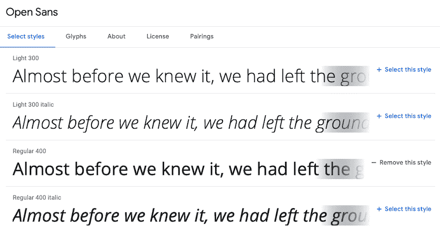

Open Sans 是一种非常清晰的无衬线字体，非常适合在屏幕上阅读。它是由史蒂夫·马特森设计的，具有开放的形式。所有字母都易于阅读，各种尺寸都很好看。

#### Roboto

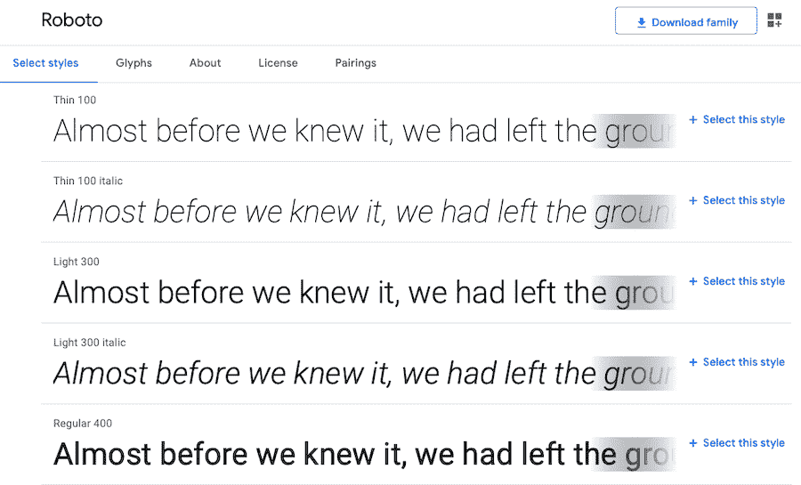

Roboto 是另一种高质量的网络字体，在屏幕上看起来很棒。它有一个开放曲线的几何设计，创造了一个吸引人的二分法，只是平原工程。每个字母保持自然的宽度，抵制典型的 grotesk 字体的刚性。

#### 罗威

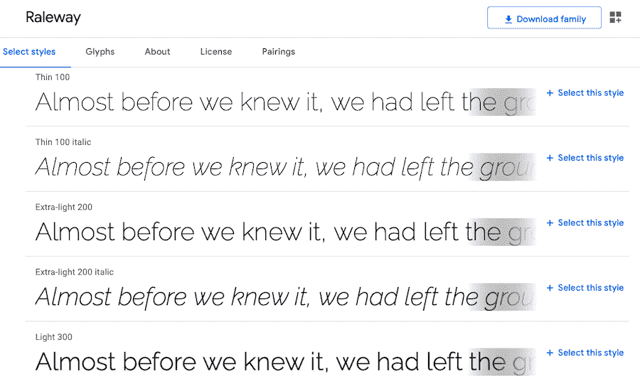

或者，你可以选择另一种无衬线字体，它提供更细的线条和更优雅的吸引力。字体家族最初由 Matt McInerney 设计，后来由 Pablo Impallari 和 Rodrigo Fuenzalida 扩展。

#### 世纪哥特式

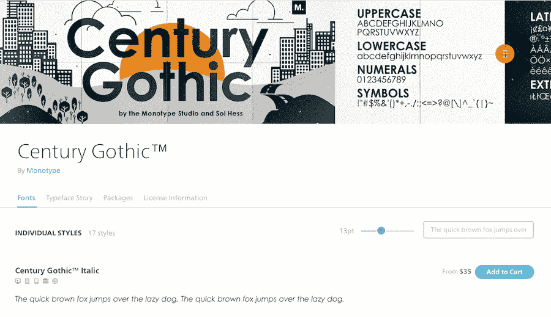

Century Gothic


[Century Gothic](https://www.fonts.com/font/monotype/century-gothic) 是一种提供经典外观的网络字体。这是有道理的，因为它实际上是 20 世纪 20 年代和 30 年代旧字体的现代化版本。它在[浏览器](https://kinsta.com/browser-market-share/)上有广泛的支持，并且可以在屏幕上阅读。

#### 下一个新的

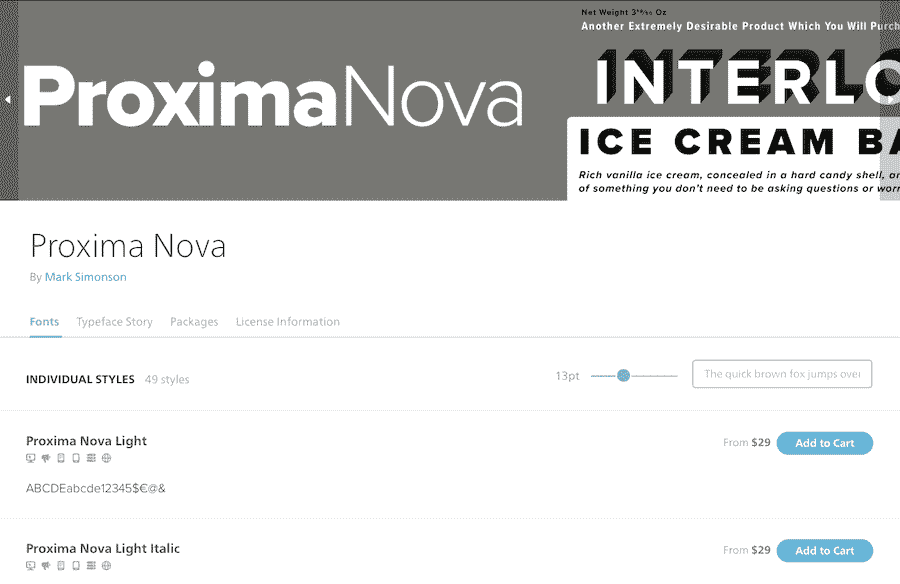

Proxima Nova


Proxima Nova 是另一个网络字体选项，实际上是 Proxima Sans 字体的重新设想版本，该字体于 1994 年首次创建。字体稍微有点几何形状，但也很自然，会是你邮件的绝佳选择。

#### 复活节后的第一个星期天

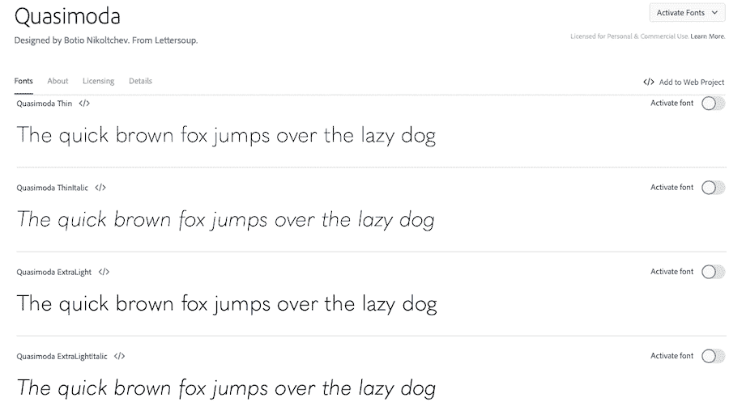

Quasimoda


卡西莫达字体是一种时尚的网络字体，看起来很舒服，而且具有普遍的吸引力。它是由位于德国柏林的铅字铸造公司 Lettersoup 创建的，该公司由 Botio Nikoltchev 于 2014 年创立。

#### PT 无 Pro

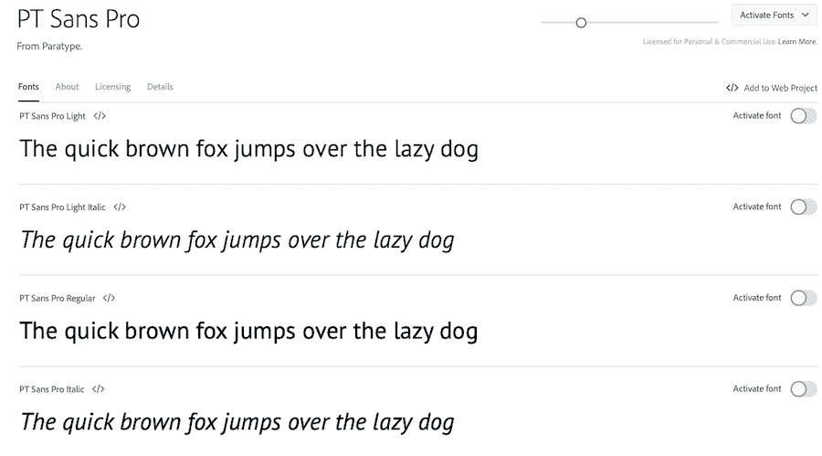

PT Sans Pro


PT Sans Pro 可能正是你正在寻找的网络字体。它提供了圆形的字体和自然的外观。它是由 Paratype 设计的，这是一家数字字体公司，成立于 20 世纪 80 年代。

#### 布兰登怪诞

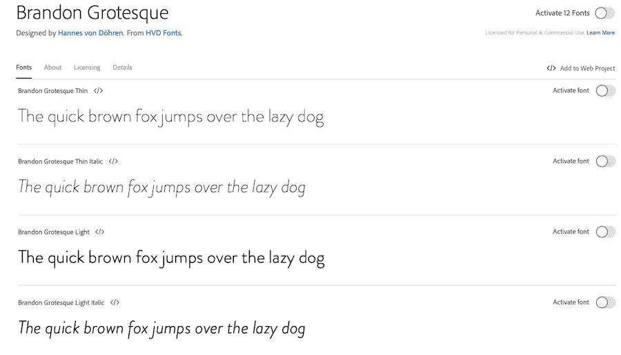

Brandon Grotesque


布兰登奇形怪状的网络字体是由 HVD 字体公司创造的。HVD 由汉尼斯·冯·多伦创立，公司专注于创造易于阅读、专业而时尚的字体，适用于各种应用。

#### 索菲亚专业

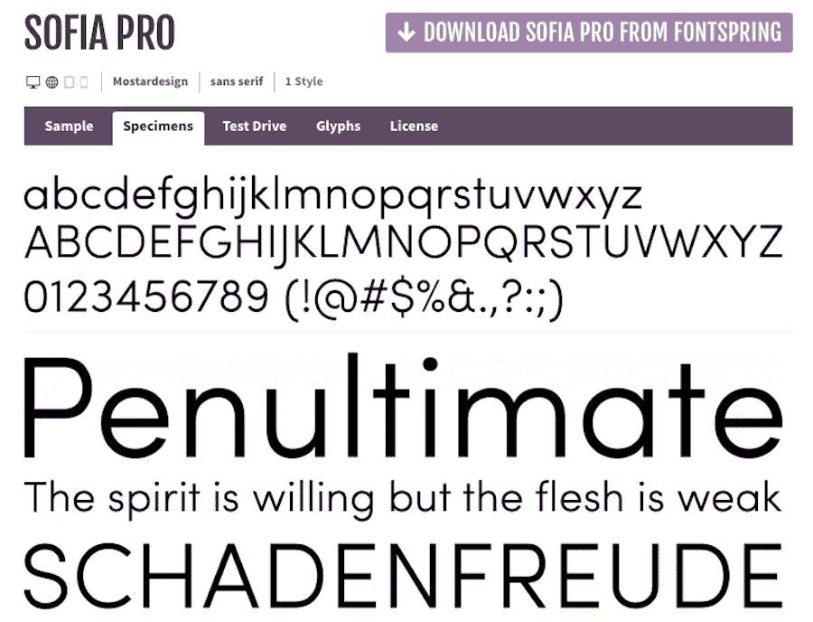

Sofia Pro


Sofia Pro 是由 Mostardesign 在 2008 年设计的一种无衬线字体。它保持了现代感，同时也包括圆形。它在和谐的设计和几何图形之间取得了坚实的平衡。

#### 无博物馆

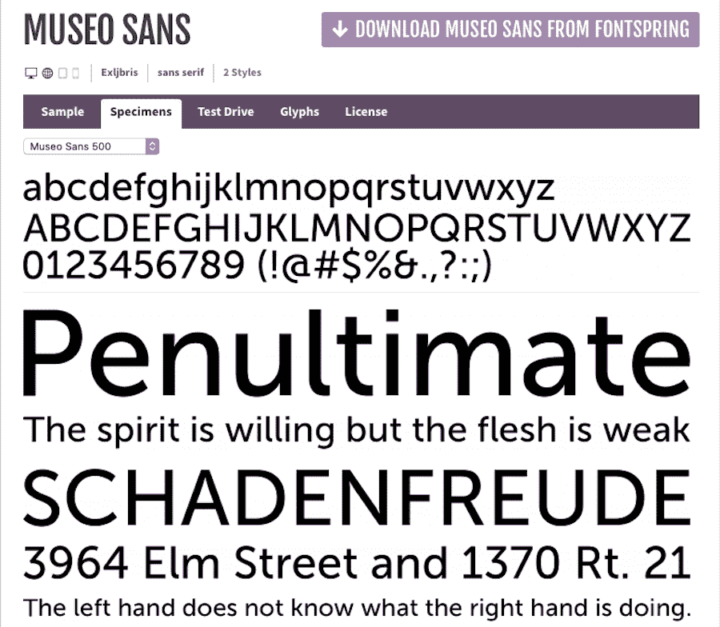

Museo Sans


最后，还有 [Museo Sans](https://www.fontsquirrel.com/fonts/museo-sans) ，这是流行的 Museo 字体的更新版本。它采用几何无衬线设计，可用于标题和文本。它清晰易读，用途广泛，是收发电子邮件的利器。它是由 Exljbris 在 2008 年设计的。

## 关于在电子邮件和文本中使用图像的注意事项

如果你嵌入一张[图片](https://kinsta.com/blog/image-file-types/),比如一张海报，甚至[一张用漂亮字体写的文字截图](https://kinsta.com/blog/how-to-screenshot-on-mac/),这可能是解决电子邮件安全字体问题的一种方法。然而，这本身也有问题，因为电子邮件中的图像并不总是显示，或者在某些屏幕上可能无法正确显示。还有屏幕阅读器的问题，除非你包含 alt 文本，否则它不知道图片说了什么。

在电子邮件中使用图片时要小心，只使用它们来增强你的信息内容，而不是传递关键信息。所以，如果你想在你的网站上宣布一个特价销售，不要只是附上一张列有产品细节的销售海报，然后就此收工。

您至少也需要将图像的文本以纯文本的形式包含进来。更好的是，完全避免这种冗余，只使用电子邮件安全文本，保存图像以备不时之需。

我所能想到的唯一一个基于文本的例外情况是一个徽标，其中公司或品牌的名称已经是已知的了。

[有趣的事实:大多数人只花 11 秒读一封邮件。⏱不要把宝贵的时间浪费在难读的字体上。🙅‍♀️查看这份电子邮件安全字体选择指南，获取更多线索！](https://twitter.com/intent/tweet?url=https%3A%2F%2Fkinsta.com%2Fblog%2Fbest-fonts-for-email%2F&via=kinsta&text=Fun+fact%3A+most+people+only+spend+11+seconds+reading+an+email.%E2%8F%B1+Don%27t+waste+that+precious+time+with+hard-to-read+fonts.+%F0%9F%99%85%E2%80%8D%E2%99%80%EF%B8%8F+Check+out+this+guide+to+email-safe+font+options+and+capture+more+leads%21&hashtags=EmailMarketing%2CFonts)

## 摘要

在向潜在客户和现有客户发送电子邮件时，并不是任何字体都可以。事实上，未能选择一个好的字体会显著伤害你的转化率。所以，你选择的字体必须是电子邮件安全的，给人留下好印象的，并且提供极好的可读性。

在这篇文章中，我们回顾了字体的主要类型以及它们可能产生的心理影响。我们展示了大多数电子邮件客户端支持的字体示例。我们还讨论了 web 字体，如何将它们添加到您的站点中，并提供了您可以开始使用的资源和 web 字体示例。

希望你现在对电子邮件安全字体的影响有了更好的了解。有了这个指南，你就可以在着手下一个[电子邮件活动](https://kinsta.com/blog/email-marketing-software/)时做出明智的选择。

如果你喜欢这篇文章，看看我们的指南[从 50 年代到 90 年代的 50 多种令人惊叹的复古字体](https://kinsta.com/blog/retro-font/)

* * *

让你所有的[应用程序](https://kinsta.com/application-hosting/)、[数据库](https://kinsta.com/database-hosting/)和 [WordPress 网站](https://kinsta.com/wordpress-hosting/)在线并在一个屋檐下。我们功能丰富的高性能云平台包括:

*   在 MyKinsta 仪表盘中轻松设置和管理
*   24/7 专家支持
*   最好的谷歌云平台硬件和网络，由 Kubernetes 提供最大的可扩展性
*   面向速度和安全性的企业级 Cloudflare 集成
*   全球受众覆盖全球多达 35 个数据中心和 275 多个 pop

在第一个月使用托管的[应用程序或托管](https://kinsta.com/application-hosting/)的[数据库，您可以享受 20 美元的优惠，亲自测试一下。探索我们的](https://kinsta.com/database-hosting/)[计划](https://kinsta.com/plans/)或[与销售人员交谈](https://kinsta.com/contact-us/)以找到最适合您的方式。