# 2022 年学什么编程语言最好？

> 原文：<https://kinsta.com/blog/best-programming-language-to-learn/>

所以你想成为一名开发者？现在是学习编程的好时机。薪水很高，T2 的工作需求在增长，一种新的令人兴奋的编程语言每年都在受欢迎程度排行榜上名列前茅。

但是学习哪种编程语言最好呢？如果你是新手，有很多选择，很难知道从哪里开始。

编程语言在不断发展——当一种语言消亡时，它会被新的大事物所取代。如果你把握好时机，你会赚很多钱。或者，您可以选择经过时间考验的语言。

所有这些都足以让你头晕目眩。哪种编程语言最好学？哪个薪水最高？他们更容易开始学习吗？这个列表将指导你了解关于选择最好的编程语言的一切。

让我们一起探索吧！

## 有哪些不同类型的编程语言？

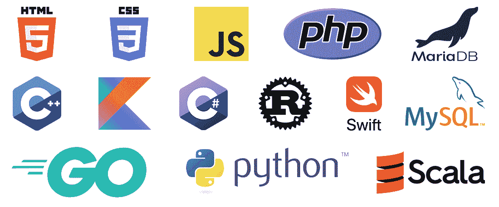

Some of the most popular web development technologies to learn

每种编程语言都是不同的。虽然每种编程语言都有其独特的语法，但它的编写、运行和编译方式可以改变一切。

> 需要在这里大声喊出来。Kinsta 太神奇了，我用它做我的个人网站。支持是迅速和杰出的，他们的服务器是 WordPress 最快的。
> 
> <footer class="wp-block-kinsta-client-quote__footer">
> 
> 
> 
> <cite class="wp-block-kinsta-client-quote__cite">Phillip Stemann</cite></footer>

[View plans](https://kinsta.com/plans/)

许多开发人员更喜欢使用特定类型的语言。在类似的语言之间移植也容易得多，所以您学习的第一种编程语言很重要。

那么有哪些不同类型的编程语言呢？脚本语言和编程语言之间有一个[区别](https://kinsta.com/blog/scripting-languages/#scripting-languages-vs-programming-languages)？让我们来看看。

*   编程语言可以是任何东西，但它们通常最适合软件开发，因为它们可以在各种平台上使用，并且倾向于编译而不是解释。大多数编程语言都是为软件开发而设计的，用来开发你下载并在你的设备上运行的程序。
*   **脚本语言**正好相反。它们经常被解释，这意味着它们的代码是动态运行的，而不是在程序中经历编译过程。Web 开发语言通常是脚本语言。
*   标记语言不是精确的编程语言，但是它们被用于网络开发。这些是用于格式化文档的可读标签。
*   Web 开发语言专门用于创建网站，无论是前端还是后端。
*   **前端(或客户端)语言**在用户的[浏览器](https://kinsta.com/browser-market-share/)中改变网站。例如，点击网站上的某个东西并制作一个动画将由前端编程产生，如 [CSS](https://kinsta.com/blog/wordpress-css/) 、HTML5 和 [JavaScript](https://kinsta.com/blog/php-vs-javascript/) 。通常是以上所有语言的组合。
*   **后端(或服务器端)语言**从服务器或应用层改变一个站点。例如，提交表单数据，或者更改数据库中的某些内容，就是后端编程。

你也要注意，很多人只是用“编程语言”来泛指所有的编码语言。脚本语言是一种专门的编程语言，但并不是所有的编程语言都是脚本语言。

严格来说，下面的语言并不是所有的编程语言，但它们都是用于编码的。

是时候投入进去了！

[所以你想成为一名开发者？👩‍💻深入了解你需要知道的关于编程语言的一切，以及哪种语言最适合你的职业道路，就在这里⬇️ 点击发推](https://twitter.com/intent/tweet?url=https%3A%2F%2Fkinsta.com%2Fblog%2Fbest-programming-language-to-learn%2F&via=kinsta&text=So+you+want+to+be+a+developer%3F+%F0%9F%91%A9%E2%80%8D%F0%9F%92%BB+Dive+into+everything+you+need+to+know+about+programming+languages%2C+and+which+one+is+the+best+for+your+career+path%2C+right+here+%E2%AC%87%EF%B8%8F&hashtags=WebDeveloper%2CWebDev)

## HTML 和 CSS

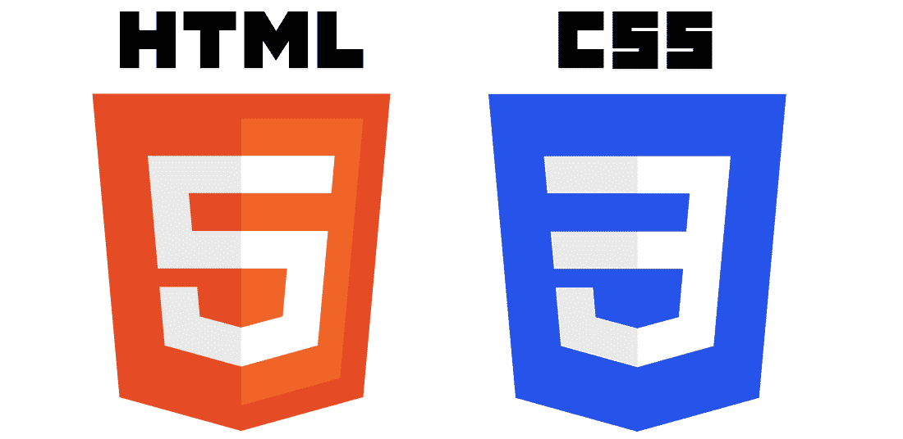

HTML5 and CSS3 logos

虽然 HTML 和 CSS 在技术上不是编程语言，但如果你想成为一名前端 web 开发人员，HTML5 和 [CSS3](https://kinsta.com/blog/wordpress-css/) 是理想的起点。这两者构成了任何网页的[构建模块，HTML 构建页面内容，CSS 设计并修改该结构。](https://kinsta.com/blog/responsive-web-design/)

HTML 和 CSS 对于任何年轻的开发者来说都是一个很好的起点。虽然 HTML 是一种简单易学的标记语言，但是 CSS 对你来说会有更多的挑战，但是也不是很难掌握。

| **平台** | 前端 web 开发。 |
| **难度** | HTML 简单易学；CSS 也相当容易学习。 |
| **人气** | IEEE 2019 年度顶级语言 [#12](https://spectrum.ieee.org/static/interactive-the-top-programming-languages-2019) 。2020 年受[54%](https://insights.stackoverflow.com/survey/2020#technology-most-loved-dreaded-and-wanted-languages-loved)stack exchange 开发者的喜爱。 |
| **平均工资** | [$ 64，000/年](https://www.payscale.com/research/US/Job=HTML_CSS_Developer/Salary)，根据 PayScale。另外，看看[网页设计师的平均工资](https://kinsta.com/blog/web-designer-salary/)。 |
| **优势** | 实际要求是前端 web 开发人员。非常容易学习，即使对于没有编程经验的人。它的高人气使得寻找免费资源变得容易。在所有设备上都得到良好支持。 |
| **缺点** | 它不会给你带来特别高的薪水，因为这是所有前端网站开发工作的要求。跨浏览器问题总是一个问题。 |

## Java Script 语言

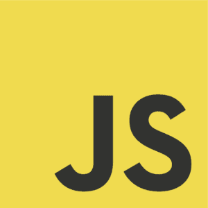

JavaScript community logo

尽管 HTML 和 CSS 是前端 web 开发人员的必备工具，但 JavaScript 仍然非常流行。与 HTML 结构和 CSS 样式不同， [JavaScript 为网页添加了高级客户端功能](https://kinsta.com/blog/php-vs-javascript/#variable-and-constant-definitions)。

与 HTML 和 CSS 不同，JavaScript 是一种真正的编程和脚本语言。这意味着你可以用它做更多的事情，但是也有点难学。尽管如此，如果你想开发的不仅仅是平面页面，你几乎肯定需要了解 JavaScript。

| **平台** | 前端脚本。很少用于移动/软件开发。 |
| **难度** | JavaScript 是一种真正的编程语言，所以那些直接来自 HTML 和 CSS 的人可能会有困难。与其他语言相比，它比较容易学。 |
| **人气** | 非常流行，经常与 HTML 和 CSS 齐头并进。2021 年 2 月 PYPL 人气指数 [#3](https://pypl.github.io/PYPL.html) 。2021 年 2 月 TIOBE 指数 [#7](https://www.tiobe.com/tiobe-index/) 。IEEE 2019 年度顶级语言 [#6](https://spectrum.ieee.org/static/interactive-the-top-programming-languages-2019) 。2020 年受 StackExchange 开发者的喜爱 [58%](https://insights.stackoverflow.com/survey/2020#technology-most-loved-dreaded-and-wanted-languages-loved) 。 |
| **平均工资** | [$ 83，000/年](https://www.payscale.com/research/US/Skill=JavaScript/Salary)，根据工资等级。 |
| **优势** | 编写在浏览器中运行的客户端脚本的最快和最简单的方法。一种非常流行的编程语言。广泛支持各种应用。它实际上为大多数现代网站提供了动力，包括这个。 |
| **缺点** | 对于只懂标记语言的人来说，学习起来可能会有些力不从心。存在安全性和跨浏览器稳定性问题。 |

## 服务器端编程语言（Professional Hypertext Preprocessor 的缩写）

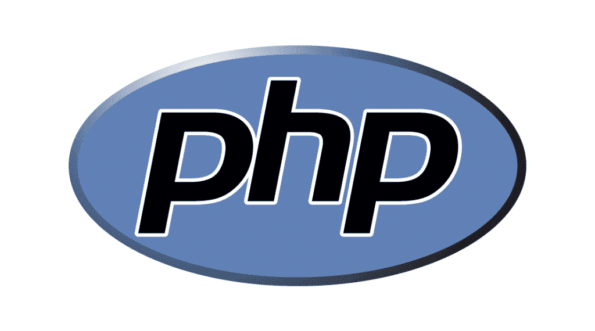

PHP logo

PHP 是大型项目的首选语言，尤其是 [WordPress](https://kinsta.com/knowledgebase/what-is-wordpress/) 本身。由于过时和缓慢，它曾经分裂了开发者社区，许多人仍然坚持认为它不值得花时间去学习。

然而，从 PHP 5.x 开始，PHP 又重新流行起来，对速度和结构进行了一系列的改进。根据 W3Techs，[他们调查的网站中有 79%使用 PHP](https://w3techs.com/technologies/details/pl-php) 。

有一点是明确的——这是一种编写服务器端应用程序的强大方法，与其他脚本语言相比，学习起来毫不费力。它在新程序员中的受欢迎程度和 WordPress 等大量开源项目意味着也有大量的学习资源。

有几十种流行的 PHP 开发框架，比如 T2 的 Laravel T3，可以让你用 PHP 编写代码变得更加容易。随着 [PHP 8.0](https://kinsta.com/blog/php-8/) 的发布，PHP 正试图脱离后端脚本语言，成为通用编程语言。

| **平台** | 后端 web 脚本。 |
| **难度** | 简单易学，尤其适合初学者。 |
| **人气** | 2021 年 2 月 PYPL 人气指数 [#6](https://pypl.github.io/PYPL.html) 。2021 年 2 月 TIOBE 指数 [#8](https://www.tiobe.com/tiobe-index/) 。[# 13](https://spectrum.ieee.org/static/interactive-the-top-programming-languages-2019)IEEE 2019 年度顶级语言。2020 年，37%的 StackExchange 开发人员喜欢它(但 63%的人害怕它！) |
| **平均工资** | [$ 65，000/年](https://www.payscale.com/research/US/Job=PHP_Developer/Salary)根据工资标准。 |
| **优势** | 非常好学。在 web 开发领域非常有名，并且在网站上很常见。现代版本相当快。PHP 开发人员好找工作。 |
| **缺点** | 与 Python 等热门新语言相比，受欢迎程度正在下降。许多开发者认为这不可行。 |

## 结构化查询语言

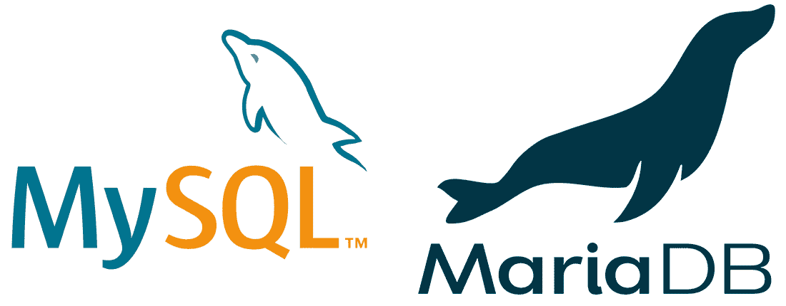

MySQL and MariaDB are the popular SQL-based databases

许多人说，从技术上讲，SQL 不是一种编程语言，因为你不能像使用 C++或 JavaScript 这样的通用语言那样使用它。但是无论你如何定义它，它都是一个重要的网络开发工具。

SQL 的主要目的是[与网站的数据库](https://kinsta.com/blog/adminer/)接口。各种各样的数据库管理系统，如 [MySQL、MariaDB](https://kinsta.com/blog/mariadb-vs-mysql/) 、SQLite 和 PostgreSQL 都可以帮助你处理它，但它们都使用 SQL 语言。

| **平台** | 后端数据库管理。 |
| **难度** | 对于有编程知识的人来说，学习起来相当容易。如果用于高级功能，它会变得非常复杂。 |
| **人气** | 2021 年 2 月 TIOBE 索引中的 [#9](https://www.tiobe.com/tiobe-index/) 。IEEE 2019 年度顶级语言 [#15](https://spectrum.ieee.org/static/interactive-the-top-programming-languages-2019) 。2020 年受[57%](https://insights.stackoverflow.com/survey/2020#technology-most-loved-dreaded-and-wanted-languages-loved)stack exchange 开发者的喜爱。 |
| **平均工资** | [$ 74，000/年](https://www.payscale.com/research/US/Job=SQL_Developer/Salary)，根据 PayScale。 |
| **优势** | 功能强大，可以处理大量数据。需求高，几乎每个网站都需要数据库管理。 |
| **缺点** | 掌握它很有挑战性。处理存储的数据可能很乏味。 |

## C++

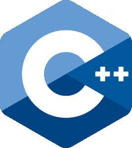

C++ logo

最初的 C 语言今天仍在使用，但大多数现代开发人员已经改用 C++。通用编程语言最出名的是通用性；你可以用它来制作各种各样的应用程序。

电脑程序、[手机应用](https://kinsta.com/blog/wordpress-mobile-plugin/)、视频游戏、操作系统、整个浏览器，甚至某种程度上的网页开发——如果你能想到什么，C++就能做到。它会跑得很快。

| **平台** | 大多是软件开发；可以在各种情况下使用。 |
| **难度** | 相对难学，尤其是初学者。 |
| **人气** | 2021 年 2 月 PYPL 人气指数 [#5](https://pypl.github.io/PYPL.html) 。2021 年 2 月 TIOBE 指数 [#4](https://www.tiobe.com/tiobe-index/) 。IEEE 2019 年度顶级语言 [#4](https://spectrum.ieee.org/static/interactive-the-top-programming-languages-2019) 。2020 年受 43%stack exchange 开发者的喜爱。 |
| **平均工资** | [$ 70k/年](https://www.payscale.com/research/US/Job=C%2B%2B_Developer/Salary)根据工资标准。 |
| **优势** | 纯粹的多功能性。你可以用它做任何事情。技能可以很好地翻译成其他语言。快速而强大。 |
| **缺点** | 对完全初学者来说不是正确的第一语言。难以置信的复杂，因为它太老了，而且应用如此普遍。不适合 web 开发。 |

## C#

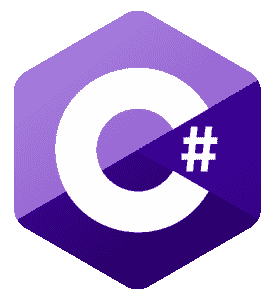

C# logo

虽然 C++是 C 的直接扩展，但 C#只是简单的启发。像 C++一样，C#被认为是原始的、过时的语言的更现代、更通用的版本。那么这两者有什么区别呢？

首先，C#更容易学习。它更简单，不太复杂，但仍然可以用来创建各种不同的应用程序。它也比 C++更适合 web 开发。它在游戏开发中非常受欢迎，[位于薪水最高的语言](https://kinsta.com/blog/web-developer-salary/#web-developer-salaries-by-language)中间。

这两个你选哪个？看情况。如果你需要原始动力，C++更好。C#更简单，更容易使用，但它仍然是一个通用的解决方案。

## 注册订阅时事通讯

### 想知道我们是怎么让流量增长超过 1000%的吗？

加入 20，000 多名获得我们每周时事通讯和内部消息的人的行列吧！

[Subscribe Now](#newsletter)

| **平台** | 主要是软件和网络开发。 |
| **难度** | 中等容易学会。 |
| **人气** | 2021 年 2 月 PYPL 人气指数 [#4](https://pypl.github.io/PYPL.html) 。2021 年 2 月 TIOBE 指数 [#5](https://www.tiobe.com/tiobe-index/) 。IEEE 2019 年度顶级语言 [#7](https://spectrum.ieee.org/static/interactive-the-top-programming-languages-2019) 。2020 年受 60%stack exchange 开发者的喜爱。 |
| **平均工资** | [$ 68k/年](https://www.payscale.com/research/US/Job=C%23_Developer/Salary)根据工资标准。 |
| **优势** | 相对容易学，尤其是和 C++相比。百搭。你可以在各种不同的应用中使用它。 |
| **缺点** | 不如 C++强大或快速。 |

## 迅速发生的

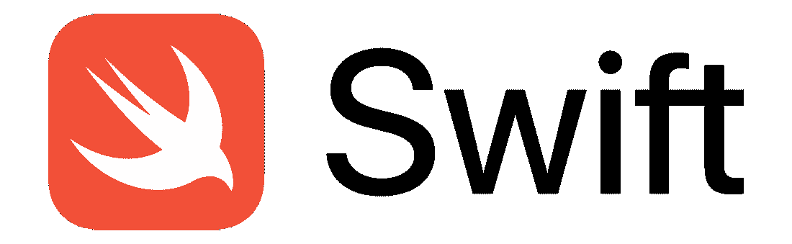

Swift logo

就 iOS 和 macOS 开发而言，Swift 是黄金标准。它现代、快速、安全。所有这一切导致了它的流行爆炸。开发人员喜欢用它编程，因为编写起来毫不费力，所以它成功垄断了 iOS 开发。

如果你计划为苹果设备开发程序或应用，Swift 是一个很好的入门编程语言。

| **平台** | iOS 和 macOS 开发。 |
| **难度** | 相对容易学。 |
| **人气** | 2021 年 2 月 PYPL 人气指数 [#9](https://pypl.github.io/PYPL.html) 。2021 年 2 月 TIOBE 指数 [#15](https://www.tiobe.com/tiobe-index/) 。IEEE 2019 年度顶级语言 [#9](https://spectrum.ieee.org/static/interactive-the-top-programming-languages-2019) 。2020 年受 60%stack exchange 开发者的喜爱。 |
| **平均工资** | [$ 105，000/年](https://www.payscale.com/research/US/Job=Swift_Developer/Salary)根据工资标准。 |
| **优势** | 快速开发的干净代码。iOS 最流行的语言。 |
| **缺点** | 很少跨平台支持。越来越受欢迎，但仍被认为是一种年轻的语言。 |

## 我的锅

Kotlin logo

如果 Swift 是 iOS 开发的首选语言，那么 Kotlin 就是 Android 的主要语言。它的目标不是独一无二或突破性的，而是从你已经知道的语言中汲取灵感——这就是它如此受开发人员喜爱的原因。

它还完全可以与 Java 互操作，这使它成为一个直接的替代品。但是与受欢迎程度有所下降的 Java 不同，Kotlin 只是在增长，而且它是一种学习起来很有竞争力的语言。

| **平台** | 主要是 Android 开发，但也包括 web 和软件开发。 |
| **难度** | 相对容易学。 |
| **人气** | 2021 年 2 月 PYPL 人气指数 [#12](https://pypl.github.io/PYPL.html) 。2019 年 IEEE 顶级语言 [#24](https://spectrum.ieee.org/static/interactive-the-top-programming-languages-2019) 。2020 年受[63%](https://insights.stackoverflow.com/survey/2020#technology-most-loved-dreaded-and-wanted-languages-loved)stack exchange 开发者的喜爱。 |
| **平均工资** | [$ 100，000/年](https://www.payscale.com/research/US/Skill=Kotlin_Programming_Language/Salary)根据工资标准。 |
| **优势** | 一个优秀的 Android 开发和通用语言。一种简单易学且不断发展的语言。与 Java 的互操作性。 |
| **缺点** | 比 Java 更新，也不太受欢迎，所以网上可用的资源更少。 |

## 锈

Rust logo

Rust 是一种几乎普遍受欢迎的编程语言。在很多方面，它和 C++很相似。它被设计得既健壮又快速，你可以在各种项目中使用它。

由 Mozilla Research 的 Graydon Hoare 设计的 Rust 是为了解决其他语言带来的许多问题。因此，如果你正在与 Java 和 C++等老技术作斗争，Rust 可能是完美的继任者。

| **平台** | 主要是软件和应用程序开发，但你可以用它做任何事情。 |
| **难度** | 被认为具有学习挑战性。 |
| **人气** | 2021 年 2 月 PYPL 人气指数 [#16](https://pypl.github.io/PYPL.html) 。IEEE 2019 年度顶级语言 [#17](https://spectrum.ieee.org/static/interactive-the-top-programming-languages-2019) 。被 [86%](https://insights.stackoverflow.com/survey/2020#technology-most-loved-dreaded-and-wanted-languages-loved) (！)的 StackExchange 开发者数量(2016 年、2017 年、2018 年、2019 年)。最不惧怕任何语言。 |
| **平均工资** | [$ 115，000/年](https://www.payscale.com/research/US/Skill=Rust_Programming_Language/Salary)根据工资标准。 |
| **优势** | 强大、快速、高效。能够在各种各样的情况下使用。深受程序员的喜爱。 |
| **缺点** | 比许多其他语言更严格，因此很难编码，也很难学习。 |

## 计算机编程语言

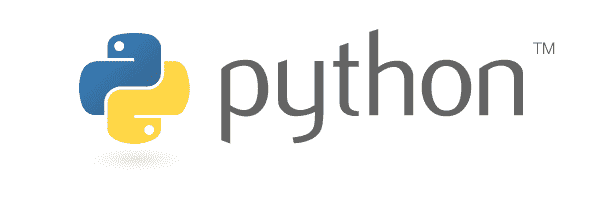

Python logo

Python 的流行似乎是凭空而来的，但它已经占领了几乎所有的开发领域。目前，它是 GitHub 上第二流行的编码语言(仅次于 JavaScript)。从给服务器后端供电到机器学习软件， [Python 可以做到这一切](https://kinsta.com/blog/scripting-languages/#3-python)。

需要为您的客户站点提供超快的、安全的、开发人员友好的托管服务吗？Kinsta 是为开发人员设计的，提供了大量工具和强大的仪表板。[查看我们的计划](https://kinsta.com/plans/?in-article-cta)

它几乎拥有编程语言所要求的一切:通用性、速度和效率。另外，它超级容易学。

如果仅仅是潜力和受欢迎程度就足以让你有动力，那么 Python 就是你的不二之选。现在对它并不缺乏需求。

如果你想了解更多关于如何学习 Python 的信息，请阅读我们关于最好的 [Python 教程](https://kinsta.com/blog/python-tutorials/)的帖子。

| **平台** | 网络和软件开发。 |
| **难度** | 简单易学。 |
| **人气** | Python 在过去的几年里大受欢迎。2021 年 2 月 PYPL 人气指数 [#1](https://pypl.github.io/PYPL.html) 。2021 年 2 月 TIOBE 指数 [#3](https://www.tiobe.com/tiobe-index/) 。IEEE 2019 年度顶级语言 [#1](https://spectrum.ieee.org/static/interactive-the-top-programming-languages-2019) 。2020 年，67%的 StackExchange 开发人员喜欢它，30%的人需要它，是所有语言中最受欢迎的。 |
| **平均工资** | [$ 79k/年](https://www.payscale.com/research/US/Job=Python_Developer/Salary)根据工资标准。 |
| **优势** | 它几乎可以在任何地方使用，从网络应用到软件开发到游戏创作。跨平台。高人气意味着大量的资源，甚至更多的工作。 |
| **缺点** | 比其他语言慢。Python 知识不能很好地移植到其他系统。 |

## 红宝石

Ruby logo

Ruby 的一切都是为了简单。它优雅的语法易于使用，并被设计成尽可能无痛，它在前端和后端开发中都有效。Ruby 语言实际上是用英语编写的，所以学习它的语法是最基本的。

但是不要被单纯的外表所迷惑。Ruby 可能并不是一种强大的语言，但是它很好地完成了任务。

| **平台** | 主要是前端和后端网站开发。 |
| **难度** | 极其简单易学。 |
| **人气** | 2021 年 2 月 PYPL 人气指数 [#15](https://pypl.github.io/PYPL.html) 。2021 年 2 月 TIOBE 指数 [#14](https://www.tiobe.com/tiobe-index/) 。2019 年 IEEE 顶级语言 [#17](https://spectrum.ieee.org/static/interactive-the-top-programming-languages-2019) 。2020 年受 43%stack exchange 开发者的喜爱。 |
| **平均工资** | [$ 78，000/年](https://www.payscale.com/research/US/Job=Ruby_Software_Developer_%2F_Programmer/Salary)，根据 PayScale。 |
| **优势** | 干净、高效的代码。轻松进行 web 开发的首选语言(尤其是使用框架 [Ruby on Rails](https://rubyonrails.org/) )。一个充满活力的大型社区。 |
| **缺点** | 不如其他语言灵活或受欢迎。 |

## Java 语言(一种计算机语言，尤用于创建网站)

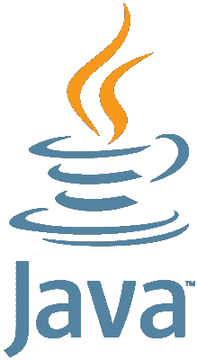

Java logo

Java 感觉像是所有编码语言的祖父，但实际上它甚至没有 C++古老。尽管许多人认为它已经过时，但它仍然在世界范围内和各种设备上使用。

Python 正在超越它，并普遍受到欢迎，但 Java 肯定没有死。Java 后端开发人员有成千上万的工作机会，而且需求居高不下，这是一个可靠的选择。

| **平台** | 软件/应用程序、Web 和移动开发。 |
| **难度** | 很难捡起来。 |
| **人气** | 尽管 Java 是一种已经失宠多年的古老语言，但它仍然是最受欢迎的语言。2021 年 2 月 PYPL 人气指数 [#2](https://pypl.github.io/PYPL.html) 。2021 年 2 月 TIOBE 指数 [#2](https://www.tiobe.com/tiobe-index/) 。IEEE 2019 年度顶级语言 [#2](https://spectrum.ieee.org/static/interactive-the-top-programming-languages-2019) 。2020 年受 44%stack exchange 开发者的喜爱。 |
| **平均工资** | [$ 75，000/年](https://www.payscale.com/research/US/Job=Java_Developer/Salary)根据工资标准。 |
| **优势** | 跨平台和通用。尽管年代久远，却广受欢迎。更高的安全性。 |
| **缺点** | 难学。表现不好。受欢迎程度有下降的趋势。 |

## 斯卡拉

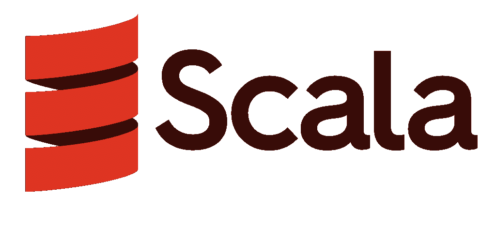

Scala logo

与 Kotlin 非常相似，Scala 是为了取代 Java 及其诸多问题而创建的。它是一种强大的、多用途的语言，但它更简洁。虽然你可以把它用于和 Java 一样的系统，但它主要用于[大数据处理](https://kinsta.com/blog/google-cloud-vs-aws/#compute-features)和机器学习。

虽然它没有像其他语言一样受欢迎，但它有很大的潜力。

| **平台** | 主要是软件/应用程序开发。 |
| **难度** | 复杂难学。 |
| **人气** | 2021 年 2 月 PYPL 人气指数 [#18](https://pypl.github.io/PYPL.html) 。IEEE 2019 年度顶级语言 [#18](https://spectrum.ieee.org/static/interactive-the-top-programming-languages-2019) 。2020 年受[53%](https://insights.stackoverflow.com/survey/2020#technology-most-loved-dreaded-and-wanted-languages-loved)stack exchange 开发者的喜爱。 |
| **平均工资** | [$ 11.7 万/年](https://www.payscale.com/research/US/Skill=Scala/Salary)，根据 PayScale。 |
| **优势** | 比 Java 更少冗长，更简洁。非常强大，可以在任何地方使用。 |
| **缺点** | 跟 Java 一样难学。对于第一次编程的人来说不是合适的语言。 |

## 去

Go logo

最后是 Go，由 Google 设计的 Java 和 C++的替代品。性能是它最擅长的，消除了困扰许多其他语言的大量编译时间。它是并发的，在后台工作，同时执行多种功能。

然而，除非最大速度是你的唯一目标，否则其他语言可以更好地完成 Go 的大部分功能。并不总是清楚你到底应该用 Go 做什么。尽管如此，开发者还是喜欢它，而且它的受欢迎程度还在继续增长。例如， [MailHog](https://kinsta.com/blog/mailhog/#what-is-mailhog) ，这款开源电子邮件测试工具支持 [DevKinsta 的本地电子邮件测试功能](https://kinsta.com/devkinsta/features/)，它是用 Go 编程语言构建的。

| **平台** | 主要是后端 web 开发。 |
| **难度** | 极其简单易学。 |
| **人气** | 2021 年 2 月 PYPL 人气指数 [#13](https://pypl.github.io/PYPL.html) 。2021 年 2 月 TIOBE 指数 [#13](https://www.tiobe.com/tiobe-index/) 。[# 10](https://spectrum.ieee.org/static/interactive-the-top-programming-languages-2019)IEEE 2019 年度顶级语言。2020 年受 62%stack exchange 开发者的喜爱。 |
| **平均工资** | [$ 11.7 万/年](https://www.payscale.com/research/US/Skill=Go_(Golang)_Programming_Language/Salary)，根据 PayScale。 |
| **优势** | 非常轻便和快速。常见编程问题的现代解决方案。 |
| **缺点** | 一种更新的语言，所以资源稀缺。简单使它不太灵活。 |

## 哪种编程语言最好？

对于哪种编码语言是最好的，没有明确的答案。各有利弊，在不同情况下大放异彩。但是当涉及到具体的类别时，有一些明显的赢家。这些语言最适合:

*   **初学者:**对于绝对最容易学的语言，即使你完全没有经验，也可以从 HTML/CSS、Go、Ruby、 [PHP](https://kinsta.com/blog/php-tutorials/) ，或者 Python 开始。
*   **Web 开发者:** [HTML、CSS、JavaScript](https://kinsta.com/blog/web-design-courses/) 是前端开发者的必需品。后端开发人员应该研究 Ruby、Python、PHP 和 Go。当然，还有用于数据库管理的 SQL。
*   **软件开发者:** C++无疑是最强大的。但是不要忽视 Rust，Python，Scala，或者 C#。这完全取决于您正在构建的软件。
*   ****移动开发者:**** Swift 最适合 iOS，Kotlin 最适合 Android。但是像 C++和 Java 这样的通用语言也能很好地工作。
*   **高薪:** Swift、Rust、Scala、Kotlin 和 Go 都帮你赚到大约 10 万美元/年，其中 Scala 和 Go 产生的薪水最高。此外，查看我们的[各种职位的开发人员工资](https://kinsta.com/blog/web-developer-salary/)。
*   **受欢迎程度:** Python 非常受欢迎，考虑到它的多功能性，它很长一段时间内都将保持领先地位。JavaScript、Java、C#、C++本身也相当流行。
*   ****灵活性:**** C++可能是灵活性方面的巨人，但 Rust、Java、Scala、Kotlin 和 Python 都可以在跨平台和各种情况下很好地工作。

[From remote job options 🌍 to high salaries 💰 to fulfilling and exciting work 😄, there are many reasons to be a developer. The first step? Reading this guide ⬇️Click to Tweet](https://twitter.com/intent/tweet?url=https%3A%2F%2Fkinsta.com%2Fblog%2Fbest-programming-language-to-learn%2F&via=kinsta&text=From+remote+job+options+%F0%9F%8C%8D+to+high+salaries+%F0%9F%92%B0+to+fulfilling+and+exciting+work+%F0%9F%98%84%2C+there+are+many+reasons+to+be+a+developer.+The+first+step%3F+Reading+this+guide+%E2%AC%87%EF%B8%8F&hashtags=WebDev%2CRemoteWork)

## 摘要

从列表中挑选一种编程语言并不是一件容易的事情。但是，如果你知道你想做什么，从哪里开始，把这个列表整理成几个最好的候选人会容易得多。无论你想要“最热门”的语言，薪水最高的语言，还是那些最容易学的语言，都是如此。

学习如何编程会让你得到一份最灵活的工作，允许你远程工作，选择你喜欢的任何技术。虽然没有一种编程语言是最好的，但是朝着正确的方向努力可以帮助你选择正确的语言。

获取编码！

我们是否错过了其他编程语言？我们很乐意在下面的评论区听到你的意见。查看 [Kinsta 的职业页面](https://kinsta.com/careers/)寻找编程和技术相关的工作机会。

* * *

让你所有的[应用程序](https://kinsta.com/application-hosting/)、[数据库](https://kinsta.com/database-hosting/)和 [WordPress 网站](https://kinsta.com/wordpress-hosting/)在线并在一个屋檐下。我们功能丰富的高性能云平台包括:

*   在 MyKinsta 仪表盘中轻松设置和管理
*   24/7 专家支持
*   最好的谷歌云平台硬件和网络，由 Kubernetes 提供最大的可扩展性
*   面向速度和安全性的企业级 Cloudflare 集成
*   全球受众覆盖全球多达 35 个数据中心和 275 多个 pop

在第一个月使用托管的[应用程序或托管](https://kinsta.com/application-hosting/)的[数据库，您可以享受 20 美元的优惠，亲自测试一下。探索我们的](https://kinsta.com/database-hosting/)[计划](https://kinsta.com/plans/)或[与销售人员交谈](https://kinsta.com/contact-us/)以找到最适合您的方式。