# 2022 年创业公司、企业和自由职业者的 24 个最佳网络研讨会平台

> 原文：<https://kinsta.com/blog/best-webinar-platforms/>

网络研讨会是将潜在客户转化为付费客户的有效途径，但前提是方法正确。这就是为什么你需要访问最好的网上研讨会平台。

你不能只是直播一个断断续续的、低质量的、非交互式的视频。参加这样的网络研讨会是一次令人沮丧的经历，不会激发转化。

但有了合适的网上研讨会平台，你可以轻松建立一个可靠的系统，与潜在客户建立更深层次的关系。这就是为什么 53%的营销人员计划在 2022 年使用网络研讨会。

为了帮助您找到合适的匹配，我们在本文中介绍了 24 种不同的选择，包括免费和便宜的替代方案，以帮助您无风险地试水。

T3】

## 如何为您的公司选择合适的网上研讨会平台

有很多网上研讨会平台。有些甚至是免费的。

但是不要只选择最便宜或最容易的选择。花点时间搞清楚哪个平台最适合你公司的独特需求。

问自己以下问题。

**你的网络研讨会的目标是什么？**

您会将它们用于[销售线索生成](https://kinsta.com/blog/wordpress-lead-generation/)还是销售线索培育？思想领导还是展示产品？

寻找一个有助于你实现目标的网上研讨会平台。

**您预计每次网络研讨会有多少人参加？**

许多网上研讨会平台会限制每个定价层的现场与会人数。对于 30 名观众来说，最具成本效益的平台可能不同于 3000 名观众。

你将如何与与会者互动？

你只是打算在你的潜在客户听的时候说话吗？或者你会让他们参与进来，比如在网上研讨会期间[进行一次投票](https://kinsta.com/blog/wordpress-survey-plugins/)？

如果你想和你的观众互动，看看每个平台的互动功能。

网上研讨会结束后，你会如何处理这些视频？

过去网络研讨会的视频为你的网站提供了很好的点播内容，尤其是如果你是一家 B2B 公司。网络研讨会是[排名第一的](https://www.demandgenreport.com/resources/reports/2020-content-preferences-study-b2b-buyers-increasingly-looking-for-credible-show-and-tell-experiences-to-drive-buying-decisions/)类型的内容，B2B 买家愿意[用他们的电子邮件地址](https://kinsta.com/blog/wordpress-forms/)注册。

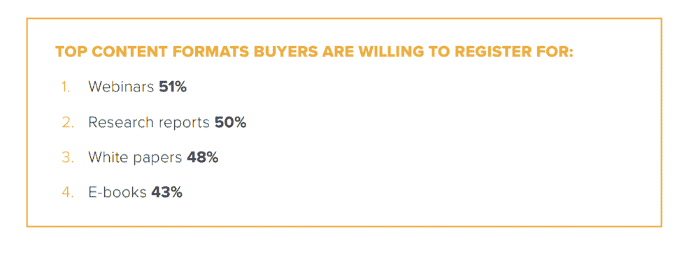

顶级 B2B 买家内容格式(**来源:** [需求生成报告](//www.demandgenreport.com/resources/reports/2020-content-preferences-study-b2b-buyers-increasingly-looking-for-credible-show-and-tell-experiences-to-drive-buying-decisions/%E2%80%9D) )

如果你打算像那样使用你的网上研讨会视频，你会想要一个平台，它可以很容易地将网上研讨会锁定在一个表单后面。

[网络研讨会是将潜在客户转化为付费客户的有效途径，但前提是方法得当。💪这些网络研讨会平台将为您提供成功所需的工具🚀 点击推文](https://twitter.com/intent/tweet?url=https%3A%2F%2Fkinsta.com%2Fblog%2Fbest-webinar-platforms%2F&via=kinsta&text=Webinars+are+an+effective+way+to+convert+leads+into+paying+customers%2C+but+only+when+done+right.+%F0%9F%92%AA+These+webinar+platforms+will+give+you+the+tools+you+need+to+succeed+%F0%9F%9A%80&hashtags=Webinar%2CMarketingTips)

## 2022 年最佳网络研讨会平台

在我们探讨本文中的 23 个选项时，请记住上面的注意事项。

T3】

### 1.直播风暴

Livestorm 是一个流行的网络研讨会和视频会议平台。它非常适合产品演示和培训会议。

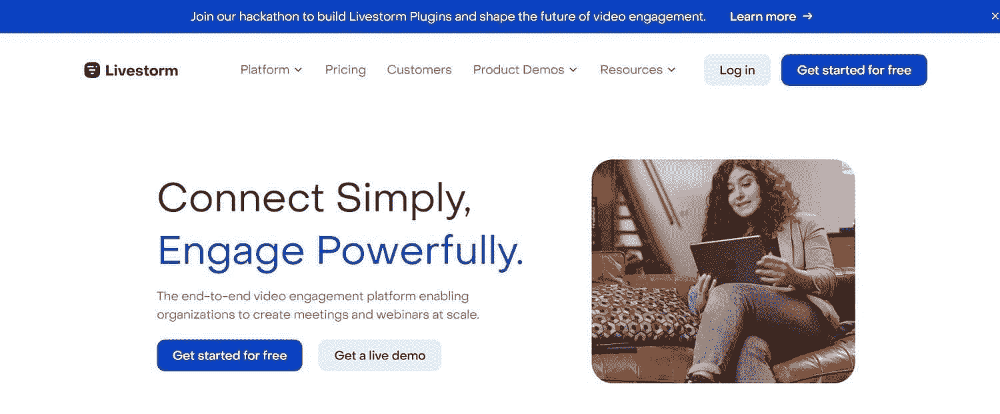

直播风暴

**优点:**

*   有一个免费的计划(但它只允许你有十个注册者)
*   举办实时、点播或全自动网络研讨会
*   通过投票、问答和向上投票等功能吸引与会者
*   基于浏览器，这意味着它可以在任何设备上使用，不需要下载或设置
*   可以为每个网络研讨会生成品牌注册页面
*   您可以向已注册的人发送自动电子邮件提醒
*   [与 HubSpot、Salesforce 和其他常用工具的集成](https://kinsta.com/blog/slack-integrations/)

**缺点:**

*   作为浏览器软件，视频质量会受到主机互联网连接的影响
*   最便宜的付费计划每月 99 美元起

**定价**

*   最多十名参与者的有限计划:免费
*   有 100 名现场与会者的商业计划(或更多的附加项目):99 美元/月
*   拥有 3，000 名现场与会者的企业计划:定制定价

### 2.WebinarJam

[WebinarJam](https://home.webinarjam.com/index) 是一个易于使用的网上研讨会平台，在销售产品方面特别有效。一个有用的 WebinarJam 功能是在网上研讨会期间出现的弹出式 CTA，使与会者可以轻松购买产品。

**优点**

*   14 天试用版，仅售 1 美元
*   企业计划最多可容纳 6 名演示者和 5，000 名现场与会者
*   “副本回放”让您可以准确地回放您的网上研讨会，例如，与会者的评论将在回放时与在原始视频上同时出现
*   用户友好且设置快速
*   CTA 弹出窗口

**缺点**

*   按需提供您的网络研讨会 Jam 网络研讨会需要您购买 EverWebinar

**定价**

*   500 人的基本计划:499 美元/年
*   2000 人参加的专业计划:699 美元/年
*   5000 人的企业计划:999 美元/年

### 3.EverWebinar

WebinarJam 是为实时网络研讨会设计的。 [EverWebinar](https://home.everwebinar.com/index) 是它的姊妹产品，可以帮助你在网上研讨会视频的基础上进行推广。

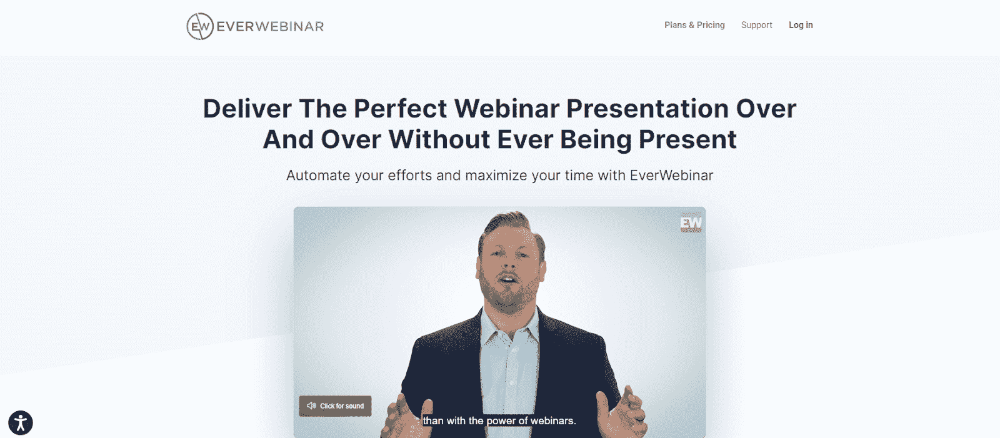

**优点**

*   自动将 WebinarJam 视频转换为重复事件
*   点播式网络研讨会具有现场网络研讨会的外观和感觉(包括虚假的出席人数)
*   视频不需要额外下载或设置，可以在用户的浏览器上观看
*   先进的日程安排系统让你屏蔽掉不可用的日期

**缺点**

*   与 WebinarJam 分开出售。其他一些解决方案可以让您在同一个平台上创建点播和实时网络研讨会

**定价**

*   按月计费:每月 99 美元
*   按年计费:每月 42 美元
*   两年计费一次:每月 34 美元

### 4.德米奥

[Demio](https://www.demio.com/) 是一款一体化工具，提供直播和点播网络研讨会。Demio 是为营销人员设计的，有一套内置的推广工具。

德米奥

**优点**

*   网上研讨会页面高度可定制
*   包括互动功能，如实时聊天、文档讲义和 CTA 弹出窗口
*   集成了许多常见的营销工具
*   提供 14 天免费试用

**缺点**

*   随着更多的与会者，价格迅速攀升

**定价**

*   有一个主持人和 50 个与会者的启动计划:34 美元/月
*   有 5 名主持人和 150 名与会者的增长计划:69 美元/月
*   1000 名参与者的增长计划:257 美元/月
*   高级计划:定制定价

### 5.EasyWebinar

EasyWebinar 是一个直播和自动化的 evergreen 网络研讨会平台，它以简单易用而自豪。

EasyWebinar

**优点**

*   即使是最便宜的计划也包括现场和自动网络研讨会
*   与多个演示者共享屏幕
*   观众参与功能，如实时聊天和问答
*   有一个 [WordPress 插件](https://kinsta.com/blog/category/wordpress-plugins-themes/)

**缺点**

*   与会者需要安装网上研讨会应用程序，以便在移动设备上观看网上研讨会
*   不是最便宜的平台，尤其是拥有大量受众的平台

**定价**

*   100 名现场与会者的标准计划:每月 78 美元或每年 708 美元
*   有 500 名现场与会者的专业计划:129 美元/月或 1080 美元/年
*   有 2，000 名现场与会者的企业计划:每月 499 美元或每年 4188 美元
*   如果您选择按年计费，则包括三个月的免费服务

### 6.网络忍者

[WebinarNinja](https://webinarninja.com/) 是一个一体化网络研讨会解决方案，提供四种类型的网络研讨会:实时、自动、混合和系列。

网络忍者

**优点**

*   互动功能包括实时聊天、投票和可下载的讲义
*   好看的[登录页面](https://kinsta.com/blog/wordpress-landing-page-plugins/)模板
*   您可以在演示文稿中嵌入销售优惠

**缺点**

*   后端可能很难导航

**定价**

*   有 100 名现场参与者的启动计划:49 美元/月
*   300 名现场与会者的专业计划:95 美元/月
*   500 名现场与会者的附加计划:159 美元/月
*   1000 名现场与会者的电源计划:249 美元/月
*   14 天免费试用

### 7.网络研讨会极客

[WebinarGeek](https://www.webinargeek.com/) 是一款易于使用的网上研讨会软件，提供直播、点播和常青树网上研讨会选项。这不是功能最丰富的网上研讨会解决方案，但它让您以合理的价格制作专业质量的网上研讨会。

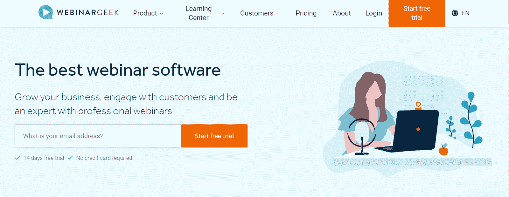

**优点**

*   非常容易使用
*   你可以给你的网上研讨会定制品牌
*   创建直播、点播、常青树或混合网络研讨会
*   高级计划中的许多定价层级，使其在任何规模下都具有成本效益

**缺点**

*   一些用户发现初始设置需要很长时间

**定价**

*   有 25 名现场与会者的启动计划:每月 22 美元
*   有 100-2，000 名现场参与者的高级计划:每月 58-294 美元
*   有 500–4，000 名现场与会者的高级计划:定制定价
*   14 天免费试用

### 8.GoToWebinar

[GoToWebinar](https://www.goto.com/webinar) 是最早的网上研讨会工具之一。它的主要受众是大型企业。

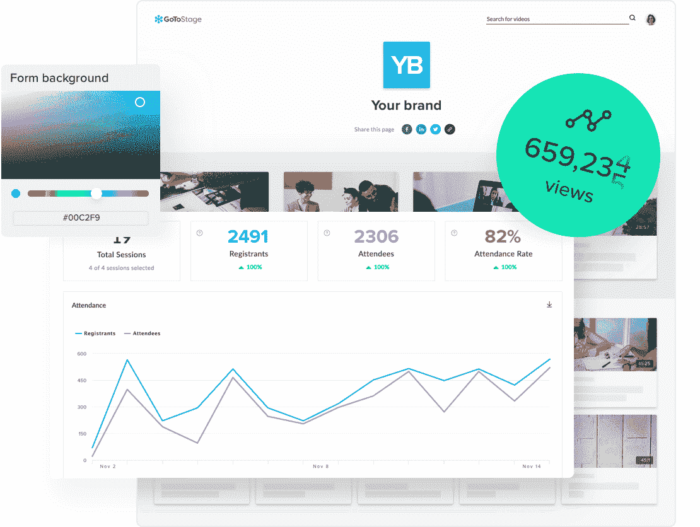

戈托韦纳尔

**优点**

*   观众参与投票和调查
*   高质量的视频和音频
*   销售线索管理和报告工具
*   分组讨论室将你的听众分开

**缺点**

*   软件感觉有点过时
*   要求与会者下载软件

**定价**

*   100 名参与者的精简计划:59 美元/月
*   250 人的标准计划:129 美元/月
*   500 人的专业计划:249 美元/月
*   有 3，000 名参与者的企业计划:499 美元/月
*   弹性计划:19 美元/月+按事件付费
*   七天免费试用

### 9.直播网络研讨会

[LiveWebinar](https://www.livewebinar.com/) 是一款基于云的直播网络研讨会工具，提供视频流、屏幕共享和社交媒体广播。

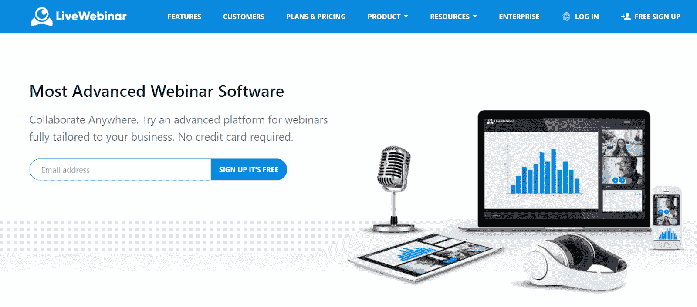

LiveWebinar

**优点**

*   有一个针对五个或更少与会者的免费计划
*   白板功能让网上研讨会主持人可以利用文档和视频。您也可以邀请与会者参加抽奖
*   提供调查、投票和实时聊天来吸引观众
*   网络研讨会可以在社交平台上播放，比如 YouTube、T2 和脸书

**缺点**

*   复杂的用户界面和陡峭的学习曲线

**定价**

*   最多五名参加者的有限免费计划
*   100 人的专业计划:14.99 美元/月
*   500 人的商业计划:119 美元/月
*   提供定制计划
*   14 天免费试用

### 10.蓝战士

与列表中的大多数软件不同，[蓝战士](https://www.bluejeans.com/products/events)可以举办一场虚拟活动，有多达 50，000 名与会者和 150 名主持人。大多数企业不需要这么贵的网上研讨会软件平台，但如果你要举办一个大型虚拟活动，这是一个不错的选择。

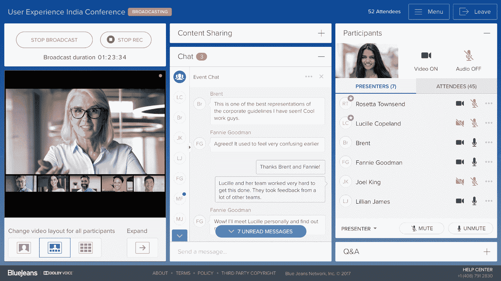

**优点**

*   可以举办比其他网上研讨会平台更大的活动
*   制作事件的云记录
*   将你的网上研讨会直播到脸书直播或 YouTube 直播

**缺点**

*   在 100-500 名与会者的范围内，有许多更便宜的选择

**定价**

*   100 名与会者:99 美元/月
*   200 名与会者:每月 379 美元
*   500 名与会者:599 美元/月
*   有 50，000 人参加的大型计划:定制定价

### 11.我自己的会议

[我自己的会议](https://myownconference.com/)是一个经济实惠的网上研讨会解决方案，拥有小型企业所需的所有功能。

我自己的大会

**优点**

*   免费计划允许多达 20 名与会者-比大多数免费版本更好
*   高清记录网络研讨会
*   有 16 种语言版本

**缺点**

*   在免费计划中最多只能录制 20 分钟
*   用户界面不是那么友好

**定价**

*   20 人参加的免费计划
*   60-10，000 人的专业计划:29-4，800 美元/月

### 12.点击会议

[ClickMeeting](https://clickmeeting.com/) 提供视频会议、在线会议和网络研讨会软件。

## 注册订阅时事通讯

### 想知道我们是怎么让流量增长超过 1000%的吗？

加入 20，000 多名获得我们每周时事通讯和内部消息的人的行列吧！

[Subscribe Now](#newsletter)

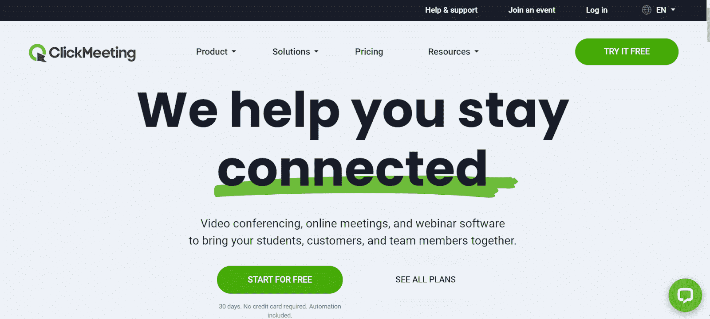

点击会议

**优点**

*   在 YouTube 或脸书直播在线研讨会
*   屏幕、视频和文件共享
*   通过实时聊天和问答环节吸引观众
*   无限网络研讨会登录页面

**缺点**

*   无法安排定期会议

**定价**

*   有 10-1，000 名与会者的现场网络研讨会计划:每月 30-309 美元
*   有 10-1，000 名与会者的自动化网络研讨会计划:每月 45-359 美元
*   多达 10，000 名与会者的企业计划:定制定价
*   30 天免费试用

### 13.大标记

如果你要举办一个有很多演讲者的大型在线活动，考虑一下 [BigMarker](https://www.bigmarker.com/) 。它允许无限的演示者和多达 10，000 名与会者。

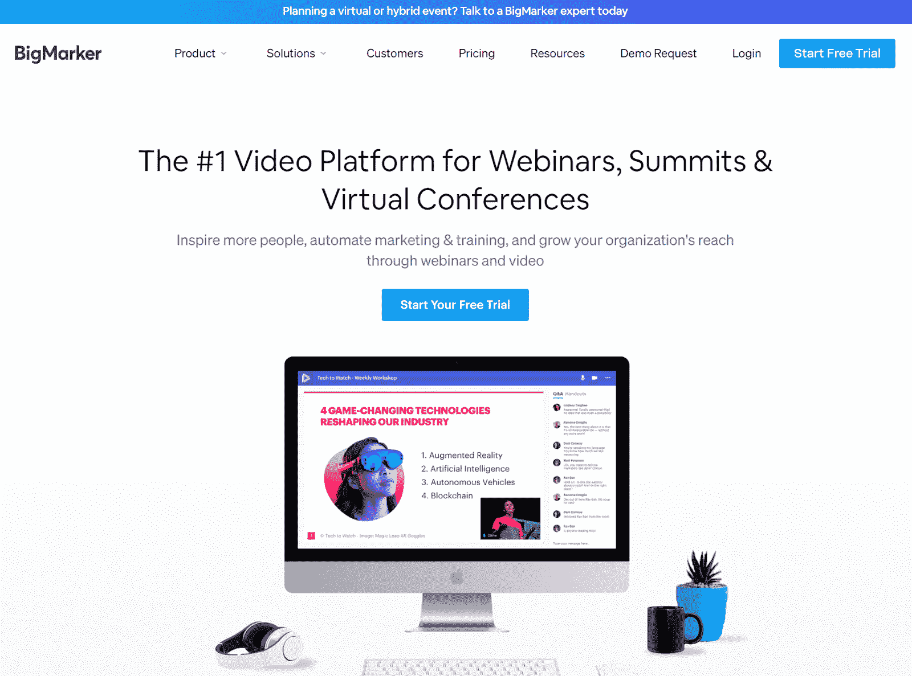

大标记

**优点:**

*   基于浏览器的软件不需要下载
*   互动功能包括销售线索表、投票、优惠和问答
*   向脸书或 YouTube 直播传输多个摄像机画面
*   超过 15 种不同的登录页面类型

**缺点:**

*   视频在慢速连接时可能会停止

**定价:**

*   100 人参加的起步计划:79 美元/月
*   500 人的精英计划:159 美元/月
*   1000 人参加的卓越计划:299 美元/月
*   有 10，000 名参与者的白标计划:定制定价

### 14.GetResponse

[GetResponse](https://www.getresponse.com/) 是一个集[电子邮件营销平台](https://kinsta.com/blog/email-marketing-software/)和网络研讨会工具于一体的平台。选择它，获得一流的营销工具套件和网上研讨会服务。

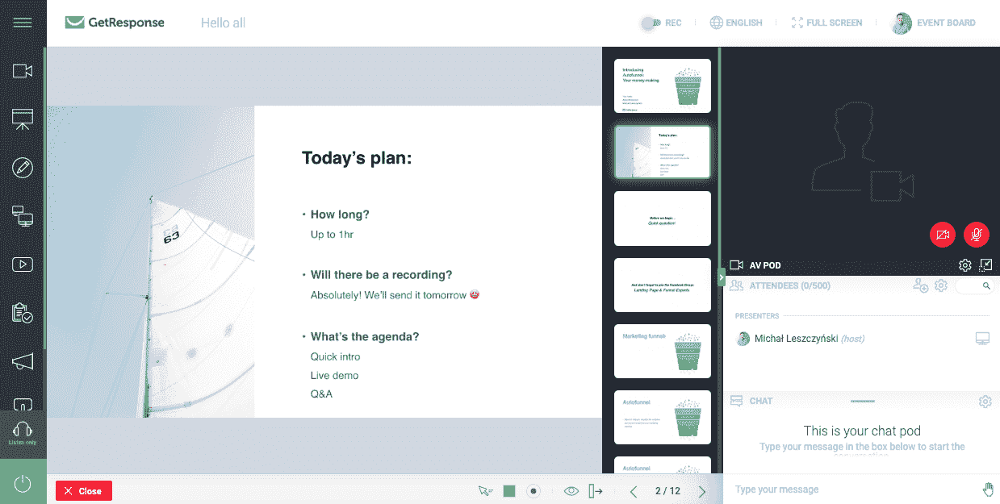

GetResponse

T4】

**优点**

*   由于主要是一个电子邮件平台，它有内置的电子邮件营销工具
*   您可以自定义网上研讨会页面的 URL
*   将访问者重新定位到您的网上研讨会页面
*   民意测验、调查和吸引观众的提议

**缺点**

*   安装并不是最顺利的

**定价**

*   基本 GetResponse 计划不包括网络研讨会
*   100 人参加的附加计划:49 美元/月
*   300 人的专业计划:99 美元/月
*   1000 人参加的专业计划:定制定价
*   30 天免费试用

### 15.Adobe Connect

[Adobe Connect](https://www.adobe.com/products/adobeconnect.html) 通过可定制的故事板布局提供视觉上吸引人的网上研讨会体验。

土坯连接

**优点**

*   使用名为 Pods 的功能窗口设计您的网上研讨会会议室，这些窗口具有可定制的名称、大小和位置
*   录制的网络研讨会是交互式的
*   与 Eloqua 和 Salesforce 等 CRM 软件集成

**缺点**

*   比大多数解决方案都贵

**定价**

*   100 名参与者:130 美元/月
*   500 名参与者:470 美元/月
*   1000 名参与者:580 美元/月

### 16.直播

Vimeo 的 Livestream 提供了一种举办大型活动的方式，提供无限的参与者和存储空间。事件被自动记录并存储在云中。

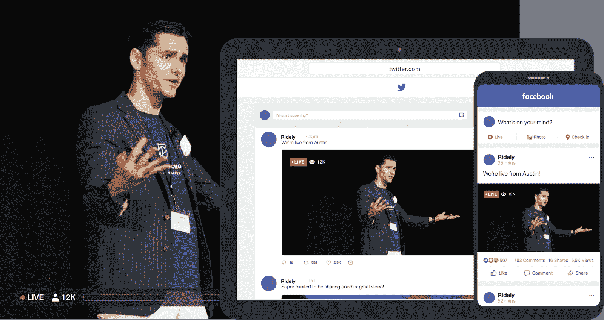

直播

**优点**

*   与 Livestream studio 配合使用，以输入多个提要、添加图形和主音频
*   事件可以私有化
*   与会者和录制的网上研讨会存储没有限制
*   注册页面是可定制的
*   它的按次付费网络研讨会功能让您可以将活动货币化

**缺点**

*   缺乏观众参与功能

**定价**

涡轮增压您的网站，享受我们的资深 WordPress 团队的 24/7 支持。我们的谷歌云驱动的基础设施侧重于可伸缩性、性能和安全性。[查看我们的计划](https://kinsta.com/plans/?in-article-cta)

*   Vimeo premium 以每月 75 美元的价格为无限的与会者提供直播
*   企业计划和 Vimeo OTT:定制定价

### 17.中介任何会议

AnyMeeting 是小型活动的可靠选择，以低廉的价格提供所有标准的网上研讨会功能。然而，它不太适合大型活动。

Intermedia any meeting

**优点**

*   内置问答环节、实时聊天、调查和投票
*   屏幕注释可以让你调出重要的点
*   与 Outlook、G-Suite、Slack、微软团队等的集成
*   用公司徽标和个性化背景打造您的网络研讨会品牌

**缺点**

*   顶层计划仅允许 200 名参与者

**定价**

*   四人自由计划
*   10 人参加的简易计划:每月 9.99 美元
*   100 人的专业计划:12.99 美元/月
*   200 人的企业计划:17.99 美元/月

### 18.Webex

Webex 是一款多功能软件，用于在线会议、虚拟活动、培训会议、交互式网络研讨会和团队协作。

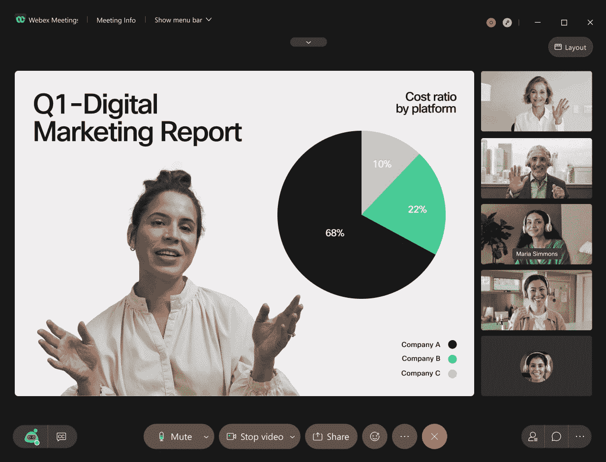

Webex

**优点**

*   为多达 100 名与会者提供免费计划
*   内置问答环节、调查和观众参与度投票
*   有一个移动应用程序

**缺点**

*   缺乏网上研讨会营销工具

**定价**

*   100 人参加的免费计划
*   200 人的会议计划:15 美元/月
*   200 人的会议+电话计划:每月 25 美元
*   企业:自定义定价

### 19.Dacast

[Dacast](https://www.dacast.com/) 是一个网上研讨会软件提供商，允许网上研讨会拥有无限的观众。一个重要的功能是 Dacast 付费墙，它可以帮助您将网络研讨会货币化。

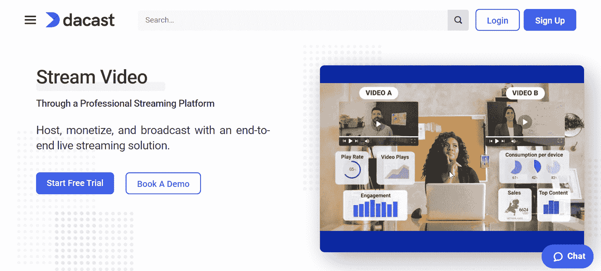

达克斯特

**优点**

*   价格组、促销代码和订阅等货币化功能
*   定制您的付费墙
*   没有观众限制
*   交互式视频点播

**缺点**

*   计划有带宽限制。如果你超过了，你必须支付每 GB 0.25 美元

**定价**

*   入门计划:每月 39 美元
*   活动计划:63 美元/月
*   规模计划:188 美元/月
*   提供定制计划

### 20.一款云视频会议软件

[缩放](https://zoom.us/)已经成为在线会议的代名词。您也可以使用 Zoom 主持网络研讨会。如果是 40 分钟以下，100 个参与者，那就是免费的，你会得到很多其他免费工具没有的推广工具和参与功能。

变焦

**优点**

*   互动功能，如屏幕共享、举手和实时聊天
*   培养人脉的营销工具
*   能够在云中备份会议
*   通过网上研讨会后发送的自动调查收集与会者反馈

**缺点**

*   免费会议有 40 分钟的限制

**定价**

*   包含 100 名参与者的 Zoom Meetings 免费计划(40 分钟限制)
*   100 人参加的 zoom Meetings Pro plan:14.99 美元/月
*   300 人的 Zoom Meetings 商业计划:19.99 美元/月
*   500 人参加的 Zoom 网络研讨会计划:79 美元/月
*   500 人参加的缩放活动计划:99 美元/月

### 21.Zoho 会议

[Zoho Meeting](https://www.zoho.com/meeting/) 是一款简单的基于浏览器的视频会议和网络研讨会工具，价格实惠。

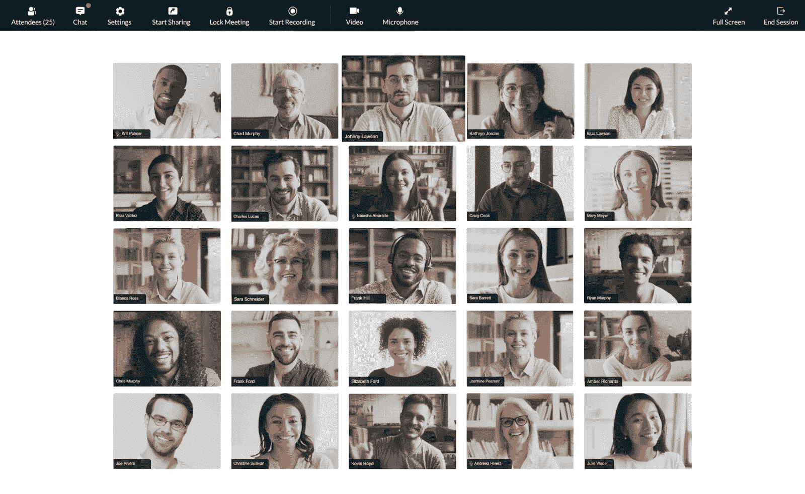

Zoho 会议

**优点**

*   方便用户的
*   可以在任何设备上使用

**缺点**

*   功能不丰富

**定价**

*   10-100 人的会议计划:每月 3-12 美元
*   有 25-1000 名与会者的网上研讨会计划:每月 19-200 美元

举办一场网上研讨会，你不需要支付高额费用。这个列表中接下来的两个提供商是完全免费的。

### 22.Google Meet

谷歌在 2020 年将其会议平台免费化。如果你有个人谷歌账户，你可以使用 [Google Meet](https://meet.google.com/) 参加 100 人的网络研讨会。某些类型的商业帐户最多可以有 250 名与会者。

谷歌

**优点**

*   自由的
*   使用谷歌语音识别技术的实时字幕
*   适用于任何设备

**缺点**

*   60 分钟的时间限制
*   没有付费网上研讨会服务那么多观众参与功能

**定价**

*   自由的

### 23.油管（国外视频网站）

举办网络研讨会最简单的方式之一是通过 [YouTube](http://youtube.com) 直播。它是免费的，简单的，并且你可以想要多少观众就有多少观众。你只需要[一个有直播功能的 YouTube 频道](https://kinsta.com/blog/how-to-create-a-youtube-channel/)。

YouTube

**优点**

*   对大多数人来说，这很容易，也很熟悉
*   无限观众
*   流媒体播放后，视频会保留在您的 YouTube 频道上

**缺点**

*   缺乏观众参与特征和品牌

**价格**

*   自由的

### 24.eWebinar

[eWebinar](https://ewebinar.com/) 是一个自动化的网络研讨会平台，100%致力于网络研讨会自动化，这意味着您可以尽可能多地举办网络研讨会，而无需现场主持。如果您已经在业务中使用现场网络研讨会，并希望有一种方法来扩展您的重复演示、入职和培训网络研讨会，那么 eWebinar 就是您的选择。

eWebinar

**优点**

*   聊天功能，让您即时回复或稍后通过电子邮件回复
*   许多互动让你的与会者参与到最后:问题、投票、测验、资源、链接、[反馈](https://kinsta.com/blog/wordpress-survey-plugins/)、联系表格等等
*   [分析](https://kinsta.com/blog/ga4/)您可以在平台外与您的团队和客户分享
*   完全基于浏览器，无需安装应用程序
*   注册和感谢页面生成器的品牌体验
*   您可以在自己的[登录页面](https://kinsta.com/blog/wordpress-landing-page-plugins/)和网站上安装注册小工具
*   流行的集成包括 Zapier、ActiveCampaign、BombBomb、 [Slack](https://kinsta.com/blog/how-to-use-slack/) 、Salesforce、Marketo、 [Mailchimp](https://kinsta.com/blog/how-to-use-mailchimp/) 、Twilio、ConvertKit 等等
*   为主持人和与会者清理用户界面/UX

**缺点**

*   没有直播网络研讨会功能(没有直播视频和音频)

**定价**

*   第一级:49 美元/月(0-1 次网络研讨会)
*   第二级:99 美元/月(2-5 场网络研讨会)
*   第三级:199 美元/月(6-15 场网络研讨会)
*   企业:250 美元/月(25 场网络研讨会)+每增加一场网络研讨会 10 美元/月

## 最好的免费网络研讨会平台是什么？

最适合您企业的免费网上研讨会提供商取决于您的需求和目标。

如果你已经有营销工具来帮助你产生和培养销售线索，你可能不需要很多网上研讨会的功能。像 YouTube 这样的免费流媒体工具就可以了。它可以让你免费举办一场吸引人的网上研讨会，观众人数不限。

但是，如果你想从头开始构建和呈现专业的网上研讨会体验，你会想要一个更强大的解决方案。如果你预计每场网上研讨会只有 10 名或更少的与会者，Livestorm 的免费计划是理想的。

## 总体而言，最好的网上研讨会平台是什么？

最佳的网上研讨会平台取决于你的目标、受众规模、预算和其他因素。

例如，如果您刚刚开始参加网络研讨会，并且只希望有少数与会者，那么像 Zoho Meeting 这样的会议解决方案就可以达到目的。

但是，假设您预计会有数十、数百甚至数千人定期出席(并且您希望重新利用这些内容来不断产生更多的潜在客户)。在这种情况下，像 Livestorm、Demio 或 GoToWebinar 这样的完整交钥匙解决方案是更好的选择。

[想在您的营销计划中加入网络研讨会吗？👩‍💻这些选项将帮助您找到适合您需求的平台🚀](https://twitter.com/intent/tweet?url=https%3A%2F%2Fkinsta.com%2Fblog%2Fbest-webinar-platforms%2F&via=kinsta&text=Want+to+add+webinars+to+your+marketing+plans%3F+%F0%9F%91%A9%E2%80%8D%F0%9F%92%BB+These+options+will+help+you+find+the+right+platform+for+your+needs+%F0%9F%9A%80&hashtags=Webinar%2CMarketingTips)

## 摘要

无论你是一个创业者还是一个客户遍布全球的大企业，网络研讨会都是你营销武库中的一个很好的工具。

希望这篇文章能帮助你找到最适合你公司的网上研讨会平台。

为了充分利用这一媒介，将网络研讨会融入到您更大的[营销战略](https://kinsta.com/learn/content-marketing/)中，并利用它们与您的潜在客户和现有客户建立更密切的关系。

* * *

让你所有的[应用程序](https://kinsta.com/application-hosting/)、[数据库](https://kinsta.com/database-hosting/)和 [WordPress 网站](https://kinsta.com/wordpress-hosting/)在线并在一个屋檐下。我们功能丰富的高性能云平台包括:

*   在 MyKinsta 仪表盘中轻松设置和管理
*   24/7 专家支持
*   最好的谷歌云平台硬件和网络，由 Kubernetes 提供最大的可扩展性
*   面向速度和安全性的企业级 Cloudflare 集成
*   全球受众覆盖全球多达 35 个数据中心和 275 多个 pop

在第一个月使用托管的[应用程序或托管](https://kinsta.com/application-hosting/)的[数据库，您可以享受 20 美元的优惠，亲自测试一下。探索我们的](https://kinsta.com/database-hosting/)[计划](https://kinsta.com/plans/)或[与销售人员交谈](https://kinsta.com/contact-us/)以找到最适合您的方式。