# 10 个最好的 WooCommerce 多供应商插件来启动你的电子商务商店

> 原文：<https://kinsta.com/blog/best-woocommerce-multi-vendor-plugins/>

像亚马逊、阿里巴巴和易贝这样的多供应商市场已经彻底改变了网上购物。因此，他们对创建类似的多供应商网站产生了兴趣，以迎合更广泛的客户群。

与其花数小时编写代码，不如建立一个 WooCommerce marketplace(网络商务市场)是最便捷的入门方式。WordPress 和 WooCommerce 可以免费使用并提供众多的 [WordPress 插件](https://kinsta.com/blog/woocommerce-plugins/)，包括过多的多厂商插件，为客户提供更多的选择。

你会很高兴知道有很多 WooCommerce 多厂商插件。然而，有了更多的选择，也会产生困惑。我们的目标是帮助遏制这种混乱。

在本文中，我们深入探讨了最熟练的 WooCommerce 多供应商插件，并讨论了它们的特性。

请记住，你的最终目标是增加商店的收入。所以一定要下载我们的免费电子书**， [10 种提高你的网络商务产品页面转化率的方法](https://kinsta.com/ebooks/wordpress/ecommerce-conversion-rate/?utm_source=Blog&utm_medium=Link&utm_campaign=WooCommerce+Conversions+Ebook)。**

 **我们开始吧！

### 查看我们的[视频指南](https://www.youtube.com/watch?v=1pos5CmFNCo)到用 WooCommerce 多供应商插件启动您的电子商务商店

## 什么是 WooCommerce 多厂商插件？

WooCommerce 简化了在线商店的运营。它可以让你顺利管理你的商店产品，付款，运输，税务管理等。更重要的是，有数百个 [WooCommerce 扩展](https://kinsta.com/blog/woocommerce-extensions/)来帮助你并增强你的在线商店。

术语“多卖方”指的是多个卖方。它涉及众多的供应商从一个网站或在线市场销售产品。

其核心是，一个集中的系统控制着相似市场中的所有购物和商业交易。如果市场在 WordPress 上运行，那么 WooCommerce 的多供应商插件将维护业务和所有交易。如果一个高效的 WooCommerce 多供应商插件与一个 [fast WooCommerce 主题](https://kinsta.com/blog/fastest-woocommerce-theme/)相匹配，将会对你的商店有所帮助。

WooCommerce 多供应商插件的主要目的是通过你的市场连接多个买家和卖家。同样，它把单独的交易留给供应商，并从每笔销售中为您产生佣金。

[想为你的 WooCommerce 商店找到合适的多厂商插件吗？😥不要再看了👇 点击推文](https://twitter.com/intent/tweet?url=https%3A%2F%2Fkinsta.com%2Fblog%2Fbest-woocommerce-multi-vendor-plugins%2F&via=kinsta&text=Trying+to+find+the+right+multi-vendor+plugin+for+your+WooCommerce+store%3F+%F0%9F%98%A5+Look+no+further+%F0%9F%91%87)

## WordPress 的 10 个最佳 WooCommerce 多供应商插件

几个 WooCommerce 多厂商插件已经在 [WordPress 市场](https://kinsta.com/wordpress-market-share/)成名。而且这些插件都是各方面突出，特色鲜明。

请注意，我们没有根据任何排名或类别列出这些插件。也就是说，我们只选择了市场上最可靠的 WooCommerce 多厂商插件。

现在轮到你从我们找到的 10 个最好的 WordPress woo commerce 多供应商插件中选择一个你需要的了。

### 1.多坎多供应商

Dokan Multivendor WooCommerce Plugin.

Dokan 多厂商插件是目前为止最流行的 WooCommerce 多厂商插件。它非常容易使用，包括许多功能，可以在不到一个小时的时间内创建一个像亚马逊、易贝或阿里巴巴这样的多供应商市场！

与任何其他 WooCommerce 多供应商插件不同，Dokan 为供应商提供了一个广泛的独一无二的前端。每个供应商都有一个仪表板，他们可以在那里精确地监控和维护他们的业务。

[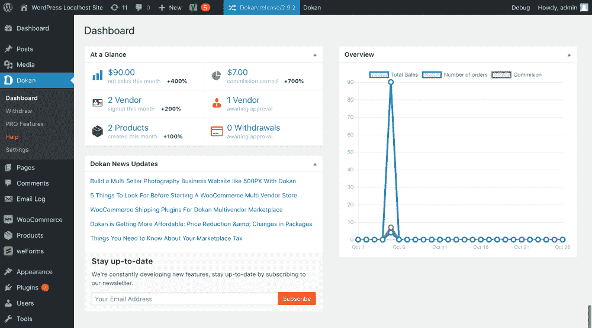](https://kinsta.com/wp-content/uploads/2021/06/Dokan-multivendor-frontend-dashbaord-.png)

Dokan Multivendor frontend dashboard.

Dokan 多供应商让您掌控市场中发生的一切。如果需要，您可以手动重新路由供应商注册、产品发布、订阅续订等。

[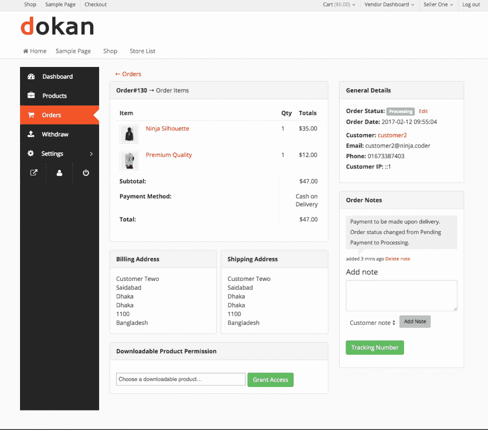](https://kinsta.com/wp-content/uploads/2021/06/Dokan-multivendor-Order-management.png)

Dokan WooCommerce multi-vendor plugin order management.

**Dokan 多厂商主要特性:**

*   该插件为每个供应商提供了一个独立的商店，有一个有吸引力的和可定制的店面。
*   供应商获得单独的仪表板来管理他们的产品，并从一个位置查看他们的销售情况。
*   一个全球佣金方案和不同供应商的特定佣金率允许管理员从每笔交易中获利。
*   使供应商能够通过在供应商仪表板上仔细查看他们的销售见解来保持他们的商店业绩。
*   管理员掌握着市场内发生的一切权力。
*   供应商可以管理和配置他们的商店以及他们的公共档案。
*   供应商可以单独管理他们商店的运输。
*   该插件与所有的 WooCommerce 主题(T1)配合使用都很顺畅。

**优点:**

*   无限供应商
*   供应商友好的前端
*   支持所有的 WooCommerce 主题
*   传统和数字市场
*   Ajax 实时搜索
*   [众多模块](https://wedevs.com/dokan/modules)实现可扩展性

**缺点:**

*   经常出错
*   不太方便的支持

### 2.WCFM 市场

WCFM Marketplace WooCommerce plugin.

WC Lovers 的 WCFM marketplace 是一个 WooCommerce 多厂商插件，它有很多特性，让你可以完全控制你的在线市场。它非常适合那些期待高度灵活性的人。

通过 WCFM，每个供应商都可以获得一个[供应商移动应用](https://docs.wclovers.com/wcfm-app/),可以对他们的产品、预订、查询、报告等进行深度监控和定制。例如，如果供应商需要更改产品的名称、价格、库存或图像，他们可以通过应用程序快速完成。

[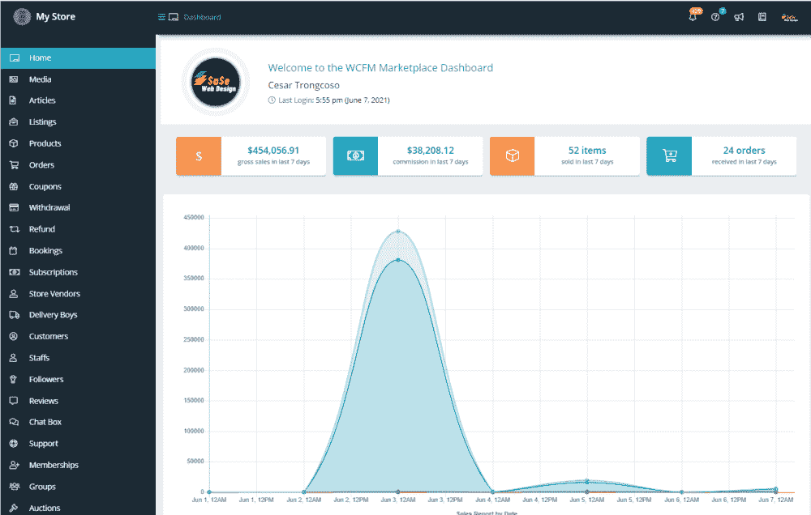](https://kinsta.com/wp-content/uploads/2021/06/WFCM-marketplace-admin-dashboard.png)

WCFM WooCommerce Marketplace admin dashboard.

供应商还可以监控他们的佣金、退款、提款、分类账、商店发票和发货跟踪。

[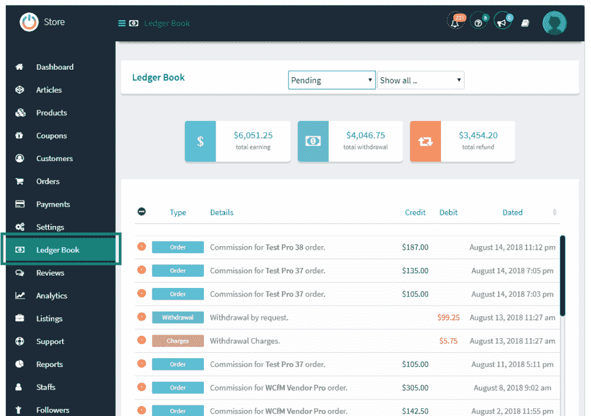](https://kinsta.com/wp-content/uploads/2021/06/WCFM-WooCommerce-Marketplace-Ledger-Book.png)

WCFM WooCommerce Marketplace Ledger Book.

**WCFM Marketplace 插件主要特性:**

*   您将获得一个出色的前端管理器，其中包含供应商的所有功能。
*   该插件为您提供了一个移动应用程序，供应商可以通过智能手机远程维护他们的商店。
*   供应商获得灵活的运输管理跟踪(按地区、国家、距离、重量计算运费)。
*   该插件提供了一个可定制的佣金系统(固定，百分比，供应商，产品，会员)。
*   您可以获得运输产品的实时运输状态更新。
*   佣金方案非常灵活，可以为不同的供应商设置全局百分比或特定比率。
*   你可以得到简单的退款、取款和反向取款系统。

**优点:**

*   支持的移动应用
*   支持票系统
*   实时聊天模块
*   供应商可以写博客
*   单一产品多供应商
*   卖家验证系统

**缺点:**

*   经常有人抱怨支持不力
*   高级附加组件

### 3.厕所市场

[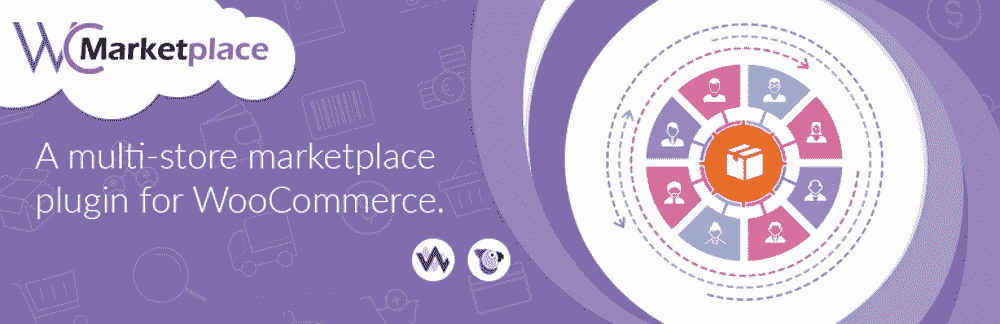](https://kinsta.com/wp-content/uploads/2021/06/WC-marketplace-wooCommerce-plugin.jpg)

WC Marketplace WooCommerce plugin.

WC Marketplace 是一个可靠的 WooCommerce 多厂商插件。它配备了一个轻松的设置程序，尤其是考虑到所提供的功能数量。

WC Marketplace 为管理员提供了方便的市场权限，包括视图、销售、销售报告和佣金部分。此外，还有各种佣金计划可供选择，为您提供更大的灵活性。

[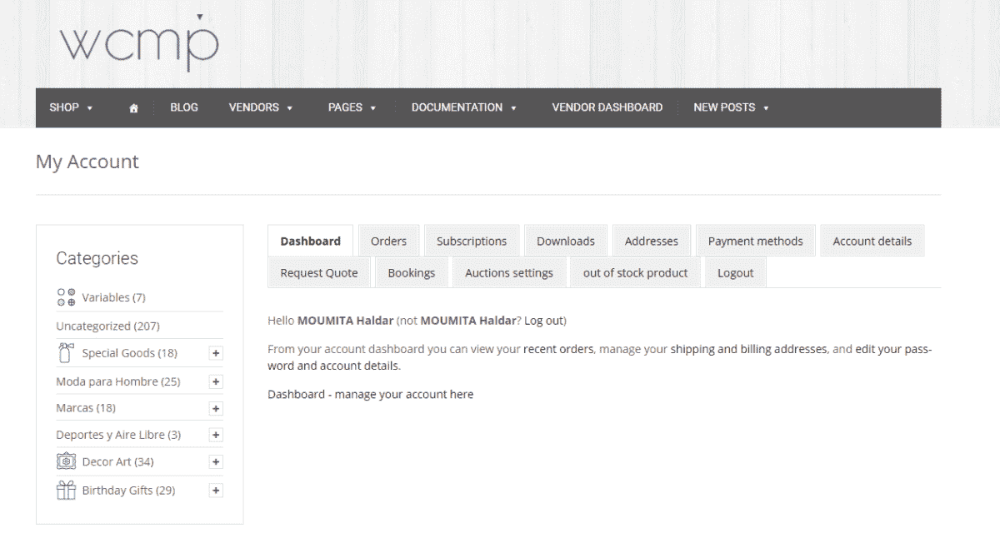](https://kinsta.com/wp-content/uploads/2021/06/WC-Marketplace-admin-frontend-dashboard.png)

WC Marketplace admin frontend dashboard.

它配备了一个非常专用和个性化的仪表板，供您的供应商管理他们的客户订单、查询、结帐、模板和请求。

[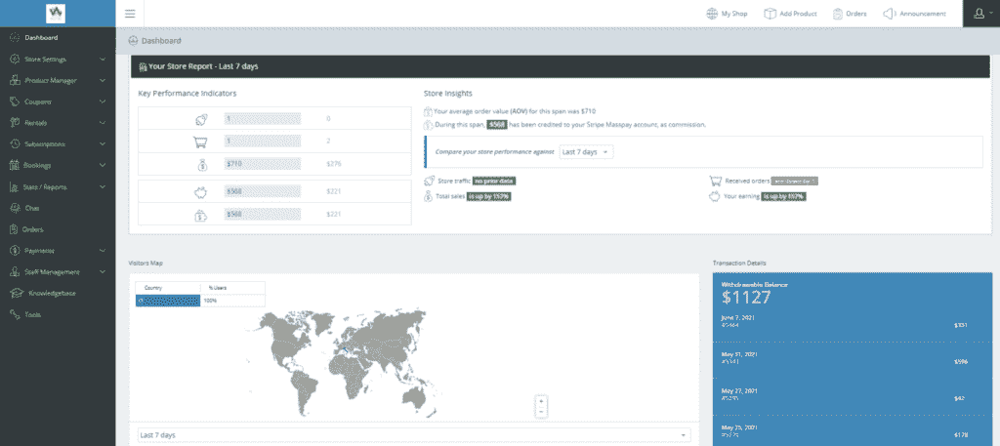](https://kinsta.com/wp-content/uploads/2021/06/WC-Marketplace-Vendor-Dashboard.png)

WC Marketplace Vendor Dashboard.

这个插件的其他值得注意的功能包括方便的供应商跟踪，合并订单和退款管理等。最后，它通过提供多种支付处理选项，允许游客以他们想要的方式付款。

**WC Marketplace 主要特性:**

*   供应商获得了一个用户友好的个性化仪表板来运营他们的业务。
*   该插件提供了一个简单的供应商注册过程。
*   该插件提供了一个全球佣金系统。也可针对特定供应商进行调整。
*   它允许“单一产品多供应商”功能。
*   您可以获得销售报告的详细分析，并利用它们来改善市场。
*   这些插件提供了一个可调整的运费率(基于重量、国家或产品类别)以及一个运输跟踪系统。
*   它提供产品管理工具，帮助供应商列出他们的产品细节或进出口信息。
*   该插件提供了一个内置的订单管理器。

**优点:**

*   通用信息系统
*   产品评审管理
*   佣金、优惠券、报告、付款等的不同仪表板。
*   支持多种支付方式

**缺点:**

*   基本前端仪表板
*   缺少可信卖家标签
*   有点问题

### 4.厕所供应商市场

WC Vendors Marketplace WooCommerce plugin.

WooCommerce 多厂商插件 [WC Vendors Marketplace](https://www.wcvendors.com/) 致力于通过提供众多功能来扩展你的市场。WC 厂商入门对其流畅的配置选项非常放心。

[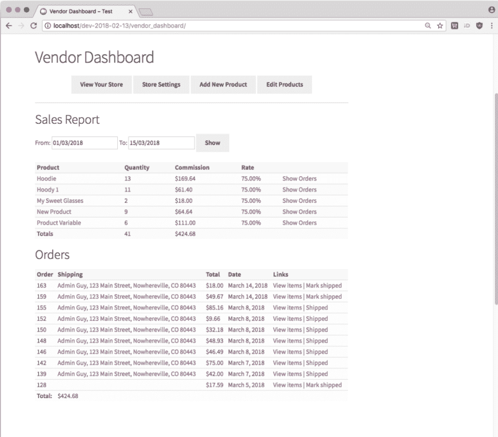](https://kinsta.com/wp-content/uploads/2021/06/WC-Vendor-Marketplace-vendor-dashboard.png)

WC Vendors Marketplace vendor dashboard.

这个插件在可用性方面处于一个独特的位置——它为您提供了对整个市场和供应商店面的集中管理，提供了一个全面的前端仪表板。这意味着你可以专注于网上市场的营销和销售增长。

有了 WC 供应商，商家可以享受一个没有限制的市场，销售各种产品，包括实体、数字、订阅、预订，甚至拍卖。您还可以向您的供应商销售会员计划，为他们销售的产品设置参数和限制。

[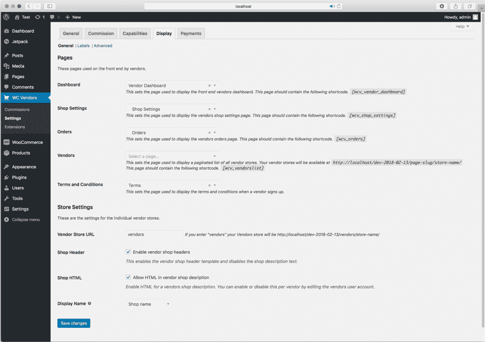](https://kinsta.com/wp-content/uploads/2021/06/WC-Vendors-marketplace-admin-settings-panel.png)

WC Vendors Marketplace admin settings panel.

**厕所供应商市场的主要特点:**

*   为供应商提供单独的前端仪表板，以管理他们的产品、销售、运输等。
*   你可以控制你的市场和其中的一切，包括产品和供应商。但是，您可以让供应商定制他们的店面。
*   各种产品(实物、数字、订阅、可变和拍卖)。
*   多佣金系统(百分比、费用、固定、按供应商/产品销售)。
*   该插件提供实时支持功能，帮助顾客购物。
*   供应商自己可以为多种产品创建不同的折扣券并进行管理。
*   一个全面的运输系统允许供应商进行他们的运输和设置运输费率(表费率，统一费率)。

**优点:**

*   可定制的店面模板
*   供应商休假模式
*   面向供应商的完整前端仪表板访问
*   供应商商店 [SEO](https://kinsta.com/blog/what-does-seo-stand-for/)
*   多个支付网关

**缺点:**

*   基本供应商仪表板
*   缺少卖方声明
*   有点问题

### 5.YITH WooCommerce 多供应商/市场

YITH WooCommerce plugin.

YITH WooCommerce 多厂商插件是近期最著名的 WooCommerce 多厂商插件之一。

有了 YITH marketplace，你可以从在你的网站上发布产品的用户的销售中获得被动收入。YITH 多供应商插件允许您选择多个管理员，创建产品目录，并安排特定的营销活动。

[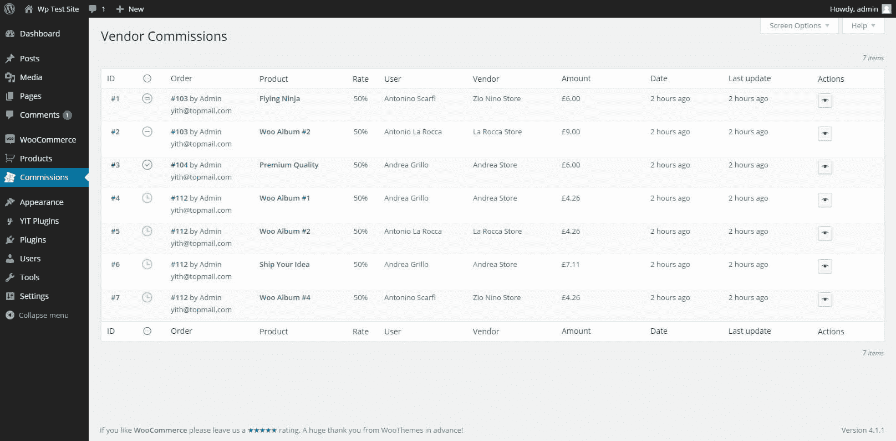](https://kinsta.com/wp-content/uploads/2021/06/YITH-WooCommerce-Vendor-Commissions-panel.jpg)

YITH WooCommerce Vendor Commissions panel.

此外，您可以创建一个具有全球佣金率的主要多供应商商店，拥有超级管理员控制，并为您的销售和佣金生成自动报告。值得注意的是，超级管理员功能允许您管理供应商的帐户和销售。

在使用 YITH WooCommerce 多供应商插件时，您还可以利用许多附加功能，如个人佣金率、高级报告管理、订单管理、退款和大量类似的功能。

[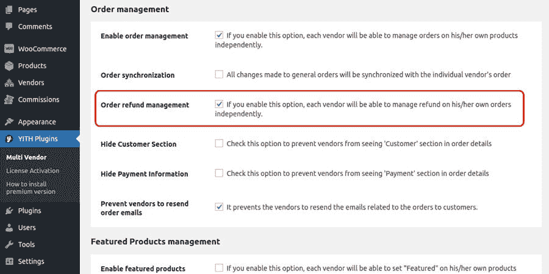](https://kinsta.com/wp-content/uploads/2021/06/YITH-WooCommerce-Multi-Vendor-refund-management.jpg)

YITH WooCommerce Multi-Vendor refund management.

**YITH WooCommerce 多供应商主要特性:**

*   一份详细的销售和佣金报告，对市场有一个全面的了解。
*   该插件允许商店的每个供应商使用单独的订单管理系统。
*   超级管理员可以集中启用或禁用每个供应商的销售。
*   市场管理员可以设置最低佣金阈值，以防止支付低于限额。
*   供应商可以创建优惠券，在市场内管理他们的产品。
*   供应商也可以使用退款管理系统。
*   网站管理员可以使用用户切换选项访问供应商的配置文件，并为单个供应商添加产品。
*   没有管理员的批准，供应商可以创建产品目录，跟踪订单，收入和产品评论。
*   供应商可以使用高级运输模块创建运输区域，计算成本，包括额外费用，以及退款和运输政策。

**优点:**

*   专门[销售数码产品](https://kinsta.com/blog/ecommerce-strategies/)
*   管理员拥有对所有供应商及其产品、销售等的集中控制。
*   允许卖家验证
*   一个非常强大和先进的佣金系统具有优越的能力
*   WPML 兼容

**缺点:**

*   供应商没有前端仪表板
*   从单一产品多卖方选项中检索

### 6.WooCommerce 产品供应商

WooCommerce Product Vendors plugin.

制作 WooCommerce 的大脑还额外构建了 [WooCommerce 产品供应商](https://woocommerce.com/products/product-vendors/) marketplace 插件。这是一个稳定的插件，可以方便地作为你的 WooCommerce 商店的启动程序。

WooCommerce 产品供应商允许您从供应商的销售中赚取佣金，为不同的供应商设置特定的佣金率，为每个供应商提供对其个人资料的控制，以及几个方便的产品和订单管理功能。

## 注册订阅时事通讯

### 想知道我们是怎么让流量增长超过 1000%的吗？

加入 20，000 多名获得我们每周时事通讯和内部消息的人的行列吧！

[Subscribe Now](#newsletter)

[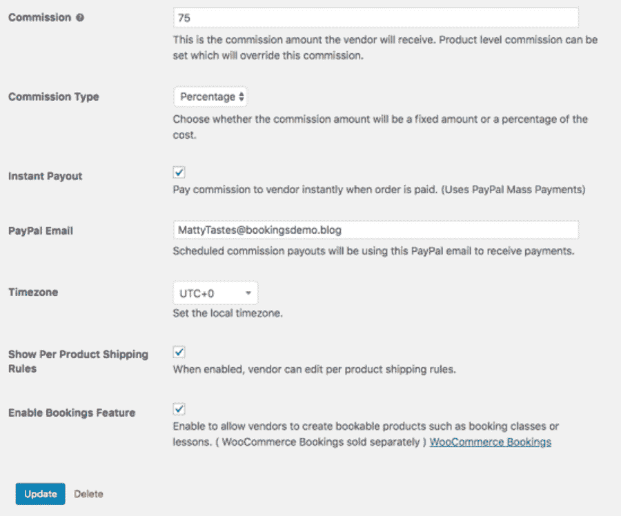](https://kinsta.com/wp-content/uploads/2021/06/Product-Vendors-settings-panel.png)

Product Vendors settings panel.

使用该插件，供应商可以控制和定制他们的公共档案，查看销售报告和订单状态，等等。市场所有者可以创建和编辑供应商，为供应商设置佣金率，并显示供应商的评级。

此外，像其他 WooCommerce 多供应商插件一样，它提供了一些方便的功能来帮助你发展你的 WooCommerce 商店。与文章中的其他条目相比，这个插件提供的特性数量有限。

[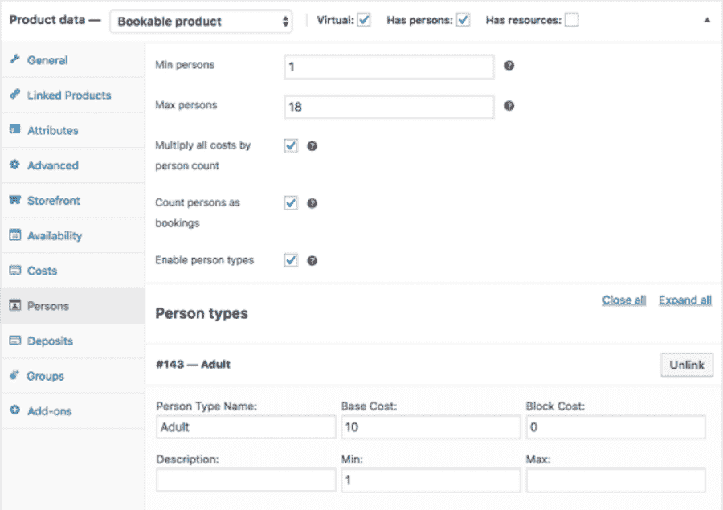](https://kinsta.com/wp-content/uploads/2021/06/WooCommerce-Product-Vendors-booking-management.png)

WooCommerce Product Vendors booking management.

**WooCommerce 产品供应商主要特性:**

*   您可以为不同的供应商启用或设置特定的佣金和支出率。
*   您可以选择添加供应商以及您的产品。
*   该插件可以与 [WooCommerce Bookings](https://woocommerce.com/products/woocommerce-bookings/) 插件集成，为供应商提供基于时间的预订功能。
*   供应商可以自己管理他们的产品和运输规则。
*   当特定供应商向市场添加产品时，您可以选择对他们进行批准。
*   该插件允许您根据业务情况立即、手动、每两周或每月向供应商付款。
*   您可以授权供应商作为管理员或经理来协助您监督销售、税单等。

**优点:**

*   一个理想的 WooCommerce 多供应商市场插件，用于实物和数字商品的交易
*   市场所有者拥有整个市场的控制权
*   多供应商管理系统
*   每个供应商都有一个公共配置文件
*   自动和手动取款功能。

**缺点:**

*   没有前端仪表板
*   比竞争对手少得多的功能
*   缺乏订单管理

### 7.VendorPro

[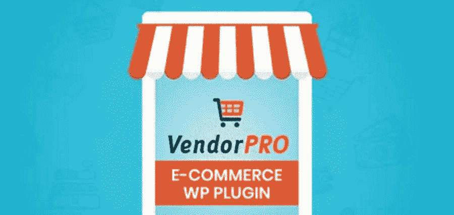](https://kinsta.com/wp-content/uploads/2021/06/VendorPro-WooCommerce-multi-vendor-plugin.png)

VendorPro – Multi-Vendor Ecommerce WP plugin.

VendorPro 是一个多厂商的 WooCommerce WordPress 插件，专为那些将[代销商](https://kinsta.com/affiliate-academy/what-is-affiliate-marketing/)视为主要兴趣的用户打造。这个插件极大地增强了你与众多联盟卖家的业务进展。

邀请几个联盟卖家，允许他们在你的商店建立业务，并从他们的销售中产生佣金是 VendorPro 的多供应商电子商务 WordPress 插件的主要功能。

安装后，你会发现一个特殊的功能，可以手动设置或预定义产品的基本佣金。该插件对供应商获得的佣金进行详细分析，包括任何未支付的费用。此外，它可以维护和分配佣金，而不会让你担心，让你专注于重要的事情，比以前更快地发展你的代销商业务。

**VendorPro 主要特性:**

*   该插件允许您手动设置供应商佣金率，为特定的供应商选择不同的佣金率。
*   VendorPro 是专为数码产品打造的。
*   该插件对于代销商邀请供应商和管理插件内的代销商营销非常有效。
*   供应商对他们的产品配置文件有特定的编辑控制，例如编辑或删除已发布的产品、显示/隐藏产品、启用订单管理。
*   供应商可以为更好的 SEO 和有机搜索创建关于他们产品的博客，并发布它们。
*   卖家可以控制在在线商店的单个产品页面上显示/隐藏他们的卖家信息。

**优点:**

*   专门按照数码产品的样式制作
*   联盟营销-友好
*   内置的 [Paypal 网关处理器](https://kinsta.com/blog/stripe-vs-paypal/)可以实现平稳安全的支付流程
*   [短代码](https://kinsta.com/blog/wordpress-shortcodes/)支持申请表格和销售日志

**缺点:**

*   对普遍使用没有好处(侧重于关联业务)
*   它缺少供应商仪表板
*   专为数码产品打造
*   功能不丰富，提供的功能很少

### 8.Webkul WooCommerce 多供应商市场插件

[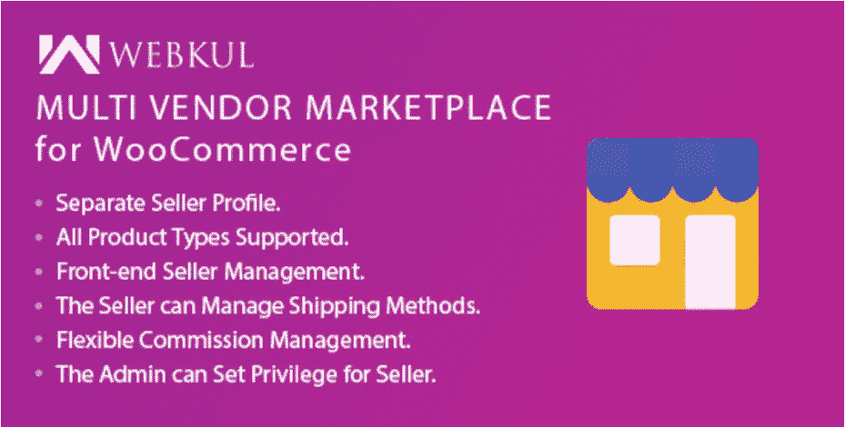](https://kinsta.com/wp-content/uploads/2021/06/webkul-woocommerce-mult-ivendor-plugin.png)

Webkul Multi Vendor Marketplace plugin.

Webkul WooCommerce 多厂商插件是最近推出的最出色的 WooCommerce 多厂商插件之一。它具备将你的[网上商店](https://kinsta.com/blog/woocommerce-tutorial/)立即转变为成熟的多供应商市场的明确资质和特征。

最重要的是，Webkul 还提供了一个多供应商移动应用程序，允许您随时随地完全远程地管理您的市场。此外，该应用程序可以在 Android 和 iOS 智能手机和平板电脑上运行。

[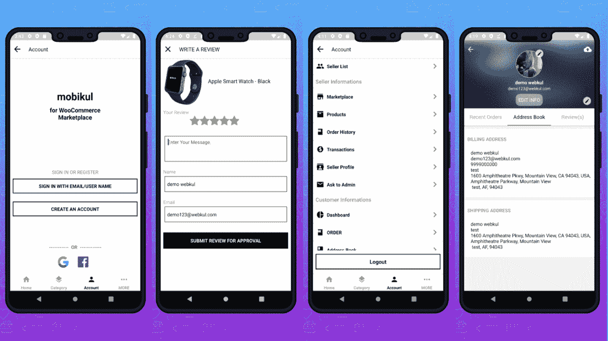](https://kinsta.com/wp-content/uploads/2021/06/Webkul-WooCommerce-Multi-Vendor-Mobile-App.png)

Webkul WooCommerce Multi Vendor mobile app.

此外，该插件提供单独的供应商资料和供应商面板，以添加和营销他们的产品。此外，供应商可以管理他们的卖家资料，并通过他们的仪表板在产品列表中添加、编辑或删除产品。

作为管理员，插件使你能够拥有一个集中的命令和控制，以覆盖整个市场。您可以精确地批准或管理产品，为不同的卖家设置前所未有的佣金率，并控制产品自动发布/自动批准设置。

[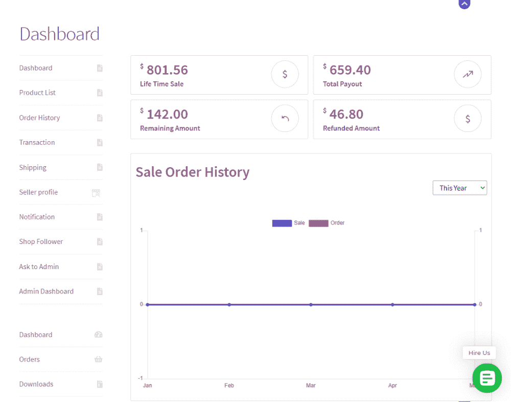](https://kinsta.com/wp-content/uploads/2021/06/webkul-woocommerce-marketplace-dashboard.png)

Webkul WooCommerce Multi Vendor vendor dashboard.

此外，供应商可以访问其所有交易和销售的详细报告，查看其订单历史记录，管理其登录凭据，并从其供应商仪表板直接与您(管理员)交流。

**Webkul WooCommerce 多厂商市场主要特点:**

需要为您的新电子商务网站提供最先进、快速、安全的托管服务吗？Kinsta 提供超快的服务器和来自 WooCommerce 专家的 24/7 世界级支持。[查看我们的计划](https://kinsta.com/plans/?in-article-cta)

*   该插件支持来自 WooCommerce 插件的各种可交易的实物或数字产品。
*   用户可以提供关于供应商提供的产品质量和服务的评级和评论。准确地说，有更好推荐的卖家会带来更好的销售。
*   使用市场卖家中心选项，管理员可以方便用户将自己登记为卖家。
*   管理员可以设置一个全球佣金率提供每个供应商相同的百分比或设置不同的佣金率为不同的供应商考虑他们的销售率。
*   管理员获得新卖家制裁的自动批准选项，也可以批准/不批准任何卖家的任何产品，以阻止产品重复。
*   管理员和供应商都可以监督订单管理功能并生成销售发票。
*   在一条直线上，管理员可以从管理面板直接使现有用户成为供应商，而无需用户提出任何供应商注册请求。
*   供应商可以从他们的仪表板管理他们的运输，包括设置新的运输区域和为这些区域添加运输方法。

**优点:**

*   用于远程管理的移动应用
*   合理分配管理员和供应商的责任
*   允许卖家管理他们的订单和运输
*   搜索引擎优化友好的网址结构，以改善搜索引擎优化的结果
*   用户/客户的“最喜欢的卖家”选项
*   管理员可以将任何产品分配给任何卖家

**缺点:**

*   基本前端仪表板

### 9.市场

[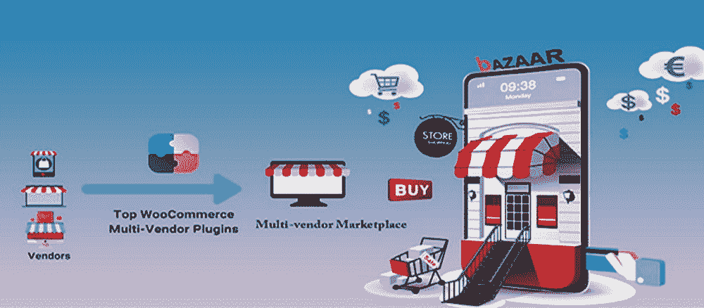](https://kinsta.com/wp-content/uploads/2021/06/bazaar-woocommerce-multivendor-plugin.jpg)

bAZAAR WooCommerce multi-vendor plugin.

bAZAAR WooCommerce 多供应商市场插件为 WooCommerce 多供应商世界带来了一些优秀的标志。尽管更新了，这个插件提供了一些很棒的特性，会让任何人都喜欢上它。

这些插件提供了一个单独的仪表板，每个供应商都有一个有吸引力的用户界面，并且可以完全定制他们的仪表板及其功能。供应商可以直接从他们的仪表板创建、编辑或管理不同类型的产品。

[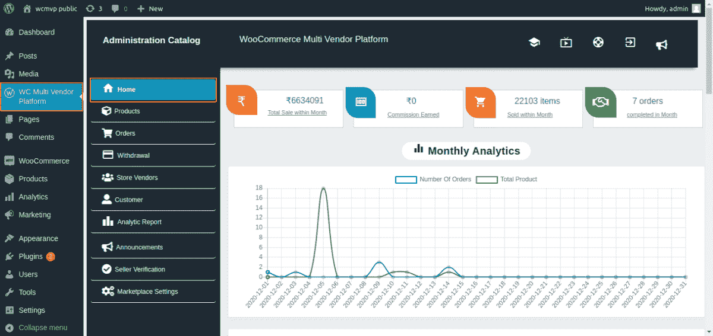](https://kinsta.com/wp-content/uploads/2021/06/bAZAAR-WooCommerce-Multi-Vendor-plugin-admin-dashboard.png)

bAZAAR admin dashboard.

就像其他标准的 WooCommerce 多供应商插件一样，bAZAAR 也允许你根据供应商在销售中的贡献给他们适当地分配佣金——除此之外，它还拥有一个灵活的收入提取系统。

[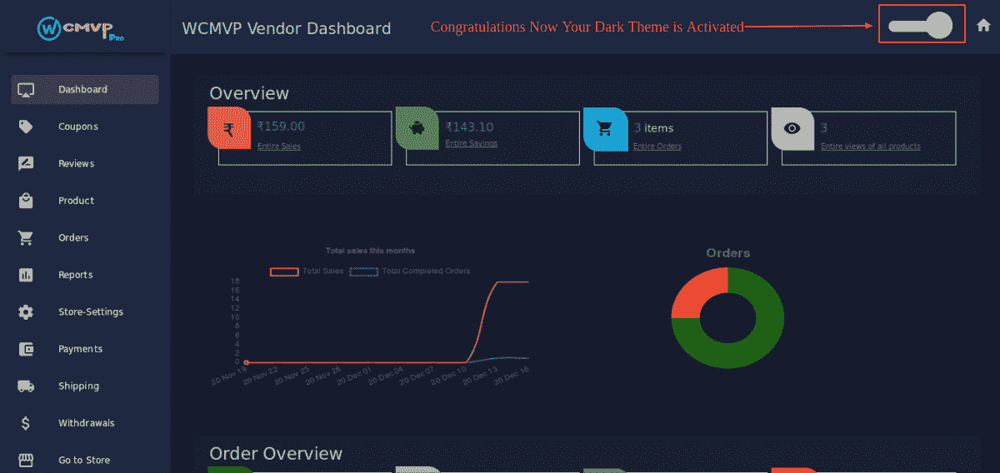](https://kinsta.com/wp-content/uploads/2021/06/bAZAAR-WooCommerce-Multi-Vendor-plugin-vendor-dashboard-in-dark-mode.png)

bAZAAR vendor dashboard in dark mode.

此外，供应商可以享受不间断的销售，而无需经过管理员的批准，管理员和供应商都可以访问订单的综合分析。此外，管理员可以创建一个公告，在销售结束时显示给供应商。

**bAZAAR 多供应商市场的主要特点:**

*   该插件为每个供应商提供了一个有吸引力的前端仪表板，用于管理他们的产品、销售、运输以及他们在市场中的业务所需的一切。
*   为主要结果提供预定义的产品类别，管理员可以在需要时生成新的产品类别。
*   供应商和用户可以使用他们的社交账户登录商店。
*   管理员可以使供应商存储更新和定期管理，创建一个特殊的部分称为供应商管理界面。
*   该插件为管理员和供应商提供了关于销售、产品、订单、佣金、收益等的图形和分析报告。
*   供应商可以监控他们的收入，并通过点对点的跟踪系统提取收入。
*   单一产品多供应商选项可供供应商仅销售一种产品。
*   管理员可以为不同的供应商、产品或类别引入特殊佣金，以保持销售的稳定性。
*   用户可以在同一订单中向不同的卖家订购。因此，没有必要为不同的供应商使用单独的购物车。

**优点:**

*   集中控制，管理员可以管理任何东西(产品、设置、分析)
*   用于所有统计和分析的 CSV 导出工具
*   使用 Ajax 的高级搜索、过滤和排序选项
*   只需轻轻一点，即可切换明暗主题
*   通过电子邮件通知每个订单
*   管理员的供应商管理界面

**缺点:**

*   新进入市场；需要时间来发展并在竞争中证明自己
*   没有用户评价

### 10.梅尔卡多专业版

Mercado Pro plugin.

Mercado Pro 是你应该考虑的另一个有影响力的 WooCommerce 多厂商插件。该插件是新的，但具有一些突出的功能，如整个市场的集中管理权限和每个供应商实时搜索、过滤或分类其产品的单独仪表板。

[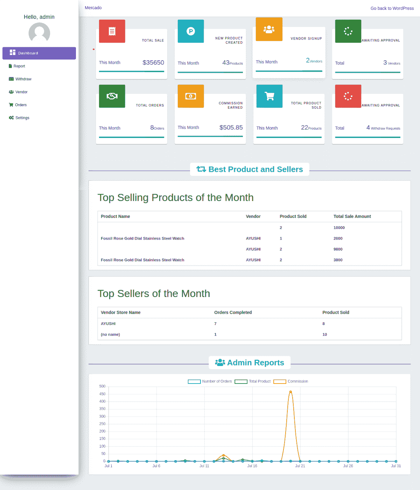](https://kinsta.com/wp-content/uploads/2021/06/mercado-pro-woocommerce-multi-vendor-admin-dashbaord.png)

Mercado Pro plugin admin dashboard

使用 Mercado Pro，您可以获得一些强大的功能，用于为供应商设置特定的佣金率，观察供应商的表现，在管理面板中查看所有订单细节，社交登录等等。事实上，这些功能可以帮助你熟练地管理你的 WooCommerce 多供应商商店，并加快你的业务。

[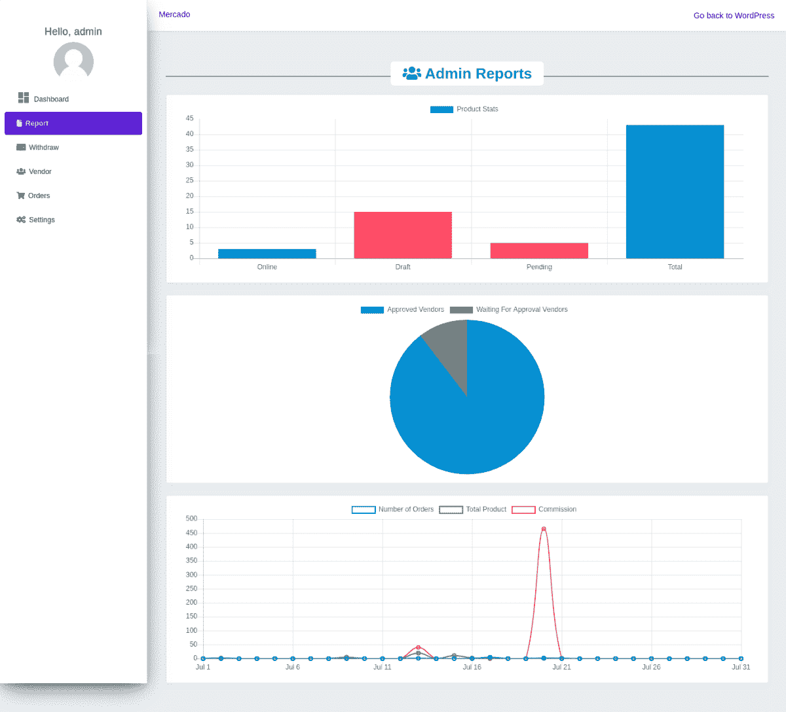](https://kinsta.com/wp-content/uploads/2021/06/Mercado-pro-woocommerce-multi-vendor-plugin-admin-sales-report.png)

Mercado Pro plugin admin sales reports.

WooCommerce 多厂商插件还提供了一个内部聊天机会，管理员可以直接与所有厂商交流，而不用使用额外的交流平台。此外，供应商可以利用所有 WooCommerce 支持的支付网关。

**Mercado Pro 主要特性:**

*   该插件提供了一个强大的集中管理面板，有权控制和管理任何事情。
*   管理员和供应商都可以获得关于销售、收益和市场增长的强大统计分析，以进行分析并采取果断措施来适当发展市场。
*   所有的供应商都获得了他们的仪表板，其中有对其产品进行实时跟踪的机会。
*   管理员可以设置全球佣金率和具体的佣金率不同的供应商考虑他们的产品和销售。
*   这些插件允许供应商从他们的仪表板上创建不同的产品。
*   每个供应商在市场中都有一个单独的商店。此外，供应商可以按照类型对他们商店中的产品进行分类。
*   用户可以使用主要的社交平台登录市场，包括他们的电子邮件。
*   一个供应商不能访问另一个供应商的文件。
*   管理员可以为所有供应商或特定供应商创建公告。管理员和供应商都可以访问前面的语句。
*   供应商可以创造优惠券和折扣前景[来增加他们的销售额](https://kinsta.com/blog/ecommerce-strategies/)。

**优点:**

*   没有任何重新加载问题的实时前端仪表板
*   WPML 一体化
*   管理员/供应商实时聊天
*   强大的隐私和智能管理员管理机制
*   供应商发票和收据系统
*   实时销售报告和报表
*   Ajax 搜索功能加快了查询速度

**缺点:**

*   市场中的新产品—需要更多时间来确定其长期生存能力
*   人工退款系统

## 顶级 WooCommerce 多供应商插件的主要特性

我们刚刚介绍了 10 个当今最优秀的 WooCommerce 多厂商插件。这些插件中的每一个都配备了强大的功能来帮助你完成你的市场所需要的一切。

经过大量的研究，我们总结了 WooCommerce 多供应商的基本特性和提供这些特性的插件:

| **名称\特征** | **前端仪表板** | **订单经理** | **Shipping****设置** | **Commission****设置** | **Sale****报告** | **Remote****经理** | **自动退款** |
| **码头** |  |  |  |  |  | **☓** |  |
| **WCFM** |  |  |  |  |  |  |  |
| **厕所市场** |  |  |  |  |  | **☓** |  |
| **厕所供应商** |  |  |  |  |  | **☓** | **☓** |
| 第一个 | **☓** |  | ✔️ |  |  | **☓** |  |
| **产品供应商** | **☓** |  |  |  |  | **☓** | **☓** |
| **VendorPro** | **☓** |  | **☓** |  |  | **☓** | **☓** |
| **网页球** |  |  |  |  |  |  |  |
| **集市** |  |  |  |  |  | **☓** | **☓** |
| **市场专业版** |  |  |  |  |  | **☓** | **☓** |

## 你应该使用哪个 WooCommerce 多厂商插件？

回答这个问题可能非常棘手！这是因为每个用户对他们的[电子商务](https://kinsta.com/blog/wordpress-ecommerce-plugins/)市场都有自己独特的兴趣和偏好；你也是。每一个插件都有其独特的特性，当你想让你的市场变得富有成效的时候，要考虑这些特性。每一种都有其局限性。

对你来说最好的插件是 WooCommerce 多供应商插件，它提供了你一直在寻找的相关特性和功能。

让我们最后看一下在选择 WooCommerce 多供应商插件时需要检查的基本要素——它们的特性、可用性、用户界面和价格是我们主要关心的。

**特征数量比较**

每当谈到提供的功能数量时，一些插件如 Dokan、WCFM Marketplace、YITH Multi-Vendor、bAZAAR、Webkul、Mercado 给人的第一印象就是列表。这些插件为你提供了比市场上其他插件更多的功能。因此，如果你正在寻找许多功能，这些插件之一可以是你的选择。

然而，所有这 10 个插件都有非常吸引人和健壮的特性。然而，他们提供或多或少，这完全是你的要求，让你选择合适的。

**可用性对比**

当你在短时间内执行许多任务时，插件的可用性会影响你。所以，一个特性复杂的插件很可能会耗费你宝贵的时间。

如果你寻找更好的可用性和灵活性，第一反应是 WC 厂商市场，YITH WooCommerce 多厂商，Dokan 多厂商，Webkul 多厂商插件。这些插件可以非常灵活地使用，并通过 WooCommerce 促进您的[电子商务业务。](https://kinsta.com/learn/woocommerce-guide/)

**UI 对比**

> 设计不仅仅是它看起来和摸起来的样子。设计就是它的工作方式。
> 
> —史蒂夫·乔布斯

如果你的用户界面不能显示你的市场周围的一切，你需要在里面探索，这会花费你宝贵的时间。同样，如果你不喜欢界面，整天盯着它无疑会降低你的工作热情。因此，一个全面的用户界面对于[工作效率和性能](https://kinsta.com/the-4-week-guide-to-improving-efficiency-and-increasing-client-revenue/)都是至关重要的。

在列表中，bAZAAR 多供应商、Dokan 多供应商、WFCM 多供应商、YITH WooCommerce 拥有可定制的前端仪表板，具有最具吸引力的用户界面[来管理您的 WooCommerce 市场](https://kinsta.com/blog/woocommerce-crm/)。值得注意的是，其他条目的 UI 相比之下也很棒。提到的插件只是更关注用户界面，比其他插件更好。

**远程管理**

随时随地远程管理你的 WooCommerce 多供应商市场是这个领域的一次革命。到目前为止，WCFM 多厂商和 Webkul WooCommerce 多厂商插件已经引入了远程管理智能手机应用。因此，如果你更喜欢远程管理你的市场，这些是你应该购买的插件，以便进行可靠的管理并促进你的 WooCommerce 业务。

**价格对比**

这些 WooCommerce 多厂商插件有不同的软件包和不同的价格。费用因网站许可证的数量和计费周期而异。

看看这份价格表，找出最适合你的安排:

| **插件** | **起始年份** | **寿命** | **网站许可证** | **免费版** |
| **码头** | **$112** | **$484** | **1** | **是** |
| **WCFM** | **$49** | **$484** | **2** | **是** |
| **厕所市场** | **–** | **$494** | **1** | **是** |
| **厕所供应商** | **$199** | **$599** | **1** | **是** |
| 第一个 | 9999 欧元 | **–** | **1** | **是** |
| **产品供应商** | **$79** | **–** | **1** | **否** |
| **VendorPro** | **–** | **$97** | **1** | **否** |
| **网页球** |  | **$99** | **1** | **否** |
| **集市** | **$19** | **$39** | **1** | **是** |
| **市场专业版** |  | **$14** | **1** | **是** |

[Rather than spend hours coding, set up a WooCommerce marketplace with one of these multi-vendor plugins to make shopping on your site a breeze 😌Click to Tweet](https://twitter.com/intent/tweet?url=https%3A%2F%2Fkinsta.com%2Fblog%2Fbest-woocommerce-multi-vendor-plugins%2F&via=kinsta&text=Rather+than+spend+hours+coding%2C+set+up+a+WooCommerce+marketplace+with+one+of+these+multi-vendor+plugins+to+make+shopping+on+your+site+a+breeze+%F0%9F%98%8C&hashtags=WooCommerce%2CWordPress)

## 摘要

从 10 个插件列表中选择最好的 WooCommerce 多供应商插件有点棘手。毫无疑问，这些都是优秀的插件，都有确定的能力。

然而，你的最终选择应该服务于你所期望的 WooCommerce 多供应商市场的愿景。我们相信你已经想清楚了你的 WooCommerce 多供应商商店应该如何为你和你的客户运营。滋养这一愿景，选择最接近你的插件。

我们错过了你喜欢的 WooCommerce 多厂商插件吗？请在评论区告诉我们！

* * *

让你所有的[应用程序](https://kinsta.com/application-hosting/)、[数据库](https://kinsta.com/database-hosting/)和 [WordPress 网站](https://kinsta.com/wordpress-hosting/)在线并在一个屋檐下。我们功能丰富的高性能云平台包括:

*   在 MyKinsta 仪表盘中轻松设置和管理
*   24/7 专家支持
*   最好的谷歌云平台硬件和网络，由 Kubernetes 提供最大的可扩展性
*   面向速度和安全性的企业级 Cloudflare 集成
*   全球受众覆盖全球多达 35 个数据中心和 275 多个 pop

在第一个月使用托管的[应用程序或托管](https://kinsta.com/application-hosting/)的[数据库，您可以享受 20 美元的优惠，亲自测试一下。探索我们的](https://kinsta.com/database-hosting/)[计划](https://kinsta.com/plans/)或[与销售人员交谈](https://kinsta.com/contact-us/)以找到最适合您的方式。**