# 如何找到并修复断开的链接(5 种方法)

> 原文：<https://kinsta.com/blog/broken-links/>

你的网站上有断开的链接对你的人类访问者和你的 SEO 来说都是坏消息，所以学习如何修复断开的链接是运营一个成功网站的重要部分。

在本帖中，我们将深入解释为什么断开的链接值得寻找和纠正。然后，我们将向你展示五种不同的方法，你可以用它们来找到并修复断开的链接，而不会减慢你的站点速度。

### 查看我们的[视频指南](https://www.youtube.com/watch?v=Jy_cLS3VShA&t=249s)来修复断开的链接

## 断链对 SEO 和用户体验都不好

断开的链接对你的网站不利，有几个不同的原因。

首先，对你的人类访客有影响。如果有人点击一个链接，他们这样做是因为他们对被告知链接会带他们去的内容感兴趣。有道理，对吧？

因此，通过向他们发送一个断开的链接，而不是你向他们承诺的内容，你正在为你的访问者创造一个令人沮丧的体验，这本身就是一个很好的激励去发现和修复你网站上的断开的链接。

然而，断开的链接不仅对人类有害，对机器人也有害。具体来说，谷歌等[搜索引擎使用的爬虫机器人。](https://kinsta.com/blog/alternative-search-engines/)

首先，断开的链接会浪费你在谷歌的爬行权益。谷歌机器人由于链接断开而遇到的每一个 404 页面都是一个谷歌本可以抓取的活页面。

除此之外，断开的链接也是一种链接资产的浪费。例如，如果你有一个从一篇博文到另一篇博文的断开的内部链接，你就不能从这个内部链接中获得 SEO 的好处，这对你的 SEO 努力来说是一个负面的**。**

**[Broken links are bad for the user experience, crawlers, and SEO. 🚨 Check out 5 (performance-driven) ways to fix them.Click to Tweet](https://twitter.com/intent/tweet?url=https%3A%2F%2Fkinsta.com%2Fblog%2Fbroken-links%2F&via=kinsta&text=Broken+links+are+bad+for+the+user+experience%2C+crawlers%2C+and+SEO.+%F0%9F%9A%A8++Check+out+5+%28performance-driven%29+ways+to+fix+them.)

## 如何修复断开的链接的五种方法

好吧，那么坏的链接对你的网站是有害的。现在是时候回答这个重要的问题了——如何修复断开的链接？

在接下来的部分中，我们将讨论如何修复断开的链接的五种方法。您可以点击下面的链接直接跳到特定的部分，或者通读所有五种方法:

1.  [基于网络的 SEO 审计工具](#seotool)
2.  [谷歌搜索控制台](#gsc)
3.  [桌面软件](#desktop)
4.  [在线断链检查工具](#website)
5.  [断开链接检查器插件](#plugin)—**不**推荐这种方法，尽管我们仍然会在帖子中加入一些免责声明

### 1。基于网络的搜索引擎优化审计工具

我们推荐的查找和修复断开链接的第一种方法是使用基于网络的 SEO 审计工具。其中最受欢迎的两个是阿夫雷斯和 T2。它们都包括非常强大的站点审计工具，可以自动扫描站点错误。

Ahrefs 实际上你可以在几个不同的地方找到断开的链接。

#### 选项 1–使用 Ahrefs 审计工具查找断开的链接

在 Ahrefs 中找到坏链接的第一个方法是使用他们神奇的[站点审计工具](https://ahrefs.com/site-audit)。简单地建立一个新项目，输入你的网站地址，让它扫描你的网站。根据网站的大小，这可能需要 20 分钟左右的时间。

请记住，如果您是 Kinsta 客户，来自用户代理`AhrefsBot`的请求将被排除在付费访问之外。

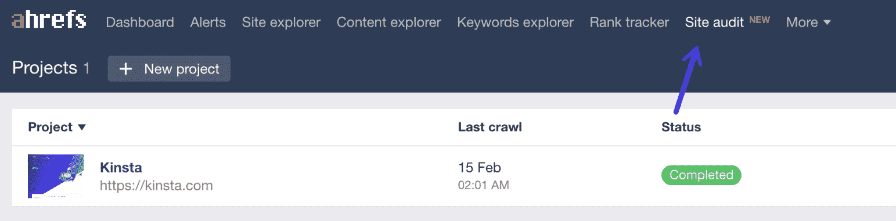

Ahrefs site audit tool

扫描完成后，点击进入报告部分，你会发现你的网站上所有的 [404 错误](https://kinsta.com/blog/error-404-not-found/)的列表。然后你可以看到你的网站上所有断开的链接以及它们出现的内部页面。然后，您应该用正确的链接更新断开的链接。

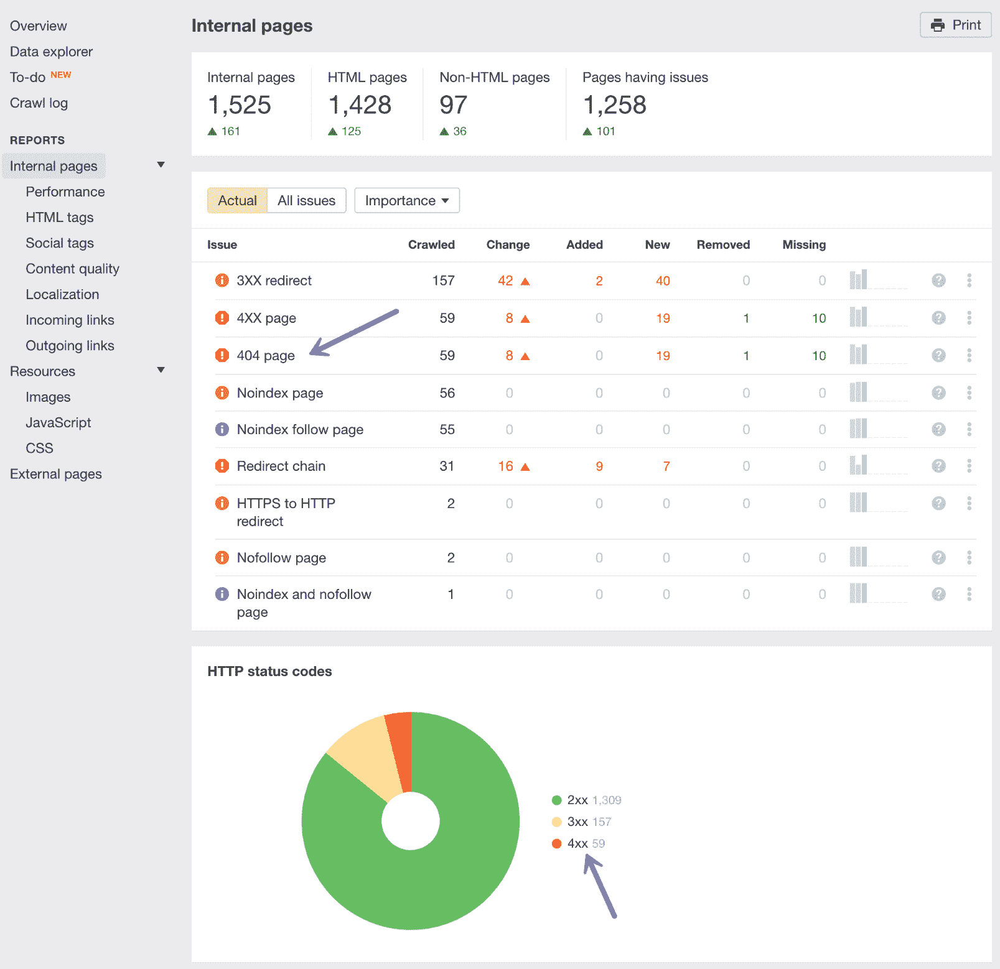

Broken links in Ahrefs site audit tool

#### 选项 2–使用 Ahrefs 站点浏览器查找断开的链接

您还可以使用 [Ahrefs 站点浏览器](https://ahrefs.com/site-explorer)来查找断开的链接。只需将您的站点 URL 放入 Ahrefs 站点浏览器，转到“反向链接”报告，然后单击“断开”以查看您网站的最强断开反向链接。

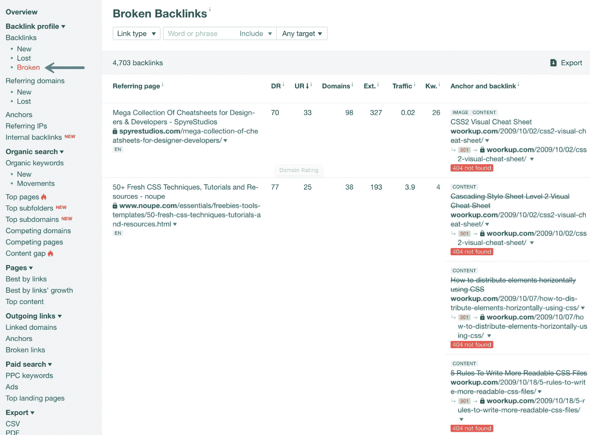

Ahrefs backlink profile – broken links

或者，您也可以转到“最佳链接”报告，并在“HTTP 代码”中应用“404 未找到”过滤器

#### 选项 3–使用 Ahrefs 站点资源管理器查找断开的出站链接

修复你网站的内部反向链接是首要任务。但是不要忘记断开的外向链接。当你链接到别人网站上的垃圾内容或资源时，这也会让用户感到沮丧。高质量的外向链接也在你的搜索引擎优化中发挥作用。

只需将您的站点 URL 放入 Ahrefs 站点资源管理器，转到“外向链接”报告，然后单击“断开的链接”然后，您可以在站点上看到链接所在的帖子或页面以及断开的外部链接。

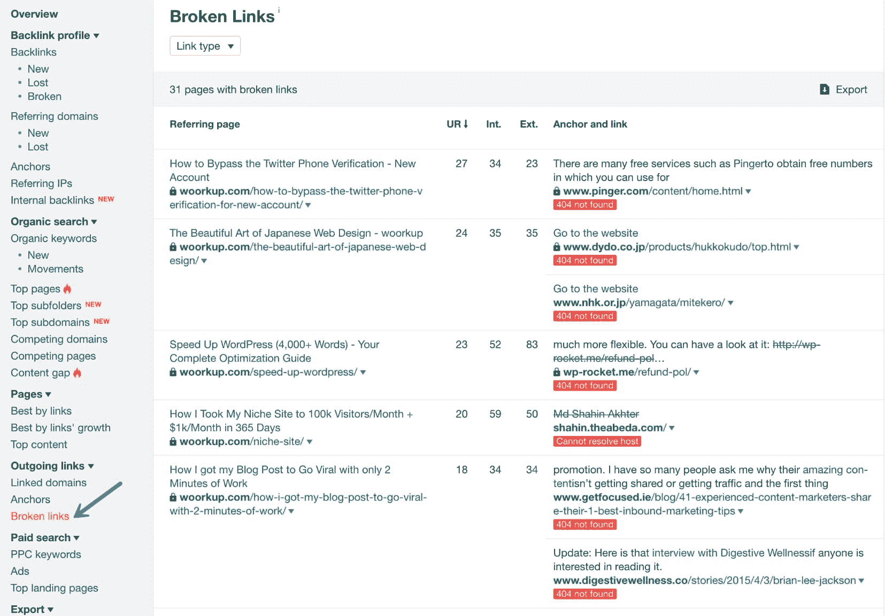

Ahrefs broken outgoing links

### 2。谷歌搜索控制台

谷歌搜索控制台是谷歌提供的一个有用的工具，它可以帮助你“监控、维护和诊断你的网站在谷歌搜索结果中的位置”。为了开始，你需要[用谷歌搜索控制台](https://kinsta.com/blog/google-site-verification/)验证你的网站。然后，您可以开始受益于它的功能，包括断开链接检测。

## 注册订阅时事通讯

### 想知道我们是怎么让流量增长超过 1000%的吗？

加入 20，000 多名获得我们每周时事通讯和内部消息的人的行列吧！

[Subscribe Now](#newsletter)

作为其功能的一部分，谷歌搜索控制台包括一个**抓取错误**报告，让你看到所有向谷歌返回[404 错误](https://kinsta.com/blog/error-404-not-found/)的页面:

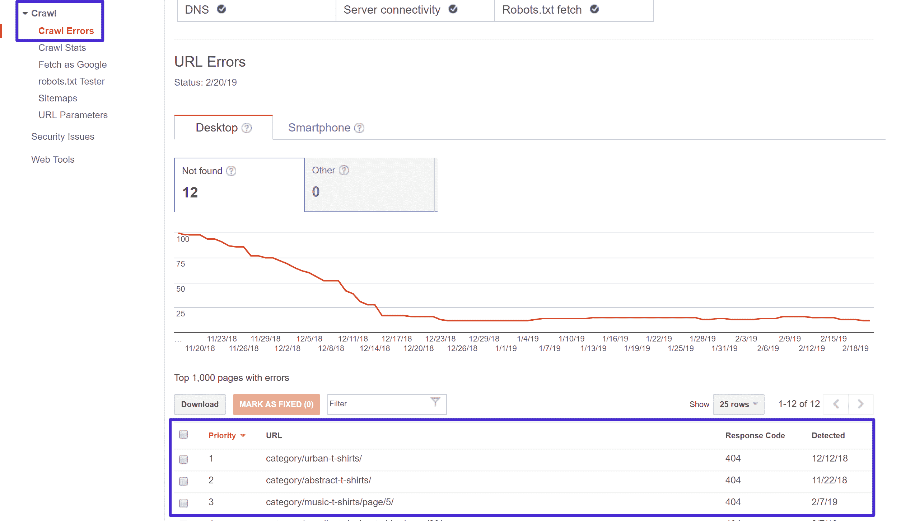

The Google Search Console Crawl Report

单击这些链接中的任何一个都会打开一个弹出窗口，您可以在其中看到哪些页面链接到了 404 错误页面，这样您就可以更正这些页面上断开的链接:

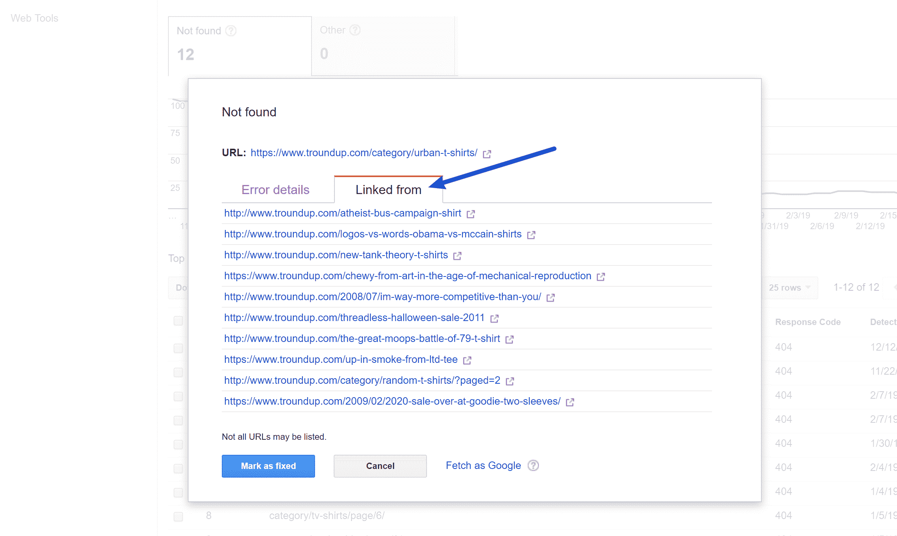

The Crawl Report lets you see pages that link to a 404 page

### 3。桌面软件

除了基于网络的搜索引擎优化审计工具，你也可以使用桌面软件找到断开的链接。

这里最受欢迎的选项是[尖叫的青蛙](https://www.screamingfrog.co.uk/)，这是一个众所周知的搜索引擎优化工具，可以免费用来查找断开的链接。

尖叫青蛙可以在 Windows、macOS 和 Ubuntu 上运行。

一旦你下载并安装了这个程序，以下是如何使用它来找到断开的链接。

首先，将您网站的 URL 添加到顶部的框中，然后单击**开始**:

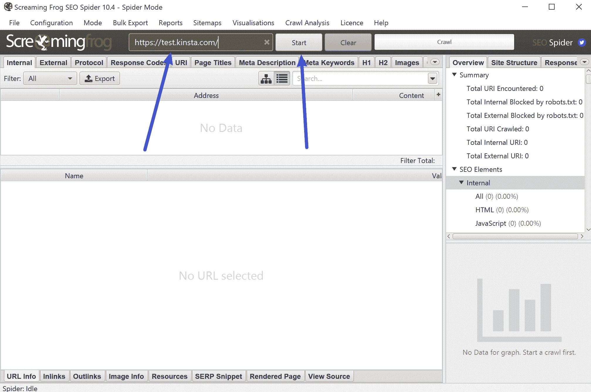

Add your site’s URL to Screaming Frog

然后，您可以使用**响应代码**选项来过滤掉 404 页面，然后使用底部的**内链接**功能来查找这些 404 页面的链接:

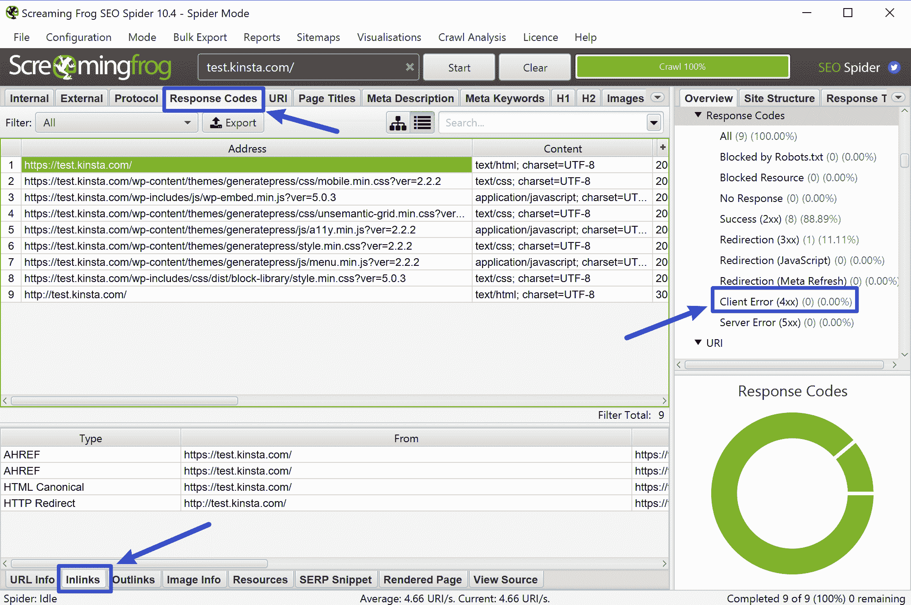

How to find broken links with Screaming Frog

如果你用的是 Mac， [Integrity](https://peacockmedia.software/mac/integrity/free.html) 也是另一个不错的桌面搜索引擎优化工具，你可以用它来找到断开的链接。

Struggling with downtime and WordPress problems? Kinsta is the hosting solution designed to save you time! [Check out our features](https://kinsta.com/features/)

### 4。在线断链检查工具

如果你的网站不是很大，你可以使用免费的在线断链检查工具来查找断链。

这里一个很好的选择是被创造性地命名为[的 BrokenLinkCheck.com](https://www.brokenlinkcheck.com/)，它可以让你免费查看多达 3000 个页面。

它也非常容易使用——你只需进入网站，插入你的网址，然后点击**查找断开的链接**:

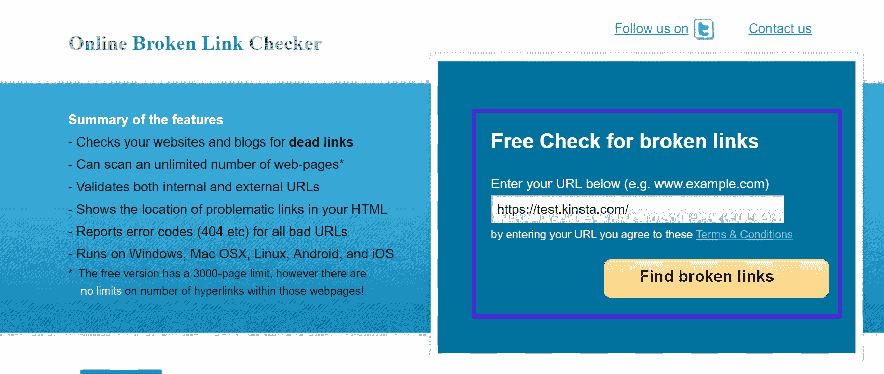

Add your site’s URL to BrokenLinkCheck.com

然后，您可以决定是报告明显断开的链接，还是报告所有事件——所有事件更彻底，但可能需要更多时间:

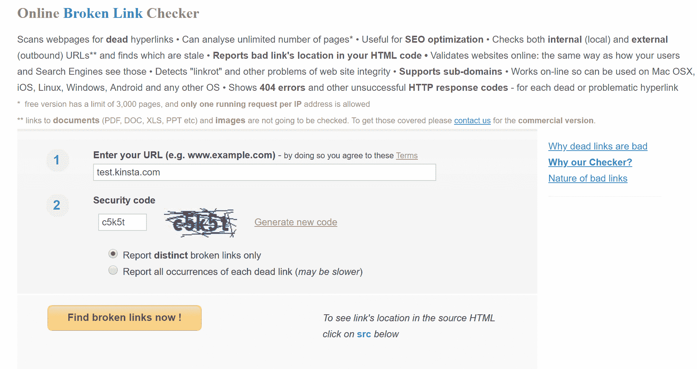

Choose how to check for broken links

然后，该工具将列出所有断开的内部和外部链接，并提供指向出现断开链接的页面的链接:

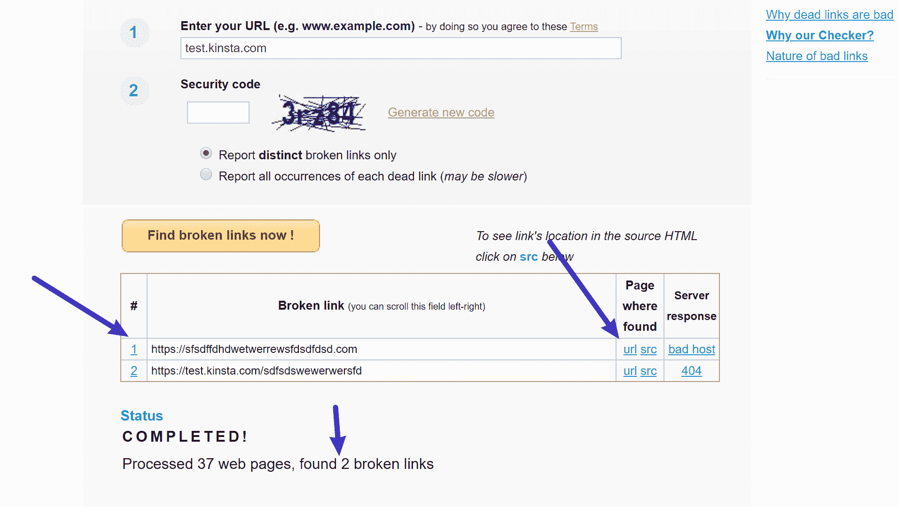

The BrokenLinkCheck.com results

然后，你需要做的就是进入并修复有问题的链接。

### 5。断开链接检查插件

如果你有一个 WordPress 网站，我们**不**建议使用插件来检查断开的链接，因为它们会严重影响你网站的性能。从性能的角度来看，通过上面的任何一种方法将这些任务卸载到一个单独的工具上会好得多。

如果你一定要使用插件来检查断开的链接，不要让它一直处于活动状态。相反，运行一次插件，然后在你修复了断开的链接后把它从你的网站上删除。但是，我们的建议是只使用其他工具中的一个，跳过插件。

说到断链检查插件，最受欢迎的选项是 WordPress.org 的免费[断链检查插件](https://wordpress.org/plugins/broken-link-checker/)。注意:这个插件已经很久没有更新了，看起来开发者正在试图[请求转让所有权](https://wordpress.org/support/topic/request-to-transfer-ownership-of-broken-link-checker/)。

安装并激活插件后，进入**工具→断开的链接**查看包含所有断开的内部和外部链接的报告:

The Broken Link Checker plugin interface

要快速修复该工具发现的任何损坏的链接，您可以将鼠标悬停在该链接上并选择**编辑 URL** 来编辑该链接，而无需打开每个单独的页面:

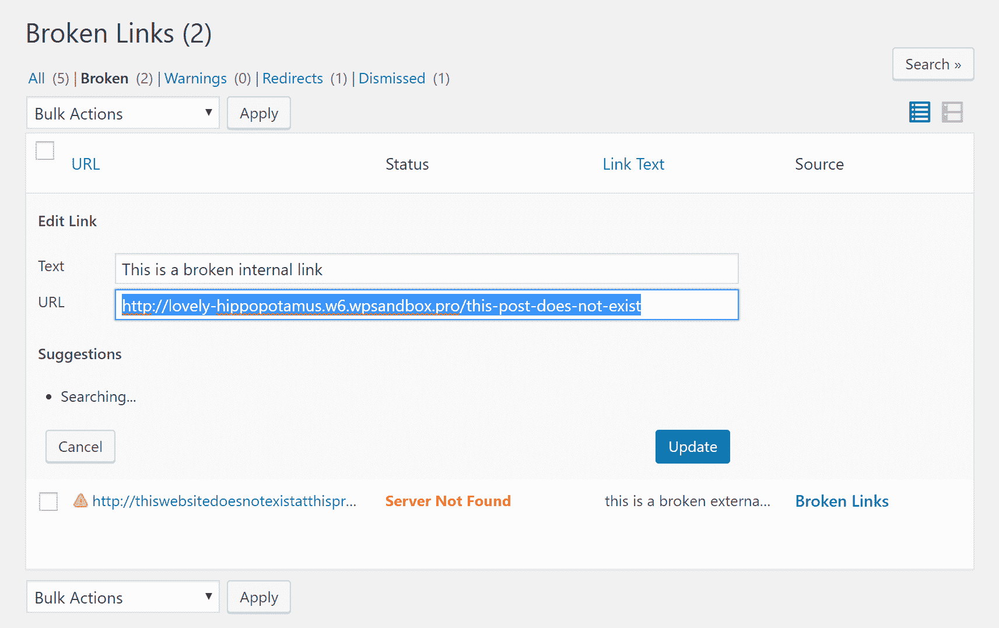

Editing a URL in the Broken Link Checker plugin

## 去掉你网站上的坏链接

网站上有坏链接对用户体验和 SEO 都不利，所以你要定期检查坏链接并尽可能多地修复它们。

对于如何找到断开的链接的最有利于性能的方法，我们建议使用一个非现场解决方案。好的选择是:

*   像 [Ahrefs](https://ahrefs.com/) 这样的 SEO 审计工具——如果你有这样的工具，这是我们推荐的方法。我们甚至在 Kinsta 使用这个工具来修复我们网站上断开的链接。
*   在[谷歌搜索控制台](https://kinsta.com/blog/google-site-verification/)中报告抓取错误。
*   像[尖叫青蛙](https://www.screamingfrog.co.uk/)这样的免费桌面 SEO 软件。
*   像 BrokenLinkCheck.com 这样的免费网络工具

同样，虽然像断链检查器这样的插件可以很容易地在 WordPress 上找到断链，但是我们不推荐使用它们，因为这种方法会带来负面的性能影响。

有没有其他好的断链检查解决方案，我们错过了？请在评论中告诉我们。

* * *

让你所有的[应用程序](https://kinsta.com/application-hosting/)、[数据库](https://kinsta.com/database-hosting/)和 [WordPress 网站](https://kinsta.com/wordpress-hosting/)在线并在一个屋檐下。我们功能丰富的高性能云平台包括:

*   在 MyKinsta 仪表盘中轻松设置和管理
*   24/7 专家支持
*   最好的谷歌云平台硬件和网络，由 Kubernetes 提供最大的可扩展性
*   面向速度和安全性的企业级 Cloudflare 集成
*   全球受众覆盖全球多达 35 个数据中心和 275 多个 pop

在第一个月使用托管的[应用程序或托管](https://kinsta.com/application-hosting/)的[数据库，您可以享受 20 美元的优惠，亲自测试一下。探索我们的](https://kinsta.com/database-hosting/)[计划](https://kinsta.com/plans/)或[与销售人员交谈](https://kinsta.com/contact-us/)以找到最适合您的方式。**