# 如何快速更改(或重置)WordPress 密码

> 原文：<https://kinsta.com/blog/change-wordpress-password/>

如果你需要更改你的 WordPress 密码，你可能会感到恐慌。您无法访问您的网站，并且[您不知道如何再次进入](https://kinsta.com/blog/locked-out-of-wordpress-admin/)。

救命啊！

通常情况下，当有人忘记了他们的 WordPress 密码，他们无法访问他们的电子邮件进行标准的密码重置，或者他们的 WordPress 网站没有正确发送电子邮件时，就会发生这种情况。

在这篇文章中，我们将带你经历几个快速简单的步骤，告诉你如何在你可能遇到的各种情况下改变 WordPress 密码(或者重置密码)。

### 更喜欢看[视频版](https://www.youtube.com/watch?v=P66sUx4k8dU)？


让我们先来看看更改密码和重置密码之间的区别，这样你就知道你需要做哪一个了。

## 更改你的 WordPress 密码和重设密码

在 WordPress 中更改密码和重置密码会产生类似的结果。


> Kinsta 把我宠坏了，所以我现在要求每个供应商都提供这样的服务。我们还试图通过我们的 SaaS 工具支持达到这一水平。
> 
> <footer class="wp-block-kinsta-client-quote__footer">
> 
> 
> 
> <cite class="wp-block-kinsta-client-quote__cite">Suganthan Mohanadasan from @Suganthanmn</cite></footer>

[View plans](https://kinsta.com/plans/)

**更改密码是你自己的事**。如果你可以访问你的网站和你的个人资料设置，你应该可以很容易地更改你的 WordPress 密码。换句话说，当你知道你的当前密码时，你改变你的密码。

你需要让系统为你重设密码，如果你不是管理员，也可以询问管理员。在这篇文章中，我假设你是网站管理员，你有权为[和其他用户](https://kinsta.com/blog/wordpress-user-roles/)重设密码——我会在文章后面告诉你怎么做。

重置密码的主要问题是，您是在不知道现有密码的情况下进行重置的。

## 当你需要更改或重置你的 WordPress 密码时的场景

 在 WordPress 中有很多方法可以用来更改或重置密码，其中很多方法适用于多种情况。

因此，让我们来看看那些您可能想要或需要更改您的密码，并确定您可以使用的每种方法。

### 1.用帐户访问更改 WordPress 密码

所以你知道你现有的密码，但你想改变它。也许管理员给了你一个新的 WordPress 账户，而[密码不够安全](https://kinsta.com/blog/wordpress-security/#clever-passwords)或者你不记得了。也许你想更改你的 WordPress 密码，因为其他人已经访问了它。

假设你可以访问你的 WordPress 站点，并且你知道现有的密码，你有两个选择:

*   使用 [WordPress 管理](https://kinsta.com/knowledgebase/wordpress-admin/)中的**我的个人资料**界面创建一个新密码。
*   通过 [WP-CLI](https://kinsta.com/blog/wp-cli/) 和[访问你的网站，使用命令](https://kinsta.com/blog/how-to-use-ssh/)更改密码。

在这篇文章的后面，我将向你展示如何做到这些。

### 2.通过电子邮件访问更改或重置 WordPress 密码

在下一个场景中，你不知道现有的密码，但是你可以访问你的 WordPress 用户帐户的电子邮件帐户。你必须重新设置密码，因为你不知道旧的，但它应该是快速和容易的。

以下是可供您选择的选项:

*   使用 WordPress 登录界面中的丢失密码链接。
*   如果你使用自动安装程序来安装 WordPress，重置 [cPanel](https://kinsta.com/knowledgebase/what-is-cpanel/) 中的密码。
*   重置 [phpMyAdmin](https://kinsta.com/help/wordpress-phpmyadmin/) 中的密码。如果你和 Kinsta 在一起，[通过 MyKinsta 仪表板](https://kinsta.com/blog/locked-out-of-wordpress-admin/#reset-password-using-phpmyadmin)重置 phpMyAdmin 中的密码。
*   [使用 FTP](https://kinsta.com/blog/best-ftp-clients/) 重置密码。
*   使用紧急密码重置脚本。

请直接跳到每种方法的使用说明。

### 3.在没有电子邮件访问的情况下更改或重置 WordPress 密码

现在，让我们假设您无法访问与该帐户相关的电子邮件地址。以下是您可以使用的方法:

*   在 cPanel 中重置密码。
*   在 phpMyAdmin 中重置密码。如果你用的是 Kinsta，你可以通过 MyKinsta 在 phpMyAdmin 中轻松重置密码。
*   使用 FTP 重置密码。

同样，请直接跳到使用每种方法的说明。

### 4.重置另一个用户的 WordPress 密码作为站点管理员

这种情况略有不同，因为你重置的不是你自己的密码，而是别人的。在这种情况下，您将无法访问其他用户的旧密码，因此您需要重新设置。

以下是可用的选项:

*   使用 WordPress 用户界面访问用户并重置他们的密码。
*   在 phpMyAdmin 中重置密码。

现在让我们依次看看每一种方法。

## 如何在 WordPress 中更改或重置密码

如果你需要做的只是改变你自己的 WordPress 密码，并且你有旧的密码，你可以在管理中这样做。如果您可以访问电子邮件，也可以在管理员中重置您的密码。

最后，作为网站管理员，你可以重置其他用户的密码。

### 在个人资料界面中更改你的 WordPress 密码

如果你可以访问你的网站，只是想更改你的 WordPress 密码，你可以在个人资料界面中进行。

在 WordPress，进入**用户>你的个人资料**进入你的个人资料页面。

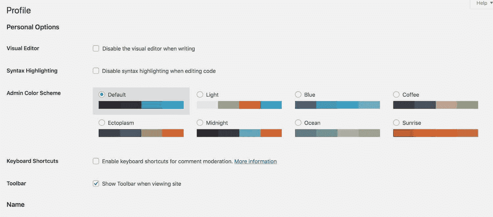

Profile screen


向下滚动到屏幕底部的**账户管理**部分。

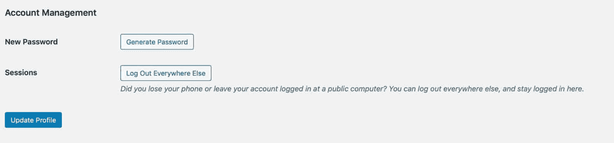

Account Management


点击**生成密码**按钮。将为您生成一个新密码，并显示出来供您复制。如果你想编辑它，你可以这样做。

点击**更新档案**按钮，您的新密码将被保存。您需要使用新密码再次登录，因此请记下新密码。

如果你认为你可能在多个设备或浏览器上登录到你的 WordPress 站点，或者你怀疑其他人可能使用你的凭证访问你的站点，也点击**在其他地方注销**按钮。

#### 使用丢失密码链接重置您的密码

如果您可以访问您用来设置 WordPress 帐户的电子邮件帐户，但是您不知道您的密码，您可以使用忘记密码链接来快速重置您的密码。

浏览到你的 [WordPress 登录页面](https://kinsta.com/blog/wordpress-login-url/)，一般情况下这个位于/wp-admin，比如:https://domain.com/wp-admin.然后点击**输了密码？**底部链接。

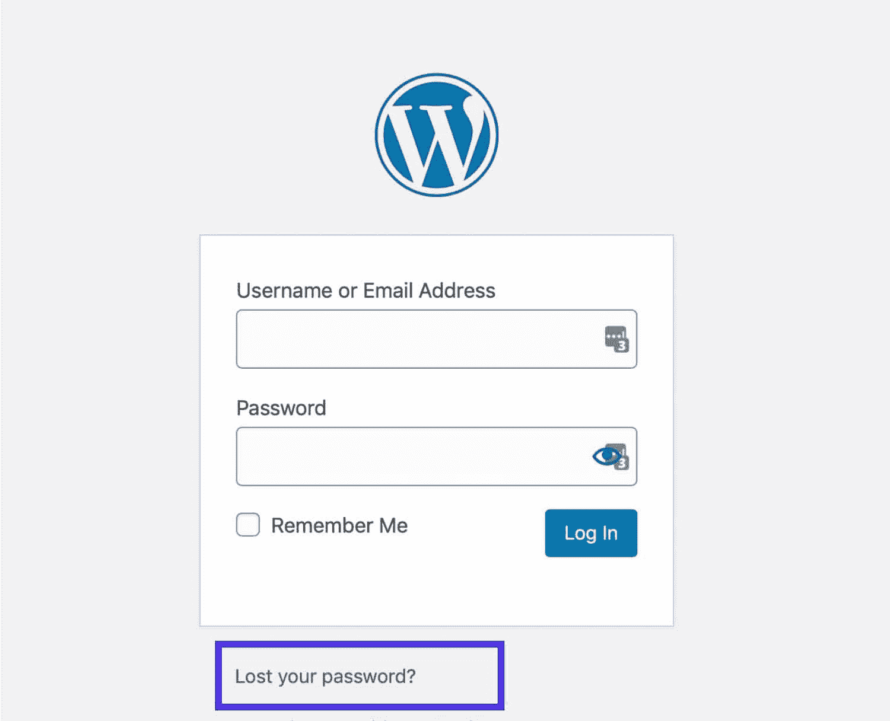

WordPress lost password link


在下一个屏幕上，输入你的用户名或者你的 WordPress 账户的电子邮件地址。点击**获取新密码**，您将通过电子邮件收到一个创建新密码的链接。

检查您的收件箱，并单击您收到的电子邮件中的链接。您将被带到一个屏幕，在那里您可以重置您的密码。

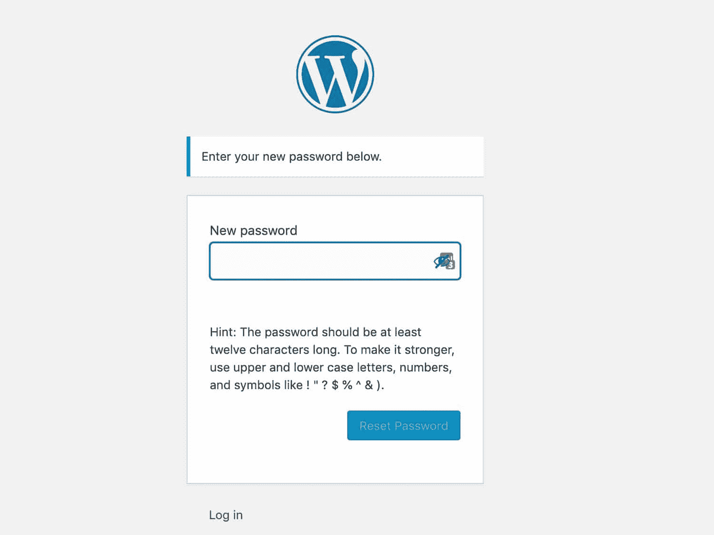

Reset password screen


最后，使用新密码和您的用户名或电子邮件地址登录您的网站。完成了。

#### 使用 WordPress Admin 来改变(或重置)另一个用户的密码

如果您是站点管理员，其他用户可能会要求您重设他们的密码。

或者你可能会选择重置他们的密码，因为[不够安全](https://kinsta.com/blog/wordpress-security/)或者密码被广泛分享。在这两种情况下，你都可以通过管理界面重置用户的密码。

在 WordPress admin 中，转到**用户**。找到您想要重设密码的用户，点击其姓名下方的**编辑**链接。

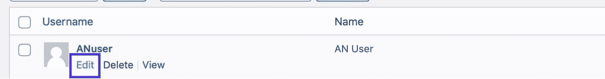

Users screen


这将为该用户打开编辑屏幕。


User editing screen


向下滚动到账户管理部分，点击**生成密码**按钮。

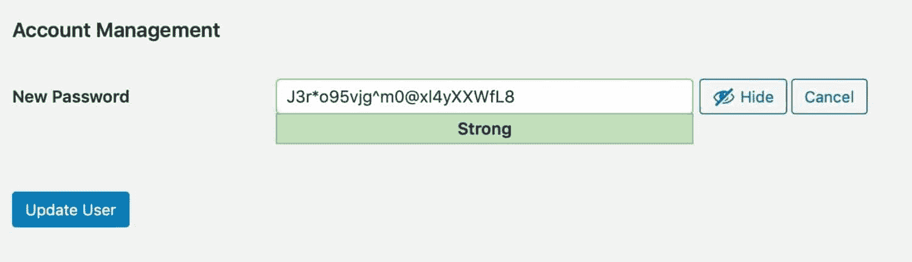

Generate password


将生成一个新密码。你可以编辑它:如果你这样做，确保密码是强的。

点击**更新用户**按钮。用户将收到一封电子邮件，详细说明他们的新密码。


### 信息

如果用户只是忘记了密码，告诉他们可以使用“丢失密码”链接自行重置密码。当他们这样做时，您会收到通知。


## 如何通过 WP-CLI 更改 WordPress 密码

如果您可以访问该网站，重置或更改密码的另一个选项是通过 [WP-CLI](https://kinsta.com/blog/wp-cli/) 。您可以通过这种方式更改任何用户的密码。

首先像平常一样通过 WP-CLI 访问您的站点。

要更改密码，导航到根目录——安装 WordPress 的文件夹。通过键入以下命令获取用户列表:

```
wp user list
```

找到要重置密码的用户，并记下他们的用户 ID。如果是站点管理员，用户 ID 将是 1，但是您也可以使用这种方法来更改其他用户的密码。

键入以下命令:

```
wp user update 1 --user_pass=password
```

将上面示例中的“password”替换为用户的新密码，并确保您使用的密码比这个密码强得多。

如果您想要使用的用户 ID 不是 1，请用他们的用户 ID 替换示例中的 1。

## 如何从 phpMyAdmin 更改(或重置)WordPress 密码

另一种改变 WordPress 管理员密码的方法是通过 phpMyAdmin 直接在数据库中[。如果你不能访问你的电子邮件或者你的 WordPress 站点不能正确发送电子邮件，这可能是你唯一的解决方案。](https://kinsta.com/blog/locked-out-of-wordpress-admin/#reset-password-using-phpmyadmin)

如果您正在进行[本地开发安装](https://kinsta.com/blog/install-wordpress-locally/)，您可能也必须使用这种方法。如果你是 Kinsta 的客户，你可以随时[向支持寻求帮助](https://kinsta.com/kinsta-support/)，如果你觉得这样做不舒服的话。


### 重要的

如果操作不当，直接从 phpMyAdmin 编辑和操作表格可能会破坏您的站点。如果你不喜欢这样做，考虑[雇佣一个开发者](https://kinsta.com/blog/hire-wordpress-developer/)或者寻求支持。


您首先需要登录 phpMyAdmin。如果您的 web 主机使用 cPanel，通常可以在数据库部分找到 phpMyAdmin 的链接。

如果您是 Kinsta 的客户，您可以直接从您的 [MyKinsta 仪表板](https://kinsta.com/mykinsta)访问 phpMyAdmin。您也可以在那里找到登录凭证。

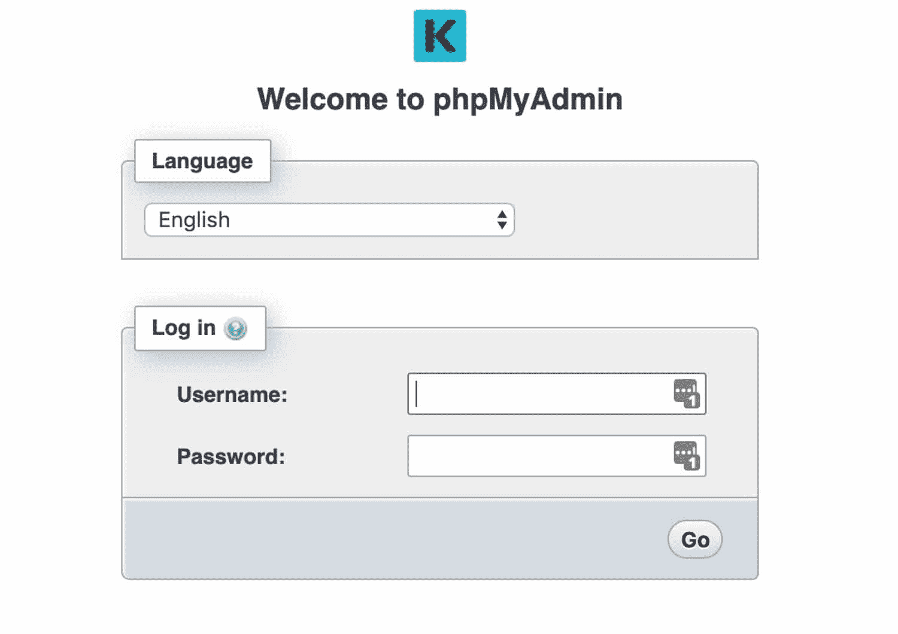

Logging in to phpMyAdmin


在左侧，单击您的数据库。然后向下滚动并点击 **wp_users** 表。wp_users 是在[新安装的 WordPress】上使用的标准表。](https://kinsta.com/blog/reinstall-wordpress/)

但是，出于安全目的，有些站点可能会添加前缀。在这种情况下，它的命名可能略有不同，例如 **wp56_users** 。

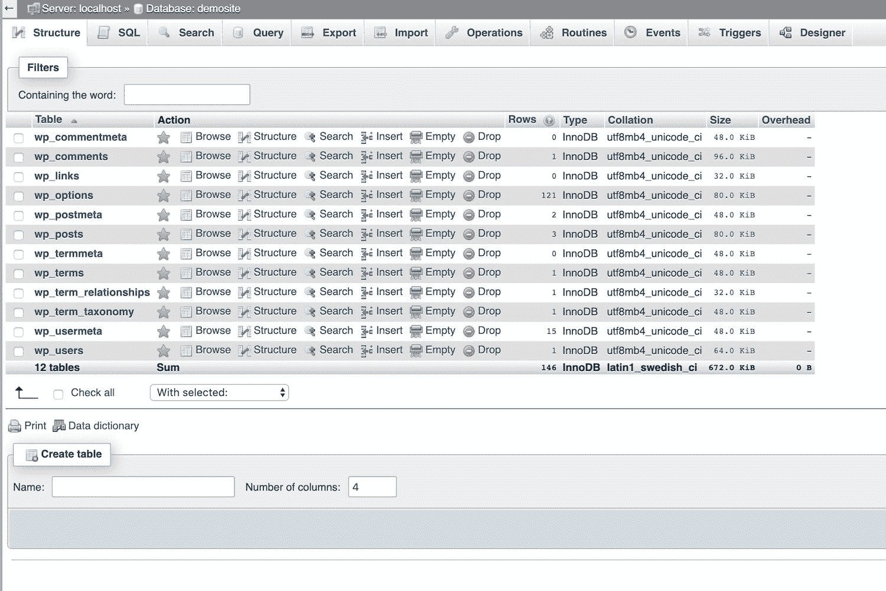

The database in phpMyAdmin


在您的管理员用户名旁边的行中，点击**编辑**。如果你的 WordPress 站点上有多个用户，仔细检查以确保你编辑的是正确的用户。

在列 **user_pass** 中，您可以输入新的密码值。确保从“函数”列中选择 MD5。然后点击底部的**进入**。

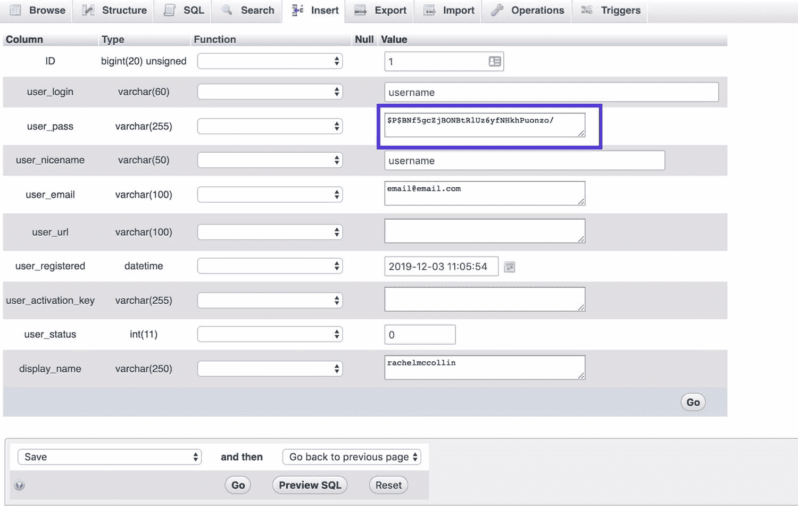

Editing the password in the user_pass field


就是这样！您现在已经更改了您的 WordPress 管理员密码。

## 注册订阅时事通讯


### 想知道我们是怎么让流量增长超过 1000%的吗？

加入 20，000 多名获得我们每周时事通讯和内部消息的人的行列吧！

[Subscribe Now](#newsletter)

你可以返回到你的 WordPress 登录界面，使用更新后的凭证访问你的网站。

### 从 MyKinsta 中的 phpMyAdmin 更改(或重置)WordPress 密码

如果你和 Kinsta 在一起，你可以通过 MyKinsta dashboard 访问 phpMyAdmin 并重置你的密码。

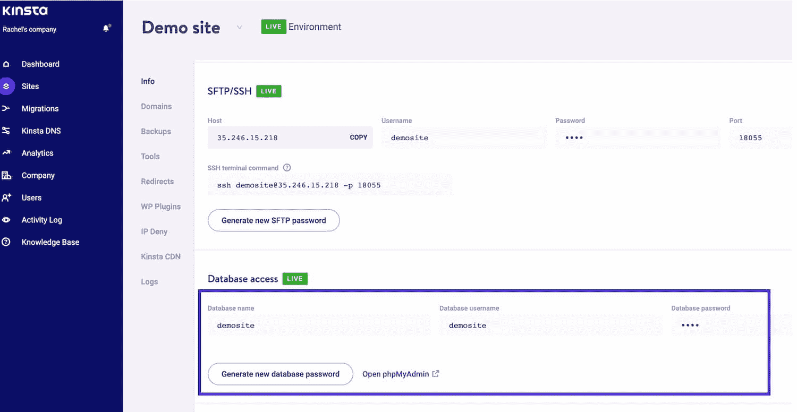

Accessing phpMyAdmin via MyKinsta


一旦你进入 phpMyAdmin，使用上面 phpMyAdmin 的说明重新设置你的密码。

## 如何使用 SQL 重置 WordPress 密码

另一种通过 phpMyAdmin 重置密码的方法是使用 SQL 语句。

只需从 SQL 选项卡中运行以下命令。确保用您自己的值更新**新密码**和**管理员用户名**的值。

UPDATE ` WP _ users ` SET ` user _ pass `= MD5(' new _ password ')，其中` WP _ users ` . ` user _ log in `= " admin _ username "；

您可以通过 phpMyAdmin 中的 SQL 选项卡访问 SQL。


SQL tab in phpMyAdmin


## 如何通过 FTP 更改 WordPress 密码

另一种更改或重置密码的方法是通过 [FTP](https://kinsta.com/knowledgebase/ftp-vs-sftp/) 。

从使用 FTP 客户端或包含 FTP 的[代码编辑器](https://kinsta.com/blog/free-html-editor/)访问你的网站[开始。](https://kinsta.com/knowledgebase/how-to-use-sftp/)

导航到您站点的根目录:

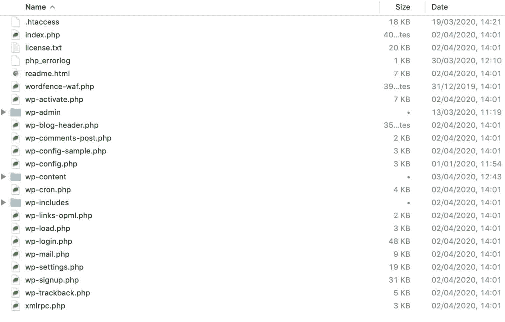

WordPress root directory in FTP client


现在导航到**WP-内容/主题**，找到包含当前[活动主题的文件夹](https://kinsta.com/best-wordpress-themes/)。在那个文件夹里，找到 functions.php 的**文件。打开它或下载它，以便您可以编辑它。**

最好先**复制这个文件**，以防出现任何问题。

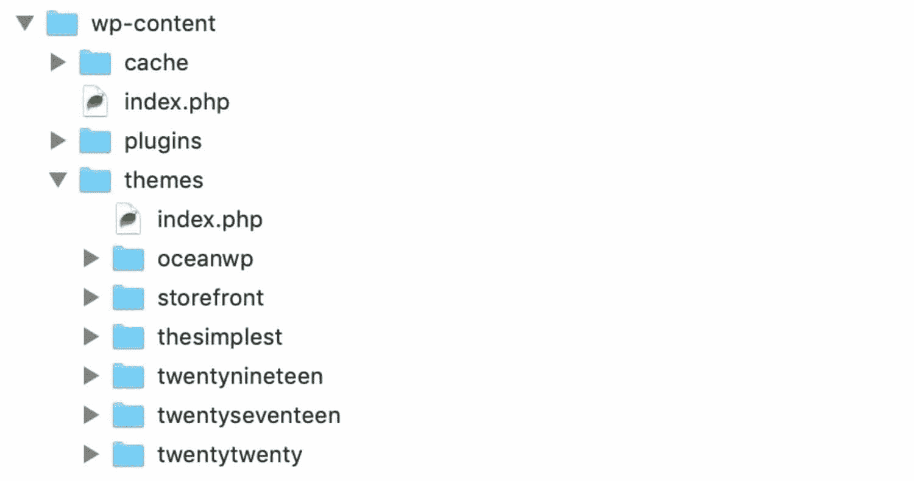

functions.php file in FTP client


现在，在第一行中，就在开头

```
wp_set_password( 'password', 1 );
```

第一个参数是新密码:我建议您使用比“password”更安全的密码。第二个参数是用户 ID。用户 ID 1 将成为管理员。

现在，保存修改后的文件或将其上传到您站点的相同位置，覆盖文件的旧版本。

您的管理员密码现在将是您在函数文件中使用的密码。登录到您的网站，并检查您是否可以访问它。

一旦你登录，回到你的 functions.php 文件，删除那行代码。

你这样做是非常重要的，因为把它留在你的文件中会使你的网站容易受到攻击，并且意味着你的密码会在每次页面加载时被重新设置。

## 如何从 cPanel 重置 WordPress 密码

在 Kinsta，我们不使用 cPanel 。相反，我们使用 MyKinsta 来重置您的密码(如我们之前所见)。但是如果你和一个使用 cPanel 的提供商在一起，这是另一种方法。

如果你使用 cPanel 中的自动安装程序[安装了 WordPress，并且你没有访问电子邮件帐户的权限，你可以通过访问你在 cPanel](https://kinsta.com/knowledgebase/what-is-cpanel/#how-to-install-wordpress-with-cpanel)中创建的安装程序[来重置 WordPress 管理员密码。您不能以这种方式重置任何其他用户密码。](https://kinsta.com/help/new-site/)

首先打开 cPanel，向下滚动到 **WordPress 管理器**。根据你的主机提供商，你可能需要查看**自动安装程序**或**软件**部分。

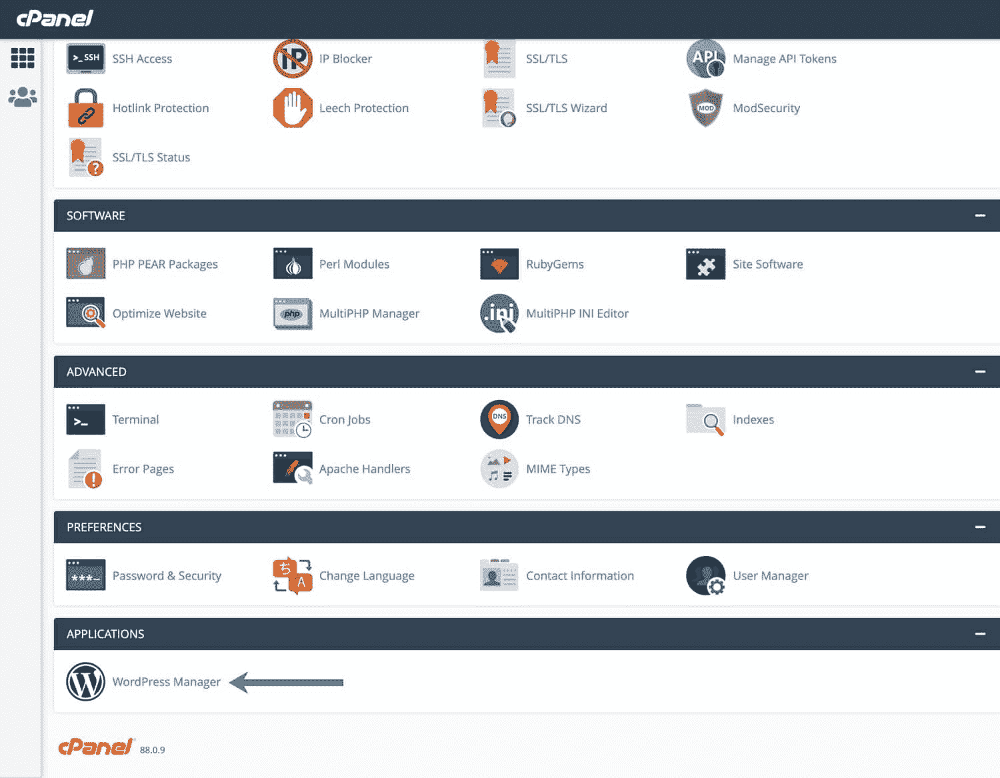

WordPress Manager in CPanel.


这将把你带到 WordPress 自动安装屏幕。向下滚动找到要更改密码的安装。

厌倦了体验你的 WordPress 网站的问题？通过 Kinsta 获得最好、最快的主机支持！[查看我们的计划](https://kinsta.com/plans/?in-article-cta)

在要更改密码的安装旁边，单击编辑图标(铅笔)。这将带您到安装编辑屏幕。

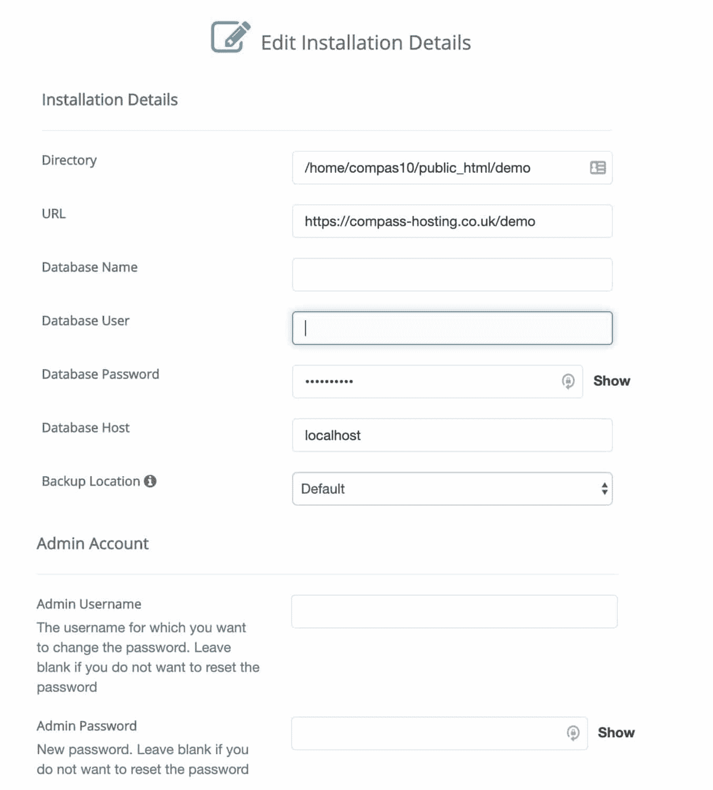

Auto-installer installation editing screen


向下滚动到管理员帐户部分，找到**管理员密码**字段。键入一个新密码，确保它是安全的，并且你能记住它。

现在回到你的网站，用你的新密码登录[。](https://kinsta.com/blog/wordpress-login-url/)

## 如何使用紧急密码重置脚本重置 WordPress 密码

如果其他方法都失败了，最后一招就是使用 WordPress 紧急密码重置脚本。

要使用它，您需要知道管理员的用户名。它将更新管理员帐户的密码，并向管理员的电子邮件地址发送一封电子邮件。

你实际上不需要访问电子邮件，但你需要知道用户名。新密码将发送到您的电子邮件地址，因此，如果您的电子邮件已被泄露，请不要使用这种方法。

在大多数情况下，如果您有用户名和访问电子邮件的权限，您可以使用登录屏幕中的“丢失密码”链接。

但是如果 [wp-admin 根本不工作](https://kinsta.com/blog/locked-out-of-wordpress-admin/)并且需要重置你的密码，这是一个选项。

首先在你的根目录下创建一个名为**emergency.php**的文件:WordPress 的安装文件夹。复制[紧急密码脚本](https://codex.wordpress.org/User:MichaelH/Orphaned_Plugins_needing_Adoption/Emergency)并粘贴到您的文件中。

在你的浏览器中，打开 http://example.com/emergency.php,，其中 example.com 是你的网站地址。(确保使用**emergency.php**，而不仅仅是**应急**。)

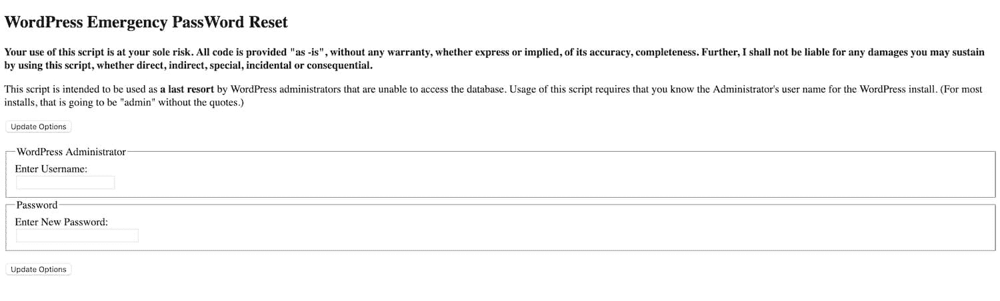

emergency.php screen


在 WordPress 管理员字段，输入管理员帐户的用户名。在密码字段中，输入您的新密码。点击**更新选项**按钮。

将显示一条消息，指出密码已更改。检查您的电子邮件，因为您将收到一封包含更新信息的电子邮件。

完成后，从服务器上删除 emergency.php。不要把它留在你的服务器上，因为其他人可能会用它来更改你的密码。

你现在可以用新密码使用你的网站了。

## 如何解决密码更改和重置的常见问题

有时更改或重置密码并不像你希望的那样顺利。以下是常见问题或错误的列表，以及出现这些问题或错误时的处理方法。

### 您在 WordPress 管理器中更改了密码，但新密码无法识别

很有可能你输入的新密码是错的或者忘记了。请再次尝试输入。

或者，您的浏览器可能在 cookie 中保存了一个旧密码，并使用该密码填充密码字段。删除所有内容，输入新密码。

如果其他方法都失败了，使用**丢失密码？**点击登录界面中的链接重置您的密码。

### 你正在尝试重置密码，但 WordPress 无法识别你的电子邮件或用户名

如果您使用忘记登录链接来重置密码，您需要键入您的电子邮件地址或用户名。检查一下你是否打错了。

如果您不记得您的电子邮件地址或用户名，当您无法访问电子邮件时，您需要使用上述方法之一。

### 您重置了密码，但没有收到详细的电子邮件

尝试检查您的垃圾邮件文件夹。电子邮件是自动发送的，可能已经发送到那里。如果你使用的是 Gmail，试试**更新**标签。

您可能使用了错误的电子邮件帐户。你能不能为你的 WordPress 账户使用一个不同于你通常使用的电子邮件地址？

如果所有的方法都失败了，当你无法使用电子邮件时，你必须使用其中一种方法。

### 您使用 FTP 更改了密码，但您的网站无法运行

使用 FTP 需要对主题函数文件进行编辑。如果你把它加错了地方或者打错了，它会影响你的主题。

回到函数文件，检查你是否正确地遵循了指令。如果仍然不起作用，请在编辑文件之前恢复您对文件进行的备份。并尝试用另一种方法重置密码。

如果你没有做备份，你可以在 [WordPress 主题目录](https://wordpress.org/themes/)中找到你的主题，或者通过你购买的主题供应商，然后用正确的文件重新上传到你的站点。

### 您使用 phpMyAdmin 重置了密码，现在网站被破坏了

使用 phpMyAdmin 重置密码涉及到直接编辑数据库。

如果这样做之后，你的网站崩溃了，或者你仍然不能进入管理界面，这可能是你做错了什么。

回到通过 phpMyAdmin 更改密码的说明，并检查您所做的是否反映了说明。如果你做了，但你仍然不能访问你的网站，尝试重置密码的另一种方式。

如果您的网站不能正常工作，您可能不小心编辑了另一个域。你需要[从编辑数据库之前的备份](https://kinsta.com/blog/restore-wordpress-from-backup/)中恢复你的站点，然后尝试使用另一种方法重置密码。

如果你没有备份，你需要和你的主机提供商谈谈，问问他们是否能帮忙。

### 我更改了另一个用户的密码，但他们没有收到电子邮件

当网站管理员更改另一个用户的密码时，WordPress 会向该帐户所用的地址发送一封电子邮件。

如果用户没有收到电子邮件，请他们:

*   检查他们的垃圾邮件文件夹(或 Gmail 中的更新)
*   检查他们使用的电子邮件帐户是否与注册的 WordPress 帐户相同——你可以在用户资料页面找到。

如果他们仍然无法访问电子邮件，请再次运行密码生成并复制密码，然后单击**更新用户**按钮。然后，您可以向用户提供密码。他们应该在第一次登录时自己更改，这样他们就知道这是隐私。

### 其他密码安全提示

当你更改或重置你的 WordPress 密码时，使用一个安全的密码是很重要的。安全密码将:

*   要长(10 个字符以上)。
*   包括大小写字母的混合。
*   包括数字。
*   包括特殊字符，如标点符号。

当你在 WordPress 管理界面修改你的密码时，你会被告知它有多安全。如果它不够强，(如下例所示)尝试添加更多的字符，以及不同类型的字符。

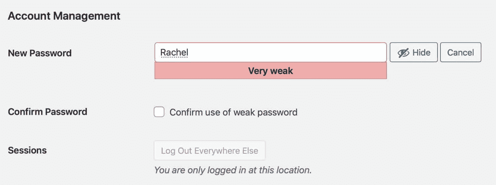

Reset password – weak


下面的例子更安全，也更容易记住。

有时使用一个短语比试图给一个单词添加许多额外的字符更有效。尝试使用你最喜欢的书或电影中的开场白。


Reset password – strong


或者，让 WordPress 为你生成密码。你可以使用像 [LastPass](https://www.lastpass.com/) 这样的密码管理器来存储你所有的密码，这样你就不需要记住它们了。

如果您想测试您的密码到底有多强，请尝试在[我的密码有多安全？你会发现机器人破解它需要多长时间。](https://howsecureismypassword.net/)

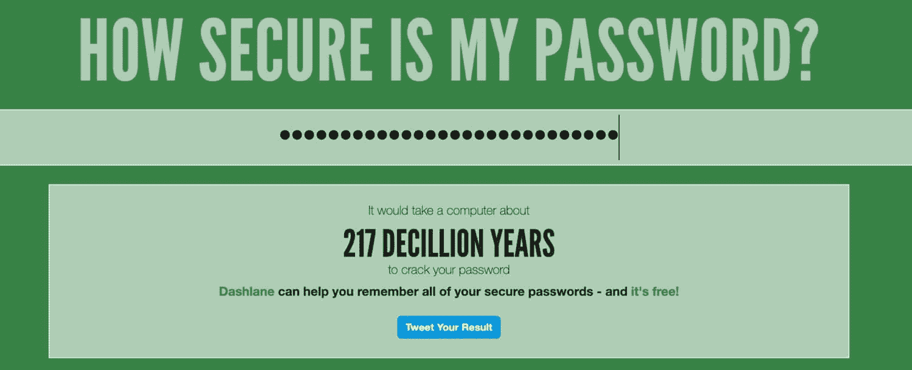

How Secure Is My Password?


[Bookmark this post for the next time you need to reset your WordPress password ASAP (no panicking necessary 😇 )Click to Tweet](https://twitter.com/intent/tweet?url=https%3A%2F%2Fkinsta.com%2Fblog%2Fchange-wordpress-password%2F&via=kinsta&text=Bookmark+this+post+for+the+next+time+you+need+to+reset+your+WordPress+password+ASAP+%28no+panicking+necessary+%F0%9F%98%87+%29&hashtags=security%2CWPCLI)

## 摘要

如果你需要更改或者你丢失了你的 WordPress 密码，你不需要惊慌。在 WordPress 中更改或重置你的密码可以很快完成。

如果简单的方法对你不起作用，你可以尝试各种方法，这取决于你是否可以访问与你的 WordPress 账户相关的电子邮件地址。

按照上面详述的方法做，你很快就会有一个新的密码和访问 WordPress 的权限。

* * *

让你所有的[应用程序](https://kinsta.com/application-hosting/)、[数据库](https://kinsta.com/database-hosting/)和 [WordPress 网站](https://kinsta.com/wordpress-hosting/)在线并在一个屋檐下。我们功能丰富的高性能云平台包括:

*   在 MyKinsta 仪表盘中轻松设置和管理
*   24/7 专家支持
*   最好的谷歌云平台硬件和网络，由 Kubernetes 提供最大的可扩展性
*   面向速度和安全性的企业级 Cloudflare 集成
*   全球受众覆盖全球多达 35 个数据中心和 275 多个 pop

在第一个月使用托管的[应用程序或托管](https://kinsta.com/application-hosting/)的[数据库，您可以享受 20 美元的优惠，亲自测试一下。探索我们的](https://kinsta.com/database-hosting/)[计划](https://kinsta.com/plans/)或[与销售人员交谈](https://kinsta.com/contact-us/)以找到最适合您的方式。