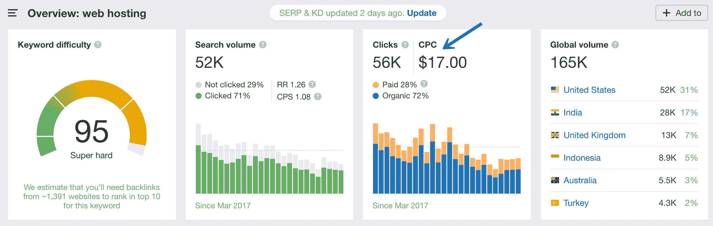
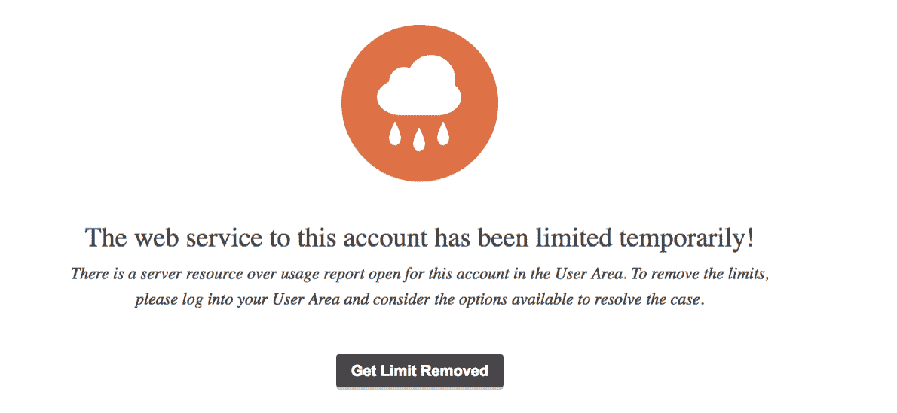

# 廉价的 WordPress 托管成本比你想象的要高 30 倍(见数学)

> 原文：<https://kinsta.com/blog/cheap-wordpress-hosting/>

作为一个已经在虚拟主机行业工作多年的人，特别是 [WordPress hosting](https://kinsta.com/wordpress-hosting/plans/) ，这引起了我的思考。如果人们了解虚拟主机公司的经济状况和他们真正的运作方式，他们的期望会改变吗？或者他们还会继续追逐廉价的 WordPress 主机提供商吗？

有很多关于虚拟主机的神话和误解，很难找出真相。大多数廉价的 WordPress 托管公司很少或从不与他们的客户分享任何关于他们的系统如何工作或 5 美元月包中真正包含什么的幕后信息。但是如果你花时间阅读政策和所有的细则，你会知道没有无限的带宽或磁盘空间，因为这是不可能的。

今天我将深入探讨虚拟主机公司是如何运作的，为什么他们中的一些收取疯狂便宜的价格，以及他们实际上是如何赚钱的。有些答案可能会让你吃惊。

[When you pay $5/month for WordPress hosting (which equates to a cup of coffee ☕), don't be surprised when it fails.Click to Tweet](https://twitter.com/intent/tweet?url=https%3A%2F%2Fbit.ly%2F3dUBJp1&via=kinsta&text=When+you+pay+%245%2Fmonth+for+WordPress+hosting+%28which+equates+to+a+cup+of+coffee+%E2%98%95%29%2C+don%27t+be+surprised+when+it+fails.&hashtags=webhosting%2Cwordpress)

## 打破虚拟主机行业

主机公司在很大程度上和其他公司一样，毛利决定了他们可以雇佣多少人来提供支持和其他服务。下面我将分解一个典型的托管公司的一些成本和费用。

### 销售商品的平均成本(30%)

对于大多数托管公司来说，销售商品的平均成本([数据中心](https://kinsta.com/knowledgebase/google-cloud-data-center-locations/)的服务器)在 30%左右。这使得他们收入的 70%用来支付员工和其他一切费用。

> 需要在这里大声喊出来。Kinsta 太神奇了，我用它做我的个人网站。支持是迅速和杰出的，他们的服务器是 WordPress 最快的。
> 
> <footer class="wp-block-kinsta-client-quote__footer">
> 
> 
> 
> <cite class="wp-block-kinsta-client-quote__cite">Phillip Stemann</cite></footer>

[View plans](https://kinsta.com/plans/)

### 营销费用(估计 10%)

如果公司仍在努力增长(希望如此)，那么另外 10%左右将用于营销费用。毕竟，在虚拟主机领域获得客户的成本实际上是最高的。

如果你走点击付费(PPC)的路线，对像“虚拟主机”这样的关键词的竞价可以高达 20 美元每次点击和[谷歌广告](https://kinsta.com/blog/how-to-use-google-adwords/)。😲这可能会改变多少印象份额和你愿意出价出现在页面顶部，以及多长时间。如果你是一家由[风投资助的](https://kinsta.com/blog/vc-route/)公司，也许你不在乎，但如果你是一家初创公司或自助公司，这就需要你有创造力。

“web hosting” keyword CPC

如今，由于竞争激烈，试图将“虚拟主机”这个词与 SEO 有机地排在一起可能需要几年时间。我们肯定是有机方法以及[内容营销](https://kinsta.com/learn/content-marketing/)的粉丝，但这是一个长期的过程，需要一致性和耐心。

你还需要准备好支付数千美元来创造惊人的常青内容，在这个利基市场竞争。一篇至少 2500 字的技术文章很容易就能卖到 1500 美元。试图将廉价内容外包给像 iWriter 这样的网站是行不通的。你需要花时间去寻找和雇佣那些擅长自己领域的自由撰稿人。这可能需要几个月，有时几年。

[The cost to acquire a customer in hosting is actually one of the highest out there. 💰Click to Tweet](https://twitter.com/intent/tweet?url=https%3A%2F%2Fbit.ly%2F3dUBJp1&via=kinsta&text=The+cost+to+acquire+a+customer+in+hosting+is+actually+one+of+the+highest+out+there.+%F0%9F%92%B0&hashtags=webhosting%2Chosting)

因此，仅营销和 COGS(服务器、基础设施)一项就意味着托管公司每赚一美元，只有 60%可用于支付工资和所有其他费用。

### 分解数字

让我们假设你决定使用廉价的 WordPress 虚拟主机，你每月支付他们 10 美元(每年 120 美元)。他们的营销文案告诉你，他们很棒，他们有 24/7 的支持，电话支持，你希望他们的体验和你打交道的大多数其他公司一样。你打电话给 GEICO、Anthem、美国电话电报公司或威瑞森，他们并不出色，但他们最终会在你与他们的战斗中解决问题。

不同之处在于，你不是每月付给他们微薄的 10 美元，他们的支持代理也不会花他们那么多钱，因为解决你手机账单的问题可以由年薪 4 万美元的人来解决，而且不需要软件工程师。

我们简单看一下数字。如果您每月向主机支付 10 美元(每年 120 美元)，一名优秀的系统管理员包括福利在内每年花费 10 万美元，那么他们需要多少客户来支付这一名员工的费用呢？

答案可能会让你大吃一惊。不是 833，因为 833 x $120 = ~ $100K。这将假设该公司没有任何商品销售或营销成本，但请记住，本例中的托管公司有 30%的 [COGS](https://en.wikipedia.org/wiki/Cost_of_goods_sold) ，10%的营销预算，因此他们带来的每一美元中只有 60 美分可用于支付员工。

## 注册订阅时事通讯

### 想知道我们是怎么让流量增长超过 1000%的吗？

加入 20，000 多名获得我们每周时事通讯和内部消息的人的行列吧！

[Subscribe Now](#newsletter)

利用上述假设，通过一些简单的数学运算就可以找到真正的答案。

10 万美元= X * 120 * 0.6
；10 万美元= 72X
1，389 = X

通过求解上面的 X，我们发现它相当于近 1400 个客户。因此，对于每 1400 名客户来说，每月 10 美元，一个主机公司就可以雇佣一个真正知道他们在做什么的系统管理员。或者这样想，如果 1，389 名客户每人每月支付 10 美元(每年 120 美元)，则年收入为 166，680 美元，扣除 30%的 COGS(服务器)和 10%的营销费用后，公司只剩下 10 万美元来支付包括福利在内的工资。

[For every 1,400 customers at $10 per month, a hosting company can afford to hire a system administrator. 💻Click to Tweet](https://twitter.com/intent/tweet?url=https%3A%2F%2Fbit.ly%2F3dUBJp1&via=kinsta&text=For+every+1%2C400+customers+at+%2410+per+month%2C+a+hosting+company+can+afford+to+hire+a+system+administrator.+%F0%9F%92%BB)

但是，一个能够解决任何出现的疯狂主机问题的系统管理员如何处理近 1400 个客户的技术问题呢？**答案是他们不能。**

这甚至没有考虑到这样一个事实，即一个真正的企业有其他的成本来使用他们的毛利减去营销，比如:

*   向创始人或高管支付薪酬
*   租金和员工
*   带宽成本和托管基础设施(高级层网络)
*   处理、接收和处理日志的复杂分析设置(弹性)
*   交易电子邮件服务
*   CDN 集成
*   内部通信等支持和票务系统
*   运行时间和性能监控工具，如 [New Relic](https://kinsta.com/blog/wordpress-performance-new-relic/)

我们使用这个模型是因为在这些术语中，数学是最容易和最简单的，几乎没有什么假设。

当你每月增加到 20 美元时，数字会对你有利一点，但仍然不是很好。在这个价位上，大约需要 700 名客户才能覆盖同一个系统管理员。即使每月 50 美元，我们仍然没有看到每 278 个客户有 1 个系统管理员的比率。正如你所看到的，在你达到每月 100 美元以上之前，经济状况根本不会对你有利。你不会想在每月 5 美元的主机上看到这些数字。😳
T3】

Struggling with downtime and WordPress problems? Kinsta is the hosting solution designed to save you time! [Check out our features](https://kinsta.com/features/)

## WordPress 虚拟主机存在的原因和便宜程度

所以，如果每月收取 10 美元的费用在经济上对客户不利，为什么这么多的托管公司会这么做呢？答案是双重的。

一是他们试图通过追加销售和隐藏费用赚很多钱。关于像[网站迁移](https://kinsta.com/wordpress-migration/)、 [SSL 证书](https://kinsta.com/blog/free-ssl-certificate/)、[域名注册](https://kinsta.com/blog/how-much-does-a-domain-name-cost/)、WHOIS 隐私、来自[停泊域名的广告收入](https://kinsta.com/knowledgebase/parked-domain/)、[专用 IP 地址](https://kinsta.com/blog/dedicated-ip-address/)、虚假 SEO 帮助、网站徽章等等。但这些并不总是发生，因为使用这些服务的人通常都想省钱，这也是他们选择这些服务的原因。

第二个是我们在主机行业中称之为的“流失和燃烧”等等，听起来不太好，那是什么意思？这是当你有一个模型，你知道你用诱饵和开关策略收费太少。你知道结果是你的客户服务会很糟糕，你知道人们会不高兴，你知道你每个季度会失去 X 个客户，你设计了你的商业模式试图取代这些 X 个客户。

[When you’re thinking about shopping for #hosting, stop thinking in terms of paying the absolute minimum. 🤔Click to Tweet](https://twitter.com/intent/tweet?url=https%3A%2F%2Fbit.ly%2F3dUBJp1&via=kinsta&text=When+you%E2%80%99re+thinking+about+shopping+for+%23hosting%2C+stop+thinking+in+terms+of+paying+the+absolute+minimum.+%F0%9F%A4%94&hashtags=webhosting%2Cstartups)

这实际上是如何进行的呢？在托管方面非常简单。你提供无限的一切(除了 CPU 或主机称之为“[工人](https://kinsta.com/blog/php-workers/)”)然后你节流那些使用大量带宽的客户端/网站。由于这些成功网站的资源使用和性能问题，你最终会暂停它们。

Account limited temporarily

然后，客户不高兴地离开，而主机很高兴，因为他们可以用一个流量很少甚至没有流量的网站来取代它们。就是这样的商业模式让托管行业名声不好。

## 不要再考虑支付绝对最低的费用

因此，当你考虑购买虚拟主机时，**不要再考虑支付绝对最低的费用，而是开始考虑你真正要买的是什么**。[支持和联系对 WordPress 如何工作有广泛了解的人](https://kinsta.com/blog/wordpress-support/)，更重要的是，如何解决问题。你买下了一个会在你的旅程中帮助你的团队。

Kinsta 正是因为这个原因成立的，这也是我们能够快速发展的原因。有一些人，我们称之为“主机跳跃者”,多年来一直在主机提供商之间跳来跳去，试图找到一个打破可怕的“教会和燃烧”或“向上销售”的商业惯例。

2018 年，Kinsta 的[客户群增长](https://kinsta.com/blog/2018-year-in-review/)超过 262%，**我们的流失率低于 4%** 。我们的客户看到了我们提供的[巨大价值，并愿意为此买单](https://kinsta.com/blog/fastest-wordpress-hosting/)。然后他们可以专注于发展他们的业务，而不是担心停机时间、 [500 个错误](https://kinsta.com/blog/500-internal-server-error/)，或者碰壁试图确定哪个 WordPress 插件导致了性能问题。

Went from [HostGator](https://kinsta.com/hostgator-alternative/) (garbage) to [Siteground](https://kinsta.com/siteground-alternative/) (not bad) to Kinsta (amazing). My site is the fastest it’s ever been, and the customer support during the migration was the best I’ve ever experienced.Joe HanleyOwner & Software Developer, Audible Genius LLC

## 摘要

当然，不是每个人都能负担得起每月数百元的托管费，但另一方面，你也应该相应地设定你的期望值。如果你每个月花在咖啡上的钱比招待客人的钱还多，你将来会受到伤害。

如果你决定使用廉价的 WordPress 虚拟主机，你应该预料到你的网站会时不时的宕机(因为每月 10 美元，你很可能会与数百名其他用户共享一台服务器)。此外，预计大多数问题不会很快得到解决。数字就是这么算出来的。

我们很想听听你对廉价 WordPress 虚拟主机的想法或者你的经历。请在评论中告诉我们！

* * *

让你所有的[应用程序](https://kinsta.com/application-hosting/)、[数据库](https://kinsta.com/database-hosting/)和 [WordPress 网站](https://kinsta.com/wordpress-hosting/)在线并在一个屋檐下。我们功能丰富的高性能云平台包括:

*   在 MyKinsta 仪表盘中轻松设置和管理
*   24/7 专家支持
*   最好的谷歌云平台硬件和网络，由 Kubernetes 提供最大的可扩展性
*   面向速度和安全性的企业级 Cloudflare 集成
*   全球受众覆盖全球多达 35 个数据中心和 275 多个 pop

在第一个月使用托管的[应用程序或托管](https://kinsta.com/application-hosting/)的[数据库，您可以享受 20 美元的优惠，亲自测试一下。探索我们的](https://kinsta.com/database-hosting/)[计划](https://kinsta.com/plans/)或[与销售人员交谈](https://kinsta.com/contact-us/)以找到最适合您的方式。