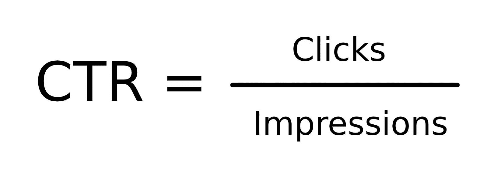
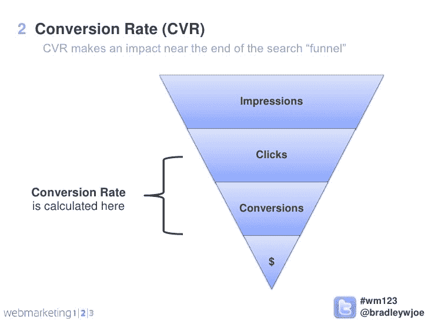
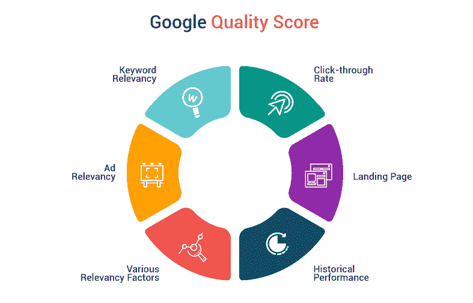
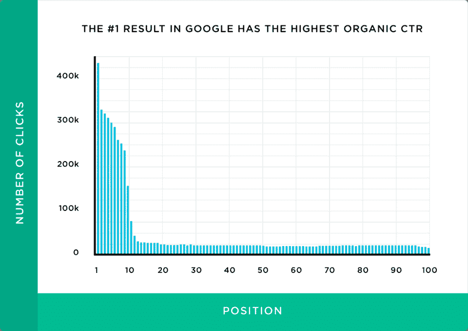
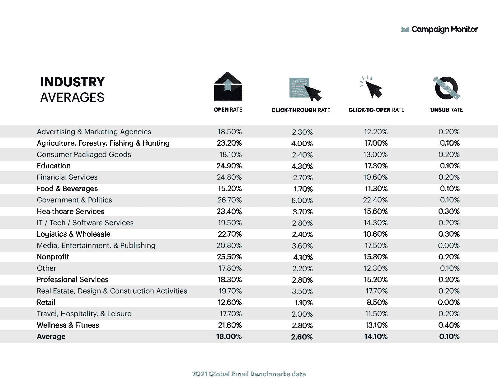
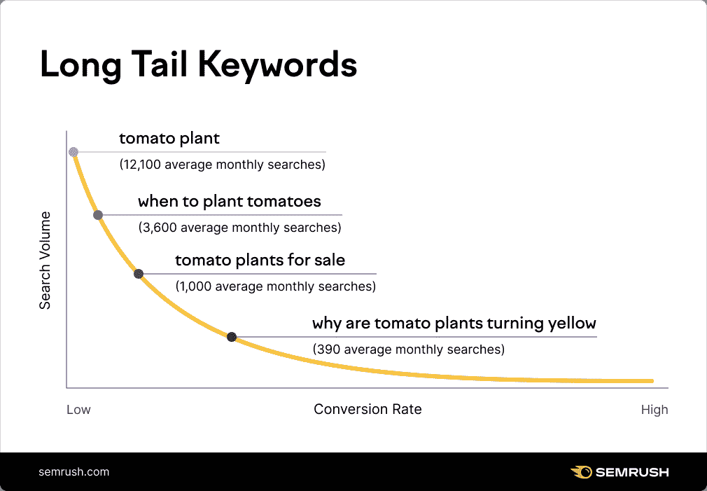
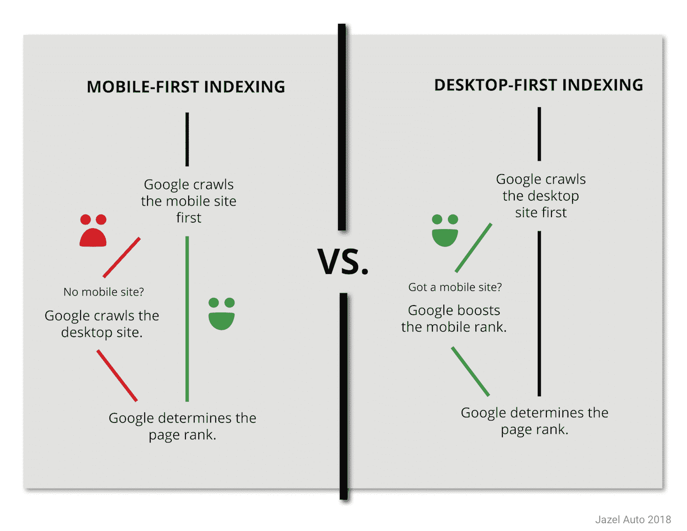

# 什么是好的点击率？如何提高你的点击率

> 原文：<https://kinsta.com/blog/click-through-rate/>

在新客户访问你的网站并购买你的产品之前，他们必须点击。

他们可能会点击谷歌搜索结果、广告、脸书邮报或电子邮件中的链接。点击会把他们带到你的网站。

点击的人越多，你网站上的潜在客户就越多。要提高销量，就要提高点击率(CTR)。

听起来很简单。但是怎么增加你的 CTR 呢？你怎么知道你现在的 CTR 值有多高？

这篇文章给出了答案。继续阅读，找出什么是点击率，什么是好的点击率，以及如何提高你的点击率。

## 什么是点击率？

点击率(CTR)是指点击一个链接的人的百分比。

例如，如果某个特定登录页面的一半访问者点击了其 CTA 按钮，则该 CTA 按钮的点击率为 50%。

> Kinsta 把我宠坏了，所以我现在要求每个供应商都提供这样的服务。我们还试图通过我们的 SaaS 工具支持达到这一水平。
> 
> <footer class="wp-block-kinsta-client-quote__footer">
> 
> 
> 
> <cite class="wp-block-kinsta-client-quote__cite">Suganthan Mohanadasan from @Suganthanmn</cite></footer>

[View plans](https://kinsta.com/plans/)

点击率是评估各种营销活动的重要指标。例如，您可以跟踪以下各项的 CTR:

*   [有机搜索](https://kinsta.com/blog/wordpress-seo/)
*   电子邮件
*   PPC 广告
*   社交媒体帖子
*   你网站上的内部链接

[准备好让您的点击率更上一层楼了吗？👀本指南旨在为您提供帮助💪 点击推文](https://twitter.com/intent/tweet?url=https%3A%2F%2Fbit.ly%2F3yVMgwn&via=kinsta&text=Ready+to+take+your+CTR+up+a+notch%3F+%F0%9F%91%80+This+guide+is+here+to+help%F0%9F%92%AA&hashtags=MarketingTips%2CCTR)

### 你是怎么计算点击率的？

计算链接的点击率很容易。

从你的链接被点击的次数开始。除以你的页面、社交媒体帖子或广告的浏览量，或者除以电子邮件收件人的数量。

然后将结果乘以 100，使其成为一个百分比。这就是你的点击率。

How to calculate CTR. (**Source:** [Summon](//summon.co/2021/01/08/how-to-calculate-your-click-through-rate/%E2%80%9D))

### 点击率告诉你什么？

假设你发送了一封电子邮件来推广你的业务。你可以从[谷歌分析](https://kinsta.com/blog/how-to-use-google-analytics/)看到，有 30 个人通过那封邮件来到你的网站。

但这有什么好处吗？

看情况。如果你只发了 50 封邮件，那就太好了。这意味着你的电子邮件是如此引人注目，与你的受众相关，以至于 60%的受众想要了解更多。

如果你发了 5000 封邮件，那就没那么令人印象深刻了。出于某种原因，你的邮件没有引起很多潜在客户的注意。低点击率让你知道你应该[改进你的活动](https://kinsta.com/blog/email-marketing-best-practices/)来吸引更多的生意。

跟踪点击率有助于你了解什么能引起你的观众的共鸣。

### 点击率与转换率

你不只是想让人们点击你网站的链接。你希望他们转化为资产下载、电子邮件列表注册，或者——最好的——销售。

所以你可能认为[转换率](https://kinsta.com/blog/conversion-rate-optimization-tips/)是一个更重要的跟踪指标。

但是你的点击率直接影响你的转化率——你能吸引越多的人访问你的网站，你就能获得越多的转化率。

点击率和转换率都在客户旅程的不同阶段提供了有价值的信息。

展示、点击和转化之间的关系。(**来源:** [网络营销 123](//www.slideshare.net/DemandWave/webmarketing123-6-paid-search-metrics-to-master-08182011%E2%80%9D) )

## 为什么你的点击率很重要？

有这么多网站和营销相关的指标，你可以跟踪。为什么要关注 CTR？

### 您可以使用 CTR 数据来优化您的营销活动

你的点击率让你知道你的观众喜欢什么。它可以告诉你，你的客户喜欢有趣的主题，或者他们更可能点击红色按钮而不是蓝色按钮。

这些信息使您可以调整活动以获得更好的效果。

### CTR 影响你的质量分数

这个只有在你运行谷歌广告的时候才适用。

谷歌给你的广告分配一个质量分数，这是他们的质量和相关性评级。谷歌使用质量分数来确定你的每次点击成本，以及它将如何对你的广告进行优先排序。

如果你想让你的广告具有成本效益并被看到，质量分数是必不可少的。几个因素决定了质量分数，包括 CTR。

Google Ad Quality Score factors. (**Source:** [CXL](//cxl.com/blog/6-mistakes-that-lose-you-money-on-google-adwords/%E2%80%9D))

### 有机 CTR(可能)是一个排名因素

搜索引擎优化专家们多年来一直在争论这一点。没有人知道你的有机点击率是否直接影响你在谷歌上的页面排名。

很有可能是这样。谷歌表示，它使用“交互数据来评估搜索结果是否与查询相关。”互动数据可能包括点击——我们不知道它们如何影响谷歌的算法。

更高的有机点击率可能会提高你的排名，带来更多的流量，所以这是值得努力的。

### 更高的点击率可以提高投资回报率和收入

提高你的点击率意味着同样的投资可以获得更多的网站访客(和更多的转化率)。

当点击率高时，一封电子邮件、一个广告或一个登陆页面将会获得更多的收入。这使得你的营销工作更具成本效益。

## 什么是好的点击率？

这个问题没有正确的答案。

一个“好”的 CTR 取决于多种因素。我们稍后将讨论一些基准，但重要的不是你与其他公司相比如何，而是你是否在过去的努力基础上有所改进。

### 哪些因素影响点击率？

这里有几件事会影响你的点击率。有关优化这些因素以获得更好点击率的更多细节，请向下滚动到下面的“如何提高您的点击率”部分。

影响 CTR 的因素包括:

*   **与受众的相关性**:人们更有可能点击针对他们需求或兴趣的东西。
*   **搜索引擎排名:**在搜索引擎结果页面(SERP)上排名较高的页面获得较高的点击率。
*   **链接的位置:**页面或广告上的一个链接或 CTA 按钮可以影响多少人点击。
*   **视觉外观:**图像、颜色、布局、大小影响 CTR。
*   **行业:**有些行业的点击率比其他行业高。

Button appearance affects CTR.

每个企业都有不同的良好点击率基准。但我们知道你想看一些统计数据。

让我们看看几个不同渠道的预期点击率。

## 有机搜索点击率

提高你的有机搜索点击率是为了排名更高。

谷歌搜索页面的顶部结果平均点击率为 31.7% 。第二个结果的平均点击率为 24.7%，第三个为 18.7%。

只有 0.78%的搜索者从第二页点击了一些东西。

只要提升一两个位置，你就能显著提高你的点击率。

Organic CTR by SERP position. (**Source:** [backlink.io](//backlinko.com/google-ctr-stats%E2%80%9D))

你可以通过做搜索引擎优化(SEO)来[提高你在 Google](https://kinsta.com/blog/what-is-google-my-business/) 和其他搜索引擎上的排名。

如果你刚刚开始搜索引擎优化，我们为你创建了一个[初学者指南](https://kinsta.com/blog/what-does-seo-stand-for/)。

搜索引擎优化包括如下操作:

*   选择目标关键字并将其添加到您的网页中
*   定期创建新内容
*   从高质量网站获得[到您网站的反向链接](https://kinsta.com/blog/google-sitelinks/)
*   确保你遵循[技术最佳实践](https://kinsta.com/blog/web-design-best-practices/)，比如拥有一个手机友好型网站

有些关键词比其他关键词更有可能获得高点击率。例如，平均而言，包含更多单词的搜索会获得更多点击。

假设你到达了 SERP 的第三个位置。对于一个单词的关键词，你可以在那个位置期待一个 [5.15%](https://www.advancedwebranking.com/ctrstudy/) 的点击率。但是对于一个四字关键词，第三个结果的平均 CTR 是 10.43%。

## 电子邮件点击率

根据 Campaign Monitor 的数据，平均电子邮件点击率为 [2.6%](https://www.campaignmonitor.com/resources/guides/email-marketing-benchmarks/) 。其他电子邮件服务已经[提出了不同的数字](https://kinsta.com/blog/email-marketing-statistics)。

平均点击率因行业而异。正如你在下表中看到的，来自零售企业的电子邮件平均点击率只有 1.1%，而政府和政治的点击率高达 6%。

Email stats by industry. (**Source:** [Campaign Monitor](//www.campaignmonitor.com/resources/guides/email-marketing-benchmarks/%E2%80%9D))

提高电子邮件点击率的最好方法是为你的受众创建吸引人的相关活动。

但这不是唯一的因素。

例如，一天中你发送邮件的时间会影响有多少人打开和点击它——邮件点击率在下午 5 点左右达到峰值。

各大[电子邮件营销平台](https://kinsta.com/blog/email-marketing-software/)都让你看到自己的点击率。找出获得最佳点击率的最佳方法是自己进行测试。

## PPC 广告点击率

[点击付费(PPC)广告](https://kinsta.com/blog/how-to-use-google-adwords/)包括谷歌广告、脸书广告或微软广告。

## 注册订阅时事通讯

### 想知道我们是怎么让流量增长超过 1000%的吗？

加入 20，000 多名获得我们每周时事通讯和内部消息的人的行列吧！

[Subscribe Now](#newsletter)

谷歌广告在搜索网络上的平均点击率为 3.17%，在展示网络上为 0.46%，但这可能因行业不同而有很大差异。

点击率最高的是约会行业，为 6.05%，最低的是科技行业，为 2.09%。

脸书广告平均 CTR 为 [0.89%](https://www.wordstream.com/blog/ws/2019/11/12/facebook-ad-benchmarks) ，微软广告(原名必应广告)平均 CTR 为 [2.83%](https://www.wordstream.com/blog/ws/2017/11/06/bing-ads-performance-benchmarks) 。

目标是至关重要的 PPC 广告。如果你随机向 1000 个人展示一则脸书的厨房用品广告，它的点击率会低于向 1000 个对烹饪感兴趣的人展示的广告。

## 提高点击率的 8 个技巧

即使对你的活动做一些小的改变也能增加你的点击率(和转化率)。

这是我们提高点击率的八大技巧。

### 1.瞄准你的观众

有些人永远不会点击你的链接。

别担心他们。

当谈到提高你的点击率，一半的战斗只是把你的链接放在正确的人面前。这些人的个人兴趣或需求使他们可能对你的信息感兴趣。

我们已经讨论过 PPC 广告中目标定位的重要性。你的目标选择将取决于广告网络。

例如，谷歌广告搜索网络上的广告瞄准了搜索特定术语(以及其他因素)的人。脸书广告的优势在于你可以瞄准有特定兴趣的人。

确保你的广告与你的目标选择相匹配会带来更好的点击率。

为了提高你的电子邮件点击率，将你的订阅者列表细分。

细分市场是您的联系人列表的子集，有一些共同点。例如，您可以根据以下内容进行细分:

*   位置
*   人口统计数据
*   生活方式和兴趣
*   行为(过去与您的网站或电子邮件的互动)

良好的列表细分可让您发送极具针对性的电子邮件活动。有人来到你的网站，并放弃了购物车，可以得到不同的信息，比一个新的接触，谁只下载了一份白皮书至今。

### 2.做关键词研究

这条建议适用于付费搜索和有机搜索。

选择最佳关键词可以提高你的点击率，为你的网站带来更多流量。

从[开始，头脑风暴尽可能多的你能想到的相关关键词](https://kinsta.com/blog/keyword-research/)。想象一下你的理想客户会寻找什么，并写下来。

确保你的列表中包含长尾关键词。

长尾关键词是搜索量低的术语或短语。它们通常有几个单词长——尽管，与普遍的看法相反，这不是定义的一部分。

长尾关键词最酷的一点是，它们通常非常具体。如果你的目标关键词是“篮子”，点击率可能不会很高。搜索这个词的人可能会寻找任何篮子。

所有的 Kinsta 托管计划都包括来自我们资深 WordPress 开发者和工程师的 24/7 支持。与支持我们财富 500 强客户的同一个团队聊天。查看我们的计划！

但是如果你的目标是“手工柳条洗衣篮”，你会接触到你的人。虽然这个词的搜索量比“篮子”低，但搜索它的人更有可能点击你的链接。

An example of Long-tail keyword research. (**Source:** [Semrush](//www.semrush.com/kb/685-what-are-long-tailed-keywords%E2%80%9D))

另一种找到高点击率关键词的方法是弄清楚人们为了进入你的网站已经在搜索什么。谷歌加密了很多这类信息，但你可能会在谷歌搜索控制台的“性能”页面上找到一些搜索术语。

一旦你有了可能的关键词列表，开始缩小范围。可以使用 [Google 的关键词规划器](https://ads.google.com/home/tools/keyword-planner/)来查找每个关键词的月搜索量。排除任何没有搜索到的内容。您可能还想限制非常有竞争力的高容量关键词。

但最重要的是搜索意图。有人搜索这个关键词是想找到和你一样的内容吗？

如果是这样，可能会导致点击率高。

### 3.改善你的 SERP 列表

你可以做一些事情来吸引更多的人点击你在搜索结果页面上的链接。

#### 写更好的元描述

元描述是 SERP 页面标题下面的文字。它的目的是告诉人们你的页面是关于什么的。

一个[好的元描述](https://kinsta.com/blog/meta-description-wordpress/)说服人们点击。要清楚如果用户点击链接，他们会得到什么。你能回答一个具体的问题吗？提供有帮助的下载？

考虑加入一个 CTA，比如“了解更多”

#### 优化您的 URL

您的 URL 是搜索者在点击之前可以看到的页面的少数部分之一。好好利用它。

选择一个准确描述你的网页的网址，比如 example.com/learn-to-juggle 或 example.com/running-shoes.

#### 简化你的标题

大多数人在 SERP 上做的第一件事是浏览每个结果的标题，找到最相关的一个。

你的标题标签应该能让你的网页的目的一目了然。

### 4.移动友好

正如我们已经讨论过的，你在 Google SERP 上的排名会影响你的有机 CTR。

如果你的网站没有针对移动设备进行优化，它可能会阻碍你在谷歌上获得更高的点击率。

谷歌已经转向移动优先索引。这意味着谷歌的抓取、索引和排名系统使用你网站的移动版本，而不是桌面版本。

How mobile-first indexing works. (**Source:** [Jazel](//www.jazelauto.com/is-googles-mobile-first-preference-hurting-your-car-marketing/%E2%80%9D))

如果你不确定你的网站是否适合手机，你可以在这里测试一下。

除非你使用的是旧的主题或者最近没有更新，否则你的 WordPress 站点可能已经是移动响应的了。浏览你的网站并确保不会有什么坏处。

### 5.写好邮件主题

如果他们不打开你的邮箱，他们就不能点击你的链接。如果他们对你的主题不感兴趣，他们就不会打开。

找出哪些主题能引起读者共鸣的最好方法是[进行 A/B 测试](https://kinsta.com/blog/google-optimize/)——这是大多数电子邮件营销平台都有的功能。

但是为了让你开始，这里有一些写好主题的建议:

*   传达打开电子邮件的好处。里面有报价吗？他们会学到有趣的东西吗？
*   个性化主题行。电子邮件营销软件可以帮助这一点。
*   添加紧急程度(适当时)。让他们知道他们必须马上行动。
*   引人注目和/或幽默。
*   问一个有说服力的问题。例如，“你的数据安全吗？”
*   不要过度使用大写字母、标点符号或表情符号。
*   保持简短。

### 6.在广告中使用高质量的图像

如果你用图片做广告，确保你选择的是高质量的和吸引眼球的。

大多数人会直接跳过广告，所以你没有太多时间向观众展示你能提供什么。清楚地展示你的产品、标志或信息。

有文字的图片可以很好，但是不要用太多的文字。人们不会停止阅读它们。

用[不同的图片](https://kinsta.com/blog/optimize-images-for-web/)测试你的广告，看看什么有效。

### 7.使链接突出

如果某个链接或 CTA 按钮引起了人们的注意，他们更有可能点击它。

对于你在有机搜索结果页面上的链接，你无能为力。但是对于展示广告、电子邮件和登录页面，您可以尝试以下变量:

*   颜色
*   大小
*   安置
*   文本

在登录页面或电子邮件中，尽量把你的按钮或链接放在“文件夹上方”，这意味着人们不必滚动太远就能看到它。

如果您使用的是 CTA 按钮，请确定它足够大以便阅读，并且文本清晰易读。如果你的电子邮件订阅者不得不眯着眼看红色按钮上的橙色小文字，他们可能不会点击。

简明扼要。一个写着“获取电子书”的链接会比“点击这里下载免费的关于当今行业趋势的电子书”更能吸引读者的眼球。

### 8.测试、跟踪和优化

我们希望这些建议能帮助你提高你的点击率，但是没有一个建议清单能和你通过 A/B 测试学到的东西相比。

A/B 测试是一种比较网页、电子邮件或广告的两种变体以查看哪一种表现最佳的方法。例如，您可以发送相同的电子邮件，但主题不同。

一个主题行是严肃的，另一个有双关语。

如果一语双关的主题获得了更高的点击率，你可以考虑在将来做更多幽默的主题。

你也可以对你的 WordPress 网站进行 A/B 测试。

通过不断的测试和优化，你可以最大化你的点击率，增加网站的流量。

[How do you increase your CTR? And how do you know if your current CTR is any good? 🤔 All the answers (and more!) are right here 👇Click to Tweet](https://twitter.com/intent/tweet?url=https%3A%2F%2Fbit.ly%2F3yVMgwn&via=kinsta&text=How+do+you+increase+your+CTR%3F+And+how+do+you+know+if+your+current+CTR+is+any+good%3F+%F0%9F%A4%94+All+the+answers+%28and+more%21%29+are+right+here+%F0%9F%91%87&hashtags=MarketingTips%2CPPC)

## 摘要

点击率是帮助你了解受众的一个重要指标。用正确的信息瞄准正确的人可以提高你的点击率，为你的网站带来更多的流量。

进来的流量越多，转化的潜力就越大。

想从你的网站访问者那里获得更多的转化率吗？[查看我们的转化率优化技巧](https://kinsta.com/blog/conversion-rate-optimization-tips/)。

* * *

让你所有的[应用程序](https://kinsta.com/application-hosting/)、[数据库](https://kinsta.com/database-hosting/)和 [WordPress 网站](https://kinsta.com/wordpress-hosting/)在线并在一个屋檐下。我们功能丰富的高性能云平台包括:

*   在 MyKinsta 仪表盘中轻松设置和管理
*   24/7 专家支持
*   最好的谷歌云平台硬件和网络，由 Kubernetes 提供最大的可扩展性
*   面向速度和安全性的企业级 Cloudflare 集成
*   全球受众覆盖全球多达 35 个数据中心和 275 多个 pop

在第一个月使用托管的[应用程序或托管](https://kinsta.com/application-hosting/)的[数据库，您可以享受 20 美元的优惠，亲自测试一下。探索我们的](https://kinsta.com/database-hosting/)[计划](https://kinsta.com/plans/)或[与销售人员交谈](https://kinsta.com/contact-us/)以找到最适合您的方式。