# 如何修复“可点击的元素靠得太近”的错误(3 种方法)

> 原文：<https://kinsta.com/blog/clickable-elements-too-close-together/>

未解决的移动可用性问题会对你网站的流量产生重大影响。谷歌搜索控制台可能会警告你的一个常见问题是“可点击元素过于靠近”错误，这可能意味着你的网站对于移动用户来说导航起来很复杂。

超过 43.2 亿人通过他们的移动设备访问互联网。因此，尽快解决这个可点击元素的错误是至关重要的。幸运的是，有多种方法可以做到这一点，让你的网站对手机更加友好。

在本文中，我们将解释什么是“可点击的元素靠得太近”的问题，讨论为什么会发生这种情况，并通过三种方法来解决这个问题。我们还将解释什么是“内容比屏幕宽”错误，以及如何解决它。

我们开始工作吧！

### 更喜欢看[视频版](https://www.youtube.com/watch?v=I1RJuxAO6ik)？


## “可点击的元素靠得太近”的错误是什么

简而言之，移动可用性错误[会使你的 WordPress 网站无法访问](https://kinsta.com/blog/web-design-best-practices/#accessibility-standards)，并且对移动用户的导航更具挑战性。你可以使用谷歌搜索控制台的[移动可用性报告](https://support.google.com/webmasters/answer/9063469?hl=en)来测试你的网站。


> Kinsta 把我宠坏了，所以我现在要求每个供应商都提供这样的服务。我们还试图通过我们的 SaaS 工具支持达到这一水平。
> 
> <footer class="wp-block-kinsta-client-quote__footer">
> 
> 
> 
> <cite class="wp-block-kinsta-client-quote__cite">Suganthan Mohanadasan from @Suganthanmn</cite></footer>

[View plans](https://kinsta.com/plans/)


谷歌搜索控制台移动可用性报告工具


您可能会遇到六种主要的移动可用性问题，分别是:

1.  使用不兼容的插件
2.  未设置视口
3.  视窗未设置为“设备宽度”
4.  文本太小，无法阅读
5.  内容比屏幕宽
6.  可点击的元素靠得太近

作为该报告的一部分，谷歌搜索控制台将检查您网站的所有可点击元素，如按钮和链接。这样做的目的是验证移动用户是否可以仅使用触摸而不是使用键盘或鼠标轻松地与您的网站元素进行交互。

如果 Google Search Console 确定您的可点击元素对移动用户构成了挑战，它将在您的摘要报告中包含“可点击元素过于接近”错误。


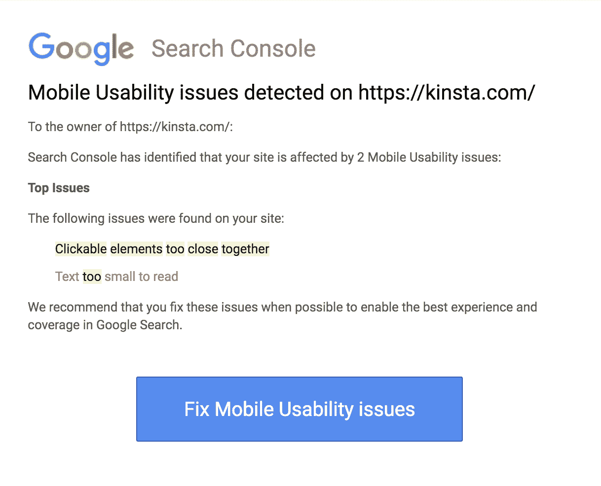

一份来自谷歌搜索控制台的手机可用性问题报告


如果您点击错误，它会将您带到详细信息和状态页面。在此屏幕上，您可以了解有关该问题的更多信息，包括受影响的页面。


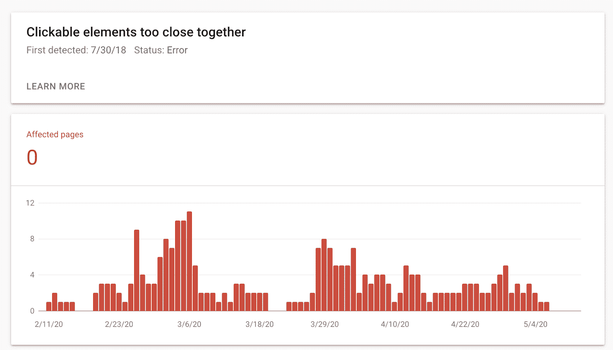

谷歌搜索控制台“可点击元素靠得太近”错误


本质上，可点击元素错误是一个警告，表明你的 WordPress 站点上的可点击元素太小，移动用户无法舒适地与之交互。

或者，这可能意味着它们足够大，但位置过于靠近相邻元素。如果按钮、链接和其他可点击的项目过于密集，用户可能会点击错误的项目，这会损害用户体验(UX)。

尽管可点击的元素靠得太近被归类为移动可用性错误，解决这个问题也可以提高你的网站的可访问性。例如，有灵巧问题的人可能会喜欢交互元素之间的一些额外空间。相比之下，有视觉相关问题的用户可能会发现使用大而清晰的按钮和链接更容易。

[未解决的移动可用性问题会对您网站的流量产生巨大影响📉在这里找到解决方案，让您的交通保持在正轨上⬇️ 点击发布推文](https://twitter.com/intent/tweet?url=https%3A%2F%2Fkinsta.com%2Fblog%2Fclickable-elements-too-close-together%2F&via=kinsta&text=Unresolved+mobile+usability+issues+can+have+a+huge+impact+on+your+website%E2%80%99s+traffic+%F0%9F%93%89+Find+the+solution+right+here+and+keep+your+traffic+on+track+%E2%AC%87%EF%B8%8F&hashtags=MobileDesign%2CUX)


### 为什么会出现“可点击元素靠得太近”的错误

各种因素都可能导致“可点击元素靠得太近”的问题。有时，这只是因为谷歌无法在渲染过程中请求必要的资源。如果是这种情况，那么你可以尝试使用[手机友好测试](https://search.google.com/test/mobile-friendly)，看看它是否通过。如果有，你可以忽略它。

这个问题也可能是由于您的[网站的设计](https://kinsta.com/blog/web-design-best-practices/)造成的。例如，如果你试图在一个网页上压缩太多的交互元素，你可能会看到这个移动可用性错误。

可点击元素错误的另一个原因是网站设计的[移动响应](https://kinsta.com/blog/google-mobile-first-index/)有问题。你的网站应该是灵活的，能够自动适应访问者的特定设备，以提供最好的 UX。然而，如果你的网站没有响应，这可能会导致可用性问题。

更具体地说，如果你的网站没有响应，它的某些部分可能会在特定的屏幕上被拉长、缩小或扭曲。在屏幕较小的设备上，可点击的元素可能会显得拥挤或扭曲。

确定一些发生这种错误的标准和潜在原因可以帮助您更好地理解为什么您的网站会遇到移动可用性问题。它还将帮助您确定如何解决问题。


## 如何修复“可点击的元素靠得太近”的错误(3 种方法)

如果移动用户很难浏览你的网站，是什么阻止他们浏览网站呢？防止此问题对于尽快解决所有移动可用性问题至关重要。让我们来看看三种方法，你可以用来解决“可点击的元素过于接近”的错误，并为您的移动用户提供更好的 UX。

### 1.使用 YellowPencil 可视化定制插件

YellowPencil 可视化定制器是一个前端 [WordPress 插件](https://kinsta.com/knowledgebase/wordpress-plugin/)，可以让你无需任何编码就能编辑你网站的 CSS 和主题文件。


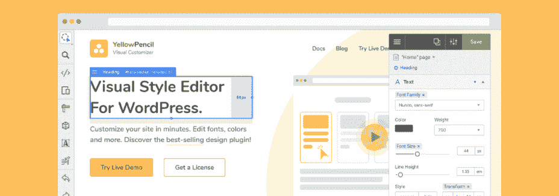

The YellowPencil 视觉定制器 WordPress 插件


这个插件可以方便地修改你的点击目标的大小，比如让你的按钮变大。您还可以通过更改可点击元素之间的边距和间距来在它们之间创建更多的空间。

你可以免费下载 YellowPencil 插件，也可以购买[常规或扩展许可](https://yellowpencil.waspthemes.com/)。要使用它，首先在你的 WordPress 网站上安装并激活它，浏览到**插件** > **添加新的**，搜索插件，然后点击**立即安装** > **激活**。


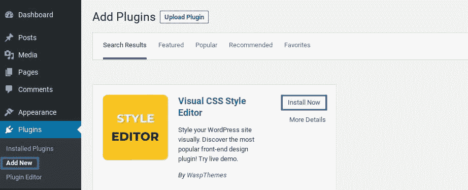

在 WordPress


安装 YellowPencil 插件的选项

接下来，导航到**黄色铅笔** > **定制**。在**定制**选项卡下，选择**开始吧！**


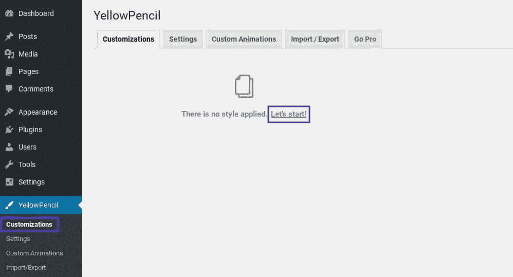

The yellow pencil WordPress 插件【定制】页面


可视化定制器界面将加载并提示您选择触发移动可用性错误的页面。


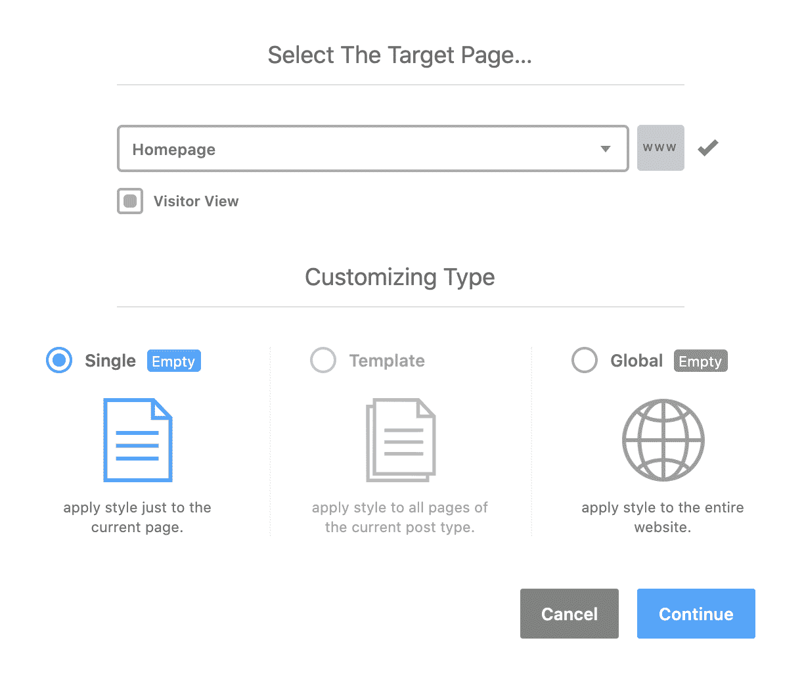

The YellowPencil 可视化定制器插件接口


您可以将更改应用到该特定页面或整个网站。如果许多页面出现可点击元素错误，您可能希望选择**全局。**

做出选择，然后点击**继续。**现在，您可以通过选择每个可点击的元素来浏览您的网页。YellowPencil 将显示该元素的编辑选项面板。


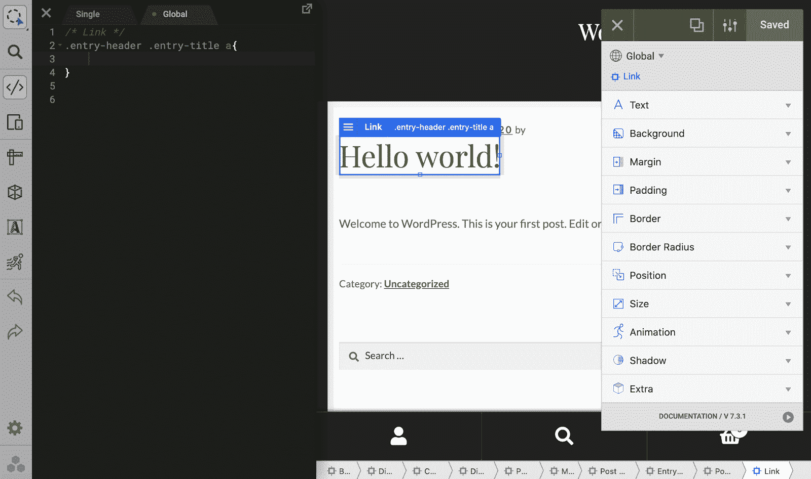

YellowPencil 可视定制器可点击元素的 CSS 选项


例如，在下面的截图中，我们选择了**填充**，并在所有边上添加了 10 个像素，以增加可点击目标之间的空间:


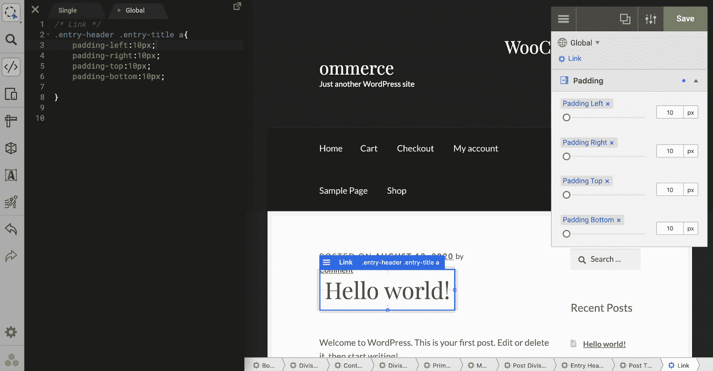

yellow pencil 插件的可视化定制器中的填充设置


**大小**和**位置**的设置也有助于解决“可点击元素靠得太近”的错误。虽然这不是必需的，但是如果您想直接编辑 CSS 代码，您可以通过左侧面板来完成。

然后你可以继续下一个导致移动可用性问题的因素，并重复这个过程。当您对您的更改感到满意时，单击绿色的**保存**按钮。
T3】

### 2.确保所有可点击的目标至少为 48px

不可能创建一个单一的、静态的设计，看起来很好*并且*在所有设备上都能正确运行。相反，如果你的目标是通过使用设备无关像素(dpi)定义所有可点击的目标来创建一个*灵活的*布局，那将是最好的。使用 dpi 定义的元素可以根据用户的屏幕大小自动缩放。

在移动设备上，推荐的最小触摸目标是 [48×48 像素](https://web.dev/accessible-tap-targets/)。相当于 9 mm 左右，对于一般人的指垫来说已经足够了。

因此，如果您正在努力找出问题的根源，查看每个元素的 dpi 可能会有所帮助。如果低于推荐的触摸目标(如 24px)，您可以增加填充，使其达到 48px。

你可以使用 [Chrome DevTools](https://developers.google.com/web/tools/chrome-devtools) 或 [Firefox DevTools](https://developer.mozilla.org/en-US/docs/Tools/Page_Inspector/How_to/Examine_grid_layouts) 检查可点击区域的计算值，这取决于[你更喜欢哪个浏览器](https://kinsta.com/browser-market-share/)。我们将以 Chrome 为例。

要检查你的 WordPress 站点上的一个可点击元素的 dpi 值，在 Chrome 浏览器标签中打开它，导航到显示“可点击元素太靠近”错误的页面。在页面上点击右键，选择**检查**。


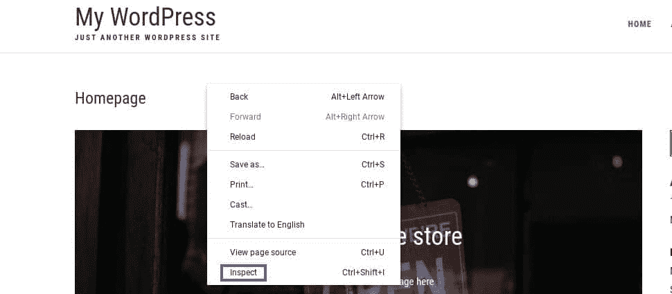

Chrome 浏览器中的“检查”选项


点击**检查**将打开 Chrome DevTools。在顶部，点击显示移动设备的图标，这将把你带到**切换设备工具栏**屏幕。

## 注册订阅时事通讯


### 想知道我们是怎么让流量增长超过 1000%的吗？

加入 20，000 多名获得我们每周时事通讯和内部消息的人的行列吧！

[Subscribe Now](#newsletter)


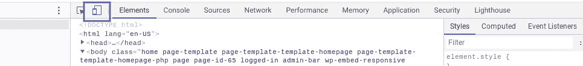

Chrome DevTools 中的“切换设备工具栏”选项


在左边的预览面板中，你会看到你的站点的移动设备模拟。如果您将鼠标悬停在任何可点击的元素上，您可以在右侧查看计算值:


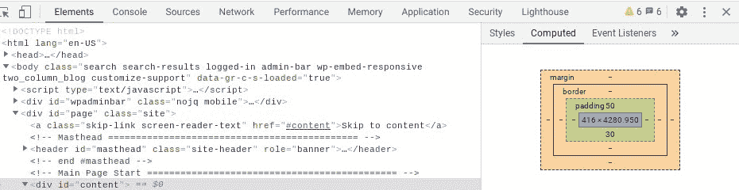

谷歌 Chrome DevTools 控制台


如果需要，你可以通过直接[编辑你的 CSS](https://kinsta.com/blog/wordpress-css/) 和站点文件或者使用一个插件比如 YellowPencil 来调整一个元素的大小。

### 3.检查输入法

如果你试图修复“可点击的元素靠得太近”的错误，这可能有助于[检查输入法](https://www.w3.org/WAI/WCAG21/Understanding/target-size.html)。它指的是用户用来浏览你的网站并与之互动的方法或设备。更具体地说，你可以看到他们是在使用智能手机、平板电脑还是其他设备。

例如，触摸被认为是一种不精确的输入方法。正如我们刚刚讨论的，使用 CSS 来增加触摸目标的大小或添加额外的填充可以让使用触摸设备的访问者更容易地与您的网站进行交互。

然而，确定用户的设备并不是一门精确的科学。这种技术使用所谓的“指针”来检查用户的主要输入法，它可以有两个值:

*   **粗**:设备的主要输入方式是触摸。
*   **精**:输入法是鼠标和触控板。

请注意，如果触摸是用户的主要输入方式，这表明此人正在智能手机或平板电脑上查看您的网站。

然而，触摸屏的存在并不能保证有人在使用移动设备。他们可能正在使用一台支持触摸屏的大型笔记本电脑访问您的网站，或者他们可能已经将蓝牙设备连接到了他们的智能手机上。

如果指针返回一个粗略的值，您可以使用 CSS 调整可点击目标的大小。要做到这一点，你可以在你的 [WordPress 主题](https://kinsta.com/best-wordpress-themes/)的 CSS 文件中放置以下内容(或者通过使用诸如 YellowPencil 这样的插件):

```
.container a {
  padding: .2em;
}
@media (pointer: coarse) {
  .container a {
    padding: .8em;
  }
} 
```

在你调整你的 CSS 之后，你可以[告诉谷歌重新抓取你的网站](https://kinsta.com/blog/submit-website-to-search-engines/)以确定这是否已经解决了问题。

或者，你可以要求谷歌使用 [URL 检查工具](https://support.google.com/webmasters/answer/9012289)重新抓取单个 URL。通过该工具提交您的 URL 后，选择**请求索引**。然后，检查工具将测试 URL 是否有任何明显的索引问题。

假设 Google 没有发现任何问题，那么这个页面就有资格被索引。


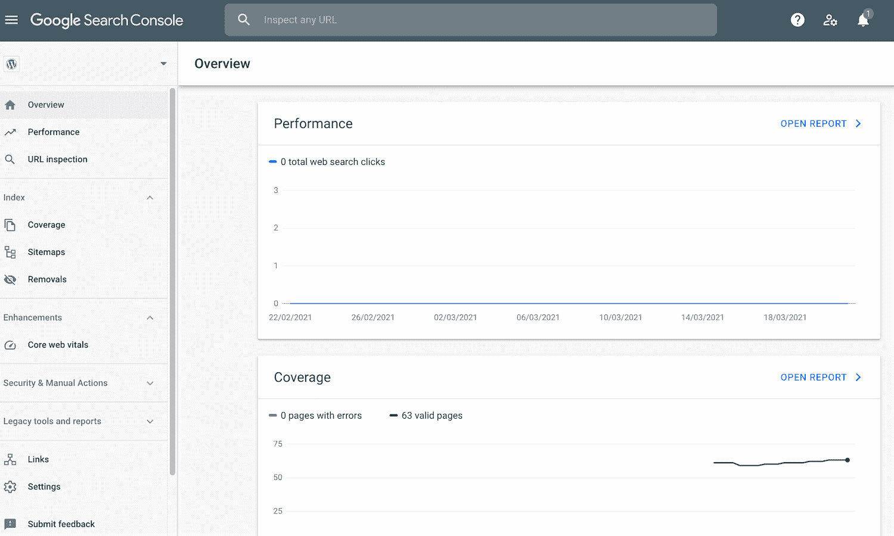

谷歌搜索控制台为索引请求页面排队


或者，如果你有大量的 URL，你可以提交一个站点地图。对于需要重新索引的每个页面，[用最后修改日期更新其](https://www.sitemaps.org/protocol.html)*[<lastmod>](https://www.sitemaps.org/protocol.html)*[标签](https://www.sitemaps.org/protocol.html)。然后你可以使用[谷歌的网站地图报告](https://support.google.com/webmasters/answer/7451001)工具提交这个网站地图。


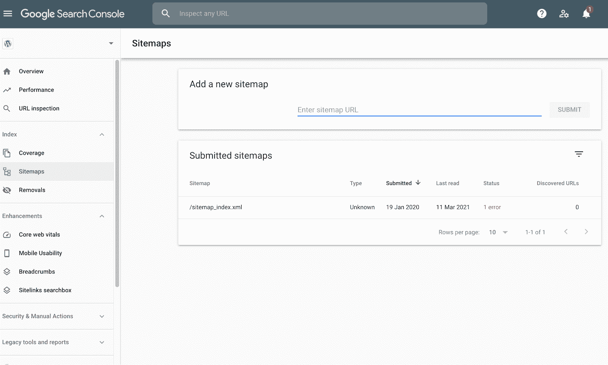

通过谷歌搜索控制台提交网站地图


在大多数情况下，你的网站地图会立即通过。然而，谷歌可能需要一些时间来抓取你的网站地图中的所有 URL，这取决于网站大小、流量和活动等因素。也不能保证谷歌会抓取你网站地图中的每一个网址。

厌倦了体验你的 WordPress 网站的问题？通过 Kinsta 获得最好、最快的主机支持！[查看我们的计划](https://kinsta.com/plans/?in-article-cta)

## 什么是“内容比屏幕宽”错误

你可能还记得，谷歌搜索控制台可能会警告你各种手机可用性错误。除了“可点击的元素靠得太近”之外，你的总结报告还可能包括“内容比屏幕宽”的问题。


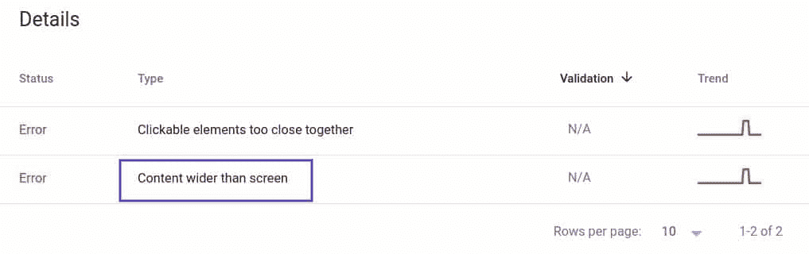

谷歌搜索控制台的“内容比屏幕宽”错误


此问题将出现在 Google 搜索控制台中与“可点击元素”错误相同的位置。同样，它也有各种各样的潜在原因。

### 如何修复“内容比屏幕宽”错误


### 为什么会出现“内容比屏幕宽”的错误

当您的网站设计水平扩展，迫使移动用户横向滑动以查看“屏幕外”内容时，会出现此错误。为了提供良好的用户体验，你应该尽可能避免水平滚动。

如果在 CSS 声明中使用绝对值，您更有可能遇到“内容比屏幕宽”的问题。由于不灵活的布局会导致“可点击元素”的错误，在同一个手机可用性报告中遇到这两个错误并不罕见。

## 如何修复“内容比屏幕宽”错误(5 种方法)

如果您的报告包含“内容比屏幕宽”错误，您可以使用一些简单的方法来解决它。让我们来看看五个最常见的选项。

### 1.避免在 CSS 声明中使用绝对变量

修复“内容比屏幕宽”错误的最好方法之一是避免在 CSS 声明中使用绝对变量。您的内容不应该需要特定的视口来正确显示和运行。

因此，您应该为 CSS 元素选择[相对宽度和位置值](https://www.freecodecamp.org/news/how-to-use-the-position-property-in-css-to-align-elements-d8f49c403a26/)，而不是使用绝对值。尽可能使用相对值，您可以创建灵活的布局，以适应各种屏幕大小。

### 2.为图像指定最大宽度

具有固定尺寸的图像可能看起来比视窗大，从而触发“内容比屏幕宽”错误。为了确保您的图像根据屏幕尺寸缩放，最好[将所有图像的最大宽度指定为 100%](https://stackoverflow.com/questions/50255280/wordpress-set-image-width-to-100-and-set-max-width-to-inserted-width#) 。

这将迫使图像缩小以适应可用空间。即使你使用了`max-width`，你也应该在你的`<image>`标签中使用宽度和高度属性，因为现代的网络浏览器使用这些信息来为图像的加载预留空间。使用`<image>`标签，当你的图像最终出现在屏幕上时，你可以避免布局偏移。

### 3.使用元视口标签

默认情况下，移动浏览器以桌面屏幕宽度呈现页面，通常在 980 像素左右。然后，浏览器将尝试通过增加字体大小和缩放内容以适应当前屏幕尺寸来优化您的页面。

不幸的是，这种默认行为会导致不一致。一些用户可能需要放大才能阅读您的内容并与之交互，这就是您可能会看到此错误的原因。

不要依赖这种默认行为，你应该给浏览器指示如何控制页面的尺寸和比例。你可以通过[将一个 meta viewport 标签](https://developer.mozilla.org/en-US/docs/Mozilla/Mobile/Viewport_meta_tag)插入到你的文档的头部来实现。

### 4.使用现代 CSS 布局技术

你也可以通过改变网站的布局来修正“内容比屏幕宽”的错误。为了帮助你[创建更加灵活的布局](https://kinsta.com/blog/responsive-web-design/#the-building-blocks-of-responsive-web-design)，你可能想要考虑实现像 [Flexbox](https://kinsta.com/blog/responsive-web-design/#flexbox-layout) 、 [CSS 网格布局](https://css-tricks.com/snippets/css/complete-guide-grid/)，或者[多列布局](https://developer.mozilla.org/en-US/docs/Web/CSS/CSS_Columns) (Multicol)这样的技术。

### 5.在适当的地方使用 CSS 媒体查询

[媒体查询](https://kinsta.com/blog/responsive-web-design/#media-queries)可以根据用户设备(包括触摸屏)轻松改变风格。因此，如果此时您仍在处理“内容比屏幕宽”错误，我们建议在适当的时候使用 CSS 媒体查询。

做出这些改变后，是时候测试一下你是否成功解决了“内容比屏幕宽”的错误了。您可以通过重新运行移动可用性报告并使用我们在下一节中讨论的步骤验证修复来做到这一点。

## 如何验证和确认您的错误解决方案

不管您正在处理上述哪种错误，也不管您使用什么方法来修复它，确定您的更改是否解决了问题是非常重要的。你可以通过重新运行谷歌的手机可用性测试来做到这一点。

为此，请返回到您的[移动可用性报告](https://support.google.com/webmasters/answer/9063469?hl=en)并找到**“可点击元素过于接近”**错误。接下来，选择**验证修复**选项。

请注意，如果您试图验证和确认“内容比屏幕宽”的错误解决方案，可以重复这些相同的步骤然后，谷歌会抓取你的网站，你会收到一条消息，让你知道它正在验证的变化。


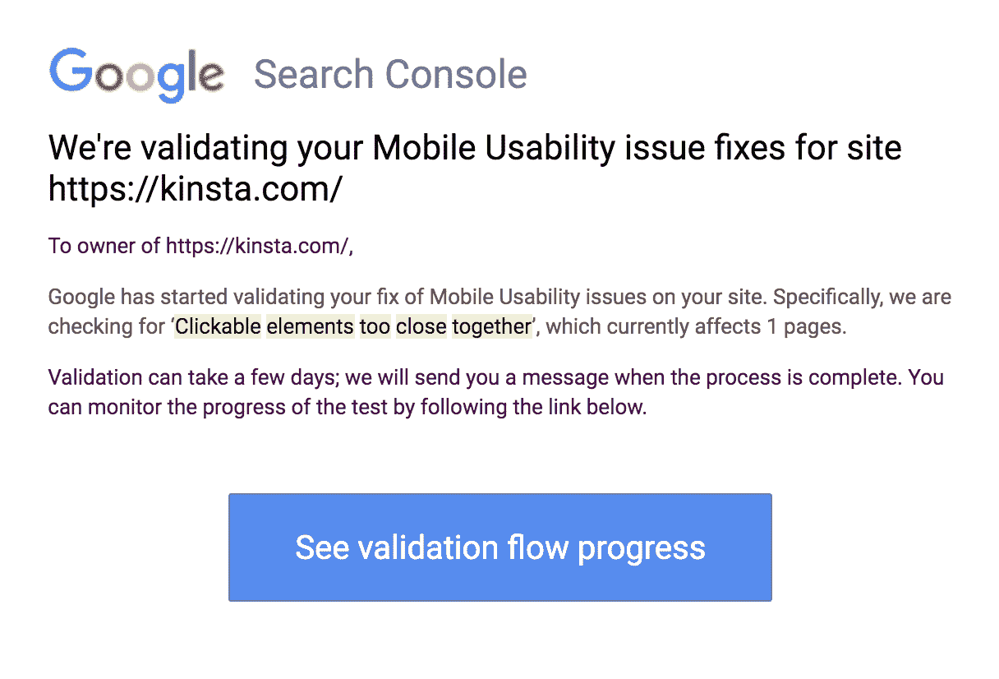

谷歌搜索控制台验证更新消息


如果您已经解决了错误，那么谷歌搜索控制台将显示一个“通过”的消息和一个绿色的复选标记。另一方面，如果您使用的修复没有通过验证，您将不得不重新访问错误以实现替代解决方案。

[43.2 亿人通过移动设备访问互联网...这意味着必须快速解决这个常见错误！😅很幸运，本指南在这里帮助⬇️ 点击推文](https://twitter.com/intent/tweet?url=https%3A%2F%2Fkinsta.com%2Fblog%2Fclickable-elements-too-close-together%2F&via=kinsta&text=4.32+billion+people+access+the+internet+from+their+mobile+devices...+which+means+that+it%27s+essential+to+get+this+common+error+resolved+quickly%21+%F0%9F%98%85+Luckily%2C+this+guide+is+here+to+help+%E2%AC%87%EF%B8%8F&hashtags=WPTips%2CUX)

## 摘要

未解决的移动可用性错误会导致糟糕的用户体验，并可能导致您的[网站流量](https://kinsta.com/blog/how-to-drive-traffic-to-your-website/)显著下降。通过采取措施解决可用性错误*，*，你可以确保你的网站是移动友好的，并且可以被更多的人访问。

在这篇文章中，您学习了如何使用三种方法来修复“可点击的元素靠得太近”的错误:

1.  使用前端 CSS 样式编辑器插件(如 YellowPencil)修改你的网站。
2.  使用 Chrome DevTools 确保所有可点击的目标都是 48 dpi 或更高。
3.  检查输入法并相应地调整您的 CSS。

对于修复“可点击的元素靠得太近”的错误，你有什么问题吗？请在下面的评论中告诉我们！

* * *

让你所有的[应用程序](https://kinsta.com/application-hosting/)、[数据库](https://kinsta.com/database-hosting/)和 [WordPress 网站](https://kinsta.com/wordpress-hosting/)在线并在一个屋檐下。我们功能丰富的高性能云平台包括:

*   在 MyKinsta 仪表盘中轻松设置和管理
*   24/7 专家支持
*   最好的谷歌云平台硬件和网络，由 Kubernetes 提供最大的可扩展性
*   面向速度和安全性的企业级 Cloudflare 集成
*   全球受众覆盖全球多达 35 个数据中心和 275 多个 pop

在第一个月使用托管的[应用程序或托管](https://kinsta.com/application-hosting/)的[数据库，您可以享受 20 美元的优惠，亲自测试一下。探索我们的](https://kinsta.com/database-hosting/)[计划](https://kinsta.com/plans/)或[与销售人员交谈](https://kinsta.com/contact-us/)以找到最适合您的方式。